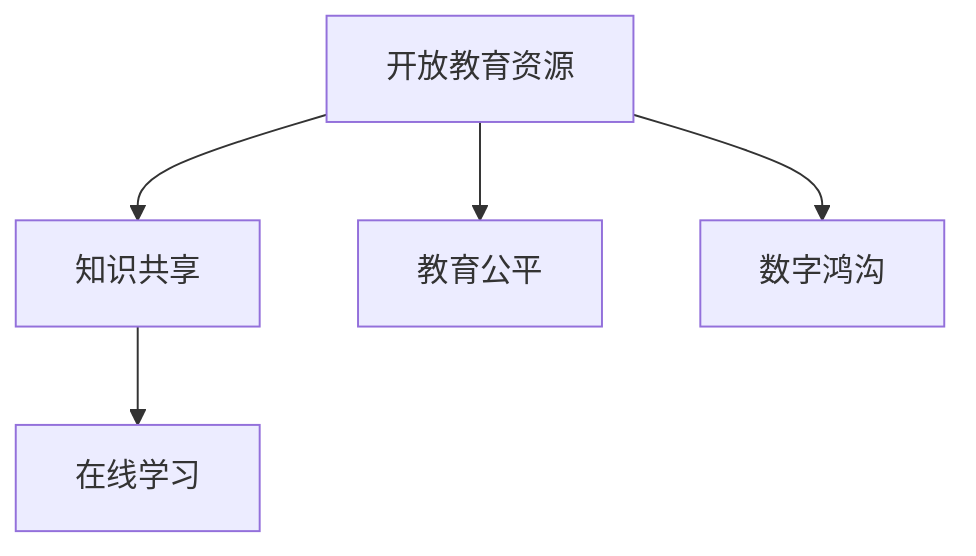

                 

# 知识的共享：开放教育资源的影响

> 关键词：开放教育资源,共享知识,教育公平,数字鸿沟,在线学习

## 1. 背景介绍

### 1.1 问题由来
在21世纪信息爆炸的时代，知识获取和传播的方式发生了翻天覆地的变化。传统的教科书、课堂教学等传统知识传播方式，已经无法满足越来越多人的学习需求。随着互联网技术的普及和电子设备的普遍使用，人们获取知识的途径日益多元化，开放教育资源（Open Educational Resources, OERs）应运而生。

开放教育资源通常指那些在互联网公开共享、任何人都可以免费获取或使用的教育材料和资源。这些资源包括课程讲义、视频讲座、教学案例、在线题库、模拟实验等多种形式。开放教育资源的应用不仅打破了时间和空间的限制，还为终身学习、个性化学习提供了可能。

### 1.2 问题核心关键点
开放教育资源的本质是一种知识共享和再利用的机制。通过这一机制，优质教育资源得以在不同地区、不同层次的教育机构之间传递，促进了教育资源的均衡分布，提升了教育公平性和学习效率。

开放教育资源的核心价值在于：
- **知识共享**：突破了教育资源的地理位置和版权限制，让更多人能够获取到优质的学习资源。
- **教育公平**：通过免费提供教育资源，缩小了城乡、贫富之间的教育差距。
- **个性化学习**：开放教育资源的多样性允许学生根据自己的兴趣和进度选择学习内容，进行个性化学习。
- **终身学习**：为终身学习者提供了便捷的学习途径，实现了知识的持续更新和自我提升。

### 1.3 问题研究意义
研究开放教育资源的影响，不仅对于教育技术领域具有重要意义，还对推动社会公平、提升公民素质具有深远影响。通过系统的研究，可以更清晰地理解开放教育资源如何影响教育资源的分配、教育公平性和学习效果，为政策制定和教育改革提供科学依据。

## 2. 核心概念与联系

### 2.1 核心概念概述

为更好地理解开放教育资源的影响，本节将介绍几个关键概念：

- **开放教育资源（OERs）**：指那些在互联网公开共享、任何人都可以免费获取或使用的教育材料和资源。
- **知识共享**：通过互联网平台实现教育资源的广泛传播和共享，打破时间和空间的限制。
- **教育公平**：通过免费提供优质教育资源，缩小不同地区、不同社会群体的教育差距。
- **在线学习**：利用互联网技术，通过在线平台进行学习，具有灵活性和便捷性。
- **数字鸿沟**：指由于网络基础设施和教育资源的不均衡分布，造成不同群体之间获取知识的机会差异。

这些概念之间的逻辑关系可以通过以下Mermaid流程图来展示：



这个流程图展示了开放教育资源的核心概念及其之间的关系：

1. 开放教育资源是知识共享的基石，通过互联网平台实现资源的广泛传播。
2. 教育公平是开放教育资源的主要目标之一，通过免费提供资源缩小教育差距。
3. 在线学习是开放教育资源的一种具体形式，通过互联网平台进行灵活学习。
4. 数字鸿沟是开放教育资源面临的主要挑战，需要通过技术手段和政策支持来解决。

## 3. 核心算法原理 & 具体操作步骤
### 3.1 算法原理概述

开放教育资源的影响，可以从多个维度进行分析，包括知识共享的广度和深度、教育公平的促进效果、在线学习的体验和效果等。本节将从知识共享的角度，详细讲解开放教育资源的核心算法原理。

### 3.2 算法步骤详解

开放教育资源的传播和利用主要涉及以下几个关键步骤：

1. **资源创建和发布**：教育机构或个人创建教育资源，并通过开放平台发布，确保资源的公开性和可访问性。
2. **资源聚合与分类**：开放平台对发布的资源进行整理和分类，形成结构化的资源库，便于用户检索和使用。
3. **用户访问与互动**：用户通过平台访问资源，进行学习、评论和分享，促进资源的进一步传播和完善。
4. **资源反馈与优化**：平台收集用户的反馈和评价，对资源进行迭代优化，提高资源的质量和适用性。
5. **跨平台互操作**：不同平台之间实现互操作，用户可以在多个平台间无缝切换，方便资源整合利用。

### 3.3 算法优缺点

开放教育资源在促进知识共享方面具有以下优点：
1. **资源丰富**：通过互联网平台汇集全球优质教育资源，丰富了学习者的学习选择。
2. **灵活便捷**：用户可以根据自己的时间和进度，灵活选择学习内容，提高了学习的便捷性。
3. **低成本**：免费提供高质量的教育资源，减少了学习者的经济负担。

同时，该方法也存在一定的局限性：
1. **资源质量参差不齐**：由于开放平台上的资源由不同机构和个人发布，质量参差不齐，需要用户具备一定的筛选能力。
2. **学习动力不足**：由于资源免费，部分用户可能缺乏学习动力，容易产生拖延和半途而废的情况。
3. **技术依赖性强**：开放教育资源的有效利用，依赖于网络基础设施和技术支持，部分地区可能存在数字鸿沟问题。
4. **知识产权问题**：开放教育资源的共享和再利用，可能涉及版权问题，需要合理的法律框架保障。

### 3.4 算法应用领域

开放教育资源的应用范围非常广泛，涵盖了从基础教育到高等教育、职业培训等多个领域。以下是几个典型的应用场景：

- **基础教育**：通过开放教育资源，为偏远地区和贫困地区的学生提供优质教材、教学视频和辅导材料，缩小城乡教育差距。
- **高等教育**：高校可以将公开课程、实验数据等资源分享给其他学校和学生，促进学术交流和知识共享。
- **职业培训**：开放教育资源为职业培训提供了丰富的学习材料，帮助职业人士提升技能，促进就业。
- **终身学习**：为成年学习者提供了便捷的在线学习途径，支持其终身学习和个人发展。
- **社会教育**：通过开放教育资源，提升公民素质，推动社会进步。

## 4. 数学模型和公式 & 详细讲解 & 举例说明
### 4.1 数学模型构建

本节将使用数学语言对开放教育资源的共享过程进行更加严格的刻画。

假设开放教育资源的总数为 $N$，用户数量为 $U$，每个用户使用资源的平均时间为 $T$，资源更新的速度为 $R$。定义知识共享的影响因子 $K$，用于衡量资源共享的广度和深度。

知识共享的影响因子 $K$ 可以通过以下公式计算：

$$
K = \frac{N}{U} \times \frac{T}{R}
$$

其中，$\frac{N}{U}$ 表示每个用户平均可以访问的资源数量，$\frac{T}{R}$ 表示每个资源被利用的频率。

### 4.2 公式推导过程

为了更直观地理解知识共享的影响因子 $K$，我们可以进一步简化公式：

假设每个用户平均访问 $k$ 个资源，每个资源被 $r$ 个用户利用，则：

$$
K = k \times r
$$

这表明知识共享的广度和深度，取决于用户访问资源的平均数量和每个资源被利用的频率。

### 4.3 案例分析与讲解

考虑一个开放教育平台，平台上有 $N=1000$ 个高质量的课程资源，每个课程被 $r=10$ 个用户利用，每个用户平均访问 $k=5$ 个课程。平台的资源更新速度为 $R=1$，即每周更新一次。

代入公式 $K = k \times r$ 得到：

$$
K = 5 \times 10 = 50
$$

这表示该平台的知识共享影响因子为 50，意味着每个用户平均每周可以访问到 50 个课程资源，并且这些资源有 10 个用户同时在利用。

## 5. 项目实践：代码实例和详细解释说明
### 5.1 开发环境搭建

在进行开放教育资源平台开发前，我们需要准备好开发环境。以下是使用Python进行Flask框架开发的环境配置流程：

1. 安装Anaconda：从官网下载并安装Anaconda，用于创建独立的Python环境。

2. 创建并激活虚拟环境：
```bash
conda create -n oer-env python=3.8 
conda activate oer-env
```

3. 安装Flask：
```bash
pip install flask
```

4. 安装Flask-RESTful：
```bash
pip install flask-restful
```

5. 安装SQLAlchemy：
```bash
pip install sqlalchemy
```

6. 安装SQLite3：
```bash
pip install sqlite3
```

完成上述步骤后，即可在`oer-env`环境中开始开发实践。

### 5.2 源代码详细实现

下面我们以开放教育资源平台的数据库设计为例，给出使用Flask框架进行开发的PyTorch代码实现。

首先，定义数据库模型：

```python
from sqlalchemy import Column, Integer, String, Date, Float
from sqlalchemy.ext.declarative import declarative_base

Base = declarative_base()

class Course(Base):
    __tablename__ = 'courses'

    id = Column(Integer, primary_key=True)
    name = Column(String(100), nullable=False)
    description = Column(String(255), nullable=False)
    created_at = Column(Date, default=datetime.datetime.utcnow)
    views = Column(Integer, default=0)
    users = Column(Integer, default=0)
    last_updated = Column(Date, nullable=False, onupdate=datetime.datetime.utcnow)

class User(Base):
    __tablename__ = 'users'

    id = Column(Integer, primary_key=True)
    name = Column(String(100), nullable=False)
    email = Column(String(100), unique=True, nullable=False)
    courses = relationship('Course', backref='users', lazy='dynamic')
```

然后，定义API接口：

```python
from flask import Flask, request, jsonify
from flask_restful import Resource, Api
from sqlalchemy import create_engine
from sqlalchemy.orm import sessionmaker

app = Flask(__name__)
api = Api(app)

engine = create_engine('sqlite:///./oer.db', echo=True)
Session = sessionmaker(bind=engine)
session = Session()

@app.route('/api/courses')
class CoursesResource(Resource):
    def get(self):
        courses = session.query(Course).all()
        return jsonify([{'id': course.id, 'name': course.name, 'views': course.views, 'users': course.users} for course in courses])

@app.route('/api/users')
class UsersResource(Resource):
    def get(self):
        users = session.query(User).all()
        return jsonify([{'id': user.id, 'name': user.name, 'courses': [course.name for course in user.courses]} for user in users])

if __name__ == '__main__':
    app.run(debug=True)
```

最后，启动服务器并访问测试：

```python
python app.py
# 访问 http://127.0.0.1:5000/api/courses 和 http://127.0.0.1:5000/api/users
```

### 5.3 代码解读与分析

让我们再详细解读一下关键代码的实现细节：

**Course和User模型**：
- `Course`模型：表示课程资源，包括课程ID、名称、描述、创建时间、访问次数、用户数和最后更新时间。
- `User`模型：表示平台用户，包括用户ID、姓名、邮箱、关联课程和注册时间。

**数据库配置**：
- 使用SQLAlchemy创建SQLite3数据库，定义了两个表，一个记录课程资源，一个记录用户信息。
- 在`Course`模型中定义了`views`和`users`字段，用于记录课程的访问次数和用户数。

**API接口**：
- `CoursesResource`类：定义了获取所有课程的API接口，查询数据库中的课程信息并返回JSON格式的数据。
- `UsersResource`类：定义了获取所有用户的API接口，查询数据库中的用户信息并返回JSON格式的数据。

**Flask框架**：
- 使用Flask框架搭建Web应用，通过`api`对象管理RESTful风格的API接口。
- 使用SQLAlchemy连接数据库，并创建Session对象进行数据操作。
- 在`get`方法中，通过SQLAlchemy的`query`方法获取数据库中的数据，并使用`jsonify`函数将数据转换为JSON格式返回。

可以看到，使用Flask框架可以方便地实现开放教育资源平台的API接口，通过简单的HTTP请求，即可获取所需数据，为平台开发提供了高效便捷的解决方案。

当然，工业级的系统实现还需考虑更多因素，如用户认证、权限控制、缓存机制等。但核心的数据库设计和API接口基本与此类似。

## 6. 实际应用场景
### 6.1 智能教育系统

开放教育资源的共享，可以为智能教育系统的构建提供丰富的学习材料和工具。传统教育系统往往受制于地域和资源限制，难以覆盖全体学生。通过开放教育资源平台，智能教育系统可以实现个性化和分布式学习，满足不同地区和学生的学习需求。

在技术实现上，智能教育系统可以整合开放教育资源，构建动态自适应学习路径。根据学生的学习进度和反馈，系统自动推荐适合的课程和资源，提供个性化的学习建议和辅助。同时，系统还可以通过自然语言处理技术，对学生的学习行为和成果进行分析和评估，提升教学效果和学习效率。

### 6.2 在线课程平台

在线课程平台是开放教育资源的重要应用场景之一。通过开放教育资源平台，在线课程可以以免费或低成本的方式向全球学生开放，打破了传统教育的地理和成本限制。

在技术实现上，在线课程平台可以通过API接口，提供丰富的课程内容、学习工具和互动功能。学生可以通过课程平台自由选择课程，随时随地进行学习。平台还可以通过数据分析和推荐算法，优化课程内容和推荐路径，提升学习体验和效果。

### 6.3 企业培训系统

企业培训是开放教育资源的重要应用领域之一。开放教育资源平台可以为企业提供多样化的培训资源，帮助员工提升技能，增强职业竞争力。

在技术实现上，企业培训系统可以整合开放教育资源，构建定制化的培训课程。通过在线平台和移动应用，员工可以随时随地进行培训学习。系统还可以通过学习管理系统(LMS)，记录员工的培训进度和成果，提供个性化的学习建议和评估报告。

### 6.4 未来应用展望

随着开放教育资源的不断发展和应用，未来的教育系统将呈现以下几个发展趋势：

1. **全栈学习平台**：未来的教育平台将整合多种学习方式，如在线课程、虚拟现实(VR)、增强现实(AR)等，提供沉浸式、互动式的学习体验。
2. **个性化学习路径**：通过数据分析和机器学习技术，为每位学生设计个性化的学习路径，实现因材施教。
3. **跨平台学习体验**：未来教育平台将支持多终端、多平台的学习，提供一致的学习体验，方便用户随时随地进行学习。
4. **智能辅导系统**：通过自然语言处理和人工智能技术，提供智能化的学习辅导，帮助学生解决学习难题，提升学习效果。
5. **社会化学习社区**：未来的教育平台将构建社会化学习社区，通过社交网络和协作工具，促进学生之间的交流和合作。

以上趋势凸显了开放教育资源的广阔前景。这些方向的探索发展，必将进一步推动教育技术的进步，为构建更公平、高效、个性化的教育体系奠定坚实基础。

## 7. 工具和资源推荐
### 7.1 学习资源推荐

为了帮助开发者系统掌握开放教育资源的应用，这里推荐一些优质的学习资源：

1. **Coursera和edX**：两个世界著名的在线教育平台，提供大量高质量的课程资源，涵盖从基础教育到高等教育的各个领域。
2. **Khan Academy**：提供免费的K-12教育课程，涵盖数学、科学、历史等多个学科，适合基础教育学习者使用。
3. **MIT OpenCourseWare**：麻省理工学院开放课程，提供大量高质量的课程视频、讲义和习题，适合高等教育学习者使用。
4. **Udacity**：提供编程、数据科学、人工智能等多个领域的在线课程，适合职业培训和进阶学习。
5. **Google Scholar**：免费的学术搜索引擎，提供大量学术论文和书籍，适合学术研究和论文写作。

通过对这些资源的学习实践，相信你一定能够快速掌握开放教育资源的精髓，并用于解决实际的教育问题。

### 7.2 开发工具推荐

高效的开发离不开优秀的工具支持。以下是几款用于开放教育资源平台开发的常用工具：

1. **Flask**：轻量级的Web框架，灵活便捷，适合构建API接口和Web应用。
2. **SQLAlchemy**：强大的ORM工具，支持多数据库，适合构建复杂的数据模型。
3. **Jupyter Notebook**：交互式的编程环境，适合进行数据分析和模型实验。
4. **Git**：版本控制系统，适合进行项目管理和代码协作。
5. **Docker**：容器化技术，适合进行应用部署和运行环境管理。
6. **Kubernetes**：容器编排工具，适合进行大规模应用的部署和管理。

合理利用这些工具，可以显著提升开放教育资源平台的开发效率，加快创新迭代的步伐。

### 7.3 相关论文推荐

开放教育资源的应用研究涉及多个学科领域，以下是几篇具有代表性的相关论文，推荐阅读：

1. **《The Khan Academy: Learning in the Open Web》**：Khan Academy的创始人Salman Khan在TED演讲中介绍了Khan Academy的学习平台和教育理念，探讨了开放教育资源在教育中的应用。
2. **《Moodle: Creating Open Educational Resources in the Classroom》**：介绍开源学习管理系统Moodle的功能和应用，探讨了如何利用Moodle构建开放教育资源平台。
3. **《Open Educational Resources in the Higher Education Sector: Challenges, Opportunities, and the Road Ahead》**：探讨了高等教育领域中开放教育资源的挑战和机遇，提出了未来的发展方向。
4. **《Open Educational Resources and Blended Learning: How Open Resources Can Support Blended Learning》**：探讨了开放教育资源与混合学习模式的结合，提供了具体的实践案例。
5. **《Open Educational Resources: A review of the research and implications for higher education》**：综述了开放教育资源的最新研究进展，探讨了其对高等教育的影响和未来发展趋势。

这些论文代表了开放教育资源领域的研究进展，通过学习这些前沿成果，可以帮助研究者把握学科前进方向，激发更多的创新灵感。

## 8. 总结：未来发展趋势与挑战
### 8.1 总结

本文对开放教育资源的应用和影响进行了全面系统的介绍。首先阐述了开放教育资源的本质和核心价值，明确了其对知识共享、教育公平和学习效率的重要贡献。其次，从算法原理和具体操作步骤的角度，详细讲解了开放教育资源的核心算法原理和操作步骤。同时，本文还广泛探讨了开放教育资源在智能教育、在线课程和企业培训等实际应用场景中的应用前景，展示了其广阔的应用潜力。

通过本文的系统梳理，可以看到，开放教育资源通过打破知识共享和教育的限制，推动了教育公平和个性化学习的实现。开放教育资源的应用，不仅提高了教育资源的利用效率，还为终身学习、社会进步提供了新的动力。未来，伴随开放教育资源的不断发展和应用，教育系统将变得更加灵活、高效和公平，为构建人人皆学、处处能学、时时可学的学习型社会奠定坚实基础。

### 8.2 未来发展趋势

展望未来，开放教育资源的应用和发展将呈现以下几个趋势：

1. **全面普及**：开放教育资源的普及将逐步覆盖全球各地，为更多学习者提供优质教育资源。
2. **技术融合**：开放教育资源将与人工智能、大数据、区块链等新兴技术深度融合，提升教育资源的智能化和安全性。
3. **多样性发展**：开放教育资源将涵盖多种学习形式，如在线课程、虚拟现实、增强现实等，提供更加丰富的学习体验。
4. **社会化互动**：未来的开放教育资源平台将构建社会化学习社区，促进学生之间的交流和合作，提升学习效果。
5. **政策支持**：政府和机构将出台更多政策支持开放教育资源的开发和应用，推动教育公平和高质量教育资源的普及。

以上趋势凸显了开放教育资源的广阔前景。这些方向的探索发展，必将进一步推动教育技术的进步，为构建更公平、高效、个性化的教育体系奠定坚实基础。

### 8.3 面临的挑战

尽管开放教育资源在推动教育公平和个性化学习方面具有重要价值，但在实际应用中也面临着诸多挑战：

1. **资源质量不均衡**：开放教育资源的质量参差不齐，部分资源可能不适合所有学习者的需求，需要进行筛选和评估。
2. **学习动力不足**：开放教育资源平台需要提供更多激励措施，引导学习者持续参与学习，避免半途而废。
3. **技术门槛高**：开发和维护开放教育资源平台需要具备较高的技术水平，对于一般教育机构和个人可能存在门槛。
4. **隐私和安全问题**：开放教育资源平台需要保障用户数据的隐私和安全，避免数据泄露和滥用。
5. **政策法律约束**：开放教育资源的开发和应用需要遵循相关法律法规，避免侵犯版权和知识产权。

这些挑战需要教育机构、技术开发者和政策制定者共同努力，通过多方协作和持续改进，才能最大化开放教育资源的潜力，推动教育公平和个性化学习的实现。

### 8.4 研究展望

面对开放教育资源面临的挑战，未来的研究需要在以下几个方面寻求新的突破：

1. **资源质量评估**：开发更加全面、科学的资源质量评估方法，帮助学习者筛选优质资源。
2. **学习激励机制**：设计更加有效的学习激励机制，激发学习者的积极性和持续参与。
3. **技术普及推广**：通过政策引导和培训支持，降低开放教育资源平台的技术门槛，提升平台普及度。
4. **隐私和安全保障**：加强用户数据的隐私保护和平台安全，构建可信的学习环境。
5. **跨平台互操作**：推动开放教育资源平台之间的互操作，实现资源整合和共享。

这些研究方向的探索，将推动开放教育资源的全面应用和持续改进，为构建人人皆学、处处能学、时时可学的学习型社会提供技术保障。

## 9. 附录：常见问题与解答

**Q1：开放教育资源如何影响教育公平？**

A: 开放教育资源通过提供免费的优质教育资源，打破了传统教育的地域、经济和资源限制，使得更多人能够获取到高质量的教育。这对于缩小城乡、贫富之间的教育差距具有重要意义。

**Q2：开放教育资源是否存在质量问题？**

A: 开放教育资源的质量参差不齐，部分资源可能不适合所有学习者的需求。解决这个问题的关键在于建立完善的质量评估机制，筛选和推荐优质资源。

**Q3：开放教育资源平台如何激励用户持续学习？**

A: 开放教育资源平台可以通过设计积分系统、排行榜、学习证书等多种激励机制，激发学习者的积极性和持续参与。同时，平台还可以通过学习社区和互动功能，增强学习者的归属感和动力。

**Q4：开放教育资源平台如何保障用户隐私和安全？**

A: 开放教育资源平台需要采用先进的数据加密技术和访问控制策略，保障用户数据的隐私和安全。同时，平台还需要建立明确的数据使用政策，规范数据使用行为，避免数据滥用和泄露。

**Q5：开放教育资源如何与人工智能技术结合？**

A: 开放教育资源可以与人工智能技术深度融合，通过自然语言处理、智能推荐、学习分析等技术，提升教育资源的智能化和个性化水平。例如，通过自然语言处理技术，分析学习者的学习行为和成果，提供个性化的学习建议和评估报告。

这些问题的解答，展示了开放教育资源在实际应用中面临的挑战和解决方案，有助于更好地理解和应用开放教育资源，推动教育公平和个性化学习的发展。

---

作者：禅与计算机程序设计艺术 / Zen and the Art of Computer Programming

