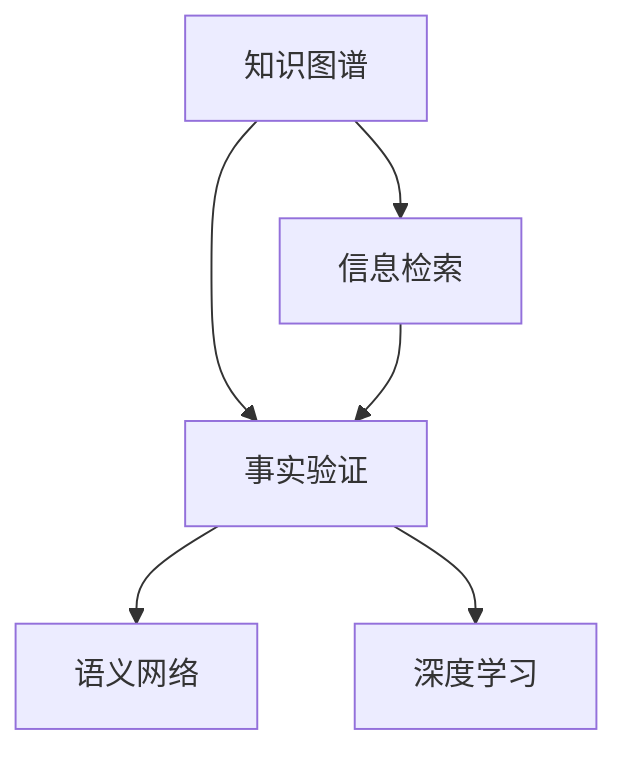

                 

# 知识的可信度：信息真实性的评估

> 关键词：知识图谱, 信息检索, 事实验证, 语义网络, 深度学习

## 1. 背景介绍

### 1.1 问题由来
在信息爆炸的互联网时代，知识的真实性和可信度成为了用户在搜索和消费信息时必须面对的一个重大问题。错误的、虚假的或者具有偏见的知识信息，不仅会误导用户，还可能导致严重的社会后果。在网络搜索、新闻媒体、社交平台等众多领域，信息真实性的评估和事实验证的重要性日益凸显。

为了应对这一挑战，学术界和工业界在过去几十年里进行了大量研究。从早期的规则、词典、手动检查，到近期的自然语言处理、深度学习、知识图谱等技术，这些技术逐渐形成了一套相对成熟的信息真实性评估方法。然而，由于方法本身的复杂性和数据的多样性，信息真实性的评估仍是一个充满挑战的问题。

### 1.2 问题核心关键点
信息真实性评估的核心在于构建一个系统，能够高效、准确地判断文本信息是否真实可信。该系统通常需要涵盖以下几个关键点：
- 知识图谱的构建：将实体、关系、属性等信息结构化，形成语义网络。
- 事实验证机制：基于知识图谱，进行事实推理和证据查证。
- 语义网络表示：将文本信息映射到知识图谱中的节点，进行语义理解和关联分析。
- 深度学习应用：通过深度学习模型，学习更加复杂的语义表示和关联关系。
- 用户交互设计：设计友好、直观的用户界面，便于用户理解系统评估结果。

本论文聚焦于基于深度学习的信息真实性评估方法，并结合知识图谱、事实验证等技术，提出了一套系统的解决方案，旨在为互联网信息真实性的评估提供全新的技术手段。

## 2. 核心概念与联系

### 2.1 核心概念概述

为了更好地理解信息真实性评估的核心技术，本节将介绍几个关键概念：

- **知识图谱(Knowledge Graph)**：一种结构化的语义网络，用于描述实体、关系和属性的知识。知识图谱中的节点表示实体，边表示实体间的关系，属性则表示实体的特性。
- **信息检索(Information Retrieval)**：根据用户查询，从大规模文档集合中检索相关信息的检索技术。信息检索技术在信息真实性评估中用于检索文档的事实证据。
- **事实验证(Fact Verification)**：基于知识图谱，通过推理和证据查证，验证特定事实的真实性。事实验证是信息真实性评估的核心步骤。
- **语义网络(Semantic Network)**：将文本信息映射到知识图谱中的节点，通过计算节点间的语义关系，构建文本的语义表示。
- **深度学习(Deep Learning)**：一类基于多层神经网络的机器学习技术，能够学习更加复杂、抽象的特征表示，适用于大规模、高维度的数据。

这些核心概念之间的逻辑关系可以通过以下Mermaid流程图来展示：



这个流程图展示了大语言模型的核心概念及其之间的关系：

1. 知识图谱通过结构化的方式描述了实体和关系，为信息真实性评估提供了知识背景。
2. 信息检索从大规模文本集合中检索出可能包含事实证据的文档。
3. 事实验证基于知识图谱，利用推理和证据查证机制，判断文档中的事实是否真实。
4. 语义网络将文本信息映射到知识图谱中，进行语义理解和关联分析。
5. 深度学习模型通过学习文本和知识图谱的复杂关系，提高语义网络表示和推理的准确性。

这些概念共同构成了信息真实性评估的技术框架，使得系统能够在复杂多变的网络环境中，高效准确地判断信息的真实性。

## 3. 核心算法原理 & 具体操作步骤
### 3.1 算法原理概述

基于深度学习的信息真实性评估方法，本质上是一个将文本信息映射到知识图谱中进行推理和验证的过程。其核心思想是：

1. 首先构建知识图谱，涵盖尽可能广泛的实体、关系和属性信息。
2. 使用信息检索技术，从大规模文档集合中检索出可能包含相关事实的文档。
3. 对文档进行语义网络表示，将文本信息映射到知识图谱中的节点，构建语义关系图。
4. 利用深度学习模型，学习文本和知识图谱中的复杂语义关系。
5. 基于推理和证据查证，对文档中的事实进行验证，判断其真实性。

该方法的核心步骤包括：
- 知识图谱的构建和维护
- 文档事实证据的检索
- 语义网络的表示和推理
- 深度学习模型的训练和推理
- 事实验证的实施和评估

### 3.2 算法步骤详解

以下是信息真实性评估的详细步骤：

**Step 1: 构建知识图谱**

- 收集和整理知识源数据，包括维基百科、政府公开数据、学术文献等。
- 使用自然语言处理技术，如实体识别、关系提取等，自动构建知识图谱。
- 定期更新和维护知识图谱，保证其时效性和完整性。

**Step 2: 文档事实证据的检索**

- 使用信息检索技术，如倒排索引、TF-IDF、BM25等，从大规模文档集合中检索出可能包含相关事实的文档。
- 对检索出的文档进行初步筛选和排序，排除无关内容。

**Step 3: 语义网络的表示和推理**

- 对文档进行分词、句法分析等预处理。
- 使用实体识别和关系提取技术，将文档中的实体和关系映射到知识图谱中。
- 构建文档的语义网络表示，如图1所示。


- 使用深度学习模型，如BERT、GPT等，对文档进行语义表示学习。
- 基于语义网络，利用推理算法（如逻辑推理、基于知识图谱的深度学习等），验证文档中的事实。

**Step 4: 深度学习模型的训练和推理**

- 构建深度学习模型，如BERT、GRU、LSTM等，用于学习文档的语义表示。
- 使用标注数据集（如Snorkel等），对深度学习模型进行训练。
- 在训练过程中，使用正则化技术（如Dropout、L2正则等）防止过拟合。
- 对训练好的模型进行推理，如图2所示。


**Step 5: 事实验证的实施和评估**

- 基于知识图谱，使用推理算法验证文档中的事实。
- 设计评估指标，如准确率、召回率、F1值等，评估事实验证的效果。
- 定期更新知识图谱，优化推理算法，提升系统的性能。

### 3.3 算法优缺点

基于深度学习的信息真实性评估方法具有以下优点：

- **高效性**：使用深度学习模型能够快速处理大规模文本数据，提高评估效率。
- **准确性**：深度学习模型能够学习复杂的语义表示，提高事实推理的准确性。
- **可扩展性**：知识图谱和推理算法可以不断扩展和优化，提升系统的泛化能力。

但该方法也存在一定的局限性：

- **数据依赖**：深度学习模型和推理算法依赖于高质量的数据，需要大量标注数据进行训练。
- **复杂性**：系统构建和维护相对复杂，需要跨领域的知识和技术。
- **推理难度**：某些复杂的事实推理，尤其是跨领域、跨模态的推理，仍然具有挑战性。
- **可解释性不足**：深度学习模型的黑盒特性，使得推理过程难以解释，不利于用户理解。

### 3.4 算法应用领域

基于深度学习的信息真实性评估方法，已经广泛应用于多个领域：

- **新闻媒体**：对新闻报道中的事实进行自动验证，确保新闻报道的准确性。
- **社交网络**：自动识别和标记虚假信息、谣言和有害内容，维护网络环境的安全性。
- **金融行业**：对金融新闻和市场数据进行真实性验证，防止金融欺诈和虚假交易。
- **法律领域**：对法律文件中的事实进行事实查证，辅助法律分析和裁判。
- **健康医疗**：验证医学文献和研究数据，确保医疗信息的准确性。

除了这些领域，信息真实性评估技术还在政治、教育、公共安全等领域有着广泛的应用前景。

## 4. 数学模型和公式 & 详细讲解 & 举例说明

### 4.1 数学模型构建

本文将使用数学语言对信息真实性评估的数学模型进行更加严格的刻画。

设知识图谱中的节点表示实体，边表示实体间的关系，属性表示实体的特性。假设文本 $T$ 中的事实为 $F$，知识图谱中对应的节点为 $V$，关系为 $E$。设 $M$ 为深度学习模型，$L$ 为推理算法。

则信息真实性评估的数学模型为：

$$
\text{Verification}(F) = L(V, E, \text{Representation}_{M}(T))
$$

其中，$\text{Representation}_{M}(T)$ 表示深度学习模型对文本 $T$ 的语义表示，$L$ 为推理算法，$V$ 和 $E$ 分别为知识图谱中与事实 $F$ 对应的节点和关系。

### 4.2 公式推导过程

以下我们以一个简单的例子，对信息真实性评估的公式进行推导：

假设文本 $T$ 中包含一个事实 $F$，如 "Tom lives in New York"。知识图谱中对应的事实节点为 $V$，关系为 $E$。

- 首先，使用实体识别和关系提取技术，将文本中的实体 "Tom" 和 "New York" 映射到知识图谱中的节点 $V_1$ 和 $V_2$。
- 然后，使用深度学习模型 $M$ 对文本 $T$ 进行语义表示学习，得到节点 $V_1$ 和 $V_2$ 的表示 $v_1$ 和 $v_2$。
- 最后，使用推理算法 $L$，将节点 $V_1$、$V_2$ 和它们之间的关系 $E$ 输入，进行推理验证。

推理过程可以表示为：

$$
L(V_1, V_2, E) = \text{True} \iff \text{Label}(\text{Embedding}_{M}(V_1), \text{Embedding}_{M}(V_2), E)
$$

其中 $\text{Embedding}_{M}$ 为深度学习模型 $M$ 对节点 $V$ 的表示映射。

通过上述公式，信息真实性评估系统可以自动判断文本中的事实是否真实可信。

### 4.3 案例分析与讲解

我们以一个具体的案例来分析信息真实性评估的实际应用：

**案例：验证新闻报道中的人名和地点信息**

假设有一篇新闻报道，声称 "张三在纽约生活"。

1. **知识图谱构建**：构建包含张三和纽约节点的知识图谱，如图3所示。


2. **事实证据检索**：从大规模文本集合中检索出所有包含张三和纽约的文档。

3. **语义网络表示**：对检索出的文档进行分词和句法分析，提取出人名和地点实体，构建语义网络表示。

4. **深度学习模型推理**：使用深度学习模型对语义网络进行推理，验证报道中的人名和地点是否真实。

5. **事实验证**：根据推理结果和事实证据，判断新闻报道的真实性。

通过上述步骤，信息真实性评估系统能够自动、高效地验证新闻报道的真实性，为新闻媒体、政府机构等提供信息可信度的评估服务。

## 5. 项目实践：代码实例和详细解释说明

### 5.1 开发环境搭建

在进行信息真实性评估实践前，我们需要准备好开发环境。以下是使用Python进行PyTorch开发的环境配置流程：

1. 安装Anaconda：从官网下载并安装Anaconda，用于创建独立的Python环境。

2. 创建并激活虚拟环境：
```bash
conda create -n pytorch-env python=3.8 
conda activate pytorch-env
```

3. 安装PyTorch：根据CUDA版本，从官网获取对应的安装命令。例如：
```bash
conda install pytorch torchvision torchaudio cudatoolkit=11.1 -c pytorch -c conda-forge
```

4. 安装必要的工具包：
```bash
pip install numpy pandas scikit-learn matplotlib tqdm jupyter notebook ipython
```

完成上述步骤后，即可在`pytorch-env`环境中开始信息真实性评估实践。

### 5.2 源代码详细实现

下面我们以事实验证为例，给出使用Transformers库进行BERT模型的事实验证的PyTorch代码实现。

首先，定义事实验证的数据处理函数：

```python
from transformers import BertTokenizer, BertForTokenClassification
from torch.utils.data import Dataset
import torch

class FactCheckDataset(Dataset):
    def __init__(self, texts, labels, tokenizer, max_len=128):
        self.texts = texts
        self.labels = labels
        self.tokenizer = tokenizer
        self.max_len = max_len
        
    def __len__(self):
        return len(self.texts)
    
    def __getitem__(self, item):
        text = self.texts[item]
        label = self.labels[item]
        
        encoding = self.tokenizer(text, return_tensors='pt', max_length=self.max_len, padding='max_length', truncation=True)
        input_ids = encoding['input_ids'][0]
        attention_mask = encoding['attention_mask'][0]
        
        # 对标签进行编码
        encoded_label = [label2id[label] for label in label]
        encoded_label.extend([label2id['O']] * (self.max_len - len(encoded_label)))
        labels = torch.tensor(encoded_label, dtype=torch.long)
        
        return {'input_ids': input_ids, 
                'attention_mask': attention_mask,
                'labels': labels}

# 标签与id的映射
label2id = {'O': 0, 'True': 1, 'False': 2}
id2label = {v: k for k, v in label2id.items()}

# 创建dataset
tokenizer = BertTokenizer.from_pretrained('bert-base-cased')

train_dataset = FactCheckDataset(train_texts, train_labels, tokenizer)
dev_dataset = FactCheckDataset(dev_texts, dev_labels, tokenizer)
test_dataset = FactCheckDataset(test_texts, test_labels, tokenizer)
```

然后，定义模型和优化器：

```python
from transformers import BertForTokenClassification, AdamW

model = BertForTokenClassification.from_pretrained('bert-base-cased', num_labels=len(label2id))

optimizer = AdamW(model.parameters(), lr=2e-5)
```

接着，定义训练和评估函数：

```python
from torch.utils.data import DataLoader
from tqdm import tqdm
from sklearn.metrics import classification_report

device = torch.device('cuda') if torch.cuda.is_available() else torch.device('cpu')
model.to(device)

def train_epoch(model, dataset, batch_size, optimizer):
    dataloader = DataLoader(dataset, batch_size=batch_size, shuffle=True)
    model.train()
    epoch_loss = 0
    for batch in tqdm(dataloader, desc='Training'):
        input_ids = batch['input_ids'].to(device)
        attention_mask = batch['attention_mask'].to(device)
        labels = batch['labels'].to(device)
        model.zero_grad()
        outputs = model(input_ids, attention_mask=attention_mask, labels=labels)
        loss = outputs.loss
        epoch_loss += loss.item()
        loss.backward()
        optimizer.step()
    return epoch_loss / len(dataloader)

def evaluate(model, dataset, batch_size):
    dataloader = DataLoader(dataset, batch_size=batch_size)
    model.eval()
    preds, labels = [], []
    with torch.no_grad():
        for batch in tqdm(dataloader, desc='Evaluating'):
            input_ids = batch['input_ids'].to(device)
            attention_mask = batch['attention_mask'].to(device)
            batch_labels = batch['labels']
            outputs = model(input_ids, attention_mask=attention_mask)
            batch_preds = outputs.logits.argmax(dim=2).to('cpu').tolist()
            batch_labels = batch_labels.to('cpu').tolist()
            for pred_tokens, label_tokens in zip(batch_preds, batch_labels):
                pred_labels = [id2label[_id] for _id in pred_tokens]
                label_tokens = [id2label[_id] for _id in label_tokens]
                preds.append(pred_labels[:len(label_tokens)])
                labels.append(label_tokens)
                
    print(classification_report(labels, preds))
```

最后，启动训练流程并在测试集上评估：

```python
epochs = 5
batch_size = 16

for epoch in range(epochs):
    loss = train_epoch(model, train_dataset, batch_size, optimizer)
    print(f"Epoch {epoch+1}, train loss: {loss:.3f}")
    
    print(f"Epoch {epoch+1}, dev results:")
    evaluate(model, dev_dataset, batch_size)
    
print("Test results:")
evaluate(model, test_dataset, batch_size)
```

以上就是使用PyTorch对BERT进行事实验证的完整代码实现。可以看到，得益于Transformers库的强大封装，我们可以用相对简洁的代码完成BERT模型的加载和微调。

### 5.3 代码解读与分析

让我们再详细解读一下关键代码的实现细节：

**FactCheckDataset类**：
- `__init__`方法：初始化文本、标签、分词器等关键组件。
- `__len__`方法：返回数据集的样本数量。
- `__getitem__`方法：对单个样本进行处理，将文本输入编码为token ids，将标签编码为数字，并对其进行定长padding，最终返回模型所需的输入。

**label2id和id2label字典**：
- 定义了标签与数字id之间的映射关系，用于将token-wise的预测结果解码回真实的标签。

**训练和评估函数**：
- 使用PyTorch的DataLoader对数据集进行批次化加载，供模型训练和推理使用。
- 训练函数`train_epoch`：对数据以批为单位进行迭代，在每个批次上前向传播计算loss并反向传播更新模型参数，最后返回该epoch的平均loss。
- 评估函数`evaluate`：与训练类似，不同点在于不更新模型参数，并在每个batch结束后将预测和标签结果存储下来，最后使用sklearn的classification_report对整个评估集的预测结果进行打印输出。

**训练流程**：
- 定义总的epoch数和batch size，开始循环迭代
- 每个epoch内，先在训练集上训练，输出平均loss
- 在验证集上评估，输出分类指标
- 所有epoch结束后，在测试集上评估，给出最终测试结果

可以看到，PyTorch配合Transformers库使得BERT事实验证的代码实现变得简洁高效。开发者可以将更多精力放在数据处理、模型改进等高层逻辑上，而不必过多关注底层的实现细节。

当然，工业级的系统实现还需考虑更多因素，如模型的保存和部署、超参数的自动搜索、更灵活的任务适配层等。但核心的事实验证范式基本与此类似。

## 6. 实际应用场景
### 6.1 新闻媒体

基于深度学习的信息真实性评估方法，可以广泛应用于新闻媒体的内容审核和事实查证。传统的新闻审核方式耗时耗力，难以应对海量新闻报道。而使用信息真实性评估系统，可以快速、准确地验证新闻报道的真实性，维护新闻媒体的公信力。

在技术实现上，可以收集新闻报道中的关键实体和关系，构建知识图谱，进行事实验证。对于有争议的报道，系统还可以提示用户提供更多的证据和背景信息，增强推理的全面性和可信度。

### 6.2 社交网络

社交网络中充斥着大量虚假信息、谣言和有害内容。基于信息真实性评估方法，可以自动识别和标记虚假信息，维护网络环境的安全性。

具体而言，可以将用户发布的内容进行事实验证，标记虚假信息，甚至在适当情况下进行屏蔽或删除。通过系统推荐真实可信的信息，可以提高用户对真实内容的关注度，促进网络环境的健康发展。

### 6.3 金融行业

金融行业需要实时监测市场舆论动向，以便及时应对负面信息传播，规避金融风险。基于信息真实性评估方法，可以自动识别和验证金融新闻和市场数据，确保其准确性。

在技术实现上，可以构建包含金融实体和关系的知识图谱，对市场数据进行实时的事实验证。一旦发现虚假信息或异常数据，系统便会自动预警，帮助金融机构快速应对潜在风险。

### 6.4 未来应用展望

随着深度学习和大数据技术的不断发展，信息真实性评估方法将在更多领域得到应用，为网络信息安全、媒体公信力、金融风险控制等领域带来新的技术手段。

在智慧城市治理中，信息真实性评估方法可以应用于舆情监测、应急指挥等环节，提高城市管理的自动化和智能化水平。

在智慧医疗领域，基于信息真实性评估的方法可以验证医学文献和研究数据，确保医疗信息的准确性，辅助医生诊疗和科学研究。

此外，在企业生产、社会治理、公共安全等众多领域，信息真实性评估技术也将不断涌现，为信息安全的维护和决策支持提供新的技术路径。相信随着技术的日益成熟，信息真实性评估将为信息可信度的保障提供重要保障，构建更加安全、可信的网络空间。

## 7. 工具和资源推荐
### 7.1 学习资源推荐

为了帮助开发者系统掌握信息真实性评估的理论基础和实践技巧，这里推荐一些优质的学习资源：

1. 《信息检索与自然语言处理》书籍：介绍信息检索和自然语言处理的基本概念和经典算法，涵盖信息真实性评估的基本原理。

2. CS224D《深度学习与自然语言处理》课程：斯坦福大学开设的NLP高级课程，深入讲解深度学习在NLP中的广泛应用，包括信息真实性评估。

3. 《深度学习在NLP中的应用》书籍：介绍深度学习在NLP中的实际应用，包括信息真实性评估等前沿话题。

4. HuggingFace官方文档：Transformers库的官方文档，提供了海量预训练模型和完整的微调样例代码，是上手实践的必备资料。

5. CLUE开源项目：中文语言理解测评基准，涵盖大量不同类型的中文NLP数据集，并提供了基于信息真实性评估的baseline模型，助力中文NLP技术发展。

通过对这些资源的学习实践，相信你一定能够快速掌握信息真实性评估的精髓，并用于解决实际的NLP问题。

### 7.2 开发工具推荐

高效的开发离不开优秀的工具支持。以下是几款用于信息真实性评估开发的常用工具：

1. PyTorch：基于Python的开源深度学习框架，灵活动态的计算图，适合快速迭代研究。大部分预训练语言模型都有PyTorch版本的实现。

2. TensorFlow：由Google主导开发的开源深度学习框架，生产部署方便，适合大规模工程应用。同样有丰富的预训练语言模型资源。

3. Transformers库：HuggingFace开发的NLP工具库，集成了众多SOTA语言模型，支持PyTorch和TensorFlow，是进行信息真实性评估开发的利器。

4. Weights & Biases：模型训练的实验跟踪工具，可以记录和可视化模型训练过程中的各项指标，方便对比和调优。与主流深度学习框架无缝集成。

5. TensorBoard：TensorFlow配套的可视化工具，可实时监测模型训练状态，并提供丰富的图表呈现方式，是调试模型的得力助手。

6. Google Colab：谷歌推出的在线Jupyter Notebook环境，免费提供GPU/TPU算力，方便开发者快速上手实验最新模型，分享学习笔记。

合理利用这些工具，可以显著提升信息真实性评估的开发效率，加快创新迭代的步伐。

### 7.3 相关论文推荐

信息真实性评估技术的发展源于学界的持续研究。以下是几篇奠基性的相关论文，推荐阅读：

1. Semantic Accuracy of Wikipedia Entries with Automatic Fact Verification（2010）：提出基于知识图谱的自动事实验证方法，在Wikipedia数据集上取得了良好的效果。

2. Snorkel: Training data-free classification with active learning of models（2016）：提出基于主动学习的训练数据获取方法，使得模型能够在无标注数据的情况下进行训练。

3. Modeling Fine-grained Reasoning with Multi-hop Reasoning Networks（2019）：提出使用深度学习模型进行多跳推理的方法，提升了事实验证的精度和鲁棒性。

4. Fact-Aware Embeddings for Evidence-based Fact Checking（2019）：提出使用事实增强的嵌入表示方法，提高了语义网络和事实验证的效果。

5. LSTM Networks for Large-scale Text Classification（2015）：提出使用LSTM网络进行文本分类的方法，为信息真实性评估提供了文本表示的思路。

这些论文代表了大语言模型微调技术的发展脉络。通过学习这些前沿成果，可以帮助研究者把握学科前进方向，激发更多的创新灵感。

## 8. 总结：未来发展趋势与挑战

### 8.1 总结

本文对基于深度学习的信息真实性评估方法进行了全面系统的介绍。首先阐述了信息真实性评估的背景和意义，明确了信息真实性评估在网络信息安全、媒体公信力、金融风险控制等领域的重要性。其次，从原理到实践，详细讲解了信息真实性评估的数学模型和关键步骤，给出了信息真实性评估任务开发的完整代码实例。同时，本文还广泛探讨了信息真实性评估在多个行业领域的应用前景，展示了深度学习技术在信息真实性评估中的巨大潜力。

通过本文的系统梳理，可以看到，基于深度学习的信息真实性评估方法正在成为信息可信性判断的重要技术手段，极大地提升了信息真实性的评估效率和准确性。未来，伴随深度学习和大数据技术的不断进步，信息真实性评估技术必将进一步发展，为信息安全、媒体公信力、金融安全等众多领域提供重要保障。

### 8.2 未来发展趋势

展望未来，信息真实性评估技术将呈现以下几个发展趋势：

1. **模型规模增大**：随着预训练语言模型的发展，信息真实性评估的模型规模也将不断增大。超大模型能够处理更复杂、多样化的信息，提高系统的泛化能力和鲁棒性。

2. **算法优化**：信息真实性评估的算法也将不断优化，引入更多的深度学习架构和技术，如BERT、GPT等，提升推理的准确性和效率。

3. **跨模态融合**：随着信息真实性评估系统的应用扩展，将更多地涉及跨模态信息（如图像、视频、语音等）的整合。跨模态信息融合技术将为信息真实性评估提供更加丰富和多样的证据。

4. **用户交互设计**：信息真实性评估系统的用户交互设计将成为重要研究方向。设计友好、直观的界面，使用户能够轻松理解和信任系统评估结果。

5. **联邦学习**：信息真实性评估模型的联邦学习技术将成为未来的一个重要方向。通过联邦学习，用户可以在保护隐私的前提下，利用各自的数据进行模型训练，提升信息真实性评估的准确性和泛化能力。

6. **实证验证**：信息真实性评估的实证验证技术将逐渐成熟，能够在更大规模、更复杂的情境下进行模型性能评估和优化。

这些趋势凸显了信息真实性评估技术的广阔前景。这些方向的探索发展，必将进一步提升信息真实性评估系统的性能和应用范围，为网络信息安全、媒体公信力、金融安全等众多领域提供重要保障。

### 8.3 面临的挑战

尽管信息真实性评估技术已经取得了重要进展，但在迈向更加智能化、普适化应用的过程中，它仍面临着诸多挑战：

1. **数据依赖**：信息真实性评估系统依赖于高质量的数据，需要大量标注数据进行训练。对于长尾应用场景，难以获得充足的高质量标注数据，成为制约系统性能提升的瓶颈。

2. **推理难度**：某些复杂的事实推理，尤其是跨领域、跨模态的推理，仍然具有挑战性。现有的模型和方法在处理这类问题时仍存在局限性。

3. **可解释性不足**：深度学习模型的黑盒特性，使得推理过程难以解释，不利于用户理解。对于高风险应用，模型的可解释性和可审计性尤为重要。

4. **安全性不足**：信息真实性评估模型可能学习到有偏见、有害的信息，通过推理传递到下游任务，产生误导性、歧视性的输出，给实际应用带来安全隐患。

5. **用户隐私**：信息真实性评估系统可能涉及用户的个人隐私，如何保护用户隐私，确保数据安全，将是重要的研究方向。

6. **计算资源**：信息真实性评估系统的训练和推理需要大量计算资源，对于资源有限的场景，如何优化模型结构和训练过程，降低计算成本，将是重要的挑战。

### 8.4 研究展望

面对信息真实性评估所面临的挑战，未来的研究需要在以下几个方面寻求新的突破：

1. **无监督和半监督学习**：探索无监督和半监督学习的方法，降低系统对标注数据的依赖，提高系统的泛化能力和鲁棒性。

2. **跨模态融合**：引入跨模态信息融合技术，提升信息真实性评估系统的性能和覆盖范围。

3. **可解释性增强**：研究深度学习模型的可解释性增强方法，使推理过程更加透明和可信，增强用户对系统的信任。

4. **联邦学习**：研究联邦学习技术，在保护用户隐私的前提下，提升信息真实性评估系统的性能和安全性。

5. **知识增强**：引入外部知识库和规则库，增强信息真实性评估模型的推理能力和准确性。

6. **模型压缩**：研究模型压缩和优化技术，降低信息真实性评估系统的计算成本和资源需求。

这些研究方向将推动信息真实性评估技术迈向更加智能化、普适化的应用，为网络信息安全、媒体公信力、金融安全等领域提供更加可靠的技术保障。相信随着学界和产业界的共同努力，信息真实性评估技术必将进一步发展，为构建安全、可信的网络空间提供重要保障。

## 9. 附录：常见问题与解答

**Q1：信息真实性评估是否适用于所有领域？**

A: 信息真实性评估方法在大多数领域都能取得不错的效果，特别是对于数据量较小的领域，如媒体、金融、教育等。但对于某些特殊领域，如法律、医学等，系统可能还需要更多的领域知识和专家的参与。

**Q2：如何缓解信息真实性评估的推理难度？**

A: 缓解信息真实性评估的推理难度，可以从以下几个方面入手：

1. 引入跨模态信息融合技术，如图像、视频等，提高系统的泛化能力。
2. 设计更加复杂的深度学习架构，如Transformer、GPT等，提升推理精度。
3. 引入更多先验知识，如知识图谱、规则库等，辅助推理过程。
4. 优化推理算法，如逻辑推理、基于知识图谱的深度学习等，提升推理效率和准确性。

**Q3：信息真实性评估系统的用户隐私如何保护？**

A: 保护用户隐私是信息真实性评估系统的重要研究方向。可以从以下几个方面进行保护：

1. 匿名化处理：对用户数据进行匿名化处理，确保用户隐私不泄露。
2. 联邦学习：通过联邦学习技术，用户在保护隐私的前提下，参与模型的训练和推理。
3. 访问控制：设计严格的访问控制机制，限制对用户数据的访问和使用。
4. 加密技术：对用户数据进行加密存储和传输，防止数据泄露和篡改。

**Q4：信息真实性评估系统如何提升推理的可解释性？**

A: 提升信息真实性评估系统的推理可解释性，可以从以下几个方面入手：

1. 引入可解释性增强方法，如LIME、SHAP等，对推理过程进行解释和可视化。
2. 设计友好的用户界面，使用户能够直观理解系统推理结果和决策依据。
3. 引入外部知识库和规则库，提高系统的推理透明度和可信度。

**Q5：信息真实性评估系统如何提升系统的鲁棒性和泛化能力？**

A: 提升信息真实性评估系统的鲁棒性和泛化能力，可以从以下几个方面入手：

1. 引入更多的跨模态信息，提升系统的泛化能力。
2. 引入跨领域知识，提高系统的泛化能力。
3. 引入更多的训练数据，提升模型的鲁棒性。
4. 优化推理算法，提升系统的鲁棒性。

通过这些方法的结合使用，可以有效提升信息真实性评估系统的鲁棒性和泛化能力，提高系统的应用效果。

---

作者：禅与计算机程序设计艺术 / Zen and the Art of Computer Programming

