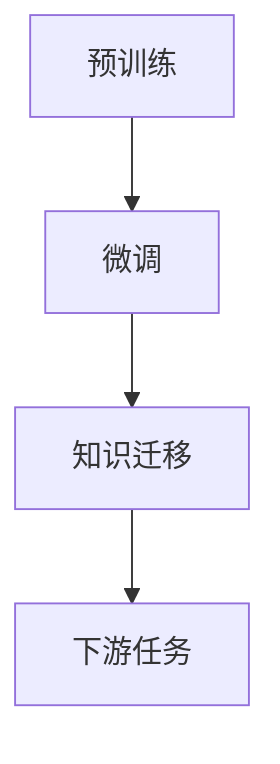

                 

# 知识的可迁移性：跨领域应用的潜力

> 关键词：知识迁移, 跨领域应用, 人工智能, 深度学习, 迁移学习, 自然语言处理, 计算机视觉

## 1. 背景介绍

知识的可迁移性（Knowledge Transferability）是指将一个领域学到的知识迁移到另一个不同但相关的领域中。这一现象在机器学习和人工智能中尤为显著，尤其在深度学习时代，大量的预训练模型通过在大型无标签数据集上进行自监督训练，学习到通用的特征表示，然后通过微调或迁移学习应用于各种具体的下游任务中。知识的可迁移性不仅降低了数据和计算资源的消耗，同时也提升了模型的泛化能力和效率。

这一概念起源于心理学，指的是个体在一种情境中学习的知识和技能能够被应用于另一种新情境中。在人工智能中，知识的迁移性通过迁移学习（Transfer Learning）得以实现。迁移学习通过在源任务上训练得到的模型知识，帮助模型在目标任务上获得更快的收敛速度和更高的性能。

近年来，随着深度学习和大模型的发展，迁移学习成为了人工智能领域的一个重要研究课题，尤其在自然语言处理（NLP）和计算机视觉（CV）等领域，迁移学习被广泛应用于提升模型的效果和效率。本文将重点探讨知识的可迁移性在人工智能中的实现机制和应用潜力，同时结合案例分析，展示其在跨领域应用中的实践效果。

## 2. 核心概念与联系

### 2.1 核心概念概述

为了更好地理解知识的可迁移性及其在人工智能中的应用，我们首先定义几个核心概念：

- **迁移学习（Transfer Learning）**：利用源任务中学到的知识，帮助模型在目标任务上获得更好的性能。在深度学习中，迁移学习通常包括两个阶段：预训练（Pre-training）和微调（Fine-tuning）。
- **预训练（Pre-training）**：在大型无标签数据集上训练深度学习模型，学习到通用的特征表示。常见的预训练任务包括自回归语言模型、自编码器等。
- **微调（Fine-tuning）**：在预训练模型的基础上，通过在有标签的源任务数据上进行训练，调整模型参数，使其适应目标任务的特征和需求。
- **知识迁移（Knowledge Transferability）**：通过迁移学习，将一个领域学到的知识迁移到另一个领域中，提升模型在新任务上的表现。

### 2.2 核心概念原理和架构的 Mermaid 流程图



这个流程图展示了迁移学习的核心流程：

1. **预训练**：在大型无标签数据集上训练深度学习模型，学习通用的特征表示。
2. **微调**：在预训练模型的基础上，通过在有标签的源任务数据上进行训练，调整模型参数，使其适应目标任务的特征和需求。
3. **知识迁移**：将预训练和微调得到的知识迁移到目标任务中，提升模型在新任务上的表现。

## 3. 核心算法原理 & 具体操作步骤

### 3.1 算法原理概述

迁移学习的核心思想是利用源任务中学到的知识，帮助模型在目标任务上获得更好的性能。这一过程通常包括以下几个步骤：

1. **预训练**：在大规模无标签数据集上训练深度学习模型，学习通用的特征表示。
2. **微调**：在预训练模型的基础上，通过在有标签的源任务数据上进行训练，调整模型参数，使其适应目标任务的特征和需求。
3. **迁移**：将预训练和微调得到的知识迁移到目标任务中，提升模型在新任务上的表现。

### 3.2 算法步骤详解

以下是一个详细的迁移学习步骤：

1. **数据准备**：收集源任务和目标任务的数据集，并进行预处理，如归一化、标签编码等。
2. **预训练模型选择**：选择合适的预训练模型，如BERT、GPT等，并将其作为迁移学习的基础。
3. **微调参数设定**：设置微调的超参数，如学习率、批大小、迭代轮数等，以及正则化技术，如L2正则、Dropout等。
4. **微调模型训练**：使用源任务的数据集对预训练模型进行微调，更新模型参数。
5. **迁移知识应用**：将微调后的模型应用于目标任务，评估模型在新任务上的表现。

### 3.3 算法优缺点

迁移学习的优点包括：

- **数据效率高**：相比于从头训练模型，迁移学习在少量标注数据的情况下也能获得较好的性能。
- **泛化能力强**：预训练模型在大规模无标签数据上学习到通用的特征表示，有助于模型泛化到新的任务和数据。
- **训练时间短**：预训练和微调过程可以显著缩短模型训练时间。

同时，迁移学习也存在一些缺点：

- **模型适应性有限**：预训练模型学习到的特征可能不适用于所有新任务，需要针对具体任务进行调整。
- **数据分布差异**：源任务和目标任务的分布差异可能影响迁移效果。
- **迁移学习公平性问题**：源任务和目标任务之间可能存在不平等的数据分布，影响迁移效果。

### 3.4 算法应用领域

迁移学习在多个领域都有广泛应用，包括：

- **自然语言处理（NLP）**：如文本分类、命名实体识别、机器翻译等任务。
- **计算机视觉（CV）**：如图像分类、目标检测、图像生成等任务。
- **语音识别**：如语音命令识别、情感分析等任务。
- **推荐系统**：如商品推荐、新闻推荐等任务。
- **医疗诊断**：如病理图像分类、疾病预测等任务。

## 4. 数学模型和公式 & 详细讲解 & 举例说明

### 4.1 数学模型构建

假设我们有一个预训练的深度学习模型 $M_{\theta}$，其中 $\theta$ 是模型参数。在源任务上，我们有一个训练集 $D_s=\{(x_i,y_i)\}_{i=1}^N$，其中 $x_i$ 是输入样本，$y_i$ 是对应的标签。在目标任务上，我们有一个训练集 $D_t=\{(x_j,y_j)\}_{j=1}^M$。我们的目标是通过微调，将模型 $M_{\theta}$ 应用于目标任务，获得模型参数 $\hat{\theta}$，使得模型在目标任务上的性能最大化。

### 4.2 公式推导过程

在预训练和微调过程中，我们使用交叉熵损失函数来衡量模型预测输出与真实标签之间的差异。对于源任务，损失函数为：

$$
\mathcal{L}_s = \frac{1}{N}\sum_{i=1}^N -y_i\log M_{\theta}(x_i)
$$

对于目标任务，损失函数为：

$$
\mathcal{L}_t = \frac{1}{M}\sum_{j=1}^M -y_j\log \hat{M}_{\theta}(x_j)
$$

其中 $\hat{M}_{\theta}$ 是微调后的模型。微调的优化目标是最小化损失函数：

$$
\hat{\theta} = \mathop{\arg\min}_{\theta} (\mathcal{L}_s + \lambda \mathcal{L}_t)
$$

其中 $\lambda$ 是正则化系数，用于平衡源任务和目标任务的损失。

### 4.3 案例分析与讲解

以自然语言处理中的文本分类任务为例，我们首先在大规模无标签数据集上进行预训练，得到一个通用的文本表示模型。然后，在特定领域的文本分类数据集上进行微调，使得模型能够准确地对新领域的文本进行分类。

具体实现步骤如下：

1. **预训练**：使用BERT等模型在大规模文本语料上进行预训练，学习通用的文本表示。
2. **微调**：选择特定领域的文本分类数据集，进行有标签数据的微调，调整模型参数以适应新领域的文本特征。
3. **评估和应用**：在目标领域的测试集上进行评估，验证模型的性能。

## 5. 项目实践：代码实例和详细解释说明

### 5.1 开发环境搭建

在进行迁移学习项目实践前，需要准备好开发环境。以下是使用Python进行迁移学习的开发环境配置流程：

1. 安装Anaconda：从官网下载并安装Anaconda，用于创建独立的Python环境。
2. 创建并激活虚拟环境：
```bash
conda create -n transfer-env python=3.8 
conda activate transfer-env
```

3. 安装必要的库：
```bash
pip install torch torchvision torchaudio transformers scikit-learn numpy pandas
```

### 5.2 源代码详细实现

以下是使用BERT模型进行文本分类任务的迁移学习的Python代码实现：

```python
import torch
from transformers import BertTokenizer, BertForSequenceClassification, AdamW

# 设置模型、参数、设备等
model = BertForSequenceClassification.from_pretrained('bert-base-uncased', num_labels=2)
device = torch.device('cuda') if torch.cuda.is_available() else torch.device('cpu')
tokenizer = BertTokenizer.from_pretrained('bert-base-uncased')
model.to(device)

# 加载数据集
train_data = ...
dev_data = ...
test_data = ...

# 数据处理
def tokenize(data):
    return tokenizer.encode_plus(data['text'], truncation=True, padding='max_length', max_length=512, return_tensors='pt')

# 训练模型
def train_epoch(model, data_loader, optimizer, device):
    model.train()
    for batch in data_loader:
        inputs = tokenize(batch)
        inputs = {key: val.to(device) for key, val in inputs.items()}
        labels = inputs.pop('labels').to(device)
        outputs = model(**inputs)
        loss = outputs.loss
        optimizer.zero_grad()
        loss.backward()
        optimizer.step()

# 微调模型
def fine_tune(model, data_loader, optimizer, device, num_epochs=5, learning_rate=2e-5):
    for epoch in range(num_epochs):
        model.train()
        for batch in data_loader:
            inputs = tokenize(batch)
            inputs = {key: val.to(device) for key, val in inputs.items()}
            labels = inputs.pop('labels').to(device)
            outputs = model(**inputs)
            loss = outputs.loss
            optimizer.zero_grad()
            loss.backward()
            optimizer.step()

# 评估模型
def evaluate(model, data_loader, device):
    model.eval()
    with torch.no_grad():
        total = 0
        correct = 0
        for batch in data_loader:
            inputs = tokenize(batch)
            inputs = {key: val.to(device) for key, val in inputs.items()}
            labels = inputs.pop('labels').to(device)
            outputs = model(**inputs)
            _, predicted = torch.max(outputs.logits, 1)
            total += labels.size(0)
            correct += (predicted == labels).sum().item()
        return correct / total

# 训练和微调
train_loader = ...
dev_loader = ...
test_loader = ...

optimizer = AdamW(model.parameters(), lr=learning_rate)
fine_tune(model, train_loader, optimizer, device)
accuracy = evaluate(model, dev_loader, device)
print(f"Accuracy: {accuracy}")
```

### 5.3 代码解读与分析

这个代码示例展示了如何使用BERT模型进行文本分类任务的迁移学习。主要步骤如下：

1. **模型加载和预处理**：加载预训练的BERT模型，设置设备，并加载分词器。
2. **数据处理**：定义数据处理函数，将文本转化为模型的输入格式。
3. **模型训练**：使用源任务的数据集对模型进行微调。
4. **模型评估**：在目标任务的数据集上评估模型的性能。

## 6. 实际应用场景

### 6.4 未来应用展望

迁移学习在人工智能领域有广泛的应用前景，尤其在以下几个方面：

1. **跨领域应用**：迁移学习可以在不同领域之间进行知识迁移，如从医疗领域迁移到金融领域，提升模型在新的领域中的表现。
2. **低资源环境**：迁移学习在数据和计算资源不足的情况下，可以快速提升模型性能，降低开发成本。
3. **模型优化**：迁移学习可以结合预训练和微调，提升模型的泛化能力和效率，避免从头训练的繁琐过程。

未来，随着迁移学习技术的发展，其在跨领域应用中的潜力将被进一步挖掘，有望在更多领域中发挥重要作用。例如，在医疗诊断、金融风险评估、智能制造等领域，迁移学习可以显著提升模型的准确性和效率，推动人工智能技术的广泛应用。

## 7. 工具和资源推荐

### 7.1 学习资源推荐

为了帮助开发者系统掌握迁移学习理论基础和实践技巧，这里推荐一些优质的学习资源：

1. **Deep Learning Specialization**：由Andrew Ng教授开设的Coursera课程，系统介绍了深度学习的基本概念和常用技术，包括迁移学习。
2. **Transfer Learning with PyTorch**：一本详细的PyTorch迁移学习教程，适合初学者入门。
3. **TensorFlow Transfer Learning**：Google官方提供的TensorFlow迁移学习指南，包含丰富的代码示例和教程。
4. **Hugging Face Transformers**：一个流行的自然语言处理库，包含丰富的预训练模型和迁移学习代码。
5. **Kaggle**：一个数据科学竞赛平台，包含大量的迁移学习竞赛项目和实战案例。

### 7.2 开发工具推荐

在迁移学习项目开发中，以下工具可以显著提升开发效率：

1. **Jupyter Notebook**：一个交互式编程环境，适合编写、调试和分享代码。
2. **PyTorch**：一个灵活的深度学习框架，支持自动微分和动态计算图。
3. **TensorFlow**：一个广泛使用的深度学习框架，支持分布式训练和部署。
4. **Google Colab**：一个免费的云上Jupyter Notebook环境，适合快速迭代和实验。
5. **Weights & Biases**：一个实验跟踪工具，可以帮助记录和可视化实验过程，提高调试效率。

### 7.3 相关论文推荐

以下是几篇奠基性的迁移学习论文，推荐阅读：

1. **A Tutorial on Transfer Learning with Deep Neural Networks**：提供了迁移学习的基本概念和实现方法。
2. **Fine-tuning BERT for Sequence Labeling Tasks**：展示了BERT模型在自然语言处理任务中的迁移学习效果。
3. **Dynamic Neural Network Architecture for Transfer Learning**：提出了一种动态网络架构，支持模型在任务之间的迁移学习。
4. **Recurrent Transfer Learning**：提出了一种递归神经网络架构，支持多任务之间的迁移学习。

## 8. 总结：未来发展趋势与挑战

### 8.1 研究成果总结

本文系统介绍了知识可迁移性的基本概念和实现机制，通过预训练和微调等技术，使得模型能够在不同领域之间进行知识迁移。迁移学习在多个领域都有广泛应用，显著提升了模型的泛化能力和效率。未来，迁移学习将继续推动人工智能技术的发展，尤其在跨领域应用中发挥重要作用。

### 8.2 未来发展趋势

未来迁移学习的发展趋势包括：

1. **自动化迁移学习**：通过自动化的迁移学习技术，让模型在更少的人工干预下实现知识迁移。
2. **多任务学习**：将迁移学习与多任务学习结合，提升模型在多个任务上的表现。
3. **跨模态迁移学习**：将迁移学习扩展到跨模态任务中，如图像-文本、语音-文本等。
4. **元学习**：通过元学习技术，模型能够更快地适应新任务，提升迁移学习的效率和效果。
5. **持续学习**：在迁移学习过程中，模型能够持续学习新知识，保持性能的长期稳定。

### 8.3 面临的挑战

尽管迁移学习已经取得了显著进展，但在实际应用中仍面临一些挑战：

1. **数据不平衡**：源任务和目标任务之间可能存在数据不平衡的问题，影响迁移效果。
2. **泛化能力不足**：模型在新领域上的泛化能力可能有限，需要进一步优化。
3. **迁移公平性问题**：迁移学习可能存在公平性问题，需要更多关注。
4. **算法复杂度**：迁移学习算法复杂度较高，需要更多的理论和实践积累。

### 8.4 研究展望

为了解决这些挑战，未来的研究需要在以下几个方面寻求新的突破：

1. **数据增强**：通过数据增强技术，解决数据不平衡问题，提升迁移效果。
2. **模型压缩**：通过模型压缩技术，提升模型的计算效率和推理速度。
3. **公平性研究**：关注迁移学习中的公平性问题，确保模型在多任务中的公平性。
4. **理论研究**：深入研究迁移学习的理论基础，提出新的迁移学习算法。

## 9. 附录：常见问题与解答

**Q1：迁移学习是否适用于所有任务？**

A: 迁移学习适用于大多数任务，特别是在数据资源有限的情况下，可以显著提升模型的性能。但对于某些特定领域，如金融、医疗等，需要结合领域知识进行进一步的预训练和微调。

**Q2：如何选择合适的迁移学习算法？**

A: 选择合适的迁移学习算法需要考虑任务的特点和数据分布。一般来说，预训练任务和微调任务的相似性越高，迁移效果越好。同时，可以通过实验比较不同算法的性能，选择最适合的算法。

**Q3：迁移学习中如何进行正则化？**

A: 迁移学习中可以使用L2正则、Dropout等正则化技术，防止过拟合。同时，可以通过数据增强和对抗训练等技术，提高模型的鲁棒性。

**Q4：迁移学习中如何进行模型优化？**

A: 迁移学习中可以使用梯度下降、Adam等优化算法进行模型优化。同时，可以通过超参数调优、学习率调度等技术，提高模型的收敛速度和性能。

**Q5：迁移学习在跨领域应用中有哪些挑战？**

A: 迁移学习在跨领域应用中面临的主要挑战包括数据不平衡、泛化能力不足、公平性问题等。需要通过数据增强、模型压缩、公平性研究等技术，解决这些问题，提升迁移效果。

---

作者：禅与计算机程序设计艺术 / Zen and the Art of Computer Programming

