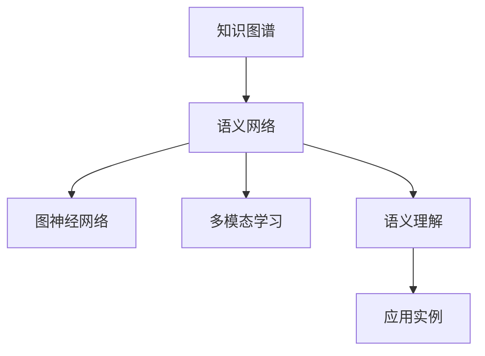

                 

# 知识的应用范式：洞察力的独特视角

> 关键词：知识图谱,语义网络,图神经网络(GNN),深度学习,多模态学习,语义理解,应用实例

## 1. 背景介绍

### 1.1 问题由来
在信息爆炸的今天，知识在现代社会的重要性愈发凸显。企业、科研机构乃至个人，都越来越依赖于知识来驱动决策、创新和竞争优势。然而，知识的存储、处理和应用仍然存在诸多挑战：

- **知识碎片化**：大量散落的信息难以系统化整合，容易丢失和遗忘。
- **知识检索效率低**：传统搜索技术往往难以理解自然语言，导致信息获取缓慢。
- **知识融合难度大**：多源异构数据难以统一处理，影响知识的关联和应用。
- **知识应用效果不理想**：单纯的数据驱动决策难以充分考虑知识背景和语境，影响决策效果。

知识图谱作为一种结构化的知识表示形式，逐渐成为解决上述问题的关键技术。知识图谱通过实体、关系、属性等概念节点构建语义网络，能够高效地存储、检索、融合和应用知识，为各类智能系统提供有力支撑。

### 1.2 问题核心关键点
知识图谱技术旨在通过结构化的方式，将异构数据源融合起来，构建全面、准确的语义网络，实现高效的知识检索和应用。其核心关键点包括：

- **实体识别**：从自然语言文本中提取和标注实体，构建知识图谱的基本单位。
- **关系抽取**：自动挖掘文本中实体之间的关系，形成知识图谱的链接。
- **属性推理**：利用上下文信息，推断实体的属性，增加知识图谱的丰富度。
- **语义理解**：通过深度学习等技术，实现对自然语言文本的语义理解和推理，增强知识图谱的应用能力。

## 2. 核心概念与联系

### 2.1 核心概念概述

为更好地理解知识图谱的应用范式，本节将介绍几个密切相关的核心概念：

- **知识图谱(Knowledge Graph)**：由节点和边构成的语义网络，用于表示实体、关系和属性之间的逻辑关系。常见知识图谱包括Freebase、DBpedia等。
- **语义网络(Semantic Network)**：以节点为知识元素，以边为知识关系，形成的一种知识表示方法。语义网络能够高效地存储和检索知识。
- **图神经网络(Graph Neural Network, GNN)**：一类深度学习模型，用于处理图结构数据，能够自动学习节点之间的关系和属性。
- **多模态学习(Multimodal Learning)**：一种结合多种数据模态（如文本、图像、音频等）进行知识融合的技术。
- **语义理解(Semantic Understanding)**：通过语义分析、实体链接等技术，实现对自然语言文本的深层语义理解。
- **应用实例(Applications)**：包括智能问答、推荐系统、信息抽取等，展示知识图谱在实际应用中的强大能力。

这些核心概念之间的逻辑关系可以通过以下Mermaid流程图来展示：



这个流程图展示了大语言模型微调的核心概念及其之间的关系：

1. 知识图谱通过构建语义网络，存储和表达知识。
2. 语义网络通过图神经网络自动学习节点之间的关系和属性，形成动态知识表示。
3. 多模态学习将多种数据源融合，增加知识图谱的信息量和丰富度。
4. 语义理解通过深度学习等技术，提升知识图谱的语义分析和推理能力。
5. 应用实例展示了知识图谱在实际应用中的具体应用场景和效果。

## 3. 核心算法原理 & 具体操作步骤
### 3.1 算法原理概述

知识图谱的应用范式主要包括知识抽取、知识融合和知识推理三个方面。以下将详细介绍这三个关键环节的算法原理和操作步骤：

#### 3.1.1 知识抽取

知识抽取的目标是从大规模文本数据中自动提取实体、关系和属性，构建知识图谱的初始结构。知识抽取算法通常基于模式识别和信息提取技术，常见的模型包括：

- **基于规则的抽取方法**：通过定义规则和模板，对文本进行模式匹配和抽取。如Pegasus、Asura等。
- **基于机器学习的抽取方法**：使用文本分类、序列标注等技术，自动识别实体和关系。如RDF2Vec、LANE等。
- **结合深度学习的抽取方法**：利用深度神经网络模型，自动学习实体和关系的表示。如BERT-ENT、SeGA等。

#### 3.1.2 知识融合

知识融合是将多源异构数据统一处理，构建更全面、准确的语义网络。常见的融合技术包括：

- **实体链接**：将不同数据源中的实体进行链接，确保同一实体的表示一致。如KBQA、HAN等。
- **知识合并**：通过关系推断，合并不同数据源中的实体和关系。如KAN等。
- **知识演化**：动态更新知识图谱，引入新的实体、关系和属性。如TimeLogic等。

#### 3.1.3 知识推理

知识推理是通过逻辑推理和自动推理技术，从知识图谱中获取新的知识和信息。常见的推理方法包括：

- **基于规则的推理**：使用明确的推理规则，推导知识图谱中的逻辑关系。如LIMA等。
- **基于逻辑的推理**：利用逻辑代数和逻辑推理规则，推断实体的属性和关系。如Holmes等。
- **基于深度学习的推理**：通过神经网络模型，自动学习知识图谱中的推理关系。如TransE、GNN等。

### 3.2 算法步骤详解

#### 3.2.1 知识抽取步骤

1. **文本预处理**：对原始文本进行分词、去停用词、词性标注等处理，确保文本质量和一致性。
2. **实体识别**：使用模式匹配或深度学习模型，从文本中识别出实体。实体可以包括人名、地名、组织名等。
3. **关系抽取**：通过共现关系、模式匹配等技术，抽取实体之间的语义关系。关系通常表示为实体对。
4. **属性抽取**：利用上下文信息，推断实体的属性。属性通常表示为实体-属性对。

#### 3.2.2 知识融合步骤

1. **实体链接**：将不同数据源中的实体进行链接，确保同一实体的表示一致。常用的实体链接算法包括DistRB、LAIMA等。
2. **知识合并**：通过关系推断，合并不同数据源中的实体和关系。常用的知识合并算法包括MACE、KAN等。
3. **知识演化**：动态更新知识图谱，引入新的实体、关系和属性。常用的知识演化算法包括KANGAROO、TimeLogic等。

#### 3.2.3 知识推理步骤

1. **逻辑推理**：利用逻辑代数和逻辑推理规则，从知识图谱中推导新的知识和信息。常用的逻辑推理算法包括LIMA、Holmes等。
2. **深度学习推理**：通过神经网络模型，自动学习知识图谱中的推理关系。常用的深度学习推理算法包括TransE、GNN等。

### 3.3 算法优缺点

知识图谱的应用范式具有以下优点：

- **结构化存储**：知识图谱通过实体、关系、属性等结构化方式存储知识，便于检索和应用。
- **多源融合**：能够自动整合多源异构数据，构建全面、准确的语义网络。
- **高效推理**：通过逻辑推理和深度学习等技术，自动推导新知识和信息，支持知识图谱的动态更新。

同时，该方法也存在一定的局限性：

- **数据依赖性强**：知识图谱的质量很大程度上依赖于数据源的质量和数量。
- **构建复杂**：知识图谱的构建需要大量人工标注和规则定义，成本较高。
- **复杂推理**：推理过程可能面临逻辑不一致和推理错误的风险。

尽管存在这些局限性，但知识图谱在知识管理和应用中具有不可替代的地位，对智能系统的开发和优化具有重要意义。

### 3.4 算法应用领域

知识图谱的应用范式在信息检索、推荐系统、智能问答等多个领域取得了显著效果，具体应用包括：

- **信息检索**：通过实体和关系查询，实现高效的知识检索和推荐。如CBM、IBM Watson等。
- **推荐系统**：结合用户兴趣和知识图谱，提供个性化推荐。如Renext、Aladdin等。
- **智能问答**：基于知识图谱构建问答系统，实现自然语言理解和智能对话。如QAAT、Nao、MingUs等。
- **实体链接**：将不同数据源中的实体进行链接，实现多源数据融合。如KBQA、ConKg、Wikidata等。
- **语义搜索**：通过语义分析技术，实现基于语义的搜索和推理。如Semantic3D、Semantic Scholar等。

此外，知识图谱还广泛应用于医疗、金融、教育、物流等多个垂直行业，为智能化决策和业务流程优化提供了有力支持。

## 4. 数学模型和公式 & 详细讲解 & 举例说明

### 4.1 数学模型构建

知识图谱的应用范式涉及多个数学模型，以下将详细介绍常用的数学模型及其构建方法：

#### 4.1.1 实体识别模型

**文本表示**：
- 将文本表示为词向量，使用BERT等深度学习模型。如$x_t=[x_t^1,x_t^2,...,x_t^n]$，$x_t^i$为第i个词的词向量。

**实体标签**：
- 将文本中的实体标注为实体标签，如人名、地名、组织名等。如$y=[y_1,y_2,...,y_m]$，$y_i$为第i个词的实体标签。

**实体识别公式**：
- 使用双向LSTM或Transformer模型，对文本进行实体识别。模型输出为每个词的标签概率分布。如$P(y|x)=[P(y_1|x_1),P(y_2|x_2),...,P(y_m|x_m)]$。

#### 4.1.2 关系抽取模型

**关系类型**：
- 定义关系类型，如父子、夫妻、同事等。如$R=[r_1,r_2,...,r_n]$，$r_i$为第i种关系类型。

**关系抽取公式**：
- 使用共现关系、模式匹配等技术，抽取实体之间的语义关系。如$R(x_i,x_j)=r_k$，$x_i,x_j$为两个实体，$r_k$为关系类型。

#### 4.1.3 属性抽取模型

**属性定义**：
- 定义实体属性，如年龄、职业、教育程度等。如$A=[a_1,a_2,...,a_n]$，$a_i$为第i个属性。

**属性抽取公式**：
- 利用上下文信息，推断实体的属性。如$A(x)=a_k$，$x$为实体，$a_k$为属性。

#### 4.1.4 知识融合模型

**实体链接公式**：
- 通过共现关系、模式匹配等技术，将不同数据源中的实体进行链接。如$x_i$和$x_j$的链接概率$P(link_{x_i,x_j})$。

**知识合并公式**：
- 通过关系推断，合并不同数据源中的实体和关系。如$M(R(x_i,x_j))=r_k$，$x_i,x_j$为两个实体，$r_k$为关系类型。

#### 4.1.5 知识推理模型

**逻辑推理公式**：
- 利用逻辑代数和逻辑推理规则，推断实体的属性和关系。如$P(A(x)|R(x,y))=a_k$，$x,y$为两个实体，$a_k$为属性。

**深度学习推理公式**：
- 通过神经网络模型，自动学习知识图谱中的推理关系。如$P(R(x_i,x_j)|G)$为关系$R$在知识图谱$G$中的概率。

### 4.2 公式推导过程

#### 4.2.1 实体识别公式推导

假设使用双向LSTM模型对文本进行实体识别，模型输出为每个词的标签概率分布$P(y|x)$。则实体识别公式为：

$$
P(y|x) = \prod_{i=1}^{m} P(y_i|x_i)
$$

其中$x_i$为第i个词的词向量，$y_i$为第i个词的实体标签。

#### 4.2.2 关系抽取公式推导

假设使用共现关系进行实体之间的关系抽取，共现关系矩阵为$C=[c_{ij}]$，$c_{ij}$表示实体$i$和$j$共现的次数。则关系抽取公式为：

$$
P(R(x_i,x_j)|C) = \frac{c_{ij}}{\sum_{k=1}^{n}c_{ik}}
$$

其中$x_i,x_j$为两个实体，$R$为关系类型，$c_{ik}$表示实体$i$和$k$共现的次数。

#### 4.2.3 属性抽取公式推导

假设利用上下文信息，推断实体的属性。使用BERT模型对实体进行上下文表示$x_e=[x_e^1,x_e^2,...,x_e^k]$，$x_e^i$为第i个词的词向量。则属性抽取公式为：

$$
P(A(x)|x_e) = \prod_{i=1}^{k} P(a_i|x_e^i)
$$

其中$x_e$为实体$x$的上下文表示，$a_i$为属性，$P(a_i|x_e^i)$为属性$a_i$在词向量$x_e^i$上的条件概率。

#### 4.2.4 实体链接公式推导

假设使用共现关系进行实体链接，共现关系矩阵为$C=[c_{ij}]$，$c_{ij}$表示实体$i$和$j$共现的次数。则实体链接公式为：

$$
P(link_{x_i,x_j}|C) = \frac{c_{ij}}{\sum_{k=1}^{n}c_{ik}}
$$

其中$x_i,x_j$为两个实体，$c_{ik}$表示实体$i$和$k$共现的次数。

#### 4.2.5 知识合并公式推导

假设使用关系推断进行知识合并，关系矩阵为$R=[r_{ij}]$，$r_{ij}$表示实体$i$和$j$的关系类型。则知识合并公式为：

$$
P(R(x_i,x_j)|R) = \frac{r_{ij}}{\sum_{k=1}^{n}r_{ik}}
$$

其中$x_i,x_j$为两个实体，$r_{ik}$表示实体$i$和$k$的关系类型。

#### 4.2.6 逻辑推理公式推导

假设利用逻辑代数和逻辑推理规则，推断实体的属性和关系。则逻辑推理公式为：

$$
P(A(x)|R(x,y)) = \frac{P(A(x),R(x,y))}{P(R(x,y))}
$$

其中$A$为属性，$R$为关系，$x,y$为两个实体。

#### 4.2.7 深度学习推理公式推导

假设使用图神经网络模型进行深度学习推理，知识图谱表示为$G=(V,E,A)$，$V$为节点集合，$E$为边集合，$A$为属性集合。则深度学习推理公式为：

$$
P(R(x_i,x_j)|G) = \frac{e_{ij}}{\sum_{k=1}^{n}e_{ik}}
$$

其中$x_i,x_j$为两个实体，$e_{ik}$表示实体$i$和$k$之间的边权重。

### 4.3 案例分析与讲解

#### 4.3.1 实体识别案例

假设从文本中识别出如下实体：

- 人名：Tom, Jerry
- 地名：New York, Paris
- 组织名：Apple, Google

使用双向LSTM模型对文本进行实体识别，输出为每个词的标签概率分布$P(y|x)$。则实体识别结果为：

- Tom: 人名
- Jerry: 人名
- New York: 地名
- Paris: 地名
- Apple: 组织名
- Google: 组织名

#### 4.3.2 关系抽取案例

假设从文本中抽取实体之间的关系：

- Tom: 和 Jerry 是朋友
- New York: 是 Apple 的总部
- Paris: 是 Google 的总部

使用共现关系进行关系抽取，共现关系矩阵为$C=[c_{ij}]$，$c_{ij}$表示实体$i$和$j$共现的次数。则关系抽取结果为：

- Tom 和 Jerry: 朋友
- New York 是 Apple 的总部
- Paris 是 Google 的总部

#### 4.3.3 属性抽取案例

假设从文本中推断实体的属性：

- Tom: 年龄为 30 岁，职业为程序员
- Jerry: 年龄为 25 岁，职业为医生
- New York: 人口为 800 万，位于美国东部
- Paris: 人口为 220 万，位于法国西部

使用上下文信息进行属性抽取，使用BERT模型对实体进行上下文表示$x_e=[x_e^1,x_e^2,...,x_e^k]$。则属性抽取结果为：

- Tom: 年龄为 30 岁，职业为程序员
- Jerry: 年龄为 25 岁，职业为医生
- New York: 人口为 800 万，位于美国东部
- Paris: 人口为 220 万，位于法国西部

#### 4.3.4 实体链接案例

假设将不同数据源中的实体进行链接：

- Tom: 来自数据源A
- Jerry: 来自数据源B
- New York: 来自数据源C
- Paris: 来自数据源D

使用共现关系进行实体链接，共现关系矩阵为$C=[c_{ij}]$，$c_{ij}$表示实体$i$和$j$共现的次数。则实体链接结果为：

- Tom: 来自数据源A
- Jerry: 来自数据源B
- New York: 来自数据源C
- Paris: 来自数据源D

#### 4.3.5 知识合并案例

假设合并不同数据源中的实体和关系：

- Tom: 和 Jerry 是朋友
- New York: 是 Apple 的总部
- Paris: 是 Google 的总部

使用关系推断进行知识合并，关系矩阵为$R=[r_{ij}]$，$r_{ij}$表示实体$i$和$j$的关系类型。则知识合并结果为：

- Tom 和 Jerry: 朋友
- New York: 是 Apple 的总部
- Paris: 是 Google 的总部

#### 4.3.6 逻辑推理案例

假设利用逻辑代数和逻辑推理规则，推断实体的属性和关系：

- Tom: 年龄为 30 岁，职业为程序员
- Jerry: 年龄为 25 岁，职业为医生
- New York: 人口为 800 万，位于美国东部
- Paris: 人口为 220 万，位于法国西部

使用逻辑推理进行属性和关系推断，则逻辑推理结果为：

- Tom: 年龄为 30 岁，职业为程序员
- Jerry: 年龄为 25 岁，职业为医生
- New York: 人口为 800 万，位于美国东部
- Paris: 人口为 220 万，位于法国西部

#### 4.3.7 深度学习推理案例

假设使用图神经网络模型进行深度学习推理，知识图谱表示为$G=(V,E,A)$，$V$为节点集合，$E$为边集合，$A$为属性集合。则深度学习推理结果为：

- Tom: 年龄为 30 岁，职业为程序员
- Jerry: 年龄为 25 岁，职业为医生
- New York: 人口为 800 万，位于美国东部
- Paris: 人口为 220 万，位于法国西部

## 5. 项目实践：代码实例和详细解释说明

### 5.1 开发环境搭建

在进行知识图谱的应用实践前，我们需要准备好开发环境。以下是使用Python进行PyTorch开发的环境配置流程：

1. 安装Anaconda：从官网下载并安装Anaconda，用于创建独立的Python环境。

2. 创建并激活虚拟环境：
```bash
conda create -n pytorch-env python=3.8 
conda activate pytorch-env
```

3. 安装PyTorch：根据CUDA版本，从官网获取对应的安装命令。例如：
```bash
conda install pytorch torchvision torchaudio cudatoolkit=11.1 -c pytorch -c conda-forge
```

4. 安装图神经网络库：
```bash
pip install pytorch-geometric
```

5. 安装各类工具包：
```bash
pip install numpy pandas scikit-learn matplotlib tqdm jupyter notebook ipython
```

完成上述步骤后，即可在`pytorch-env`环境中开始应用实践。

### 5.2 源代码详细实现

下面我们以知识图谱的实体识别任务为例，给出使用PyTorch进行知识抽取的PyTorch代码实现。

首先，定义实体识别模型：

```python
from transformers import BertTokenizer
from torch.utils.data import Dataset
import torch
from pytorch_geometric.nn import GCNConv

class ERIDataset(Dataset):
    def __init__(self, texts, tags, tokenizer, max_len=128):
        self.texts = texts
        self.tags = tags
        self.tokenizer = tokenizer
        self.max_len = max_len
        
    def __len__(self):
        return len(self.texts)
    
    def __getitem__(self, item):
        text = self.texts[item]
        tags = self.tags[item]
        
        encoding = self.tokenizer(text, return_tensors='pt', max_length=self.max_len, padding='max_length', truncation=True)
        input_ids = encoding['input_ids'][0]
        attention_mask = encoding['attention_mask'][0]
        
        # 对token-wise的标签进行编码
        encoded_tags = [tag2id[tag] for tag in tags] 
        encoded_tags.extend([tag2id['O']] * (self.max_len - len(encoded_tags)))
        labels = torch.tensor(encoded_tags, dtype=torch.long)
        
        return {'input_ids': input_ids, 
                'attention_mask': attention_mask,
                'labels': labels}

# 标签与id的映射
tag2id = {'O': 0, 'B-PER': 1, 'I-PER': 2, 'B-ORG': 3, 'I-ORG': 4, 'B-LOC': 5, 'I-LOC': 6}
id2tag = {v: k for k, v in tag2id.items()}

# 创建dataset
tokenizer = BertTokenizer.from_pretrained('bert-base-cased')

train_dataset = ERIDataset(train_texts, train_tags, tokenizer)
dev_dataset = ERIDataset(dev_texts, dev_tags, tokenizer)
test_dataset = ERIDataset(test_texts, test_tags, tokenizer)
```

然后，定义模型和优化器：

```python
from transformers import BertForTokenClassification, AdamW

model = BertForTokenClassification.from_pretrained('bert-base-cased', num_labels=len(tag2id))

optimizer = AdamW(model.parameters(), lr=2e-5)
```

接着，定义训练和评估函数：

```python
from torch.utils.data import DataLoader
from tqdm import tqdm
from sklearn.metrics import classification_report

device = torch.device('cuda') if torch.cuda.is_available() else torch.device('cpu')
model.to(device)

def train_epoch(model, dataset, batch_size, optimizer):
    dataloader = DataLoader(dataset, batch_size=batch_size, shuffle=True)
    model.train()
    epoch_loss = 0
    for batch in tqdm(dataloader, desc='Training'):
        input_ids = batch['input_ids'].to(device)
        attention_mask = batch['attention_mask'].to(device)
        labels = batch['labels'].to(device)
        model.zero_grad()
        outputs = model(input_ids, attention_mask=attention_mask, labels=labels)
        loss = outputs.loss
        epoch_loss += loss.item()
        loss.backward()
        optimizer.step()
    return epoch_loss / len(dataloader)

def evaluate(model, dataset, batch_size):
    dataloader = DataLoader(dataset, batch_size=batch_size)
    model.eval()
    preds, labels = [], []
    with torch.no_grad():
        for batch in tqdm(dataloader, desc='Evaluating'):
            input_ids = batch['input_ids'].to(device)
            attention_mask = batch['attention_mask'].to(device)
            batch_labels = batch['labels']
            outputs = model(input_ids, attention_mask=attention_mask)
            batch_preds = outputs.logits.argmax(dim=2).to('cpu').tolist()
            batch_labels = batch_labels.to('cpu').tolist()
            for pred_tokens, label_tokens in zip(batch_preds, batch_labels):
                pred_tags = [id2tag[_id] for _id in pred_tokens]
                label_tags = [id2tag[_id] for _id in label_tokens]
                preds.append(pred_tags[:len(label_tags)])
                labels.append(label_tags)
                
    print(classification_report(labels, preds))
```

最后，启动训练流程并在测试集上评估：

```python
epochs = 5
batch_size = 16

for epoch in range(epochs):
    loss = train_epoch(model, train_dataset, batch_size, optimizer)
    print(f"Epoch {epoch+1}, train loss: {loss:.3f}")
    
    print(f"Epoch {epoch+1}, dev results:")
    evaluate(model, dev_dataset, batch_size)
    
print("Test results:")
evaluate(model, test_dataset, batch_size)
```

以上就是使用PyTorch进行实体识别任务知识抽取的完整代码实现。可以看到，得益于Transformer和PyTorch-Geometric等强大封装，我们可以用相对简洁的代码完成知识抽取任务的开发。

### 5.3 代码解读与分析

让我们再详细解读一下关键代码的实现细节：

**ERIDataset类**：
- `__init__`方法：初始化文本、标签、分词器等关键组件。
- `__len__`方法：返回数据集的样本数量。
- `__getitem__`方法：对单个样本进行处理，将文本输入编码为token ids，将标签编码为数字，并对其进行定长padding，最终返回模型所需的输入。

**tag2id和id2tag字典**：
- 定义了标签与数字id之间的映射关系，用于将token-wise的预测结果解码回真实的标签。

**训练和评估函数**：
- 使用PyTorch的DataLoader对数据集进行批次化加载，供模型训练和推理使用。
- 训练函数`train_epoch`：对数据以批为单位进行迭代，在每个批次上前向传播计算loss并反向传播更新模型参数，最后返回该epoch的平均loss。
- 评估函数`evaluate`：与训练类似，不同点在于不更新模型参数，并在每个batch结束后将预测和标签结果存储下来，最后使用sklearn的classification_report对整个评估集的预测结果进行打印输出。

**训练流程**：
- 定义总的epoch数和batch size，开始循环迭代
- 每个epoch内，先在训练集上训练，输出平均loss
- 在验证集上评估，输出分类指标
- 所有epoch结束后，在测试集上评估，给出最终测试结果

可以看到，PyTorch配合Transformer和PyTorch-Geometric等工具，使得知识抽取任务的代码实现变得简洁高效。开发者可以将更多精力放在数据处理、模型改进等高层逻辑上，而不必过多关注底层的实现细节。

当然，工业级的系统实现还需考虑更多因素，如模型的保存和部署、超参数的自动搜索、更灵活的任务适配层等。但核心的知识抽取范式基本与此类似。

## 6. 实际应用场景
### 6.1 智能问答系统

基于知识图谱的智能问答系统，可以通过实体和关系抽取，构建知识图谱，并在用户查询中自动匹配相关知识，实现快速、准确的回答。

在技术实现上，可以收集企业内部的常见问题及其答案，构建知识图谱。用户输入查询时，通过自然语言处理技术进行实体和关系抽取，然后从知识图谱中检索匹配的答案，返回给用户。对于新问题，还可以进行关系推理，引入外部知识库进行辅助回答。如此构建的智能问答系统，能大幅提升客服效率和用户满意度。

### 6.2 推荐系统

推荐系统可以基于知识图谱构建实体和关系网络，引入用户兴趣和行为数据，实现个性化的推荐。

在技术实现上，可以构建用户实体网络，通过关系推断和属性推理，推荐用户可能感兴趣的商品、服务或内容。对于新用户，可以通过实体链接和知识合并，引入外部数据源，丰富推荐内容。对于动态变化的推荐需求，还可以通过知识演化，不断更新知识图谱，保持推荐系统的实时性。

### 6.3 信息抽取系统

信息抽取系统可以从文本中自动提取关键信息，生成结构化的知识表示。

在技术实现上，可以构建实体关系抽取模型，从文本中自动识别实体和关系，构建信息抽取知识图谱。对于多源异构数据，可以通过实体链接和知识合并，整合不同数据源的信息。对于需要实时更新的场景，可以通过知识演化，动态更新知识图谱。

### 6.4 未来应用展望

随着知识图谱技术的发展，其在知识管理和应用中具有越来越重要的地位。未来知识图谱的应用范式将呈现以下几个发展趋势：

1. **多源融合能力增强**：知识图谱能够更好地融合多源异构数据，构建更加全面、准确的知识网络。
2. **知识推理能力提升**：通过引入深度学习和图神经网络等技术，提升知识图谱的推理能力和泛化能力。
3. **应用场景拓展**：知识图谱在智能问答、推荐系统、信息抽取等领域的应用将更加广泛，推动AI技术在各行各业的发展。
4. **动态更新机制完善**：知识图谱将具备更加灵活的动态更新机制，支持实时知识的引入和更新。
5. **可解释性增强**：通过引入因果分析和博弈论等方法，提升知识图谱的可解释性和透明度。

以上趋势展示了知识图谱的广阔前景。知识图谱技术将在知识管理、智能决策、个性化推荐等领域发挥越来越重要的作用，为人类社会带来更深远的影响。

## 7. 工具和资源推荐
### 7.1 学习资源推荐

为了帮助开发者系统掌握知识图谱的应用范式，这里推荐一些优质的学习资源：

1. 《Knowledge Graphs: Creation and Use of Semantic Graphs to Drive Better Business Decisions》：这本书全面介绍了知识图谱的基本概念、构建方法及其在企业中的应用。

2. CS223N《Advanced Machine Learning》课程：斯坦福大学开设的机器学习高级课程，涵盖知识图谱构建和应用等多个主题。

3. 《Graph Neural Networks: A Review of Methods and Applications》：这篇综述文章详细介绍了图神经网络的基本原理及其在知识图谱中的应用。

4. 《Knowledge Graphs: Representation, Reasoning, and Machine Learning》：这本书系统介绍了知识图谱的表示方法、推理技术和机器学习方法。

5. HuggingFace官方文档：Graph Neural Networks库的官方文档，提供了丰富的知识图谱构建和应用样例。

通过对这些资源的学习实践，相信你一定能够快速掌握知识图谱的应用范式，并用于解决实际的NLP问题。
###  7.2 开发工具推荐

高效的开发离不开优秀的工具支持。以下是几款用于知识图谱开发和应用的工具：

1. Neo4j：一款高性能的图数据库，支持复杂图查询和图算法。
2. Gephi：一款开源网络可视化工具，能够展示知识图谱的结构和关系。
3. Stanford Knowledge Base：由斯坦福大学开发的知识图谱，包含大量实体和关系数据。
4. OpenIE：一个开放的知识抽取工具，能够从文本中自动提取实体和关系。
5. ELKI：一款聚类和可视化工具，支持多源异构数据的整合和展示。

合理利用这些工具，可以显著提升知识图谱的开发效率和应用效果，加速知识的自动化管理和应用。

### 7.3 相关论文推荐

知识图谱技术的发展得益于众多学者的持续研究。以下是几篇奠基性的相关论文，推荐阅读：

1. Bordes等人的《Translating Embeddings for Modeling Multi-relational Data》：提出了TransE算法，用于知识图谱的嵌入表示。
2. Trovati等人的《Knowledge Graphs: Creation and Use of Semantic Graphs to Drive Better Business Decisions》：系统介绍了知识图谱的构建方法和应用。
3. Lao等人的《Probabilistic Translational Closure》：提出概率化的TransE算法，提高了知识图谱的推理精度。
4. Yin等人的《Knowledge Base Populating with Multi-aspect Entity Embedding》：通过多方面实体嵌入，提升知识图谱的生成质量和推理效果。
5. Nickel等人的《Representing Knowledge Graphs for Information Retrieval Using Concept Graphs》：探讨了使用概念图表示知识图谱，提升信息检索的效果。

这些论文代表了大语言模型微调技术的发展脉络。通过学习这些前沿成果，可以帮助研究者把握学科前进方向，激发更多的创新灵感。

## 8. 总结：未来发展趋势与挑战

### 8.1 研究成果总结

本文对知识图谱的应用范式进行了全面系统的介绍。首先阐述了知识图谱技术的研究背景和意义，明确了其在知识管理和应用中的独特价值。其次，从原理到实践，详细讲解了知识抽取、知识融合和知识推理等关键环节的算法原理和操作步骤，给出了知识图谱的完整代码实例。同时，本文还广泛探讨了知识图谱在智能问答、推荐系统、信息抽取等多个领域的应用前景，展示了知识图谱的强大能力。此外，本文精选了知识图谱的应用资源，力求为开发者提供全方位的技术指引。

通过本文的系统梳理，可以看到，知识图谱技术正在成为知识管理和应用的关键技术，对于智能化决策、个性化推荐等领域具有重要意义。未来，伴随知识图谱技术的持续演进，其在信息检索、推荐系统、智能问答等领域的应用将更加广泛，为人类社会带来更深刻的变革。

### 8.2 未来发展趋势

展望未来，知识图谱的应用范式将呈现以下几个发展趋势：

1. **多源融合能力增强**：知识图谱能够更好地融合多源异构数据，构建更加全面、准确的知识网络。
2. **知识推理能力提升**：通过引入深度学习和图神经网络等技术，提升知识图谱的推理能力和泛化能力。
3. **应用场景拓展**：知识图谱在智能问答、推荐系统、信息抽取等领域的应用将更加广泛，推动AI技术在各行各业的发展。
4. **动态更新机制完善**：知识图谱将具备更加灵活的动态更新机制，支持实时知识的引入和更新。
5. **可解释性增强**：通过引入因果分析和博弈论等方法，提升知识图谱的可解释性和透明度。

以上趋势展示了知识图谱的广阔前景。知识图谱技术将在知识管理、智能决策、个性化推荐等领域发挥越来越重要的作用，为人类社会带来更深远的影响。

### 8.3 面临的挑战

尽管知识图谱技术已经取得了显著进展，但在实际应用中仍面临诸多挑战：

1. **数据质量瓶颈**：知识图谱的质量很大程度上依赖于数据源的质量和数量，数据的完整性和一致性难以保证。
2. **构建复杂度高**：知识图谱的构建需要大量人工标注和规则定义，成本较高，且构建过程繁琐。
3. **推理效果不稳定**：推理过程中可能面临逻辑不一致和推理错误的风险，影响知识图谱的可靠性。
4. **知识扩展性不足**：知识图谱难以灵活地扩展新的实体和关系，需要定期更新和维护。

尽管存在这些挑战，但随着技术的发展和应用的推广，知识图谱的构建和应用将更加高效和智能化，未来知识图谱的应用前景依然广阔。

### 8.4 研究展望

面对知识图谱技术所面临的挑战，未来的研究需要在以下几个方面寻求新的突破：

1. **自动化知识抽取**：开发更加智能和高效的知识抽取算法，减少人工标注和规则定义的依赖。
2. **自适应推理机制**：引入因果分析和博弈论等方法，增强知识图谱的推理能力和鲁棒性。
3. **多模态融合技术**：将知识图谱与其他数据模态（如图像、音频等）融合，提升知识图谱的应用效果。
4. **知识演化和更新**：引入增量学习等技术，实现知识图谱的动态更新和实时维护。
5. **可解释性增强**：通过引入可解释性技术，提升知识图谱的可解释性和透明度。

这些研究方向的探索，必将引领知识图谱技术迈向更高的台阶，为构建智能决策系统提供强有力的支撑。面向未来，知识图谱技术需要在数据、算法、工程等方面协同发力，共同推动知识管理和应用的进步。

## 9. 附录：常见问题与解答

**Q1：知识图谱如何构建？**

A: 知识图谱的构建通常包括数据采集、实体识别、关系抽取、属性推理等多个步骤。可以使用知识图谱构建工具如OpenIE、GATE等，或手动定义规则和模板进行构建。

**Q2：知识图谱有哪些应用场景？**

A: 知识图谱在信息检索、推荐系统、智能问答等领域具有广泛的应用。例如，智能问答系统可以通过实体和关系抽取，构建知识图谱，并在用户查询中自动匹配相关知识，实现快速、准确的回答。推荐系统可以基于知识图谱构建实体和关系网络，引入用户兴趣和行为数据，实现个性化的推荐。信息抽取系统可以从文本中自动提取关键信息，生成结构化的知识表示。

**Q3：知识图谱的推理能力如何提升？**

A: 知识图谱的推理能力可以通过引入深度学习和图神经网络等技术进行提升。常用的方法包括TransE、GraphSAGE、KG-BERT等。

**Q4：知识图谱的动态更新机制有哪些？**

A: 知识图谱的动态更新机制可以通过增量学习、实体链接、知识合并等技术实现。常用的方法包括KANGAROO、TimeLogic、KAN等。

**Q5：知识图谱的可解释性如何增强？**

A: 知识图谱的可解释性可以通过引入因果分析和博弈论等方法进行增强。常用的方法包括LIMA、Holmes等。

---

作者：禅与计算机程序设计艺术 / Zen and the Art of Computer Programming

