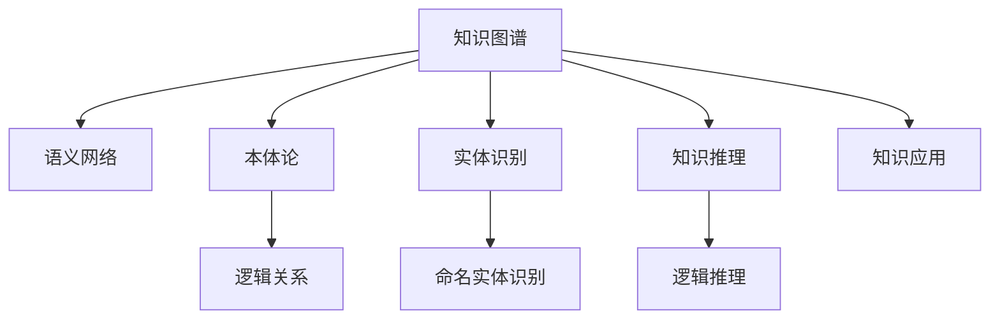

                 

# 知识的应用：从理论到实践的桥梁

> 关键词：知识图谱、语义网络、本体论、实体识别、知识推理、知识应用

## 1. 背景介绍

### 1.1 问题由来

在当今信息爆炸的时代，人类面对海量的数据，如何从中提取有价值的信息成为了一个重要的课题。传统的搜索和信息检索方法已经无法满足需求，需要一种更高级的解决方案。知识图谱（Knowledge Graph）应运而生，成为了从理论到实践的桥梁。知识图谱是一种结构化的数据表示方式，它以图的形式组织知识，并通过实体识别、知识推理等技术，实现知识的自动化获取和应用。

知识图谱的出现，使得信息检索不再只是单纯的文本匹配，而是基于知识的语义匹配。它能够更好地理解和处理自然语言，为用户提供更准确、更智能的信息服务。知识图谱在医疗、教育、金融、物流等众多领域得到了广泛应用，极大地提升了这些领域的信息处理和决策支持能力。

### 1.2 问题核心关键点

知识图谱的核心在于如何构建和维护一个高效、准确的知识库，并通过语义网络等技术，实现知识的高效检索、推理和应用。其中，实体识别（Entity Recognition）和知识推理（Knowledge Reasoning）是知识图谱构建中的关键技术。

实体识别是指从文本中识别出具有特定意义的实体，如人名、地名、组织名等。它能够帮助知识图谱更好地理解文本内容，并提取出重要的实体信息。知识推理则是指基于知识图谱中的实体关系，进行逻辑推理，得出新的知识。这使得知识图谱具备了一定的自主学习能力，能够自动扩展和更新知识库。

知识图谱的应用领域非常广泛，包括智能问答系统、推荐系统、搜索引擎、智能客服等。在这些领域中，知识图谱能够通过语义匹配，提供更准确、更智能的服务。

## 2. 核心概念与联系

### 2.1 核心概念概述

为了更好地理解知识图谱，本节将介绍几个密切相关的核心概念：

- 知识图谱（Knowledge Graph）：一种结构化的知识表示方式，以图的形式组织实体和关系，用于描述现实世界中的各种实体和它们之间的关系。
- 语义网络（Semantic Network）：一种以图的形式表示实体和关系的知识表示方法，是知识图谱的重要组成部分。
- 本体论（Ontology）：一种形式化的知识表示方法，用于描述实体和关系之间的逻辑关系，是知识图谱的理论基础。
- 实体识别（Entity Recognition）：从文本中识别出具有特定意义的实体，如人名、地名、组织名等，是构建知识图谱的关键技术。
- 知识推理（Knowledge Reasoning）：基于知识图谱中的实体关系，进行逻辑推理，得出新的知识，是知识图谱的重要功能。
- 知识应用（Knowledge Application）：将知识图谱中的知识应用于实际场景中，如智能问答、推荐系统等，实现知识的自动获取和应用。

这些核心概念之间的逻辑关系可以通过以下Mermaid流程图来展示：



这个流程图展示了一些关键概念之间的关系：

1. 知识图谱通过语义网络来表示实体和关系，是知识图谱的核心组成部分。
2. 本体论为知识图谱提供理论支持，描述实体和关系之间的逻辑关系。
3. 实体识别是从文本中提取实体信息，是构建知识图谱的关键步骤。
4. 知识推理基于知识图谱中的实体关系，进行逻辑推理，拓展知识图谱的功能。
5. 知识应用将知识图谱中的知识应用于实际场景，实现知识的自动获取和应用。

## 3. 核心算法原理 & 具体操作步骤

### 3.1 算法原理概述

知识图谱的构建和应用主要基于以下步骤：

1. 数据收集和预处理：从不同来源收集数据，并对数据进行清洗、标注等预处理。
2. 实体识别：使用命名实体识别技术，从文本中识别出具有特定意义的实体。
3. 关系抽取：使用关系抽取技术，从文本中提取实体之间的关系。
4. 知识图谱构建：将实体和关系构建成图的形式，并进行推理和验证。
5. 知识应用：将构建好的知识图谱应用于实际场景中，如智能问答、推荐系统等。

### 3.2 算法步骤详解

#### 3.2.1 数据收集和预处理

数据收集是知识图谱构建的基础。通常需要从不同来源获取数据，如百科全书、新闻报道、社交媒体等。数据预处理包括清洗、标注、归一化等步骤，确保数据的质量和一致性。

#### 3.2.2 实体识别

实体识别是知识图谱构建的关键步骤。通常使用自然语言处理技术，如命名实体识别（NER）、词性标注等，从文本中识别出具有特定意义的实体。实体识别技术可以通过训练模型、使用规则库等方式实现。

#### 3.2.3 关系抽取

关系抽取是指从文本中提取实体之间的关系，如“某人是某地的市长”等。关系抽取通常使用规则匹配、统计学习等技术，从文本中提取出实体之间的关系。

#### 3.2.4 知识图谱构建

知识图谱构建是将实体和关系构建成图的形式，并进行推理和验证。常用的知识图谱构建方法包括基于规则的方法、基于统计学习的方法等。知识图谱构建后，需要进行推理验证，确保数据的准确性和一致性。

#### 3.2.5 知识应用

知识图谱构建完成后，可以应用于实际场景中，如智能问答、推荐系统等。在实际应用中，通常使用查询接口、API等方式，获取知识图谱中的知识，并应用于具体场景中。

### 3.3 算法优缺点

知识图谱的构建和应用具有以下优点：

1. 高效性：通过实体识别和关系抽取，可以快速从文本中提取知识，构建知识图谱。
2. 准确性：知识图谱中的知识经过验证和推理，具备较高的准确性。
3. 可扩展性：知识图谱可以通过实体识别和关系抽取，不断扩展和更新知识库。

同时，知识图谱也存在一些缺点：

1. 数据依赖：知识图谱的构建和应用依赖于高质量的数据，数据采集和预处理成本较高。
2. 复杂性：知识图谱的构建和推理需要复杂的技术和算法，实现难度较大。
3. 应用场景限制：知识图谱在特定领域的应用效果较好，对于非结构化数据的应用效果有限。

### 3.4 算法应用领域

知识图谱在多个领域得到了广泛应用，包括：

- 医疗：通过构建医疗知识图谱，实现疾病诊断、治疗方案推荐等。
- 教育：通过构建教育知识图谱，实现智能问答、推荐系统等。
- 金融：通过构建金融知识图谱，实现风险评估、投资建议等。
- 物流：通过构建物流知识图谱，实现路径规划、库存管理等。

知识图谱在这些领域中的应用，极大地提升了信息处理和决策支持能力，为各行各业带来了新的变革和机遇。

## 4. 数学模型和公式 & 详细讲解 & 举例说明

### 4.1 数学模型构建

知识图谱的构建和应用主要基于以下数学模型：

- 图模型：知识图谱以图的形式表示实体和关系，通常使用有向图或无向图来表示实体和关系。
- 逻辑模型：知识图谱中的逻辑关系可以通过逻辑模型来描述，如一阶逻辑、描述逻辑等。
- 概率模型：知识图谱中的概率关系可以通过概率模型来描述，如贝叶斯网络、马尔可夫链等。

### 4.2 公式推导过程

以一阶逻辑（First-order Logic）为例，公式推导过程如下：

$$
\begin{aligned}
&\forall x_1, \exists x_2. \\
&(x_1\text{ is a person}) \wedge (x_2\text{ is a city}) \wedge (x_1\text{ is the mayor of } x_2) \wedge (x_2\text{ is in } x_1)
\end{aligned}
$$

其中，$\forall$ 表示“对于所有”，$\exists$ 表示“存在”，$x_1$ 和 $x_2$ 分别表示实体，$(x_1\text{ is a person})$ 和 $(x_2\text{ is a city})$ 表示实体的属性，$(x_1\text{ is the mayor of } x_2)$ 和 $(x_2\text{ is in } x_1)$ 表示实体之间的关系。

### 4.3 案例分析与讲解

以医疗知识图谱为例，构建过程如下：

1. 数据收集：从医学数据库、百科全书、文献等不同来源收集医疗数据。
2. 数据预处理：清洗数据，去除噪声和重复信息，进行标注和归一化。
3. 实体识别：使用NER技术，从文本中识别出人名、地名、机构名等实体。
4. 关系抽取：使用规则匹配、统计学习等技术，从文本中提取出实体之间的关系，如医生、医院、疾病等。
5. 知识图谱构建：将实体和关系构建成图的形式，并进行推理和验证，构建医疗知识图谱。
6. 知识应用：将构建好的医疗知识图谱应用于智能问答、治疗方案推荐等实际场景中。

## 5. 项目实践：代码实例和详细解释说明

### 5.1 开发环境搭建

在进行知识图谱实践前，我们需要准备好开发环境。以下是使用Python进行PyTorch开发的环境配置流程：

1. 安装Anaconda：从官网下载并安装Anaconda，用于创建独立的Python环境。

2. 创建并激活虚拟环境：
```bash
conda create -n pytorch-env python=3.8 
conda activate pytorch-env
```

3. 安装PyTorch：根据CUDA版本，从官网获取对应的安装命令。例如：
```bash
conda install pytorch torchvision torchaudio cudatoolkit=11.1 -c pytorch -c conda-forge
```

4. 安装Transformers库：
```bash
pip install transformers
```

5. 安装各类工具包：
```bash
pip install numpy pandas scikit-learn matplotlib tqdm jupyter notebook ipython
```

完成上述步骤后，即可在`pytorch-env`环境中开始知识图谱实践。

### 5.2 源代码详细实现

下面我们以医疗知识图谱为例，给出使用Transformers库进行实体识别和关系抽取的PyTorch代码实现。

首先，定义实体识别和关系抽取的任务数据集：

```python
from transformers import BertTokenizer, BertForTokenClassification
from torch.utils.data import Dataset
import torch

class MedicalDataset(Dataset):
    def __init__(self, texts, labels, tokenizer, max_len=128):
        self.texts = texts
        self.labels = labels
        self.tokenizer = tokenizer
        self.max_len = max_len
        
    def __len__(self):
        return len(self.texts)
    
    def __getitem__(self, item):
        text = self.texts[item]
        label = self.labels[item]
        
        encoding = self.tokenizer(text, return_tensors='pt', max_length=self.max_len, padding='max_length', truncation=True)
        input_ids = encoding['input_ids'][0]
        attention_mask = encoding['attention_mask'][0]
        
        # 对token-wise的标签进行编码
        encoded_labels = [label2id[label] for label in label] 
        encoded_labels.extend([label2id['O']] * (self.max_len - len(encoded_labels)))
        labels = torch.tensor(encoded_labels, dtype=torch.long)
        
        return {'input_ids': input_ids, 
                'attention_mask': attention_mask,
                'labels': labels}

# 标签与id的映射
label2id = {'B-PER': 0, 'I-PER': 1, 'B-LOC': 2, 'I-LOC': 3, 'B-ORG': 4, 'I-ORG': 5}
id2label = {v: k for k, v in label2id.items()}

# 创建dataset
tokenizer = BertTokenizer.from_pretrained('bert-base-cased')

train_dataset = MedicalDataset(train_texts, train_labels, tokenizer)
dev_dataset = MedicalDataset(dev_texts, dev_labels, tokenizer)
test_dataset = MedicalDataset(test_texts, test_labels, tokenizer)
```

然后，定义模型和优化器：

```python
from transformers import BertForTokenClassification, AdamW

model = BertForTokenClassification.from_pretrained('bert-base-cased', num_labels=len(label2id))

optimizer = AdamW(model.parameters(), lr=2e-5)
```

接着，定义训练和评估函数：

```python
from torch.utils.data import DataLoader
from tqdm import tqdm
from sklearn.metrics import classification_report

device = torch.device('cuda') if torch.cuda.is_available() else torch.device('cpu')
model.to(device)

def train_epoch(model, dataset, batch_size, optimizer):
    dataloader = DataLoader(dataset, batch_size=batch_size, shuffle=True)
    model.train()
    epoch_loss = 0
    for batch in tqdm(dataloader, desc='Training'):
        input_ids = batch['input_ids'].to(device)
        attention_mask = batch['attention_mask'].to(device)
        labels = batch['labels'].to(device)
        model.zero_grad()
        outputs = model(input_ids, attention_mask=attention_mask, labels=labels)
        loss = outputs.loss
        epoch_loss += loss.item()
        loss.backward()
        optimizer.step()
    return epoch_loss / len(dataloader)

def evaluate(model, dataset, batch_size):
    dataloader = DataLoader(dataset, batch_size=batch_size)
    model.eval()
    preds, labels = [], []
    with torch.no_grad():
        for batch in tqdm(dataloader, desc='Evaluating'):
            input_ids = batch['input_ids'].to(device)
            attention_mask = batch['attention_mask'].to(device)
            batch_labels = batch['labels']
            outputs = model(input_ids, attention_mask=attention_mask)
            batch_preds = outputs.logits.argmax(dim=2).to('cpu').tolist()
            batch_labels = batch_labels.to('cpu').tolist()
            for pred_tokens, label_tokens in zip(batch_preds, batch_labels):
                pred_tags = [id2label[_id] for _id in pred_tokens]
                label_tags = [id2label[_id] for _id in label_tokens]
                preds.append(pred_tags[:len(label_tokens)])
                labels.append(label_tags)
                
    print(classification_report(labels, preds))
```

最后，启动训练流程并在测试集上评估：

```python
epochs = 5
batch_size = 16

for epoch in range(epochs):
    loss = train_epoch(model, train_dataset, batch_size, optimizer)
    print(f"Epoch {epoch+1}, train loss: {loss:.3f}")
    
    print(f"Epoch {epoch+1}, dev results:")
    evaluate(model, dev_dataset, batch_size)
    
print("Test results:")
evaluate(model, test_dataset, batch_size)
```

以上就是使用PyTorch对BERT进行实体识别和关系抽取的完整代码实现。可以看到，得益于Transformers库的强大封装，我们可以用相对简洁的代码完成BERT模型的加载和训练。

### 5.3 代码解读与分析

让我们再详细解读一下关键代码的实现细节：

**MedicalDataset类**：
- `__init__`方法：初始化文本、标签、分词器等关键组件。
- `__len__`方法：返回数据集的样本数量。
- `__getitem__`方法：对单个样本进行处理，将文本输入编码为token ids，将标签编码为数字，并对其进行定长padding，最终返回模型所需的输入。

**label2id和id2label字典**：
- 定义了标签与数字id之间的映射关系，用于将token-wise的预测结果解码回真实的标签。

**训练和评估函数**：
- 使用PyTorch的DataLoader对数据集进行批次化加载，供模型训练和推理使用。
- 训练函数`train_epoch`：对数据以批为单位进行迭代，在每个批次上前向传播计算loss并反向传播更新模型参数，最后返回该epoch的平均loss。
- 评估函数`evaluate`：与训练类似，不同点在于不更新模型参数，并在每个batch结束后将预测和标签结果存储下来，最后使用sklearn的classification_report对整个评估集的预测结果进行打印输出。

**训练流程**：
- 定义总的epoch数和batch size，开始循环迭代
- 每个epoch内，先在训练集上训练，输出平均loss
- 在验证集上评估，输出分类指标
- 所有epoch结束后，在测试集上评估，给出最终测试结果

可以看到，PyTorch配合Transformers库使得BERT的实体识别和关系抽取代码实现变得简洁高效。开发者可以将更多精力放在数据处理、模型改进等高层逻辑上，而不必过多关注底层的实现细节。

当然，工业级的系统实现还需考虑更多因素，如模型的保存和部署、超参数的自动搜索、更灵活的任务适配层等。但核心的知识图谱构建和推理过程基本与此类似。

## 6. 实际应用场景

### 6.1 智能问答系统

知识图谱在智能问答系统中的应用非常广泛。传统的问答系统往往依赖于规则或模板，对于复杂问题难以给出满意的答案。通过构建知识图谱，可以实现更加智能的问答系统，能够根据用户输入的自然语言，从知识图谱中提取相关信息，并生成自然流畅的回答。

在技术实现上，可以构建医疗、教育、金融等领域的知识图谱，并使用深度学习技术，对用户输入进行语义理解，从中提取出关键实体和关系。在知识图谱中查找相关信息，并生成回答。此外，还可以引入对话生成技术，使得问答系统能够实现多轮对话，更自然地与用户交互。

### 6.2 推荐系统

知识图谱在推荐系统中的应用也得到了广泛关注。传统的推荐系统往往基于用户的历史行为数据进行推荐，难以挖掘用户深层次的兴趣。通过知识图谱，可以挖掘用户对特定实体的兴趣，从而实现更加精准的推荐。

在实践上，可以通过知识图谱中的实体关系，提取用户对特定领域的兴趣。例如，用户对“北京市”的兴趣可能包括“天安门”、“故宫”等著名景点。通过这些实体之间的关联关系，可以构建用户兴趣图谱，实现更加个性化的推荐。此外，还可以引入协同过滤、矩阵分解等推荐算法，进一步提高推荐效果。

### 6.3 搜索引擎

知识图谱在搜索引擎中的应用也非常广泛。传统的搜索引擎通常基于关键词匹配，难以处理复杂的查询。通过知识图谱，可以实现语义匹配，使得搜索引擎能够理解用户查询的真实意图，并返回更加准确的结果。

在实践上，可以通过知识图谱中的实体关系，提取用户查询的关键词和实体。例如，用户查询“特斯拉的创始人是谁”，可以通过知识图谱中的实体关系，提取出“特斯拉”和“创始人”等关键词。在知识图谱中查找相关信息，并返回回答。此外，还可以引入语音搜索、图像搜索等技术，提升搜索的智能化水平。

### 6.4 未来应用展望

随着知识图谱技术的不断发展，其在各个领域的应用前景非常广阔。以下是一些未来应用展望：

1. 智慧城市：通过构建智慧城市知识图谱，实现城市事件的监测、预测和治理。
2. 金融风险管理：通过构建金融知识图谱，实现风险评估、信用评分等。
3. 教育智能辅助：通过构建教育知识图谱，实现智能辅导、个性化推荐等。
4. 医疗诊断：通过构建医疗知识图谱，实现疾病诊断、治疗方案推荐等。
5. 物流管理：通过构建物流知识图谱，实现路径规划、库存管理等。

未来，知识图谱技术将在各个领域得到更广泛的应用，极大地提升信息处理和决策支持能力，为各行各业带来新的变革和机遇。

## 7. 工具和资源推荐

### 7.1 学习资源推荐

为了帮助开发者系统掌握知识图谱的理论基础和实践技巧，这里推荐一些优质的学习资源：

1. 《Knowledge Graphs: Create, Publish, and Consumption》书籍：该书系统介绍了知识图谱的构建、存储、查询等基础知识，是了解知识图谱的重要入门书籍。
2. Stanford大学《Knowledge Graphs》课程：该课程介绍了知识图谱的基本概念、构建方法和应用场景，适合初学者学习。
3. 《Semantic Web: From Concepts to Applications》书籍：该书介绍了语义网络、本体论等知识图谱的理论基础，适合深入学习。
4. W3C语义网标准：W3C发布的语义网标准，包括RDF、OWL等，是构建知识图谱的重要参考。

通过对这些资源的学习实践，相信你一定能够快速掌握知识图谱的精髓，并用于解决实际的NLP问题。

### 7.2 开发工具推荐

高效的开发离不开优秀的工具支持。以下是几款用于知识图谱开发的常用工具：

1. RDF Explorer：一个基于Web的界面，用于可视化、编辑和查询RDF数据，适合开发人员快速构建和测试知识图谱。
2. GraphDB：一个分布式知识图谱管理平台，支持RDF存储、查询和推理，适合大型项目使用。
3. Neo4j：一个图形数据库，支持图数据的存储、查询和分析，适合存储复杂的关系数据。
4. Elasticsearch：一个分布式搜索引擎，支持基于文本的查询和分析，适合存储知识图谱中的文本信息。

合理利用这些工具，可以显著提升知识图谱开发的效率，加快创新迭代的步伐。

### 7.3 相关论文推荐

知识图谱技术的发展源于学界的持续研究。以下是几篇奠基性的相关论文，推荐阅读：

1. R. Iveson-Clarke等人的《A Survey of Knowledge Graphs》：该论文系统总结了知识图谱的基本概念、技术架构和应用场景。
2. J. He等人的《Knowledge Graphs for Intelligent Systems》：该论文介绍了知识图谱在智能系统中的应用，如智能问答、推荐系统等。
3. M. Heiberger等人的《A Survey on Knowledge Graph Embeddings》：该论文介绍了知识图谱嵌入技术，如何通过向量表示学习知识图谱中的实体关系。
4. B. McInnes等人的《Learning Structured Embeddings with Relational Graph Neural Networks》：该论文介绍了使用图神经网络进行知识图谱嵌入的技术。

这些论文代表了大语言模型微调技术的发展脉络。通过学习这些前沿成果，可以帮助研究者把握学科前进方向，激发更多的创新灵感。

## 8. 总结：未来发展趋势与挑战

### 8.1 总结

本文对知识图谱从理论到实践的桥梁进行了全面系统的介绍。首先阐述了知识图谱的研究背景和意义，明确了实体识别和知识推理在知识图谱构建中的关键作用。其次，从原理到实践，详细讲解了知识图谱的构建和应用流程，给出了知识图谱构建的完整代码实现。同时，本文还广泛探讨了知识图谱在多个行业领域的应用前景，展示了知识图谱的广阔前景。

通过本文的系统梳理，可以看到，知识图谱技术在知识获取和应用中扮演了重要角色，为信息处理和决策支持提供了新的解决方案。未来，随着技术不断演进，知识图谱必将在更多领域得到应用，为各行各业带来新的变革和机遇。

### 8.2 未来发展趋势

展望未来，知识图谱技术将呈现以下几个发展趋势：

1. 数据融合：知识图谱将越来越多地融合多源数据，实现跨领域、跨模态的知识融合。
2. 自动构建：自动构建知识图谱的方法，将从手动构建向自动化构建转变，减少人力成本。
3. 实时更新：知识图谱将具备实时更新的能力，能够动态调整知识库，适应数据分布的变化。
4. 交互式学习：知识图谱将具备交互式学习的能力，能够通过用户交互，不断优化知识库和推理能力。
5. 跨领域应用：知识图谱将在更多领域得到应用，如金融、医疗、教育等，实现知识共享和协同创新。

这些趋势将推动知识图谱技术迈向新的高度，为各行各业带来更多的变革和机遇。

### 8.3 面临的挑战

尽管知识图谱技术已经取得了瞩目成就，但在迈向更加智能化、普适化应用的过程中，它仍面临着诸多挑战：

1. 数据依赖：知识图谱的构建和应用依赖于高质量的数据，数据采集和预处理成本较高。
2. 复杂性：知识图谱的构建和推理需要复杂的技术和算法，实现难度较大。
3. 应用场景限制：知识图谱在特定领域的应用效果较好，对于非结构化数据的应用效果有限。
4. 安全性：知识图谱中的数据可能包含敏感信息，如何保护数据隐私和安全，是一个重要的课题。
5. 计算成本：知识图谱的构建和维护需要较大的计算资源，如何优化计算效率，是一个亟待解决的问题。

### 8.4 研究展望

面对知识图谱面临的这些挑战，未来的研究需要在以下几个方面寻求新的突破：

1. 自动构建和维护：开发自动构建知识图谱的方法，减少人工干预和成本，提高构建效率。
2. 多源数据融合：探索多源数据融合技术，实现跨领域、跨模态的知识融合，提升知识图谱的泛化能力。
3. 交互式学习：研究交互式学习技术，实现知识图谱的动态更新和优化，提升推理能力。
4. 跨领域应用：探索跨领域知识图谱的构建方法，实现知识共享和协同创新。
5. 数据隐私和安全：研究数据隐私保护技术，确保知识图谱中数据的安全性和隐私性。

这些研究方向的探索，必将引领知识图谱技术迈向更高的台阶，为构建安全、可靠、可解释、可控的智能系统铺平道路。面向未来，知识图谱技术还需要与其他人工智能技术进行更深入的融合，如自然语言处理、机器学习等，多路径协同发力，共同推动知识图谱技术的发展。只有勇于创新、敢于突破，才能不断拓展知识图谱的边界，让智能技术更好地造福人类社会。

## 9. 附录：常见问题与解答

**Q1：知识图谱是如何构建的？**

A: 知识图谱的构建通常分为以下几个步骤：

1. 数据收集：从不同来源收集数据，如百科全书、新闻报道、社交媒体等。
2. 数据预处理：清洗数据，去除噪声和重复信息，进行标注和归一化。
3. 实体识别：使用命名实体识别（NER）技术，从文本中识别出人名、地名、组织名等实体。
4. 关系抽取：使用规则匹配、统计学习等技术，从文本中提取出实体之间的关系，如医生、医院、疾病等。
5. 知识图谱构建：将实体和关系构建成图的形式，并进行推理和验证，构建知识图谱。

**Q2：知识图谱在实际应用中需要注意哪些问题？**

A: 知识图谱在实际应用中需要注意以下几个问题：

1. 数据依赖：知识图谱的构建和应用依赖于高质量的数据，数据采集和预处理成本较高。
2. 复杂性：知识图谱的构建和推理需要复杂的技术和算法，实现难度较大。
3. 应用场景限制：知识图谱在特定领域的应用效果较好，对于非结构化数据的应用效果有限。
4. 安全性：知识图谱中的数据可能包含敏感信息，如何保护数据隐私和安全，是一个重要的课题。
5. 计算成本：知识图谱的构建和维护需要较大的计算资源，如何优化计算效率，是一个亟待解决的问题。

**Q3：知识图谱在推荐系统中的应用有哪些？**

A: 知识图谱在推荐系统中的应用主要包括以下几个方面：

1. 用户兴趣图谱：通过知识图谱中的实体关系，提取用户对特定领域的兴趣，实现个性化推荐。
2. 商品推荐：通过知识图谱中的商品实体和关系，实现商品推荐。
3. 协同过滤：结合协同过滤、矩阵分解等推荐算法，进一步提高推荐效果。

**Q4：知识图谱在智能问答系统中的应用有哪些？**

A: 知识图谱在智能问答系统中的应用主要包括以下几个方面：

1. 语义匹配：通过知识图谱中的实体关系，提取用户查询的关键词和实体，实现语义匹配。
2. 答案生成：在知识图谱中查找相关信息，并生成回答。
3. 多轮对话：引入对话生成技术，使得问答系统能够实现多轮对话，更自然地与用户交互。

---

作者：禅与计算机程序设计艺术 / Zen and the Art of Computer Programming

