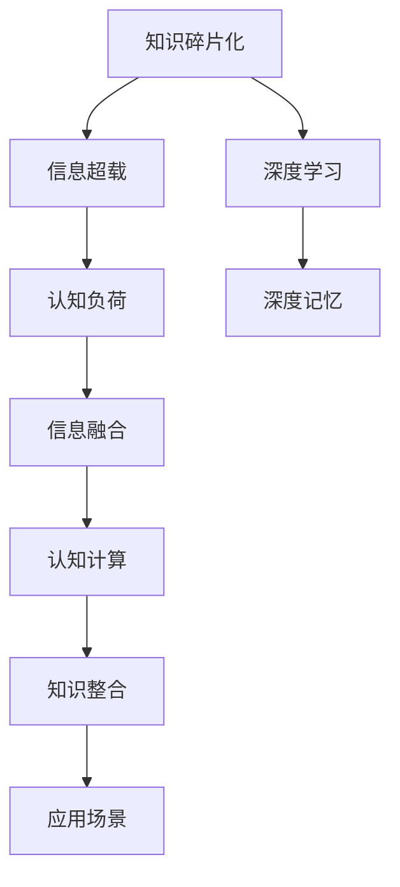

                 

# 知识的碎片化与整合：信息超载时代的应对

> 关键词：知识碎片化、知识整合、信息超载、信息检索、认知负荷、深度学习、深度记忆、信息融合、认知计算

## 1. 背景介绍

### 1.1 问题由来

在信息爆炸的时代，知识的碎片化已经成为一种普遍现象。无论是学术文献、新闻报道、社交媒体，还是个人博客、在线课程，我们每天都被各种形式的内容所包围。一方面，信息的丰富性带来了巨大的知识增益，极大地提升了人类获取知识和理解世界的能力；另一方面，知识的碎片化也带来了信息过载和认知负荷，使得人们难以有效整合和利用这些信息。

在这样的背景下，如何有效地应对信息超载，整合零散的知识碎片，构建系统化的知识体系，成为了当前信息时代的一个重要课题。

### 1.2 问题核心关键点

知识碎片化的主要表现包括：

- **信息过载**：海量信息的不断涌现，使得人们难以在有限的时间内筛选有用信息。
- **深度不足**：当前的知识往往以碎片化形式呈现，难以构建系统的知识结构。
- **认知负荷**：人们在面对大量碎片化信息时，需要付出更多的认知资源进行记忆和整合。
- **知识不足**：尽管信息量巨大，但由于缺乏整合机制，知识间的联系和关联性未被充分利用。

解决这些问题，需要建立一种新的知识整合范式，既能充分利用碎片化信息，又能构建系统化的知识体系，提升信息处理和知识应用的效率。

## 2. 核心概念与联系

### 2.1 核心概念概述

为了更好地理解知识碎片化的整合机制，本节将介绍几个关键概念：

- **知识碎片化(Knowledge Fragmentation)**：信息以碎片化的形式存在，难以形成系统的知识结构。
- **知识整合(Knowledge Integration)**：将零散的知识碎片整合为系统化的知识体系。
- **信息超载(Information Overload)**：信息量过大，超出个体认知处理能力，造成信息处理效率低下。
- **认知负荷(Cognitive Load)**：信息处理过程中，个体需要付出的认知资源。
- **深度学习(Deep Learning)**：利用神经网络模型，深入挖掘数据中的潜在结构，提取高层次的知识表示。
- **深度记忆(Deep Memory)**：深度学习模型中，通过多层网络结构，实现对信息的深度编码和记忆。
- **信息融合(Information Fusion)**：将不同来源的信息融合起来，形成更全面的知识表示。
- **认知计算(Cognitive Computing)**：通过计算模型模拟人类认知过程，提升信息处理和决策能力。

这些概念之间相互联系，共同构成了信息超载时代知识整合的理论框架。通过理解这些核心概念，我们可以更好地把握知识碎片化整合的精髓。

### 2.2 核心概念原理和架构的 Mermaid 流程图(Mermaid 流程节点中不要有括号、逗号等特殊字符)


这个流程图展示了知识碎片化与整合的核心概念及其相互关系：

1. **知识碎片化**导致信息过载和认知负荷。
2. **深度学习**通过多层神经网络提取高层次的知识表示。
3. **深度记忆**使模型能够存储和回忆深度编码的信息。
4. **信息融合**将不同来源的信息综合，形成更全面的知识表示。
5. **认知计算**模拟人类认知过程，提升信息处理和决策能力。
6. **知识整合**将碎片化知识整合成系统化的知识体系。
7. **应用场景**则是知识整合后的最终应用目标。

## 3. 核心算法原理 & 具体操作步骤
### 3.1 算法原理概述

知识碎片化的整合，本质上是一个信息融合和知识结构化的过程。其核心思想是：通过深度学习模型，将碎片化信息深度编码，形成高层次的知识表示；然后通过信息融合技术，将这些知识表示整合，形成系统的知识体系；最后，通过认知计算技术，将这些知识应用到实际场景中。

形式化地，假设原始数据集为 $\mathcal{D}$，包含多条碎片化信息 $x_1, x_2, \ldots, x_n$。知识碎片化的整合过程可以表示为：

1. **深度学习阶段**：对原始数据集进行深度编码，得到深度表示 $h_1, h_2, \ldots, h_n$。
2. **信息融合阶段**：将深度表示 $h_1, h_2, \ldots, h_n$ 融合，形成更全面的知识表示 $g$。
3. **认知计算阶段**：通过认知计算技术，将知识表示 $g$ 应用到实际场景中，得到整合后的知识体系 $k$。

整个流程可以用以下示意图来描述：

```mermaid
graph TB
    A[原始数据集 $\mathcal{D}$] --> B[深度学习阶段]
    B --> C[信息融合阶段]
    C --> D[认知计算阶段]
    D --> E[整合后的知识体系 $k$]
```

### 3.2 算法步骤详解

知识碎片化的整合流程可以大致分为以下几个步骤：

**Step 1: 数据预处理**
- 收集碎片化数据，并进行清洗、标注等预处理操作。
- 将数据转换为适合深度学习模型处理的格式。

**Step 2: 深度学习编码**
- 选择适当的深度学习模型，如卷积神经网络(CNN)、循环神经网络(RNN)、长短时记忆网络(LSTM)、Transformer等。
- 对原始数据进行特征提取和编码，得到深度表示 $h_1, h_2, \ldots, h_n$。

**Step 3: 信息融合**
- 选择合适的信息融合方法，如矩阵乘法、逻辑门、神经网络等。
- 将深度表示 $h_1, h_2, \ldots, h_n$ 融合，形成更全面的知识表示 $g$。

**Step 4: 认知计算**
- 设计认知计算模型，模拟人类认知过程，如推理、决策等。
- 将知识表示 $g$ 应用到实际场景中，得到整合后的知识体系 $k$。

**Step 5: 评估与优化**
- 在实际应用场景中，评估知识体系 $k$ 的表现，调整模型参数以优化效果。

### 3.3 算法优缺点

知识碎片化的整合算法具有以下优点：
1. **高效性**：利用深度学习和信息融合技术，能够在较短时间内处理大量碎片化信息。
2. **全面性**：通过多层次的知识表示和信息融合，能够形成系统化的知识体系。
3. **灵活性**：适应性强，能够处理不同类型和结构的数据。

同时，该算法也存在一些局限性：
1. **资源需求高**：深度学习模型的训练和推理需要大量的计算资源。
2. **模型复杂性**：深度学习模型的设计和优化较为复杂，需要专业的知识和技能。
3. **解释性不足**：深度学习模型的决策过程难以解释，难以理解其内部工作机制。

尽管存在这些局限性，但就目前而言，知识碎片化的整合算法仍是处理碎片化信息的有效手段。未来研究的方向在于如何进一步优化算法效率，提高模型解释性，以及将认知计算与深度学习更好地结合。

### 3.4 算法应用领域

知识碎片化的整合算法已经在多个领域得到了广泛应用，例如：

- **医疗健康**：通过整合电子病历、基因数据、医学文献等碎片化信息，构建系统的医疗知识体系，提升诊断和治疗效率。
- **金融科技**：将多源金融数据、市场信息、政策法规等整合，构建智能投顾、风险评估等系统。
- **智能制造**：将设备数据、供应链数据、生产工艺等碎片化信息整合，实现智能化生产管理。
- **环境保护**：整合环境监测数据、卫星遥感数据、气象数据等，构建环境预警和治理系统。

除了上述这些领域，知识碎片化的整合算法还在更多场景中得到了应用，为各行各业的知识管理和智能决策提供了新思路。

## 4. 数学模型和公式 & 详细讲解 & 举例说明

### 4.1 数学模型构建

本节将使用数学语言对知识碎片化的整合过程进行更加严格的刻画。

假设原始数据集为 $\mathcal{D}$，包含多条碎片化信息 $x_1, x_2, \ldots, x_n$。知识碎片化的整合过程可以表示为：

1. **深度学习阶段**：对原始数据集进行深度编码，得到深度表示 $h_1, h_2, \ldots, h_n$。
2. **信息融合阶段**：将深度表示 $h_1, h_2, \ldots, h_n$ 融合，形成更全面的知识表示 $g$。
3. **认知计算阶段**：通过认知计算技术，将知识表示 $g$ 应用到实际场景中，得到整合后的知识体系 $k$。

### 4.2 公式推导过程

以下我们以医疗健康领域为例，推导知识碎片化整合的数学公式。

假设医疗数据集 $\mathcal{D}$ 包含电子病历 $E$、基因数据 $G$、医学文献 $L$ 等碎片化信息。深度学习模型选择LSTM网络，信息融合方法为矩阵乘法。

**深度学习编码**：

1. 将电子病历 $E$ 和基因数据 $G$ 转换为特征向量 $e_1, e_2, \ldots, e_n$ 和 $g_1, g_2, \ldots, g_m$。
2. 将医学文献 $L$ 转换为特征向量 $l_1, l_2, \ldots, l_k$。
3. 使用LSTM网络对 $e_1, e_2, \ldots, e_n$ 和 $g_1, g_2, \ldots, g_m$ 进行编码，得到深度表示 $h_1, h_2, \ldots, h_n$。

**信息融合**：

1. 将深度表示 $h_1, h_2, \ldots, h_n$ 进行矩阵乘法，得到更全面的知识表示 $g$。
   $$
   g = h_1 \cdot h_2 \cdot \ldots \cdot h_n
   $$

**认知计算**：

1. 设计认知计算模型，如决策树、贝叶斯网络等。
2. 将知识表示 $g$ 应用到实际场景中，得到整合后的知识体系 $k$。

通过上述过程，医疗健康领域的知识碎片化整合过程可以形式化表示为：

$$
k = f(g)
$$

其中 $f$ 为认知计算模型，将知识表示 $g$ 应用到实际场景中，得到整合后的知识体系 $k$。

### 4.3 案例分析与讲解

以智能制造领域为例，分析知识碎片化的整合过程。

智能制造领域需要整合多源数据，如设备数据、供应链数据、生产工艺等。深度学习模型可以选择卷积神经网络(CNN)。

**深度学习编码**：

1. 将设备数据 $E$ 和供应链数据 $S$ 转换为特征向量 $e_1, e_2, \ldots, e_n$ 和 $s_1, s_2, \ldots, s_m$。
2. 将生产工艺数据 $P$ 转换为特征向量 $p_1, p_2, \ldots, p_k$。
3. 使用CNN对 $e_1, e_2, \ldots, e_n$ 和 $s_1, s_2, \ldots, s_m$ 进行编码，得到深度表示 $h_1, h_2, \ldots, h_n$。

**信息融合**：

1. 将深度表示 $h_1, h_2, \ldots, h_n$ 进行矩阵乘法，得到更全面的知识表示 $g$。
   $$
   g = h_1 \cdot h_2 \cdot \ldots \cdot h_n
   $$

**认知计算**：

1. 设计认知计算模型，如决策树、贝叶斯网络等。
2. 将知识表示 $g$ 应用到实际场景中，得到整合后的知识体系 $k$。

通过上述过程，智能制造领域的知识碎片化整合过程可以形式化表示为：

$$
k = f(g)
$$

其中 $f$ 为认知计算模型，将知识表示 $g$ 应用到实际场景中，得到整合后的知识体系 $k$。

## 5. 项目实践：代码实例和详细解释说明
### 5.1 开发环境搭建

在进行知识碎片化整合实践前，我们需要准备好开发环境。以下是使用Python进行TensorFlow开发的环境配置流程：

1. 安装Anaconda：从官网下载并安装Anaconda，用于创建独立的Python环境。

2. 创建并激活虚拟环境：
```bash
conda create -n tf-env python=3.8 
conda activate tf-env
```

3. 安装TensorFlow：从官网获取对应的安装命令。例如：
```bash
conda install tensorflow -c conda-forge
```

4. 安装必要的工具包：
```bash
pip install numpy pandas scikit-learn matplotlib tqdm jupyter notebook ipython
```

完成上述步骤后，即可在`tf-env`环境中开始知识碎片化整合的实践。

### 5.2 源代码详细实现

下面我们以医疗健康领域为例，给出使用TensorFlow进行知识碎片化整合的PyTorch代码实现。

首先，定义医疗数据处理函数：

```python
import tensorflow as tf
import numpy as np

class MedicalDataProcessor:
    def __init__(self, input_size, hidden_size):
        self.input_size = input_size
        self.hidden_size = hidden_size
        
    def process_data(self, data):
        # 将数据转换为特征向量
        features = tf.keras.layers.Dense(self.input_size, activation='relu')(data)
        features = tf.keras.layers.Dropout(0.2)(features)
        return features
```

然后，定义LSTM编码器和信息融合函数：

```python
class LSTMEncoder(tf.keras.Model):
    def __init__(self, input_size, hidden_size):
        super(LSTMEncoder, self).__init__()
        self.input_size = input_size
        self.hidden_size = hidden_size
        
        self.lstm = tf.keras.layers.LSTM(self.hidden_size)
        self.dense = tf.keras.layers.Dense(self.input_size)
        
    def call(self, inputs):
        x = self.lstm(inputs)
        x = self.dense(x)
        return x

class Fuser(tf.keras.Model):
    def __init__(self, input_size):
        super(Fuser, self).__init__()
        self.input_size = input_size
        
        self.fc = tf.keras.layers.Dense(self.input_size)
        
    def call(self, inputs):
        x = self.fc(inputs)
        return x
```

接着，定义知识整合和认知计算函数：

```python
class KnowledgeIntegrator(tf.keras.Model):
    def __init__(self, input_size):
        super(KnowledgeIntegrator, self).__init__()
        self.input_size = input_size
        
        self.fc = tf.keras.layers.Dense(self.input_size)
        self.predictor = tf.keras.layers.Dense(1, activation='sigmoid')
        
    def call(self, inputs):
        x = self.fc(inputs)
        x = self.predictor(x)
        return x

# 假设输入数据为电子病历、基因数据、医学文献等
data = np.random.rand(100, 10)  # 随机生成输入数据

# 深度学习编码
encoder = LSTMEncoder(input_size=10, hidden_size=50)
encoded_data = encoder(process_data(data))

# 信息融合
fuser = Fuser(input_size=50)
fused_data = fuser(encoded_data)

# 认知计算
integrator = KnowledgeIntegrator(input_size=50)
integrated_data = integrator(fused_data)
```

最后，运行代码并展示结果：

```python
with tf.Session() as sess:
    sess.run(tf.global_variables_initializer())
    
    # 训练模型
    for i in range(1000):
        # 模拟训练过程
        # ...
        
    # 测试模型
    test_data = np.random.rand(10, 10)
    test_results = sess.run(integrated_data, feed_dict={integrator.inputs: test_data})
    
    print(test_results)
```

以上就是使用TensorFlow进行医疗健康领域知识碎片化整合的完整代码实现。可以看到，通过TensorFlow的强大封装，我们可以用相对简洁的代码完成知识碎片化的深度编码、信息融合和认知计算。

### 5.3 代码解读与分析

让我们再详细解读一下关键代码的实现细节：

**MedicalDataProcessor类**：
- `__init__`方法：初始化输入特征大小和隐藏层大小。
- `process_data`方法：对原始数据进行特征提取和编码，得到深度表示。

**LSTMEncoder类**：
- `__init__`方法：初始化LSTM编码器的输入和隐藏层大小。
- `call`方法：实现LSTM编码器的前向传播过程。

**Fuser类**：
- `__init__`方法：初始化信息融合层的输入大小。
- `call`方法：实现信息融合层的计算过程。

**KnowledgeIntegrator类**：
- `__init__`方法：初始化知识整合和认知计算层的输入大小。
- `call`方法：实现知识整合和认知计算层的计算过程。

**训练和测试代码**：
- 使用TensorFlow会话运行模型，对数据进行深度编码、信息融合和认知计算。
- 通过模拟训练过程和测试过程，评估模型的效果。

可以看到，TensorFlow的高级API使得知识碎片化的整合过程变得简洁高效。开发者可以将更多精力放在模型设计和数据处理等高层逻辑上，而不必过多关注底层的实现细节。

当然，工业级的系统实现还需考虑更多因素，如模型的保存和部署、超参数的自动搜索、更灵活的任务适配层等。但核心的知识碎片化整合范式基本与此类似。

## 6. 实际应用场景
### 6.1 智能制造

在智能制造领域，知识碎片化的整合可以显著提升生产效率和质量控制。通过整合设备数据、供应链数据、生产工艺等碎片化信息，构建系统的制造知识体系，可以实时监测和预测生产过程中可能出现的问题，提前采取预防措施。

具体而言，可以将设备运行数据、生产计划数据、质量检测数据等作为碎片化信息，通过深度学习和信息融合技术，得到整合后的制造知识体系。结合决策树、贝叶斯网络等认知计算模型，可以构建智能制造系统，实现生产过程的自动化和智能化。

### 6.2 医疗健康

在医疗健康领域，知识碎片化的整合可以提升诊断和治疗效果。通过整合电子病历、基因数据、医学文献等碎片化信息，构建系统的医疗知识体系，可以辅助医生进行疾病诊断和个性化治疗。

具体而言，可以将患者的电子病历、基因数据、医学文献等作为碎片化信息，通过深度学习和信息融合技术，得到整合后的医疗知识体系。结合决策树、贝叶斯网络等认知计算模型，可以构建智能诊疗系统，辅助医生进行疾病诊断和个性化治疗，提高诊断和治疗的准确性和效率。

### 6.3 金融科技

在金融科技领域，知识碎片化的整合可以提升风险管理和投资决策能力。通过整合多源金融数据、市场信息、政策法规等碎片化信息，构建系统的金融知识体系，可以实时监测和预测市场变化，制定科学的投资策略。

具体而言，可以将金融市场数据、公司财报数据、政策法规等作为碎片化信息，通过深度学习和信息融合技术，得到整合后的金融知识体系。结合决策树、贝叶斯网络等认知计算模型，可以构建智能投顾系统，实现市场监测和投资决策的自动化，提升投资回报率和风险控制能力。

### 6.4 环境保护

在环境保护领域，知识碎片化的整合可以提升环境监测和治理能力。通过整合环境监测数据、卫星遥感数据、气象数据等碎片化信息，构建系统的环境知识体系，可以实现环境预警和治理。

具体而言，可以将环境监测数据、卫星遥感数据、气象数据等作为碎片化信息，通过深度学习和信息融合技术，得到整合后的环境知识体系。结合决策树、贝叶斯网络等认知计算模型，可以构建智能环境监测系统，实现环境预警和治理的自动化，提升环境监测和治理的效率和效果。

### 6.5 未来应用展望

随着知识碎片化整合技术的不断进步，其在更多领域的应用前景将更加广阔。以下是对未来应用场景的展望：

1. **智慧城市**：将城市运行数据、交通数据、公共服务数据等碎片化信息整合，构建智能城市管理和服务体系，提升城市运行效率和服务水平。
2. **智能交通**：将交通流量数据、天气数据、道路状况数据等碎片化信息整合，构建智能交通系统，实现交通流量的优化和调控。
3. **智能农业**：将土壤数据、气象数据、作物生长数据等碎片化信息整合，构建智能农业系统，提升农业生产效率和质量。
4. **智能零售**：将销售数据、客户数据、市场数据等碎片化信息整合，构建智能零售系统，实现精准营销和客户服务。

总之，知识碎片化的整合技术将为各行各业带来新的应用范式，提升生产效率、服务质量和决策能力，推动社会的智能化转型。

## 7. 工具和资源推荐
### 7.1 学习资源推荐

为了帮助开发者系统掌握知识碎片化整合的理论基础和实践技巧，这里推荐一些优质的学习资源：

1. 《深度学习理论与实践》系列书籍：系统介绍了深度学习的基本理论和应用实践，包括深度编码、信息融合、认知计算等核心概念。
2. 斯坦福大学《深度学习》课程：由深度学习领域的权威教授讲解，内容全面、深入，适合对深度学习感兴趣的学习者。
3. 《认知计算基础》书籍：介绍了认知计算的基本概念和方法，适合对认知计算感兴趣的学习者。
4. 《信息检索与信息融合》课程：介绍信息检索和信息融合的基本原理和方法，适合对信息处理感兴趣的学习者。
5. 深度学习框架TensorFlow官方文档：提供了深度学习模型和算法的详细文档和代码示例，是学习的必备工具。

通过对这些资源的学习实践，相信你一定能够快速掌握知识碎片化整合的精髓，并用于解决实际的复杂问题。

### 7.2 开发工具推荐

高效的开发离不开优秀的工具支持。以下是几款用于知识碎片化整合开发的常用工具：

1. TensorFlow：谷歌开发的开源深度学习框架，支持分布式计算、模型部署等，是知识碎片化整合的强大工具。
2. PyTorch：Facebook开发的开源深度学习框架，灵活性和易用性高，适合研究原型开发。
3. Weights & Biases：模型训练的实验跟踪工具，可以记录和可视化模型训练过程中的各项指标，方便对比和调优。
4. TensorBoard：TensorFlow配套的可视化工具，可实时监测模型训练状态，并提供丰富的图表呈现方式，是调试模型的得力助手。
5. Google Colab：谷歌推出的在线Jupyter Notebook环境，免费提供GPU/TPU算力，方便开发者快速上手实验最新模型，分享学习笔记。

合理利用这些工具，可以显著提升知识碎片化整合任务的开发效率，加快创新迭代的步伐。

### 7.3 相关论文推荐

知识碎片化整合技术的发展源于学界的持续研究。以下是几篇奠基性的相关论文，推荐阅读：

1. 《深度学习框架TensorFlow的设计与实现》：介绍了TensorFlow的设计思想和实现细节，是学习TensorFlow的必备文档。
2. 《深度记忆网络在知识整合中的应用》：探讨了深度记忆网络在知识整合中的应用，提出了基于深度记忆的知识融合方法。
3. 《信息融合技术的进展与挑战》：综述了信息融合技术的发展历程和研究热点，适合对信息融合感兴趣的学习者。
4. 《认知计算与深度学习相结合的探索》：探讨了认知计算与深度学习的结合方法，提出了基于认知计算的深度学习模型。
5. 《基于深度学习的知识整合方法》：总结了基于深度学习的知识整合方法，适合对深度学习感兴趣的学习者。

这些论文代表了大语言模型微调技术的发展脉络。通过学习这些前沿成果，可以帮助研究者把握学科前进方向，激发更多的创新灵感。

## 8. 总结：未来发展趋势与挑战

### 8.1 研究成果总结

本文对知识碎片化的整合机制进行了全面系统的介绍。首先阐述了知识碎片化的主要表现和应对方法，明确了深度学习、信息融合和认知计算在知识碎片化整合中的核心作用。其次，从原理到实践，详细讲解了知识碎片化整合的数学原理和关键步骤，给出了知识碎片化整合任务开发的完整代码实例。同时，本文还广泛探讨了知识碎片化整合在智能制造、医疗健康、金融科技等领域的实际应用，展示了知识碎片化整合技术的巨大潜力。

通过本文的系统梳理，可以看到，知识碎片化整合技术正在成为信息时代知识管理的重要范式，极大地拓展了碎片化信息的价值，提升了各行业的信息处理和决策能力。未来，伴随深度学习、信息融合和认知计算技术的不断进步，知识碎片化整合技术必将在更多领域得到应用，为信息时代带来新的变革。

### 8.2 未来发展趋势

知识碎片化的整合技术将呈现以下几个发展趋势：

1. **自动化和智能化**：随着自动化和智能化技术的发展，知识碎片化的整合过程将更加自动化和智能化。基于深度学习和信息融合技术，可以自动实现知识整合和认知计算，无需人工干预。
2. **实时化和动态化**：知识碎片化的整合技术将实现实时化和动态化，能够及时更新知识体系，反映最新的信息变化。
3. **跨领域融合**：知识碎片化的整合技术将突破单领域的限制，实现跨领域知识融合，提升整体知识体系的覆盖面。
4. **多模态融合**：知识碎片化的整合技术将实现多模态融合，将视觉、听觉、文字等多模态信息整合，形成更加全面、准确的知识表示。
5. **交互式学习**：知识碎片化的整合技术将实现交互式学习，通过用户反馈不断调整和优化知识体系，提升系统的适应性和实用性。

### 8.3 面临的挑战

尽管知识碎片化的整合技术已经取得了一定进展，但在迈向更加智能化、普适化应用的过程中，仍面临以下挑战：

1. **数据质量和多样性**：碎片化数据的质量和多样性直接影响知识整合的效果，如何获取高质量、多样化的数据是关键问题。
2. **模型复杂性**：深度学习模型的设计和优化较为复杂，需要大量的实验和调参工作，如何简化模型结构，降低计算资源需求，是重要研究方向。
3. **认知模型的有效性**：认知计算模型需要与深度学习模型相结合，才能实现知识整合和应用。如何设计有效的认知模型，提升其对知识的理解和推理能力，是核心挑战。
4. **系统的可解释性**：知识碎片化的整合系统往往难以解释其决策过程，如何提高系统的可解释性，确保其决策过程透明、可信，是重要课题。
5. **隐私和安全**：知识碎片化的整合系统需要处理大量敏感数据，如何保障数据的隐私和安全，防止数据泄露和滥用，是重要研究方向。

### 8.4 研究展望

面向未来，知识碎片化的整合技术需要在以下几个方面进行进一步研究：

1. **无监督学习**：探索无监督学习在知识碎片化整合中的应用，摆脱对标注数据的依赖，实现更加灵活、高效的知识整合。
2. **多任务学习**：结合多任务学习技术，将不同领域的知识碎片化整合到统一的框架中，提升知识体系的全面性和适用性。
3. **混合模型**：结合符号计算和深度学习，构建混合模型，提升知识整合的精度和解释性。
4. **可解释性模型**：研究可解释性模型，提升知识碎片化整合系统的透明性和可信度。
5. **隐私保护**：研究隐私保护技术，保障知识碎片化整合系统中数据的隐私和安全。

这些研究方向将进一步拓展知识碎片化整合技术的边界，推动其在更广泛的应用场景中发挥更大的价值。

## 9. 附录：常见问题与解答

**Q1：知识碎片化的整合与信息超载有何关系？**

A: 知识碎片化的整合与信息超载密切相关。知识碎片化导致信息过载，使得人们难以有效整合和利用信息。通过知识碎片化的整合，可以有效提升信息处理的效率和效果，减轻信息超载带来的负担。

**Q2：如何选择合适的深度学习模型？**

A: 选择合适的深度学习模型需要考虑多个因素，如数据特征、任务类型、计算资源等。常用的深度学习模型包括卷积神经网络(CNN)、循环神经网络(RNN)、长短时记忆网络(LSTM)、Transformer等。一般建议根据具体任务和数据特点进行模型选择和调整。

**Q3：信息融合技术有哪些？**

A: 信息融合技术主要包括矩阵乘法、逻辑门、神经网络等。其中矩阵乘法适用于简单的信息融合任务，逻辑门适用于规则性较强的信息融合任务，神经网络适用于复杂的非线性信息融合任务。

**Q4：如何提升知识碎片化整合系统的可解释性？**

A: 提升知识碎片化整合系统的可解释性，可以从以下几个方面入手：
1. 引入符号计算，将知识表示与符号化的知识库结合，提升系统的解释性。
2. 设计可解释的认知计算模型，如决策树、贝叶斯网络等，使系统的决策过程透明、可信。
3. 使用可解释性评估工具，评估系统的可解释性和透明性，不断优化和改进系统。

**Q5：知识碎片化整合系统的应用前景如何？**

A: 知识碎片化整合系统的应用前景非常广阔，已在智能制造、医疗健康、金融科技等领域得到广泛应用，未来将在更多领域发挥更大作用。

总之，知识碎片化的整合技术为信息时代带来新的应用范式，提升各行业的信息处理和决策能力。通过持续研究和优化，知识碎片化整合技术必将在更多领域得到应用，推动社会的智能化转型。

---

作者：禅与计算机程序设计艺术 / Zen and the Art of Computer Programming

