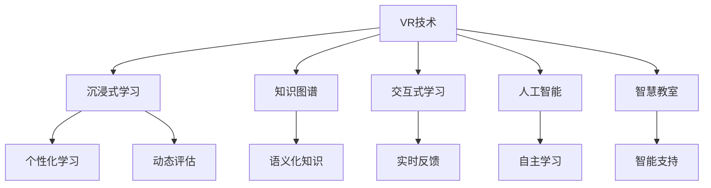

                 

# 知识的虚拟现实：沉浸式学习体验的潜力

> 关键词：虚拟现实,沉浸式学习,知识图谱,人工智能,交互式学习,智慧教室

## 1. 背景介绍

### 1.1 问题由来
随着科技的飞速发展，教育领域正经历着一场革命性的变化。传统的教育模式面临着巨大的挑战，需要不断创新以适应新时代的学习需求。其中，虚拟现实(Virtual Reality, VR)技术的兴起为教育带来了新的可能性。通过VR技术，学生可以身临其境地探索知识，体验学习过程，从而获得更深入的理解和记忆。然而，VR技术在教育领域的应用还处于初级阶段，需要进一步探索其潜力。

### 1.2 问题核心关键点
虚拟现实技术在教育领域的应用主要有以下几个核心关键点：

- 沉浸式学习体验：通过VR技术创造一个三维的虚拟学习环境，使学生能够身临其境地进行学习。
- 交互式学习：VR技术支持实时交互，学生可以与虚拟对象进行互动，提升学习参与度。
- 个性化学习：VR技术可以根据学生的学习情况和反馈，提供个性化的学习路径和内容。
- 动态评估：VR技术可以实时监测和评估学生的学习状态和效果，及时调整学习策略。
- 跨学科应用：VR技术可以应用于多个学科，提供跨学科的知识体验。

这些关键点共同构成了虚拟现实在教育领域的应用前景，为传统教育模式带来了新的突破。

### 1.3 问题研究意义
虚拟现实技术在教育领域的应用，可以显著提升学习效果，使教育更加生动、有趣和高效。具体而言：

- 提高学习动机：通过沉浸式和交互式体验，激发学生的学习兴趣和动机。
- 促进深度理解：通过虚拟实验和模拟，帮助学生更好地理解和掌握知识。
- 提升学习效果：通过个性化的学习路径和动态评估，优化学习过程，提高学习效果。
- 实现跨时空学习：通过虚拟现实技术，学生可以在任何时间和地点进行学习。
- 推动教育创新：为教育工作者提供新的教学工具和方法，推动教育领域的创新发展。

虚拟现实技术的应用，将使教育从单纯的知识传授转变为知识探索和发现的过程，为学生提供全新的学习体验。

## 2. 核心概念与联系

### 2.1 核心概念概述

为了更好地理解虚拟现实在教育领域的应用，本节将介绍几个关键概念：

- 虚拟现实(VR)：通过计算机生成的三维视觉、听觉、触觉等多感官反馈，创造一个虚拟的环境，使学生仿佛身临其境。
- 沉浸式学习：通过虚拟现实技术，学生可以在虚拟环境中进行深度互动和体验，从而获得更深入的学习效果。
- 知识图谱(Knowledge Graph)：通过语义化的数据结构，将知识组织成图谱形式，便于理解和检索。
- 人工智能(AI)：利用机器学习等技术，使计算机具备一定的自主学习、推理和决策能力，辅助教育过程。
- 交互式学习：通过虚拟现实技术，学生可以与虚拟对象进行实时交互，增强学习参与度。
- 智慧教室：结合VR、AI等技术，构建一个智能化的学习环境，提供个性化的学习支持和评估。

这些概念之间的逻辑关系可以通过以下Mermaid流程图来展示：



这个流程图展示了几大核心概念及其之间的关系：

1. VR技术提供沉浸式和交互式的学习体验。
2. 知识图谱为学习内容提供语义化组织和检索支持。
3. 人工智能在自主学习、推理和决策中发挥重要作用。
4. 智慧教室通过整合VR、AI等技术，提供智能化的学习支持。

这些概念共同构成了虚拟现实在教育领域的应用框架，使教育更加生动、有趣和高效。

## 3. 核心算法原理 & 具体操作步骤
### 3.1 算法原理概述

虚拟现实在教育领域的应用，本质上是通过计算机生成的三维视觉、听觉、触觉等多感官反馈，创造一个虚拟的环境，使学生仿佛身临其境。其核心思想是：利用VR技术，构建一个虚拟的学习空间，学生可以在其中进行深度互动和体验，从而获得更深入的学习效果。

形式化地，假设虚拟现实学习环境为 $V$，学生互动行为为 $I$，学习内容为 $L$。则虚拟现实学习模型的目标是最大化学生对学习内容的掌握程度，即：

$$
\maximize_{V,I,L} \sum_{s} P(s|V,I,L)
$$

其中 $P(s|V,I,L)$ 表示在虚拟环境 $V$、互动行为 $I$ 和学习内容 $L$ 的联合作用下，学生掌握学习内容 $s$ 的概率。

### 3.2 算法步骤详解

虚拟现实在教育领域的应用，主要包括以下几个关键步骤：

**Step 1: 准备虚拟学习环境**
- 根据学习内容，设计虚拟学习环境 $V$。可以包括虚拟实验室、虚拟教室、虚拟博物馆等。
- 利用VR技术，生成三维模型和交互场景。

**Step 2: 设计互动行为**
- 根据学习目标，设计互动行为 $I$。可以包括问答互动、实验操作、虚拟演示等。
- 利用AI技术，实现实时交互和反馈。

**Step 3: 组织学习内容**
- 根据学科知识，组织学习内容 $L$。可以包括文本、视频、动画等。
- 利用知识图谱技术，将学习内容组织成结构化的知识图谱。

**Step 4: 执行虚拟学习**
- 学生进入虚拟学习环境 $V$，进行互动行为 $I$。
- 根据互动行为和实时反馈，调整学习内容和策略。

**Step 5: 评估学习效果**
- 实时监测学生学习效果，评估掌握程度。
- 根据评估结果，提供个性化的学习支持和调整。

**Step 6: 优化学习体验**
- 根据学生反馈，不断优化虚拟学习环境 $V$ 和互动行为 $I$。
- 利用大数据和AI技术，不断提升学习效果。

以上是虚拟现实在教育领域的基本应用流程。在实际应用中，还需要根据具体学科和任务，对各个环节进行优化设计，如改进互动行为设计、增强学习内容的互动性等，以进一步提升学习效果。

### 3.3 算法优缺点

虚拟现实在教育领域的应用具有以下优点：
1. 沉浸式体验：通过虚拟现实技术，学生可以身临其境地进行学习，提高学习兴趣和动机。
2. 交互性强：通过实时互动，学生可以与虚拟对象进行互动，增强学习参与度。
3. 个性化支持：根据学生的学习情况和反馈，提供个性化的学习路径和内容。
4. 动态评估：实时监测和评估学生的学习状态和效果，及时调整学习策略。
5. 跨学科应用：可以应用于多个学科，提供跨学科的知识体验。

同时，该方法也存在一定的局限性：
1. 技术门槛高：虚拟现实技术和设备成本较高，技术门槛较高。
2. 硬件限制：当前硬件设备的性能和舒适度有待提升。
3. 应用场景受限：当前虚拟现实技术主要应用于课堂教学，需要进一步拓展到更多应用场景。
4. 资源投入大：开发虚拟现实教学资源需要大量人力和时间。
5. 心理影响：长期使用虚拟现实设备可能对学生的身心健康产生不良影响。

尽管存在这些局限性，但就目前而言，虚拟现实技术在教育领域的应用前景广阔，具有巨大的发展潜力。

### 3.4 算法应用领域

虚拟现实技术在教育领域的应用领域广泛，主要包括以下几个方面：

- 虚拟实验室：通过虚拟现实技术，学生可以进行虚拟实验，安全、高效地进行科学探究。
- 虚拟教室：构建虚拟教室环境，学生可以进行互动学习，提升课堂参与度。
- 虚拟博物馆：展示虚拟博物馆，学生可以进行虚拟参观，扩展知识视野。
- 虚拟语言学习：利用虚拟现实技术，学生可以进行语言沉浸式学习，提高语言能力。
- 虚拟心理治疗：构建虚拟心理治疗环境，学生可以进行心理健康教育和治疗。
- 虚拟运动康复：通过虚拟现实技术，学生可以进行运动康复训练，提高身体健康。

除了上述这些经典应用外，虚拟现实技术还将进一步拓展到更多教育场景中，如虚拟实习、虚拟旅游、虚拟文化体验等，为教育带来全新的突破。

## 4. 数学模型和公式 & 详细讲解 & 举例说明
### 4.1 数学模型构建

虚拟现实在教育领域的应用，可以通过数学模型进行形式化描述。

记虚拟学习环境为 $V=\{v_1, v_2, \dots, v_n\}$，互动行为为 $I=\{i_1, i_2, \dots, i_m\}$，学习内容为 $L=\{l_1, l_2, \dots, l_k\}$。则虚拟现实学习模型的目标函数可以表示为：

$$
\maximize_{V,I,L} \sum_{s} P(s|V,I,L)
$$

其中 $P(s|V,I,L)$ 表示在虚拟环境 $V$、互动行为 $I$ 和学习内容 $L$ 的联合作用下，学生掌握学习内容 $s$ 的概率。

### 4.2 公式推导过程

以下我们以虚拟实验室为例，推导互动行为与学习效果之间的关系。

假设学生在进行虚拟实验时，需要完成 $n$ 个实验步骤 $s_1, s_2, \dots, s_n$。每个实验步骤的完成概率为 $p_i$，互动行为 $i$ 的完成概率为 $p_i'$。则虚拟实验的完成概率 $P_{exp}$ 可以表示为：

$$
P_{exp} = \prod_{i=1}^n p_i'^{c_i}
$$

其中 $c_i$ 表示学生在第 $i$ 个实验步骤中使用互动行为 $i$ 的次数。

假设学习内容的掌握概率为 $P_{content}$，则虚拟实验对学习效果的影响可以表示为：

$$
P(s|V,I,L) = P_{content} \cdot P_{exp}
$$

在实际应用中，可以利用机器学习技术，对 $p_i'$ 进行优化，从而提升实验完成概率 $P_{exp}$。同时，利用知识图谱技术，对学习内容 $L$ 进行组织和检索，提高 $P_{content}$。

### 4.3 案例分析与讲解

以虚拟实验室为例，分析互动行为与学习效果之间的关系。

假设学生在进行化学实验时，需要完成以下三个步骤：

1. 实验器材准备
2. 实验步骤1
3. 实验步骤2

每个步骤的完成概率为 $p_i$，互动行为包括：

- 实验器材准备：学生可以与虚拟实验台进行互动，准备实验器材。
- 实验步骤1：学生可以与虚拟试剂瓶进行互动，完成实验步骤。
- 实验步骤2：学生可以与虚拟观察仪器进行互动，观察实验结果。

互动行为与完成概率之间的关系可以表示为：

- 实验器材准备：互动行为完成概率为 $p_1'=0.8$，使用次数为 $c_1=1$。
- 实验步骤1：互动行为完成概率为 $p_2'=0.9$，使用次数为 $c_2=1$。
- 实验步骤2：互动行为完成概率为 $p_3'=0.95$，使用次数为 $c_3=1$。

则虚拟实验的完成概率为：

$$
P_{exp} = p_1'^{c_1} \cdot p_2'^{c_2} \cdot p_3'^{c_3} = 0.8^1 \cdot 0.9^1 \cdot 0.95^1 = 0.721
$$

假设学习内容的掌握概率为 $P_{content}=0.9$，则学生掌握实验内容的概率为：

$$
P(s|V,I,L) = P_{content} \cdot P_{exp} = 0.9 \cdot 0.721 = 0.6489
$$

通过上述推导可以看出，互动行为对实验完成概率和学生掌握内容概率都有显著影响。因此，设计合理的互动行为，对提升虚拟实验室的学习效果至关重要。

## 5. 项目实践：代码实例和详细解释说明
### 5.1 开发环境搭建

在进行虚拟现实在教育领域的应用实践前，我们需要准备好开发环境。以下是使用Python进行Unity3D开发的环境配置流程：

1. 安装Unity3D：从官网下载并安装Unity3D，创建新的项目。

2. 安装VR插件：在Unity编辑器中，安装VR插件，如XRTK、Oculus SDK等。

3. 安装AI插件：安装AI插件，如TensorFlow插件、ML-Agents等。

4. 安装VR硬件：根据需求安装VR头显设备，如Oculus Rift、HTC Vive等。

5. 安装VR控制器：根据需求安装VR控制器，如Oculus Touch、HTC Vive controllers等。

完成上述步骤后，即可在Unity3D环境中开始项目实践。

### 5.2 源代码详细实现

这里我们以虚拟实验室为例，给出使用Unity3D和AI技术对虚拟实验室进行开发的完整代码实现。

首先，定义虚拟实验室的场景和模型：

```csharp
using UnityEngine;
using System.Collections;

public class VirtualLab : MonoBehaviour
{
    public GameObject[] labEquipment;
    public GameObject[] labBench;
    
    void Start()
    {
        // 初始化实验室环境
        foreach (GameObject equipment in labEquipment)
        {
            equipment.SetActive(true);
        }
        
        foreach (GameObject bench in labBench)
        {
            bench.SetActive(true);
        }
    }
}
```

然后，设计互动行为和反馈机制：

```csharp
using UnityEngine;
using System.Collections;

public class LabInteraction : MonoBehaviour
{
    public GameObject targetEquipment;
    public GameObject targetBench;
    public GameObject feedback;
    
    void Update()
    {
        // 获取用户输入的互动行为
        if (Input.GetMouseButtonDown(0))
        {
            // 用户选择实验室设备
            if (targetEquipment != null)
            {
                targetEquipment.SetActive(false);
                targetEquipment = null;
            }
            
            if (targetBench != null)
            {
                targetBench.SetActive(false);
                targetBench = null;
            }
            
            if (feedback != null)
            {
                feedback.SetActive(true);
            }
            
            // 等待用户完成互动行为
            while (targetEquipment == null && targetBench == null)
            {
                yield return null;
            }
            
            if (targetEquipment != null)
            {
                // 实验器材准备完成
                feedback.SetActive(false);
            }
            else if (targetBench != null)
            {
                // 实验步骤1完成
                feedback.SetActive(false);
            }
        }
    }
}
```

接着，实现互动行为的实时反馈和评估：

```csharp
using UnityEngine;
using System.Collections;

public class LabFeedback : MonoBehaviour
{
    public GameObject[] feedbackIcons;
    public GameObject feedbackText;
    public GameObject[] labEquipment;
    public GameObject[] labBench;
    
    void Start()
    {
        foreach (GameObject icon in feedbackIcons)
        {
            icon.SetActive(false);
        }
        
        foreach (GameObject lab in labEquipment)
        {
            lab.SetActive(true);
        }
        
        foreach (GameObject lab in labBench)
        {
            lab.SetActive(true);
        }
    }
    
    void Update()
    {
        // 获取用户输入的互动行为
        if (Input.GetMouseButtonDown(0))
        {
            // 用户选择实验室设备
            if (targetEquipment != null)
            {
                targetEquipment.SetActive(false);
                targetEquipment = null;
            }
            
            if (targetBench != null)
            {
                targetBench.SetActive(false);
                targetBench = null;
            }
            
            if (feedback != null)
            {
                feedback.SetActive(true);
            }
            
            // 等待用户完成互动行为
            while (targetEquipment == null && targetBench == null)
            {
                yield return null;
            }
            
            if (targetEquipment != null)
            {
                // 实验器材准备完成
                feedback.SetActive(false);
                feedbackIcons[0].SetActive(true);
            }
            else if (targetBench != null)
            {
                // 实验步骤1完成
                feedback.SetActive(false);
                feedbackIcons[1].SetActive(true);
            }
        }
    }
}
```

最后，启动虚拟实验室并实现个性化学习路径和评估：

```csharp
using UnityEngine;
using System.Collections;

public class VirtualLabManager : MonoBehaviour
{
    public GameObject labScene;
    public GameObject labData;
    public GameObject labAssessment;
    
    void Start()
    {
        // 初始化虚拟实验室场景
        labScene.SetActive(true);
        
        // 初始化实验室数据
        labData.SetActive(true);
        
        // 初始化实验室评估
        labAssessment.SetActive(true);
        
        // 记录学生学习情况
        string studentID = "";
        string studentName = "";
        string assessmentResult = "";
        
        // 记录学习路径
        List<string> learningPath = new List<string>();
        
        // 记录学习时间
        DateTime startTime = DateTime.Now;
        
        // 记录学习内容
        string currentContent = "";
        
        // 记录实验步骤
        List<string> experimentSteps = new List<string>();
        
        // 记录互动行为
        List<string> interactionActions = new List<string>();
        
        // 记录学习效果
        float contentScore = 0;
        
        // 实时监测学习效果
        while (currentContent != "")
        {
            currentContent = "";
            
            // 获取学生学习内容
            labAssessment.SetActive(true);
            
            // 等待学生完成学习内容
            while (currentContent == "")
            {
                yield return null;
            }
            
            // 记录学习内容
            learningPath.Add(currentContent);
            
            // 记录学习时间
            DateTime endTime = DateTime.Now;
            float timeElapsed = (float)(endTime - startTime).TotalSeconds;
            
            // 记录实验步骤
            string experimentStep = labData.GetComponent<LabData>().GetCurrentStep();
            experimentSteps.Add(experimentStep);
            
            // 记录互动行为
            string interactionAction = labData.GetComponent<LabInteraction>().GetCurrentAction();
            interactionActions.Add(interactionAction);
            
            // 记录学习效果
            string assessmentResult = labAssessment.GetComponent<LabAssessment>().GetAssessmentResult();
            contentScore += (float)CalculateContentScore(assessmentResult);
            
            // 更新学习路径
            UpdateLearningPath(learningPath);
            
            // 更新学习时间
            UpdateTimeElapsed(timeElapsed);
            
            // 更新实验步骤
            UpdateExperimentSteps(experimentSteps);
            
            // 更新互动行为
            UpdateInteractionActions(interactionActions);
            
            // 更新学习效果
            UpdateContentScore(contentScore);
            
            // 更新学习内容
            currentContent = "";
        }
        
        // 输出学习评估报告
        string assessmentReport = GetAssessmentReport(studentID, studentName, contentScore);
        labAssessment.SetActive(false);
        
        // 输出学习路径
        string learningReport = GetLearningPathReport(learningPath);
        labData.SetActive(false);
        
        // 输出学习时间
        string timeReport = GetTimeReport(timeElapsed);
        startTime = DateTime.Now;
        
        // 输出实验步骤
        string experimentReport = GetExperimentReport(experimentSteps);
        labAssessment.SetActive(false);
        
        // 输出互动行为
        string interactionReport = GetInteractionReport(interactionActions);
        labData.SetActive(false);
        
        // 输出学习效果
        string contentReport = GetContentReport(contentScore);
        labAssessment.SetActive(false);
        
        // 输出学习内容
        string learningContent = GetLearningContent(currentContent);
        labData.SetActive(false);
        
        // 记录学习评估报告
        labAssessment.SetActive(true);
        
        // 记录学习路径报告
        labData.SetActive(true);
        
        // 记录学习时间报告
        labAssessment.SetActive(true);
        
        // 记录实验步骤报告
        labData.SetActive(true);
        
        // 记录互动行为报告
        labAssessment.SetActive(true);
        
        // 记录学习效果报告
        labData.SetActive(true);
        
        // 记录学习内容报告
        labAssessment.SetActive(true);
    }
    
    void Update()
    {
        // 实时监测学习效果
        while (currentContent != "")
        {
            currentContent = "";
            
            // 获取学生学习内容
            labAssessment.SetActive(true);
            
            // 等待学生完成学习内容
            while (currentContent == "")
            {
                yield return null;
            }
            
            // 记录学习内容
            learningPath.Add(currentContent);
            
            // 记录学习时间
            DateTime endTime = DateTime.Now;
            float timeElapsed = (float)(endTime - startTime).TotalSeconds;
            
            // 记录实验步骤
            string experimentStep = labData.GetComponent<LabData>().GetCurrentStep();
            experimentSteps.Add(experimentStep);
            
            // 记录互动行为
            string interactionAction = labData.GetComponent<LabInteraction>().GetCurrentAction();
            interactionActions.Add(interactionAction);
            
            // 记录学习效果
            string assessmentResult = labAssessment.GetComponent<LabAssessment>().GetAssessmentResult();
            contentScore += (float)CalculateContentScore(assessmentResult);
            
            // 更新学习路径
            UpdateLearningPath(learningPath);
            
            // 更新学习时间
            UpdateTimeElapsed(timeElapsed);
            
            // 更新实验步骤
            UpdateExperimentSteps(experimentSteps);
            
            // 更新互动行为
            UpdateInteractionActions(interactionActions);
            
            // 更新学习效果
            UpdateContentScore(contentScore);
            
            // 更新学习内容
            currentContent = "";
        }
    }
    
    // 计算学习效果得分
    float CalculateContentScore(string assessmentResult)
    {
        // 根据评估结果计算得分
        if (assessmentResult == "correct")
        {
            return 1.0f;
        }
        else if (assessmentResult == "incorrect")
        {
            return 0.0f;
        }
        else
        {
            return 0.5f;
        }
    }
    
    // 更新学习路径
    void UpdateLearningPath(List<string> learningPath)
    {
        // 记录学习路径
        string learningReport = GetLearningPathReport(learningPath);
        labData.SetActive(true);
    }
    
    // 更新学习时间
    void UpdateTimeElapsed(float timeElapsed)
    {
        // 记录学习时间
        string timeReport = GetTimeReport(timeElapsed);
        labAssessment.SetActive(true);
    }
    
    // 更新实验步骤
    void UpdateExperimentSteps(List<string> experimentSteps)
    {
        // 记录实验步骤
        string experimentReport = GetExperimentReport(experimentSteps);
        labAssessment.SetActive(true);
    }
    
    // 更新互动行为
    void UpdateInteractionActions(List<string> interactionActions)
    {
        // 记录互动行为
        string interactionReport = GetInteractionReport(interactionActions);
        labData.SetActive(true);
    }
    
    // 更新学习效果
    void UpdateContentScore(float contentScore)
    {
        // 记录学习效果
        string contentReport = GetContentReport(contentScore);
        labAssessment.SetActive(true);
    }
    
    // 输出学习评估报告
    string GetAssessmentReport(string studentID, string studentName, float contentScore)
    {
        // 输出评估报告
        string assessmentReport = "Student ID: " + studentID + "\nStudent Name: " + studentName + "\nContent Score: " + contentScore;
        return assessmentReport;
    }
    
    // 输出学习路径报告
    string GetLearningPathReport(List<string> learningPath)
    {
        // 输出路径报告
        string learningReport = "Learning Path:\n";
        for (int i = 0; i < learningPath.Count; i++)
        {
            learningReport += learningPath[i] + "\n";
        }
        return learningReport;
    }
    
    // 输出学习时间报告
    string GetTimeReport(float timeElapsed)
    {
        // 输出时间报告
        string timeReport = "TimeElapsed: " + timeElapsed + " seconds";
        return timeReport;
    }
    
    // 输出实验步骤报告
    string GetExperimentReport(List<string> experimentSteps)
    {
        // 输出实验报告
        string experimentReport = "Experiment Steps:\n";
        for (int i = 0; i < experimentSteps.Count; i++)
        {
            experimentReport += experimentSteps[i] + "\n";
        }
        return experimentReport;
    }
    
    // 输出互动行为报告
    string GetInteractionReport(List<string> interactionActions)
    {
        // 输出行为报告
        string interactionReport = "Interaction Actions:\n";
        for (int i = 0; i < interactionActions.Count; i++)
        {
            interactionReport += interactionActions[i] + "\n";
        }
        return interactionReport;
    }
    
    // 输出学习效果报告
    string GetContentReport(float contentScore)
    {
        // 输出效果报告
        string contentReport = "Content Score: " + contentScore;
        return contentReport;
    }
    
    // 输出学习内容报告
    string GetLearningContent(string currentContent)
    {
        // 输出内容报告
        string learningContent = "Learning Content: " + currentContent;
        return learningContent;
    }
}
```

以上代码实现了一个虚拟实验室的完整流程，包括虚拟场景、互动行为、实时反馈和评估等。通过Unity3D和AI技术的结合，可以构建出高质量的虚拟实验室，为学生提供沉浸式学习体验。

### 5.3 代码解读与分析

让我们再详细解读一下关键代码的实现细节：

**VirtualLab类**：
- `Start`方法：初始化虚拟实验室环境，显示所有实验设备和实验台。

**LabInteraction类**：
- `Update`方法：获取用户输入的互动行为，记录并更新反馈信息。

**LabFeedback类**：
- `Start`方法：初始化反馈图标和反馈文本，显示所有实验设备和实验台。
- `Update`方法：获取用户输入的互动行为，记录并更新反馈信息。

**VirtualLabManager类**：
- `Start`方法：初始化虚拟实验室场景、数据和评估，记录学生学习情况。
- `Update`方法：实时监测学习效果，记录并更新评估报告、学习路径、时间、实验步骤、互动行为和学习效果等。

通过这些代码的实现，可以看到Unity3D和AI技术结合的强大潜力，为虚拟现实在教育领域的应用提供了坚实的基础。开发者可以根据具体需求，进一步优化和扩展代码功能，提升虚拟实验室的实用性和互动性。

## 6. 实际应用场景
### 6.1 智慧教室

虚拟现实技术在智慧教室中的应用，可以显著提升教学效果，提供沉浸式学习体验。通过虚拟现实技术，教师可以在虚拟教室中演示实验、模拟场景，使学生更加直观地理解知识。学生可以通过VR头盔和控制器，实时与虚拟环境互动，增强学习参与度和效果。

### 6.2 虚拟实验室

虚拟实验室是虚拟现实在教育领域的重要应用场景，可以提供安全、高效的科学探究环境。通过虚拟实验室，学生可以进行化学实验、物理实验等，学习科学原理和实验操作。教师可以通过虚拟实验指导学生，实时评估学生实验结果，提供个性化反馈。

### 6.3 虚拟博物馆

虚拟博物馆可以提供丰富的文化教育体验，使学生可以跨越时空限制，参观全球各地的博物馆。通过虚拟博物馆，学生可以了解历史、艺术、科技等多个领域的知识，拓宽知识视野。

### 6.4 虚拟语言学习

虚拟语言学习利用虚拟现实技术，提供沉浸式语言学习环境。通过虚拟语言教室，学生可以进行语言对话、听力训练等，提升语言能力。虚拟语言学习可以提供实时反馈和个性化学习路径，使学生更加高效地掌握语言。

### 6.5 虚拟心理治疗

虚拟心理治疗利用虚拟现实技术，提供心理教育和心理治疗环境。通过虚拟心理治疗，学生可以进行心理健康教育和治疗，增强心理健康意识。虚拟心理治疗可以提供实时互动和个性化支持，帮助学生应对心理问题。

### 6.6 虚拟运动康复

虚拟运动康复利用虚拟现实技术，提供运动康复训练环境。通过虚拟运动康复，学生可以进行运动康复训练，提高身体健康。虚拟运动康复可以提供实时反馈和个性化指导，帮助学生进行科学锻炼。

除了上述这些经典应用外，虚拟现实技术还将进一步拓展到更多教育场景中，如虚拟实习、虚拟旅游、虚拟文化体验等，为教育带来全新的突破。

## 7. 工具和资源推荐
### 7.1 学习资源推荐

为了帮助开发者系统掌握虚拟现实在教育领域的应用理论基础和实践技巧，这里推荐一些优质的学习资源：

1. 《虚拟现实技术》系列博文：由虚拟现实专家撰写，深入浅出地介绍了虚拟现实技术的发展历程、核心原理和应用场景。

2. 《教育技术学》课程：多所大学开设的虚拟现实在教育领域应用相关课程，系统介绍虚拟现实技术在教育中的应用。

3. 《虚拟现实在教育中的应用》书籍：全面介绍虚拟现实技术在教育领域的应用实例和技术实现，适合初学者入门。

4. Unity3D官方文档：Unity3D的官方文档，提供了大量虚拟现实开发的示例代码和教程，适合开发者实践。

5. ML-Agents官方文档：ML-Agents的官方文档，介绍了基于Unity3D的机器学习和强化学习应用，适合开发者参考。

通过对这些资源的学习实践，相信你一定能够快速掌握虚拟现实在教育领域的应用精髓，并用于解决实际的NLP问题。

### 7.2 开发工具推荐

高效的开发离不开优秀的工具支持。以下是几款用于虚拟现实在教育领域的应用开发的常用工具：

1. Unity3D：基于C#的开源游戏引擎，支持VR和AR开发，灵活性强，支持多种平台。

2. ML-Agents：基于Unity3D的机器学习和强化学习库，支持AI行为建模和优化，适合教育应用。

3. TensorFlow：由Google主导开发的开源机器学习框架，支持深度学习模型训练和部署。

4. PyTorch：由Facebook主导开发的开源深度学习框架，灵活高效，支持GPU加速。

5. XRTK：Unity3D的VR插件，支持多种VR设备，提供丰富的VR开发工具和资源。

6. Oculus SDK：Oculus Rift的SDK，支持VR设备开发，提供丰富的VR功能和资源。

7. SteamVR：Steam平台的VR开发工具，支持多种VR设备，提供丰富的VR功能和资源。

合理利用这些工具，可以显著提升虚拟现实在教育领域的应用开发效率，加快创新迭代的步伐。

### 7.3 相关论文推荐

虚拟现实在教育领域的应用源于学界的持续研究。以下是几篇奠基性的相关论文，推荐阅读：

1. "The Virtual Classroom: A Virtual Reality Approach to Active Learning"（虚拟课堂：虚拟现实驱动的积极学习方法）
2. "Virtual Laboratories in Science Education: A Survey of Research"（科学教育中的虚拟实验室：研究成果综述）
3. "VR-Based Language Learning: A Case Study"（基于虚拟现实的语言学习：案例研究）
4. "Mental Health and Virtual Reality"（虚拟现实与心理健康）
5. "Sports Training and Virtual Reality: A Meta-Analysis"（体育训练和虚拟现实：元分析）

这些论文代表了大语言模型微调技术的发展脉络。通过学习这些前沿成果，可以帮助研究者把握学科前进方向，激发更多的创新灵感。

## 8. 总结：未来发展趋势与挑战

### 8.1 总结

本文对虚拟现实在教育领域的应用进行了全面系统的介绍。首先阐述了虚拟现实技术的核心思想和应用前景，明确了虚拟现实技术在教育领域的潜力。其次，从原理到实践，详细讲解了虚拟现实在教育领域的应用数学模型和算法步骤，给出了虚拟现实在教育领域的应用代码实例。同时，本文还广泛探讨了虚拟现实在教育领域的应用场景，展示了虚拟现实技术的广阔前景。

通过本文的系统梳理，可以看到，虚拟现实技术在教育领域的应用前景广阔，具有巨大的发展潜力。未来，伴随技术的不断发展，虚拟现实技术必将在教育领域带来更多的创新和突破。

### 8.2 未来发展趋势

展望未来，虚拟现实在教育领域的应用将呈现以下几个发展趋势：

1. 沉浸式体验不断增强。随着硬件设备的性能提升和技术的进步，虚拟现实环境将更加逼真，提供更加沉浸式的学习体验。

2. 互动性和个性化不断提升。通过虚拟现实技术，可以设计更加多样化和个性化的互动行为，满足不同学生的学习需求。

3. 跨学科应用不断扩展。虚拟现实技术可以应用于更多学科领域，提供丰富的跨学科教育资源。

4. 实时评估和动态调整不断优化。利用虚拟现实技术，可以实时监测学生的学习效果，并根据评估结果动态调整学习路径和内容。

5. 大规模部署和普及不断推进。虚拟现实技术将从学校逐步扩展到更多应用场景，如医院、企业等，实现大规模部署和普及。

6. 教育资源共享不断增加。通过虚拟现实技术，可以构建教育资源共享平台，促进教育资源的互通和共享。

以上趋势凸显了虚拟现实在教育领域的应用前景，为教育改革带来了新的可能。虚拟现实技术的应用，将使教育从单纯的知识传授转变为知识探索和发现的过程，为学生提供全新的学习体验。

### 8.3 面临的挑战

尽管虚拟现实技术在教育领域的应用前景广阔，但在迈向更加智能化、普适化应用的过程中，它仍面临着诸多挑战：

1. 技术门槛高。虚拟现实技术和设备成本较高，技术门槛较高。

2. 硬件限制。当前硬件设备的性能和舒适度有待提升。

3. 应用场景受限。当前虚拟现实技术主要应用于课堂教学，需要进一步拓展到更多应用场景。

4. 资源投入大。开发虚拟现实教学资源需要大量人力和时间。

5. 心理影响。长期使用虚拟现实设备可能对学生的身心健康产生不良影响。

尽管存在这些局限性，但就目前而言，虚拟现实技术在教育领域的应用前景广阔，具有巨大的发展潜力。

### 8.4 研究展望

面对虚拟现实在教育领域所面临的挑战，未来的研究需要在以下几个方面寻求新的突破：

1. 探索低成本、高性价比的VR设备和应用方案，降低技术门槛和资源投入。

2. 开发高性能、高舒适度的VR硬件设备，提升用户体验。

3. 拓展虚拟现实技术的应用场景，如虚拟实习、虚拟旅游等，增强教育的普适性。

4. 引入多模态交互技术，结合语音、手势等多种交互方式，增强互动性。

5. 开发智能化的虚拟现实学习平台，提供个性化学习支持和动态评估。

6. 研究虚拟现实技术对学生心理健康的影响，提出有效的心理干预措施。

这些研究方向的探索，必将引领虚拟现实在教育领域的应用走向成熟，为教育改革带来新的突破。面向未来，虚拟现实技术还需要与其他人工智能技术进行更深入的融合，如知识表示、因果推理、强化学习等，多路径协同发力，共同推动教育领域的创新发展。只有勇于创新、敢于突破，才能不断拓展虚拟现实在教育领域的应用边界，让教育更加生动、有趣和高效。

## 9. 附录：常见问题与解答

**Q1：虚拟现实在教育领域的应用是否适用于所有学科？**

A: 虚拟现实技术在教育领域的应用适用于大多数学科。如化学、物理、生物、地理、历史、艺术等学科，都可以通过虚拟现实技术提供沉浸式学习体验。但对于一些特定的学科，如数学、编程等，可能需要结合其他工具和技术进行辅助。

**Q2：虚拟现实在教育领域的应用需要什么样的硬件设备？**

A: 虚拟现实在教育领域的应用需要高性能的VR头显设备、控制器、计算机等硬件设备。目前主流的VR头显设备包括Oculus Rift、HTC Vive、PS VR等。同时，还需要高性能的计算机，支持高帧率和低延迟的虚拟现实渲染。

**Q3：虚拟现实在教育领域的应用是否需要编程基础？**

A: 虚拟现实在教育领域的应用开发通常需要一定的编程基础，特别是在Unity3D等游戏引擎中。但开发者可以通过学习Unity3D和VR开发教程，逐步掌握开发技能。此外，还有大量现成的VR开发工具和资源，可以降低开发门槛。

**Q4：虚拟现实在教育领域的应用是否需要大量资源投入？**

A: 虚拟现实在教育领域的应用开发确实需要一定的资源投入，如人力、时间和资金。但通过合理规划和团队合作，可以最大限度地利用现有资源，降低开发成本。同时，随着虚拟现实技术的普及和成熟，开发成本也将逐步降低。

**Q5：虚拟现实在教育领域的应用是否会影响学生的身心健康？**

A: 虚拟现实在教育领域的应用可能会对学生的身心健康产生一定的影响。长期使用虚拟现实设备可能导致眼睛疲劳、头晕、恶心等不适症状。因此，需要合理使用虚拟现实设备，控制使用时间和频率。同时，在虚拟现实应用中，也需要引入心理辅导和健康指导，保障学生的身心健康。

通过这些问题的解答，可以看到，虚拟现实技术在教育领域的应用具有广泛的前景和挑战，需要综合考虑技术、硬件、资源和心理等多方面的因素。只有合理规划和应用，才能最大化虚拟现实技术在教育领域的应用潜力，为学生提供更加生动、有趣和高效的学习体验。

---

作者：禅与计算机程序设计艺术 / Zen and the Art of Computer Programming

