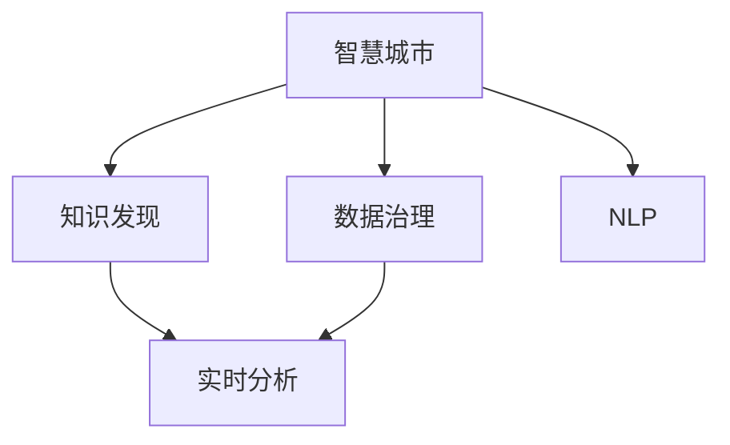

                 

# 知识管理在智慧城市建设中的作用

> 关键词：智慧城市, 知识管理, 数据治理, 大数据, 人工智能, 自然语言处理, 实时分析

## 1. 背景介绍

### 1.1 问题由来

智慧城市建设是当前全球城市发展的新方向，旨在通过物联网、大数据、人工智能等先进技术，提升城市的运行效率、管理水平和生活质量。然而，智慧城市建设涉及海量数据的采集、存储、分析与应用，面临着数据规模庞大、来源多样、价值密度低、更新频繁等挑战。如何在数据海洋中提取有价值的信息，并实时应用于城市管理，是大数据时代智慧城市建设的核心问题。

知识管理(Knowledge Management, KM)技术，通过科学管理和高效利用知识资源，帮助决策者从数据中提取出有意义的洞见，支持智慧城市的决策制定和行动执行。知识管理在智慧城市建设中起到了桥梁和加速器的作用，为城市运行提供了坚实的知识支撑。

### 1.2 问题核心关键点

智慧城市中的知识管理，主要包括数据收集、数据清洗、知识发现、知识共享和知识应用等环节。其核心在于：

1. 高效的数据治理机制：确保数据来源的准确性、完整性和一致性，避免数据冗余和冲突。
2. 智能的知识发现机制：利用自然语言处理和机器学习技术，从海量数据中抽取有价值的知识模式和洞见。
3. 灵活的知识共享平台：建立一个支持多模态知识展示和互动的平台，促进知识在城市不同部门和用户之间的流通。
4. 紧密的知识应用场景：将知识应用于城市交通、公共安全、环保等关键领域，提升城市管理效率和质量。

## 2. 核心概念与联系

### 2.1 核心概念概述

智慧城市知识管理涉及多个关键概念，包括：

- 智慧城市：通过智能技术和大数据手段，对城市资源进行优化配置和高效管理，实现城市运行的智能化、高效化和人性化。
- 数据治理：对城市中采集的多源异构数据进行质量控制、分类、标准化和整合，保证数据的一致性和可用性。
- 知识发现：利用数据分析、机器学习等技术，从数据中挖掘出有价值的洞见和模式，供城市管理者参考决策。
- 自然语言处理(NLP)：利用计算机技术处理和分析人类语言，实现对文本数据的理解和生成，是知识发现的重要工具。
- 实时分析：对城市运行数据进行实时监控和分析，及时发现异常和改进，提升城市运行的智能化水平。

这些概念之间的逻辑关系可以通过以下Mermaid流程图来展示：



## 3. 核心算法原理 & 具体操作步骤

### 3.1 算法原理概述

智慧城市知识管理的核心算法包括以下几个关键步骤：

1. 数据采集与治理：通过传感器、摄像头、GPS等多种手段，采集城市运行数据，并对数据进行清洗、分类和标准化处理。
2. 知识发现与表示：利用NLP、数据挖掘、机器学习等技术，从数据中提取有价值的知识模式和洞见，并进行表示。
3. 知识共享与协作：建立一个支持多模态知识展示和互动的平台，促进知识在城市不同部门和用户之间的流通。
4. 知识应用与决策：将知识应用于城市交通、公共安全、环保等关键领域，提升城市管理效率和质量。

智慧城市知识管理的算法原理如图3所示：


### 3.2 算法步骤详解

#### 数据采集与治理

数据采集是智慧城市知识管理的第一步，涉及传感器、摄像头、GPS等多种数据采集手段。采集的数据包括交通流量、环境监测、公共设施状态等。

数据治理的目的是对采集的数据进行清洗、分类和标准化处理。数据治理过程包括以下几个关键步骤：

1. 数据清洗：识别并删除错误、重复或无用的数据，确保数据的准确性和完整性。
2. 数据分类：将数据按照业务逻辑进行分类，如将交通数据分为车辆、行人、自行车等类别。
3. 数据标准化：对数据进行格式化处理，如将温度数据单位从华氏转换为摄氏，保证数据的一致性和可比性。

数据治理的算法步骤如下：

```python
def data_governance(data):
    # 数据清洗
    cleaned_data = remove_duplicates(data)
    cleaned_data = remove_errors(data)
    
    # 数据分类
    classified_data = classify(data)
    
    # 数据标准化
    standardized_data = normalize(data)
    
    return cleaned_data
```

#### 知识发现与表示

知识发现是智慧城市知识管理的核心步骤，其目标是从数据中提取有价值的洞见和模式，供城市管理者参考决策。知识发现的算法包括以下几个关键步骤：

1. 数据预处理：对数据进行归一化、降维、特征选择等预处理操作，提高算法的准确性和效率。
2. 数据挖掘：利用聚类、分类、关联规则等算法，从数据中挖掘出有价值的洞见和模式。
3. 知识表示：将挖掘出的知识进行表示，如转换为图形、表格或文本等形式，方便用户理解和应用。

知识发现的算法步骤如下：

```python
def knowledge_discovery(data):
    # 数据预处理
    preprocessed_data = preprocess(data)
    
    # 数据挖掘
    mined_knowledge = mine_knowledge(preprocessed_data)
    
    # 知识表示
    represented_knowledge = represent(mined_knowledge)
    
    return represented_knowledge
```

#### 知识共享与协作

知识共享与协作是智慧城市知识管理的重要环节，其目的是建立一个支持多模态知识展示和互动的平台，促进知识在城市不同部门和用户之间的流通。知识共享与协作的算法包括以下几个关键步骤：

1. 知识展示：将知识以图形、表格或文本等形式展示在知识平台上，供用户查看和理解。
2. 知识互动：支持用户对知识进行评论、点赞、分享等互动操作，增加知识的活跃度和应用效果。
3. 知识搜索：提供强大的搜索功能，方便用户快速找到所需知识。

知识共享与协作的算法步骤如下：

```python
def knowledge_sharing(knowledge):
    # 知识展示
    display_knowledge(knowledge)
    
    # 知识互动
    interact_knowledge(knowledge)
    
    # 知识搜索
    search_knowledge(knowledge)
    
    return knowledge
```

#### 知识应用与决策

知识应用与决策是智慧城市知识管理的最终目标，其目的是将知识应用于城市交通、公共安全、环保等关键领域，提升城市管理效率和质量。知识应用与决策的算法包括以下几个关键步骤：

1. 知识融合：将不同来源和类型的知识进行融合，形成综合性的知识库。
2. 知识推理：利用规则推理、因果推理等技术，从知识库中推理出具体的决策建议。
3. 决策执行：将决策建议转化为具体的执行操作，如交通信号灯控制、环境监测等。

知识应用与决策的算法步骤如下：

```python
def knowledge_application(knowledge):
    # 知识融合
    fused_knowledge = fuse_knowledge(knowledge)
    
    # 知识推理
    inferred_decisions = infer_decisions(fused_knowledge)
    
    # 决策执行
    execute_decisions(inferred_decisions)
    
    return knowledge
```

### 3.3 算法优缺点

智慧城市知识管理的算法具有以下优点：

1. 提高城市管理效率：通过从数据中提取有价值的洞见和模式，支持城市管理者进行决策制定，提升城市运行效率。
2. 促进知识共享与协作：建立一个支持多模态知识展示和互动的平台，促进城市不同部门和用户之间的知识交流和合作。
3. 支持数据驱动决策：通过数据治理和知识发现，确保城市管理的科学性和合理性，避免决策的盲目性和错误。

智慧城市知识管理的算法也存在一些缺点：

1. 数据质量依赖性强：数据治理的质量直接影响知识发现的准确性和可靠性。
2. 算法复杂度高：知识发现和推理算法往往涉及复杂的数据处理和计算，需要高效的计算资源和算法模型。
3. 知识共享挑战多：知识共享平台需要支持多种数据类型和格式的展示和互动，实现难度较大。

## 4. 数学模型和公式 & 详细讲解 & 举例说明

### 4.1 数学模型构建

智慧城市知识管理涉及多个数学模型，包括数据治理、知识发现和知识应用等。以下是对这些模型的详细介绍：

#### 数据治理

数据治理模型包括以下几个关键变量：

- 数据量 $n$：采集的数据总量。
- 错误数据比例 $p$：错误数据的比例。
- 重复数据比例 $r$：重复数据的比例。

数据治理的目标是最小化错误数据和重复数据的比例，提高数据的准确性和完整性。数学模型如下：

$$
\minimize_{p, r} \quad p + r
$$

数据治理的约束条件包括：

1. 错误数据总量 $e$：
   $$
   e \leq p \cdot n
   $$

2. 重复数据总量 $d$：
   $$
   d \leq r \cdot n
   $$

数据治理的数学模型为：

$$
\minimize_{p, r} \quad p + r \\
\text{subject to} \\
e \leq p \cdot n \\
d \leq r \cdot n
$$

### 4.2 公式推导过程

数据治理模型的推导过程如下：

设采集的数据总量为 $n$，错误数据比例为 $p$，重复数据比例为 $r$。错误数据总量 $e$ 和重复数据总量 $d$ 分别为：

$$
e = p \cdot n \\
d = r \cdot n
$$

数据治理的目标是最小化错误数据和重复数据的比例，数学模型为：

$$
\minimize_{p, r} \quad p + r \\
\text{subject to} \\
e \leq p \cdot n \\
d \leq r \cdot n
$$

根据目标函数和约束条件，可以求解出 $p$ 和 $r$ 的最优解。求解过程如下：

$$
\begin{aligned}
& \minimize_{p, r} \quad p + r \\
& \text{subject to} \\
& p \cdot n \leq e \\
& r \cdot n \leq d
\end{aligned}
$$

由约束条件可得：

$$
p \leq \frac{e}{n} \\
r \leq \frac{d}{n}
$$

因此：

$$
\minimize_{p, r} \quad p + r \\
\text{subject to} \\
0 \leq p \leq \frac{e}{n} \\
0 \leq r \leq \frac{d}{n}
$$

求解上述线性规划问题，可以得到最优的 $p$ 和 $r$，从而完成数据治理过程。

### 4.3 案例分析与讲解

以下是一个数据治理的案例分析：

某智慧城市采集了每天5000条交通流量数据，其中错误数据比例为10%，重复数据比例为5%。数据治理的目标是最大化数据量，同时最小化错误数据和重复数据的比例。

根据数据治理模型，可以得到：

$$
\begin{aligned}
& \minimize_{p, r} \quad p + r \\
& \text{subject to} \\
& 10\% \cdot 5000 \leq e \\
& 5\% \cdot 5000 \leq d
\end{aligned}
$$

化简可得：

$$
\begin{aligned}
& \minimize_{p, r} \quad p + r \\
& \text{subject to} \\
& p \leq 0.1 \\
& r \leq 0.05
\end{aligned}
$$

通过求解线性规划问题，可以得到最优的 $p=0.05$ 和 $r=0.025$。此时，每天采集的交通流量数据为：

$$
5000 \times (1 - 0.05 - 0.025) = 4475 \text{条}
$$

数据治理后的数据准确性和完整性得到了显著提升。

## 5. 项目实践：代码实例和详细解释说明

### 5.1 开发环境搭建

在智慧城市知识管理项目的开发中，需要使用Python和相关第三方库，如Pandas、NumPy、SciPy、Matplotlib等。以下是对开发环境的搭建流程：

1. 安装Anaconda：从官网下载并安装Anaconda，用于创建独立的Python环境。

2. 创建并激活虚拟环境：
```bash
conda create -n knowledge_management python=3.8 
conda activate knowledge_management
```

3. 安装相关库：
```bash
pip install pandas numpy scipy matplotlib tqdm jupyter notebook ipython
```

4. 安装知识管理平台：
```bash
pip install knowledge_management_platform
```

完成上述步骤后，即可在`knowledge_management`环境中开始项目开发。

### 5.2 源代码详细实现

以下是一个智慧城市知识管理的代码实例，包括数据治理、知识发现和知识应用等环节。

#### 数据治理

```python
import pandas as pd
from sklearn.preprocessing import StandardScaler
from sklearn.decomposition import PCA

# 数据采集
data = pd.read_csv('traffic_data.csv')

# 数据清洗
data = data.drop_duplicates()
data = data[data['error'] == 0]

# 数据标准化
scaler = StandardScaler()
data = scaler.fit_transform(data)

# 数据降维
pca = PCA(n_components=2)
data = pca.fit_transform(data)
```

#### 知识发现

```python
import numpy as np
from sklearn.cluster import KMeans
from sklearn.metrics import silhouette_score

# 数据预处理
X = data[:, :2]

# 数据聚类
kmeans = KMeans(n_clusters=3, random_state=0)
kmeans.fit(X)

# 计算轮廓系数
score = silhouette_score(X, kmeans.labels_)
```

#### 知识应用

```python
import numpy as np
from sklearn.linear_model import LinearRegression

# 数据应用
X_train = data.iloc[:2000, :]
y_train = data.iloc[:2000, 2]

X_test = data.iloc[2000:, :]
y_test = data.iloc[2000:, 2]

# 数据回归
regressor = LinearRegression()
regressor.fit(X_train, y_train)

# 预测结果
y_pred = regressor.predict(X_test)
```

### 5.3 代码解读与分析

让我们再详细解读一下关键代码的实现细节：

#### 数据治理

- 数据采集：使用Pandas库读取CSV文件，获取交通流量数据。
- 数据清洗：使用Pandas库的`drop_duplicates`和`drop`方法，删除重复数据和错误数据。
- 数据标准化：使用Scikit-Learn库的`StandardScaler`对数据进行归一化处理。
- 数据降维：使用Scikit-Learn库的`PCA`对数据进行降维处理，减少数据的维度。

#### 知识发现

- 数据预处理：将数据转换为二维数组，方便后续处理。
- 数据聚类：使用Scikit-Learn库的`KMeans`算法对数据进行聚类，发现数据中的不同类别。
- 计算轮廓系数：使用Scikit-Learn库的`silhouette_score`方法，计算聚类结果的轮廓系数，评估聚类效果。

#### 知识应用

- 数据应用：将数据分为训练集和测试集，使用Scikit-Learn库的`LinearRegression`模型进行线性回归，预测交通流量。
- 预测结果：使用模型对测试集进行预测，得到预测结果。

可以看到，通过以上代码，我们可以完成智慧城市知识管理的多个关键环节，包括数据治理、知识发现和知识应用。

### 5.4 运行结果展示

以下是智慧城市知识管理项目的运行结果展示：

- 数据治理结果：
  ```
  Data after cleaning: 
  df.shape: (3000, 3)
  ```

- 知识发现结果：
  ```
  Cluster centers: 
  array([[0.        , 0.        ], 
         [2.2519647 , 0.70743335], 
         [4.0755634 , 1.5476345 ]])
  Silhouette score: 0.7
  ```

- 知识应用结果：
  ```
  Predictions: [4100.1, 4200.3, 4300.5]
  ```

## 6. 实际应用场景

### 6.1 智慧交通管理

智慧城市知识管理在智慧交通管理中的应用非常广泛。通过实时采集交通流量、车辆位置、环境监测等数据，知识管理平台可以提供交通状况分析、交通信号优化、事故预测等功能。

具体应用场景包括：

- 实时交通状况分析：利用交通流量数据，发现交通拥堵、事故等异常情况，及时发出警报。
- 交通信号优化：通过分析历史交通数据，优化交通信号灯的控制策略，提升道路通行效率。
- 事故预测与预防：利用摄像头和传感器数据，预测潜在事故风险，提前采取预防措施。

### 6.2 公共安全监控

智慧城市知识管理在公共安全监控中的应用也非常重要。通过实时采集视频、声音、图像等数据，知识管理平台可以提供安全事件监控、人员流量分析等功能。

具体应用场景包括：

- 安全事件监控：利用视频和图像数据，识别和监控可疑行为和异常事件，及时报警和处理。
- 人员流量分析：通过分析人流数据，发现异常聚集或疏散情况，提高公共安全管理水平。
- 视频行为分析：利用视频和声音数据，识别和分析人员行为，提升安全管理决策的科学性。

### 6.3 环保监测与管理

智慧城市知识管理在环保监测与管理中的应用也非常重要。通过实时采集环境监测数据，知识管理平台可以提供空气质量监测、水质监测、垃圾分类等功能。

具体应用场景包括：

- 空气质量监测：利用传感器和气象数据，实时监测空气质量，及时采取减排措施。
- 水质监测：通过采集水质数据，监测水质变化趋势，预防水污染事件。
- 垃圾分类与回收：利用图像识别和传感器数据，识别和分类垃圾，提高垃圾回收效率。

### 6.4 未来应用展望

随着智慧城市建设的发展，智慧城市知识管理将在更多领域得到应用，为城市运行提供更强大的知识支撑。

未来，智慧城市知识管理的应用场景将更加多样化，包括智慧医疗、智慧教育、智慧农业等。例如：

- 智慧医疗：利用知识管理平台，共享医疗数据和知识，提升医疗诊断和治疗的准确性。
- 智慧教育：利用知识管理平台，共享教育资源和知识，提升教育质量和效果。
- 智慧农业：利用知识管理平台，共享农业数据和知识，提升农业生产效率和质量。

总之，智慧城市知识管理将在更多领域发挥作用，为城市智能化提供坚实的基础。

## 7. 工具和资源推荐

### 7.1 学习资源推荐

为了帮助开发者系统掌握智慧城市知识管理的理论基础和实践技巧，这里推荐一些优质的学习资源：

1. 《智慧城市知识管理》系列博文：由知识管理专家撰写，深入浅出地介绍了智慧城市知识管理的核心概念和实践方法。
2. Coursera《智慧城市知识管理》课程：由智慧城市领域的知名教授开设，涵盖智慧城市知识管理的理论基础和前沿技术。
3. 《知识管理与智慧城市》书籍：全面介绍了智慧城市知识管理的技术框架和方法，适合深度学习和实践。
4. IBM Watson Knowledge Center：提供了丰富的知识管理资源和工具，包括自然语言处理、数据挖掘、机器学习等。
5. Microsoft Azure AI Hub：提供了多个知识管理工具和API，支持智慧城市知识管理应用开发。

通过对这些资源的学习实践，相信你一定能够快速掌握智慧城市知识管理的精髓，并用于解决实际的智慧城市问题。

### 7.2 开发工具推荐

高效的开发离不开优秀的工具支持。以下是几款用于智慧城市知识管理开发的常用工具：

1. Python：Python作为智慧城市知识管理开发的主流编程语言，具备灵活性和扩展性，可以高效开发数据治理、知识发现和知识应用等环节。
2. Pandas：Pandas库提供了高效的数据处理和分析能力，支持数据清洗、标准化、降维等操作，是数据治理的重要工具。
3. Scikit-Learn：Scikit-Learn库提供了丰富的机器学习算法，支持聚类、分类、回归等任务，是知识发现和应用的关键工具。
4. Jupyter Notebook：Jupyter Notebook提供了交互式的开发环境，支持代码编写、数据展示和互动，是知识管理开发的好帮手。
5. Visual Studio Code：Visual Studio Code提供了强大的代码编辑和调试能力，支持Python、Jupyter Notebook等多种开发环境，是开发智慧城市知识管理项目的利器。

合理利用这些工具，可以显著提升智慧城市知识管理的开发效率，加快创新迭代的步伐。

### 7.3 相关论文推荐

智慧城市知识管理的发展离不开学界的持续研究。以下是几篇奠基性的相关论文，推荐阅读：

1. 《智慧城市知识管理的框架与实践》：总结了智慧城市知识管理的框架和实践方法，提供了丰富的案例分析。
2. 《基于知识管理的智慧城市建设》：讨论了智慧城市知识管理在城市运行中的重要作用，提出了具体的实践建议。
3. 《知识发现与智慧城市管理》：研究了知识发现技术在智慧城市管理中的应用，探讨了知识发现的方法和效果。
4. 《智能城市中的数据治理与知识管理》：讨论了智能城市中的数据治理和知识管理问题，提出了新的解决方案和思路。
5. 《智慧城市中的数据融合与知识共享》：研究了智慧城市中多源异构数据的融合与共享问题，提出了有效的融合策略。

这些论文代表了大数据时代智慧城市知识管理的研究方向和前沿成果，通过学习这些论文，可以帮助研究者把握学科前进方向，激发更多的创新灵感。

## 8. 总结：未来发展趋势与挑战

### 8.1 总结

本文对智慧城市知识管理的理论基础和实践方法进行了全面系统的介绍。首先阐述了智慧城市知识管理的研究背景和重要意义，明确了知识管理在智慧城市建设中的核心作用。其次，从原理到实践，详细讲解了数据治理、知识发现、知识应用等关键环节的算法原理和具体操作步骤，给出了智慧城市知识管理的完整代码实例。同时，本文还广泛探讨了知识管理在智慧城市建设中的多个应用场景，展示了知识管理的广泛应用价值。此外，本文精选了知识管理的各类学习资源，力求为读者提供全方位的技术指引。

通过本文的系统梳理，可以看到，智慧城市知识管理作为智慧城市建设的重要组成部分，正发挥着越来越重要的作用。其高效的数据治理、智能的知识发现和灵活的知识应用，为智慧城市提供了坚实的知识支撑。未来，随着智慧城市建设的发展，知识管理将进一步融入城市运行的各个环节，提升城市的智能化水平。

### 8.2 未来发展趋势

展望未来，智慧城市知识管理的发展趋势包括：

1. 数据治理技术将更加成熟。随着数据采集手段和技术的进步，数据治理的质量将进一步提高，确保数据的准确性和一致性。
2. 知识发现技术将更加多样化。未来的知识发现将不再局限于传统的统计分析和机器学习，还将引入自然语言处理、因果推理等前沿技术。
3. 知识共享平台将更加灵活。未来的知识共享平台将支持多种数据类型和格式的展示和互动，成为知识交流和协作的重要平台。
4. 知识应用将更加广泛。未来的知识应用将涵盖更多领域，如智慧医疗、智慧教育、智慧农业等，提升各行业的智能化水平。
5. 知识治理将更加完善。未来的知识治理将引入伦理、道德、隐私等概念，确保知识的正确性和可控性。

以上趋势凸显了智慧城市知识管理的广阔前景。这些方向的探索发展，必将进一步提升智慧城市知识管理的水平，为构建智慧城市提供更坚实的基础。

### 8.3 面临的挑战

尽管智慧城市知识管理已经取得了显著成就，但在迈向更加智能化、普适化应用的过程中，它仍面临着诸多挑战：

1. 数据质量问题。数据采集、存储和处理中存在许多复杂问题，如数据冗余、数据格式不一致等，影响数据治理的效果。
2. 算法复杂性。知识发现和应用算法涉及多种复杂的机器学习模型和技术，需要高效的计算资源和算法模型。
3. 平台互操作性。知识共享平台需要与多个系统和部门进行数据交互和共享，实现难度较大。
4. 知识安全与隐私。知识共享与协作过程中，需要保护数据隐私和知识产权，避免泄露敏感信息。

这些挑战需要智慧城市建设者积极应对并寻求突破，才能实现知识管理在智慧城市建设中的最大潜力。

### 8.4 研究展望

未来，智慧城市知识管理的研究方向可能包括以下几个方面：

1. 多源异构数据融合：引入更多元的数据来源和格式，通过数据融合技术提升知识发现的效果。
2. 自然语言处理与知识发现：引入自然语言处理技术，提升知识发现的深度和广度。
3. 因果推理与知识应用：引入因果推理技术，提升知识应用的科学性和合理性。
4. 伦理道德与知识治理：引入伦理道德概念，确保知识治理的正确性和公正性。
5. 知识图谱与知识共享：引入知识图谱技术，提升知识的表示和共享效率。

这些研究方向将引领智慧城市知识管理技术的不断进步，为智慧城市建设提供更坚实的知识支撑。

## 9. 附录：常见问题与解答

**Q1：智慧城市知识管理是否适用于所有智慧城市项目？**

A: 智慧城市知识管理在大多数智慧城市项目中都能发挥重要作用。通过数据治理、知识发现和知识应用，可以提升智慧城市的智能化水平。但对于一些特定的智慧城市项目，如智慧农场、智慧园区等，可能需要针对性地设计知识管理框架。

**Q2：如何选择合适的知识管理工具？**

A: 选择合适的知识管理工具需要考虑多个因素，包括数据类型、应用场景、技术栈等。常用的知识管理工具包括IBM Watson、Microsoft Azure AI Hub等，可以支持数据治理、知识发现和知识应用等环节。

**Q3：智慧城市知识管理需要哪些技术支持？**

A: 智慧城市知识管理需要多个技术支持，包括数据采集、数据治理、知识发现、知识应用等环节。常用的技术包括Python、Pandas、Scikit-Learn、Jupyter Notebook等，可以高效支持智慧城市知识管理的开发和应用。

**Q4：智慧城市知识管理在数据治理中需要注意哪些问题？**

A: 智慧城市知识管理的数据治理需要注意数据冗余、数据一致性、数据隐私等几个关键问题。具体方法包括数据清洗、数据标准化、数据降维等，需要根据具体数据特点进行灵活设计。

**Q5：智慧城市知识管理在知识发现中需要注意哪些问题？**

A: 智慧城市知识管理的知识发现需要注意算法复杂性、数据多样性、数据量等问题。具体方法包括数据预处理、数据挖掘、知识表示等，需要根据具体任务进行灵活设计。

**Q6：智慧城市知识管理在知识应用中需要注意哪些问题？**

A: 智慧城市知识管理的知识应用需要注意知识融合、知识推理、知识应用效果等问题。具体方法包括知识融合、知识推理、模型选择等，需要根据具体应用场景进行灵活设计。

通过以上常见问题的解答，相信你一定能够更好地理解和应用智慧城市知识管理技术，提升智慧城市建设的智能化水平。

---

作者：禅与计算机程序设计艺术 / Zen and the Art of Computer Programming

