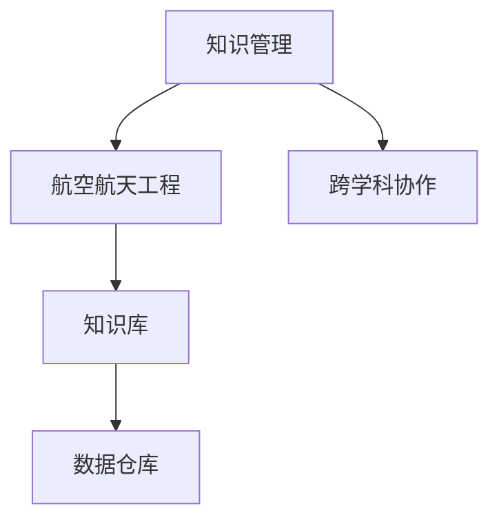

                 

# 知识管理在航空航天领域的应用

## 1. 背景介绍

### 1.1 问题由来
随着技术的进步和需求的多样化，航空航天领域变得愈发复杂。从设计、制造到维护的每一个环节，都需要跨学科的知识集成和协同工作。传统的知识管理模式已难以满足现代航空航天工程的需求，亟需一种高效的知识共享与协作机制。

### 1.2 问题核心关键点
知识管理在航空航天领域的应用，主要解决以下几个问题：
1. **跨学科知识集成**：航空航天工程涉及机械、电子、材料、航空动力学等多个学科，需要有效集成各类专业知识。
2. **工程文档管理**：众多技术文档和规范需要有效管理，以便快速检索和复用。
3. **知识共享与协作**：确保各团队间高效共享知识和经验，提升团队协作效率。
4. **设计迭代与优化**：通过知识库中的历史数据，支持快速迭代设计并不断优化。

### 1.3 问题研究意义
通过实施知识管理，航空航天领域可以有效提升工程效率和创新能力，具体体现在：
1. **降低成本**：减少重复工作和错误，避免重复设计和开发。
2. **提升质量**：基于历史知识和案例进行设计迭代，确保设计可靠性。
3. **加速创新**：通过知识共享和协同工作，推动跨学科创新。
4. **增强灵活性**：快速响应市场和技术变化，提升产品竞争力。

## 2. 核心概念与联系

### 2.1 核心概念概述

为更好地理解航空航天领域知识管理的应用，本节将介绍几个密切相关的核心概念：

- **知识管理(Knowledge Management, KM)**：通过计划、流程、技术工具等手段，管理和运用组织内外的知识，实现知识的创建、存储、检索和复用。
- **航空航天工程(Aerospace Engineering)**：涉及飞行器设计、制造、测试、运行维护等各个环节，涵盖结构力学、气动、控制等多个领域。
- **跨学科协作(Cross-disciplinary Collaboration)**：不同学科的专业知识与技能在项目中的整合与协同。
- **知识库(Knowledge Base)**：以结构化或非结构化的方式，存储组织内部各类知识的系统。
- **数据仓库(Data Warehouse)**：集中存储企业数据的平台，用于数据分析和决策支持。

这些核心概念之间的逻辑关系可以通过以下Mermaid流程图来展示：



这个流程图展示了的核心概念及其之间的关系：

1. 知识管理是航空航天工程的基础，支持跨学科协作。
2. 知识库和数据仓库是知识管理的核心工具，存储和管理各类知识。
3. 跨学科协作是知识管理的最终目的，通过协同提升工程效率。

## 3. 核心算法原理 & 具体操作步骤
### 3.1 算法原理概述

航空航天领域知识管理的核心原理是利用先进的知识管理工具和技术，将各类知识进行有效组织和管理，确保知识的创造、存储、检索和复用。主要包括以下几个步骤：

1. **知识建模与规范**：制定统一的知识模型和规范，明确知识分类、属性、关系等。
2. **知识采集与整理**：从技术文档、工程图纸、试验数据等渠道，采集和整理各类知识。
3. **知识存储与管理**：利用数据库、文档管理系统等工具，实现知识的高效存储和管理。
4. **知识检索与检索**：通过搜索引擎、数据仓库等技术，实现知识的快速检索和利用。
5. **知识共享与协作**：搭建知识共享平台，促进跨部门、跨学科的知识共享和协作。
6. **知识评估与反馈**：定期评估知识管理的成效，收集反馈，持续改进知识管理机制。

### 3.2 算法步骤详解

以下是知识管理在航空航天领域的应用的具体操作步骤：

**Step 1: 知识建模与规范**
- 制定统一的知识模型，定义知识元素的类别、属性和关系。
- 制定知识管理的规范和标准，确保知识的准确性和一致性。
- 引入领域专家的意见，优化知识模型的设计。

**Step 2: 知识采集与整理**
- 确定知识采集的渠道，包括技术文档、工程图纸、试验数据、设计文档等。
- 利用自动化工具，如OCR、NLP等，对纸质文件进行电子化处理。
- 对采集到的知识进行清洗、分类和标注，确保知识的准确性和完整性。

**Step 3: 知识存储与管理**
- 选择合适的知识存储工具，如数据库、文档管理系统等。
- 利用元数据和分类标签，实现知识的结构化存储。
- 制定知识管理的流程和规则，确保知识的规范存储和更新。

**Step 4: 知识检索与检索**
- 搭建知识检索系统，支持关键词检索、分类检索、语义检索等多种方式。
- 利用搜索引擎、数据仓库等技术，提高知识检索的效率和准确性。
- 定期维护和更新知识库，确保知识的时效性和全面性。

**Step 5: 知识共享与协作**
- 搭建知识共享平台，支持在线文档的上传和下载。
- 引入协作工具，如Wiki、Confluence等，促进跨部门、跨学科的协作。
- 制定知识共享的策略和规范，确保知识的安全和隐私。

**Step 6: 知识评估与反馈**
- 定期评估知识管理的成效，通过数据分析和反馈机制，持续改进知识管理机制。
- 收集知识使用者的反馈，优化知识检索和共享的功能和体验。
- 引入指标和评估模型，量化知识管理的成果。

### 3.3 算法优缺点

航空航天领域知识管理的主要优点包括：
1. **提升工程效率**：通过知识共享和协同工作，减少重复工作和错误，提升设计效率。
2. **增强创新能力**：通过知识库中的历史数据和案例，支持快速迭代设计并不断优化。
3. **降低成本**：减少重复设计和开发，降低项目成本。
4. **提升质量**：基于历史知识和案例进行设计迭代，确保设计可靠性。

但该方法也存在一定的局限性：
1. **技术复杂**：知识管理的实施需要较高技术水平和专业知识。
2. **成本高**：实施知识管理的初始成本较高，包括软件采购、硬件设备和培训成本。
3. **数据量大**：航空航天工程涉及的数据量庞大，存储和管理难度较大。
4. **更新频繁**：工程项目迭代迅速，知识库需要频繁更新，维护成本较高。

尽管存在这些局限性，但知识管理仍是航空航天工程不可或缺的一部分，通过合理的实施和优化，可以显著提升工程效率和质量。

### 3.4 算法应用领域

知识管理在航空航天领域主要应用于以下几个方面：

- **设计与制造**：支持快速迭代设计，减少设计返工，提升设计效率和质量。
- **维护与维修**：提供维修手册和故障处理指南，支持快速维修和故障诊断。
- **项目管理**：提供项目进度和资源管理支持，提升项目管理效率。
- **测试与验证**：提供测试数据和案例库，支持新产品的快速验证和测试。
- **训练与教育**：提供培训文档和案例，支持工程师的技能提升和知识更新。

## 4. 数学模型和公式 & 详细讲解 & 举例说明
### 4.1 数学模型构建

在航空航天领域，知识管理涉及的知识模型主要包括以下几个方面：

- **元数据模型(Metadata Model)**：用于描述知识元素的属性和关系，如文档类别、作者、版本号、发布日期等。
- **本体论模型(Ontology Model)**：定义知识元素的概念和关系，如部件、测试项目、故障类型等。
- **数据仓库模型(Data Warehouse Model)**：用于存储和管理结构化数据，支持数据分析和报告。

### 4.2 公式推导过程

**元数据模型**：
$$
\text{Metadata} = \{ ID, Title, Author, Version, Date \}
$$

其中：
- $ID$：唯一标识符
- $Title$：文档标题
- $Author$：作者
- $Version$：版本号
- $Date$：发布日期

**本体论模型**：
$$
\text{Ontology} = \{ \text{Entity}, \text{Relationship}, \text{Attribute} \}
$$

其中：
- $\text{Entity}$：实体，如部件、故障
- $\text{Relationship}$：关系，如“属于”、“继承”等
- $\text{Attribute}$：属性，如“型号”、“重量”等

**数据仓库模型**：
$$
\text{Data Warehouse} = \{ Table, Column, Key \}
$$

其中：
- $\text{Table}$：数据表，用于存储结构化数据
- $\text{Column}$：数据列，用于描述数据项
- $\text{Key}$：主键，用于唯一标识数据记录

### 4.3 案例分析与讲解

假设一个航空航天公司的知识库中包含如下数据：

- **元数据**：
  - 文档ID：0001
  - 标题：发动机设计手册
  - 作者：李工程师
  - 版本号：V1.0
  - 发布日期：2023-04-01

- **本体论**：
  - 实体：发动机
  - 关系：属于(归属于部件)
  - 属性：型号(LE-2)，重量(200kg)

- **数据仓库**：
  - 表：发动机性能数据
  - 列：型号，重量，温度，推力
  - 主键：ID

通过这些数据，可以构建出一个完整的知识模型，支持知识的创建、存储、检索和复用。例如，当一个新工程师加入公司，可以通过知识检索系统快速找到相关的设计手册，了解发动机的设计规范和性能参数。

## 5. 项目实践：代码实例和详细解释说明
### 5.1 开发环境搭建

在进行知识管理项目开发前，需要准备好开发环境。以下是使用Python进行知识管理开发的Python环境配置流程：

1. 安装Python：从官网下载并安装Python，支持3.6及以上版本。
2. 安装必要的Python库：
  - `pymongo`：MongoDB的Python客户端库，用于存储和管理元数据。
  - `pandas`：数据处理和分析库，用于处理结构化数据。
  - `nltk`：自然语言处理库，用于处理非结构化文本数据。

完成上述步骤后，即可在Python环境中进行知识管理系统的开发。

### 5.2 源代码详细实现

下面是一个基于MongoDB和Flask的知识管理系统的Python代码实现：

```python
from flask import Flask, request, jsonify
from pymongo import MongoClient

app = Flask(__name__)

# 连接MongoDB数据库
client = MongoClient('mongodb://localhost:27017')
db = client['aerospace_km']

# 定义API接口
@app.route('/knowledge', methods=['GET'])
def get_knowledge():
    # 获取查询参数
    query = request.args.get('query')
    
    # 查询知识库
    collection = db['knowledge']
    results = collection.find({'$or': [{'title': {'$regex': query}}, {'content': {'$regex': query}}]})
    
    # 返回查询结果
    return jsonify([{'id': result['_id'], 'title': result['title'], 'content': result['content']} for result in results])

if __name__ == '__main__':
    app.run(debug=True)
```

这个代码实现了一个简单的知识管理API，支持通过查询参数获取匹配的知识库记录。在实际开发中，还需要添加更多的API接口，如文档上传、文档修改、元数据管理等功能。

### 5.3 代码解读与分析

让我们再详细解读一下关键代码的实现细节：

**Flask应用**：
- `Flask`：Python的Web框架，用于搭建API接口。
- `request`：获取HTTP请求参数。
- `jsonify`：将Python数据结构转换为JSON格式。

**MongoDB连接**：
- `pymongo`：MongoDB的Python客户端库，用于连接和操作MongoDB数据库。
- `MongoClient`：连接MongoDB数据库实例。
- `db`：获取数据库实例。

**API接口**：
- `/knowledge`：获取知识库记录的API接口。
- `request.args.get('query')`：获取查询参数。
- `{'$or': [{'title': {'$regex': query}}, {'content': {'$regex': query}}]}`：构建MongoDB查询条件，支持正则表达式查询。
- `results`：查询结果。
- `jsonify([{'id': result['_id'], 'title': result['title'], 'content': result['content']} for result in results]`：将查询结果转换为JSON格式。

可以看到，Python和MongoDB的结合，使得知识管理的开发变得简单高效。开发者可以根据实际需求，通过添加更多的API接口和业务逻辑，进一步丰富知识管理系统的功能。

### 5.4 运行结果展示

运行上述代码后，可以通过访问`http://localhost:5000/knowledge?query=发动机`来获取所有包含“发动机”关键词的知识库记录。结果将以JSON格式返回，便于后续的处理和分析。

## 6. 实际应用场景

### 6.1 设计与制造

在设计与制造阶段，知识管理主要应用于以下几个方面：

- **设计文档管理**：管理各种设计文档和图纸，支持快速查找和下载。
- **设计迭代**：利用历史设计数据，支持快速迭代新设计方案。
- **设计验证**：通过案例库支持新设计的验证和测试。

### 6.2 维护与维修

在维护与维修阶段，知识管理主要应用于以下几个方面：

- **维修手册管理**：管理各种维修手册和操作指南，支持快速查找和阅读。
- **故障诊断**：利用历史故障数据，支持快速诊断和处理故障。
- **维护计划**：制定和跟踪维护计划，确保设备的定期检查和维护。

### 6.3 项目管理

在项目管理阶段，知识管理主要应用于以下几个方面：

- **项目进度管理**：记录和管理项目进度，支持团队协作和监控。
- **资源管理**：管理各种项目资源，如人员、设备、物料等。
- **风险管理**：记录和管理项目风险，支持风险评估和应对。

### 6.4 测试与验证

在测试与验证阶段，知识管理主要应用于以下几个方面：

- **测试数据管理**：管理各种测试数据和测试报告，支持快速查找和分析。
- **测试案例库**：构建测试案例库，支持新产品的快速测试和验证。
- **测试流程管理**：记录和管理测试流程，确保测试过程的规范和可控。

### 6.5 训练与教育

在训练与教育阶段，知识管理主要应用于以下几个方面：

- **培训文档管理**：管理各种培训文档和案例，支持快速查找和阅读。
- **技能培训**：利用培训文档和案例库，支持工程师的技能提升和知识更新。
- **知识共享**：搭建知识共享平台，促进跨部门、跨学科的知识共享和协作。

## 7. 工具和资源推荐
### 7.1 学习资源推荐

为了帮助开发者系统掌握知识管理理论基础和实践技巧，这里推荐一些优质的学习资源：

1. **《知识管理：创建共享的组织智慧》（Knowledge Management: Creating the Sharing Organization）**：这本书系统介绍了知识管理的理论、实践和案例，是知识管理领域的经典著作。

2. **《知识管理基础》（Knowledge Management for Dummies）**：一本轻松易懂的入门级知识管理书籍，适合初学者快速入门。

3. **Coursera上的“知识管理与组织学习”课程**：斯坦福大学开设的在线课程，深入讲解了知识管理的理论、技术和实践。

4. **Knowledge Management Institute（KMI）**：提供知识管理的培训、认证和咨询服务，是知识管理领域的权威机构。

5. **Knowledge Management：For a Deeper, Smarter Organization**：一本介绍知识管理最佳实践的书籍，涵盖多个行业和企业的成功案例。

通过对这些资源的学习实践，相信你一定能够快速掌握知识管理的精髓，并用于解决实际的航空航天工程问题。

### 7.2 开发工具推荐

高效的开发离不开优秀的工具支持。以下是几款用于知识管理开发的常用工具：

1. **MongoDB**：高性能的NoSQL数据库，用于存储和管理元数据和结构化数据。
2. **Flask**：Python的Web框架，用于搭建知识管理系统的API接口。
3. **Jupyter Notebook**：交互式的Python编程环境，用于数据分析和模型验证。
4. **PyPDF2**：Python的PDF库，用于处理和操作PDF文件。
5. **Scikit-learn**：Python的数据分析和机器学习库，用于数据处理和分析。

合理利用这些工具，可以显著提升知识管理系统的开发效率，加快创新迭代的步伐。

### 7.3 相关论文推荐

知识管理在航空航天领域的发展源于学界的持续研究。以下是几篇奠基性的相关论文，推荐阅读：

1. **《知识管理在航空航天工程中的应用》（Knowledge Management in Aerospace Engineering）**：介绍知识管理在航空航天工程中的具体应用案例和效果。

2. **《基于本体的航空航天知识管理》（Ontology-based Knowledge Management in Aerospace Engineering）**：探讨利用本体论技术实现知识管理的建模和推理。

3. **《知识共享与协作：航空航天领域的应用》（Knowledge Sharing and Collaboration in Aerospace Engineering）**：研究知识共享与协作在航空航天领域的具体实现和挑战。

4. **《知识管理的成功因素》（Factors of Success in Knowledge Management）**：分析知识管理成功的关键因素，提供实用的指导和建议。

5. **《航空航天领域的数据仓库和知识库设计》（Data Warehouse and Knowledge Base Design in Aerospace Engineering）**：介绍航空航天领域数据仓库和知识库的设计和实现。

这些论文代表了大知识管理在航空航天领域的研究进展，通过学习这些前沿成果，可以帮助研究者把握学科前进方向，激发更多的创新灵感。

## 8. 总结：未来发展趋势与挑战
### 8.1 总结

本文对知识管理在航空航天领域的应用进行了全面系统的介绍。首先阐述了知识管理的重要性，明确了知识管理在提升工程效率和创新能力方面的独特价值。其次，从原理到实践，详细讲解了知识管理的数学模型和具体操作步骤，给出了知识管理系统的完整代码实现。同时，本文还广泛探讨了知识管理在设计与制造、维护与维修、项目管理、测试与验证、训练与教育等多个航空航天工程领域的应用前景，展示了知识管理范式的巨大潜力。此外，本文精选了知识管理的各类学习资源，力求为读者提供全方位的技术指引。

通过本文的系统梳理，可以看到，知识管理在航空航天工程中发挥了至关重要的作用，有效提升了工程效率和质量，降低了成本，增强了创新能力。未来，伴随知识管理技术的不断演进，航空航天工程的知识管理将更加智能、高效，为工程项目的成功实施提供坚实的技术保障。

### 8.2 未来发展趋势

展望未来，知识管理在航空航天领域将呈现以下几个发展趋势：

1. **智能化知识管理**：利用人工智能技术，实现知识的自动化处理和分析，提高知识管理的效率和精度。
2. **自适应知识管理**：根据项目的实际需求，自动调整知识管理策略，提升知识管理的灵活性和适应性。
3. **跨领域知识管理**：支持跨领域、跨学科的知识共享与协作，促进知识的广泛传播和应用。
4. **虚拟现实与增强现实**：利用VR/AR技术，实现知识管理系统的可视化，增强用户的沉浸式体验。
5. **自动化与智能推荐**：通过自动化技术和推荐算法，支持知识自动推荐和智能检索，提升知识获取的便利性和准确性。

以上趋势凸显了知识管理技术的广阔前景，这些方向的探索发展，必将进一步提升知识管理的效率和质量，为航空航天工程的成功实施提供更坚实的技术保障。

### 8.3 面临的挑战

尽管知识管理在航空航天工程中已经取得了显著成果，但在迈向更加智能化、普适化应用的过程中，它仍面临诸多挑战：

1. **技术复杂性**：知识管理的实施需要较高技术水平和专业知识，对开发者的技术要求较高。
2. **数据量大**：航空航天工程涉及的数据量庞大，存储和管理难度较大。
3. **更新频繁**：工程项目迭代迅速，知识库需要频繁更新，维护成本较高。
4. **跨领域协作**：不同学科之间的协作复杂，需要有效的沟通和协调机制。
5. **知识标准化**：不同部门和团队之间的知识标准不一致，需要统一的规范和标准。

尽管存在这些挑战，但知识管理仍是航空航天工程不可或缺的一部分，通过合理的实施和优化，可以显著提升工程效率和质量。

### 8.4 研究展望

面对知识管理面临的这些挑战，未来的研究需要在以下几个方面寻求新的突破：

1. **智能化知识管理技术**：引入人工智能、自然语言处理等技术，提升知识管理的自动化和智能化水平。
2. **知识标准化与规范**：制定统一的知识管理规范和标准，确保知识的准确性和一致性。
3. **跨领域协作机制**：建立跨部门、跨学科的协作机制，促进知识的共享与传播。
4. **知识库的优化与更新**：引入自动化和智能化技术，提高知识库的更新效率和准确性。
5. **知识管理平台的升级**：引入Web服务、API接口等技术，提升知识管理系统的灵活性和可扩展性。

这些研究方向的探索，必将引领知识管理技术迈向更高的台阶，为航空航天工程的成功实施提供更坚实的技术保障。相信通过学界和产业界的共同努力，知识管理技术将在航空航天领域发挥更大的作用，为工程项目的成功实施提供更坚实的技术保障。

## 9. 附录：常见问题与解答

**Q1：知识管理在航空航天工程中如何降低成本？**

A: 知识管理通过共享和复用知识，减少了重复工作和错误，避免了重复设计和开发。具体而言：

1. **减少设计返工**：通过知识共享，工程师可以快速获取相关设计文档和案例，减少设计返工。
2. **提升设计质量**：利用历史案例和数据，支持设计迭代和优化，确保设计的可靠性和可复用性。
3. **降低培训成本**：通过知识共享平台，工程师可以快速获取培训文档和案例，提升技能水平，减少培训成本。

**Q2：知识管理在航空航天工程中如何提升质量？**

A: 知识管理通过标准化和复用知识，提升工程项目的质量。具体而言：

1. **标准化流程和规范**：通过知识管理的标准化流程和规范，确保工程项目的规范性和可控性。
2. **历史数据和案例**：利用历史数据和案例库，支持新项目的快速验证和测试，确保设计的可靠性。
3. **跨学科协作**：通过知识共享和协作平台，促进跨学科的协作，提升项目的整体质量。

**Q3：知识管理在航空航天工程中如何提升创新能力？**

A: 知识管理通过共享和复用知识，支持创新思维和跨学科协作。具体而言：

1. **跨学科协作**：通过知识共享平台，促进不同学科的专业知识交流和协作，提升创新能力。
2. **案例库和历史数据**：利用案例库和历史数据，支持设计迭代和优化，促进技术创新。
3. **知识共享和传播**：通过知识共享机制，将成功经验和最佳实践分享给团队，提升整体的创新能力。

**Q4：知识管理在航空航天工程中如何提升项目管理效率？**

A: 知识管理通过标准化和自动化管理，提升项目管理的效率。具体而言：

1. **项目进度管理**：利用知识管理工具，记录和管理项目进度，支持团队协作和监控。
2. **资源管理**：通过知识管理的资源管理工具，优化资源配置，提升项目效率。
3. **风险管理**：利用知识管理的风险管理工具，记录和管理项目风险，支持风险评估和应对。

**Q5：知识管理在航空航天工程中如何支持设计迭代和优化？**

A: 知识管理通过历史数据和案例库，支持设计迭代和优化。具体而言：

1. **历史案例库**：构建历史案例库，支持新设计方案的快速迭代和优化。
2. **设计文档管理**：利用知识管理工具，管理各种设计文档和图纸，支持快速查找和下载。
3. **设计验证**：通过案例库支持新设计的验证和测试，确保设计的可靠性。

---

作者：禅与计算机程序设计艺术 / Zen and the Art of Computer Programming

