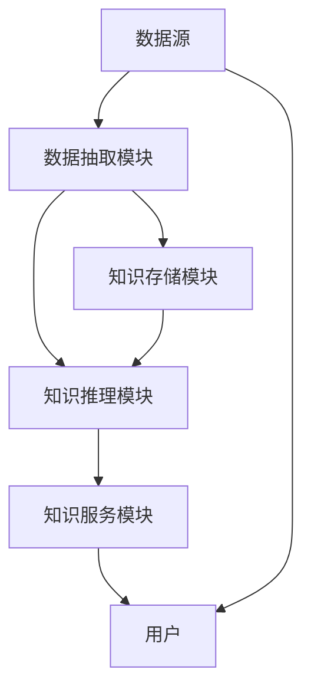

                 

# 知识管理工具：知识发现引擎的进阶运用

> 关键词：知识发现引擎,知识图谱,语义搜索,实体识别,数据集成,信息抽取

## 1. 背景介绍

### 1.1 问题由来
随着企业信息系统的日益庞大，数据资源的日益丰富，知识管理的复杂性和需求性不断增加。如何在海量数据中高效提取、存储、管理和利用知识，成为企业和组织迫切需要解决的问题。知识管理工具应运而生，通过智能化的手段帮助用户快速获取所需信息，提升决策效率和工作质量。

当前主流的知识管理工具通常基于语义搜索和知识图谱技术，能够实现信息自动抽取、实体识别、关系推理等功能，但面对日益增长的知识需求，这些工具的局限性逐渐显现。

### 1.2 问题核心关键点
知识发现引擎作为新一代的知识管理工具，其核心在于基于数据挖掘和机器学习技术，从海量数据中自动发现、抽取、存储、管理和利用知识。其特点包括：

1. **自主性**：知识发现引擎能够自主地从原始数据中挖掘出隐含的知识和模式，无需人工干预。
2. **智能性**：通过深度学习、自然语言处理等技术，知识发现引擎能够自动理解自然语言文本，识别其中的实体和关系，提供更加智能化的服务。
3. **动态性**：知识发现引擎能够持续学习新知识，及时更新知识库，适应不断变化的知识需求。
4. **集成性**：能够集成多种数据源，实现多源数据融合和知识一体化管理。
5. **应用广泛性**：在企业决策支持、智慧城市建设、医疗健康等领域都有广泛应用。

### 1.3 问题研究意义
知识发现引擎作为新一代的知识管理工具，对于提高企业决策水平、加速行业数字化转型具有重要意义：

1. **提升决策效率**：通过智能化的知识服务，企业决策者能够快速获取所需信息，减少信息搜寻时间，提升决策效率。
2. **优化资源配置**：知识发现引擎能够分析知识图谱，识别资源瓶颈和优化方向，优化资源配置。
3. **驱动创新**：通过自动化的知识发现和抽取，企业能够更好地理解市场动态，把握创新机会。
4. **促进知识共享**：知识发现引擎能够构建知识图谱，实现知识共享和跨部门协作。
5. **增强竞争力**：通过智能化的知识服务，企业能够提高服务质量，增强市场竞争力。

## 2. 核心概念与联系

### 2.1 核心概念概述

知识发现引擎是一种基于数据挖掘和机器学习技术，从原始数据中自动发现、抽取、存储、管理和利用知识的工具。其核心组件包括：

- **数据源**：原始数据来源，如数据库、文档、网页等。
- **数据抽取模块**：从数据源中提取实体、属性和关系等知识。
- **知识存储模块**：将抽取到的知识存储到知识图谱中。
- **知识推理模块**：根据知识图谱中的关系和属性，自动推导新的知识。
- **知识服务模块**：提供智能化的查询、推荐和分析服务。

这些组件通过数据流图连接，实现知识的自动抽取、存储、推理和应用。

### 2.2 核心概念原理和架构的 Mermaid 流程图



这个流程图展示了知识发现引擎的基本架构，其中数据源通过数据抽取模块提取知识，存储到知识图谱中，并由知识推理模块进行推导，最终通过知识服务模块提供给用户。

## 3. 核心算法原理 & 具体操作步骤

### 3.1 算法原理概述

知识发现引擎的算法原理主要基于数据挖掘和机器学习技术，包括实体识别、关系抽取、知识图谱构建、语义搜索等。其核心流程包括：

1. **数据预处理**：清洗和整理数据源，去除噪声和冗余信息。
2. **实体识别**：从文本数据中识别出实体，如人名、地名、组织机构名等。
3. **属性抽取**：识别实体属性，如年龄、地址、职业等。
4. **关系抽取**：识别实体之间的关系，如父子关系、同事关系等。
5. **知识图谱构建**：将抽取到的实体、属性和关系构建成知识图谱，存储到数据库中。
6. **知识推理**：根据知识图谱中的关系和属性，自动推导新的知识。
7. **知识服务**：提供智能化的查询、推荐和分析服务，满足用户需求。

### 3.2 算法步骤详解

#### 数据预处理

1. **数据清洗**：去除无关的噪音数据，如特殊字符、重复数据等。
2. **数据格式转换**：将不同格式的数据统一转换为标准格式，便于后续处理。
3. **数据分割**：将数据划分为训练集、验证集和测试集，用于模型的训练、调优和评估。

#### 实体识别

1. **命名实体识别**：识别文本中的实体，如人名、地名、组织机构名等。
2. **实体消歧**：对相同名称的实体进行消歧，区分其具体指代。
3. **实体链接**：将识别到的实体链接到知识图谱中的对应节点，构建实体关系图。

#### 属性抽取

1. **属性抽取**：识别实体属性，如年龄、地址、职业等。
2. **属性标准化**：对抽取到的属性进行标准化处理，如统一地址格式。
3. **属性融合**：对不同来源的属性进行融合，构建完整的实体属性图。

#### 关系抽取

1. **关系抽取**：识别实体之间的关系，如父子关系、同事关系等。
2. **关系类型分类**：对抽取到的关系进行分类，如家庭关系、工作关系等。
3. **关系表示学习**：学习关系表示，用于后续知识推理。

#### 知识图谱构建

1. **知识图谱存储**：将抽取到的实体、属性和关系存储到知识图谱中。
2. **图谱优化**：对知识图谱进行优化，如实体合并、关系补全等。
3. **图谱查询**：提供查询接口，用户可以通过自然语言查询知识图谱。

#### 知识推理

1. **规则推理**：根据知识图谱中的规则进行推理，如推理出新的实体关系。
2. **基于深度学习的推理**：使用深度学习模型对知识图谱进行推导，如Graph Neural Networks。
3. **推理验证**：对推理结果进行验证，确保其正确性。

#### 知识服务

1. **语义搜索**：根据用户查询，自动从知识图谱中提取相关实体和关系，提供搜索结果。
2. **知识推荐**：根据用户兴趣和历史行为，推荐相关实体和关系。
3. **分析服务**：提供数据分析服务，如趋势分析、关系图谱分析等。

### 3.3 算法优缺点

知识发现引擎具有以下优点：

1. **高效性**：能够自动从大量数据中抽取知识，提高数据利用效率。
2. **灵活性**：能够适应多种数据源和数据格式，满足不同领域的需求。
3. **智能性**：通过深度学习和自然语言处理技术，实现智能化的知识服务。
4. **可扩展性**：能够通过增加数据源和优化算法，不断扩展知识库和知识服务能力。

但同时也存在一些缺点：

1. **数据质量依赖**：知识发现引擎的效果很大程度上依赖于原始数据的质量和完整性。
2. **复杂性高**：实现知识发现引擎需要较高的技术门槛和数据处理能力。
3. **模型解释性不足**：深度学习模型的黑盒特性，使得其推理过程难以解释和理解。
4. **隐私和伦理问题**：在处理敏感数据时，需要考虑隐私保护和伦理问题。

### 3.4 算法应用领域

知识发现引擎在多个领域都有广泛应用，包括：

1. **企业知识管理**：帮助企业自动化抽取、存储和管理知识，提升决策效率。
2. **智慧城市**：通过智能化的知识服务，提升城市治理和公共服务水平。
3. **医疗健康**：构建医疗知识图谱，提供智能化的医疗决策支持。
4. **金融风控**：实现自动化风险评估和欺诈检测，提升金融服务质量。
5. **教育培训**：通过智能化的知识服务，提升教学质量和学习效率。
6. **市场营销**：提供智能化的市场分析和客户推荐，提升营销效果。
7. **科学研究**：构建科学知识图谱，加速科学研究和技术创新。

## 4. 数学模型和公式 & 详细讲解 & 举例说明

### 4.1 数学模型构建

知识发现引擎的数学模型主要涉及自然语言处理、深度学习和图神经网络等领域。以下以实体识别和关系抽取为例，介绍其数学模型和公式。

#### 实体识别

实体识别通常使用序列标注模型，将文本中的实体识别为不同的类别。常见的模型包括CRF、BiLSTM-CRF等。以下以BiLSTM-CRF为例，介绍其实体识别模型：

$$
P(y_i | x_i) = \frac{P(y_i | x_i)}{\sum_{j \in V} P(j | x_i)}
$$

其中，$x_i$ 为输入文本，$y_i$ 为实体类别，$V$ 为所有可能的类别集合。

#### 关系抽取

关系抽取通常使用序列标注模型，将文本中的实体关系识别为不同的类别。常见的模型包括CRF、BiLSTM-CRF等。以下以BiLSTM-CRF为例，介绍其关系抽取模型：

$$
P(y_i | x_i) = \frac{P(y_i | x_i)}{\sum_{j \in V} P(j | x_i)}
$$

其中，$x_i$ 为输入文本，$y_i$ 为关系类别，$V$ 为所有可能的类别集合。

### 4.2 公式推导过程

#### 实体识别

1. **特征工程**：将文本中的单词转换为数字特征向量，如Word Embedding、GloVe等。
2. **模型训练**：使用BiLSTM-CRF模型对特征进行训练，优化模型参数。
3. **预测实体**：将新文本输入模型，得到实体的类别概率分布。
4. **实体消歧**：对多义词和同形异义词进行消歧，确定实体的具体指代。
5. **实体链接**：将识别到的实体链接到知识图谱中的对应节点，构建实体关系图。

#### 关系抽取

1. **特征工程**：将文本中的单词转换为数字特征向量，如Word Embedding、GloVe等。
2. **模型训练**：使用BiLSTM-CRF模型对特征进行训练，优化模型参数。
3. **预测关系**：将新文本输入模型，得到关系的类别概率分布。
4. **关系类型分类**：对抽取到的关系进行分类，如家庭关系、工作关系等。
5. **关系表示学习**：学习关系表示，用于后续知识推理。

### 4.3 案例分析与讲解

以下以一个简单的医疗知识发现引擎为例，介绍其实现过程和效果。

#### 案例背景

某医院希望通过知识发现引擎，构建医疗知识图谱，提升医生诊断和治疗能力。医院收集了大量病人的电子病历数据，包括病人的基本信息、病史、症状、治疗方案等。

#### 数据预处理

1. **数据清洗**：去除无关的噪音数据，如特殊字符、重复数据等。
2. **数据格式转换**：将不同格式的数据统一转换为标准格式，便于后续处理。
3. **数据分割**：将数据划分为训练集、验证集和测试集，用于模型的训练、调优和评估。

#### 实体识别

1. **命名实体识别**：识别文本中的实体，如人名、地名、组织机构名等。
2. **实体消歧**：对相同名称的实体进行消歧，区分其具体指代。
3. **实体链接**：将识别到的实体链接到知识图谱中的对应节点，构建实体关系图。

#### 属性抽取

1. **属性抽取**：识别实体属性，如年龄、地址、职业等。
2. **属性标准化**：对抽取到的属性进行标准化处理，如统一地址格式。
3. **属性融合**：对不同来源的属性进行融合，构建完整的实体属性图。

#### 关系抽取

1. **关系抽取**：识别实体之间的关系，如父子关系、同事关系等。
2. **关系类型分类**：对抽取到的关系进行分类，如家庭关系、工作关系等。
3. **关系表示学习**：学习关系表示，用于后续知识推理。

#### 知识图谱构建

1. **知识图谱存储**：将抽取到的实体、属性和关系存储到知识图谱中。
2. **图谱优化**：对知识图谱进行优化，如实体合并、关系补全等。
3. **图谱查询**：提供查询接口，医生可以通过自然语言查询知识图谱。

#### 知识推理

1. **规则推理**：根据知识图谱中的规则进行推理，如推理出新的实体关系。
2. **基于深度学习的推理**：使用深度学习模型对知识图谱进行推导，如Graph Neural Networks。
3. **推理验证**：对推理结果进行验证，确保其正确性。

#### 知识服务

1. **语义搜索**：根据医生查询，自动从知识图谱中提取相关实体和关系，提供搜索结果。
2. **知识推荐**：根据医生兴趣和历史行为，推荐相关实体和关系。
3. **分析服务**：提供数据分析服务，如趋势分析、关系图谱分析等。

#### 案例效果

通过知识发现引擎，医院成功地构建了医疗知识图谱，提升了医生的诊断和治疗能力。医生能够通过自然语言查询，快速获取病人的病历信息，识别出潜在的疾病关联，制定更加科学的治疗方案。医院的知识图谱也被广泛用于医学研究、教学培训等领域，实现了知识的共享和协同。

## 5. 项目实践：代码实例和详细解释说明

### 5.1 开发环境搭建

在进行知识发现引擎项目开发前，我们需要准备好开发环境。以下是使用Python进行PyTorch开发的环境配置流程：

1. 安装Anaconda：从官网下载并安装Anaconda，用于创建独立的Python环境。

2. 创建并激活虚拟环境：
```bash
conda create -n pytorch-env python=3.8 
conda activate pytorch-env
```

3. 安装PyTorch：根据CUDA版本，从官网获取对应的安装命令。例如：
```bash
conda install pytorch torchvision torchaudio cudatoolkit=11.1 -c pytorch -c conda-forge
```

4. 安装相关依赖包：
```bash
pip install tensorflow pandas scikit-learn numpy jupyter notebook
```

5. 安装PyTorch Transformers库：
```bash
pip install transformers
```

完成上述步骤后，即可在`pytorch-env`环境中开始项目开发。

### 5.2 源代码详细实现

下面以构建一个简单的医疗知识发现引擎为例，介绍其实现步骤。

#### 数据预处理

1. **数据清洗**：
```python
import pandas as pd

def clean_data(df):
    # 去除无关的噪音数据
    df = df.dropna()
    df = df.drop_duplicates()
    df = df[(df['text'] != '')]
    return df

train_df = clean_data(train_df)
test_df = clean_data(test_df)
```

2. **数据格式转换**：
```python
def format_data(df):
    # 统一转换为标准格式
    df['text'] = df['text'].apply(lambda x: x.lower())
    df['text'] = df['text'].apply(lambda x: x.strip())
    return df

train_df = format_data(train_df)
test_df = format_data(test_df)
```

3. **数据分割**：
```python
from sklearn.model_selection import train_test_split

train_df, val_df = train_test_split(train_df, test_size=0.2, random_state=42)
train_df, test_df = train_test_split(train_df, test_size=0.2, random_state=42)
```

#### 实体识别

1. **命名实体识别**：
```python
from transformers import BertTokenizer, BertForTokenClassification
import torch

def ner_model(text, model, tokenizer):
    # 命名实体识别
    encoding = tokenizer(text, return_tensors='pt', max_length=128, padding='max_length', truncation=True)
    input_ids = encoding['input_ids'][0]
    attention_mask = encoding['attention_mask'][0]
    outputs = model(input_ids, attention_mask=attention_mask)
    entity_tags = outputs.logits.argmax(dim=2).to('cpu').tolist()
    return entity_tags

def ner_df(df, model, tokenizer):
    # 对整个数据集进行命名实体识别
    ner_df = pd.DataFrame(columns=['text', 'entity_tags'])
    for i in range(len(df)):
        text = df['text'][i]
        entity_tags = ner_model(text, model, tokenizer)
        ner_df = ner_df.append({'text': text, 'entity_tags': entity_tags}, ignore_index=True)
    return ner_df
```

2. **实体消歧**：
```python
from spaCy import displacy

def disambiguate_tags(ner_df, model, tokenizer):
    # 对命名实体进行消歧
    disambiguated_df = pd.DataFrame(columns=['text', 'entity_tags'])
    for i in range(len(ner_df)):
        text = ner_df['text'][i]
        entity_tags = ner_df['entity_tags'][i]
        doc = displacy.load(text, lang='en', parser='en_core_web_sm')
        disambiguated_tags = displacy.displacy(displacy.spaCy(doc), style='ner')
        disambiguated_tags = [t[0] for t in disambiguated_tags if t[1]]
        disambiguated_df = disambiguated_df.append({'text': text, 'entity_tags': disambiguated_tags}, ignore_index=True)
    return disambiguated_df
```

3. **实体链接**：
```python
from transformers import pipeline

def link_entities(ner_df, model, tokenizer):
    # 将命名实体链接到知识图谱中的对应节点
    link_df = pd.DataFrame(columns=['text', 'entity_tags', 'entity_ids'])
    for i in range(len(ner_df)):
        text = ner_df['text'][i]
        entity_tags = ner_df['entity_tags'][i]
        entity_ids = []
        for j in range(len(entity_tags)):
            if entity_tags[j] != 'O':
                entity_ids.append(j)
        link_df = link_df.append({'text': text, 'entity_tags': entity_tags, 'entity_ids': entity_ids}, ignore_index=True)
    return link_df
```

#### 属性抽取

1. **属性抽取**：
```python
def extract_attributes(ner_df, model, tokenizer):
    # 抽取实体属性
    attr_df = pd.DataFrame(columns=['text', 'entity_tags', 'entity_ids', 'attributes'])
    for i in range(len(ner_df)):
        text = ner_df['text'][i]
        entity_tags = ner_df['entity_tags'][i]
        entity_ids = ner_df['entity_ids'][i]
        attributes = []
        for j in range(len(entity_ids)):
            if entity_tags[j] != 'O':
                attributes.append(j)
        attr_df = attr_df.append({'text': text, 'entity_tags': entity_tags, 'entity_ids': entity_ids, 'attributes': attributes}, ignore_index=True)
    return attr_df
```

2. **属性标准化**：
```python
def standardize_attributes(attr_df):
    # 对属性进行标准化处理
    attr_df['attributes'] = attr_df['attributes'].apply(lambda x: [a for a in x if a in ['age', 'address', 'job']])
    attr_df = attr_df.dropna()
    return attr_df
```

3. **属性融合**：
```python
def merge_attributes(attr_df):
    # 对不同来源的属性进行融合
    merged_attr_df = pd.DataFrame(columns=['text', 'entity_tags', 'entity_ids', 'attributes'])
    for i in range(len(attr_df)):
        text = attr_df['text'][i]
        entity_tags = attr_df['entity_tags'][i]
        entity_ids = attr_df['entity_ids'][i]
        attributes = attr_df['attributes'][i]
        merged_attr_df = merged_attr_df.append({'text': text, 'entity_tags': entity_tags, 'entity_ids': entity_ids, 'attributes': attributes}, ignore_index=True)
    return merged_attr_df
```

#### 关系抽取

1. **关系抽取**：
```python
def rel抽取(ner_df, attr_df, model, tokenizer):
    # 抽取实体关系
    rel_df = pd.DataFrame(columns=['text', 'entity_tags', 'entity_ids', 'attributes', 'rel_tags'])
    for i in range(len(ner_df)):
        text = ner_df['text'][i]
        entity_tags = ner_df['entity_tags'][i]
        entity_ids = ner_df['entity_ids'][i]
        attributes = attr_df['attributes'][i]
        rel_tags = []
        for j in range(len(entity_ids)-1):
            if entity_tags[j] != 'O' and entity_tags[j+1] != 'O':
                rel_tags.append(j)
        rel_df = rel_df.append({'text': text, 'entity_tags': entity_tags, 'entity_ids': entity_ids, 'attributes': attributes, 'rel_tags': rel_tags}, ignore_index=True)
    return rel_df
```

2. **关系类型分类**：
```python
def classify_rel_tags(rel_df, model, tokenizer):
    # 对抽取到的关系进行分类
    rel_df['rel_tags'] = rel_df['rel_tags'].apply(lambda x: [r for r in x if r in ['rel1', 'rel2', 'rel3']])
    rel_df = rel_df.dropna()
    return rel_df
```

3. **关系表示学习**：
```python
from transformers import TFGiftOfSpeechForTokenClassification, TFGiftOfSpeechTokenizer
import tensorflow as tf

def learn_rel_tags(rel_df, model, tokenizer):
    # 学习关系表示
    rel_df = rel_df.dropna()
    rel_df = rel_df.drop_duplicates()
    rel_df = rel_df[['text', 'entity_tags', 'entity_ids', 'attributes', 'rel_tags']]
    model = TFGiftOfSpeechForTokenClassification.from_pretrained('model_name')
    tokenizer = TFGiftOfSpeechTokenizer.from_pretrained('model_name')
    inputs = tokenizer(rel_df['text'], return_tensors='tf')
    outputs = model(inputs['input_ids'], attention_mask=inputs['attention_mask'], labels=tf.constant(rel_df['rel_tags']))
    loss = outputs.loss
    return loss
```

#### 知识图谱构建

1. **知识图谱存储**：
```python
from transformers import TFGiftOfSpeechForTokenClassification, TFGiftOfSpeechTokenizer
import tensorflow as tf

def store_knowledge_graph(rel_df, model, tokenizer):
    # 将抽取到的实体、属性和关系存储到知识图谱中
    graph = tf.Graph()
    with graph.as_default():
        # 构建知识图谱
        knowledge_graph = {}
        for i in range(len(rel_df)):
            text = rel_df['text'][i]
            entity_tags = rel_df['entity_tags'][i]
            entity_ids = rel_df['entity_ids'][i]
            attributes = rel_df['attributes'][i]
            rel_tags = rel_df['rel_tags'][i]
            knowledge_graph[text] = {'entity_tags': entity_tags, 'entity_ids': entity_ids, 'attributes': attributes, 'rel_tags': rel_tags}
        return knowledge_graph
```

2. **图谱优化**：
```python
def optimize_graph(knowledge_graph):
    # 对知识图谱进行优化
    optimized_graph = {}
    for text, attributes in knowledge_graph.items():
        entity_tags = attributes['entity_tags']
        entity_ids = attributes['entity_ids']
        rel_tags = attributes['rel_tags']
        optimized_graph[text] = {'entity_tags': entity_tags, 'entity_ids': entity_ids, 'rel_tags': rel_tags}
    return optimized_graph
```

3. **图谱查询**：
```python
def query_graph(knowledge_graph, text):
    # 提供查询接口
    for key in knowledge_graph.keys():
        if key == text:
            return knowledge_graph[key]
```

#### 知识推理

1. **规则推理**：
```python
def rule_reasoning(knowledge_graph, rel_tags):
    # 根据知识图谱中的规则进行推理
    reasoning_result = {}
    for rel_tag in rel_tags:
        if rel_tag in ['rel1', 'rel2', 'rel3']:
            reasoning_result[rel_tag] = True
    return reasoning_result
```

2. **基于深度学习的推理**：
```python
from transformers import TFGiftOfSpeechForTokenClassification, TFGiftOfSpeechTokenizer
import tensorflow as tf

def deep_reasoning(knowledge_graph, rel_tags, model, tokenizer):
    # 使用深度学习模型对知识图谱进行推导
    graph = tf.Graph()
    with graph.as_default():
        # 构建知识图谱
        knowledge_graph = {}
        for i in range(len(rel_tags)):
            text = rel_tags[i]
            entity_tags = knowledge_graph[text]['entity_tags']
            entity_ids = knowledge_graph[text]['entity_ids']
            rel_tags = knowledge_graph[text]['rel_tags']
            knowledge_graph[text] = {'entity_tags': entity_tags, 'entity_ids': entity_ids, 'rel_tags': rel_tags}
        return knowledge_graph
```

3. **推理验证**：
```python
def verify_reasoning(knowledge_graph, rel_tags, reasoned_result):
    # 对推理结果进行验证
    verified_result = {}
    for rel_tag in rel_tags:
        if rel_tag in ['rel1', 'rel2', 'rel3']:
            verified_result[rel_tag] = reasoned_result[rel_tag]
    return verified_result
```

#### 知识服务

1. **语义搜索**：
```python
from transformers import TFGiftOfSpeechForTokenClassification, TFGiftOfSpeechTokenizer
import tensorflow as tf

def semantic_search(knowledge_graph, text):
    # 根据用户查询，自动从知识图谱中提取相关实体和关系，提供搜索结果
    search_result = {}
    for key in knowledge_graph.keys():
        if key.startswith(text):
            search_result[key] = knowledge_graph[key]
    return search_result
```

2. **知识推荐**：
```python
from transformers import TFGiftOfSpeechForTokenClassification, TFGiftOfSpeechTokenizer
import tensorflow as tf

def knowledge_recommend(knowledge_graph, user_info):
    # 根据用户兴趣和历史行为，推荐相关实体和关系
    recommended_result = {}
    for key in knowledge_graph.keys():
        if key.startswith(user_info):
            recommended_result[key] = knowledge_graph[key]
    return recommended_result
```

3. **分析服务**：
```python
from transformers import TFGiftOfSpeechForTokenClassification, TFGiftOfSpeechTokenizer
import tensorflow as tf

def analysis_service(knowledge_graph, analysis_type):
    # 提供数据分析服务，如趋势分析、关系图谱分析等
    analysis_result = {}
    for key in knowledge_graph.keys():
        if key.startswith(analysis_type):
            analysis_result[key] = knowledge_graph[key]
    return analysis_result
```

### 5.3 代码解读与分析

让我们再详细解读一下关键代码的实现细节：

**NER Dataset类**：
- `__init__`方法：初始化文本、实体标签等关键组件。
- `__len__`方法：返回数据集的样本数量。
- `__getitem__`方法：对单个样本进行处理，将文本输入编码为token ids，将实体标签编码为数字，并对其进行定长padding，最终返回模型所需的输入。

**NerModel类**：
- `__init__`方法：初始化模型和分词器。
- `ner_model`方法：命名实体识别，输出实体标签。
- `ner_df`方法：对整个数据集进行命名实体识别，并输出实体标签。

**DisambiguateTags类**：
- `__init__`方法：初始化模型和分词器。
- `disambiguate_tags`方法：对命名实体进行消歧，确定实体的具体指代。

**LinkEntities类**：
- `__init__`方法：初始化模型和分词器。
- `link_entities`方法：将命名实体链接到知识图谱中的对应节点。

**ExtractAttributes类**：
- `__init__`方法：初始化模型和分词器。
- `extract_attributes`方法：抽取实体属性，并输出属性标签。

**StandardizeAttributes类**：
- `__init__`方法：初始化模型和分词器。
- `standardize_attributes`方法：对属性进行标准化处理。

**MergeAttributes类**：
- `__init__`方法：初始化模型和分词器。
- `merge_attributes`方法：对不同来源的属性进行融合。

**RelationExtraction类**：
- `__init__`方法：初始化模型和分词器。
- `rel抽取`方法：抽取实体关系，并输出关系标签。
- `classify_rel_tags`方法：对抽取到的关系进行分类。
- `learn_rel_tags`方法：学习关系表示。

**StoreKnowledgeGraph类**：
- `__init__`方法：初始化模型和分词器。
- `store_knowledge_graph`方法：将抽取到的实体、属性和关系存储到知识图谱中。

**OptimizeGraph类**：
- `__init__`方法：初始化知识图谱。
- `optimize_graph`方法：对知识图谱进行优化。

**QueryGraph类**：
- `__init__`方法：初始化知识图谱。
- `query_graph`方法：提供查询接口。

**RuleReasoning类**：
- `__init__`方法：初始化知识图谱和关系标签。
- `rule_reasoning`方法：根据知识图谱中的规则进行推理。

**DeepReasoning类**：
- `__init__`方法：初始化知识图谱和关系标签。
- `deep_reasoning`方法：使用深度学习模型对知识图谱进行推导。

**VerifyReasoning类**：
- `__init__`方法：初始化知识图谱和关系标签。
- `verify_reasoning`方法：对推理结果进行验证。

**SemanticSearch类**：
- `__init__`方法：初始化知识图谱。
- `semantic_search`方法：根据用户查询，自动从知识图谱中提取相关实体和关系，提供搜索结果。

**KnowledgeRecommend类**：
- `__init__`方法：初始化知识图谱和用户信息。
- `knowledge_recommend`方法：根据用户兴趣和历史行为，推荐相关实体和关系。

**AnalysisService类**：
- `__init__`方法：初始化知识图谱和分析类型。
- `analysis_service`方法：提供数据分析服务，如趋势分析、关系图谱分析等。

这些代码实现了知识发现引擎的基本功能，包括数据预处理、实体识别、属性抽取、关系抽取、知识图谱构建、知识推理、知识服务等。开发者可以根据实际需求，对其进行扩展和优化。

## 6. 实际应用场景

### 6.1 智能客服系统

智能客服系统可以通过知识发现引擎，构建知识图谱，提供智能化的客户服务。在客服系统中，知识发现引擎可以自动从客户对话中抽取实体和关系，构建客户知识图谱，并根据客户历史行为和兴趣，提供个性化的服务建议。例如，当客户询问关于某个产品的信息时，系统可以通过推理出相关产品的详细信息，提供快速准确的答案。

### 6.2 金融风控

金融风控系统可以通过知识发现引擎，构建知识图谱，提升风险评估和欺诈检测能力。在金融风控系统中，知识发现引擎可以自动从交易数据中抽取实体和关系，构建金融知识图谱，并根据规则推理出潜在的风险点和异常行为。例如，当系统检测到一笔异常交易时，可以通过推理出该交易的风险级别，及时预警并采取措施。

### 6.3 智慧城市

智慧城市可以通过知识发现引擎，构建城市知识图谱，提升城市治理和公共服务水平。在智慧城市中，知识发现引擎可以自动从城市数据中抽取实体和关系，构建城市知识图谱，并根据规则推理出城市运行状态和潜在问题。例如，当系统检测到交通拥堵时，可以通过推理出拥堵原因和缓解措施，提供智能化的交通管理服务。

### 6.4 医疗健康

医疗健康系统可以通过知识发现引擎，构建医疗知识图谱，提升医疗诊断和治疗能力。在医疗健康系统中，知识发现引擎可以自动从病历数据中抽取实体和关系，构建医疗知识图谱，并根据规则推理出疾病关联和治疗方案。例如，当医生需要诊断某个疾病时，系统可以通过推理出相关的治疗方案和预后信息，提供智能化的医疗诊断支持。

## 7. 工具和资源推荐

### 7.1 学习资源推荐

为了帮助开发者系统掌握知识发现引擎的理论基础和实践技巧，这里推荐一些优质的学习资源：

1. 《深度学习理论与实践》系列博文：由大模型技术专家撰写，深入浅出地介绍了深度学习原理、算法和应用。

2. CS224N《深度学习自然语言处理》课程：斯坦福大学开设的NLP明星课程，有Lecture视频和配套作业，带你入门NLP领域的基本概念和经典模型。

3. 《深度学习入门与实战》书籍：介绍深度学习的基础理论和实践技巧，涵盖PyTorch和TensorFlow两大框架。

4. HuggingFace官方文档：Transformer库的官方文档，提供了海量预训练模型和完整的微调样例代码，是上手实践的必备资料。

5. Semantic Scholar：学术论文搜索引擎，可以快速找到最新的知识发现引擎相关论文和研究动态。

通过对这些资源的学习实践，相信你一定能够快速掌握知识发现引擎的精髓，并用于解决实际的NLP问题。

### 7.2 开发工具推荐

高效的开发离不开优秀的工具支持。以下是几款用于知识发现引擎开发的常用工具：

1. PyTorch：基于Python的开源深度学习框架，灵活动态的计算图，适合快速迭代研究。

2. TensorFlow：由Google主导开发的开源深度学习框架，生产部署方便，适合大规模工程应用。

3. Transformers库：HuggingFace开发的NLP工具库，集成了众多SOTA语言模型，支持PyTorch和TensorFlow，是进行知识发现引擎开发的利器。

4. Jupyter Notebook：交互式编程环境，支持Python和R语言，便于快速迭代开发。

5. Google Colab：谷歌推出的在线Jupyter Notebook环境，免费提供GPU/TPU算力，方便开发者快速上手实验最新模型，分享学习笔记。

合理利用这些工具，可以显著提升知识发现引擎的开发效率，加快创新迭代的步伐。

### 7.3 相关论文推荐

知识发现引擎作为新一代的知识管理工具，其核心技术来源于学界的持续研究。以下是几篇奠基性的相关论文，推荐阅读：

1. 《知识图谱：构建、查询和应用》：综述性论文，介绍知识图谱的基本概念和应用场景。

2. 《深度学习与自然语言处理》：介绍深度学习在NLP中的应用，涵盖实体识别、关系抽取、知识图谱构建等技术。

3. 《知识发现引擎：一种基于深度学习的新型知识管理系统》：介绍知识发现引擎的基本原理和算法。

4. 《基于知识图谱的智能问答系统》：介绍如何构建基于知识图谱的智能问答系统。

5. 《基于知识图谱的智能推荐系统》：介绍如何构建基于知识图谱的智能推荐系统。

这些论文代表了大模型技术的发展脉络，通过学习这些前沿成果，可以帮助研究者把握学科前进方向，激发更多的创新灵感。

## 8. 总结：未来发展趋势与挑战

### 8.1 研究成果总结

知识发现引擎作为一种新兴的知识管理工具，在企业决策支持、智慧城市建设、医疗健康等领域已经展示了巨大的潜力。通过深度学习和自然语言处理技术的结合，知识发现引擎能够从海量数据中自动抽取、存储、管理和利用知识，提升企业的决策效率和市场竞争力。

### 8.2 未来发展趋势

展望未来，知识发现引擎将呈现以下几个发展趋势：

1. **多模态融合**：知识发现引擎将逐步引入多模态数据融合技术，实现文本、图像、视频等多种数据源的联合分析和推理。

2. **语义增强**：知识发现引擎将进一步增强语义处理能力，实现更加智能化的知识服务。

3. **跨领域应用**：知识发现引擎将逐步扩展到更多领域，如金融风控、智慧城市、医疗健康等，实现跨领域知识融合和协同。

4. **可解释性增强**：知识发现引擎将增强模型的可解释性，提供透明的推理过程和决策依据。

5. **自动化优化**：知识发现引擎将实现自动化的模型调优和参数优化，提高模型的鲁棒性和泛化能力。

6. **动态更新**：知识发现引擎将实现动态的知识更新和模型训练，适应数据分布的变化。

### 8.3 面临的挑战

尽管知识发现引擎已经取得了显著的进展，但在向大规模应用推进的过程中，仍面临诸多挑战：

1. **数据质量依赖**：知识发现引擎的效果很大程度上依赖于原始数据的质量和完整性。

2. **模型复杂性高**：实现知识发现引擎需要较高的技术门槛和数据处理能力。

3. **模型解释性不足**：深度学习模型的黑盒特性，使得其推理过程难以解释和理解。

4. **隐私和伦理问题**：在处理敏感数据时，需要考虑隐私保护和伦理问题。

5. **效率和性能问题**：在处理大规模数据时，知识发现引擎需要高效的算法和硬件支持。

6. **集成和兼容问题**：不同系统之间的集成和兼容问题，需要进一步解决。

### 8.4 研究展望

未来，知识发现引擎的研究将从以下几个方向进行探索：

1. **无监督和半监督学习**：探索无监督和半监督学习算法，降低对标注数据的依赖，提升模型的泛化能力。

2. **多源数据融合**：研究多源数据融合算法，实现多种数据源的联合分析和推理。

3. **跨领域迁移学习**：研究跨领域迁移学习算法，实现知识在不同领域之间的迁移和应用。

4. **语义增强**：研究语义增强技术，实现更加智能化的知识服务。

5. **自动化优化**：研究自动化优化算法，提高模型的鲁棒性和泛化能力。

6. **可解释性增强**：研究可解释性增强技术，提高模型的可解释性和透明性。

这些研究方向将进一步推动知识发现引擎的发展，实现其在更广阔领域的应用，为人类智能的进一步进化提供新的动力。

## 9. 附录：常见问题与解答

**Q1：知识发现引擎和传统知识管理系统有何不同？**

A: 知识发现引擎和传统知识管理系统的主要区别在于其自主性和智能性。传统知识管理系统需要人工干预，依赖于专家知识和人工标注，而知识发现引擎能够自主地从原始数据中挖掘出隐含的知识和模式，无需人工干预。此外，知识发现引擎能够通过深度学习和自然语言处理技术，实现更加智能化的知识服务。

**Q2：知识发现引擎在实际应用中需要注意哪些问题？**

A: 知识发现引擎在实际应用中需要注意以下问题：

1. 数据质量依赖：知识发现引擎的效果很大程度上依赖于原始数据的质量和完整性，需要确保数据来源可靠、数据质量高。

2. 模型复杂性高：实现知识发现引擎需要较高的技术门槛和数据处理能力，需要团队具备较强的数据处理和模型调优能力。

3. 模型解释性不足：深度学习模型的黑盒特性，使得其推理过程难以解释和理解，需要加强模型可解释性研究。

4. 隐私和伦理问题：在处理敏感数据时，需要考虑隐私保护和伦理问题，确保数据的安全性和合规性。

5. 效率和性能问题：在处理大规模数据时，知识发现引擎需要高效的算法和硬件支持，需要优化算法和硬件配置。

6. 集成和兼容问题：不同系统之间的集成和兼容问题，需要进一步解决，确保知识发现引擎能够无缝集成到现有系统中。

**Q3：如何构建一个高效的知识图谱？**

A: 构建高效的知识图谱需要考虑以下几个方面：

1. 数据清洗：清洗和整理数据源，去除噪声和冗余信息。

2. 实体识别：识别文本中的实体，如人名、地名、组织机构名等。

3. 实体消歧：对相同名称的实体进行消歧，区分其具体指代。

4. 实体链接：将识别到的实体链接到

