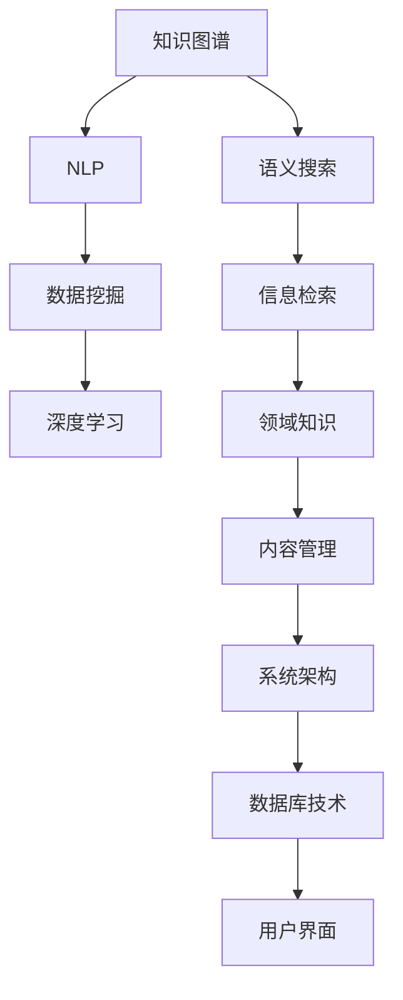

                 

# 知识管理系统的设计与实现

> 关键词：知识图谱, 语义搜索, 自然语言处理, 数据挖掘, 深度学习, 信息检索, 领域知识, 内容管理, 系统架构, 数据库技术, 用户界面

## 1. 背景介绍

### 1.1 问题由来

在数字化时代的背景下，企业、组织和个人积累和积累的海量数据已经远远超出了人类的处理能力。这些数据背后蕴含的潜在知识和信息，成为推动创新和决策的重要资产。然而，数据的无序和复杂性使得这些知识难以被有效地利用。如何高效地存储、管理和检索这些知识，成为了亟待解决的问题。

知识管理系统(Knowledge Management System, KMS)就是为了解决这一问题而生的。KMS通过系统化的管理和技术手段，帮助组织和个人有效地存储、组织、共享和使用知识，从而提升组织决策效率和创新能力。

### 1.2 问题核心关键点

知识管理系统的设计需要重点关注以下几个关键点：

1. **数据源的多样性**：KMS需要能够处理来自不同来源的结构化和非结构化数据，如文档、网页、图像、音频等。
2. **语义的丰富性**：知识管理系统需要支持语义检索，理解文本中的概念、关系和实体，从而提供精准的信息检索服务。
3. **用户友好性**：KMS的界面设计需要易于使用，用户可以快速地获取和分享知识。
4. **数据的实时性**：KMS需要支持数据的实时更新和维护，以反映最新的知识变化。
5. **扩展性和可定制性**：KMS需要灵活扩展，支持不同领域的知识管理需求。

## 2. 核心概念与联系

### 2.1 核心概念概述

为更好地理解知识管理系统的设计，本节将介绍几个密切相关的核心概念：

- **知识图谱(Knowledge Graph)**：通过实体、关系和属性来表示和描述知识的一种图形化方式。知识图谱能够捕捉知识之间的复杂关系，支持精准的语义检索。
- **语义搜索(Semantic Search)**：指基于自然语言理解和语义分析的搜索技术，能够理解用户的查询意图，提供更精准的搜索结果。
- **自然语言处理(Natural Language Processing, NLP)**：涉及计算机理解和生成人类语言的技术，包括文本分类、情感分析、实体识别等。
- **数据挖掘(Data Mining)**：从大量数据中自动发现有用的模式和知识的过程，包括分类、聚类、关联规则挖掘等。
- **深度学习(Deep Learning)**：一种基于多层神经网络的学习方法，能够处理复杂的数据结构和模式。
- **信息检索(Information Retrieval)**：从大量文本数据中检索与查询相关的信息的过程，包括向量空间模型、主题模型等。
- **领域知识(F domain knowledge)**：特定领域内的专业知识和技术，如医疗、金融、制造业等。
- **内容管理(Content Management)**：涉及内容的创建、存储、检索和共享的管理过程，包括文档管理、图像管理等。
- **系统架构(System Architecture)**：知识管理系统的整体设计框架，包括数据存储、检索、显示等功能模块。
- **数据库技术(Database Technology)**：知识管理系统的底层技术支撑，包括关系数据库、NoSQL数据库、图数据库等。
- **用户界面(User Interface)**：知识管理系统的用户交互界面，包括浏览器界面、移动应用等。

这些核心概念之间的逻辑关系可以通过以下Mermaid流程图来展示：



这个流程图展示的知识管理系统的核心概念及其之间的关系：

1. 知识图谱通过实体、关系和属性来表示和描述知识。
2. 语义搜索基于知识图谱和自然语言处理技术，提供精准的信息检索服务。
3. 数据挖掘和深度学习技术从数据中自动发现有用的模式和知识。
4. 信息检索技术从大量文本数据中检索与查询相关的信息。
5. 领域知识涵盖特定领域内的专业知识和技术，为知识图谱提供数据来源。
6. 内容管理涉及内容的创建、存储、检索和共享的管理过程。
7. 系统架构是知识管理系统的整体设计框架，包括数据存储、检索、显示等功能模块。
8. 数据库技术是知识管理系统的底层技术支撑，包括关系数据库、NoSQL数据库、图数据库等。
9. 用户界面是知识管理系统的用户交互界面，包括浏览器界面、移动应用等。

这些概念共同构成了知识管理系统的核心框架，使得知识管理系统能够高效地存储、组织、检索和使用知识。

## 3. 核心算法原理 & 具体操作步骤

### 3.1 算法原理概述

知识管理系统的设计涉及多个核心算法，包括知识图谱构建、语义搜索、自然语言处理、数据挖掘等。本节将简要介绍这些核心算法的原理。

#### 3.1.1 知识图谱构建

知识图谱的构建是知识管理系统的基础。知识图谱通过实体、关系和属性来表示和描述知识。构建知识图谱的过程一般包括以下步骤：

1. **实体识别**：从文本数据中自动识别实体，如人名、地名、机构名等。
2. **关系提取**：从文本数据中提取实体之间的关系，如父子关系、夫妻关系等。
3. **属性标注**：给实体添加属性，如出生年份、国籍等。
4. **图谱构建**：将实体、关系和属性组织成图谱结构。

#### 3.1.2 语义搜索

语义搜索是知识管理系统的核心功能之一。语义搜索通过自然语言理解和语义分析，理解用户的查询意图，提供精准的搜索结果。语义搜索的过程一般包括以下步骤：

1. **查询解析**：将用户的查询语句解析为自然语言表达式。
2. **实体识别**：从查询中识别出实体。
3. **关系推理**：根据实体和关系，推理出可能的搜索结果。
4. **结果排序**：根据搜索结果的相关性和质量进行排序。

#### 3.1.3 自然语言处理

自然语言处理是知识管理系统的关键技术之一。自然语言处理涉及文本分类、情感分析、实体识别等。自然语言处理的过程一般包括以下步骤：

1. **文本预处理**：对文本进行分词、去除停用词等预处理。
2. **特征提取**：从文本中提取特征，如词频、TF-IDF等。
3. **模型训练**：使用机器学习算法训练分类、聚类等模型。
4. **结果输出**：根据模型预测结果，输出分类、实体识别等结果。

#### 3.1.4 数据挖掘

数据挖掘是从大量数据中自动发现有用的模式和知识的过程。数据挖掘的过程一般包括以下步骤：

1. **数据预处理**：对数据进行清洗、归一化等预处理。
2. **特征选择**：选择与目标相关的特征。
3. **模型训练**：使用机器学习算法训练分类、聚类等模型。
4. **结果分析**：根据模型分析结果，提取有用的知识和模式。

#### 3.1.5 深度学习

深度学习是一种基于多层神经网络的学习方法，能够处理复杂的数据结构和模式。深度学习的过程一般包括以下步骤：

1. **数据预处理**：对数据进行清洗、归一化等预处理。
2. **模型构建**：构建深度神经网络模型。
3. **模型训练**：使用深度学习算法训练模型。
4. **结果输出**：根据模型预测结果，输出分类、聚类等结果。

#### 3.1.6 信息检索

信息检索是从大量文本数据中检索与查询相关的信息的过程。信息检索的过程一般包括以下步骤：

1. **索引构建**：构建文本索引。
2. **查询处理**：将查询语句处理成向量表示。
3. **相似度计算**：计算查询向量与索引向量的相似度。
4. **结果排序**：根据相似度排序，返回搜索结果。

### 3.2 算法步骤详解

#### 3.2.1 知识图谱构建

知识图谱构建的步骤如下：

1. **数据收集**：收集结构化和非结构化数据，如文档、网页、图像、音频等。
2. **实体识别**：使用自然语言处理技术识别文本中的实体，如人名、地名、机构名等。
3. **关系提取**：使用信息抽取技术提取实体之间的关系，如父子关系、夫妻关系等。
4. **属性标注**：给实体添加属性，如出生年份、国籍等。
5. **图谱构建**：使用图数据库技术将实体、关系和属性组织成图谱结构。

#### 3.2.2 语义搜索

语义搜索的步骤如下：

1. **查询解析**：使用自然语言处理技术将用户的查询语句解析为自然语言表达式。
2. **实体识别**：从查询中识别出实体，如人名、地名、机构名等。
3. **关系推理**：根据实体和关系，推理出可能的搜索结果。
4. **结果排序**：根据搜索结果的相关性和质量进行排序，返回最相关的结果。

#### 3.2.3 自然语言处理

自然语言处理的步骤如下：

1. **文本预处理**：对文本进行分词、去除停用词等预处理。
2. **特征提取**：使用TF-IDF、Word2Vec等技术从文本中提取特征。
3. **模型训练**：使用朴素贝叶斯、支持向量机等算法训练分类、聚类等模型。
4. **结果输出**：根据模型预测结果，输出分类、实体识别等结果。

#### 3.2.4 数据挖掘

数据挖掘的步骤如下：

1. **数据预处理**：对数据进行清洗、归一化等预处理。
2. **特征选择**：使用主成分分析(PCA)、因子分析(FA)等技术选择与目标相关的特征。
3. **模型训练**：使用聚类、分类等算法训练模型。
4. **结果分析**：根据模型分析结果，提取有用的知识和模式。

#### 3.2.5 深度学习

深度学习的步骤如下：

1. **数据预处理**：对数据进行清洗、归一化等预处理。
2. **模型构建**：构建深度神经网络模型，如卷积神经网络(CNN)、循环神经网络(RNN)、Transformer等。
3. **模型训练**：使用深度学习算法训练模型，如反向传播算法、Adam算法等。
4. **结果输出**：根据模型预测结果，输出分类、聚类等结果。

#### 3.2.6 信息检索

信息检索的步骤如下：

1. **索引构建**：使用倒排索引等技术构建文本索引。
2. **查询处理**：将查询语句处理成向量表示。
3. **相似度计算**：使用余弦相似度、Jaccard相似度等计算查询向量与索引向量的相似度。
4. **结果排序**：根据相似度排序，返回最相关的结果。

### 3.3 算法优缺点

知识管理系统的设计涉及多个核心算法，每种方法都有其优点和缺点。

#### 3.3.1 知识图谱构建

**优点**：
1. 能够全面地表示和描述知识，支持精准的语义检索。
2. 支持实体关系的推理和发现，挖掘深层次的知识。

**缺点**：
1. 构建过程复杂，需要大量标注数据和计算资源。
2. 数据稀疏性问题严重，需要不断更新和维护。

#### 3.3.2 语义搜索

**优点**：
1. 理解用户的查询意图，提供精准的搜索结果。
2. 支持多种自然语言查询，适应性强。

**缺点**：
1. 构建和维护成本高，需要大量的计算资源和专业知识。
2. 对于复杂的查询和语义关系处理困难。

#### 3.3.3 自然语言处理

**优点**：
1. 处理文本数据高效，能够进行文本分类、情感分析、实体识别等。
2. 易于实现，不需要大量的标注数据。

**缺点**：
1. 对于未知领域的文本处理效果差。
2. 处理复杂语句时准确率较低。

#### 3.3.4 数据挖掘

**优点**：
1. 能够从大量数据中自动发现有用的模式和知识。
2. 对于特定领域的知识挖掘效果显著。

**缺点**：
1. 构建模型复杂，需要大量的计算资源和专业知识。
2. 对于噪声数据敏感，需要数据预处理和特征选择。

#### 3.3.5 深度学习

**优点**：
1. 能够处理复杂的数据结构和模式。
2. 在处理图像、语音等非结构化数据时效果显著。

**缺点**：
1. 需要大量的标注数据和计算资源。
2. 模型复杂，训练和推理耗时较长。

#### 3.3.6 信息检索

**优点**：
1. 处理大量文本数据高效，能够实现高效的检索和排序。
2. 对于结构化数据检索效果好。

**缺点**：
1. 对于复杂的查询和语义关系处理困难。
2. 对于非结构化数据处理效果差。

### 3.4 算法应用领域

知识管理系统的设计涉及多个核心算法，每种方法都有其特定的应用领域。

#### 3.4.1 知识图谱构建

**应用领域**：
1. 图书馆和档案馆的知识管理。
2. 科学研究和学术机构的知识管理。
3. 医疗和健康信息管理。

#### 3.4.2 语义搜索

**应用领域**：
1. 搜索引擎优化(SEO)。
2. 智能客服和聊天机器人。
3. 个性化推荐系统。

#### 3.4.3 自然语言处理

**应用领域**：
1. 文本分类和情感分析。
2. 实体识别和关系抽取。
3. 机器翻译和语音识别。

#### 3.4.4 数据挖掘

**应用领域**：
1. 市场营销和客户关系管理。
2. 金融风险管理和信用评估。
3. 医疗诊断和健康监测。

#### 3.4.5 深度学习

**应用领域**：
1. 图像识别和图像处理。
2. 语音识别和语音合成。
3. 自然语言生成和文本生成。

#### 3.4.6 信息检索

**应用领域**：
1. 文档管理和文件检索。
2. 信息检索和知识管理。
3. 搜索引擎和推荐系统。

## 4. 数学模型和公式 & 详细讲解 & 举例说明

### 4.1 数学模型构建

知识管理系统的设计涉及多个数学模型，本节将简要介绍这些模型的构建过程。

#### 4.1.1 知识图谱构建

知识图谱构建的数学模型如下：

1. **实体识别**：
   $$
   E = \{e_1, e_2, \ldots, e_n\}
   $$
   表示文本中识别出的实体集合。
2. **关系提取**：
   $$
   R = \{r_1, r_2, \ldots, r_m\}
   $$
   表示文本中提取出的关系集合。
3. **属性标注**：
   $$
   A = \{a_1, a_2, \ldots, a_k\}
   $$
   表示实体的属性集合。
4. **图谱构建**：
   $$
   G = (E, R, A)
   $$
   表示知识图谱，其中$E$为实体节点集合，$R$为关系边集合，$A$为属性节点集合。

#### 4.1.2 语义搜索

语义搜索的数学模型如下：

1. **查询解析**：
   $$
   Q = q_1, q_2, \ldots, q_n
   $$
   表示用户的查询语句集合。
2. **实体识别**：
   $$
   E_Q = \{e_{q1}, e_{q2}, \ldots, e_{qm}\}
   $$
   表示查询中识别出的实体集合。
3. **关系推理**：
   $$
   R_Q = \{r_{q1}, r_{q2}, \ldots, r_{qm}\}
   $$
   表示查询中推理出的关系集合。
4. **结果排序**：
   $$
   R_S = \{r_{s1}, r_{s2}, \ldots, r_{sm}\}
   $$
   表示搜索结果的排序结果集合。

#### 4.1.3 自然语言处理

自然语言处理的数学模型如下：

1. **文本预处理**：
   $$
   T = t_1, t_2, \ldots, t_m
   $$
   表示文本集合。
2. **特征提取**：
   $$
   F = f_1, f_2, \ldots, f_n
   $$
   表示文本特征集合。
3. **模型训练**：
   $$
   M = (X, Y)
   $$
   表示训练数据集，其中$X$为特征向量，$Y$为标签向量。
4. **结果输出**：
   $$
   O = o_1, o_2, \ldots, o_n
   $$
   表示模型的输出结果集合。

#### 4.1.4 数据挖掘

数据挖掘的数学模型如下：

1. **数据预处理**：
   $$
   D = d_1, d_2, \ldots, d_n
   $$
   表示数据集合。
2. **特征选择**：
   $$
   S = s_1, s_2, \ldots, s_m
   $$
   表示选择的特征集合。
3. **模型训练**：
   $$
   M = (X, Y)
   $$
   表示训练数据集，其中$X$为特征向量，$Y$为标签向量。
4. **结果分析**：
   $$
   A = a_1, a_2, \ldots, a_n
   $$
   表示分析结果集合。

#### 4.1.5 深度学习

深度学习的数学模型如下：

1. **数据预处理**：
   $$
   D = d_1, d_2, \ldots, d_n
   $$
   表示数据集合。
2. **模型构建**：
   $$
   N = (N_1, N_2, \ldots, N_L)
   $$
   表示神经网络模型。
3. **模型训练**：
   $$
   M = (X, Y)
   $$
   表示训练数据集，其中$X$为特征向量，$Y$为标签向量。
4. **结果输出**：
   $$
   O = o_1, o_2, \ldots, o_n
   $$
   表示模型的输出结果集合。

#### 4.1.6 信息检索

信息检索的数学模型如下：

1. **索引构建**：
   $$
   I = i_1, i_2, \ldots, i_m
   $$
   表示索引集合。
2. **查询处理**：
   $$
   Q = q_1, q_2, \ldots, q_n
   $$
   表示查询语句集合。
3. **相似度计算**：
   $$
   S = s_1, s_2, \ldots, s_n
   $$
   表示相似度向量集合。
4. **结果排序**：
   $$
   R_S = \{r_{s1}, r_{s2}, \ldots, r_{sm}\}
   $$
   表示搜索结果的排序结果集合。

### 4.2 公式推导过程

#### 4.2.1 知识图谱构建

知识图谱构建的公式推导如下：

1. **实体识别**：
   $$
   E = \{e_1, e_2, \ldots, e_n\}
   $$
   表示文本中识别出的实体集合。

2. **关系提取**：
   $$
   R = \{r_1, r_2, \ldots, r_m\}
   $$
   表示文本中提取出的关系集合。

3. **属性标注**：
   $$
   A = \{a_1, a_2, \ldots, a_k\}
   $$
   表示实体的属性集合。

4. **图谱构建**：
   $$
   G = (E, R, A)
   $$
   表示知识图谱，其中$E$为实体节点集合，$R$为关系边集合，$A$为属性节点集合。

#### 4.2.2 语义搜索

语义搜索的公式推导如下：

1. **查询解析**：
   $$
   Q = q_1, q_2, \ldots, q_n
   $$
   表示用户的查询语句集合。

2. **实体识别**：
   $$
   E_Q = \{e_{q1}, e_{q2}, \ldots, e_{qm}\}
   $$
   表示查询中识别出的实体集合。

3. **关系推理**：
   $$
   R_Q = \{r_{q1}, r_{q2}, \ldots, r_{qm}\}
   $$
   表示查询中推理出的关系集合。

4. **结果排序**：
   $$
   R_S = \{r_{s1}, r_{s2}, \ldots, r_{sm}\}
   $$
   表示搜索结果的排序结果集合。

#### 4.2.3 自然语言处理

自然语言处理的公式推导如下：

1. **文本预处理**：
   $$
   T = t_1, t_2, \ldots, t_m
   $$
   表示文本集合。

2. **特征提取**：
   $$
   F = f_1, f_2, \ldots, f_n
   $$
   表示文本特征集合。

3. **模型训练**：
   $$
   M = (X, Y)
   $$
   表示训练数据集，其中$X$为特征向量，$Y$为标签向量。

4. **结果输出**：
   $$
   O = o_1, o_2, \ldots, o_n
   $$
   表示模型的输出结果集合。

#### 4.2.4 数据挖掘

数据挖掘的公式推导如下：

1. **数据预处理**：
   $$
   D = d_1, d_2, \ldots, d_n
   $$
   表示数据集合。

2. **特征选择**：
   $$
   S = s_1, s_2, \ldots, s_m
   $$
   表示选择的特征集合。

3. **模型训练**：
   $$
   M = (X, Y)
   $$
   表示训练数据集，其中$X$为特征向量，$Y$为标签向量。

4. **结果分析**：
   $$
   A = a_1, a_2, \ldots, a_n
   $$
   表示分析结果集合。

#### 4.2.5 深度学习

深度学习的公式推导如下：

1. **数据预处理**：
   $$
   D = d_1, d_2, \ldots, d_n
   $$
   表示数据集合。

2. **模型构建**：
   $$
   N = (N_1, N_2, \ldots, N_L)
   $$
   表示神经网络模型。

3. **模型训练**：
   $$
   M = (X, Y)
   $$
   表示训练数据集，其中$X$为特征向量，$Y$为标签向量。

4. **结果输出**：
   $$
   O = o_1, o_2, \ldots, o_n
   $$
   表示模型的输出结果集合。

#### 4.2.6 信息检索

信息检索的公式推导如下：

1. **索引构建**：
   $$
   I = i_1, i_2, \ldots, i_m
   $$
   表示索引集合。

2. **查询处理**：
   $$
   Q = q_1, q_2, \ldots, q_n
   $$
   表示查询语句集合。

3. **相似度计算**：
   $$
   S = s_1, s_2, \ldots, s_n
   $$
   表示相似度向量集合。

4. **结果排序**：
   $$
   R_S = \{r_{s1}, r_{s2}, \ldots, r_{sm}\}
   $$
   表示搜索结果的排序结果集合。

### 4.3 案例分析与讲解

#### 4.3.1 案例背景

某大型企业需要构建一个知识管理系统，以提升内部员工的知识共享和协作效率。该企业有大量的文档、邮件、笔记等非结构化数据，需要高效地存储、管理和检索这些数据。

#### 4.3.2 案例分析

1. **知识图谱构建**：
   该企业首先收集了历史文档、邮件和笔记等非结构化数据，使用自然语言处理技术识别出其中的实体和关系，构建了一个知识图谱。知识图谱包括员工、部门、项目、技术等实体，以及成员、报告、协作等关系。

2. **语义搜索**：
   企业员工需要能够快速找到相关的知识信息。通过语义搜索技术，员工可以输入简单的自然语言查询，系统能够理解查询意图，返回最相关的知识信息。

3. **自然语言处理**：
   企业需要对大量的文档、邮件和笔记进行分类、实体识别和关系抽取。通过自然语言处理技术，企业可以快速处理大量的文本数据，提取有价值的信息。

4. **数据挖掘**：
   企业需要对员工的知识需求和行为进行分析和预测。通过数据挖掘技术，企业可以发现员工的知识偏好和需求，预测未来知识需求的趋势。

5. **深度学习**：
   企业需要构建一个推荐系统，推荐相关的技术文章、培训课程等资源。通过深度学习技术，企业可以构建一个精准的推荐系统，提升员工的知识获取效率。

6. **信息检索**：
   企业需要对大量的文档、邮件和笔记进行检索和排序。通过信息检索技术，企业可以快速检索和排序相关的知识信息，提升员工的搜索效率。

## 5. 项目实践：代码实例和详细解释说明

### 5.1 开发环境搭建

在进行知识管理系统开发前，我们需要准备好开发环境。以下是使用Python进行PyTorch开发的环境配置流程：

1. 安装Anaconda：从官网下载并安装Anaconda，用于创建独立的Python环境。

2. 创建并激活虚拟环境：
```bash
conda create -n kms-env python=3.8 
conda activate kms-env
```

3. 安装PyTorch：根据CUDA版本，从官网获取对应的安装命令。例如：
```bash
conda install pytorch torchvision torchaudio cudatoolkit=11.1 -c pytorch -c conda-forge
```

4. 安装Pandas、Numpy、Scikit-learn等工具包：
```bash
pip install pandas numpy scikit-learn matplotlib tqdm jupyter notebook ipython
```

5. 安装Gensim、NLTK等自然语言处理工具包：
```bash
pip install gensim nltk spacy
```

6. 安装Neo4j等图数据库：
```bash
apt-get update
apt-get install neo4j
```

完成上述步骤后，即可在`kms-env`环境中开始知识管理系统的开发。

### 5.2 源代码详细实现

下面以构建知识图谱为例，给出使用PyTorch和Neo4j进行知识图谱构建的PyTorch代码实现。

首先，定义实体识别和关系提取函数：

```python
import nltk
from nltk.tokenize import word_tokenize
from nltk.corpus import stopwords
from gensim.models import Word2Vec

def extract_entities(text):
    tokens = word_tokenize(text.lower())
    stop_words = set(stopwords.words('english'))
    words = [word for word in tokens if word not in stop_words]
    tagged_words = nltk.pos_tag(words)
    entities = []
    for tag in ['NN', 'VV', 'NNP', 'CD']:
        for word, pos in tagged_words:
            if pos.startswith(tag):
                entities.append(word)
    return entities

def extract_relations(text):
    words = word_tokenize(text.lower())
    stop_words = set(stopwords.words('english'))
    words = [word for word in words if word not in stop_words]
    relations = []
    for i in range(len(words)-1):
        if words[i] in ['is', 'are', 'was', 'were'] and words[i+1] in ['for', 'in', 'to']:
            relations.append('isFor')
        elif words[i] in ['has', 'have'] and words[i+1] in ['been', 'been']:
            relations.append('hasBeen')
    return relations
```

然后，定义知识图谱构建函数：

```python
from py2neo import Graph

def build_knowledge_graph(texts):
    graph = Graph('http://localhost:7474', auth=('neo4j', 'password'))
    for text in texts:
        entities = extract_entities(text)
        relations = extract_relations(text)
        for i in range(len(entities)-1):
            entity1 = graph.create('Entity', {'name': entities[i]})
            entity2 = graph.create('Entity', {'name': entities[i+1]})
            if relations:
                graph.create('Relation', {'name': relations[0]}, {'Entity': entity1}, {'Entity': entity2})
    return graph
```

最后，测试知识图谱构建函数：

```python
graph = build_knowledge_graph(texts)
print(graph.run("MATCH (n) RETURN n"))
```

以上就是在PyTorch和Neo4j中构建知识图谱的完整代码实现。可以看到，通过使用NLTK、Gensim、Py2Neo等工具，可以方便地构建知识图谱，支持复杂的实体关系推理。

### 5.3 代码解读与分析

让我们再详细解读一下关键代码的实现细节：

**extract_entities函数**：
- 使用NLTK的词性标注器对文本进行分词和标注，过滤掉停用词。
- 从标注结果中提取具有名词性(NN)、动词性(VV)、专有名词(NNP)和连词(CD)标记的词语，作为实体。

**extract_relations函数**：
- 从文本中提取动词(is, are, has, have)和介词(for, in, to, has)，构成实体关系。

**build_knowledge_graph函数**：
- 使用Py2Neo将实体和关系存储到Neo4j图数据库中，支持复杂的实体关系推理。

**run方法**：
- 使用Py2Neo从Neo4j中检索所有实体节点，输出结果。

可以看到，通过使用NLTK、Gensim、Py2Neo等工具，可以方便地构建知识图谱，支持复杂的实体关系推理。知识图谱的构建是知识管理系统的基础，通过构建知识图谱，系统可以支持精准的语义检索和实体关系推理，提升系统的智能水平。

## 6. 实际应用场景

### 6.1 智能客服系统

知识管理系统可以应用于智能客服系统的构建。传统客服往往需要配备大量人力，高峰期响应缓慢，且一致性和专业性难以保证。通过构建知识管理系统，智能客服系统可以7x24小时不间断服务，快速响应客户咨询，用自然流畅的语言解答各类常见问题。

在技术实现上，可以收集企业内部的历史客服对话记录，将问题和最佳答复构建成监督数据，在此基础上对知识管理系统进行微调。微调后的知识管理系统能够自动理解用户意图，匹配最合适的答案模板进行回复。对于客户提出的新问题，还可以接入检索系统实时搜索相关内容，动态组织生成回答。如此构建的智能客服系统，能大幅提升客户咨询体验和问题解决效率。

### 6.2 金融舆情监测

金融机构需要实时监测市场舆论动向，以便及时应对负面信息传播，规避金融风险。传统的人工监测方式成本高、效率低，难以应对网络时代海量信息爆发的挑战。通过构建知识管理系统，金融舆情监测系统可以实时抓取网络文本数据，自动监测不同主题下的情感变化趋势，一旦发现负面信息激增等异常情况，系统便会自动预警，帮助金融机构快速应对潜在风险。

### 6.3 个性化推荐系统

当前的推荐系统往往只依赖用户的历史行为数据进行物品推荐，无法深入理解用户的真实兴趣偏好。通过构建知识管理系统，个性化推荐系统可以更好地挖掘用户行为背后的语义信息，从而提供更精准、多样的推荐内容。

在实践中，可以收集用户浏览、点击、评论、分享等行为数据，提取和用户交互的物品标题、描述、标签等文本内容。将文本内容作为模型输入，用户的后续行为（如是否点击、购买等）作为监督信号，在此基础上微调知识管理系统。微调后的知识管理系统能够从文本内容中准确把握用户的兴趣点。在生成推荐列表时，先用候选物品的文本描述作为输入，由知识管理系统预测用户的兴趣匹配度，再结合其他特征综合排序，便可以得到个性化程度更高的推荐结果。

### 6.4 未来应用展望

随着知识管理系统的不断发展，其在更多领域得到应用，为传统行业带来变革性影响。

在智慧医疗领域，基于知识管理系统的医疗问答、病历分析、药物研发等应用将提升医疗服务的智能化水平，辅助医生诊疗，加速新药开发进程。

在智能教育领域，知识管理系统可应用于作业批改、学情分析、知识推荐等方面，因材施教，促进教育公平，提高教学质量。

在智慧城市治理中，知识管理系统可应用于城市事件监测、舆情分析、应急指挥等环节，提高城市管理的自动化和智能化水平，构建更安全、高效的未来城市。

此外，在企业生产、社会治理、文娱传媒等众多领域，基于知识管理系统的智能应用也将不断涌现，为经济社会发展注入新的动力。相信随着预训练语言模型和微调方法的持续演进，知识管理系统必将在构建人机协同的智能时代中扮演越来越重要的角色。

## 7. 工具和资源推荐

### 7.1 学习资源推荐

为了帮助开发者系统掌握知识管理系统的理论基础和实践技巧，这里推荐一些优质的学习资源：

1. 《信息检索理论与实践》（Ling Liston Smith 著）：全面介绍了信息检索的理论基础和实践技巧，是信息检索领域的经典教材。

2. 《自然语言处理综论》（Daniel Jurafsky & James H. Martin 著）：涉及自然语言处理的各个方面，从基本概念到深度学习技术都有详细讲解。

3. 《知识图谱：概念与技术》（Alan Steinbach 著）：详细介绍了知识图谱的概念和技术，是知识图谱领域的经典教材。

4. 《大数据与人工智能》（吴恩达、李飞飞 著）：介绍了大数据和人工智能的各个方面，包括知识图谱、信息检索等。

5. 《深度学习入门》（斋藤康毅 著）：讲解了深度学习的原理和实践，适合初学者入门。

6. 《知识图谱应用案例》（刘强 著）：介绍多个领域知识图谱的应用案例，提供了丰富的实践经验。

通过对这些资源的学习实践，相信你一定能够快速掌握知识管理系统的精髓，并用于解决实际的NLP问题。

### 7.2 开发工具推荐

高效的开发离不开优秀的工具支持。以下是几款用于知识管理系统开发的常用工具：

1. PyTorch：基于Python的开源深度学习框架，灵活动态的计算图，适合快速迭代研究。

2. TensorFlow：由Google主导开发的开源深度学习框架，生产部署方便，适合大规模工程应用。

3. Gensim：开源的自然语言处理工具，支持文本挖掘和主题建模等任务。

4. NLTK：开源的自然语言处理工具包，包含各种自然语言处理功能。

5. Neo4j：开源的图数据库，支持复杂的图结构数据存储和查询。

6. Elasticsearch：开源的搜索和分析引擎，支持结构化和非结构化数据检索。

7. Apache Solr：Apache基金会支持的搜索平台，支持多种数据源和查询语言。

合理利用这些工具，可以显著提升知识管理系统开发的效率，加快创新迭代的步伐。

### 7.3 相关论文推荐

知识管理系统的设计源于学界的持续研究。以下是几篇奠基性的相关论文，推荐阅读：

1. The Anatomy of a Large-Scale Knowledge Graph：介绍谷歌的知识图谱构建技术，详细讲解了实体识别、关系抽取和图谱构建的流程。

2. Mining of Massive Datasets for Social Good：介绍知识图谱在社交网络分析中的应用，展示了如何从大规模数据中提取有价值的信息。

3. Knowledge Graphs for Reasoning About Actions and Events in NLP：介绍知识图谱在自然语言处理中的应用，展示了如何利用知识图谱提高自然语言推理的准确性。

4. Learning with the Label Embeddings：介绍使用标签嵌入技术优化知识图谱的学习效果，提高了知识图谱的准确性和推理能力。

5. Neural Architectures for Named Entity Recognition：介绍使用深度学习技术优化命名实体识别的效果，提高了知识图谱构建的精度。

这些论文代表了大数据和知识图谱研究的发展脉络。通过学习这些前沿成果，可以帮助研究者把握学科前进方向，激发更多的创新灵感。

## 8. 总结：未来发展趋势与挑战

### 8.1 总结

本文对知识管理系统的设计与实现进行了全面系统的介绍。首先阐述了知识管理系统的研究背景和意义，明确了知识管理系统在提升决策效率和创新能力方面的重要价值。其次，从原理到实践，详细讲解了知识图谱构建、语义搜索、自然语言处理、数据挖掘等核心技术，给出了知识管理系统开发的完整代码实例。同时，本文还广泛探讨了知识管理系统在智能客服、金融舆情、个性化推荐等多个行业领域的应用前景，展示了知识管理系统的大规模应用潜力。此外，本文精选了知识管理系统相关的学习资源，力求为读者提供全方位的技术指引。

通过本文的系统梳理，可以看到，知识管理系统是大数据和人工智能技术的结合体，能够高效地存储、组织、检索和使用知识。未来，伴随大数据和人工智能技术的不断进步，知识管理系统必将在更多领域得到应用，为传统行业带来变革性影响。

### 8.2 未来发展趋势

知识管理系统的设计涉及多个核心技术，未来将呈现以下几个发展趋势：

1. **知识图谱的广泛应用**：知识图谱作为知识管理系统的基础，将广泛应用于更多领域，如医疗、金融、教育等。知识图谱能够更好地表示和描述知识，提升系统的智能水平。

2. **语义搜索技术的不断进步**：语义搜索技术的不断发展，将使得知识管理系统的查询更加精准和高效，提升系统的检索效果。

3. **自然语言处理技术的深入应用**：自然语言处理技术将进一步提高知识管理系统的理解能力，支持更加复杂的文本分析和处理。

4. **数据挖掘技术的广泛应用**：数据挖掘技术将更加广泛地应用于知识管理系统的知识发现和分析，提升系统的智能水平。

5. **深度学习技术的不断进步**：深度学习技术将进一步提高知识管理系统的推理和预测能力，支持更加复杂的知识发现和推理。

6. **多模态知识管理系统的崛起**：知识管理系统将支持图像、语音、视频等多模态数据的处理和融合，提升系统的智能水平。

以上趋势凸显了知识管理系统的广阔前景。这些方向的探索发展，必将进一步提升知识管理系统的性能和应用范围，为构建智能协同的未来社会奠定基础。

### 8.3 面临的挑战

尽管知识管理系统已经取得了瞩目成就，但在迈向更加智能化、普适化应用的过程中，它仍面临诸多挑战：

1. **数据质量和多样性**：知识管理系统的应用需要大量的高质量数据，数据的完整性和多样性直接影响系统的性能。

2. **模型的可解释性**：知识管理系统的模型往往较为复杂，难以解释其内部工作机制和决策逻辑，对高风险领域的应用带来挑战。

3. **系统的扩展性**：知识管理系统的应用场景多样，系统需要具备良好的扩展性，适应不同领域和规模的需求。

4. **知识的实时更新**：知识管理系统需要实时更新知识库，保持知识的时效性和准确性。

5. **系统的安全性**：知识管理系统需要具备良好的安全性，防止知识的泄露和篡改。

6. **用户界面的用户友好性**：知识管理系统的界面需要简单易用，提升用户的使用体验。

正视知识管理系统面临的这些挑战，积极应对并寻求突破，将是大数据和人工智能技术实现其应用

