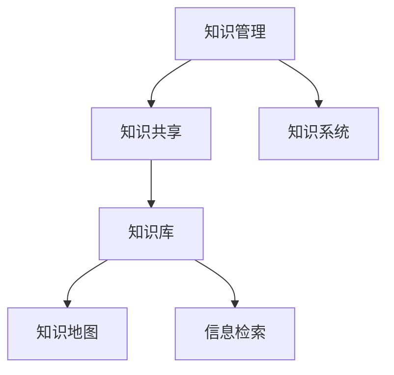

                 

# 知识管理：管理者的核心能力

> 关键词：知识管理,知识共享,知识库,知识地图,信息检索,知识系统

## 1. 背景介绍

### 1.1 问题由来

在当今信息爆炸的时代，企业面临的竞争日益激烈。如何高效利用和共享知识，迅速响应市场变化，成为企业成功的关键。知识管理（Knowledge Management, Km）的核心，在于通过系统化的方法和工具，帮助企业员工发现、创造、分享和利用知识。

但现实情况是，许多企业虽然建立了知识管理系统，却因为种种原因未能有效实施。具体来说，主要有以下问题：

- **知识分散**：知识通常分散在不同员工的头脑中，难以形成系统化的组织。
- **知识孤岛**：各部门之间信息不通，导致知识无法共享。
- **知识流失**：优秀员工离职时带走大量知识，新员工难以继承。
- **知识利用率低**：缺乏有效的信息检索手段，导致知识难以快速找到和使用。

这些问题的存在，使得知识管理成为企业管理者必须重视的核心能力之一。本文档将详细探讨知识管理的核心概念、原理、操作步骤，以及如何通过工具和技术实现高效的知识共享和利用。

## 2. 核心概念与联系

### 2.1 核心概念概述

为更好地理解知识管理，我们首先需要介绍一些核心概念：

- **知识管理（Knowledge Management, Km）**：指通过系统化的方法和工具，对企业内部的知识进行收集、组织、利用和创新。旨在构建一个高效的知识流动环境，提升企业的核心竞争力。
- **知识共享（Knowledge Sharing）**：通过各种方式，将知识从个体转移到组织层面。知识共享是知识管理的核心环节。
- **知识库（Knowledge Base）**：一种集中存储和管理知识的系统，通过结构化的方式组织和检索知识。知识库是知识管理的基础设施。
- **知识地图（Knowledge Map）**：用于描述企业知识结构和分布的可视化工具，帮助员工快速找到所需知识。
- **信息检索（Information Retrieval）**：通过自动化技术，快速检索存储在知识库中的信息，满足用户的检索需求。
- **知识系统（Knowledge System）**：结合人工智能技术，构建起一个智能化的知识管理平台，实现知识的高效管理和利用。

这些概念之间的逻辑关系可以通过以下Mermaid流程图来展示：



这个流程图展示的知识管理核心概念及其之间的关系：

1. 知识管理通过系统化的方法和工具，构建知识共享环境。
2. 知识共享依赖知识库来集中存储和管理知识。
3. 知识库通过知识地图，帮助员工快速找到所需知识。
4. 信息检索技术使知识库中的信息更加可访问。
5. 知识系统结合AI技术，提供智能化的知识管理平台。

## 3. 核心算法原理 & 具体操作步骤

### 3.1 算法原理概述

知识管理的目标是建立一个知识共享和利用的体系，让企业内部的知识流动更加顺畅。其核心思想是通过构建知识库、知识地图和智能信息检索系统，实现知识的高效管理与利用。

知识管理的实现一般分为以下几个步骤：

1. **知识收集**：通过不同渠道收集企业的知识资源，包括文档、代码、会议记录等。
2. **知识存储**：将收集到的知识存储在知识库中，进行结构化处理。
3. **知识检索**：建立高效的信息检索系统，使知识库中的信息可以快速找到。
4. **知识分享**：通过知识地图和协作工具，促进知识的共享和利用。
5. **知识利用**：在业务场景中，通过智能化工具，实现知识的创新和利用。

### 3.2 算法步骤详解

知识管理的实现主要依赖于以下三个关键系统：

#### 3.2.1 知识库系统

知识库系统主要用来存储和管理知识。具体步骤包括：

1. **数据采集**：通过爬虫、API等方式，从不同渠道采集知识资源。
2. **数据清洗**：对采集到的数据进行去重、格式化、分词等预处理操作。
3. **数据存储**：将清洗后的数据存储在知识库中，通常使用RDBMS或NoSQL数据库。

#### 3.2.2 知识地图系统

知识地图系统主要用来可视化知识库中的知识结构，帮助员工快速定位所需知识。具体步骤包括：

1. **知识分类**：对知识库中的知识进行分类和标记，形成知识分类树。
2. **知识关联**：通过链接、标签等方式，实现知识之间的关联。
3. **知识展示**：通过可视化工具，展示知识分类树和关联关系。

#### 3.2.3 信息检索系统

信息检索系统主要用来提高知识库中的信息检索效率，帮助用户快速找到所需知识。具体步骤包括：

1. **索引构建**：对知识库中的文本进行分词、标注，构建倒排索引。
2. **检索算法**：选择合适的检索算法，如向量空间模型、TF-IDF等。
3. **查询优化**：优化检索算法，减少检索时间，提升检索效果。

### 3.3 算法优缺点

知识管理系统的优点包括：

1. **知识集中化管理**：通过知识库集中存储和管理知识，避免了知识的流失和分散。
2. **知识共享高效**：通过知识地图和信息检索系统，促进知识的共享和利用，提升企业的整体知识水平。
3. **知识创新加速**：通过智能化工具，快速定位相关知识，加速新知识的创新和应用。

但知识管理系统也存在一些缺点：

1. **数据质量问题**：知识库的数据质量直接影响检索效果和知识利用率。
2. **用户习惯改变**：知识管理系统的使用需要改变员工习惯，存在一定的学习成本。
3. **系统维护复杂**：知识库和检索系统的维护和更新需要大量资源和时间。

### 3.4 算法应用领域

知识管理技术在多个领域得到了广泛应用，例如：

- **企业内部管理**：通过知识共享，提升员工协作效率和创新能力。
- **客户服务**：通过知识库和信息检索系统，快速响应客户问题，提升服务质量。
- **市场营销**：通过知识管理，挖掘潜在客户需求，优化营销策略。
- **产品开发**：通过知识库，快速定位所需技术资源，加速产品开发进程。
- **培训和教育**：通过知识共享和利用，提升员工培训效果和知识水平。

## 4. 数学模型和公式 & 详细讲解 & 举例说明

### 4.1 数学模型构建

知识管理系统的核心是一个信息检索模型，用于从知识库中快速定位所需信息。这里我们将使用向量空间模型（Vector Space Model, VSM）作为基础模型，其核心思想是将文本表示为向量，通过计算向量之间的距离，实现信息检索。

设文本集合为 $\mathcal{D}=\{d_1, d_2, \ldots, d_n\}$，每个文本 $d_i$ 表示为 $n$ 维向量 $\vec{d_i} = [w_{i1}, w_{i2}, \ldots, w_{in}]$，其中 $w_{ij}$ 表示单词 $j$ 在文本 $i$ 中出现的权重。假设查询向量为 $\vec{q} = [q_1, q_2, \ldots, q_n]$，则信息检索的目标是找到与查询向量最接近的文本向量，即求解最大化余弦相似度：

$$
\max_{d_i \in \mathcal{D}} \cos(\vec{d_i}, \vec{q}) = \frac{\vec{d_i} \cdot \vec{q}}{\|\vec{d_i}\| \cdot \|\vec{q}\|}
$$

### 4.2 公式推导过程

向量空间模型中，文本向量 $\vec{d_i}$ 的计算依赖于单词权重 $w_{ij}$ 的计算方法。常用的权重计算方法包括：

- **TF-IDF（Term Frequency-Inverse Document Frequency）**：计算单词在文本中的频率 $TF$ 和在语料库中的逆文档频率 $IDF$，将两者相乘得到权重 $w_{ij}$。
- **TF-IDF-B（Biased Term Frequency-Inverse Document Frequency）**：在TF-IDF基础上，引入文档长度 $l_i$ 作为权重调整系数。
- **Okapi BM25（Best Matching 25）**：在TF-IDF-B基础上，引入查询长度 $l_q$ 和平均文档长度 $l_d$ 作为权重调整系数。

通过这些权重计算方法，可以有效地提升文本向量的质量，从而提高信息检索的准确性。

### 4.3 案例分析与讲解

假设我们需要从知识库中检索关于“区块链技术”的文档。使用向量空间模型，首先需要对每个文档进行分词和权重计算。然后，将查询向量 $\vec{q}$ 表示为与“区块链技术”相关的单词向量。最后，通过余弦相似度计算，找到与查询向量最接近的文档向量，即为检索结果。

具体步骤如下：

1. **分词**：对每个文档进行分词，得到文本集合 $\mathcal{D}$。
2. **权重计算**：对每个文档进行TF-IDF-B权重计算，得到文本向量 $\vec{d_i}$。
3. **查询向量**：将“区块链技术”表示为单词向量 $\vec{q}$。
4. **相似度计算**：计算 $\mathcal{D}$ 中每个文本向量与 $\vec{q}$ 的余弦相似度，找到最接近的文本向量。

通过以上步骤，可以快速定位到知识库中与“区块链技术”相关的文档。

## 5. 项目实践：代码实例和详细解释说明

### 5.1 开发环境搭建

在进行知识管理系统的开发前，我们需要准备好开发环境。以下是使用Python进行Elasticsearch开发的环境配置流程：

1. 安装Anaconda：从官网下载并安装Anaconda，用于创建独立的Python环境。
2. 创建并激活虚拟环境：
```bash
conda create -n elasticsearch-env python=3.8 
conda activate elasticsearch-env
```
3. 安装Elasticsearch：从官网下载并安装Elasticsearch，并进行安装配置。
4. 安装相关Python库：
```bash
pip install elasticsearch
```

完成上述步骤后，即可在`elasticsearch-env`环境中开始知识管理系统的开发。

### 5.2 源代码详细实现

下面我们以Elasticsearch作为知识库系统，进行信息检索系统的实现。

首先，定义信息检索类：

```python
from elasticsearch import Elasticsearch

class ESInfoRetrieve:
    def __init__(self, host, port, index):
        self.es = Elasticsearch([{ 'host': host, 'port': port }])
        self.index = index
    
    def search_documents(self, query):
        res = self.es.search(index=self.index, body={'query': {'match': query}})
        return res['hits']['hits']
```

然后，定义知识库管理类：

```python
class KnowledgeBase:
    def __init__(self, host, port, index):
        self.es = Elasticsearch([{ 'host': host, 'port': port }])
        self.index = index
    
    def add_document(self, doc_id, content):
        self.es.index(index=self.index, body={'id': doc_id, 'content': content})
    
    def remove_document(self, doc_id):
        self.es.delete(index=self.index, doc_type='doc', id=doc_id)
    
    def get_document(self, doc_id):
        res = self.es.get(index=self.index, doc_type='doc', id=doc_id)
        return res['_source']
    
    def list_documents(self):
        res = self.es.search(index=self.index, body={'query': {'match_all': {}}})
        return [item['_source'] for item in res['hits']['hits']]
```

接着，定义知识地图管理类：

```python
class KnowledgeMap:
    def __init__(self, host, port, index):
        self.es = Elasticsearch([{ 'host': host, 'port': port }])
        self.index = index
    
    def add_knowledge_map(self, doc_id, category):
        self.es.index(index=self.index, body={'id': doc_id, 'category': category})
    
    def remove_knowledge_map(self, doc_id):
        self.es.delete(index=self.index, doc_type='knowledge_map', id=doc_id)
    
    def get_knowledge_map(self, doc_id):
        res = self.es.get(index=self.index, doc_type='knowledge_map', id=doc_id)
        return res['_source']
    
    def list_knowledge_maps(self):
        res = self.es.search(index=self.index, body={'query': {'match_all': {}}})
        return [item['_source'] for item in res['hits']['hits']]
```

最后，定义知识共享类：

```python
class KnowledgeSharing:
    def __init__(self, host, port, index):
        self.es = Elasticsearch([{ 'host': host, 'port': port }])
        self.index = index
    
    def share_knowledge(self, doc_id, users):
        self.es.index(index=self.index, body={'id': doc_id, 'share_users': users})
    
    def unshare_knowledge(self, doc_id):
        self.es.delete(index=self.index, doc_type='knowledge_sharing', id=doc_id)
    
    def list_shared_knowledge(self):
        res = self.es.search(index=self.index, body={'query': {'match_all': {}}})
        return [item['_source'] for item in res['hits']['hits']]
```

### 5.3 代码解读与分析

让我们再详细解读一下关键代码的实现细节：

**ESInfoRetrieve类**：
- `__init__`方法：初始化Elasticsearch连接和索引名称。
- `search_documents`方法：对给定查询执行搜索操作，返回搜索结果。

**KnowledgeBase类**：
- `__init__`方法：初始化Elasticsearch连接和索引名称。
- `add_document`方法：向知识库添加文档。
- `remove_document`方法：从知识库中删除文档。
- `get_document`方法：根据文档ID获取文档内容。
- `list_documents`方法：获取知识库中所有文档。

**KnowledgeMap类**：
- `__init__`方法：初始化Elasticsearch连接和索引名称。
- `add_knowledge_map`方法：向知识库添加知识分类。
- `remove_knowledge_map`方法：从知识库中删除知识分类。
- `get_knowledge_map`方法：根据文档ID获取知识分类信息。
- `list_knowledge_maps`方法：获取知识库中所有知识分类。

**KnowledgeSharing类**：
- `__init__`方法：初始化Elasticsearch连接和索引名称。
- `share_knowledge`方法：将文档分享给指定用户。
- `unshare_knowledge`方法：取消文档分享。
- `list_shared_knowledge`方法：获取已分享的文档。

**知识库管理**：
- 通过Elasticsearch，知识库系统支持快速的文档添加、删除、查询操作。
- 文档内容存储在Elasticsearch的文档中，通过ID进行唯一标识。

**知识地图管理**：
- 知识地图用于描述文档的分类关系，通过Elasticsearch的文档进行存储和查询。
- 每个文档可以属于多个分类，通过类别ID进行关联。

**知识共享管理**：
- 知识共享通过Elasticsearch的文档进行管理，记录文档的分享用户。
- 知识共享信息与文档ID关联，可以快速检索和更新。

以上代码实现了基本的知识管理功能，包括文档存储、分类、检索和分享。开发者可以在此基础上进一步优化和扩展。

## 6. 实际应用场景

### 6.1 企业内部管理

基于Elasticsearch的知识管理平台，可以用于企业内部的知识共享和利用。例如，某公司希望构建一个知识共享平台，帮助员工查找和利用公司内部的技术文档、项目报告等知识资源。

具体步骤如下：

1. **数据采集**：收集公司的技术文档、项目报告、会议记录等文档，通过Elasticsearch进行存储。
2. **分类和关联**：对文档进行分类和关联，通过知识地图系统进行展示。
3. **检索和利用**：通过信息检索系统，员工可以快速找到所需文档，并通过协作工具进行分享和利用。

### 6.2 客户服务

在客户服务场景中，知识管理平台可以用于快速定位和查找客户常见问题的解决方案，提升客户满意度。

具体步骤如下：

1. **数据采集**：收集客户咨询、售后服务记录等文档，通过Elasticsearch进行存储。
2. **分类和关联**：对文档进行分类和关联，通过知识地图系统进行展示。
3. **检索和利用**：通过信息检索系统，客户服务人员可以快速找到客户常见问题的解决方案，提高服务效率。

### 6.3 市场营销

在市场营销场景中，知识管理平台可以用于快速查找和分析市场数据，优化营销策略。

具体步骤如下：

1. **数据采集**：收集市场调查数据、竞争情报、客户反馈等文档，通过Elasticsearch进行存储。
2. **分类和关联**：对文档进行分类和关联，通过知识地图系统进行展示。
3. **检索和利用**：通过信息检索系统，市场营销人员可以快速找到市场分析数据，优化营销策略。

### 6.4 产品开发

在产品开发场景中，知识管理平台可以用于快速查找和利用技术资源，加速产品开发进程。

具体步骤如下：

1. **数据采集**：收集技术文档、开发日志、代码注释等文档，通过Elasticsearch进行存储。
2. **分类和关联**：对文档进行分类和关联，通过知识地图系统进行展示。
3. **检索和利用**：通过信息检索系统，开发人员可以快速找到所需技术资源，加速产品开发进程。

### 6.5 培训和教育

在培训和教育场景中，知识管理平台可以用于培训知识资源的共享和利用，提升员工培训效果。

具体步骤如下：

1. **数据采集**：收集培训文档、培训视频、培训课件等资源，通过Elasticsearch进行存储。
2. **分类和关联**：对资源进行分类和关联，通过知识地图系统进行展示。
3. **检索和利用**：通过信息检索系统，员工可以快速找到所需培训资源，提高培训效果。

## 7. 工具和资源推荐

### 7.1 学习资源推荐

为了帮助开发者系统掌握知识管理的理论基础和实践技巧，这里推荐一些优质的学习资源：

1. 《知识管理与组织智慧》：一本全面介绍知识管理的书籍，涵盖知识管理的核心概念、方法和工具。
2. 《Elasticsearch官方文档》：Elasticsearch的官方文档，提供详细的使用指南和示例代码。
3. 《信息检索：核心技术》：一本介绍信息检索技术和算法的书籍，帮助理解知识库和信息检索系统的实现。
4. 《知识管理实践》：一本专注于知识管理实践的书籍，提供详细的企业案例和工具使用指南。
5. 《Apache Solr官方文档》：Apache Solr的官方文档，提供详细的使用指南和示例代码。

通过对这些资源的学习实践，相信你一定能够快速掌握知识管理的精髓，并用于解决实际的业务问题。

### 7.2 开发工具推荐

高效的开发离不开优秀的工具支持。以下是几款用于知识管理开发的常用工具：

1. Elasticsearch：开源的分布式搜索引擎，支持大规模数据的存储和检索。
2. Apache Solr：Apache基金会开源的搜索引擎，支持企业级数据处理。
3. Apache Lucene：Apache基金会开源的全文检索引擎，提供高质量的文本检索功能。
4. 自然语言处理工具包NLTK：提供自然语言处理相关的算法和工具，支持文本分析和处理。
5. Python爬虫框架Scrapy：用于自动爬取网页内容，构建数据采集系统。

合理利用这些工具，可以显著提升知识管理系统的开发效率，加快创新迭代的步伐。

### 7.3 相关论文推荐

知识管理技术的发展离不开学界的持续研究。以下是几篇奠基性的相关论文，推荐阅读：

1. "Knowledge Management Systems" by Haugrud et al.：全面介绍了知识管理系统的基本概念、技术和应用。
2. "Elasticsearch: A Distributed, RESTful, Search and Analytics Engine" by Shayevitz et al.：Elasticsearch的详细介绍，涵盖其核心特性和使用技巧。
3. "Information Retrieval Theory" by Manning et al.：信息检索理论的介绍，涵盖各种检索算法和模型。
4. "Knowledge Management: A Roadmap for Success" by Kumar et al.：知识管理的成功指南，涵盖最佳实践和工具推荐。
5. "Knowledge Management in Practice" by Armstrong et al.：知识管理的实践指南，涵盖企业案例和工具使用。

这些论文代表了大规模知识管理系统的研究和应用方向，通过学习这些前沿成果，可以帮助研究者把握学科前进方向，激发更多的创新灵感。

## 8. 总结：未来发展趋势与挑战

### 8.1 总结

本文对知识管理技术进行了全面系统的介绍。首先阐述了知识管理的核心概念和意义，明确了其在企业管理和业务发展中的重要作用。其次，从原理到实践，详细讲解了知识管理的数学模型和操作步骤，给出了知识管理系统开发的完整代码实例。同时，本文还广泛探讨了知识管理技术在各个行业领域的应用前景，展示了知识管理技术的广阔前景。

通过本文的系统梳理，可以看到，知识管理技术的落地实践已经逐渐成熟，开始从实验室走向企业实际应用。未来，伴随着信息技术的不断进步，知识管理技术还将不断发展和优化，助力更多企业构建高效的知识共享体系，提升整体竞争力。

### 8.2 未来发展趋势

展望未来，知识管理技术的发展趋势主要体现在以下几个方面：

1. **知识图谱的引入**：知识图谱技术能够将知识以图形化的方式展现，帮助员工快速理解复杂的信息关系。未来，知识管理平台将越来越多地引入知识图谱，提升信息检索的准确性和效率。
2. **人工智能的集成**：知识管理平台将越来越多地集成AI技术，提升信息检索和知识利用的智能化水平。例如，通过自然语言处理技术，自动提取文档中的关键信息，帮助员工快速定位所需知识。
3. **云计算的融合**：知识管理平台将越来越多地采用云计算架构，实现知识的分布式存储和处理。云服务提供商也将提供更多基于知识管理的服务，帮助企业实现高效的知识共享和利用。
4. **社交网络的整合**：知识管理平台将越来越多地与社交网络整合，促进知识的共享和传播。例如，通过社交网络，员工可以快速找到所需知识，并与同事进行协作和交流。
5. **多模态信息的融合**：知识管理平台将越来越多地支持多模态信息的融合，例如文本、图像、视频等多媒体信息的整合，提升信息检索的全面性和准确性。

以上趋势凸显了知识管理技术的广阔前景，将进一步提升知识共享和利用的效率，构建更加智能和高效的知识管理平台。

### 8.3 面临的挑战

尽管知识管理技术已经取得了一定的进展，但在其普及和应用过程中，仍面临诸多挑战：

1. **数据质量问题**：知识库的数据质量直接影响检索效果和知识利用率。如何保证数据的准确性和完整性，仍是一个难题。
2. **用户习惯改变**：知识管理系统的使用需要改变员工习惯，存在一定的学习成本。如何提高员工对知识管理系统的接受度，仍是一个挑战。
3. **系统维护复杂**：知识库和检索系统的维护和更新需要大量资源和时间。如何构建高效的知识管理平台，降低维护成本，仍是一个问题。
4. **安全性和隐私保护**：知识管理平台涉及大量敏感信息，如何保障信息安全，防止数据泄露，仍是一个挑战。
5. **知识孤岛问题**：不同部门之间的知识孤岛问题仍然存在，如何打破部门壁垒，促进知识共享，仍是一个难题。

正视这些挑战，积极应对并寻求突破，将是大规模知识管理技术走向成熟的必由之路。相信随着技术不断进步和实践不断积累，知识管理技术必将迎来更加广泛的应用。

### 8.4 研究展望

面对知识管理面临的诸多挑战，未来的研究需要在以下几个方面寻求新的突破：

1. **知识图谱的应用**：如何通过知识图谱技术，构建更加全面和准确的知识库，提升信息检索效果和知识利用率。
2. **人工智能技术的集成**：如何将AI技术融入知识管理平台，提升知识利用的智能化水平，例如自动提取文档关键信息、智能推荐相关知识等。
3. **云服务的应用**：如何利用云服务，实现知识的分布式存储和处理，降低知识管理的维护成本，提升系统效率。
4. **多模态信息的融合**：如何将文本、图像、视频等多模态信息融合，提升信息检索的全面性和准确性。
5. **知识共享的促进**：如何通过社交网络和协作工具，促进知识的共享和传播，打破知识孤岛，构建全员参与的知识管理文化。
6. **知识安全保护**：如何通过加密和权限控制等技术手段，保障知识管理平台的信息安全和隐私保护。

这些研究方向的探索，将引领知识管理技术迈向更高的台阶，为构建高效、智能、安全、可靠的知识管理平台提供新的技术保障。面向未来，知识管理技术还需要与其他人工智能技术进行更深入的融合，例如知识表示、因果推理、强化学习等，多路径协同发力，共同推动知识共享和利用系统的进步。只有勇于创新、敢于突破，才能不断拓展知识管理的边界，让知识管理技术更好地服务于企业的业务发展和创新。

## 9. 附录：常见问题与解答

**Q1：知识管理系统的核心优势是什么？**

A: 知识管理系统的核心优势在于其集中化的知识管理和高效的知识共享。通过构建知识库和信息检索系统，企业能够将分散在个体头脑中的知识集中化管理，避免知识流失和分散。通过知识地图和协作工具，员工可以高效地共享和利用知识，提升企业的整体知识水平和竞争力。

**Q2：知识管理系统如何降低学习成本？**

A: 知识管理系统的使用需要改变员工习惯，但可以通过以下措施降低学习成本：
1. 提供详细的使用指南和培训文档，帮助员工快速上手。
2. 设计友好的用户界面，减少操作步骤。
3. 提供常见问题解答和在线支持，帮助员工解决使用问题。
4. 通过数据可视化工具，直观展示知识结构，减少理解难度。

**Q3：知识管理系统的数据质量问题如何解决？**

A: 数据质量问题是知识管理系统的关键瓶颈，可以通过以下措施解决：
1. 建立数据清洗和标注流程，确保数据准确性和完整性。
2. 引入自动化工具，如爬虫、OCR等，提高数据采集的准确性。
3. 建立数据校验机制，定期检查和更新数据。
4. 引入机器学习技术，自动发现和纠正数据错误。

**Q4：知识管理系统的维护成本如何降低？**

A: 知识管理系统的维护成本主要来源于知识库和检索系统的更新和维护。可以通过以下措施降低维护成本：
1. 采用分布式架构，提高系统的可扩展性和稳定性。
2. 引入自动化的数据采集和清洗工具，减少人工维护工作量。
3. 采用云计算服务，降低硬件和软件的部署和维护成本。
4. 引入机器学习和自然语言处理技术，提升系统的智能化水平，减少人工干预。

**Q5：知识管理系统如何保障信息安全？**

A: 知识管理系统涉及大量敏感信息，保障信息安全是关键。可以通过以下措施保障信息安全：
1. 采用数据加密和权限控制技术，防止数据泄露。
2. 设计安全的API接口，限制外部访问权限。
3. 引入身份认证和审计机制，记录和监控系统的访问行为。
4. 定期进行安全漏洞扫描和修复，提升系统安全性。

**Q6：如何促进知识共享和利用？**

A: 促进知识共享和利用需要从多个方面入手：
1. 设计合理的知识分类和关联机制，方便员工查找和使用知识。
2. 引入协作工具和知识地图，促进员工之间的知识交流和共享。
3. 建立知识分享激励机制，鼓励员工主动分享知识。
4. 引入机器学习和推荐系统，智能推荐相关知识，提升知识利用的效率。

通过以上措施，可以有效促进知识共享和利用，构建全员参与的知识管理文化，提升企业的整体知识水平和竞争力。

---

作者：禅与计算机程序设计艺术 / Zen and the Art of Computer Programming

