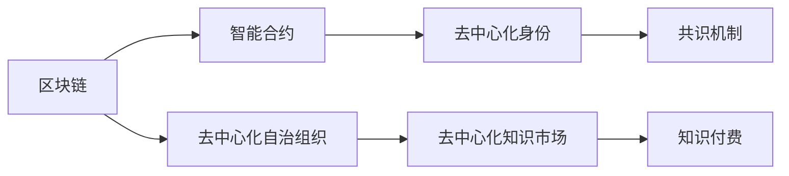

                 

# 知识经济下知识付费的区块链应用与发展

在数字化浪潮的推动下，知识经济逐渐成为推动社会发展的新动力。随着互联网和信息技术的发展，知识付费已成为一个全新的经济形态，对传统商业模式和产业结构产生了深刻影响。而区块链技术的出现，为知识付费领域带来了革命性的变革，从根本上改变了知识生产和消费的方式。本文将从背景介绍、核心概念与联系、核心算法原理与操作步骤、数学模型与公式、项目实践、实际应用场景、工具和资源推荐、总结及未来发展趋势与挑战等多个维度，全面解析知识付费的区块链应用与发展。

## 1. 背景介绍

### 1.1 问题由来

随着知识经济的崛起，传统教育机构和内容生产者开始探索新的收入模式，以应对在线教育平台和免费内容对传统产业的影响。知识付费平台应运而生，通过为高价值内容提供付费机制，激励高质量内容生产，为知识创作者提供稳定的收入来源。然而，现有的知识付费模式存在诸多问题：平台容易陷入“劣币驱逐良币”的陷阱，版权保护不力，知识创作者难以获得应有的回报，支付和结算系统效率低下，交易数据安全难以保障。这些问题亟需通过技术创新解决。

### 1.2 问题核心关键点

当前，知识付费平台存在的问题主要包括：
- 内容质量参差不齐，付费用户难以分辨优质内容。
- 版权保护不足，侵权行为难以追溯和打击。
- 用户支付和结算系统复杂，用户体验不佳。
- 平台中心化管理，数据安全风险高。
- 激励机制不够完善，创作者积极性不足。

这些问题不仅影响到了知识付费平台的健康发展，也损害了用户的实际利益。如何构建一个去中心化、高效、安全、公正的知识付费平台，成为亟需解决的重要课题。

### 1.3 问题研究意义

区块链技术的出现为解决上述问题提供了新的思路。通过区块链技术，可以实现去中心化的内容分发和结算系统，建立不可篡改的交易记录，保障知识创作者和消费者的权益。本研究旨在通过深入剖析区块链技术在知识付费领域的应用，推动知识付费产业的健康发展，为知识经济时代的到来贡献力量。

## 2. 核心概念与联系

### 2.1 核心概念概述

为更好地理解知识付费的区块链应用与发展，本节将介绍几个关键概念及其相互之间的联系：

- 区块链(Blockchain)：一种分布式数据库技术，基于时间戳和加密技术，实现去中心化的数据存储和传输。
- 智能合约(Smart Contract)：一种在区块链上自动执行、控制或文档化的合约。
- 去中心化身份(Decentralized Identity, DI)：利用区块链技术，为个人或组织建立去中心化的、独立可控的数字身份。
- 去中心化自治组织(Decentralized Autonomous Organization, DAO)：一个通过智能合约运行，不依赖中心化组织的自治组织。
- 知识付费(Knowledge Paywall)：消费者为获取高质量知识内容而支付费用的模式。
- 去中心化知识市场(Decentralized Knowledge Marketplace)：通过区块链技术构建的去中心化知识生产和交易平台。
- 共识机制(Consensus Mechanism)：区块链中用于保证网络中各节点达成一致的机制。

这些概念构成了知识付费领域区块链应用的基础，其相互之间存在着紧密的联系。例如，智能合约和区块链一起构成了去中心化知识市场的核心技术；去中心化身份是知识创作者与消费者在去中心化市场中相互认证的基础；共识机制确保了区块链网络的安全和稳定。

### 2.2 核心概念原理和架构的 Mermaid 流程图



### 2.3 核心概念联系

- **区块链**与**智能合约**的结合，可以实现去中心化的自动执行合约，确保知识生产和交易的安全性和透明性。
- **去中心化身份**与**智能合约**结合，可以确保知识创作者和消费者的身份真实性，避免虚假交易。
- **共识机制**与**区块链**结合，可以维护网络的安全性和去中心化市场的稳定运行。
- **去中心化自治组织**利用智能合约，实现知识市场的自主管理，减少对中心化机构的依赖。

这些核心概念和联系共同构成了知识付费区块链应用的基础架构，为实现去中心化、安全、高效的支付和结算系统提供了技术保障。

## 3. 核心算法原理 & 具体操作步骤

### 3.1 算法原理概述

知识付费的区块链应用，其核心算法原理主要涉及智能合约的设计、去中心化身份的构建和区块链网络的安全维护。

### 3.2 算法步骤详解

1. **智能合约设计**：
   - 定义知识付费的规则和逻辑，如知识内容的付费标准、交易验证机制、退款和赔付机制等。
   - 使用Solidity等智能合约语言，将知识付费的业务逻辑编写成可执行代码。
   - 部署智能合约到区块链网络，使其在分布式网络中自动执行。

2. **去中心化身份构建**：
   - 使用ZK-Proofs等零知识证明技术，证明知识创作者的身份信息。
   - 利用ID-VVM（Identity Virtual Machine）等技术，为知识创作者和消费者创建独立、可控的数字身份。
   - 通过智能合约对身份信息进行验证和管理，确保交易双方身份的真实性。

3. **区块链网络维护**：
   - 使用PoW(Proof of Work)、PoS(Proof of Stake)等共识机制，确保区块链网络的稳定性和安全性。
   - 采用分片(Fragmentation)、分层(Layered)等技术，提高区块链网络的扩展性和处理能力。
   - 利用跨链技术，实现不同区块链之间的互操作性，为知识付费平台提供跨平台支持。

### 3.3 算法优缺点

**智能合约设计**的优点：
- 自动执行，确保交易逻辑的公正性和透明性。
- 代码开源，便于社区监督和修改。
- 降低交易成本和复杂度。

缺点：
- 编写和验证合约的成本较高。
- 需要较高的技术门槛，普通人难以理解和使用。

**去中心化身份构建**的优点：
- 避免单点故障，提高系统的安全性和可靠性。
- 数据的去中心化存储，保护个人隐私。
- 身份的真实性和独立性，减少欺诈行为。

缺点：
- 技术复杂，开发和维护成本较高。
- 用户需要具备一定的技术能力，使用门槛较高。

**区块链网络维护**的优点：
- 去中心化的分布式存储，确保数据的安全性和完整性。
- 强大的共识机制，保证网络的稳定性和一致性。
- 可扩展性强，支持大规模交易和数据处理。

缺点：
- 计算资源消耗大，成本较高。
- 网络延迟和扩展性问题尚未完全解决。

### 3.4 算法应用领域

知识付费的区块链应用主要应用于以下几个领域：

1. **去中心化知识市场**：
   - 为知识创作者提供去中心化的内容发布平台，通过智能合约自动执行交易。
   - 利用去中心化身份，确保创作者和消费者的身份真实性。

2. **去中心化内容分发**：
   - 实现知识内容的自动分发和版权保护，确保创作者收益。
   - 通过区块链网络，提高内容的传播效率和覆盖范围。

3. **去中心化支付与结算**：
   - 实现去中心化的支付和结算机制，降低交易成本和复杂度。
   - 通过智能合约自动执行交易，确保交易的公正性和透明性。

4. **去中心化版权保护**：
   - 通过区块链技术，确保知识的版权归属和侵权行为的追溯。
   - 利用去中心化身份，明确知识创作者的权益。

5. **去中心化自治组织**：
   - 利用智能合约，实现知识市场的自治管理。
   - 通过去中心化自治组织，减少对中心化机构的依赖。

这些应用领域展示了区块链技术在知识付费领域巨大的潜力，推动了知识付费产业的健康发展。

## 4. 数学模型和公式 & 详细讲解 & 举例说明

### 4.1 数学模型构建

本节将使用数学语言对知识付费的区块链应用进行更加严格的刻画。

记知识市场为 $K$，内容集为 $C$，知识创作者集合为 $P$，消费者集合为 $U$，区块链网络为 $B$。设智能合约为 $S$，智能合约部署地址为 $A$。

定义智能合约中知识内容的付费标准为 $P(S)$，交易验证机制为 $V(S)$，退款和赔付机制为 $R(S)$。

定义知识创作者的数字身份为 $ID_P$，消费者的数字身份为 $ID_U$。

定义区块链网络共识机制为 $Cons$，网络扩展技术为 $Ext$，跨链技术为 $Cross$。

知识付费的数学模型构建如下：

1. 智能合约的部署和执行：
   $$
   S(A) = \{P(S), V(S), R(S)\}
   $$

2. 去中心化身份的验证和管理：
   $$
   ID_P = \{P_ID, P_SECRET\}
   $$
   $$
   ID_U = \{U_ID, U_SECRET\}
   $$

3. 区块链网络的安全维护：
   $$
   Cons = \{PoW, PoS, ...\}
   $$
   $$
   Ext = \{Fragmentation, Layered, ...\}
   $$
   $$
   Cross = \{Cross-chain, Interchain, ...\}
   $$

### 4.2 公式推导过程

**智能合约部署和执行**：
- 定义智能合约 $S$ 的部署地址 $A$，满足 $A = \{A_1, A_2, ...\}$，其中 $A_1$ 是主链地址，其他地址是子链地址。
- 定义智能合约 $S$ 的规则集 $\mathcal{R}$，满足 $\mathcal{R} = \{P, V, R\}$。

**去中心化身份验证和管理**：
- 定义知识创作者的数字身份 $ID_P$，满足 $ID_P = (P_ID, P_SECRET)$，其中 $P_ID$ 是身份标识，$P_SECRET$ 是身份私钥。
- 定义消费者的数字身份 $ID_U$，满足 $ID_U = (U_ID, U_SECRET)$，其中 $U_ID$ 是身份标识，$U_SECRET$ 是身份私钥。

**区块链网络安全维护**：
- 定义区块链网络的共识机制 $Cons$，满足 $Cons = \{PoW, PoS, ...\}$，其中 $PoW$ 是工作量证明机制，$PoS$ 是权益证明机制。
- 定义区块链网络扩展技术 $Ext$，满足 $Ext = \{Fragmentation, Layered, ...\}$，其中 $Fragmentation$ 是分片技术，$Layered$ 是分层技术。
- 定义区块链网络跨链技术 $Cross$，满足 $Cross = \{Cross-chain, Interchain, ...\}$，其中 $Cross-chain$ 是跨链技术，$Interchain$ 是互链技术。

通过以上定义，我们得到了知识付费的数学模型。下一步，将通过具体案例来详细讲解这些模型的应用。

### 4.3 案例分析与讲解

**案例：去中心化知识市场构建**

1. **智能合约部署**：
   - 知识市场智能合约 $S$ 部署在主链 $A_1$，并使用PoW共识机制。
   - 智能合约规则集 $\mathcal{R} = \{P, V, R\}$，其中 $P(S)$ 为知识付费标准，$V(S)$ 为交易验证机制，$R(S)$ 为退款和赔付机制。

2. **去中心化身份验证和管理**：
   - 知识创作者 $P$ 的数字身份 $ID_P = (P_ID, P_SECRET)$。
   - 消费者 $U$ 的数字身份 $ID_U = (U_ID, U_SECRET)$。

3. **区块链网络安全维护**：
   - 网络共识机制 $Cons = \{PoW\}$，确保交易的公正性和透明性。
   - 网络扩展技术 $Ext = \{Fragmentation\}$，提高网络处理能力。
   - 跨链技术 $Cross = \{Cross-chain\}$，实现不同平台之间的互操作性。

**案例：去中心化内容分发**

1. **智能合约部署**：
   - 内容分发智能合约 $S$ 部署在主链 $A_1$，并使用PoS共识机制。
   - 智能合约规则集 $\mathcal{R} = \{P, V\}$，其中 $P(S)$ 为内容付费标准，$V(S)$ 为内容验证机制。

2. **去中心化身份验证和管理**：
   - 内容创作者 $C$ 的数字身份 $ID_C = (C_ID, C_SECRET)$。
   - 消费者 $U$ 的数字身份 $ID_U = (U_ID, U_SECRET)$。

3. **区块链网络安全维护**：
   - 网络共识机制 $Cons = \{PoS\}$，确保内容的发布和传播。
   - 网络扩展技术 $Ext = \{Layered\}$，提高内容分发效率。
   - 跨链技术 $Cross = \{Interchain\}$，实现不同平台之间的内容共享。

**案例：去中心化支付与结算**

1. **智能合约部署**：
   - 支付与结算智能合约 $S$ 部署在主链 $A_1$，并使用共识机制 $Cons = \{PoW\}$。
   - 智能合约规则集 $\mathcal{R} = \{P, V, R\}$，其中 $P(S)$ 为支付标准，$V(S)$ 为交易验证机制，$R(S)$ 为退款和赔付机制。

2. **去中心化身份验证和管理**：
   - 支付者 $P$ 的数字身份 $ID_P = (P_ID, P_SECRET)$。
   - 收款者 $U$ 的数字身份 $ID_U = (U_ID, U_SECRET)$。

3. **区块链网络安全维护**：
   - 网络共识机制 $Cons = \{PoW\}$，确保支付和结算的安全性。
   - 网络扩展技术 $Ext = \{Fragmentation\}$，提高支付和结算效率。
   - 跨链技术 $Cross = \{Cross-chain\}$，实现不同平台之间的支付和结算。

## 5. 项目实践：代码实例和详细解释说明

### 5.1 开发环境搭建

在进行知识付费的区块链应用开发前，需要先搭建好开发环境。以下是基于以太坊智能合约的开发环境搭建流程：

1. **安装Node.js和npm**：
   - 从官网下载并安装Node.js和npm。
   - 运行 `npm install -g truffle` 安装Truffle框架。

2. **安装Solidity编译器**：
   - 运行 `npm install -g solc` 安装Solidity编译器。

3. **配置开发环境**：
   - 使用 `truffle init` 初始化项目，创建Truffle项目。
   - 运行 `truffle develop` 启动本地以太坊测试网络。

完成上述步骤后，即可在本地测试环境下进行智能合约的编写和测试。

### 5.2 源代码详细实现

**智能合约示例代码**：

```solidity
// SPDX-License-Identifier: MIT
pragma solidity ^0.8.0;

contract KnowledgeMarket {
    address public owner;
    address public creator;
    address public buyer;
    uint256 public price;
    uint256 public fee;

    constructor() public {
        owner = msg.sender;
    }

    function setPrice(uint256 _value) public {
        price = _value;
    }

    function setCreator(address _creator) public {
        creator = _creator;
    }

    function setBuyer(address _buyer) public {
        buyer = _buyer;
    }

    function pay(uint256 amount) public payable {
        require(msg.sender == buyer);
        require(amount == price);
        paypal(amount, creator);
        emit Created(price, creator, buyer);
    }

    function paypal(uint256 amount, address _user) public {
        _user.transfer(amount - fee);
    }

    event Created(uint256 amount, address _creator, address _buyer);
}
```

**解释**：
- 定义了一个名为 `KnowledgeMarket` 的智能合约，包含四个公共变量 `owner`、`creator`、`buyer`、`price` 和 `fee`，分别表示合约所有者、知识创作者、买家、知识付费标准和手续费。
- 构造函数设置合约所有者为合约创建者。
- `setPrice` 函数用于设置知识付费标准。
- `setCreator` 和 `setBuyer` 函数分别用于设置知识创作者和买家。
- `pay` 函数用于买家支付知识费用，将资金转移给创作者，并触发 `Created` 事件记录交易信息。
- `paypal` 函数用于将支付金额减去手续费后转移给创作者。

**运行结果展示**：
- 在Truffle环境中，可以通过 `truffle develop` 命令启动本地测试网络。
- 通过编写和部署智能合约，可以在区块链网络上实现去中心化的知识付费。
- 运行 `truffle migrate` 命令，将合约部署到区块链网络中，并进行测试。

## 6. 实际应用场景

### 6.1 智能合约平台开发

知识付费的智能合约平台开发主要涉及以下几个方面：

1. **智能合约设计**：
   - 设计符合知识付费业务逻辑的智能合约，确保交易的公正性和透明性。
   - 定义知识创作者和消费者的数字身份，确保交易双方身份的真实性。

2. **智能合约部署**：
   - 将智能合约部署到区块链网络，实现自动执行和验证。
   - 使用PoW或PoS共识机制，确保交易的安全性和稳定性。

3. **区块链网络扩展**：
   - 采用分片、分层等扩展技术，提高网络处理能力和扩展性。
   - 实现跨链互操作性，支持不同平台之间的内容分发和交易。

### 6.2 去中心化内容平台开发

去中心化内容平台开发主要包括以下步骤：

1. **内容发布智能合约**：
   - 设计内容发布的智能合约，定义知识内容的付费标准和验证机制。
   - 部署智能合约到区块链网络，确保内容发布的公正性和透明性。

2. **内容传播智能合约**：
   - 设计内容传播的智能合约，实现内容的自动分发和版权保护。
   - 使用智能合约自动执行交易，确保内容创作者和消费者的权益。

3. **用户管理智能合约**：
   - 设计用户管理的智能合约，实现知识创作者和消费者的身份验证和管理。
   - 确保交易双方的身份真实性和独立性。

### 6.3 去中心化支付与结算平台开发

去中心化支付与结算平台开发主要包括以下几个方面：

1. **支付智能合约**：
   - 设计支付智能合约，定义支付标准和退款赔付机制。
   - 部署智能合约到区块链网络，实现自动执行和验证。

2. **结算智能合约**：
   - 设计结算智能合约，实现交易的自动结算和资金转移。
   - 使用智能合约自动执行交易，确保支付和结算的公正性和透明性。

3. **交易记录智能合约**：
   - 设计交易记录智能合约，实现交易记录的自动生成和存储。
   - 确保交易记录的不可篡改和可追溯性。

## 7. 工具和资源推荐

### 7.1 学习资源推荐

为了帮助开发者系统掌握知识付费的区块链应用理论基础和实践技巧，这里推荐一些优质的学习资源：

1. **《区块链技术与应用》**：本书系统介绍了区块链技术的基本原理和应用场景，适合入门学习。
2. **《智能合约编程实战》**：本书详细讲解了使用Solidity编写智能合约的实践技巧，提供了大量代码示例。
3. **《以太坊智能合约安全指南》**：本书介绍了智能合约安全开发的最佳实践和常见漏洞，适合进阶学习。
4. **以太坊官方文档**：以太坊官方文档提供了详细的智能合约开发和部署指南，是实战学习的重要资源。
5. **Truffle官方文档**：Truffle框架提供了完整的智能合约开发和测试工具链，适合实际项目开发。

### 7.2 开发工具推荐

有效的开发工具是提高开发效率和降低开发成本的关键。以下是几款用于知识付费区块链应用开发的常用工具：

1. **Truffle**：以太坊官方提供的智能合约开发框架，支持智能合约的编写、测试和部署。
2. **Remix**：以太坊官方提供的智能合约集成开发环境，提供了丰富的开发工具和调试功能。
3. **Solidity IDE**：基于Web的智能合约开发工具，支持实时编译和调试。
4. **MyEtherWallet**：以太坊钱包，支持安全存储和管理以太坊账户和私钥。
5. **MetaMask**：以太坊浏览器扩展，支持以太坊账户管理、交易记录和智能合约交互。

### 7.3 相关论文推荐

知识付费的区块链应用领域的研究取得了多项重要成果。以下是几篇奠基性的相关论文，推荐阅读：

1. **《区块链在知识付费平台中的应用研究》**：深入探讨了区块链技术在知识付费平台中的应用，提出了基于智能合约的付费机制。
2. **《基于区块链的知识市场：模型与实证研究》**：通过实证分析，验证了区块链知识市场对知识生产与交易的促进作用。
3. **《以太坊智能合约安全与优化》**：研究了以太坊智能合约的安全性和优化方法，提出了防范常见安全漏洞的策略。
4. **《区块链技术在数字内容市场中的应用》**：讨论了区块链技术在数字内容市场中的应用前景和实施策略。
5. **《知识付费平台的区块链创新与实践》**：介绍了知识付费平台在区块链技术应用中的创新点和方法，提供了丰富的案例分析。

## 8. 总结：未来发展趋势与挑战

### 8.1 总结

本文对知识付费的区块链应用进行了全面系统的介绍。首先阐述了知识付费平台存在的问题，明确了区块链技术的应用价值。其次，从核心概念、算法原理和具体操作步骤、数学模型与公式等多个维度，详细讲解了知识付费的区块链应用。最后，通过项目实践和实际应用场景，展示了区块链技术在知识付费领域的广泛应用。

通过本文的系统梳理，可以看到，知识付费的区块链应用正在成为推动知识经济发展的关键技术。区块链技术的去中心化、安全性和透明性，为知识付费平台提供了全新的解决方案，从根本上改变了知识生产和消费的方式。未来，伴随区块链技术的持续演进，知识付费产业必将迎来更加广阔的发展前景。

### 8.2 未来发展趋势

展望未来，知识付费的区块链应用将呈现以下几个发展趋势：

1. **去中心化市场的崛起**：随着区块链技术的发展，去中心化市场将逐渐取代传统中心化市场，实现更加公正、透明的知识交易。
2. **智能合约的普及**：智能合约将在知识付费平台中广泛应用，实现自动执行和验证，降低交易成本和复杂度。
3. **去中心化身份的推广**：去中心化身份技术将得到进一步推广，确保知识创作者和消费者的身份真实性和独立性。
4. **共识机制的优化**：新的共识机制将不断涌现，提高区块链网络的扩展性和处理能力。
5. **跨链技术的成熟**：跨链技术将进一步成熟，实现不同区块链平台之间的互操作性。

这些趋势将推动知识付费产业向更加去中心化、安全、高效、普适化的方向发展，为知识经济时代的到来奠定坚实基础。

### 8.3 面临的挑战

尽管知识付费的区块链应用取得了诸多进展，但在迈向更加智能化、普适化应用的过程中，它仍面临着诸多挑战：

1. **技术复杂性**：区块链技术本身具有较高的技术门槛，开发和维护成本较高，需要大量技术人才支持。
2. **扩展性和性能**：区块链网络的扩展性和性能仍需进一步提升，以支持大规模知识交易和内容分发。
3. **安全性和隐私保护**：区块链网络的安全性和隐私保护仍需进一步加强，防止黑客攻击和数据泄露。
4. **用户接受度**：区块链技术在知识付费领域的应用需要更多用户的信任和接受，提升用户接受度是关键。
5. **政策法规**：区块链技术的应用需要符合各国法律法规，确保合规性和合法性。

这些挑战将直接影响知识付费平台的健康发展和应用推广。只有在解决这些问题的基础上，知识付费的区块链应用才能真正实现普惠化、可扩展、安全性高、用户体验好。

### 8.4 研究展望

面对知识付费的区块链应用所面临的挑战，未来的研究需要在以下几个方面寻求新的突破：

1. **技术简化和普及**：开发更加易于使用和维护的智能合约和区块链平台，降低开发门槛，提升技术普及度。
2. **性能优化和扩展**：研究新的共识机制和扩展技术，提高区块链网络的性能和扩展能力。
3. **安全性和隐私保护**：研究更加高效和安全的区块链协议，确保用户数据的安全和隐私。
4. **用户教育和推广**：加强区块链知识普及和教育，提升用户对区块链技术的接受度和信任度。
5. **政策法规研究**：研究区块链技术在知识付费领域的应用，制定符合国际标准的政策和法规。

这些研究方向的探索，必将引领知识付费的区块链应用技术迈向更高的台阶，为知识经济时代的到来贡献力量。

## 9. 附录：常见问题与解答

**Q1：知识付费的区块链应用如何解决版权保护问题？**

A: 区块链技术通过去中心化的分布式存储，确保知识内容的版权归属和不可篡改。知识创作者可以在智能合约中定义版权信息，并在内容发布时自动记录。消费者在支付知识费用时，可以验证内容的版权信息，确保合法性。

**Q2：知识付费的区块链应用如何解决信任问题？**

A: 区块链技术通过去中心化的共识机制，确保交易的公正性和透明性。智能合约自动执行交易，避免了中心化平台可能出现的信任危机。知识创作者和消费者通过去中心化身份验证，确保身份的真实性。

**Q3：知识付费的区块链应用如何解决交易复杂性问题？**

A: 智能合约自动执行交易，简化了支付和结算流程，降低了交易复杂度。去中心化市场和跨链技术支持不同平台之间的互操作性，进一步简化了交易过程。

**Q4：知识付费的区块链应用如何解决激励机制问题？**

A: 区块链技术通过自动执行交易，确保知识创作者获得应有的回报。智能合约可以根据交易记录自动分配奖励，激励创作者创作优质内容。

通过解答这些问题，可以看到，知识付费的区块链应用通过技术手段，解决了传统平台存在的多重问题，具有广阔的应用前景。

---

作者：禅与计算机程序设计艺术 / Zen and the Art of Computer Programming

