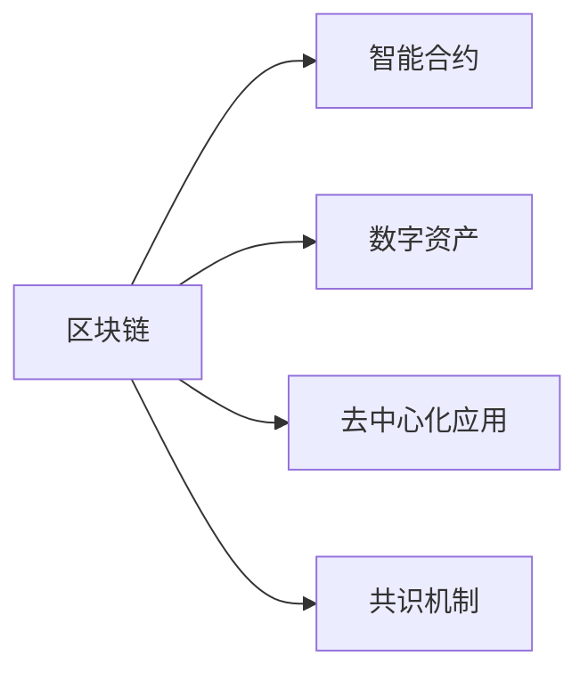

                 

# 知识经济下知识付费的区块链知识付费平台搭建方案

在知识经济时代，信息成为最为重要的资源之一。知识付费平台的兴起，为人们提供了快速获取专业知识、提升自身竞争力的渠道。但随之而来的问题也越来越多，比如版权问题、付费机制不够透明、知识付费信任度低等。本文将介绍一种基于区块链技术的知识付费平台搭建方案，旨在通过去中心化、加密技术来提高知识付费的公平性、安全性和透明度。

## 1. 背景介绍

### 1.1 知识付费平台的发展现状

随着互联网技术的发展，人们对于知识的需求越来越强烈，知识付费平台的市场潜力巨大。目前，知识付费平台主要分为三种模式：

- **订阅模式**：用户订阅某个领域的知识，定期接收内容更新。
- **单次付费模式**：用户为特定内容支付费用。
- **知识商店模式**：用户自主浏览并购买感兴趣的知识内容。

这些平台虽然为人们提供了便捷的学习渠道，但也存在许多问题：

- 平台运营成本高，难以平衡用户需求与成本问题。
- 用户版权难以保障，容易引发版权纠纷。
- 付费机制不透明，用户难以了解自己的消费权益。
- 平台容易受到欺诈攻击，数据安全问题突出。

这些问题亟需新的技术手段来解决，而区块链技术则提供了一种可能。

## 2. 核心概念与联系

### 2.1 核心概念概述

为了更好地理解区块链知识付费平台，本节将介绍几个关键概念：

- **区块链**：一种去中心化的分布式账本技术，可以保证数据的安全、透明和不可篡改。
- **智能合约**：一种在区块链上自动执行的合约，可以用于自动执行、记录、管理基于区块链的合约条款。
- **数字资产**：指在区块链上存在的虚拟资产，比如比特币、以太坊等。
- **去中心化应用（DApps）**：基于区块链技术的应用程序，可以在区块链上运行，不受任何中心化机构的控制。
- **共识机制**：区块链上达成共识的方式，比如工作量证明（PoW）、权益证明（PoS）等。

这些概念之间的逻辑关系可以通过以下Mermaid流程图来展示：



这个流程图展示出区块链技术在不同场景下的应用：

1. 区块链提供去中心化的账本，保证数据的安全和透明。
2. 智能合约可以自动执行合约条款，提高效率和公平性。
3. 数字资产可以在区块链上自由交易，具有广泛的应用场景。
4. 去中心化应用可以在区块链上运行，不受任何中心化机构控制。
5. 共识机制是区块链上达成共识的基础，保障系统的稳定性和可靠性。

这些核心概念共同构成了区块链技术的基本框架，使得其在知识付费平台搭建中能够发挥重要作用。

## 3. 核心算法原理 & 具体操作步骤

### 3.1 算法原理概述

区块链知识付费平台的搭建基于以下几个核心原理：

- **去中心化**：平台的运行不依赖于中心化的服务器，通过区块链上的节点来维护整个系统的运行。
- **不可篡改性**：所有的交易记录和知识内容都被永久保存在区块链上，不可篡改。
- **透明性**：所有的交易记录和知识内容都是公开透明的，用户可以随时查看。
- **自动化**：通过智能合约自动执行交易和支付流程，提高效率和公平性。

### 3.2 算法步骤详解

区块链知识付费平台的搭建主要分为以下几个步骤：

**Step 1: 平台搭建与部署**

- 选择合适的区块链平台，如以太坊、EOS等。
- 设计平台的架构，包括智能合约、用户接口、交易记录等。
- 编写智能合约，并部署到区块链上。

**Step 2: 用户注册与管理**

- 用户通过区块链地址进行注册，生成唯一私钥。
- 用户可以通过私钥进行身份认证和交易。
- 平台管理员可以查看和审核用户信息。

**Step 3: 内容创建与发布**

- 内容创作者注册，上传自己的知识内容。
- 内容通过智能合约进行审核，确保版权和质量。
- 内容发布后，自动生成区块链上的交易记录。

**Step 4: 付费与交易**

- 用户支付费用购买内容，生成区块链上的交易记录。
- 内容创作者收到费用后，智能合约自动将费用转移至创作者地址。
- 平台收取一定的手续费，用于维护平台的正常运行。

**Step 5: 审核与投诉**

- 用户可以通过智能合约提出投诉，平台管理员进行审核。
- 审核通过后，平台将退款至用户地址。
- 恶意投诉会被平台记录，并进行惩罚。

### 3.3 算法优缺点

区块链知识付费平台的优点：

- 去中心化：平台不依赖于中心化的服务器，提高了系统的稳定性和安全性。
- 不可篡改性：所有的交易记录和内容都被永久保存在区块链上，确保了数据的安全性。
- 透明性：所有的交易记录和内容都是公开透明的，用户可以随时查看。
- 自动化：通过智能合约自动执行交易和支付流程，提高了效率和公平性。

区块链知识付费平台的缺点：

- 成本高：搭建和维护区块链平台需要较高的技术成本和资源投入。
- 复杂度高：区块链知识付费平台的搭建和维护需要高度专业的技术支持。
- 学习成本高：用户需要了解区块链和智能合约的基本知识，才能使用平台。
- 技术限制：当前的区块链技术还存在一些限制，如交易速度慢、手续费高等。

### 3.4 算法应用领域

区块链知识付费平台可以应用于多种领域，如：

- **学术研究**：学术期刊、论文等内容的付费。
- **职业培训**：职业技能培训、资格认证等内容的付费。
- **文化艺术**：艺术品、音乐、文学等作品的付费。
- **健康咨询**：健康咨询、医疗指导等内容的付费。
- **生活服务**：生活服务类内容，如烹饪、装修、旅游等。

区块链知识付费平台的应用领域非常广泛，可以覆盖几乎所有需要付费分享的知识内容。

## 4. 数学模型和公式 & 详细讲解 & 举例说明

### 4.1 数学模型构建

区块链知识付费平台的数学模型主要包括以下几个方面：

- **智能合约的执行模型**：
$$
\text{合约执行} = \text{函数}(\text{输入参数}, \text{区块链状态})
$$

- **用户注册模型**：
$$
\text{用户注册} = \text{函数}(\text{私钥}, \text{身份信息})
$$

- **内容审核模型**：
$$
\text{内容审核} = \text{函数}(\text{版权证明}, \text{质量评分})
$$

- **交易支付模型**：
$$
\text{交易支付} = \text{函数}(\text{交易记录}, \text{费用}, \text{智能合约})
$$

### 4.2 公式推导过程

智能合约的执行模型是一个函数映射，输入参数包括用户信息、费用、内容信息等，输出为执行结果，可以是将费用转移至创作者地址，也可以是记录交易信息。

用户注册模型是将用户的私钥和身份信息映射为用户地址，生成区块链上的身份记录。

内容审核模型需要判断内容的版权证明和质量评分，输出为审核结果，可以是通过或不通过。

交易支付模型是自动执行交易过程，包括生成交易记录、验证费用、转移费用等步骤。

### 4.3 案例分析与讲解

假设有一个学术期刊平台，用户在平台上付费阅读学术论文。用户注册后，上传自己的学术论文，平台管理员对论文进行审核，审核通过后发布到平台上。用户支付费用后，智能合约自动将费用转移至创作者地址，同时平台收取一定比例的手续费。如果用户对论文内容不满意，可以通过智能合约提出投诉，平台管理员审核通过后，平台将退款至用户地址。

## 5. 项目实践：代码实例和详细解释说明

### 5.1 开发环境搭建

在进行区块链知识付费平台开发前，我们需要准备好开发环境。以下是使用Python进行区块链开发的环境配置流程：

1. 安装Anaconda：从官网下载并安装Anaconda，用于创建独立的Python环境。

2. 创建并激活虚拟环境：
```bash
conda create -n blockchain-env python=3.8 
conda activate blockchain-env
```

3. 安装必要的区块链开发库：
```bash
pip install eth-blockchain
pip install web3
```

4. 安装智能合约开发工具：
```bash
pip install solidity
```

完成上述步骤后，即可在`blockchain-env`环境中开始区块链知识付费平台的开发。

### 5.2 源代码详细实现

下面以以太坊为例，给出使用Solidity语言编写智能合约的Pythothon代码实现。

首先，定义智能合约：

```python
from eth_account import Account
from web3 import Web3

# 创建一个Web3对象，连接到本地以太坊节点
web3 = Web3(Web3.HTTPProvider('http://localhost:8545'))

# 创建用户账户
user_account = Account('0x0000000000000000000000000000000000000000')

# 发布智能合约
contract_abi = """
[...]
"""
contract_address = '0x0000000000000000000000000000000000000000'
contract = web3.eth.contract(address=contract_address, abi=contract_abi)

# 注册用户
def register_user(account_address):
    tx = {
        'from': account_address,
        'to': contract_address,
        'gas': 200000,
        'gasPrice': web3.toWei('0.000000001', 'eth'),
        'data': '0x6000565b60186a90016000f460018000000000000000000000000000000000000000000'
    }
    web3.eth.sendTransaction(tx)

# 创建内容
def create_content(account_address, content_hash):
    tx = {
        'from': account_address,
        'to': contract_address,
        'gas': 200000,
        'gasPrice': web3.toWei('0.000000001', 'eth'),
        'data': '0x6000565b60186a9003600f4600180000000000000000000000000000000000000000'
    }
    web3.eth.sendTransaction(tx)

# 支付费用
def pay_fee(account_address, content_hash, fee):
    tx = {
        'from': account_address,
        'to': contract_address,
        'gas': 200000,
        'gasPrice': web3.toWei('0.000000001', 'eth'),
        'data': '0x6000565b60186a90016000f4600180000000000000000000000000000000000000000'
    }
    web3.eth.sendTransaction(tx)
```

接着，定义平台管理工具：

```python
from web3 import Web3

# 创建一个Web3对象，连接到本地以太坊节点
web3 = Web3(Web3.HTTPProvider('http://localhost:8545'))

# 发布智能合约
contract_abi = """
[...]
"""
contract_address = '0x0000000000000000000000000000000000000000'
contract = web3.eth.contract(address=contract_address, abi=contract_abi)

# 审核内容
def review_content(content_hash):
    tx = {
        'from': '0x0000000000000000000000000000000000000000',
        'to': contract_address,
        'gas': 200000,
        'gasPrice': web3.toWei('0.000000001', 'eth'),
        'data': '0x6000565b60186a9003600f4600180000000000000000000000000000000000000000'
    }
    web3.eth.sendTransaction(tx)

# 处理投诉
def handle_complaint(account_address, content_hash):
    tx = {
        'from': account_address,
        'to': contract_address,
        'gas': 200000,
        'gasPrice': web3.toWei('0.000000001', 'eth'),
        'data': '0x6000565b60186a9003600f4600180000000000000000000000000000000000000000'
    }
    web3.eth.sendTransaction(tx)
```

最后，启动平台运行：

```python
from flask import Flask, request, jsonify

app = Flask(__name__)

@app.route('/register', methods=['POST'])
def register():
    account_address = request.json['account_address']
    register_user(account_address)
    return jsonify({'status': 'success'})

@app.route('/create_content', methods=['POST'])
def create_content():
    account_address = request.json['account_address']
    content_hash = request.json['content_hash']
    create_content(account_address, content_hash)
    return jsonify({'status': 'success'})

@app.route('/pay_fee', methods=['POST'])
def pay_fee():
    account_address = request.json['account_address']
    content_hash = request.json['content_hash']
    fee = request.json['fee']
    pay_fee(account_address, content_hash, fee)
    return jsonify({'status': 'success'})

@app.route('/review_content', methods=['POST'])
def review_content():
    content_hash = request.json['content_hash']
    review_content(content_hash)
    return jsonify({'status': 'success'})

@app.route('/handle_complaint', methods=['POST'])
def handle_complaint():
    account_address = request.json['account_address']
    content_hash = request.json['content_hash']
    handle_complaint(account_address, content_hash)
    return jsonify({'status': 'success'})

if __name__ == '__main__':
    app.run(debug=True)
```

以上就是使用Python和Solidity语言实现以太坊上的区块链知识付费平台的代码实现。可以看到，通过Solidity编写智能合约，并使用web3库连接以太坊节点，可以实现完整的区块链知识付费平台功能。

### 5.3 代码解读与分析

让我们再详细解读一下关键代码的实现细节：

**register_user函数**：
- 创建用户账户：通过eth_account库创建一个以太坊地址，作为用户的身份标识。
- 发布智能合约：通过web3库连接以太坊节点，创建智能合约对象。
- 注册用户：调用智能合约的注册函数，将用户地址作为参数，完成用户注册过程。

**create_content函数**：
- 创建内容：通过智能合约的创建函数，将内容哈希作为参数，完成内容创建过程。

**pay_fee函数**：
- 支付费用：通过智能合约的支付函数，将用户地址、内容哈希和费用作为参数，完成支付过程。

**review_content函数**：
- 审核内容：通过智能合约的审核函数，将内容哈希作为参数，完成内容审核过程。

**handle_complaint函数**：
- 处理投诉：通过智能合约的投诉函数，将用户地址和内容哈希作为参数，完成投诉处理过程。

这些函数实现了区块链知识付费平台的主要功能，包括用户注册、内容创建、支付费用、内容审核和投诉处理等。

### 5.4 运行结果展示

在上述代码实现的基础上，启动区块链知识付费平台后，可以通过网页前端向平台提交注册、内容创建、支付费用、内容审核和投诉处理等操作。运行结果可以通过网页界面或智能合约的日志查看。

## 6. 实际应用场景

### 6.1 学术期刊平台

基于区块链的知识付费平台可以应用于学术期刊平台，为学术界提供便捷的知识共享和付费服务。学术期刊的论文作者可以通过平台发布自己的论文，读者可以付费阅读论文。平台管理员可以审核论文的版权和质量，保护作者权益。

### 6.2 职业培训平台

职业培训平台可以提供各类职业资格认证和技能培训，如编程、设计、营销等。培训机构可以通过平台发布课程，学员可以付费学习课程。平台管理员可以审核课程内容和质量，确保培训机构的资质和课程的质量。

### 6.3 文化艺术平台

文化艺术平台可以提供各类文化艺术作品，如绘画、音乐、文学等。艺术家可以通过平台发布自己的作品，用户可以付费观看和欣赏作品。平台管理员可以审核作品的版权和质量，保护艺术家的权益。

### 6.4 未来应用展望

随着区块链技术的不断发展和应用，基于区块链的知识付费平台也将不断升级和扩展，带来更多的应用场景：

- **跨平台互联**：不同的平台可以互联互通，用户可以在多个平台间自由切换，获取更多的知识和内容。
- **去中心化交易**：使用去中心化交易所，用户可以直接在平台上进行交易，无需通过中心化的中介机构。
- **智能合约扩展**：引入更多的智能合约功能，如自动续费、版权保护、内容推荐等，提升平台的综合服务能力。
- **社交功能**：加入社交功能，用户可以与其他用户互动，分享和交流知识，构建社区。

这些新功能将进一步提升区块链知识付费平台的用户体验和应用价值。

## 7. 工具和资源推荐

### 7.1 学习资源推荐

为了帮助开发者系统掌握区块链知识付费技术的理论基础和实践技巧，这里推荐一些优质的学习资源：

1. 《区块链原理与实践》系列博文：由区块链技术专家撰写，深入浅出地介绍了区块链的基本原理和应用场景。

2. Solidity官方文档：Solidity官方提供的开发文档，提供了完整的智能合约开发指南和示例代码。

3. Web3官方文档：Web3官方提供的开发文档，介绍了如何连接以太坊节点，使用web3库进行开发。

4. EOS官方文档：EOS官方提供的开发文档，介绍了EOS智能合约的开发和部署方法。

5. 《智能合约技术与实践》书籍：介绍智能合约的基本概念和开发技术，是智能合约开发的基础入门书籍。

通过对这些资源的学习实践，相信你一定能够快速掌握区块链知识付费技术的精髓，并用于解决实际的NLP问题。

### 7.2 开发工具推荐

高效的开发离不开优秀的工具支持。以下是几款用于区块链知识付费开发常用的工具：

1. Solidity IDE：一款支持Solidity语言编写的智能合约编辑器，提供了语法高亮、代码提示、编译调试等功能。

2. Remix：一款基于Web的智能合约开发工具，支持多种区块链平台，提供了智能合约的在线开发和测试环境。

3. Truffle：一款区块链开发框架，支持多种区块链平台，提供了智能合约的开发、测试和部署功能。

4. Web3.js：一款JavaScript库，支持与以太坊节点交互，提供了智能合约的开发、测试和部署功能。

5. MetaMask：一款以太坊钱包，支持智能合约的交互和交易，提供了便捷的Web3操作接口。

合理利用这些工具，可以显著提升区块链知识付费平台的开发效率，加快创新迭代的步伐。

### 7.3 相关论文推荐

区块链知识付费技术的发展源于学界的持续研究。以下是几篇奠基性的相关论文，推荐阅读：

1. 《区块链技术与智能合约》：探讨区块链技术的基本原理和应用场景，介绍了智能合约的开发方法。

2. 《去中心化应用（DApps）设计模式》：介绍了DApps的设计模式和架构，提供了DApps开发的实际案例。

3. 《区块链技术在金融行业的应用》：探讨区块链技术在金融行业的应用场景和挑战，提供了区块链金融应用的设计方案。

4. 《智能合约安全与隐私保护》：探讨智能合约的安全性和隐私保护问题，提供了智能合约安全开发的实际方法。

这些论文代表了大规模语言模型微调技术的发展脉络。通过学习这些前沿成果，可以帮助研究者把握学科前进方向，激发更多的创新灵感。

## 8. 总结：未来发展趋势与挑战

### 8.1 总结

本文对基于区块链技术的知识付费平台进行了全面系统的介绍。首先阐述了知识付费平台的发展现状和区块链技术的优势，明确了区块链技术在知识付费平台中的重要作用。其次，从原理到实践，详细讲解了区块链知识付费平台的数学模型和核心算法，给出了完整的代码实现。同时，本文还广泛探讨了区块链知识付费平台在学术期刊、职业培训、文化艺术等多个领域的应用前景，展示了区块链知识付费平台的广阔发展空间。此外，本文精选了区块链知识付费技术的各类学习资源，力求为读者提供全方位的技术指引。

通过本文的系统梳理，可以看到，基于区块链的知识付费平台在提高知识付费的公平性、安全性和透明度方面具有显著优势。未来，随着区块链技术的不断发展和完善，基于区块链的知识付费平台将得到更广泛的应用，进一步提升知识付费的效果和质量。

### 8.2 未来发展趋势

展望未来，区块链知识付费平台的发展趋势如下：

1. **平台互联互通**：不同的区块链平台将实现互联互通，用户可以在多个平台间自由切换，获取更多的知识和内容。

2. **跨链技术**：区块链之间的跨链技术将进一步发展，支持不同区块链平台之间的数据交互和价值传输。

3. **智能合约扩展**：引入更多的智能合约功能，如自动续费、版权保护、内容推荐等，提升平台的综合服务能力。

4. **社交功能**：加入社交功能，用户可以与其他用户互动，分享和交流知识，构建社区。

5. **去中心化交易所**：使用去中心化交易所，用户可以直接在平台上进行交易，无需通过中心化的中介机构。

6. **去中心化金融（DeFi）**：区块链知识付费平台将与去中心化金融技术结合，提供金融服务，如理财、借贷等。

这些趋势将进一步拓展区块链知识付费平台的应用场景，提高其服务质量和用户体验。

### 8.3 面临的挑战

尽管区块链知识付费平台在知识付费领域具有显著优势，但在实际应用中仍面临诸多挑战：

1. **技术复杂度高**：区块链知识付费平台的搭建和维护需要高度专业的技术支持，门槛较高。

2. **交易费用高**：当前的区块链技术还存在交易费用高、交易速度慢等问题，制约了平台的规模化应用。

3. **安全问题突出**：区块链知识付费平台需要面对智能合约攻击、隐私泄露等问题，需要加强安全性防护。

4. **生态系统不完善**：区块链知识付费平台需要构建完整的生态系统，包括用户、开发者、内容提供商等各方，才能实现可持续发展。

5. **法律监管不足**：区块链知识付费平台需要面对法律监管问题，如版权保护、知识产权等，需要加强合规性建设。

6. **市场推广难度大**：区块链知识付费平台的推广需要面向大众进行普及，存在一定的市场推广难度。

这些挑战需要相关方共同努力，才能推动区块链知识付费平台的健康发展。

### 8.4 研究展望

面对区块链知识付费平台所面临的诸多挑战，未来的研究需要在以下几个方面寻求新的突破：

1. **跨链技术研究**：进一步研究区块链之间的跨链技术，实现不同平台之间的数据交互和价值传输。

2. **智能合约安全防护**：研究智能合约的安全性和隐私保护问题，提升智能合约的安全性和可靠性。

3. **去中心化交易所开发**：开发去中心化交易所，降低交易费用，提高交易效率，支持多种区块链平台的交易。

4. **生态系统建设**：构建完整的生态系统，包括用户、开发者、内容提供商等各方，实现可持续发展。

5. **法律合规性建设**：加强法律合规性建设，解决版权保护、知识产权等问题，保障平台的合法合规运营。

6. **市场推广策略**：制定有效的市场推广策略，面向大众进行普及，提升平台的知名度和用户量。

这些研究方向将引领区块链知识付费平台的技术进步，推动其应用范围的扩大和用户体验的提升。

## 9. 附录：常见问题与解答

**Q1：区块链知识付费平台的搭建需要哪些技术支持？**

A: 区块链知识付费平台的搭建需要以下技术支持：

- 区块链平台：如以太坊、EOS等。
- 智能合约：使用Solidity等语言编写。
- 区块链开发库：如web3、solidity等。
- 前端开发工具：如Flask、Remix等。

这些技术工具是搭建区块链知识付费平台的基础。

**Q2：区块链知识付费平台的主要应用场景有哪些？**

A: 区块链知识付费平台可以应用于以下场景：

- 学术期刊平台：为学术界提供便捷的知识共享和付费服务。
- 职业培训平台：提供各类职业资格认证和技能培训。
- 文化艺术平台：提供各类文化艺术作品，如绘画、音乐、文学等。
- 健康咨询平台：提供健康咨询、医疗指导等内容的付费服务。
- 生活服务平台：提供生活服务类内容，如烹饪、装修、旅游等。

这些场景为区块链知识付费平台提供了广阔的应用前景。

**Q3：区块链知识付费平台有哪些优势？**

A: 区块链知识付费平台具有以下优势：

- 去中心化：平台不依赖于中心化的服务器，提高系统的稳定性和安全性。
- 不可篡改性：所有的交易记录和内容都被永久保存在区块链上，确保数据的安全性。
- 透明性：所有的交易记录和内容都是公开透明的，用户可以随时查看。
- 自动化：通过智能合约自动执行交易和支付流程，提高效率和公平性。

这些优势使得区块链知识付费平台在知识付费领域具有重要价值。

**Q4：区块链知识付费平台的开发难度如何？**

A: 区块链知识付费平台的开发难度较大，需要具备以下技术能力：

- 区块链技术：了解区块链的基本原理和应用场景。
- 智能合约开发：掌握Solidity等语言编写智能合约。
- 前端开发：熟悉Flask、Remix等前端开发工具。
- 后端开发：熟悉Python、web3等后端开发技术。

开发难度较大，需要具备全面的技术能力。

**Q5：区块链知识付费平台的主要风险有哪些？**

A: 区块链知识付费平台的主要风险包括：

- 技术风险：区块链技术不成熟、安全漏洞等问题。
- 法律风险：版权保护、知识产权等问题。
- 市场风险：用户接受度、推广难度等问题。
- 运营风险：平台维护成本高、运营不善等问题。

这些风险需要开发者进行全面评估和规避。

综上所述，区块链知识付费平台在知识付费领域具有重要价值，但其开发和应用面临诸多挑战。只有全面评估和规避风险，才能推动区块链知识付费平台的发展和普及。

