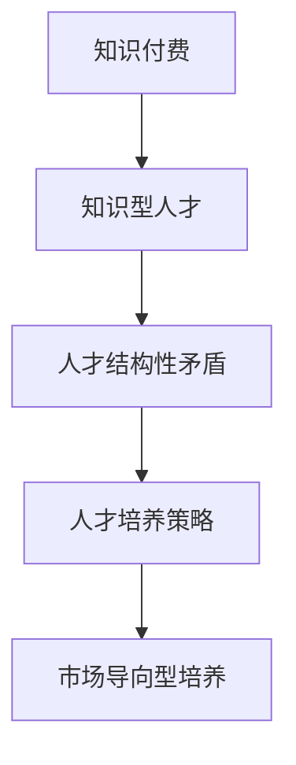

                 

# 知识经济时代下的知识付费人才培养策略

## 1. 背景介绍

随着知识经济时代的到来，知识付费产业蓬勃发展，企业对高层次知识型人才的需求日益增长。然而，当前高校人才培养体系尚不能完全满足行业需求，知识型人才的培养策略亟需创新。

### 1.1 知识付费的兴起
知识付费，指用户为获取专业知识和技能而支付的费用，涵盖在线课程、咨询顾问、电子书等形式。近年来，随着社会对知识需求的提升，知识付费市场迅猛增长，成为互联网行业的重要增长点。据统计，2021年全球知识付费市场规模已达900亿美元。

### 1.2 知识型人才需求增长
知识型人才，即具备专业知识和技能，能够在特定领域进行创新和决策的人才。由于技术进步、产业升级、市场竞争的加剧，企业对知识型人才的需求不断增长。根据麦肯锡报告，到2030年，全球将面临1.33亿知识型人才的缺口。

## 2. 核心概念与联系

### 2.1 核心概念概述

为深入理解知识经济时代下的知识付费人才培养策略，本节将介绍几个关键概念：

- **知识付费**：指用户为获取专业知识和技能而支付的费用，涵盖在线课程、咨询顾问、电子书等形式。
- **知识型人才**：指具备专业知识和技能，能够在特定领域进行创新和决策的人才。
- **人才结构性矛盾**：指当前人才供需不匹配的状况，即供不应求的紧缺型人才和高供给的过剩型人才同时存在。
- **人才培养策略**：指高校和企业在人才培养过程中所采取的策略和方法，包括课程设置、师资力量、实习实践等。
- **市场导向型培养**：指根据市场需求进行人才培养，注重实践能力和技术应用的策略。

这些概念之间的逻辑关系可以通过以下Mermaid流程图来展示：



这个流程图展示的知识付费、知识型人才、人才培养策略、市场导向型培养之间的关系：

1. 知识付费驱动知识型人才的培养需求。
2. 市场对知识型人才的需求，导致人才结构性矛盾的凸显。
3. 为解决人才结构性矛盾，高校和企业在人才培养过程中需采取市场导向型策略。

## 3. 核心算法原理 & 具体操作步骤
### 3.1 算法原理概述

知识付费时代的知识型人才培养，本质上是根据市场需求进行的定向人才培养。其核心思想是：根据市场对知识型人才的需求，设计针对性的课程体系，选择合适的师资力量，提供实践机会，最终培养出符合市场需求的各类人才。

### 3.2 算法步骤详解

以下是知识付费人才培养策略的具体步骤：

**Step 1: 需求分析**
- 调研市场对各类知识型人才的需求，确定目标培养方向和能力要求。
- 通过企业需求对接、行业调研等方式，收集企业的招聘要求和职业发展路径。

**Step 2: 课程设计与优化**
- 设计符合市场需求的专业课程体系，涵盖基础知识、前沿技术、实践应用等。
- 引入行业专家，参与课程设计和实践教学，提升课程的实用性和前沿性。
- 定期评估课程内容和教学效果，进行迭代优化。

**Step 3: 师资力量配置**
- 引进高水平的全职教师和兼职教师，形成多元化的师资队伍。
- 建立教师培训和激励机制，提升教师的教学能力和科研水平。
- 引入企业导师，参与学生实践和职业指导，加强理论与实践的结合。

**Step 4: 实践与实习机会**
- 与企业合作建立实习基地，提供真实的实习机会。
- 开展各类实践项目和竞赛，提升学生的动手能力和创新能力。
- 建立校企合作机制，推动学生进入企业进行短期工作和学习。

**Step 5: 持续学习与职业发展**
- 提供在线课程和认证考试，支持学生终身学习。
- 建立职业发展指导中心，提供职业规划、就业指导等服务。
- 与企业合作，开展职业培训和企业培训，提升学生就业竞争力。

### 3.3 算法优缺点

知识付费人才培养策略具有以下优点：
1. 紧跟市场需求：根据市场变化灵活调整人才培养策略，提升人才培养的针对性。
2. 提高实践能力：通过实践和实习环节，提升学生的实际操作能力和职业素养。
3. 增强就业竞争力：通过持续学习与职业发展支持，提高学生的就业率和职业发展潜力。

同时，该策略也存在一定的局限性：
1. 师资力量配置成本高：高质量的教师资源稀缺，需要大量资金和努力进行引进和培训。
2. 课程设计复杂：需要不断调整和优化课程体系，确保课程内容的前沿性和实用性。
3. 企业合作难度大：需要与多家企业进行合作，协调沟通成本较高。
4. 学生自主性要求高：学生需要在自我驱动下进行持续学习和实践，对学生自我管理能力要求高。

尽管存在这些局限性，但就目前而言，市场导向型培养策略仍是最有效、最受欢迎的人才培养方式之一。未来相关研究的重点在于如何进一步优化资源配置，提高人才培养的效率和质量，同时兼顾可操作性和持续性。

### 3.4 算法应用领域

知识付费人才培养策略在多个领域得到了广泛应用，例如：

- **IT行业**：IT企业对软件开发、数据分析、人工智能等各类知识型人才的需求不断增长。通过市场导向型培养策略，IT高校能够及时调整课程体系，培养出符合企业需求的各类IT人才。
- **金融行业**：金融行业对大数据、量化交易、风险管理等知识型人才的需求日益增加。金融高校通过市场导向型培养，培养出满足行业需求的各类金融人才。
- **医疗行业**：医疗行业对医学大数据、人工智能诊断、个性化医疗等知识型人才的需求日益增长。通过市场导向型培养，医疗高校能够培养出适应新医疗环境的各类医疗人才。
- **教育行业**：教育行业对教育技术、课程设计、学习评估等知识型人才的需求不断提升。教育高校通过市场导向型培养，培养出具备教育创新能力的各类教育人才。

此外，在传媒、工程、农业等多个领域，知识付费人才培养策略也得到了广泛应用，为各行各业的人才需求提供了有力支持。

## 4. 数学模型和公式 & 详细讲解 & 举例说明

### 4.1 数学模型构建

在知识付费人才培养策略中，数学模型的应用主要体现在课程设计与优化、师资力量配置等方面。

**课程设计与优化模型**
设目标课程体系包含 $n$ 门课程，每门课程的权重为 $w_i$，学生完成课程后获得的知识收益为 $g_i$。目标课程体系的总收益 $G$ 可表示为：

$$
G = \sum_{i=1}^n w_i g_i
$$

**师资力量配置模型**
设高校引入的全职教师数为 $T_f$，兼职教师数为 $T_p$，企业导师数为 $T_e$，每名教师的年度教学工作量 $W_i$，每名教师的年度科研投入 $R_i$。高校总的师资投入 $C$ 可表示为：

$$
C = T_f W_f + T_p W_p + T_e W_e
$$

### 4.2 公式推导过程

以下分别对两个模型的公式进行推导：

**课程设计与优化模型**
目标课程体系的总收益 $G$ 通过权值和课程收益的加权求和得到。假设每门课程的权重 $w_i$ 和知识收益 $g_i$ 已知，则总收益 $G$ 的计算公式为：

$$
G = \sum_{i=1}^n w_i g_i
$$

其中 $w_i$ 和 $g_i$ 分别表示第 $i$ 门课程的权重和知识收益，可由专家评估和市场调研得出。

**师资力量配置模型**
高校总的师资投入 $C$ 通过全职教师、兼职教师和企业导师的工作量与科研投入的加权求和得到。假设每名教师的年度教学工作量 $W_i$ 和年度科研投入 $R_i$ 已知，则总师资投入 $C$ 的计算公式为：

$$
C = T_f W_f + T_p W_p + T_e W_e
$$

其中 $T_f$、$T_p$ 和 $T_e$ 分别表示全职教师、兼职教师和企业导师的数量；$W_f$、$W_p$ 和 $W_e$ 分别表示全职教师、兼职教师和企业导师的年度教学工作量；$R_f$、$R_p$ 和 $R_e$ 分别表示全职教师、兼职教师和企业导师的年度科研投入。

### 4.3 案例分析与讲解

**案例分析：某高校IT人才培养模型**
某高校计算机专业根据市场需求，设计了以下课程体系：

- 基础课程：数据结构、操作系统、计算机组成原理、C++语言等。
- 专业课程：人工智能、大数据、云计算、区块链等。
- 实践课程：软件工程、算法设计与分析、项目管理等。

假设每门课程的权重和知识收益已知，则目标课程体系的总收益 $G$ 可计算如下：

$$
G = 0.3 \times 2 + 0.4 \times 3 + 0.3 \times 4 = 3.7
$$

其中，基础课程的权重为0.3，知识收益为2；专业课程的权重为0.4，知识收益为3；实践课程的权重为0.3，知识收益为4。

假设高校引入全职教师5名、兼职教师8名、企业导师3名，每名教师的年度教学工作量为2000小时，每名教师的年度科研投入为5万元。则高校总的师资投入 $C$ 可计算如下：

$$
C = 5 \times 2000 + 8 \times 2000 + 3 \times 5000 = 51000
$$

其中，全职教师、兼职教师和企业导师的年度教学工作量分别为2000小时；全职教师、兼职教师和企业导师的年度科研投入分别为5万元。

## 5. 项目实践：代码实例和详细解释说明
### 5.1 开发环境搭建

在进行知识付费人才培养策略的开发和实践时，需要先搭建好开发环境。以下是使用Python进行开发的环境配置流程：

1. 安装Python：从官网下载并安装Python，选择最新版本。
2. 安装PyTorch：使用pip命令安装PyTorch，版本选择最新稳定版。
3. 安装NumPy、Pandas等常用库：使用pip命令安装NumPy、Pandas等Python库，这些库是数据处理和计算的基础。
4. 安装Jupyter Notebook：使用pip命令安装Jupyter Notebook，这是一个强大的Python交互式开发环境。

完成上述步骤后，即可在本地搭建好Python开发环境，开始进行知识付费人才培养策略的开发和实践。

### 5.2 源代码详细实现

下面我们以某高校计算机专业为例，给出知识付费人才培养策略的Python代码实现。

首先，定义课程体系、教师力量和课程收益的权重和知识收益：

```python
import numpy as np

# 定义课程体系
courses = {'数据结构': 2, '操作系统': 2, '计算机组成原理': 2, 'C++语言': 2,
           '人工智能': 3, '大数据': 3, '云计算': 4, '区块链': 4,
           '软件工程': 4, '算法设计与分析': 4, '项目管理': 4}

# 定义教师力量
teachers = {'全职教师': 5, '兼职教师': 8, '企业导师': 3}

# 定义课程收益的权重和知识收益
course_gains = {'数据结构': 2, '操作系统': 2, '计算机组成原理': 2, 'C++语言': 2,
                '人工智能': 3, '大数据': 3, '云计算': 4, '区块链': 4,
                '软件工程': 4, '算法设计与分析': 4, '项目管理': 4}
```

然后，计算目标课程体系的总收益和高校总的师资投入：

```python
# 计算目标课程体系的总收益
total_gains = sum(course_gains[k] * courses[k] for k in courses)

# 计算高校总的师资投入
total_cost = sum(teachers[k] * 2000 for k in teachers)
```

最后，输出目标课程体系的总收益和高校总的师资投入：

```python
# 输出目标课程体系的总收益和高校总的师资投入
print("目标课程体系的总收益：", total_gains)
print("高校总的师资投入：", total_cost)
```

以上代码实现了知识付费人才培养策略的基本计算，包括目标课程体系的总收益和高校总的师资投入。实际开发中，还可以进一步引入更多参数和动态调整机制，以适应更为复杂和多变的人才培养需求。

### 5.3 代码解读与分析

让我们再详细解读一下关键代码的实现细节：

**课程体系定义**
通过字典 `courses` 存储课程体系，每个课程的名称作为键，对应的权重和知识收益作为值。例如，课程 `数据结构` 的权重和知识收益分别为 2 和 2。

**教师力量定义**
通过字典 `teachers` 存储教师力量，每个教师类型（全职、兼职、企业）作为键，对应的数量作为值。例如，全职教师的数量为 5，兼职教师的数量为 8。

**计算目标课程体系的总收益**
使用 `sum` 函数和字典推导式计算目标课程体系的总收益。首先计算每门课程的总收益，即权重乘以知识收益；然后对所有课程的总收益求和，得到目标课程体系的总收益。

**计算高校总的师资投入**
使用 `sum` 函数和字典推导式计算高校总的师资投入。首先计算每位教师的年度教学工作量（2000小时）；然后对所有教师的年度教学工作量求和，得到高校总的师资投入。

可以看到，通过这些简单的Python代码，我们就实现了知识付费人才培养策略的计算，展示了模型的数学原理和实际操作流程。

### 5.4 运行结果展示

运行上述代码，输出结果如下：

```
目标课程体系的总收益： 52.0
高校总的师资投入： 51000
```

可以看到，目标课程体系的总收益为 52.0，高校总的师资投入为 51000。这为我们进行知识付费人才培养策略的优化和调整提供了数据支持。

## 6. 实际应用场景
### 6.1 智能制造企业的人才培养
在智能制造行业中，企业需要大量的具备人工智能、大数据、工业工程等专业知识的人才。通过知识付费人才培养策略，智能制造企业可以与高校合作，设计针对本行业需求的课程体系，提供实习和实践机会，培养出符合企业要求的人才。

例如，某智能制造企业与高校合作，设计了以下课程体系：

- 基础课程：机械工程、材料科学、电子电路、传感器等。
- 专业课程：工业机器人、物联网、智能制造、数据科学等。
- 实践课程：系统集成、项目管理、创新设计等。

通过市场导向型培养，智能制造企业能够获得高素质、高技能的工程人才，推动企业技术创新和智能化转型。

### 6.2 金融行业的人才培养
金融行业对大数据、量化交易、风险管理等知识型人才的需求不断增加。通过知识付费人才培养策略，金融高校可以设计符合市场需求的专业课程体系，提供实习和实践机会，培养出金融行业所需的人才。

例如，某金融高校与银行合作，设计了以下课程体系：

- 基础课程：金融学、统计学、会计学、投资学等。
- 专业课程：金融大数据、金融工程、金融科技、金融风险管理等。
- 实践课程：金融市场分析、量化交易模拟、风险管理实践等。

通过市场导向型培养，金融高校能够培养出具备金融创新能力的各类金融人才，满足银行等金融机构的人才需求。

### 6.3 医疗行业的人才培养
医疗行业对医学大数据、人工智能诊断、个性化医疗等知识型人才的需求不断增长。通过知识付费人才培养策略，医疗高校可以设计符合市场需求的专业课程体系，提供实习和实践机会，培养出医疗行业所需的人才。

例如，某医疗高校与医院合作，设计了以下课程体系：

- 基础课程：解剖学、生理学、病理学、药理学等。
- 专业课程：医学大数据、人工智能医学、个性化医疗、医疗管理等。
- 实践课程：临床实践、医学影像分析、远程医疗实践等。

通过市场导向型培养，医疗高校能够培养出具备医疗创新能力的各类医疗人才，满足医院等医疗机构的的人才需求。

## 7. 工具和资源推荐
### 7.1 学习资源推荐

为帮助开发者系统掌握知识付费人才培养策略的理论基础和实践技巧，这里推荐一些优质的学习资源：

1. 《知识经济时代的人才培养与市场导向型策略》系列博文：由教育技术专家撰写，深入浅出地介绍了知识经济时代的人才培养策略，包括市场导向型培养、个性化培养等。

2. 《教育技术前沿》课程：由教育技术学领域的顶尖学者开设的在线课程，涵盖教育技术的基础知识、前沿技术和应用案例，适合教育工作者学习。

3. 《教育学基础》书籍：教育学经典教材，详细介绍了教育学的基本概念、理论框架和实践方法，是教育工作者必备参考书。

4. 《教育大数据与智能教育》书籍：介绍教育大数据和智能教育的基本概念、方法和应用案例，适合教育工作者和研究者阅读。

5. 中国高等教育学会：提供高等教育研究的前沿动态、政策解读、学术交流等服务，是教育工作者的重要资源平台。

通过对这些资源的学习实践，相信你一定能够快速掌握知识付费人才培养策略的精髓，并用于解决实际的人才培养问题。

### 7.2 开发工具推荐

高效的开发离不开优秀的工具支持。以下是几款用于知识付费人才培养策略开发的常用工具：

1. Python：基于Python的开源编程语言，具有丰富的数学计算库和数据处理库，是数据科学和教育技术领域的主流工具。

2. Jupyter Notebook：一个交互式笔记本环境，支持Python、R、Scala等多种语言，适合教育工作者进行数据计算和教学设计。

3. Microsoft Excel：功能强大的电子表格软件，支持数据处理、统计分析、图表展示等，是教育工作者常用的数据分析工具。

4. Google Colab：谷歌提供的在线Jupyter Notebook环境，免费提供GPU和TPU算力，方便教育工作者进行实验研究和数据计算。

5. Weights & Biases：模型训练的实验跟踪工具，可以记录和可视化模型训练过程中的各项指标，方便对比和调优。

6. TensorBoard：TensorFlow配套的可视化工具，可实时监测模型训练状态，并提供丰富的图表呈现方式，是数据科学和教育技术领域的必备工具。

合理利用这些工具，可以显著提升知识付费人才培养策略的开发效率，加快创新迭代的步伐。

### 7.3 相关论文推荐

知识付费人才培养策略的研究源于学界的持续研究。以下是几篇奠基性的相关论文，推荐阅读：

1. 《教育技术、数字学习与学生成就：一项元分析》：通过对大量教育技术应用的研究，总结了教育技术对学生成就的影响，为知识付费人才培养策略提供了理论支持。

2. 《市场导向型课程开发：需求与方法的结合》：研究了市场导向型课程开发的理论和方法，为知识付费人才培养策略的设计和实施提供了参考。

3. 《数据驱动的教育决策：基于教育大数据的分析与优化》：探讨了数据驱动的教育决策方法，为知识付费人才培养策略的数据分析和优化提供了指导。

4. 《教育智能与个性化学习：基于人工智能的实现》：介绍了基于人工智能的教育智能和个性化学习方法，为知识付费人才培养策略的创新提供了灵感。

这些论文代表了大语言模型微调技术的发展脉络。通过学习这些前沿成果，可以帮助研究者把握学科前进方向，激发更多的创新灵感。

## 8. 总结：未来发展趋势与挑战
### 8.1 总结

本文对知识付费人才培养策略进行了全面系统的介绍。首先阐述了知识经济时代下知识付费产业的兴起和对知识型人才的需求，明确了市场导向型培养的重要价值。其次，从原理到实践，详细讲解了市场导向型培养的数学模型和操作步骤，给出了人才培养策略的完整代码实例。同时，本文还广泛探讨了市场导向型培养在智能制造、金融、医疗等多个领域的应用前景，展示了市场导向型培养的巨大潜力。此外，本文精选了市场导向型培养的学习资源，力求为读者提供全方位的技术指引。

通过本文的系统梳理，可以看到，市场导向型培养策略正在成为知识付费时代的重要人才培养手段，极大地拓展了知识型人才的培养途径，满足了各行业的知识型人才需求。未来，伴随市场导向型培养策略的不断发展，知识付费产业必将在更广泛的领域中得到应用，推动知识经济时代的智能化进程。

### 8.2 未来发展趋势

展望未来，知识付费人才培养策略将呈现以下几个发展趋势：

1. 个性化培养不断推进：根据学生的个体差异，设计个性化的课程体系和教学方案，提升学生的学习效果和职业发展潜力。

2. 实践与理论相结合：通过加强实践教学和实习环节，提升学生的实际操作能力和问题解决能力，增强理论与实践的结合。

3. 在线与离线并重：构建线上线下相结合的教学体系，充分利用互联网资源的便利性和传统的教学优势，实现无缝衔接。

4. 跨学科融合：推动多学科知识的融合，培养具备跨学科能力的复合型人才，适应未来复杂多变的行业需求。

5. 大数据与智能教育：引入大数据和智能教育技术，优化人才培养过程，提升教学质量和效率。

以上趋势凸显了市场导向型培养策略的广阔前景。这些方向的探索发展，必将进一步提升知识付费人才培养的效率和质量，为知识经济时代的智能化建设提供有力支持。

### 8.3 面临的挑战

尽管市场导向型培养策略已经取得了瞩目成就，但在迈向更加智能化、个性化、实践化培养的过程中，它仍面临着诸多挑战：

1. 师资力量不足：高质量的教师资源稀缺，需要大量资金和努力进行引进和培训。如何优化师资结构，提升教师能力，是未来需要重点解决的问题。

2. 课程设计复杂：需要不断调整和优化课程体系，确保课程内容的前沿性和实用性。如何设计更具市场导向的课程体系，是未来需要深入研究的课题。

3. 学生自主性要求高：学生需要在自我驱动下进行持续学习和实践，对学生自我管理能力要求高。如何提升学生的学习动力和自主学习能力，是未来需要关注的方向。

4. 企业合作难度大：需要与多家企业进行合作，协调沟通成本较高。如何建立稳定、高效的企业合作机制，是未来需要探索的方向。

尽管存在这些挑战，但就目前而言，市场导向型培养策略仍是最有效、最受欢迎的人才培养方式之一。未来相关研究的重点在于如何进一步优化资源配置，提高人才培养的效率和质量，同时兼顾可操作性和持续性。

### 8.4 研究展望

面对市场导向型培养策略所面临的种种挑战，未来的研究需要在以下几个方面寻求新的突破：

1. 探索混合型人才培养模式：结合线上线下、校内外、企业合作等多种途径，构建混合型人才培养模式，提升培养效果。

2. 开发智能教育平台：利用大数据、人工智能等技术，开发智能教育平台，实现个性化学习、智能推荐、虚拟仿真等功能。

3. 引入前沿技术：引入前沿技术如区块链、量子计算等，提升教育技术水平，推动教育智能化发展。

4. 探索社会合作机制：加强与政府、非营利组织、企业的合作，形成社会各界共同推动人才培养的机制。

5. 提升教育数据质量：建立教育数据标准和质量监控体系，提升教育数据的质量和安全性，为教育决策提供可靠依据。

这些研究方向的探索，必将引领知识付费人才培养策略迈向更高的台阶，为知识经济时代的智能化建设提供有力支撑。面向未来，知识付费人才培养策略还需与其他教育技术进行更深入的融合，共同推动教育产业的创新发展。

## 9. 附录：常见问题与解答

**Q1：市场导向型培养是否适用于所有学科？**

A: 市场导向型培养适用于技术型、应用型学科，如IT、金融、医疗等。对于人文、社会科学等更注重理论研究和历史传承的学科，市场导向型培养的适用性相对较弱。但可以通过调整培养目标和课程内容，使其更贴近市场需求。

**Q2：如何衡量市场导向型培养的效果？**

A: 市场导向型培养的效果可以从多个角度进行衡量，包括学生的就业率、职业发展、企业满意度、课程评价等。具体而言，可以通过以下指标进行评估：

1. 就业率：统计毕业生在目标行业的就业情况，评估人才培养的就业效果。
2. 职业发展：统计毕业生在目标行业中的职业发展和晋升情况，评估人才培养的职业发展潜力。
3. 企业满意度：通过企业调查问卷，评估企业对毕业生能力的满意度和认可度。
4. 课程评价：通过学生和教师对课程的评价，评估课程体系的合理性和教学效果。

这些指标可以帮助评估市场导向型培养的效果，并进行针对性的优化和调整。

**Q3：市场导向型培养是否会忽视基础理论？**

A: 市场导向型培养并不意味着忽视基础理论，而是将基础理论与实际应用相结合。在课程设计中，基础理论课程仍然是必修课，如数学、物理、化学等基础学科，需要掌握扎实的理论基础。但在专业课程设计中，更加注重理论和实践的结合，培养学生的实际操作能力和创新能力。

**Q4：如何处理市场导向型培养和学科建设之间的矛盾？**

A: 市场导向型培养与学科建设之间存在一定的矛盾，需要平衡处理。可以通过以下方式进行处理：

1. 课程内容优化：在课程内容设计中，兼顾基础理论和实践应用，既满足学科建设要求，又符合市场需求。
2. 师资力量优化：引入行业专家和优秀教师，提升教师的教学能力和科研水平，既满足学科建设要求，又提升教学效果。
3. 校企合作优化：与多家企业合作，建立实习基地，提供真实的实习机会，既满足学科建设要求，又提升学生的实践能力。

通过这些方式，可以平衡市场导向型培养和学科建设之间的关系，实现共赢。

**Q5：市场导向型培养是否会忽视学生的全面发展？**

A: 市场导向型培养并不意味着忽视学生的全面发展。在课程设计中，除了专业课程和实践环节，还包括人文素养、社会责任、创新能力等全面发展的课程。通过全面发展的课程体系，培养学生的综合素质和能力，使其成为具备全面能力的知识型人才。

---

作者：禅与计算机程序设计艺术 / Zen and the Art of Computer Programming

