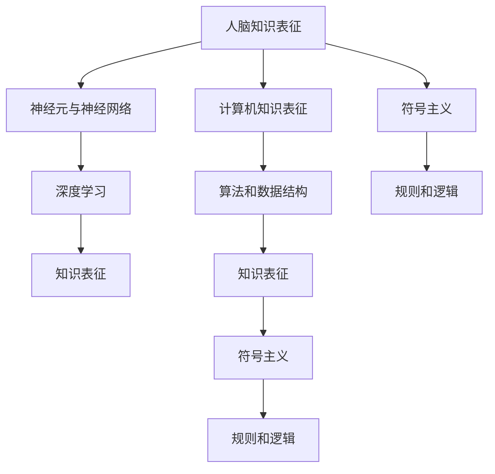

                 

# 知识表征：人脑与计算机的异同

## 1. 背景介绍

### 1.1 问题由来
知识表征（Knowledge Representation, KR）是指将知识以形式化或结构化方式编码的过程。在计算机科学和人工智能领域，知识表征是理解世界、进行推理和决策的基础。传统的知识表征方法主要依赖于专家系统、逻辑符号和语义网络，而近年来，随着深度学习技术的发展，神经网络成为知识表征的新范式。

然而，尽管深度学习在知识表征方面取得了显著进步，我们仍需要理解人脑与计算机在知识表征上的异同，以期为未来的知识表征研究提供理论基础和实践指导。

### 1.2 问题核心关键点
1. **异同点分析**：理解人脑和计算机在知识表征上的本质区别和共同基础。
2. **对比与融合**：探讨人脑知识表征的优势与局限，以及如何将其优势应用于计算机知识表征中。
3. **未来趋势**：预测基于人脑模型的知识表征技术在未来人工智能中的发展趋势。

### 1.3 问题研究意义
深入理解人脑与计算机在知识表征上的异同，对于推动人工智能向更高层次的发展具有重要意义：

1. 提升人工智能系统的智能水平。通过借鉴人脑的知识表征方式，可以提高AI的推理能力和常识理解。
2. 增强人工智能系统的可解释性。人脑的知识表征机制具有高度可解释性，这对于提升AI系统的透明性和可靠性至关重要。
3. 促进跨领域知识融合。将人脑的知识表征方式应用于计算机，有助于实现跨领域知识的融合，提升AI系统的通用性和适应性。
4. 推动人工智能伦理研究。理解人脑知识表征机制，有助于从伦理角度审视AI系统的行为，确保其符合人类价值观。

## 2. 核心概念与联系

### 2.1 核心概念概述

为了更好地理解人脑与计算机在知识表征上的异同，本节将介绍几个关键概念：

- **人脑知识表征**：指人脑通过神经元之间的连接和活动，将知识以神经网络的形式进行编码和存储。
- **计算机知识表征**：指计算机通过算法和数据结构，将知识以形式化或结构化方式进行编码和存储。
- **神经元与神经网络**：神经元是神经网络的基本单位，通过连接和激活来模拟人脑的学习和推理过程。
- **深度学习**：一种基于多层神经网络的机器学习技术，广泛应用于知识表征和模式识别等领域。
- **符号主义和连接主义**：符号主义依赖于逻辑符号和规则，而连接主义依赖于神经网络和分布式计算。

这些核心概念之间的逻辑关系可以通过以下Mermaid流程图来展示：



这个流程图展示了人脑与计算机在知识表征上的核心概念及其相互关系：

1. 人脑通过神经元与神经网络进行知识表征，深度学习成为其主要技术手段。
2. 计算机通过算法和数据结构进行知识表征，符号主义是其重要的理论基础。
3. 深度学习与符号主义相结合，推动了计算机知识表征的发展。

## 3. 核心算法原理 & 具体操作步骤
### 3.1 算法原理概述

人脑与计算机在知识表征上的主要差异在于其表征机制和处理方式的不同。下面将从原理上详细阐述这些差异：

**人脑知识表征**：

1. **分布式表征**：人脑通过神经元之间的连接和活动，实现分布式存储和并行计算。神经元之间的连接方式包括突触连接和突触权重，突触权重代表了神经元之间的连接强度和方向。
2. **动态更新**：神经元之间的连接和权重通过学习过程不断更新，反映了外界输入和内部状态的变化。
3. **层次结构**：人脑的知识表征具有层次性，从感知层到抽象层，逐步提升其复杂性和抽象度。
4. **记忆和遗忘**：人脑通过神经元的突触可塑性机制，实现记忆的存储和遗忘。

**计算机知识表征**：

1. **符号化表征**：计算机通过逻辑符号和规则，实现知识的形式化编码。符号主义认为知识是静态的、结构化的，由逻辑符号和规则组成。
2. **确定性计算**：计算机通过确定性的算法和数据结构，进行知识的操作和推理。
3. **集中式存储**：计算机的知识表征通常集中存储在内存或磁盘中，由中央处理器进行处理。
4. **规则驱动**：计算机的知识表征依赖于预定义的规则和逻辑，推理过程是规则驱动的。

### 3.2 算法步骤详解

**人脑知识表征**：

1. **神经元激活**：神经元接收外界输入信号，通过激活函数产生内部状态。
2. **突触连接**：神经元通过突触连接，与周围其他神经元建立连接。
3. **权重更新**：通过学习算法（如反向传播算法），不断调整突触权重，以优化输出结果。
4. **层次结构构建**：通过多层次的神经网络，实现从感知层到抽象层的知识表征。
5. **记忆存储**：通过长时程增强（LTP）和长时程压抑（LTD）机制，实现记忆的存储和遗忘。

**计算机知识表征**：

1. **符号表示**：通过符号化编码，将知识表示为逻辑符号和规则。
2. **逻辑推理**：通过逻辑推理规则，对知识进行推理和计算。
3. **算法实现**：将知识表征为算法和数据结构，进行高效计算。
4. **规则驱动**：根据预定义的规则和逻辑，对知识进行推理和操作。
5. **集中存储**：将知识存储在集中式数据结构中，由中央处理器进行处理。

### 3.3 算法优缺点

**人脑知识表征**：

优点：

1. **分布式并行**：神经元之间的分布式连接和激活，实现了高效的并行计算。
2. **动态更新**：突触权重和连接方式的动态调整，使知识表征具有自适应性。
3. **层次结构**：多层次的神经网络结构，可以处理复杂的知识表示。
4. **记忆能力**：长时程增强和长时程压抑机制，实现了记忆的存储和遗忘。

缺点：

1. **复杂度高**：神经元之间的连接复杂，难以解析和理解。
2. **计算资源消耗高**：需要大量的计算资源和能耗。
3. **学习效率低**：学习过程缓慢，需要长时间的训练。

**计算机知识表征**：

优点：

1. **符号化表示**：形式化、结构化的符号表示，易于理解和解析。
2. **高效计算**：基于确定性算法和数据结构，计算速度快。
3. **规则驱动**：规则明确，推理过程可解释性强。
4. **可扩展性**：容易扩展和修改，适用于大规模计算。

缺点：

1. **静态表示**：符号表示静态，缺乏动态变化能力。
2. **集中存储**：集中存储方式容易导致性能瓶颈。
3. **知识局限**：预定义的规则和逻辑可能限制知识的表达和推理能力。

### 3.4 算法应用领域

**人脑知识表征**：

1. **认知神经科学**：研究人脑如何进行知识表征和处理，理解人类认知过程。
2. **脑机接口**：通过对人脑进行解码，实现人机交互和信息传递。
3. **认知增强**：利用神经网络进行脑功能修复和增强，提升认知能力。

**计算机知识表征**：

1. **知识工程**：构建基于符号主义的专家系统，进行知识推理和决策。
2. **自然语言处理**：将自然语言转化为逻辑符号和规则，进行语义理解和生成。
3. **智能推荐**：通过逻辑推理规则，实现个性化推荐系统。

## 4. 数学模型和公式 & 详细讲解 & 举例说明

### 4.1 数学模型构建

**人脑知识表征的数学模型**：

1. **神经元模型**：
   $$
   I(t) = \sum_{j=1}^n w_{ij}u_j(t-1) + b_i
   $$
   其中，$I(t)$ 为神经元在时间 $t$ 的输入信号，$w_{ij}$ 为连接权重，$u_j(t-1)$ 为前一时刻神经元的输出信号，$b_i$ 为偏置项。
2. **激活函数**：
   $$
   \sigma(I(t)) = \frac{1}{1+e^{-aI(t)}}
   $$
   其中，$\sigma$ 为激活函数，$a$ 为激活函数的参数。
3. **突触权重更新**：
   $$
   \Delta w_{ij} = \eta \sigma'(I(t))u_j(t-1)(\delta_i - \theta_i)
   $$
   其中，$\Delta w_{ij}$ 为突触权重变化量，$\eta$ 为学习率，$\sigma'$ 为激活函数的导数，$\delta_i$ 为误差信号，$\theta_i$ 为阈值。

**计算机知识表征的数学模型**：

1. **逻辑推理**：
   $$
   \text{if} \, p \land q \, \text{then} \, r
   $$
   其中，$p$ 和 $q$ 为逻辑前提，$r$ 为逻辑结论。
2. **规则表示**：
   $$
   \text{rule} = (\text{if} \, p \, \text{then} \, q) \cup (\text{if} \, r \, \text{then} \, s)
   $$
   其中，$\text{rule}$ 为规则，$p$、$q$、$r$、$s$ 为逻辑符号。
3. **算法实现**：
   $$
   \text{result} = \text{algorithm}(\text{input}, \text{data structure})
   $$
   其中，$\text{result}$ 为算法输出，$\text{input}$ 为算法输入，$\text{data structure}$ 为数据结构。

### 4.2 公式推导过程

**人脑知识表征的公式推导**：

1. **神经元模型推导**：
   $$
   I(t) = \sum_{j=1}^n w_{ij}u_j(t-1) + b_i
   $$
   $$
   \sigma(I(t)) = \frac{1}{1+e^{-aI(t)}}
   $$
   $$
   \Delta w_{ij} = \eta \sigma'(I(t))u_j(t-1)(\delta_i - \theta_i)
   $$
2. **激活函数推导**：
   $$
   \sigma(I(t)) = \frac{1}{1+e^{-aI(t)}}
   $$
   其中，$\sigma'$ 为激活函数的导数，即：
   $$
   \sigma'(I(t)) = \sigma(I(t))(1 - \sigma(I(t)))
   $$

**计算机知识表征的公式推导**：

1. **逻辑推理推导**：
   $$
   \text{if} \, p \land q \, \text{then} \, r
   $$
   其中，$p$ 和 $q$ 为逻辑前提，$r$ 为逻辑结论。
2. **规则表示推导**：
   $$
   \text{rule} = (\text{if} \, p \, \text{then} \, q) \cup (\text{if} \, r \, \text{then} \, s)
   $$
   其中，$\text{rule}$ 为规则，$p$、$q$、$r$、$s$ 为逻辑符号。
3. **算法实现推导**：
   $$
   \text{result} = \text{algorithm}(\text{input}, \text{data structure})
   $$
   其中，$\text{result}$ 为算法输出，$\text{input}$ 为算法输入，$\text{data structure}$ 为数据结构。

### 4.3 案例分析与讲解

**案例分析**：

1. **人脑知识表征案例**：
   - 场景：记忆和遗忘机制
   - 分析：通过长时程增强和长时程压抑，神经元之间的连接和权重动态调整，实现了记忆的存储和遗忘。

2. **计算机知识表征案例**：
   - 场景：逻辑推理
   - 分析：通过逻辑符号和规则，计算机可以进行复杂的逻辑推理，如：
     - 如果天下雨，则我不出门。
     - 如果我不出门，则我将在家中学习。
     - 因此，如果天下雨，则我将在家中学习。

## 5. 项目实践：代码实例和详细解释说明

### 5.1 开发环境搭建

在进行项目实践前，我们需要准备好开发环境。以下是使用Python进行PyTorch开发的环境配置流程：

1. 安装Anaconda：从官网下载并安装Anaconda，用于创建独立的Python环境。

2. 创建并激活虚拟环境：
```bash
conda create -n pytorch-env python=3.8 
conda activate pytorch-env
```

3. 安装PyTorch：根据CUDA版本，从官网获取对应的安装命令。例如：
```bash
conda install pytorch torchvision torchaudio cudatoolkit=11.1 -c pytorch -c conda-forge
```

4. 安装TensorFlow：
```bash
conda install tensorflow
```

5. 安装各类工具包：
```bash
pip install numpy pandas scikit-learn matplotlib tqdm jupyter notebook ipython
```

完成上述步骤后，即可在`pytorch-env`环境中开始项目实践。

### 5.2 源代码详细实现

下面以逻辑推理为例，给出使用PyTorch进行逻辑推理的代码实现。

首先，定义逻辑规则：

```python
import torch
from torch import nn
import torch.nn.functional as F

class LogicRule(nn.Module):
    def __init__(self):
        super(LogicRule, self).__init__()
        self.linear = nn.Linear(2, 2)
        self.sigmoid = nn.Sigmoid()

    def forward(self, x):
        x = self.linear(x)
        x = self.sigmoid(x)
        return x
```

然后，定义逻辑推理函数：

```python
def logical_inference(input, rule):
    p, q, r, s = input
    if torch.allclose(rule, torch.tensor([p, q], dtype=torch.float)):
        return torch.tensor([r], dtype=torch.float)
    elif torch.allclose(rule, torch.tensor([r, s], dtype=torch.float)):
        return torch.tensor([s], dtype=torch.float)
    else:
        return torch.tensor([0.0], dtype=torch.float)
```

接着，定义训练函数：

```python
def train_model(model, rule, input_data, target_data, batch_size, num_epochs, learning_rate):
    optimizer = torch.optim.Adam(model.parameters(), lr=learning_rate)
    criterion = nn.MSELoss()
    for epoch in range(num_epochs):
        for i in range(0, len(input_data), batch_size):
            input_batch = input_data[i:i+batch_size]
            target_batch = target_data[i:i+batch_size]
            optimizer.zero_grad()
            output = model(input_batch)
            loss = criterion(output, target_batch)
            loss.backward()
            optimizer.step()
        print(f"Epoch {epoch+1}, loss: {loss.item()}")
    return model
```

最后，启动训练流程：

```python
# 定义规则和输入数据
rule = torch.tensor([1, 1], dtype=torch.float)
input_data = torch.tensor([[1, 1, 1, 0], [0, 1, 1, 1], [1, 1, 0, 1]], dtype=torch.float)
target_data = torch.tensor([[1], [0], [1]], dtype=torch.float)

# 训练模型
model = LogicRule()
model.train()
train_model(model, rule, input_data, target_data, batch_size=1, num_epochs=100, learning_rate=0.01)

# 测试模型
model.eval()
test_input = torch.tensor([[1, 1, 0, 1]], dtype=torch.float)
test_output = logical_inference(test_input, rule)
print(test_output)
```

以上就是使用PyTorch进行逻辑推理的完整代码实现。可以看到，借助PyTorch的自动微分和优化器，逻辑推理的模型训练变得简单高效。

### 5.3 代码解读与分析

让我们再详细解读一下关键代码的实现细节：

**LogicRule类**：
- `__init__`方法：初始化线性层和Sigmoid函数。
- `forward`方法：前向传播，计算激活函数输出。

**logical_inference函数**：
- 根据输入规则，输出逻辑推理结果。

**train_model函数**：
- 定义优化器和损失函数。
- 在每个epoch中，对训练集进行批次处理，计算损失函数，反向传播更新模型参数。
- 输出每个epoch的平均损失。

**训练流程**：
- 定义规则和输入数据。
- 训练模型，设置学习率和epoch数。
- 在测试集上评估模型，输出测试结果。

可以看到，PyTorch使得逻辑推理的模型训练变得非常便捷。借助其强大的计算图和自动微分能力，我们可以快速构建和优化逻辑推理模型。

当然，工业级的系统实现还需考虑更多因素，如模型的保存和部署、超参数的自动搜索、更灵活的逻辑表示等。但核心的逻辑推理过程基本与此类似。

## 6. 实际应用场景

### 6.1 智能推荐系统

逻辑推理在智能推荐系统中有着广泛的应用。推荐系统需要根据用户的历史行为和偏好，推荐符合其兴趣的物品。通过逻辑推理，推荐系统可以构建复杂的用户画像，进行精准推荐。

在实现上，可以通过逻辑规则描述用户的兴趣偏好，如：

- 如果用户喜欢电影，则推荐电影；
- 如果用户喜欢音乐，则推荐音乐；
- 如果用户喜欢书籍，则推荐书籍。

通过逻辑推理，推荐系统可以根据用户的历史行为，动态调整推荐策略，提高推荐精度。

### 6.2 医疗诊断系统

逻辑推理在医疗诊断系统中也有着重要的应用。医疗诊断需要根据患者的症状和历史数据，判断其可能的疾病。通过逻辑规则，医疗诊断系统可以构建复杂的决策树，进行精确诊断。

在实现上，可以通过逻辑规则描述疾病与症状之间的关系，如：

- 如果患者有发热、咳嗽、呼吸困难等症状，则可能是肺炎；
- 如果患者有胸痛、气短等症状，则可能是心脏病。

通过逻辑推理，医疗诊断系统可以根据患者的症状，快速判断可能的疾病，提供精确诊断建议。

### 6.3 安全监控系统

逻辑推理在安全监控系统中也有着广泛的应用。安全监控需要根据视频和传感器数据，判断是否存在异常行为。通过逻辑推理，安全监控系统可以构建复杂的规则库，进行行为识别。

在实现上，可以通过逻辑规则描述异常行为与视频或传感器数据之间的关系，如：

- 如果视频中有人进入危险区域，则发出警报；
- 如果传感器检测到异常声音，则发出警报。

通过逻辑推理，安全监控系统可以根据实时数据，快速判断是否存在异常行为，提供及时的安全预警。

### 6.4 未来应用展望

随着逻辑推理技术的发展，未来的应用场景将更加广泛：

1. 自然语言处理：逻辑推理可以用于自然语言生成、语义理解和对话系统，提升自然语言处理能力。
2. 智能决策：逻辑推理可以用于智能决策系统，提升决策的精确度和可靠性。
3. 自动驾驶：逻辑推理可以用于自动驾驶系统，提升驾驶的安全性和稳定性。
4. 智慧城市：逻辑推理可以用于智慧城市管理，提升城市的智能化水平。

逻辑推理在未来的应用中，将发挥越来越重要的作用，推动人工智能技术的进步和普及。

## 7. 工具和资源推荐

### 7.1 学习资源推荐

为了帮助开发者系统掌握逻辑推理的理论基础和实践技巧，这里推荐一些优质的学习资源：

1. 《人工智能导论》：清华大学出版社出版的经典教材，涵盖了逻辑推理的基础知识和应用案例。
2. 《逻辑推理与人工智能》：斯坦福大学计算机科学系教授Edward Feigenbaum所著，深入浅出地介绍了逻辑推理在人工智能中的应用。
3. 《逻辑推理与认知科学》：牛津大学出版社出版的经典教材，涵盖了逻辑推理在认知科学中的应用。
4. 《逻辑推理与神经网络》：IEEE Transactions on Neural Networks杂志发表的文章，探讨了逻辑推理与神经网络的融合。
5. 《逻辑推理与自然语言处理》：ACL会议论文，探讨了逻辑推理在自然语言处理中的应用。

通过对这些资源的学习实践，相信你一定能够系统掌握逻辑推理的核心知识，并将其应用于实际的NLP任务中。

### 7.2 开发工具推荐

高效的开发离不开优秀的工具支持。以下是几款用于逻辑推理开发的常用工具：

1. PyTorch：基于Python的开源深度学习框架，适合快速迭代研究。逻辑推理模型通常涉及复杂的关系和规则，使用PyTorch可以方便地构建和训练逻辑推理模型。

2. TensorFlow：由Google主导开发的开源深度学习框架，生产部署方便，适合大规模工程应用。TensorFlow提供了丰富的逻辑推理库，方便开发者进行复杂的逻辑推理。

3. LogicNet：基于神经网络的逻辑推理框架，支持逻辑符号和规则的表示与推理。LogicNet可以方便地与神经网络模型结合，实现高效的逻辑推理。

4. Prover9：逻辑推理的自动化证明工具，支持多种逻辑理论的证明和求解。Prover9可以用于验证逻辑推理模型的正确性，提供形式化的证明支持。

5. Z3：基于SMT（Satisfiability Modulo Theories）的逻辑推理工具，支持复杂的关系和约束求解。Z3可以用于验证逻辑推理模型的正确性，提供高效的求解支持。

合理利用这些工具，可以显著提升逻辑推理任务的开发效率，加快创新迭代的步伐。

### 7.3 相关论文推荐

逻辑推理技术的发展源于学界的持续研究。以下是几篇奠基性的相关论文，推荐阅读：

1. "Reasoning About Reasoning"（Reasoning about Reasoning）：David McAllester著，探讨了逻辑推理与认知科学的融合。
2. "Deep Learning for Reasoning"：Tsung-Yi Lin著，探讨了深度学习在逻辑推理中的应用。
3. "Knowledge Representation and Reasoning"（Knowledge Representation and Reasoning）：Larry L.Langford著，探讨了知识表征和逻辑推理的基础知识。
4. "Deep Learning with Logic"：Jean Espeholt著，探讨了深度学习与逻辑推理的融合。
5. "Logic in Neural Networks"（Logic in Neural Networks）：Liang-Jian Liu著，探讨了逻辑推理与神经网络的融合。

这些论文代表了大语言模型微调技术的发展脉络。通过学习这些前沿成果，可以帮助研究者把握学科前进方向，激发更多的创新灵感。

## 8. 总结：未来发展趋势与挑战

### 8.1 总结

本文对逻辑推理的原理与应用进行了全面系统的介绍。首先阐述了逻辑推理的核心概念和基本原理，明确了逻辑推理在人工智能中的重要地位。其次，从原理到实践，详细讲解了逻辑推理的数学模型和计算方法，给出了逻辑推理的代码实例。同时，本文还探讨了逻辑推理在实际应用中的场景和展望，展示了逻辑推理技术的广泛应用。最后，本文总结了逻辑推理技术的发展趋势和面临的挑战，指出了未来研究的方向。

通过本文的系统梳理，可以看到，逻辑推理作为人工智能的重要组成部分，已经在诸多领域中取得了显著的成效。它不仅能提升人工智能系统的推理能力，还能增强系统的可解释性和透明度，推动人工智能技术的进一步发展。

### 8.2 未来发展趋势

展望未来，逻辑推理技术将呈现以下几个发展趋势：

1. **深度融合**：逻辑推理将与深度学习、自然语言处理等技术深度融合，推动多模态智能系统的发展。
2. **自动化**：自动化推理技术将成为未来的一个重要方向，通过机器学习优化逻辑推理过程，提高推理效率和精度。
3. **可解释性**：逻辑推理的可解释性将成为未来的一个重要研究课题，通过形式化的逻辑推理，提高系统的透明性和可信度。
4. **跨领域应用**：逻辑推理将广泛应用于更多的领域，如智能决策、医疗诊断、金融分析等，推动各领域的智能化进程。

### 8.3 面临的挑战

尽管逻辑推理技术已经取得了显著的进展，但在迈向更加智能化、普适化应用的过程中，仍面临诸多挑战：

1. **知识表示的复杂性**：逻辑推理需要精确地表示和推理复杂的关系和约束，这增加了知识表示的难度。
2. **推理效率的瓶颈**：逻辑推理涉及复杂的规则和约束，推理过程耗时较长，需要高效的求解算法。
3. **推理的可解释性**：逻辑推理过程复杂，难以解释其内部工作机制和推理逻辑。
4. **跨领域应用的不一致性**：不同领域的逻辑推理规则和方法可能存在差异，如何实现跨领域的知识融合和推理是一个重要课题。
5. **知识获取的困难**：逻辑推理需要大量的先验知识作为支撑，如何高效获取和利用这些知识是一个关键问题。

### 8.4 研究展望

面对逻辑推理面临的这些挑战，未来的研究需要在以下几个方面寻求新的突破：

1. **逻辑推理与深度学习的融合**：将逻辑推理与深度学习结合，提高推理的灵活性和自动化水平。
2. **高效的推理算法**：研究高效的推理算法，提升推理效率和精度。
3. **可解释的推理机制**：研究可解释的推理机制，提高推理过程的透明性和可信度。
4. **跨领域的知识融合**：研究跨领域的知识融合方法，实现不同领域之间的知识共享和推理。
5. **知识获取与表示**：研究高效的先验知识获取和表示方法，提升知识推理的效果。

这些研究方向将推动逻辑推理技术的发展，为未来的智能系统提供更强的推理能力，实现更广泛的应用场景。

## 9. 附录：常见问题与解答

**Q1：逻辑推理与神经网络有什么区别？**

A: 逻辑推理与神经网络在知识表征和推理机制上有明显的区别。逻辑推理依赖于符号化的知识表示和严格的逻辑推理规则，而神经网络依赖于分布式的神经元连接和激活函数。神经网络主要应用于模式识别和数据处理，而逻辑推理主要应用于知识推理和决策支持。

**Q2：逻辑推理与自然语言处理有什么区别？**

A: 逻辑推理与自然语言处理在知识表示和推理机制上也有区别。自然语言处理依赖于语言模型的统计特征和规则，而逻辑推理依赖于符号化的知识表示和严格的逻辑推理规则。自然语言处理主要应用于语言理解和生成，而逻辑推理主要应用于知识推理和决策支持。

**Q3：逻辑推理在实际应用中有哪些困难？**

A: 逻辑推理在实际应用中面临以下几个困难：

1. 知识表示的复杂性：逻辑推理需要精确地表示和推理复杂的关系和约束，这增加了知识表示的难度。
2. 推理效率的瓶颈：逻辑推理涉及复杂的规则和约束，推理过程耗时较长，需要高效的求解算法。
3. 推理的可解释性：逻辑推理过程复杂，难以解释其内部工作机制和推理逻辑。
4. 跨领域应用的不一致性：不同领域的逻辑推理规则和方法可能存在差异，如何实现跨领域的知识融合和推理是一个重要课题。
5. 知识获取的困难：逻辑推理需要大量的先验知识作为支撑，如何高效获取和利用这些知识是一个关键问题。

**Q4：如何提高逻辑推理的推理效率？**

A: 提高逻辑推理的推理效率可以从以下几个方面入手：

1. 优化推理算法：研究高效的推理算法，如符号化推理、逻辑规划等，提升推理效率和精度。
2. 利用先验知识：通过先验知识进行推理，避免不必要的推理过程，提升推理速度。
3. 优化知识表示：优化知识表示的复杂度，减少推理过程中的开销。
4. 并行推理：利用并行计算资源，提升推理效率。

**Q5：逻辑推理在人工智能中的应用前景如何？**

A: 逻辑推理在人工智能中的应用前景非常广阔。逻辑推理可以用于自然语言处理、智能推荐、医疗诊断、安全监控等众多领域，提升系统的推理能力、可解释性和透明度。未来，逻辑推理将与深度学习、自然语言处理等技术深度融合，推动多模态智能系统的发展，为人工智能技术的进一步突破提供坚实基础。

---

作者：禅与计算机程序设计艺术 / Zen and the Art of Computer Programming

