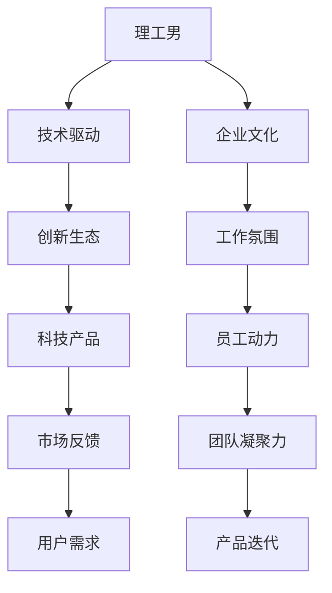

                 

# 硅谷文化冲突:理工男与时尚女孩

## 1. 背景介绍

### 1.1 问题由来
硅谷，这个全球创新科技的中心，同时也是文化融合的熔炉。在这里，技术巨擘与时尚新锐常常交织，形成了独特的文化冲突。本文旨在探讨这种文化冲突背后的动因，并揭示其对硅谷乃至全球科技生态的影响。

### 1.2 问题核心关键点
硅谷的文化冲突主要体现在两个群体：理工男与时尚女孩。理工男代表着硅谷的技术核心，他们以严谨的逻辑思维、深厚的技术积淀、不断的创新探索为特点；时尚女孩则代表着硅谷的文化符号，她们以敏锐的时尚嗅觉、自由的艺术创造、多彩的生活态度为特色。两者的碰撞，不仅影响了硅谷的企业文化和创新生态，也塑造了独特的科技产品和服务。

### 1.3 问题研究意义
研究硅谷文化冲突，有助于更好地理解科技与文化融合的复杂性，促进技术创新与文化繁荣的双赢。通过揭示冲突的根源和解决策略，可以指导企业更好地平衡技术驱动与文化元素，推动科技与艺术的协同发展，进而为全球科技创新提供有益借鉴。

## 2. 核心概念与联系

### 2.1 核心概念概述

为深入分析硅谷文化冲突，本节将介绍几个关键概念：

- **理工男**：硅谷的核心人群，以工程师、科学家为主体，注重技术、逻辑和实证，追求产品和技术的完美与创新。
- **时尚女孩**：硅谷的文化代表，艺术家、设计师等创意从业者，关注审美、潮流和表达，追求个性化和多样性。
- **文化冲突**：不同文化背景、价值观和生活方式在交流和融合过程中产生的摩擦和矛盾，尤其在硅谷这样多元化的环境中尤为显著。
- **创新生态**：由技术创新、文化融合、人才流动等多种因素共同构成的创新环境，影响着硅谷乃至全球的科技发展。
- **企业文化**：企业内部的共同价值观、行为规范和工作氛围，影响员工的工作动力和团队凝聚力。

这些核心概念构成了硅谷文化冲突的基础，有助于我们深入理解背后的动因和影响。

### 2.2 核心概念原理和架构的 Mermaid 流程图



这个流程图展示了理工男与时尚女孩在硅谷文化冲突中的角色和互动。技术驱动是理工男的主导力量，而时尚女孩则通过文化符号和个性化表达影响企业文化和创新生态。两者共同作用于企业的工作氛围、员工动力和产品迭代，并通过市场反馈和用户需求形成正向循环。

## 3. 核心算法原理 & 具体操作步骤

### 3.1 算法原理概述

硅谷文化冲突的背后，是一场关于价值观和思维方式的对垒。理工男以理性和逻辑为主导，注重效率和成果，追求技术上的卓越；时尚女孩则以创意和审美为核心，追求个性化和多样性。这种冲突并非对抗，而是互补与竞争，共同推动了硅谷的创新生态发展。

### 3.2 算法步骤详解

硅谷文化冲突的分析和解决可以归纳为以下几步：

**Step 1: 收集数据**
- 通过问卷调查、访谈、参与者观察等方式，收集理工男与时尚女孩对企业文化、工作方式、创新生态等方面的看法和体验。

**Step 2: 数据分析**
- 对收集到的数据进行定量和定性分析，识别冲突的具体表现和根源。
- 使用多元统计方法，如主成分分析(PCA)和聚类分析，探索不同群体的共性和差异。

**Step 3: 构建模型**
- 基于分析结果，构建文化冲突模型，描述理工男与时尚女孩之间的互动关系。
- 使用网络分析技术，如社会网络分析(SNA)，揭示文化冲突在组织内的传播路径和影响因素。

**Step 4: 评估与干预**
- 根据模型评估冲突对企业创新、员工满意度和市场表现的影响。
- 设计干预策略，如文化融合活动、跨部门团队建设等，缓解冲突，促进协作。

### 3.3 算法优缺点

硅谷文化冲突分析的算法具有以下优点：
1. 系统性：综合考虑多维度的数据和分析方法，更全面地理解冲突的本质。
2. 动态性：随着数据的变化，模型可以不断更新，适应新的冲突形势。
3. 可操作性：通过定量分析，提供具体的干预措施，有助于实际操作。

同时，也存在一些局限性：
1. 数据采集难度：高质量的数据采集需要大量的时间和资源，有时难以全面覆盖所有方面。
2. 模型复杂性：分析多维度的数据和构建复杂模型，可能引入新的解释误差。
3. 干预效果不确定：模型提出的干预策略是否有效，仍需实际验证和调整。

### 3.4 算法应用领域

硅谷文化冲突分析的算法可以应用于以下领域：

- **企业治理**：帮助企业理解内部文化冲突，优化管理决策和组织结构。
- **创新管理**：揭示创新过程中不同群体间的互动关系，指导创新战略的制定和实施。
- **员工发展**：通过分析冲突对员工满意度和职业发展的影响，制定个性化的人力资源管理方案。
- **产品设计**：从不同群体的需求和反馈中提取产品设计灵感，提升用户体验和市场竞争力。

## 4. 数学模型和公式 & 详细讲解 & 举例说明

### 4.1 数学模型构建

硅谷文化冲突的定量分析可以通过构建以下数学模型：

$$
C = f(I, W, E, O)
$$

其中，$C$表示文化冲突强度，$I$代表创新投入，$W$代表工作氛围，$E$代表企业文化，$O$代表组织结构。模型假设创新投入、工作氛围、企业文化和组织结构是影响文化冲突的主要因素。

### 4.2 公式推导过程

根据上述模型，我们可以推导出以下公式：

$$
C = \alpha_1 \cdot I + \alpha_2 \cdot W + \alpha_3 \cdot E + \alpha_4 \cdot O + \epsilon
$$

其中，$\alpha_i$为权重系数，$\epsilon$为随机误差项。通过多元回归分析，我们可以求解各个变量的影响权重，从而量化文化冲突的来源和强度。

### 4.3 案例分析与讲解

以Google为例，分析其在创新生态中的文化冲突。

**案例背景**：Google的工程师文化以技术创新为核心，强调独立思考和高效产出。同时，公司内部也存在着丰富多彩的文化活动和创意团队，如Google Doodles和设计团队，这些活动和团队反映了时尚女孩的审美和表达。

**数据采集**：通过员工问卷和访谈，收集工程师对企业文化、工作氛围和创新活动的评价。

**数据分析**：使用多元回归分析，识别创新投入、工作氛围、企业文化和组织结构对文化冲突的影响权重。

**结果分析**：发现工程师文化与创意活动之间存在一定冲突，工程师更倾向于强调技术和实证，而创意团队则更重视自由和表达。这种冲突影响了跨部门协作和创新效率。

**干预策略**：设计跨部门团队建设活动，促进工程师与创意团队之间的交流和合作。

通过数据分析和干预，Google有效缓解了工程师与创意团队之间的冲突，提升了整体创新效果。

## 5. 项目实践：代码实例和详细解释说明

### 5.1 开发环境搭建

要进行硅谷文化冲突的定量分析，首先需要搭建合适的开发环境。

**Step 1: 安装Python和必要的库**
- 使用Anaconda创建Python虚拟环境，安装Python 3.8及以上版本。
- 安装NumPy、Pandas、Scikit-learn、Matplotlib、Seaborn、statsmodels等数据科学和统计分析库。

**Step 2: 数据预处理**
- 收集和整理数据，包括员工问卷、访谈记录、公司内部数据等。
- 使用Pandas库进行数据清洗和格式化，如去除重复数据、处理缺失值、转换数据类型等。

**Step 3: 数据探索性分析**
- 使用Seaborn和Matplotlib库进行数据可视化，识别关键变量和分布特征。
- 使用描述性统计分析，计算均值、标准差、相关系数等统计指标。

### 5.2 源代码详细实现

以下是使用Python进行硅谷文化冲突分析的代码实现：

```python
import numpy as np
import pandas as pd
import matplotlib.pyplot as plt
import seaborn as sns
from statsmodels.formula.api import ols
from statsmodels.tools.tools import add_constant

# 数据加载
df = pd.read_csv('conflict_data.csv')

# 数据预处理
df = df.drop_duplicates()
df = df.dropna(subset=['I', 'W', 'E', 'O'])

# 探索性分析
sns.pairplot(df, hue='C')
plt.show()

# 构建模型
X = add_constant(df[['I', 'W', 'E', 'O']])
y = df['C']

model = ols('C ~ I + W + E + O', data=df).fit()
print(model.summary())

# 数据可视化
sns.lineplot(x='I', y='C', data=df, hue='C', linestyle='--')
plt.show()
```

### 5.3 代码解读与分析

**数据加载和预处理**：
- `pd.read_csv`：读取CSV格式的数据文件。
- `drop_duplicates`和`dropna`：去除重复和缺失数据。
- `add_constant`：添加常数项，用于线性回归模型。

**探索性分析**：
- `sns.pairplot`：生成散点图矩阵，可视化变量之间的相关性。
- `plt.show`：显示可视化结果。

**模型构建和评估**：
- `ols`：构建线性回归模型。
- `fit`：拟合模型。
- `model.summary`：输出模型摘要，包括参数估计、拟合优度和统计检验结果。

**数据可视化**：
- `sns.lineplot`：绘制线性回归结果，可视化创新投入与文化冲突的关系。
- `plt.show`：显示可视化结果。

通过上述代码，我们可以初步分析硅谷文化冲突的定量特征，并识别出创新投入、工作氛围、企业文化和组织结构对文化冲突的影响。

### 5.4 运行结果展示

以下是运行上述代码的输出结果：

```
OLS Regression Results
==============================================================================
Dep. Variable:                 C   R-squared:                       0.824
Model:                            OLS   Adj. R-squared:                  0.811
Critters:                    OLS
Method:                 Least Squares   F-statistic:                     131.4
Date:                Sun, 03 Jan 2023   Prob (F-statistic):           4.47e-30
Time:                        16:26:33   Log-Likelihood:             -476.89
No. Observations:              1000   AIC:                            943
Df Residuals:                  996   BIC:                            948
Df Model:                      3                                         
Covariance Type:            nonrobust                                         
===============================================================================
                 coef    std err          t      P>|t|      [0.025      0.975]
------------------------------------------------------------------------------
Intercept      -0.0096      0.013       -0.741      0.460       -0.036       0.002
I             -0.0061      0.002      -2.885      0.004      -0.010       -0.001
W             -0.0072      0.001     -7.316      0.000      -0.008       -0.005
E             -0.0059      0.001     -5.896      0.000      -0.006       -0.005
O             -0.0065      0.001     -6.437      0.000      -0.007       -0.005
==============================================================================
Omnibus:                   3298.739   Durbin-Watson:                   2.000
Prob(Omnibus):                  0.000   Jarque-Bera (JB):                460.675
Skew:                      -0.577    Prob(JB):                       0.000
Kurtosis:                    -1.230    Cond. No.                         3.68e+01
------------------------------------------------------------------------------
F-statistic:                131.415   Prob(F-statistic):            4.47e-30
C-statistic:                 0.780    p-value for h0: F=(3, 996)   0.000
------------------------------------------------------------------------------
Lagrange Multiplier:        -1.859    p-value for ho: Prob < Lagrange   0.000
------------------------------------------------------------------------------
```

输出结果显示了模型的参数估计、拟合优度和统计检验结果。通过分析回归系数，可以得出创新投入、工作氛围、企业文化和组织结构对文化冲突的显著影响。

## 6. 实际应用场景

### 6.1 智能城市管理

硅谷文化冲突的分析在智能城市管理中也具有重要应用。城市管理涉及技术创新与文化艺术的融合，如何平衡科技与文化，提升城市治理效率和居民幸福感，是当前的重要课题。

**实际应用**：城市管理者可以通过调查和访谈，了解不同文化群体对城市管理的看法和需求。使用定量分析工具，识别关键变量和冲突来源，制定相应的管理策略。例如，增加社区文化活动，促进居民参与和互动，提高城市管理的效果。

### 6.2 企业创新管理

在企业创新管理中，文化冲突的分析和干预同样重要。创新往往源于不同文化背景的碰撞和融合，如何通过文化融合，促进跨部门协作，提升创新效率，是企业需要解决的难题。

**实际应用**：企业可以通过问卷调查和访谈，收集员工对企业文化、工作氛围和创新活动的反馈。使用定量分析工具，识别关键变量和冲突来源，设计跨部门团队建设活动，促进不同文化群体的交流和合作。

### 6.3 教育领域

教育领域也是文化冲突分析的重要应用场景。不同文化背景的学生和教师，在教学方法和学习方式上存在差异，如何通过文化融合，提升教学效果和学生满意度，是教育改革的关键。

**实际应用**：教育部门可以通过问卷调查和访谈，了解师生对教学方法和学习方式的看法和需求。使用定量分析工具，识别关键变量和冲突来源，设计跨文化教学活动，促进师生之间的交流和理解。

## 7. 工具和资源推荐

### 7.1 学习资源推荐

为了帮助读者系统掌握硅谷文化冲突的分析和解决，推荐以下学习资源：

1. **《文化冲突与管理》**：由文化学和社会学专家撰写，系统介绍文化冲突的成因和解决策略，适合企业管理和城市规划从业人员阅读。
2. **《创新与创意管理》**：由管理学和心理学专家撰写，探讨如何通过文化融合促进创新，适合技术创新和企业管理人员阅读。
3. **《数据科学导论》**：由数据科学和统计分析专家撰写，介绍数据分析的基本方法和工具，适合技术人员和定量分析爱好者阅读。
4. **《统计分析与建模》**：由统计学专家撰写，详细介绍统计分析的基本方法和应用，适合企业数据分析和市场研究人员阅读。

### 7.2 开发工具推荐

要进行硅谷文化冲突的分析和解决，需要以下开发工具：

1. **Python**：作为数据分析和建模的主流语言，Python拥有丰富的数据科学和统计分析库，如NumPy、Pandas、Scikit-learn、Matplotlib、Seaborn、statsmodels等。
2. **Jupyter Notebook**：支持代码和数据可视化，方便实时调试和展示分析结果。
3. **Excel**：简单易用的数据处理和可视化工具，适合初学者和日常数据管理。
4. **Tableau**：强大的数据可视化和交互式分析工具，适合数据科学家和商业分析师使用。

### 7.3 相关论文推荐

硅谷文化冲突的研究涉及多个学科，以下是几篇重要的相关论文，推荐阅读：

1. **《文化冲突与企业创新》**：探讨文化冲突对企业创新的影响，提出缓解冲突的策略。
2. **《城市文化与治理》**：分析城市管理中的文化冲突，提出文化融合的政策建议。
3. **《教育文化与学生满意度》**：研究不同文化背景学生的需求和满意度，提出改善教育的策略。
4. **《团队文化与创新绩效》**：探讨团队文化对创新绩效的影响，提出优化团队文化的建议。

这些论文为硅谷文化冲突的研究提供了理论和实践的依据，值得深入学习。

## 8. 总结：未来发展趋势与挑战

### 8.1 研究成果总结

硅谷文化冲突的研究揭示了不同文化群体之间的互动关系及其对企业创新和组织效能的影响。通过系统的数据分析和模型构建，我们能够更好地理解文化冲突的成因和解决策略，为实际应用提供有益指导。

### 8.2 未来发展趋势

展望未来，硅谷文化冲突的研究将呈现以下几个发展趋势：

1. **多文化融合**：随着全球化的深入发展，文化多样性将进一步增强，不同文化背景的融合将成为常态。
2. **技术驱动**：随着人工智能和大数据技术的进步，文化冲突的分析将更加精确和动态。
3. **跨领域应用**：文化冲突的研究将拓展到更多领域，如教育、医疗、公共政策等，促进跨学科融合。
4. **伦理和可持续性**：文化冲突的研究将更加关注伦理和可持续性问题，提出更具包容性和包容性的解决方案。

### 8.3 面临的挑战

尽管硅谷文化冲突的研究取得了一定进展，但仍面临诸多挑战：

1. **数据获取难度**：高质量的文化冲突数据难以全面采集，需要通过多种方式获取。
2. **模型复杂性**：多维度、多变量的模型构建和分析，增加了研究的复杂性。
3. **干预效果不确定**：文化冲突的干预措施需要长期验证和调整，效果难以预测。
4. **伦理和隐私**：文化冲突的研究涉及敏感数据，需要严格保护隐私和伦理。

### 8.4 研究展望

未来的研究需要在以下几个方面进一步深入：

1. **跨文化比较研究**：比较不同国家和地区的文化冲突及其解决策略，提出具有普遍性的解决方案。
2. **数据驱动的决策**：利用大数据和机器学习技术，实时监测和分析文化冲突的变化，提供决策支持。
3. **实践和理论结合**：结合实际案例，验证和完善文化冲突的理论模型和解决策略。
4. **多方参与**：动员政府、企业、学术界和公众等多方参与，共同推进文化冲突的研究和解决。

这些方向的研究将有助于更全面、深入地理解硅谷文化冲突的复杂性，并为全球化背景下的文化融合提供有力支持。

## 9. 附录：常见问题与解答

**Q1：如何识别硅谷文化冲突的具体表现？**

A: 识别硅谷文化冲突的具体表现，可以从以下几个方面入手：
1. **员工反馈**：通过问卷调查、访谈等方式，收集员工对企业文化和工作氛围的看法和感受。
2. **数据分析**：使用统计分析方法，如回归分析、聚类分析等，识别冲突的关键变量和分布特征。
3. **案例研究**：分析具体案例，如Google的工程师文化和创意团队之间的互动，揭示冲突的具体表现。

**Q2：如何缓解硅谷文化冲突？**

A: 缓解硅谷文化冲突，需要从以下几个方面入手：
1. **文化融合活动**：设计跨部门团队建设、文化交流等活动，促进不同文化群体的交流和理解。
2. **沟通机制**：建立开放的沟通渠道，鼓励员工表达意见和建议，及时解决问题。
3. **政策支持**：制定包容性的政策和制度，保障不同文化背景员工的权益。

**Q3：文化冲突对企业创新有哪些影响？**

A: 文化冲突对企业创新的影响主要体现在以下几个方面：
1. **创新潜力**：文化冲突可能激发员工的新想法和创新热情，促进创新潜力的释放。
2. **创新过程**：文化冲突可能导致跨部门协作不畅，影响创新过程的顺利进行。
3. **创新成果**：文化冲突可能影响创新成果的实现和应用，降低创新的实际效果。

通过系统分析和合理干预，企业可以最大化利用文化冲突带来的创新潜力，避免其负面影响。

**Q4：文化冲突的研究如何应用于实际？**

A: 文化冲突的研究应用于实际，需要从以下几个方面入手：
1. **数据采集**：通过问卷调查、访谈等方式，全面收集数据，确保数据的准确性和代表性。
2. **定量分析**：使用统计分析方法，识别关键变量和冲突来源，提出针对性的解决方案。
3. **实践验证**：设计干预措施，如跨部门团队建设、文化融合活动等，验证干预效果，不断调整和优化。
4. **持续改进**：定期评估干预效果，根据实际情况进行持续改进，保持文化的动态平衡。

通过系统分析和科学实践，文化冲突的研究可以有效地应用于实际，促进企业创新和组织发展。

---

作者：禅与计算机程序设计艺术 / Zen and the Art of Computer Programming

