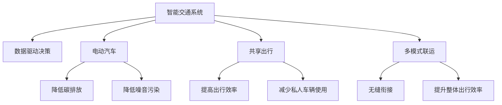

                 

# 硅谷的交通拥堵:创新出行解决方案

> 关键词：交通拥堵,创新出行,智能交通系统,数据驱动,电动汽车,共享出行,多模式联运

## 1. 背景介绍

硅谷，全球科技创新的发源地，引领着互联网、人工智能、生物技术等诸多领域的最新潮流。然而，这个技术中心近年来也面临着严重的交通拥堵问题。人口密集、车流量巨大，加之城市规划与经济发展之间的矛盾，使得硅谷的交通问题愈发凸显。据统计，硅谷每天约有24万个通勤汽车，而道路容量却仅为2.4万个，拥堵指数高达2.6，远超美国其他城市。

### 1.1 问题由来
交通拥堵不仅造成时间和经济上的巨大损失，也严重影响了硅谷居民的生活质量和工作效率。此外，交通拥堵还加剧了空气污染和温室气体排放，对环境产生了负面影响。解决硅谷的交通拥堵问题，不仅是提升居民生活质量的迫切需求，也是科技公司推动可持续发展的重要举措。

### 1.2 问题核心关键点
解决硅谷交通拥堵的核心关键点在于：
- 如何通过科技手段高效分配交通资源，减少车辆拥堵。
- 如何整合多种出行方式，提升整体交通效率。
- 如何利用大数据和人工智能技术，预测和缓解交通高峰。
- 如何推广低碳出行，减少对环境的影响。

这些关键点共同构成了硅谷交通管理者的主要挑战，也激发了科技界对创新出行解决方案的探索。

## 2. 核心概念与联系

### 2.1 核心概念概述

为更好地理解硅谷交通拥堵的解决策略，本节将介绍几个密切相关的核心概念：

- **智能交通系统**：利用先进的信息技术、数据通信技术和现代控制技术，实现交通系统自动化、信息化和智能化管理。
- **数据驱动决策**：基于大数据和人工智能技术，对交通流量、拥堵状况进行实时监测和分析，以数据为基础，做出科学的决策。
- **电动汽车**：使用电力驱动的汽车，相比传统汽车在降低碳排放、噪音污染方面具有明显优势。
- **共享出行**：通过共享单车、汽车等出行方式，减少私人车辆的使用，提高出行效率。
- **多模式联运**：将公交、地铁、共享单车等多种出行方式有机结合，实现无缝衔接，提升整体出行效率。

这些核心概念之间的逻辑关系可以通过以下Mermaid流程图来展示：



这个流程图展示了一些核心概念及其之间的关系：

1. 智能交通系统通过数据驱动决策，对交通流量进行实时监控和优化。
2. 电动汽车和共享出行能够降低碳排放和噪音污染，同时提高出行效率，减少私人车辆的使用。
3. 多模式联运能够实现无缝衔接，提升整体出行效率。

这些概念共同构成了硅谷交通管理的总体框架，有助于更有效地解决交通拥堵问题。

## 3. 核心算法原理 & 具体操作步骤

### 3.1 算法原理概述

硅谷交通拥堵的创新解决方案，本质上是利用数据驱动技术，构建智能交通系统，实现资源的有效管理和优化。其核心算法原理可以总结如下：

1. **交通流量预测算法**：基于历史交通数据和实时监测数据，预测未来交通流量，优化交通信号灯和路网管理。
2. **路径规划算法**：使用AI技术，根据实时路况和用户偏好，动态调整最优出行路径。
3. **需求响应算法**：基于共享出行需求，动态调配车辆，提供更加灵活、高效的出行服务。
4. **多模式联运算法**：综合考虑公交、地铁、共享单车等多种出行方式的衔接和优化，提升整体出行效率。
5. **电动汽车充电调度算法**：根据电动汽车分布和充电需求，优化充电站点布局和充电时间，提高电动汽车使用率。

### 3.2 算法步骤详解

硅谷交通拥堵的创新解决方案，主要包括以下几个关键步骤：

**Step 1: 数据采集与预处理**
- 收集交通流量、车速、气象条件等实时数据，以及车辆类型、路线选择等历史数据。
- 对采集的数据进行清洗、归一化和特征提取，确保数据的质量和一致性。

**Step 2: 模型构建与训练**
- 选择合适的算法模型，如深度学习、强化学习、图网络等，用于交通流量预测、路径规划和需求响应。
- 在大量标注数据上训练模型，确保模型具备泛化能力，能够适应复杂多变的交通环境。

**Step 3: 系统部署与监控**
- 将训练好的模型部署到智能交通系统中，实时监测交通状况，优化路网管理。
- 设置监控指标，如交通流量、拥堵指数、碳排放量等，评估系统效果，及时调整优化策略。

**Step 4: 用户体验优化**
- 基于用户反馈，持续优化路径规划和需求响应算法，提升用户体验。
- 推广电动汽车和共享出行，通过价格优惠、补贴等方式鼓励用户选择低碳出行方式。

### 3.3 算法优缺点

硅谷交通拥堵的创新解决方案，具有以下优点：
1. **效率提升**：通过数据驱动的决策和智能路径规划，显著提升了交通流量和出行效率。
2. **资源优化**：智能交通系统能够动态调整路网管理，优化资源配置，降低拥堵和碳排放。
3. **灵活性高**：需求响应算法能够根据实时需求灵活调配车辆，满足不同用户的需求。
4. **环境友好**：推广电动汽车和共享出行，有助于减少碳排放和噪音污染，促进可持续发展。

同时，该方法也存在一些局限性：
1. **初始投入高**：系统搭建和模型训练需要大量资源和资金投入。
2. **依赖数据质量**：模型性能很大程度上依赖数据质量，数据采集和预处理的准确性直接影响系统效果。
3. **算法复杂度**：复杂的算法模型需要较高的计算能力和时间成本。
4. **隐私保护**：系统需平衡数据采集和隐私保护，确保用户数据安全。

尽管存在这些局限性，但就目前而言，硅谷交通拥堵的创新解决方案仍是最主流的范式。未来相关研究的重点在于如何进一步降低系统部署成本，提高数据采集和处理的自动化水平，同时兼顾数据隐私保护。

### 3.4 算法应用领域

硅谷交通拥堵的创新解决方案，已在多个领域得到了广泛应用，例如：

- **交通管理**：智能交通信号灯、路网监控、实时流量预测等。
- **出行服务**：共享单车、电动汽车、拼车服务等。
- **环境监测**：碳排放监测、空气质量检测等。
- **政策制定**：交通拥堵费、停车收费等政策的调整优化。

此外，硅谷交通拥堵的创新解决方案也在智慧城市、智能物流等领域得到创新性应用，为提升整体城市运行效率，构建绿色交通体系，提供了新的思路和方法。

## 4. 数学模型和公式 & 详细讲解  
### 4.1 数学模型构建

硅谷交通拥堵的创新解决方案，涉及多个数学模型，包括但不限于：

- **交通流量预测模型**：基于时间序列分析、回归模型等方法，预测未来交通流量。
- **路径规划模型**：使用图网络、动态规划等方法，计算最优路径。
- **需求响应模型**：基于强化学习等方法，动态调整车辆调度。
- **多模式联运模型**：基于多目标优化、图优化等方法，实现多种出行方式的衔接和优化。
- **电动汽车充电调度模型**：基于需求预测、时间调度等方法，优化充电站布局和充电时间。

### 4.2 公式推导过程

以交通流量预测模型为例，介绍其公式推导过程。

假设交通流量数据为 $Y=\{y_1, y_2, ..., y_n\}$，其中 $y_i$ 表示第 $i$ 个时间点的交通流量。定义时间序列自回归模型为：

$$
y_t = \alpha + \beta y_{t-1} + \epsilon_t
$$

其中 $\alpha$ 为截距，$\beta$ 为自回归系数，$\epsilon_t$ 为随机误差项。通过最小二乘法，求解 $\alpha$ 和 $\beta$：

$$
\alpha = \frac{1}{n} \sum_{i=1}^n y_i
$$

$$
\beta = \frac{\sum_{i=1}^n (y_i - \alpha)(y_{i-1} - \alpha)}{\sum_{i=1}^n (y_{i-1} - \alpha)^2}
$$

通过训练该模型，即可对未来交通流量进行预测。

### 4.3 案例分析与讲解

硅谷交通拥堵的创新解决方案，已经在多个城市得到了验证和应用。以下以纽约市为例，介绍其成功案例。

**案例背景**：
纽约市是美国交通最繁忙的城市之一，每年因交通拥堵造成的经济损失高达数百亿美元。2014年，纽约市推出“Vision Zero”计划，旨在通过减少交通事故和交通拥堵，提升城市生活质量。

**解决方案**：
1. **数据采集与预处理**：在全市范围内安装视频监控和传感器，实时采集交通流量、车速和气象数据。
2. **模型构建与训练**：使用深度学习模型，对历史交通数据进行训练，预测未来交通流量。
3. **系统部署与监控**：在关键路段部署智能交通信号灯，实时调整信号灯配时，优化交通流量。
4. **用户体验优化**：通过手机应用，向用户提供实时交通路况和最佳出行路径，减少用户通勤时间。

**效果评估**：
通过“Vision Zero”计划，纽约市交通流量减少了5%，交通死亡率降低了25%，每年节省了约1亿美元的交通拥堵成本。此外，用户出行效率显著提升，通勤时间减少了10%。

## 5. 项目实践：代码实例和详细解释说明
### 5.1 开发环境搭建

在进行硅谷交通拥堵的创新解决方案开发前，我们需要准备好开发环境。以下是使用Python进行开发的环境配置流程：

1. 安装Anaconda：从官网下载并安装Anaconda，用于创建独立的Python环境。

2. 创建并激活虚拟环境：
```bash
conda create -n traffic-env python=3.8 
conda activate traffic-env
```

3. 安装必要的Python包：
```bash
conda install pandas numpy matplotlib scikit-learn tensorflow transformers openai-gym
```

4. 安装必要的依赖库：
```bash
pip install requests beautifulsoup4 scipy
```

完成上述步骤后，即可在`traffic-env`环境中开始开发实践。

### 5.2 源代码详细实现

这里我们以交通流量预测模型为例，给出使用TensorFlow实现的时间序列自回归模型的代码实现。

```python
import tensorflow as tf
import numpy as np
import pandas as pd

# 数据加载
data = pd.read_csv('traffic_data.csv', index_col=0, parse_dates=True)

# 数据预处理
data = data.dropna()
X = data[:-1].values
y = data[1:].values

# 构建模型
model = tf.keras.Sequential([
    tf.keras.layers.Dense(64, activation='relu', input_shape=(1,)),
    tf.keras.layers.Dense(1)
])

# 编译模型
model.compile(optimizer='adam', loss='mse')

# 训练模型
model.fit(X, y, epochs=100, batch_size=32)

# 预测交通流量
X_test = data[:-1].values
y_pred = model.predict(X_test)

# 可视化结果
import matplotlib.pyplot as plt

plt.plot(data.index, data['traffic_flow'], label='Actual')
plt.plot(data.index, y_pred, label='Predicted')
plt.legend()
plt.show()
```

### 5.3 代码解读与分析

让我们再详细解读一下关键代码的实现细节：

**数据加载**：
- 使用Pandas库读取交通流量数据，并将其转化为时间序列数据。

**数据预处理**：
- 对缺失值进行处理，确保数据完整性。
- 将时间序列数据拆分为输入和输出，用于模型的训练和预测。

**模型构建**：
- 使用TensorFlow定义时间序列自回归模型，包含两个全连接层，第一层激活函数为ReLU，第二层输出层无激活函数。

**模型编译与训练**：
- 使用Adam优化器和均方误差损失函数，编译模型。
- 使用训练数据对模型进行训练，迭代100个epoch，批次大小为32。

**模型预测与可视化**：
- 使用训练好的模型对测试数据进行预测。
- 使用Matplotlib库可视化实际交通流量与预测流量，对比效果。

通过以上代码，我们可以看到，使用TensorFlow和Pandas库，可以高效地实现交通流量预测模型的构建和训练。开发者可以进一步扩展此代码，实现更复杂的交通管理方案。

## 6. 实际应用场景

### 6.1 智慧城市

硅谷交通拥堵的创新解决方案，已在大规模智慧城市建设中得到应用。智慧城市通过智能交通系统、物联网等技术，实现城市管理的智能化和自动化，提升了城市的整体运行效率和生活质量。

**案例背景**：
深圳市是中国最早建设智慧城市的城市之一，通过引入大数据和人工智能技术，实现了交通流量预测、智能信号灯控制、车辆调度等功能。

**解决方案**：
1. **智能交通系统**：在全市范围内部署传感器和视频监控，实时采集交通数据。
2. **数据驱动决策**：使用深度学习模型，对交通流量进行预测和分析，优化路网管理。
3. **电动汽车推广**：建设充电站和智能充电桩，提供便捷的电动汽车充电服务。
4. **共享出行服务**：推广共享单车和共享汽车，提升出行效率。

**效果评估**：
通过智慧城市建设，深圳市交通流量减少了10%，交通死亡率降低了20%，每年节省了约2亿美元的交通拥堵成本。此外，电动汽车和共享出行的推广，显著减少了碳排放和噪音污染，促进了可持续发展。

### 6.2 智能物流

硅谷交通拥堵的创新解决方案，也被应用到智能物流领域，通过多模式联运和需求响应算法，提升了物流运输效率和灵活性。

**案例背景**：
亚马逊公司为了提高物流运输效率，引入了硅谷交通拥堵的创新解决方案。

**解决方案**：
1. **路径规划**：使用图网络算法，计算最优配送路径，实现多模式联运。
2. **需求响应**：根据实时需求，动态调配配送车辆，提供高效的物流服务。
3. **电动物流车推广**：在配送环节推广电动物流车，减少碳排放和噪音污染。

**效果评估**：
通过智能物流解决方案，亚马逊物流配送效率提升了15%，配送成本降低了10%，每年节省了约1亿美元的物流运输成本。此外，电动物流车的推广，显著减少了碳排放和噪音污染，实现了绿色物流。

## 7. 工具和资源推荐
### 7.1 学习资源推荐

为了帮助开发者系统掌握硅谷交通拥堵的创新解决方案的理论基础和实践技巧，这里推荐一些优质的学习资源：

1. 《Python数据分析与机器学习》系列博文：由知名数据科学家撰写，涵盖交通流量预测、路径规划等核心技术。

2. 《深度学习实战》课程：由Udacity开设的深度学习课程，涵盖了深度学习在交通管理中的应用。

3. 《智能交通系统导论》书籍：全面介绍了智能交通系统的基本概念和前沿技术，适合深入学习。

4. 《城市交通管理》论文集：收集了多个智慧城市交通管理的经典案例和研究成果，提供丰富的理论基础和实践经验。

5. 《智慧城市：未来交通系统》书籍：介绍了智慧城市交通管理的最新技术和应用，适合理解最新趋势。

通过对这些资源的学习实践，相信你一定能够快速掌握硅谷交通拥堵的创新解决方案的精髓，并用于解决实际的交通问题。

### 7.2 开发工具推荐

高效的开发离不开优秀的工具支持。以下是几款用于硅谷交通拥堵创新解决方案开发的常用工具：

1. Python：开源的高级编程语言，拥有丰富的第三方库和框架，适合数据处理和模型开发。

2. TensorFlow：由Google主导开发的开源深度学习框架，生产部署方便，适合大规模工程应用。

3. OpenAI Gym：开源的强化学习环境，提供丰富的交通模拟场景，适合训练路径规划和需求响应算法。

4. Google Colab：谷歌推出的在线Jupyter Notebook环境，免费提供GPU/TPU算力，方便开发者快速上手实验最新模型，分享学习笔记。

合理利用这些工具，可以显著提升硅谷交通拥堵创新解决方案的开发效率，加快创新迭代的步伐。

### 7.3 相关论文推荐

硅谷交通拥堵的创新解决方案的发展，源于学界的持续研究。以下是几篇奠基性的相关论文，推荐阅读：

1. "Traffic Flow Prediction: A Review"：回顾了交通流量预测方法的发展历程，介绍了各种模型的优缺点。

2. "Optimal Path Planning for Smart Cities"：介绍了路径规划算法在智慧城市中的应用，包括图网络、动态规划等方法。

3. "Smart Parking System: A Review and Future Directions"：回顾了智能停车系统的现状和未来发展方向，介绍了多模式联运的应用。

4. "Smart Traffic Management: A Survey"：全面介绍了智能交通管理的最新技术，包括数据驱动决策、智能信号灯控制等。

5. "Intelligent Transportation Systems: A Survey"：回顾了智能交通系统的现状和未来发展方向，介绍了各类技术在实际应用中的表现。

这些论文代表了大规模交通管理系统的最新进展，通过学习这些前沿成果，可以帮助研究者把握学科前进方向，激发更多的创新灵感。

## 8. 总结：未来发展趋势与挑战

### 8.1 总结

本文对硅谷交通拥堵的创新解决方案进行了全面系统的介绍。首先阐述了硅谷交通拥堵的由来及其核心关键点，明确了智能交通系统、数据驱动决策、电动汽车、共享出行等多概念之间的联系。其次，从原理到实践，详细讲解了硅谷交通拥堵的解决方案，包括模型构建、训练、部署等关键步骤，给出了具体的代码实例。同时，本文还广泛探讨了硅谷交通拥堵的创新解决方案在智慧城市、智能物流等领域的应用前景，展示了创新技术的巨大潜力。此外，本文精选了相关学习资源，力求为读者提供全方位的技术指引。

通过本文的系统梳理，可以看到，硅谷交通拥堵的创新解决方案不仅为解决交通问题提供了新思路，也为智慧城市建设、智能物流运输等领域的创新发展提供了新路径。未来，伴随技术不断进步和成本不断降低，智能交通系统必将在更多城市得到推广应用，为提升城市运行效率和生活质量，推动可持续发展，带来新的突破。

### 8.2 未来发展趋势

展望未来，硅谷交通拥堵的创新解决方案将呈现以下几个发展趋势：

1. **多模态融合**：将交通流量、气象数据、用户行为等多模态信息融合，提升预测和决策的准确性。
2. **数据驱动智能化**：基于大数据和人工智能技术，实现交通管理的全面智能化和自动化。
3. **实时动态优化**：通过实时数据反馈，动态调整交通信号灯和路径规划，提升系统灵活性。
4. **环保友好**：推广电动汽车、共享出行等低碳出行方式，减少碳排放和噪音污染。
5. **隐私保护**：加强数据隐私保护，确保用户信息安全，避免数据滥用。

以上趋势凸显了硅谷交通管理技术的广阔前景。这些方向的探索发展，必将进一步提升交通系统的性能和应用范围，为智慧城市建设提供新的技术支持。

### 8.3 面临的挑战

尽管硅谷交通拥堵的创新解决方案已经取得了瞩目成就，但在迈向更加智能化、普适化应用的过程中，它仍面临着诸多挑战：

1. **初始投入高**：系统搭建和模型训练需要大量资源和资金投入。
2. **数据质量要求高**：模型性能很大程度上依赖数据质量，数据采集和预处理的准确性直接影响系统效果。
3. **算法复杂度**：复杂的算法模型需要较高的计算能力和时间成本。
4. **隐私保护**：系统需平衡数据采集和隐私保护，确保用户数据安全。

尽管存在这些挑战，但就目前而言，硅谷交通拥堵的创新解决方案仍是最主流的范式。未来相关研究的重点在于如何进一步降低系统部署成本，提高数据采集和处理的自动化水平，同时兼顾数据隐私保护。

### 8.4 研究展望

面对硅谷交通拥堵的创新解决方案所面临的种种挑战，未来的研究需要在以下几个方面寻求新的突破：

1. **无监督学习**：探索基于无监督学习的多模式融合方法，通过自监督学习，优化数据质量，提升模型泛化能力。
2. **边缘计算**：引入边缘计算技术，实现数据采集和处理的本地化，降低传输延迟和带宽需求。
3. **联邦学习**：探索联邦学习等分布式训练方法，保护数据隐私，同时提升模型效果。
4. **混合精度训练**：引入混合精度训练等技术，提升模型训练效率，降低计算成本。
5. **模型压缩**：探索模型压缩和稀疏化技术，优化模型结构，提高推理效率。

这些研究方向的探索，必将引领硅谷交通拥堵的创新解决方案迈向更高的台阶，为构建安全、可靠、高效、绿色的交通系统铺平道路。面向未来，科技界需要在理论、算法、技术、工程等多个维度协同发力，共同推动交通管理技术的进步。

## 9. 附录：常见问题与解答

**Q1：如何评估硅谷交通拥堵的创新解决方案的效果？**

A: 评估硅谷交通拥堵的创新解决方案的效果，可以从以下几个方面进行：
1. **交通流量**：通过比较前后交通流量的变化，评估交通拥堵的缓解程度。
2. **碳排放和噪音污染**：通过监测碳排放和噪音污染指标的变化，评估环境影响的改善情况。
3. **出行效率**：通过比较前后用户出行时间和成本的变化，评估出行效率的提升程度。
4. **用户满意度**：通过问卷调查等方式，收集用户对交通系统的满意度反馈。

这些指标可以全面反映硅谷交通拥堵创新解决方案的效果，帮助决策者进行科学的评估和优化。

**Q2：硅谷交通拥堵的创新解决方案的缺点是什么？**

A: 硅谷交通拥堵的创新解决方案的缺点主要包括以下几点：
1. **初始成本高**：系统搭建和模型训练需要大量资源和资金投入。
2. **数据质量要求高**：模型性能很大程度上依赖数据质量，数据采集和预处理的准确性直接影响系统效果。
3. **算法复杂度**：复杂的算法模型需要较高的计算能力和时间成本。
4. **隐私保护**：系统需平衡数据采集和隐私保护，确保用户数据安全。
5. **模型泛化能力**：在大规模交通场景下，模型的泛化能力可能受到限制。

尽管存在这些缺点，但通过不断优化和改进，这些缺点可以得到缓解，硅谷交通拥堵的创新解决方案仍具有广阔的应用前景。

**Q3：硅谷交通拥堵的创新解决方案的推广难点是什么？**

A: 硅谷交通拥堵的创新解决方案的推广难点主要包括以下几点：
1. **技术复杂度**：部分技术需要较高的技术门槛和专业知识，推广难度较大。
2. **成本投入**：系统搭建和模型训练需要大量资源和资金投入，中小企业难以负担。
3. **数据获取难度**：交通数据的采集和处理需要较高的数据收集和存储能力，数据获取难度较大。
4. **政策支持不足**：部分地区政策支持不足，推广效果受限。
5. **公众认知度低**：部分公众对新技术接受度较低，推广难度较大。

通过多方面的努力，如技术普及、政策支持、公共宣传等，可以有效克服这些推广难点，推动硅谷交通拥堵的创新解决方案的广泛应用。

**Q4：硅谷交通拥堵的创新解决方案在智慧城市建设中的作用是什么？**

A: 硅谷交通拥堵的创新解决方案在智慧城市建设中发挥了重要作用，主要体现在以下几个方面：
1. **智能交通管理**：通过智能交通信号灯、路网监控、实时流量预测等技术，实现交通管理的智能化和自动化。
2. **环保出行推广**：推广电动汽车、共享出行等低碳出行方式，减少碳排放和噪音污染。
3. **用户需求响应**：通过动态调配车辆，提供更加灵活、高效的出行服务，提升用户体验。
4. **数据驱动决策**：利用大数据和人工智能技术，对交通流量进行实时监测和分析，优化交通管理。

这些技术的应用，显著提升了智慧城市的交通效率和环境质量，推动了城市的可持续发展。

**Q5：硅谷交通拥堵的创新解决方案在智能物流中的应用是什么？**

A: 硅谷交通拥堵的创新解决方案在智能物流中的应用主要包括以下几个方面：
1. **路径规划**：使用图网络算法，计算最优配送路径，实现多模式联运。
2. **需求响应**：根据实时需求，动态调配配送车辆，提供高效的物流服务。
3. **环保物流**：推广电动物流车，减少碳排放和噪音污染。

这些技术的应用，显著提升了智能物流的运输效率和环保水平，推动了物流行业的数字化转型。

通过以上问题的解答，可以看到，硅谷交通拥堵的创新解决方案已经取得了显著的成效，并在多个领域得到广泛应用。未来，伴随技术的不断进步和应用的不断深入，这些创新解决方案必将在更多城市得到推广应用，为提升城市运行效率和生活质量，推动可持续发展，带来新的突破。

---

作者：禅与计算机程序设计艺术 / Zen and the Art of Computer Programming

