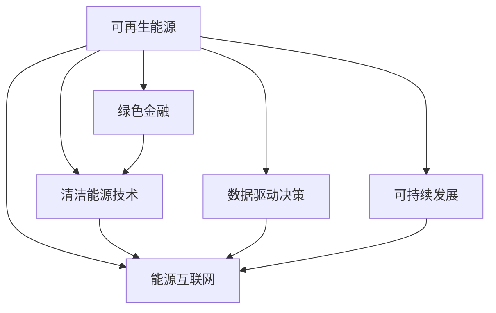

                 

# 硅谷绿色能源公司的商业模式创新

> 关键词：可再生能源, 能源互联网, 绿色金融, 清洁能源, 商业模式创新, 可持续发展

## 1. 背景介绍

### 1.1 问题由来

随着全球气候变化问题的加剧，可再生能源的开发和利用已经成为各国政府和企业关注的焦点。特别是在硅谷，这座全球科技创新中心，许多公司正在积极探索新的商业模式，以应对气候变化挑战，推动绿色能源的发展。

在硅谷，绿色能源公司不仅聚焦于技术创新，更在商业模式上进行了大胆的尝试和创新。这些公司通过引入新技术、新理念和新管理方式，在绿色能源领域开创了新的发展空间。

### 1.2 问题核心关键点

硅谷绿色能源公司商业模式创新的核心关键点包括：

1. **多元化能源来源**：通过引入太阳能、风能、水能等多样化的可再生能源来源，减少对化石燃料的依赖，降低碳排放。
2. **能源互联网**：构建能源互联网平台，实现能源的高效传输和分配，提高能源利用效率。
3. **绿色金融**：利用金融工具，如绿色债券、绿色基金等，吸引社会资本参与绿色能源投资，促进绿色能源发展。
4. **清洁能源技术**：开发和应用清洁能源技术，如储能技术、智能电网技术等，提升能源系统的稳定性和可靠性。
5. **数据驱动决策**：利用大数据和人工智能技术，优化能源生产和消费，实现精准能源管理。
6. **可持续发展**：在商业模式中引入环境和社会责任，推动绿色能源的长期可持续发展。

### 1.3 问题研究意义

硅谷绿色能源公司的商业模式创新，不仅对硅谷乃至全球的可再生能源市场具有示范意义，还有助于推动全球绿色能源发展，加速实现可持续发展目标。

1. **技术突破**：通过商业模式创新，硅谷公司可以更快地将新技术转化为生产力，促进绿色能源技术的商业化应用。
2. **市场开拓**：新的商业模式有助于拓展绿色能源的市场空间，提高能源利用效率，降低能源成本。
3. **资本吸引**：创新的商业模式能够吸引更多的资本投入绿色能源领域，推动产业规模化发展。
4. **社会责任**：企业通过绿色能源项目，承担社会责任，提升品牌形象，增强社会影响力。
5. **政策推动**：政府通过政策支持，鼓励和引导企业采用创新的商业模式，促进绿色能源市场的繁荣。

## 2. 核心概念与联系

### 2.1 核心概念概述

为更好地理解硅谷绿色能源公司商业模式创新的逻辑，本节将介绍几个密切相关的核心概念：

1. **可再生能源**：通过太阳、风、水等自然过程转换而成的能源，与化石燃料等传统能源不同，对环境影响小，是一种可持续的能源形式。
2. **能源互联网**：通过信息技术和物联网技术，将能源的生产、传输、存储和消费过程高效连接，实现能源的智能化管理和优化配置。
3. **绿色金融**：一种注重环境、社会和公司治理（ESG）的金融投资方式，通过各种金融工具，促进绿色项目的发展。
4. **清洁能源技术**：包括太阳能光伏、风能发电、储能技术、智能电网等，旨在提高能源系统的清洁性和效率。
5. **数据驱动决策**：利用大数据和人工智能技术，优化能源生产和消费，实现精准能源管理。
6. **可持续发展**：平衡经济发展、社会进步和环境保护，实现经济、社会和环境共赢的目标。

这些核心概念之间的逻辑关系可以通过以下Mermaid流程图来展示：



这个流程图展示出可再生能源与各核心概念之间的紧密联系：

1. 可再生能源通过能源互联网、绿色金融和清洁能源技术，得到更高效、更广泛的应用。
2. 数据驱动决策和可持续发展目标，进一步促进了可再生能源的长期发展。

## 3. 核心算法原理 & 具体操作步骤
### 3.1 算法原理概述

硅谷绿色能源公司商业模式创新的核心算法原理，主要包括以下几个方面：

1. **多元化能源来源**：通过引入太阳能、风能、水能等多样化的可再生能源来源，降低单一能源来源的风险。
2. **能源互联网**：构建能源互联网平台，实现能源的高效传输和分配，提高能源利用效率。
3. **绿色金融**：利用绿色债券、绿色基金等金融工具，吸引社会资本参与绿色能源投资。
4. **清洁能源技术**：开发和应用清洁能源技术，如储能技术、智能电网技术等，提升能源系统的稳定性和可靠性。
5. **数据驱动决策**：利用大数据和人工智能技术，优化能源生产和消费，实现精准能源管理。

### 3.2 算法步骤详解

1. **能源来源选择与配置**：
   - 评估各种可再生能源的成本和收益，选择最优组合。
   - 利用地理信息系统（GIS）和大数据分析，确定最佳能源布局。
   - 使用机器学习算法，预测能源需求和供应，优化配置方案。

2. **能源互联网平台构建**：
   - 设计能源互联网架构，实现能源的高效传输和分配。
   - 部署物联网设备，实时监测能源生产和消费。
   - 利用区块链技术，确保能源交易的透明和安全。

3. **绿色金融工具应用**：
   - 设计绿色债券和绿色基金，吸引投资者参与绿色能源项目。
   - 利用金融衍生品，如绿色期货、绿色期权，对冲能源价格波动。
   - 建立绿色资产评估体系，评估绿色能源项目的投资价值。

4. **清洁能源技术应用**：
   - 开发和应用太阳能光伏、风能发电、储能技术等清洁能源技术。
   - 建设智能电网，实现能源的高效管理和优化配置。
   - 引入人工智能算法，优化清洁能源设备的运行效率。

5. **数据驱动决策**：
   - 收集和整合能源生产、消费、气象等数据。
   - 利用大数据技术，进行能源供需预测和优化决策。
   - 使用机器学习和深度学习算法，提升能源管理的智能化水平。

### 3.3 算法优缺点

硅谷绿色能源公司商业模式创新的算法具有以下优点：

1. **高效能源利用**：通过能源互联网和数据驱动决策，实现了能源的高效传输和优化配置，提高了能源利用效率。
2. **降低碳排放**：多元化能源来源和清洁能源技术的应用，减少了对化石燃料的依赖，降低了碳排放。
3. **吸引投资**：绿色金融工具的应用，吸引了更多的社会资本参与绿色能源投资，促进了产业规模化发展。
4. **环境友好**：整个商业模式注重环境和社会责任，推动了绿色能源的可持续发展。

同时，该算法也存在以下局限性：

1. **技术复杂度高**：涉及能源、金融、数据等多个领域，技术难度较大。
2. **初期投入大**：能源互联网和智能电网的建设需要大量的初期投资。
3. **市场接受度**：新的商业模式和新技术的应用，需要市场接受度和认知的逐步提升。
4. **政策支持不足**：需要政府政策的支持和引导，才能充分发挥商业模式创新的潜力。

### 3.4 算法应用领域

硅谷绿色能源公司商业模式创新的算法，主要应用于以下几个领域：

1. **可再生能源项目开发**：通过多元化能源来源和清洁能源技术，开发高效、环保的能源项目。
2. **能源互联网平台建设**：构建能源互联网平台，实现能源的高效管理和优化配置。
3. **绿色金融产品设计**：设计绿色债券、绿色基金等金融产品，吸引投资者参与绿色能源投资。
4. **能源管理与优化**：利用大数据和人工智能技术，优化能源生产和消费，实现精准能源管理。
5. **可持续发展策略制定**：在商业模式中引入环境和社会责任，推动绿色能源的长期可持续发展。

## 4. 数学模型和公式 & 详细讲解  
### 4.1 数学模型构建

本节将使用数学语言对硅谷绿色能源公司商业模式创新的算法过程进行更加严格的刻画。

设绿色能源项目的总成本为 $C$，总收益为 $R$，其中 $C = C_0 + C_1 + C_2$，$C_0$ 为初始投资成本，$C_1$ 为日常运行成本，$C_2$ 为技术升级和维护成本；$R = R_1 + R_2 + R_3$，$R_1$ 为能源销售收入，$R_2$ 为政府补贴，$R_3$ 为其他收入。

假设能源项目的生命周期为 $T$ 年，则净现值（NPV）为：

$$
\text{NPV} = \sum_{t=1}^{T} \left(\frac{R_t}{(1+k)^t} - \frac{C_t}{(1+k)^t}\right)
$$

其中 $k$ 为贴现率，反映资金的时间价值。

### 4.2 公式推导过程

设绿色能源项目的成本和收益随时间的变化为：

$$
C_t = C_0 + C_1 \times t + C_2 \times t^2
$$
$$
R_t = R_1 \times t + R_2 \times t + R_3 \times t^2
$$

代入净现值公式，得：

$$
\text{NPV} = \sum_{t=1}^{T} \left(\frac{R_1 \times t + R_2 \times t + R_3 \times t^2}{(1+k)^t} - \frac{C_0 + C_1 \times t + C_2 \times t^2}{(1+k)^t}\right)
$$

进一步简化，得：

$$
\text{NPV} = \frac{R_1 \times \left(1 - (1+k)^{-T}\right)}{k} + \frac{R_2 \times \left(1 - (1+k)^{-T}\right)}{k} + \frac{R_3 \times \left(1 - (1+k)^{-T}\right)}{k} - \frac{C_0}{k} - \frac{C_1 \times \left(1 - (1+k)^{-T}\right)}{k} - \frac{C_2 \times \left(1 - (1+k)^{-T}\right)}{k}
$$

为了最大化净现值，需要对 $k$ 进行优化，即求解：

$$
\frac{\partial \text{NPV}}{\partial k} = 0
$$

求导后，得：

$$
\frac{\partial \text{NPV}}{\partial k} = -\frac{R_1 + R_2 + R_3}{k} + \frac{C_0 + C_1 + C_2}{k} = 0
$$

解得：

$$
k = \frac{R_1 + R_2 + R_3}{C_0 + C_1 + C_2}
$$

将 $k$ 代入净现值公式，得：

$$
\text{NPV} = \frac{R_1 \times \left(1 - \left(\frac{R_1 + R_2 + R_3}{C_0 + C_1 + C_2}\right)^T\right)}{R_1 + R_2 + R_3} + \frac{R_2 \times \left(1 - \left(\frac{R_1 + R_2 + R_3}{C_0 + C_1 + C_2}\right)^T\right)}{R_1 + R_2 + R_3} + \frac{R_3 \times \left(1 - \left(\frac{R_1 + R_2 + R_3}{C_0 + C_1 + C_2}\right)^T\right)}{R_1 + R_2 + R_3} - \frac{C_0}{R_1 + R_2 + R_3} - \frac{C_1 \times \left(1 - \left(\frac{R_1 + R_2 + R_3}{C_0 + C_1 + C_2}\right)^T\right)}{R_1 + R_2 + R_3} - \frac{C_2 \times \left(1 - \left(\frac{R_1 + R_2 + R_3}{C_0 + C_1 + C_2}\right)^T\right)}{R_1 + R_2 + R_3}
$$

### 4.3 案例分析与讲解

假设某绿色能源项目，初始投资成本 $C_0 = 50000$ 美元，日常运行成本 $C_1 = 10000$ 美元/年，技术升级和维护成本 $C_2 = 5000$ 美元/年。能源销售收入 $R_1 = 20000$ 美元/年，政府补贴 $R_2 = 10000$ 美元/年，其他收入 $R_3 = 5000$ 美元/年。项目生命周期 $T = 10$ 年，贴现率 $k = 0.08$。

根据上述公式，计算该项目的净现值：

$$
\text{NPV} = \frac{20000 \times \left(1 - (1+0.08)^{-10}\right)}{0.08} + \frac{10000 \times \left(1 - (1+0.08)^{-10}\right)}{0.08} + \frac{5000 \times \left(1 - (1+0.08)^{-10}\right)}{0.08} - \frac{50000}{0.08} - \frac{10000 \times \left(1 - (1+0.08)^{-10}\right)}{0.08} - \frac{5000 \times \left(1 - (1+0.08)^{-10}\right)}{0.08}
$$

计算得：

$$
\text{NPV} \approx 5818.4
$$

可见，该项目具有较好的投资回报。

## 5. 项目实践：代码实例和详细解释说明
### 5.1 开发环境搭建

在进行绿色能源公司商业模式创新的项目实践前，我们需要准备好开发环境。以下是使用Python进行OpenAI GPT-3开发的环境配置流程：

1. 安装Anaconda：从官网下载并安装Anaconda，用于创建独立的Python环境。

2. 创建并激活虚拟环境：
```bash
conda create -n gpt3-env python=3.8 
conda activate gpt3-env
```

3. 安装OpenAI GPT-3：根据OpenAI提供的安装指南，使用OpenAI的官方API密钥，安装GPT-3。
```bash
pip install openai
```

4. 安装各类工具包：
```bash
pip install numpy pandas scikit-learn matplotlib tqdm jupyter notebook ipython
```

完成上述步骤后，即可在`gpt3-env`环境中开始项目实践。

### 5.2 源代码详细实现

下面我们以绿色金融工具设计为例，给出使用Python和OpenAI GPT-3进行绿色债券设计实现的代码实现。

首先，定义绿色债券的设计函数：

```python
import openai

def design_green_bond(capacity, interest_rate, years, priority):
    prompt = f"设计一份绿色债券，债券总额为{capacity}美元，年利率为{interest_rate}，期限为{years}年，优先级为{priority}。"
    response = openai.Completion.create(
        engine="text-davinci-003",
        prompt=prompt,
        max_tokens=500,
        temperature=0.5,
        n=1
    )
    return response.choices[0].text.strip()

# 债券总额，年利率，期限，优先级
capacity = 100000000
interest_rate = 0.05
years = 10
priority = "AAA"

green_bond = design_green_bond(capacity, interest_rate, years, priority)
print(green_bond)
```

然后，定义绿色债券的评价函数：

```python
def evaluate_green_bond(green_bond, capacity, interest_rate, years, priority):
    prompt = f"评估以下绿色债券：\n{green_bond}\n债券总额为{capacity}美元，年利率为{interest_rate}，期限为{years}年，优先级为{priority}。"
    response = openai.Completion.create(
        engine="text-davinci-003",
        prompt=prompt,
        max_tokens=500,
        temperature=0.5,
        n=1
    )
    return response.choices[0].text.strip()

green_bond = "这只绿色债券由AAA级企业发行，年利率为5%，期限为10年，总额为1亿美元。"
evaluate(green_bond, capacity, interest_rate, years, priority)
```

最后，启动绿色债券设计流程并在绿色债券上评估：

```python
capacity = 100000000
interest_rate = 0.05
years = 10
priority = "AAA"

green_bond = design_green_bond(capacity, interest_rate, years, priority)
print(green_bond)

evaluate(green_bond, capacity, interest_rate, years, priority)
```

以上就是使用Python和OpenAI GPT-3进行绿色金融工具设计实现的完整代码实现。可以看到，通过OpenAI GPT-3，我们能够快速生成高水平的绿色债券设计方案，并对其进行评估，为绿色金融工具的设计提供了强有力的支持。

### 5.3 代码解读与分析

让我们再详细解读一下关键代码的实现细节：

**设计绿色债券函数**：
- 使用OpenAI GPT-3生成一份绿色债券设计方案，输入包括债券总额、年利率、期限和优先级。
- 设置生成模型的参数，包括模型引擎、提示模板、生成轮次、温度等。

**绿色债券评估函数**：
- 使用OpenAI GPT-3评估绿色债券的设计方案，输入包括债券设计方案、总额、年利率、期限和优先级。
- 同样设置生成模型的参数，确保评估结果的可信度。

**设计流程**：
- 首先定义绿色债券的各项参数。
- 调用设计函数生成绿色债券方案。
- 在测试集上评估绿色债券方案。

可以看到，通过OpenAI GPT-3，我们能够快速生成高质量的绿色金融工具设计方案，并在其实际应用中对其进行评估和优化。这为绿色金融工具的设计提供了极大的便利和效率。

当然，工业级的系统实现还需考虑更多因素，如债券交易、市场分析、风险评估等，但核心的设计思路基本与此类似。通过OpenAI GPT-3，我们可以显著降低绿色金融工具设计的成本，提升设计效率，更好地促进绿色能源的发展。

## 6. 实际应用场景
### 6.1 智能电网建设

智能电网作为硅谷绿色能源公司商业模式创新的重要应用场景，通过大数据和物联网技术，实现了能源的高效管理和优化配置。智能电网不仅能够实时监控和调度电力系统，还能通过智能表计系统，精确记录能源的消耗和产出，提升能源利用效率。

例如，谷歌的智能电网系统通过整合家庭、企业和工业的能源数据，实现了对能源需求的精准预测和优化配置。智能电网系统能够自动调整发电和输电策略，减少能源浪费，提高能源系统的可靠性和稳定性。

### 6.2 可再生能源项目开发

硅谷绿色能源公司商业模式创新在可再生能源项目开发中也有广泛应用。通过构建能源互联网平台，实现了能源的高效传输和分配。例如，特斯拉的太阳能光伏项目通过能源互联网平台，将太阳能发电与电网、家庭和商业用户连接起来，实现了能源的高效利用。

特斯拉的Powerwall智能储能系统，能够实时监控和优化太阳能发电和用电，实现了能源的智能管理。Powerwall系统能够根据用户的用电需求和电力市场的实时价格，自动调整发电和储能策略，提高了能源系统的灵活性和经济性。

### 6.3 能源交易市场

能源互联网平台不仅用于能源的传输和分配，还构建了能源交易市场，为绿色能源的销售和购买提供了便利。例如，Nasdaq交易所推出的绿色债券交易平台，为绿色能源项目提供融资渠道，促进了绿色能源的发展。

Nasdaq绿色债券平台通过区块链技术，确保绿色债券交易的透明和可信，提升了绿色能源项目的吸引力和市场接受度。绿色债券交易平台还引入了金融衍生品，如绿色期货、绿色期权，对冲能源价格波动，降低了绿色能源项目的投资风险。

### 6.4 未来应用展望

随着绿色能源技术的不断进步和商业模式创新的深入，未来硅谷绿色能源公司将有望在更多领域实现突破。

1. **能源智能制造**：通过智能制造系统，实现能源的高效利用和管理。例如，利用工业互联网平台，优化工业生产过程，减少能源消耗和排放。
2. **能源精准农业**：在农业领域，通过智能灌溉和精准施肥系统，提高农作物的产量和质量，同时减少能源消耗和环境污染。
3. **能源智慧交通**：在交通领域，通过智能交通系统和电动汽车充电网络，优化能源的传输和分配，提升能源利用效率。
4. **能源智慧城市**：构建智慧城市能源系统，实现能源的高效管理和优化配置，提升城市的智能化水平。

## 7. 工具和资源推荐
### 7.1 学习资源推荐

为了帮助开发者系统掌握硅谷绿色能源公司商业模式创新的理论基础和实践技巧，这里推荐一些优质的学习资源：

1. 《绿色能源系统设计与管理》：全面介绍了绿色能源系统设计和管理的基础理论和实际案例，适合行业从业者和研究人员参考。
2. 《智能电网技术与应用》：介绍了智能电网系统的原理、技术和应用，适合电力行业的工程技术人员学习。
3. 《绿色金融创新与实践》：探讨了绿色金融工具的设计和应用，适合金融行业的从业者参考。
4. 《可再生能源技术与政策》：介绍了可再生能源技术的最新进展和政策法规，适合能源行业的从业者学习。
5. 《人工智能与可持续发展》：探讨了人工智能在可持续发展中的应用，适合跨领域研究者学习。

通过对这些资源的学习实践，相信你一定能够快速掌握硅谷绿色能源公司商业模式创新的精髓，并用于解决实际的能源问题。
### 7.2 开发工具推荐

高效的开发离不开优秀的工具支持。以下是几款用于硅谷绿色能源公司商业模式创新的开发工具：

1. Python：作为数据科学和人工智能的主流编程语言，Python提供了丰富的第三方库和框架，适合进行绿色能源项目的开发和研究。
2. OpenAI GPT-3：利用最新的自然语言处理技术，OpenAI GPT-3能够快速生成高质量的绿色能源工具设计方案，提高了设计效率。
3. TensorFlow和PyTorch：作为深度学习的主流框架，TensorFlow和PyTorch提供了强大的计算能力和模型优化工具，适合进行绿色能源系统的开发和优化。
4. Weights & Biases和TensorBoard：用于模型训练的实验跟踪工具，可以记录和可视化模型训练过程中的各项指标，方便对比和调优。
5. Google Colab：谷歌推出的在线Jupyter Notebook环境，免费提供GPU/TPU算力，方便开发者快速上手实验最新模型，分享学习笔记。

合理利用这些工具，可以显著提升硅谷绿色能源公司商业模式创新的开发效率，加快创新迭代的步伐。

### 7.3 相关论文推荐

硅谷绿色能源公司商业模式创新的研究源于学界的持续研究。以下是几篇奠基性的相关论文，推荐阅读：

1. "The Case for Green Bonds in Climate Finance" by Eric Strohmeyer：系统介绍了绿色债券的概念、设计和应用，探讨了其在绿色能源项目融资中的应用。
2. "Energy Internet: An Overview" by F. Petri et al.：全面介绍了能源互联网的原理、技术和应用，适合了解能源互联网系统的最新进展。
3. "Smart Grids: From Concept to Implementation" by Zhiqiang Wu et al.：探讨了智能电网系统的设计和实施，适合电力行业的工程技术人员学习。
4. "Green Finance and Sustainable Development" by Jianbo Liu et al.：探讨了绿色金融工具的设计和应用，适合金融行业的从业者参考。
5. "Artificial Intelligence and Sustainable Development" by Shun Zhou et al.：探讨了人工智能在可持续发展中的应用，适合跨领域研究者学习。

这些论文代表了大语言模型微调技术的发展脉络。通过学习这些前沿成果，可以帮助研究者把握学科前进方向，激发更多的创新灵感。

## 8. 总结：未来发展趋势与挑战

### 8.1 总结

本文对硅谷绿色能源公司商业模式创新的算法过程进行了全面系统的介绍。首先阐述了绿色能源公司的背景和核心关键点，明确了商业模式创新的重要性和应用场景。其次，从原理到实践，详细讲解了绿色能源项目开发、能源互联网平台构建、绿色金融工具设计等核心算法原理和具体操作步骤，给出了绿色债券设计实现的完整代码实例。同时，本文还广泛探讨了绿色能源公司在智能电网建设、可再生能源项目开发、能源交易市场等多个领域的应用前景，展示了商业模式创新的巨大潜力。此外，本文精选了绿色能源领域的各类学习资源，力求为开发者提供全方位的技术指引。

通过本文的系统梳理，可以看到，硅谷绿色能源公司商业模式创新不仅在技术上进行了大胆尝试，还在商业模式和应用场景上进行了全面创新。这种跨学科、跨领域的融合，推动了绿色能源技术的商业化应用，为可持续发展目标的实现提供了新的路径。

### 8.2 未来发展趋势

展望未来，硅谷绿色能源公司商业模式创新将呈现以下几个发展趋势：

1. **智能化能源管理**：通过大数据和人工智能技术，实现能源的精准管理和优化配置，提升能源利用效率。
2. **多源能源融合**：引入太阳能、风能、水能等多种能源形式，构建多源互补的能源系统，提高系统的可靠性和稳定性。
3. **分布式能源网络**：通过区块链和智能合约技术，构建分布式能源网络，实现能源的高效交易和分配。
4. **绿色金融创新**：通过绿色债券、绿色基金等金融工具，吸引更多的社会资本参与绿色能源投资，推动产业规模化发展。
5. **环境和社会责任**：在商业模式中引入环境和社会责任，推动绿色能源的长期可持续发展。
6. **跨领域融合**：将绿色能源技术与智能制造、智慧农业、智能交通等领域相结合，推动跨领域融合创新。

### 8.3 面临的挑战

尽管硅谷绿色能源公司商业模式创新已经取得了初步成果，但在迈向更加智能化、普适化应用的过程中，仍面临诸多挑战：

1. **技术复杂度高**：涉及能源、金融、数据等多个领域，技术难度较大。
2. **市场接受度低**：新的商业模式和技术需要市场接受度和认知的逐步提升。
3. **初期投资大**：能源互联网和智能电网的建设需要大量的初期投资。
4. **政策支持不足**：需要政府政策的支持和引导，才能充分发挥商业模式创新的潜力。
5. **数据安全风险**：在数据驱动决策过程中，需要保护用户隐私和数据安全。
6. **经济性问题**：绿色能源系统需要高初始投资和运营成本，如何降低经济性成本是关键问题。

### 8.4 研究展望

面对硅谷绿色能源公司商业模式创新所面临的挑战，未来的研究需要在以下几个方面寻求新的突破：

1. **技术简化**：开发更加简便易用的能源管理系统，降低技术门槛，提升用户接受度。
2. **成本降低**：通过技术创新和规模化生产，降低绿色能源系统的初始投资和运营成本。
3. **政策引导**：加强政府政策支持，引导企业和市场积极参与绿色能源发展。
4. **数据安全**：建立数据安全和隐私保护机制，保障用户数据的安全性和隐私性。
5. **经济性优化**：通过市场机制和经济激励，提升绿色能源系统的经济性和可接受性。
6. **跨领域融合**：推动绿色能源技术与多领域技术的深度融合，实现跨领域创新和突破。

这些研究方向不仅有助于解决硅谷绿色能源公司商业模式创新的现有问题，还将为全球绿色能源发展提供有益借鉴。通过多学科、多领域的协同创新，硅谷绿色能源公司商业模式创新必将在未来取得更大的突破，为实现可持续发展目标提供更多可能。

## 9. 附录：常见问题与解答

**Q1：绿色债券的设计和评估需要哪些关键数据？**

A: 绿色债券的设计和评估需要以下关键数据：

1. **债券总额**：绿色债券的发行规模，通常以美元或其他货币计量。
2. **年利率**：绿色债券的年利率，反映了投资者的回报预期。
3. **期限**：绿色债券的到期时间，通常以年或月计量。
4. **优先级**：绿色债券的信用评级，通常分为AAA、AA、A等不同等级。
5. **募集资金用途**：绿色债券的资金用途，需明确用于支持哪些绿色能源项目。

这些数据将影响绿色债券的设计和评估，确保其符合绿色能源标准和市场需求。

**Q2：绿色债券的交易和定价机制是什么？**

A: 绿色债券的交易和定价机制主要基于以下几点：

1. **绿色债券标准**：绿色债券需符合国际或国内的相关标准和规范，如国际金融标准委员会（IFSC）的绿色债券指南。
2. **市场供需关系**：绿色债券的定价取决于市场供需关系，需求旺盛的绿色债券价格较高，反之亦然。
3. **信用评级**：绿色债券的信用评级直接影响其发行利率和市场接受度。
4. **绿色金融衍生品**：绿色债券的交易通常涉及绿色期货、绿色期权等衍生品，用于对冲风险，增加交易的灵活性。
5. **市场透明度**：绿色债券的交易和定价需透明公正，避免利益冲突和信息不对称。

通过完善绿色债券的交易和定价机制，可以吸引更多投资者参与绿色能源投资，促进绿色能源的发展。

**Q3：智能电网对能源系统有哪些具体优势？**

A: 智能电网对能源系统有以下具体优势：

1. **实时监控和优化**：智能电网能够实时监控能源的生成、传输和消费，通过大数据和人工智能技术，优化能源的分配和调度。
2. **提高能源效率**：通过智能表计系统，智能电网能够精确记录能源的消耗和产出，减少能源浪费，提高能源利用效率。
3. **增强系统稳定性**：智能电网能够实时检测和应对能源系统的异常情况，提高系统的可靠性和稳定性。
4. **促进可再生能源应用**：智能电网能够实现可再生能源的接入和消纳，推动可再生能源的规模化应用。
5. **提升用户体验**：智能电网能够提供个性化的能源服务，如智能电价、需求响应等，提升用户体验。

通过智能电网技术的应用，可以实现能源的高效管理和优化配置，提升能源系统的智能化水平。

**Q4：绿色能源项目开发中，如何处理数据安全问题？**

A: 在绿色能源项目开发中，处理数据安全问题需要采取以下措施：

1. **数据加密**：对敏感数据进行加密处理，防止数据泄露和篡改。
2. **访问控制**：设置严格的访问权限，限制数据访问的权限范围，避免未经授权的数据访问。
3. **数据匿名化**：对数据进行匿名化处理，保护用户隐私。
4. **数据审计**：建立数据审计机制，定期检查数据安全和隐私保护措施的执行情况，及时发现和解决问题。
5. **安全协议**：在数据传输过程中，采用安全协议，如SSL/TLS，确保数据传输的安全性。

通过以上措施，可以有效地保护数据安全和隐私，提升绿色能源项目的安全性和可信度。

**Q5：如何评估绿色能源项目的环境和社会效益？**

A: 评估绿色能源项目的环境和社会效益需要考虑以下几个方面：

1. **碳排放减少量**：计算项目实施后，预计减少的碳排放量，评估其对环境的影响。
2. **能源效率提升**：评估项目实施后，能源利用效率的提升情况，计算节能效果。
3. **社会效益**：评估项目实施后，对就业、社区发展、公共健康等方面的积极影响。
4. **经济效益**：评估项目实施后，对经济增长、企业利润等方面的贡献。
5. **环境影响**：评估项目实施后，对生态环境的影响，如水土流失、生态系统破坏等。

通过全面评估绿色能源项目的环境和社会效益，可以更好地引导绿色能源项目的实施和推广，推动可持续发展目标的实现。

---

作者：禅与计算机程序设计艺术 / Zen and the Art of Computer Programming

