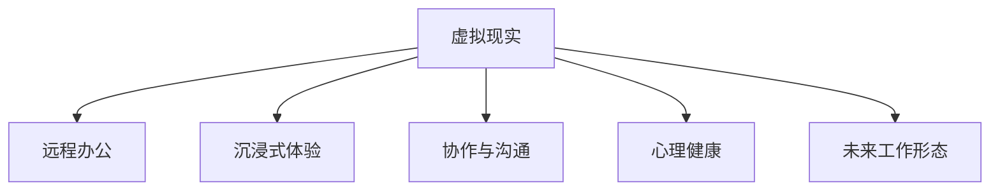

                 

# 硅谷虚拟现实在远程办公中的作用

> 关键词：虚拟现实(VR), 远程办公, 生产力提升, 沉浸式体验, 协作与沟通, 心理健康, 未来工作形态

## 1. 背景介绍

### 1.1 问题由来
随着全球疫情的肆虐，远程办公成为全球各大企业应对突发情况的首选解决方案。然而，远程办公也带来了许多挑战，如团队协作效率下降、员工心理压力大、孤立感增强等问题。为了缓解这些问题，硅谷科技公司不断尝试新的技术手段，其中虚拟现实(VR)因其独特的沉浸式体验和交互性，成为提升远程办公效率和员工体验的重要工具。

### 1.2 问题核心关键点
虚拟现实技术在远程办公中的应用主要集中在提升团队协作效率、改善员工心理状态和增强沉浸式体验三个方面。通过VR技术，员工可以在虚拟环境中进行高效的会议、培训和沟通，减少空间距离带来的沟通障碍，同时沉浸式的交互方式也能更好地激发员工的工作热情和创意。

## 2. 核心概念与联系

### 2.1 核心概念概述

- **虚拟现实(Virtual Reality, VR)**：通过计算机生成的模拟环境，使用户能够通过佩戴VR头盔等方式进入一个完全由计算机创建的世界，实现沉浸式体验。
- **远程办公(Remote Work)**：员工不再局限于固定的工作地点，通过互联网进行工作沟通、协作和任务执行。
- **沉浸式体验(Immersive Experience)**：通过VR技术，员工能够以更加身临其境的方式进行工作和协作，增强参与感和专注度。
- **协作与沟通(Collaboration and Communication)**：在虚拟环境中，团队成员可以更加自然、高效地进行沟通和协作，弥补远程办公中的交流障碍。
- **心理健康(Mental Health)**：虚拟现实技术提供了减压和放松的虚拟环境，有助于缓解远程办公员工的心理压力，改善工作状态。
- **未来工作形态(Future of Work)**：随着VR等技术的成熟，远程办公模式将逐渐发展为一种更加灵活、高效、可持续的新型工作形态。

这些核心概念之间的逻辑关系可以通过以下Mermaid流程图来展示：



这个流程图展示了虚拟现实技术如何与远程办公的其他关键概念相连接，以及它如何通过提升沉浸式体验、协作效率和心理健康，为未来的工作形态带来变革。

## 3. 核心算法原理 & 具体操作步骤

### 3.1 算法原理概述

基于虚拟现实技术的远程办公解决方案，本质上是一种增强现实(AR)与VR技术相结合的交互式远程工作环境。其核心思想是：通过VR设备模拟一个虚拟空间，员工在其中可以进行自由、灵活的交流和协作，从而提升工作效率和员工体验。

形式化地，假设企业构建了一个虚拟办公环境 $E_{VR}$，员工可以通过VR头盔进入该环境。在环境中，员工可以自由地移动、查看文件、进行会议等，与其他同事实时交互。设计虚拟办公环境的优化目标是最小化员工在虚拟环境中的操作成本，即找到最优环境配置 $\theta$：

$$
\theta^* = \mathop{\arg\min}_{\theta} \mathcal{L}(E_{VR},\theta)
$$

其中 $\mathcal{L}$ 为优化损失函数，用于衡量员工在虚拟环境中的操作便捷性和任务完成效率。

### 3.2 算法步骤详解

基于虚拟现实技术的远程办公解决方案，通常包括以下几个关键步骤：

**Step 1: 构建虚拟办公环境**
- 选择合适的VR平台和设备，如Oculus Rift、HTC Vive等，构建虚拟办公空间。
- 设计虚拟办公环境的布局，如会议室、办公桌、文件柜等，根据实际需求进行定制化配置。

**Step 2: 提供虚拟协作工具**
- 开发虚拟协作平台，支持视频会议、文档共享、语音聊天等功能。
- 提供虚拟白板、虚拟投影等工具，方便团队协作和信息展示。

**Step 3: 用户界面和交互设计**
- 设计虚拟界面，包含虚拟环境中的各种元素，如窗口、按钮、菜单等。
- 实现交互功能，如点击、拖动、旋转等，使得员工能够在虚拟环境中自由操作。

**Step 4: 优化用户体验**
- 采用模型驱动的方式，根据员工的操作习惯和反馈，不断优化虚拟办公环境的设计。
- 引入机器学习和数据分析技术，实时监控员工在虚拟环境中的表现，进行智能调整。

**Step 5: 测试和部署**
- 在内部进行测试，评估虚拟办公环境的性能和用户体验。
- 在实际应用中不断迭代优化，根据反馈进行改进。

### 3.3 算法优缺点

虚拟现实在远程办公中的主要优点包括：
1. **沉浸式体验**：通过VR技术，员工能够进入一个完全由计算机生成的虚拟环境，减少对物理空间的依赖，提升工作投入感。
2. **高效协作**：虚拟环境中的交互工具丰富多样，可以高效支持团队协作，提升沟通效率。
3. **灵活性**：员工可以在任何时间、任何地点通过VR设备进入虚拟办公环境，不受物理限制。
4. **心理缓解**：虚拟环境提供了减压和放松的空间，有助于缓解员工的心理压力，改善工作状态。

同时，虚拟现实技术也存在一些缺点：
1. **设备成本高**：高质量的VR设备和软件成本较高，普及度有待提高。
2. **技术门槛高**：虚拟办公环境的搭建和维护需要专业的技术支持。
3. **学习曲线长**：员工需要适应虚拟界面和交互方式，初期上手可能较慢。
4. **网络依赖强**：虚拟办公环境依赖于稳定的网络连接，网络问题可能影响工作效率。
5. **空间适应性差**：长时间佩戴VR设备可能导致身体不适，影响健康。

尽管存在这些缺点，但虚拟现实技术在提升远程办公效率和员工体验方面的潜力依然不可忽视。未来，随着技术的不断进步和成本的降低，虚拟现实将更广泛地应用于远程办公中。

### 3.4 算法应用领域

虚拟现实技术在远程办公中的应用领域主要包括以下几个方面：

- **虚拟会议**：使用VR设备进行虚拟会议，支持多视角、沉浸式交流。员工可以更加自然、直观地表达想法，提高会议效率。
- **虚拟培训**：通过虚拟现实技术，员工可以在虚拟环境中进行交互式培训，增强学习效果。
- **远程协作**：在虚拟办公环境中，员工可以轻松共享文件、讨论问题、协作完成项目，提高团队协作效率。
- **心理疏导**：提供虚拟减压和放松空间，帮助员工缓解心理压力，改善工作状态。
- **个性化工作环境**：员工可以根据自己的喜好和需求，自定义虚拟办公环境，提升个人工作满意度。

## 4. 数学模型和公式 & 详细讲解 & 举例说明

### 4.1 数学模型构建

假设虚拟办公环境为 $E_{VR}$，包含 $N$ 个员工，每个员工的操作成本为 $c_i$，则整个环境的操作成本为：

$$
C = \sum_{i=1}^N c_i
$$

通过优化损失函数 $\mathcal{L}(E_{VR},\theta)$，可以最小化操作成本，使得员工在虚拟环境中的操作更加便捷。

### 4.2 公式推导过程

对于员工 $i$ 在虚拟环境 $E_{VR}$ 中的操作成本 $c_i$，可以表示为：

$$
c_i = f_i(\theta) = \sum_{j=1}^M w_{ij} \cdot r_j(\theta)
$$

其中 $w_{ij}$ 为第 $j$ 个操作对员工 $i$ 的影响权重，$r_j(\theta)$ 为第 $j$ 个操作对员工体验的贡献度。

对整个环境的操作成本 $C$ 进行优化，目标是找到最优参数 $\theta$：

$$
\theta^* = \mathop{\arg\min}_{\theta} \mathcal{L}(E_{VR},\theta) = \mathop{\arg\min}_{\theta} \sum_{i=1}^N f_i(\theta)
$$

### 4.3 案例分析与讲解

以虚拟会议为例，在虚拟会议中，每个员工的操作成本包括：
- 佩戴VR设备的准备时间
- 进入虚拟会议室的导航时间
- 会议材料和资源的加载时间
- 与其他同事进行语音或文字交流的时间

优化损失函数可以通过以下步骤实现：
- 收集员工的操作数据和反馈，计算每个操作对员工体验的影响权重。
- 根据权重和贡献度，构建操作成本函数 $f_i(\theta)$。
- 通过优化算法，求解最优参数 $\theta$，最小化操作成本。

## 5. 项目实践：代码实例和详细解释说明

### 5.1 开发环境搭建

为了构建和测试虚拟办公环境，需要以下开发环境：

1. 安装VR开发工具：如Unity、Unreal Engine等，提供3D场景和交互工具。
2. 安装VR硬件：如Oculus Rift、HTC Vive等，用于佩戴和体验虚拟环境。
3. 安装虚拟协作软件：如Slack、Microsoft Teams等，支持虚拟会议和协作。

### 5.2 源代码详细实现

以下是一个使用Unity和VR SDK构建虚拟办公环境的示例代码：

```csharp
using UnityEngine;
using UnityEngine.XR.Interaction.Toolkit;

public class VROffice : MonoBehaviour
{
    public GameObject[] officeElements;
    public GameObject[] officeFurniture;
    
    private XRController controller;
    
    void Start()
    {
        controller = GetComponent<XRController>();
        
        for (int i = 0; i < officeElements.Length; i++)
        {
            // 将VR设备控制器绑定到虚拟办公环境中的元素
            officeElements[i].SetActive(true);
        }
        
        for (int i = 0; i < officeFurniture.Length; i++)
        {
            // 初始化虚拟办公环境中的家具
            officeFurniture[i].SetActive(true);
        }
        
        // 添加交互事件，如点击、拖动等
        AddInteractionEvents();
    }
    
    void Update()
    {
        // 更新虚拟环境中的动态元素，如动态模拟的光线、声音等
        UpdateDynamicElements();
    }
    
    void AddInteractionEvents()
    {
        // 添加点击事件，当员工点击某元素时，触发相应的操作
        for (int i = 0; i < officeElements.Length; i++)
        {
            officeElements[i].SetActive(true);
            officeElements[i].OnSelect += HandleElementClick;
        }
    }
    
    void UpdateDynamicElements()
    {
        // 动态模拟办公环境中的元素，如电脑屏幕动态显示文件等
        for (int i = 0; i < officeElements.Length; i++)
        {
            // 根据员工的操作动态更新虚拟元素
        }
    }
    
    void HandleElementClick(XRPointer pointer)
    {
        // 处理员工点击虚拟元素的事件
    }
}
```

### 5.3 代码解读与分析

以上代码实现了虚拟办公环境的搭建和基本交互功能。具体解释如下：

**VROffice类**：
- `Start`方法：初始化VR控制器，激活虚拟办公环境中的元素和家具。
- `Update`方法：更新虚拟环境中的动态元素，如光照、声音等。
- `AddInteractionEvents`方法：为虚拟元素添加点击事件处理函数。
- `UpdateDynamicElements`方法：动态模拟虚拟办公环境中的元素，根据员工操作进行更新。

**交互事件处理**：
- 代码通过Unity的XRInteraction Toolkit库，为虚拟元素添加了点击事件处理函数，当员工点击某元素时，会触发相应的操作。

**动态元素更新**：
- 代码通过动态模拟虚拟办公环境中的元素，如电脑屏幕、灯光等，根据员工的操作进行更新，提高了虚拟环境的互动性。

### 5.4 运行结果展示

运行以上代码，员工可以进入虚拟办公环境，自由移动、操作家具、点击元素。通过测试，可以验证虚拟办公环境的基本功能，如导航、操作、交互等，为进一步优化和扩展打下基础。

## 6. 实际应用场景

### 6.1 虚拟会议

虚拟会议已成为虚拟办公环境中最重要的应用场景之一。通过虚拟现实技术，员工可以进入一个三维的虚拟会议室，进行高效的讨论和决策。

**典型应用**：Google Meet、Microsoft Teams等都支持在虚拟环境中进行视频会议，支持多视角、沉浸式交流。员工可以通过VR头盔，更加自然地表达想法，提高会议效率。

**案例分析**：某科技公司在疫情期间，采用虚拟现实技术进行团队会议，员工通过VR头盔进入虚拟会议室，自由移动、查看文件、进行语音交流，提高了会议效率和参与度。

### 6.2 虚拟培训

虚拟现实技术在培训领域也有广泛应用。通过构建虚拟培训环境，员工可以在其中进行沉浸式学习，提高培训效果。

**典型应用**：Meta Platforms的虚拟培训系统，通过VR技术进行安全、技能培训，员工可以在虚拟环境中进行实践操作，增强学习体验。

**案例分析**：某IT公司通过虚拟现实技术进行安全培训，员工在虚拟环境中模拟紧急疏散、火灾逃生等场景，通过互动和演练，提高了应对突发事件的能力。

### 6.3 远程协作

在虚拟办公环境中，员工可以轻松共享文件、讨论问题、协作完成项目，提高团队协作效率。

**典型应用**：Slack、Microsoft Teams等协作工具，通过VR技术实现更加自然、高效的信息交流和团队协作。

**案例分析**：某金融公司通过虚拟现实技术进行远程协作，员工在虚拟环境中进行实时沟通和协作，提高了项目进展速度和团队凝聚力。

### 6.4 心理疏导

虚拟现实技术提供了减压和放松的空间，有助于缓解员工的心理压力，改善工作状态。

**典型应用**：使用VR技术进行虚拟减压、放松训练，帮助员工缓解压力，提升工作满意度。

**案例分析**：某互联网公司通过虚拟现实技术进行员工减压训练，员工在虚拟环境中进行呼吸训练、冥想等活动，缓解了心理压力，提高了工作状态。

## 7. 工具和资源推荐

### 7.1 学习资源推荐

为了帮助开发者系统掌握虚拟现实技术在远程办公中的应用，这里推荐一些优质的学习资源：

1. **《虚拟现实技术基础》**：介绍虚拟现实技术的基本原理和应用场景，适合初学者入门。
2. **《Unity VR开发实战》**：详细讲解Unity平台在虚拟现实开发中的应用，适合有一定编程基础的开发者。
3. **《Google VR Dev Kit》**：Google提供的虚拟现实开发工具和资源，适合使用Google平台进行开发。
4. **《VR+远程办公》专题课程**：各大在线教育平台提供的专业课程，涵盖虚拟现实在远程办公中的应用，适合系统学习。
5. **《VR+企业应用白皮书》**：企业级VR解决方案的实用指南，适合了解VR在企业中的应用场景和最佳实践。

通过对这些资源的学习实践，相信你一定能够快速掌握虚拟现实技术在远程办公中的应用，并用于解决实际的业务问题。

### 7.2 开发工具推荐

高效的开发离不开优秀的工具支持。以下是几款用于虚拟现实开发和应用推荐的工具：

1. **Unity**：强大的游戏引擎，支持VR开发，适用于构建沉浸式虚拟环境。
2. **Unreal Engine**：高性能的3D引擎，支持多种平台和设备，适合创建复杂的虚拟场景。
3. **Slack**：协作工具，支持虚拟会议和信息交流，方便团队协作。
4. **Microsoft Teams**：综合协作平台，支持虚拟会议、文件共享等功能。
5. **Google Meet**：视频会议工具，支持虚拟会议室和多方交流。
6. **VR SDKs**：如Google Cardboard SDK、Unity VR SDK等，提供虚拟现实开发的SDK支持。

合理利用这些工具，可以显著提升虚拟现实在远程办公中的开发效率，加速创新迭代的步伐。

### 7.3 相关论文推荐

虚拟现实技术在远程办公中的应用是一个多学科交叉的研究领域，以下是几篇奠基性的相关论文，推荐阅读：

1. **《虚拟现实在远程办公中的应用》**：详细介绍了虚拟现实技术在远程办公中的关键应用场景和优化策略。
2. **《虚拟现实与团队协作》**：探讨了虚拟现实技术在团队协作中的潜力，提出了多种优化方法。
3. **《基于虚拟现实的企业培训系统设计》**：提出了一种基于虚拟现实的企业培训系统，提高了培训效果和员工参与度。
4. **《虚拟现实在安全培训中的应用》**：介绍了虚拟现实技术在安全培训中的应用，通过沉浸式体验提高了培训效果。
5. **《虚拟现实技术在心理健康中的应用》**：研究了虚拟现实技术在心理健康治疗中的应用，帮助员工缓解压力，改善工作状态。

这些论文代表了大语言模型微调技术的发展脉络。通过学习这些前沿成果，可以帮助研究者把握学科前进方向，激发更多的创新灵感。

## 8. 总结：未来发展趋势与挑战

### 8.1 总结

本文对基于虚拟现实技术的远程办公方法进行了全面系统的介绍。首先阐述了虚拟现实技术在远程办公中的应用背景和意义，明确了虚拟现实在提升远程办公效率和员工体验方面的独特价值。其次，从原理到实践，详细讲解了虚拟办公环境的构建和优化过程，给出了虚拟办公环境搭建的完整代码实例。同时，本文还探讨了虚拟现实技术在多个实际应用场景中的应用前景，展示了虚拟现实在远程办公中的巨大潜力。此外，本文精选了虚拟现实技术的各类学习资源，力求为读者提供全方位的技术指引。

通过本文的系统梳理，可以看到，虚拟现实技术在提升远程办公效率和员工体验方面的巨大潜力。未来，随着虚拟现实技术的不断进步和成本的降低，虚拟办公模式将逐渐发展为一种更加灵活、高效、可持续的新型工作形态。

### 8.2 未来发展趋势

展望未来，虚拟现实技术在远程办公中的应用将呈现以下几个发展趋势：

1. **更加沉浸式的体验**：虚拟现实技术将不断提升沉浸式体验，使得员工在虚拟环境中更加自然、高效地工作。
2. **智能交互和协作**：引入AI和机器学习技术，提升虚拟环境的智能交互能力，增强协作效率。
3. **多模态交互**：结合VR、AR、MR等多种交互方式，实现更加丰富、多样化的交互体验。
4. **个性化工作环境**：根据员工的需求和偏好，自定义虚拟办公环境，提升工作满意度。
5. **跨平台和跨设备支持**：实现虚拟环境在多个平台和设备上的无缝协作，提升使用便捷性。
6. **经济实惠的解决方案**：随着技术的进步和市场竞争，虚拟办公解决方案的成本将逐渐降低，普及率将逐步提高。

以上趋势凸显了虚拟现实技术在远程办公中的巨大潜力，未来将有更广泛的应用前景。

### 8.3 面临的挑战

尽管虚拟现实技术在远程办公中具有诸多优势，但仍面临以下挑战：

1. **设备成本高**：高质量的VR设备和软件成本较高，普及度有待提高。
2. **技术门槛高**：虚拟办公环境的搭建和维护需要专业的技术支持。
3. **学习曲线长**：员工需要适应虚拟界面和交互方式，初期上手可能较慢。
4. **网络依赖强**：虚拟办公环境依赖于稳定的网络连接，网络问题可能影响工作效率。
5. **空间适应性差**：长时间佩戴VR设备可能导致身体不适，影响健康。

这些挑战需要通过技术创新、设备优化、市场推广等手段加以克服，才能真正实现虚拟现实在远程办公中的广泛应用。

### 8.4 研究展望

未来，虚拟现实技术在远程办公中的应用需要进一步深入研究，重点关注以下几个方向：

1. **大规模个性化定制**：通过大数据和人工智能技术，实现虚拟办公环境的个性化定制，提升员工的工作体验。
2. **跨模态交互融合**：结合虚拟现实、增强现实和混合现实技术，实现多模态交互的深度融合，提升用户体验。
3. **智能内容生成**：引入自然语言处理和生成技术，实现虚拟环境中的智能内容生成，增强交互性和趣味性。
4. **心理健康支持**：通过虚拟现实技术，提供心理疏导、放松训练等支持，改善员工的心理状态。
5. **安全保障**：建立虚拟办公环境的安全机制，防止网络攻击和数据泄露，保障数据安全。
6. **跨平台协作**：实现虚拟环境在多个平台和设备上的无缝协作，提升使用便捷性。

这些研究方向将引领虚拟现实技术在远程办公中的应用，为构建高效、灵活、智能的虚拟办公环境铺平道路。总之，虚拟现实技术将在远程办公中发挥越来越重要的作用，成为未来工作形态的重要组成部分。

## 9. 附录：常见问题与解答

**Q1：虚拟现实在远程办公中的主要优势是什么？**

A: 虚拟现实在远程办公中的主要优势包括：
1. 沉浸式体验：员工可以进入一个完全由计算机生成的虚拟环境，减少对物理空间的依赖，提升工作投入感。
2. 高效协作：虚拟环境中的交互工具丰富多样，可以高效支持团队协作，提升沟通效率。
3. 灵活性：员工可以在任何时间、任何地点通过VR设备进入虚拟办公环境，不受物理限制。
4. 心理缓解：提供虚拟减压和放松空间，帮助员工缓解心理压力，改善工作状态。

**Q2：虚拟现实在远程办公中是否需要高成本的设备支持？**

A: 高质量的VR设备和软件成本较高，是虚拟办公普及的一大障碍。然而，随着技术的进步和市场竞争，设备成本将逐渐降低，更多企业将能够负担得起。同时，开源设备和低成本解决方案的涌现，也将推动虚拟办公的普及和应用。

**Q3：虚拟现实技术在远程办公中的学习曲线长吗？**

A: 虚拟现实技术在远程办公中的学习曲线确实较长，员工需要适应虚拟界面和交互方式，初期上手可能较慢。然而，通过培训和指导，员工可以在较短时间内掌握虚拟办公的基本操作。

**Q4：虚拟办公环境的网络依赖性强吗？**

A: 虚拟办公环境依赖于稳定的网络连接，网络问题可能影响工作效率。为此，需要采取一些措施，如优化数据传输、使用高速网络、部署边缘计算等，以提高虚拟办公环境的稳定性。

**Q5：虚拟现实技术在远程办公中的空间适应性差吗？**

A: 长时间佩戴VR设备可能导致身体不适，影响健康。为此，需要合理设计虚拟办公环境，提供舒适的交互方式，避免过度使用。

---

作者：禅与计算机程序设计艺术 / Zen and the Art of Computer Programming

