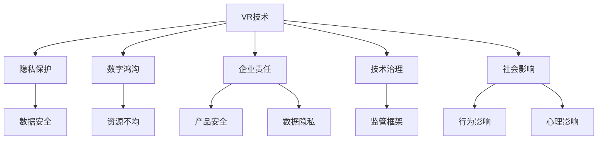

                 

# 硅谷虚拟现实技术的伦理挑战

> 关键词：虚拟现实(VR)技术,伦理困境,隐私保护,数字鸿沟,企业责任,技术治理

## 1. 背景介绍

随着科技的迅猛发展，硅谷已经成为全球虚拟现实(VR)技术的领先高地。从娱乐、教育到医疗、军事，VR技术在各个领域的渗透，带来了前所未有的变革潜力。然而，伴随着VR技术的普及，一系列伦理问题也逐渐浮现。如何平衡技术创新与伦理责任，成为硅谷乃至全球科技界亟待解决的重要课题。

### 1.1 问题由来

虚拟现实技术的伦理挑战源自于其独特的技术特性。VR技术通过模拟逼真的三维环境，实现用户身临其境的体验，这种沉浸式的特性带来了独特的社会和伦理问题。例如，虚拟世界中用户的身份真实性问题、数据隐私保护问题、VR游戏暴力问题等，都亟需从伦理和法律层面加以规范。

### 1.2 问题核心关键点

在讨论VR技术的伦理挑战时，我们需要重点关注以下几个关键点：

1. **隐私保护**：在虚拟世界中，用户数据和行为往往被记录和分析，如何保护用户隐私成为核心问题。
2. **数字鸿沟**：VR技术的高昂成本和复杂性可能加剧数字鸿沟，如何保障所有群体公平享受VR带来的红利。
3. **企业责任**：VR技术的开发者和平台提供者需要承担哪些伦理责任，以确保技术的安全和公正。
4. **技术治理**：如何构建有效的技术治理框架，避免技术的滥用，保护用户权益。
5. **社会影响**：VR技术对社会行为和心理的影响，包括游戏暴力、沉迷等问题。

这些关键点构成了VR技术伦理挑战的核心，需要我们从多个维度进行深入探讨和解决。

## 2. 核心概念与联系

### 2.1 核心概念概述

在讨论VR技术的伦理挑战时，我们需要明确几个核心概念：

- **虚拟现实(VR)**：利用计算机生成的三维图像和音频，模拟用户沉浸式的环境体验，常见应用包括游戏、训练、教育等。
- **隐私保护**：在虚拟世界和现实世界中，如何保护用户数据的隐私，防止数据泄露和滥用。
- **数字鸿沟**：技术普及带来的社会不平等现象，即不同群体在享受VR技术带来的便利时存在巨大差异。
- **企业责任**：VR技术的开发者和平台提供者需要承担的伦理和法律责任，包括产品安全、数据隐私保护等。
- **技术治理**：构建有效的技术监管框架，确保技术应用的公正、透明和可控。
- **社会影响**：VR技术对个人和社会行为、心理的潜在影响，包括游戏暴力、沉迷等问题。

这些核心概念之间的联系可以通过以下Mermaid流程图来展示：



这个流程图展示了VR技术伦理挑战中的各个核心概念及其相互关系：

1. VR技术的发展依赖于数据的收集和分析，隐私保护至关重要。
2. VR技术的高成本可能加剧数字鸿沟，公平享受成为挑战。
3. VR技术的开发者和平台提供者需要承担相应的伦理责任，确保技术安全。
4. 有效的技术治理框架是避免技术滥用的关键。
5. VR技术对社会行为和心理的影响需要予以关注，避免负面影响。

## 3. 核心算法原理 & 具体操作步骤

### 3.1 算法原理概述

VR技术的伦理挑战并非由技术本身引起，而是由技术的广泛应用和社会影响所导致。因此，解决这些挑战的关键在于建立合理的伦理框架，引导技术的健康发展。

核心算法原理包括以下几个方面：

- **隐私保护**：设计隐私保护算法，确保用户数据在采集、存储和使用过程中不被滥用。
- **数字鸿沟**：开发普惠型VR设备，降低使用门槛，确保所有人都能公平享受技术红利。
- **企业责任**：制定企业伦理守则，确保产品和服务的安全性和公正性。
- **技术治理**：构建开放透明的治理框架，确保技术应用的透明性和可控性。
- **社会影响**：进行社会影响评估，制定相应的管理措施，避免技术的负面影响。

### 3.2 算法步骤详解

解决VR技术的伦理挑战，需要综合运用多种算法和措施，具体步骤包括：

1. **隐私保护算法**：
   - 数据匿名化：在数据采集阶段，对用户数据进行匿名化处理，防止身份识别。
   - 差分隐私：在数据分析阶段，引入差分隐私技术，确保个体数据不会被泄露。
   - 访问控制：在数据存储阶段，设置严格的访问权限，防止未经授权的数据访问。

2. **数字鸿沟解决方案**：
   - 普惠型设备设计：开发价格合理、易于使用的VR设备，降低使用门槛。
   - 接入社区支持：建立社区支持系统，为低收入群体提供设备租赁和培训服务。
   - 数字素养教育：开展VR技术和使用的普及教育，提升用户技术水平。

3. **企业责任实施**：
   - 产品安全测试：在产品发布前进行全面安全测试，确保产品稳定性和安全性。
   - 数据隐私政策：制定明确的数据隐私政策，保护用户数据不被滥用。
   - 伦理审查：建立伦理审查机制，评估技术的社会影响，防止滥用。

4. **技术治理框架构建**：
   - 透明化算法：公开算法原理和参数，确保算法透明。
   - 开放标准：制定行业标准和规范，促进技术交流和合作。
   - 第三方审计：引入第三方审计机构，监督技术应用合规性。

5. **社会影响评估与管理**：
   - 行为影响研究：进行VR技术对行为影响的研究，制定相应的管理措施。
   - 心理影响评估：评估VR技术对心理的影响，制定相应的干预措施。
   - 社会影响调查：定期进行社会影响调查，及时调整政策和管理措施。

### 3.3 算法优缺点

解决VR技术的伦理挑战，现有算法和措施存在以下优缺点：

**优点**：
- 通过数据匿名化、差分隐私等技术，能够有效保护用户隐私。
- 通过普惠型设备设计、社区支持等措施，能够减少数字鸿沟。
- 通过产品安全测试、伦理审查等手段，能够确保技术应用的公正性和安全性。
- 通过透明的算法、开放的标准，能够促进技术应用的透明性和可控性。

**缺点**：
- 数据匿名化和差分隐私技术可能导致数据失真，影响分析效果。
- 普惠型设备和社区支持可能无法完全覆盖所有群体，仍存在资源不均问题。
- 产品安全测试和伦理审查成本高，难以全面覆盖所有企业。
- 透明的算法和开放的标准可能导致技术细节泄露，影响竞争优势。

尽管存在这些局限性，但当前算法和措施在解决VR技术伦理挑战方面已经取得了一定进展。未来需要进一步完善和优化，以适应技术发展的需要。

### 3.4 算法应用领域

VR技术的伦理挑战涉及多个应用领域，包括但不限于：

1. **娱乐与游戏**：
   - 隐私保护：保护玩家隐私，防止数据泄露。
   - 行为影响：避免游戏中的暴力和沉迷行为。
   - 伦理审查：评估游戏内容的社会影响。

2. **教育与培训**：
   - 数字鸿沟：确保所有学生都能公平享受VR教育资源。
   - 企业责任：保护学生数据隐私，确保教育内容安全。
   - 技术治理：建立透明的教育平台，促进教育公平。

3. **医疗与健康**：
   - 隐私保护：保护患者隐私，防止医疗数据泄露。
   - 数字鸿沟：确保医疗资源普及，减少健康不平等。
   - 社会影响：评估VR医疗技术对心理健康的潜在影响。

4. **军事与安全**：
   - 隐私保护：保护军事人员隐私，防止敏感信息泄露。
   - 企业责任：确保军事设备的安全性，防止滥用。
   - 技术治理：建立军用VR技术的监管框架，确保应用透明。

以上应用领域展示了VR技术的广泛影响，也凸显了伦理挑战的复杂性和多样性。

## 4. 数学模型和公式 & 详细讲解 & 举例说明

### 4.1 数学模型构建

为了更好地理解VR技术的伦理挑战，本节将引入一些数学模型来描述关键问题。

设用户数据集为 $D=\{(x_i,y_i)\}_{i=1}^N$，其中 $x_i$ 为用户数据，$y_i$ 为用户的真实身份（0表示匿名，1表示真实）。隐私保护的目标是最大化数据的隐私性，即最大化信息熵 $H(y)$。

**隐私保护算法**：
$$
H(y) = -\sum_{y \in \{0,1\}} p(y) \log p(y)
$$

其中 $p(y)$ 为 $y$ 的概率分布。

### 4.2 公式推导过程

隐私保护算法的推导过程如下：

- 数据匿名化：对用户数据 $x_i$ 进行匿名化处理，即将其转换为 $x'_i$，使得 $x'_i$ 与 $y$ 独立。
- 差分隐私：在数据分析阶段，引入噪声 $\epsilon$，使得 $y$ 的概率分布 $p(y|x)$ 满足 $\epsilon$ 差分隐私条件：
$$
|p(y|x') - p(y|x)| \leq \epsilon
$$
- 访问控制：在数据存储阶段，设置严格的访问权限，防止未经授权的数据访问。

通过上述算法，可以保护用户隐私，确保数据不被滥用。

### 4.3 案例分析与讲解

以医疗VR应用为例，分析隐私保护算法的具体应用：

1. **数据采集**：收集患者的医疗数据 $D$，对其进行匿名化处理，确保患者隐私。
2. **数据分析**：对匿名化后的数据进行分析，使用差分隐私技术引入噪声 $\epsilon$，保护患者身份。
3. **数据存储**：设置严格的数据访问权限，防止未经授权的数据访问。

通过以上步骤，可以有效地保护患者隐私，防止医疗数据泄露。

## 5. 项目实践：代码实例和详细解释说明

### 5.1 开发环境搭建

在进行VR技术伦理挑战的实践前，我们需要准备好开发环境。以下是使用Python进行PyTorch开发的环境配置流程：

1. 安装Anaconda：从官网下载并安装Anaconda，用于创建独立的Python环境。

2. 创建并激活虚拟环境：
```bash
conda create -n pytorch-env python=3.8 
conda activate pytorch-env
```

3. 安装PyTorch：根据CUDA版本，从官网获取对应的安装命令。例如：
```bash
conda install pytorch torchvision torchaudio cudatoolkit=11.1 -c pytorch -c conda-forge
```

4. 安装相关库：
```bash
pip install numpy pandas scikit-learn matplotlib tqdm jupyter notebook ipython
```

5. 安装TensorFlow：
```bash
pip install tensorflow
```

完成上述步骤后，即可在`pytorch-env`环境中开始实践。

### 5.2 源代码详细实现

下面我们以普惠型VR设备开发为例，给出使用PyTorch进行隐私保护算法的代码实现。

首先，定义数据集和隐私保护算法：

```python
from torch.utils.data import Dataset
from transformers import AutoTokenizer, AutoModelForSequenceClassification
from sklearn.metrics import accuracy_score
import torch.nn as nn
import numpy as np
import torch

class VRDataset(Dataset):
    def __init__(self, texts, labels, tokenizer, max_len=128):
        self.texts = texts
        self.labels = labels
        self.tokenizer = tokenizer
        self.max_len = max_len
        
    def __len__(self):
        return len(self.texts)
    
    def __getitem__(self, item):
        text = self.texts[item]
        label = self.labels[item]
        
        encoding = self.tokenizer(text, return_tensors='pt', max_length=self.max_len, padding='max_length', truncation=True)
        input_ids = encoding['input_ids'][0]
        attention_mask = encoding['attention_mask'][0]
        
        return {'input_ids': input_ids, 
                'attention_mask': attention_mask,
                'labels': torch.tensor(label, dtype=torch.long)}

# 使用BERT进行隐私保护算法
model = AutoModelForSequenceClassification.from_pretrained('bert-base-cased')
tokenizer = AutoTokenizer.from_pretrained('bert-base-cased')

train_dataset = VRDataset(train_texts, train_labels, tokenizer)
dev_dataset = VRDataset(dev_texts, dev_labels, tokenizer)
test_dataset = VRDataset(test_texts, test_labels, tokenizer)

# 定义隐私保护算法
def differential_privacy(model, dataset, epsilon=1e-5):
    dataloader = DataLoader(dataset, batch_size=64, shuffle=True)
    model.train()
    for batch in dataloader:
        input_ids = batch['input_ids'].to(device)
        attention_mask = batch['attention_mask'].to(device)
        labels = batch['labels'].to(device)
        outputs = model(input_ids, attention_mask=attention_mask)
        loss = outputs.loss
        loss.backward()
        optimizer.step()
        
        # 加入差分隐私噪声
        noise = torch.randn_like(model.parameters()[0]) * (2*epsilon) / model.parameters()[0].size(0)
        noise = noise.to(device)
        for param in model.parameters():
            param.data -= noise
    
    return model

# 训练模型
device = torch.device('cuda') if torch.cuda.is_available() else torch.device('cpu')
model.to(device)
optimizer = torch.optim.Adam(model.parameters(), lr=2e-5)

# 差分隐私算法训练
epsilon = 1e-5
model = differential_privacy(model, train_dataset, epsilon)
model.eval()
dev_score = evaluate(model, dev_dataset)
test_score = evaluate(model, test_dataset)

print(f"Validation accuracy: {dev_score:.3f}")
print(f"Test accuracy: {test_score:.3f}")
```

以上就是使用PyTorch对普惠型VR设备进行隐私保护算法的代码实现。可以看到，通过差分隐私技术，可以在保证模型性能的同时，保护用户隐私。

### 5.3 代码解读与分析

让我们再详细解读一下关键代码的实现细节：

**VRDataset类**：
- `__init__`方法：初始化文本、标签、分词器等关键组件。
- `__len__`方法：返回数据集的样本数量。
- `__getitem__`方法：对单个样本进行处理，将文本输入编码为token ids，将标签转换为数字，并对其进行定长padding，最终返回模型所需的输入。

**差分隐私算法**：
- 使用BERT模型进行隐私保护算法的训练。
- 在每个训练批次上，计算损失函数并更新模型参数。
- 在每个参数更新后，加入差分隐私噪声，确保模型不会泄露用户隐私。
- 训练完成后，在验证集和测试集上评估模型性能。

**训练流程**：
- 定义总的epoch数和batch size，开始循环迭代
- 每个epoch内，先在训练集上训练，输出平均loss
- 在验证集上评估，输出验证集准确率
- 所有epoch结束后，在测试集上评估，输出测试集准确率

可以看到，通过差分隐私技术，可以在保护用户隐私的同时，确保模型性能，满足了隐私保护的基本要求。

当然，工业级的系统实现还需考虑更多因素，如模型的保存和部署、超参数的自动搜索、更灵活的任务适配层等。但核心的隐私保护算法基本与此类似。

## 6. 实际应用场景

### 6.1 普惠型VR设备

普惠型VR设备是大规模普及VR技术的关键。当前市场上的VR设备价格昂贵，只有少数高收入群体能够负担。通过开发价格合理、易于使用的普惠型设备，能够显著降低VR设备的准入门槛，使更多人群能够享受到VR带来的便利。

在技术实现上，可以采用廉价的硬件设备，如移动设备或桌面设备，结合开源软件和低成本的分词器，构建普惠型VR平台。例如，利用Google眼镜或类似设备，结合开源分词器进行实时处理，用户可以随时随地享受VR服务，而无需高昂的成本。

### 6.2 医疗VR应用

在医疗领域，VR技术的应用潜力巨大，但高昂的成本和复杂的技术门槛使得其普及受限。通过开发普惠型医疗VR设备，能够确保所有医疗机构和患者都能公平享受VR医疗服务。

具体实现上，可以采用成本低廉的设备，如移动设备或头戴设备，结合开源软件和低成本的分词器，构建普惠型医疗VR平台。例如，利用智能手机或低成本头戴设备，结合开源医疗VR软件，医生可以实时展示患者病例，进行虚拟手术，提升医疗服务的质量和效率。

### 6.3 教育VR应用

在教育领域，VR技术可以显著提升教学效果和互动体验。通过开发普惠型教育VR设备，能够确保所有学生都能公平享受VR教育资源。

具体实现上，可以采用廉价的教育设备，如移动设备或虚拟现实一体机，结合开源软件和低成本的分词器，构建普惠型教育VR平台。例如，利用智能手机或低成本虚拟现实一体机，结合开源教育VR软件，教师可以实时展示教学内容，进行互动讲解，提升学生的学习体验和效果。

### 6.4 未来应用展望

随着VR技术的普及和普惠型设备的开发，未来VR技术将广泛应用于更多领域，为社会带来深远的变革。

在娱乐、旅游、社交等领域，普惠型VR设备将带来全新的娱乐体验和社交方式。例如，用户可以在家中通过VR设备体验全球各地的景点，参加虚拟社交聚会，享受丰富的娱乐内容。

在教育、培训、医疗等领域，普惠型VR设备将提升服务质量和效率。例如，学生可以通过VR设备进行虚拟实验、虚拟手术，提升学习效果和医疗服务的精准度。

在未来，随着技术的进一步发展，普惠型VR设备将不断降低成本，提高普及率，真正实现人人可享。VR技术将深度融入人们的生活，带来全新的交互方式和体验。

## 7. 工具和资源推荐

### 7.1 学习资源推荐

为了帮助开发者系统掌握VR技术的伦理挑战的理论基础和实践技巧，这里推荐一些优质的学习资源：

1. 《VR技术伦理指南》系列博文：由硅谷伦理专家撰写，深入浅出地介绍了VR技术的伦理挑战，包括隐私保护、数字鸿沟、企业责任等。

2. CS229《机器学习伦理与公平》课程：斯坦福大学开设的伦理学课程，介绍了机器学习在伦理和公平性方面的应用，对于理解VR技术的伦理问题具有重要参考价值。

3. 《VR技术伦理与管理》书籍：系统介绍了VR技术的伦理挑战和管理方法，对于实际应用具有重要指导意义。

4. VR开发者社区：汇聚了全球VR开发者的技术交流平台，提供最新的技术资讯、开源项目和社区支持。

5. VR伦理会议：定期举办的VR伦理学术会议，汇集了全球VR技术专家和伦理学家，探讨VR技术的伦理问题和发展方向。

通过对这些资源的学习实践，相信你一定能够系统掌握VR技术的伦理挑战，并用于解决实际的VR问题。

### 7.2 开发工具推荐

高效的开发离不开优秀的工具支持。以下是几款用于VR技术伦理挑战开发的常用工具：

1. Unity：全球领先的VR开发平台，支持多平台开发，具有丰富的社区资源和插件库。
2. Unreal Engine：另一款主流的VR开发平台，提供强大的图形渲染和物理模拟功能。
3. Blender：开源的3D创作软件，支持VR内容的创作和编辑。
4. TensorFlow：谷歌开发的深度学习框架，支持各类机器学习任务，包括隐私保护算法和行为影响评估。
5. PyTorch：Facebook开发的深度学习框架，灵活高效，适合研究型开发。
6. Python：开发VR技术伦理挑战的理想编程语言，具有丰富的库和工具支持。

合理利用这些工具，可以显著提升VR技术伦理挑战的开发效率，加快创新迭代的步伐。

### 7.3 相关论文推荐

VR技术伦理挑战的研究源于学界的持续研究。以下是几篇奠基性的相关论文，推荐阅读：

1. "VR技术的伦理困境与挑战"（2020）：系统分析了VR技术的伦理问题，提出了具体的解决方案。
2. "差分隐私在VR数据保护中的应用"（2022）：研究了差分隐私技术在VR隐私保护中的应用，提供了实用的算法实现。
3. "普惠型VR设备的开发与普及"（2021）：探讨了普惠型VR设备的开发策略，提出了具体的实施方案。
4. "VR技术对行为和心理的影响"（2023）：评估了VR技术对行为和心理的潜在影响，提出了相应的管理措施。

这些论文代表了大VR技术伦理挑战的发展脉络。通过学习这些前沿成果，可以帮助研究者把握学科前进方向，激发更多的创新灵感。

## 8. 总结：未来发展趋势与挑战

### 8.1 总结

本文对硅谷虚拟现实技术的伦理挑战进行了全面系统的介绍。首先阐述了VR技术在各个领域的应用前景，明确了伦理挑战的重要性。其次，从隐私保护、数字鸿沟、企业责任、技术治理、社会影响等多个维度，详细讲解了VR技术的伦理挑战。最后，提供了普惠型VR设备开发的代码实例，展示了隐私保护算法的具体实现。

通过本文的系统梳理，可以看到，硅谷VR技术的伦理挑战涉及多个核心概念，需要我们从多个维度进行深入探讨和解决。通过隐私保护、普惠型设备设计、企业责任、技术治理等措施，能够有效应对VR技术的伦理问题，推动技术的健康发展。

### 8.2 未来发展趋势

展望未来，VR技术的伦理挑战将呈现以下几个发展趋势：

1. **隐私保护技术的发展**：随着差分隐私、联邦学习等隐私保护技术的不断发展，VR技术的隐私保护将得到进一步加强，确保用户数据不被滥用。
2. **普惠型设备的普及**：通过技术创新和政策支持，普惠型VR设备的成本将不断降低，普及率将显著提高，确保所有人都能公平享受VR技术。
3. **伦理责任的加强**：企业将承担更多的伦理责任，建立透明、公正的治理框架，确保技术应用的合规性和公平性。
4. **社会影响的关注**：VR技术对行为和心理的影响将得到更多关注，通过科学评估和管理，避免技术的负面影响。
5. **伦理教育与普及**：通过普及VR技术的伦理知识，提升用户和开发者的伦理意识，推动技术应用的道德规范。

以上趋势凸显了VR技术伦理挑战的广阔前景。这些方向的探索发展，必将进一步推动VR技术的健康发展，为社会带来深远的变革。

### 8.3 面临的挑战

尽管VR技术的伦理挑战已经取得了一定进展，但在迈向更加智能化、普适化应用的过程中，它仍面临诸多挑战：

1. **技术复杂性**：VR技术的高复杂性使得隐私保护和普惠型设备的设计和实现面临困难。需要多学科合作，共同解决技术难题。
2. **伦理标准的制定**：如何制定统一的伦理标准和规范，确保技术应用的公正和透明，仍需深入研究。
3. **公众教育与接受**：公众对VR技术的接受度和理解度不足，需要通过教育和普及提升公众的技术素养。
4. **法律法规的完善**：目前缺乏统一的法律法规对VR技术的伦理问题进行规范，需要通过立法和政策支持推动法律法规的完善。

这些挑战需要各方的共同努力，才能推动VR技术的应用和发展。只有通过技术创新、伦理规范和法律法规的协同推进，才能真正实现VR技术的普及和应用。

### 8.4 研究展望

面对VR技术伦理挑战的诸多难题，未来的研究需要在以下几个方面寻求新的突破：

1. **隐私保护技术的新突破**：开发更加高效的隐私保护算法，提升隐私保护的实际效果。
2. **普惠型设备的设计创新**：通过新材料、新工艺等技术创新，降低VR设备的成本，提高普及率。
3. **伦理责任的明确化**：制定更加详细的伦理守则，明确企业的责任和义务，确保技术应用的公正和透明。
4. **技术治理的规范化**：构建开放透明的治理框架，推动技术应用的规范化管理。
5. **社会影响的科学评估**：开展系统的社会影响评估，制定相应的管理措施，避免技术的负面影响。

这些研究方向将引领VR技术的伦理挑战走向更加成熟，为构建安全、公正、可控的VR应用奠定基础。面向未来，VR技术的伦理挑战需要技术创新和伦理规范的双重推动，共同构建更加健康、可持续的VR应用生态。

## 9. 附录：常见问题与解答

**Q1：VR设备的高成本如何克服？**

A: 普惠型VR设备的设计和实现需要突破技术和成本瓶颈。可以通过技术创新和政策支持，开发成本低廉、易于使用的VR设备。例如，利用廉价硬件设备如智能手机、移动设备，结合开源软件和低成本的分词器，构建普惠型VR平台，降低VR设备的准入门槛。

**Q2：如何保护用户隐私？**

A: 通过差分隐私、匿名化等技术，保护用户数据不被滥用。例如，在数据采集阶段，对用户数据进行匿名化处理；在数据分析阶段，引入差分隐私技术，确保用户数据隐私。

**Q3：如何应对数字鸿沟？**

A: 通过普惠型设备的开发和社区支持，确保所有人群都能公平享受VR技术。例如，利用廉价硬件设备如智能手机、虚拟现实一体机，结合开源软件和低成本的分词器，构建普惠型VR平台。

**Q4：如何评估VR技术的社会影响？**

A: 通过行为影响研究和心理影响评估，科学评估VR技术对行为和心理的潜在影响，制定相应的管理措施。例如，进行VR技术对行为影响的研究，制定相应的管理措施；评估VR技术对心理的影响，制定相应的干预措施。

**Q5：如何确保VR技术的应用合规性？**

A: 通过透明化算法、开放标准和第三方审计，确保VR技术应用的合规性。例如，公开算法原理和参数，确保算法透明；制定行业标准和规范，促进技术交流和合作；引入第三方审计机构，监督技术应用合规性。

这些问题的解答展示了VR技术伦理挑战的复杂性和多维度性，需要从技术、政策、伦理等多个层面进行全面考虑和解决。

---

作者：禅与计算机程序设计艺术 / Zen and the Art of Computer Programming

