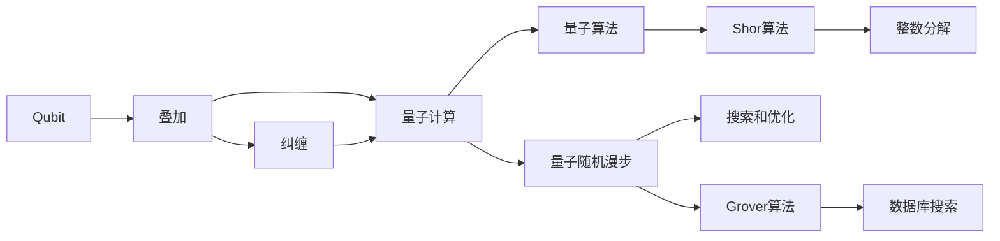

                 

## 1. 背景介绍

量子计算（Quantum Computing）是指利用量子力学原理，对数据进行并行处理的一种计算模式。在硅谷，量子计算机技术近年来得到了迅猛发展，成为了人工智能、金融、化学、物理等众多领域的研究热点。尤其在金融领域，量子计算机以其高效计算能力和独特的算法优势，展现出了巨大的应用潜力。

金融行业的业务场景非常复杂，涉及大量高维数据和实时决策。传统计算方式在处理这些任务时存在效率瓶颈和资源浪费，难以满足实时计算需求。量子计算机通过叠加和纠缠等量子特性，可以在复杂度指数级提升的情况下，依然保持较高的计算效率，从而为金融数据分析和决策提供了全新的工具。

然而，量子计算在金融领域的应用仍处于早期探索阶段。尽管目前尚无实用的量子计算机问世，但相关研究和理论已经显示出其潜在的革命性意义。本文将全面探讨硅谷量子计算机在金融领域的应用，从技术原理到实际应用场景，全面阐述量子计算带来的创新可能性。

## 2. 核心概念与联系

### 2.1 核心概念概述

量子计算与传统计算有很大的区别，其核心在于量子位（Qubits）的量子特性：叠加和纠缠。与传统计算中的比特（Bits）只能处于0或1两个状态不同，量子位可以同时处于0和1的叠加状态，从而在逻辑上实现并行计算。

以下是量子计算在金融领域涉及的核心概念：

1. **量子比特（Qubits）**：量子计算的计算单元，可以表示多个状态。
2. **叠加（Superposition）**：量子比特能够同时处于多个状态，提高计算能力。
3. **纠缠（Entanglement）**：量子比特之间存在一定的关联性，即使物理上距离很远，一个量子比特的状态改变也能瞬间影响到另一个。
4. **量子算法（Quantum Algorithm）**：利用量子特性设计的算法，如Shor算法和Grover算法。
5. **量子随机漫步（Quantum Random Walk）**：量子算法中常用的一种随机过程，可用于模拟随机游走，常用于搜索和优化问题。

### 2.2 核心概念原理和架构的 Mermaid 流程图



这个流程图展示了量子计算的核心概念和架构：
1. Qubit通过叠加和纠缠等量子特性进行计算。
2. 量子算法利用量子比特的特性进行高效计算。
3. Shor算法和Grover算法分别用于整数分解和数据库搜索。
4. 量子随机漫步用于搜索和优化问题。

### 2.3 核心概念之间的关系

量子计算与传统计算的区别在于其量子比特的叠加和纠缠特性，从而能够实现高效的并行计算。量子算法则是利用这种特性设计的，如Shor算法和Grover算法，分别用于整数分解和数据库搜索等问题的优化。量子随机漫步是量子算法中常用的一种随机过程，用于搜索和优化问题。

## 3. 核心算法原理 & 具体操作步骤

### 3.1 算法原理概述

量子计算机在金融领域的应用，主要体现在以下几个方面：

1. **整数分解**：利用Shor算法快速分解大整数，解决诸如RSA加密等复杂问题，进一步保障金融交易和信息安全。
2. **数据库搜索**：利用Grover算法，在大量数据中快速定位特定信息，如信用记录、财务报表等。
3. **优化问题**：通过量子随机漫步等算法，优化投资组合，减少风险，提升收益。
4. **风险评估**：利用量子计算进行高效的风险模拟和预测，提高金融产品的定价和风险管理。

### 3.2 算法步骤详解

**步骤1：准备量子计算机**
- 选择合适的量子计算机平台，如Google的Sycamore或IBM的Q System One。
- 安装量子计算开发环境，如Qiskit或Google Cirq。
- 加载量子计算机资源，设置量子比特数量。

**步骤2：设计量子算法**
- 根据问题需求，选择合适的量子算法，如Shor算法、Grover算法或量子随机漫步。
- 设计量子电路，包含量子比特的初始化、叠加、纠缠、测量等步骤。
- 进行量子算法仿真或实际运行。

**步骤3：数据处理与算法优化**
- 对金融数据进行预处理，提取关键特征，如价格、成交量、波动率等。
- 在量子计算机上运行量子算法，优化决策过程。
- 分析输出结果，进行风险评估和投资组合优化。

**步骤4：结果验证与模型评估**
- 将量子计算结果与传统计算方法进行比较，验证其准确性和可靠性。
- 对量子模型进行参数调优和鲁棒性测试，确保其稳定性。
- 进行多次实验，评估量子模型的泛化能力。

### 3.3 算法优缺点

量子计算在金融领域的应用具有以下优点：
1. **高效计算**：能够在极短时间内处理海量数据，提升金融决策效率。
2. **优化算法**：利用量子特性，在复杂优化问题中表现出显著优势。
3. **安全性提升**：通过整数分解算法，进一步提升加密算法的安全性，保障数据安全。

同时，量子计算也存在以下缺点：
1. **技术复杂**：量子计算需要专业知识和复杂技术，门槛较高。
2. **资源消耗大**：量子计算需要特殊硬件设备和大量的冷却系统，维护成本高。
3. **算法局限**：某些传统算法难以直接量子化，需要重新设计新的量子算法。

### 3.4 算法应用领域

量子计算在金融领域的应用涉及多个方面，具体如下：

1. **加密与解密**：利用Shor算法分解大整数，破解RSA加密算法，保障信息安全。
2. **金融市场模拟**：利用量子随机漫步算法，模拟金融市场的随机过程，预测价格波动。
3. **风险管理**：利用量子算法进行高效的蒙特卡洛模拟，评估金融产品的风险和收益。
4. **优化投资组合**：利用Grover算法，在大量资产中快速找到最优投资组合，降低风险，提高收益。
5. **信用评估**：利用量子算法快速处理信用数据，提高信用评估的准确性和效率。
6. **市场监管**：利用量子算法进行高频交易的检测和监管，防止市场操纵。

## 4. 数学模型和公式 & 详细讲解

### 4.1 数学模型构建

量子计算在金融领域的应用，主要依赖于量子算法的设计和优化。以下是几个关键的量子算法及其数学模型：

**Shor算法**：用于整数分解。数学模型为
$$
y = x^2 \bmod N
$$
其中，$x$ 和 $N$ 是已知的大整数，$y$ 是 $x^2$ 对 $N$ 取模的结果。Shor算法能够在多项式时间内解决这个困难问题。

**Grover算法**：用于数据库搜索。数学模型为
$$
F(x) = (-1)^{f(x)}
$$
其中，$f(x)$ 是数据库中的函数，$x$ 是搜索的项。Grover算法能够在$\mathcal{O}(\sqrt{N})$时间复杂度内，找到数据库中的目标项。

**量子随机漫步**：用于搜索和优化问题。数学模型为
$$
P = \frac{1}{2}I + \frac{1}{2}H
$$
其中，$I$ 是单位矩阵，$H$ 是Hadamard矩阵。量子随机漫步通过叠加和纠缠特性，快速遍历搜索空间，找到最优解。

### 4.2 公式推导过程

**Shor算法的推导**：
- 第一步：通过量子傅里叶变换（Quantum Fourier Transform），将 $x^2 \bmod N$ 转换为量子态。
- 第二步：通过Grover迭代，将量子态放大到目标值。
- 第三步：通过逆量子傅里叶变换（Inverse Quantum Fourier Transform），将结果转换为整数。

**Grover算法的推导**：
- 第一步：对数据库中的 $N$ 个项进行初始化，将所有量子比特置为叠加态。
- 第二步：利用Grover迭代，将目标项的测量概率提升到 $\frac{1}{4}$。
- 第三步：通过测量，找到目标项的索引。

**量子随机漫步的推导**：
- 第一步：对初始量子比特进行Hadamard变换，使其进入叠加态。
- 第二步：通过迭代操作，实现随机漫步。
- 第三步：通过量子测量，找到最优解。

### 4.3 案例分析与讲解

假设一个投资组合包含 $N$ 种资产，每个资产的价格为 $p_i$，预期收益率为 $r_i$，波动率为 $\sigma_i$。投资组合的目标是最小化波动率，最大化收益。

**整数分解算法**：
- 使用Shor算法，分解一个大的质数 $M$。
- 利用 $M$ 进行加密处理，确保投资数据的安全性。

**数据库搜索算法**：
- 使用Grover算法，在金融数据库中快速搜索特定的历史数据。
- 通过查询结果，对投资组合进行优化。

**优化投资组合**：
- 利用量子随机漫步算法，在投资组合中寻找最优路径。
- 根据模拟结果，调整投资策略，降低风险，提高收益。

## 5. 项目实践：代码实例和详细解释说明

### 5.1 开发环境搭建

在进行量子计算的金融应用开发前，需要准备以下环境：

**1. 安装量子计算开发工具**
- 安装Qiskit或Google Cirq等量子计算开发工具。

**2. 搭建量子计算实验平台**
- 使用Google Cloud或IBM Q Experience等在线平台，进行量子计算实验。

**3. 准备金融数据集**
- 收集和预处理金融市场数据，提取关键特征。

### 5.2 源代码详细实现

**步骤1：量子比特初始化**
```python
from qiskit import QuantumCircuit, QuantumRegister, ClassicalRegister, execute
from qiskit.visualization import plot_histogram

# 创建量子比特和经典比特
q = QuantumRegister(2)
c = ClassicalRegister(2)

# 初始化量子比特
qc = QuantumCircuit(q, c)

# 添加Hadamard门
qc.h(q[0])

# 添加CNOT门
qc.cx(q[0], q[1])

# 添加测量操作
qc.measure(q, c)

# 执行量子电路
job = execute(qc, backend='qasm_simulator', shots=1024)
result = job.result()

# 输出结果
counts = result.get_counts(qc)
print(counts)
```

**步骤2：整数分解算法**
```python
from qiskit import QuantumCircuit, QuantumRegister, ClassicalRegister, execute, Aer
from sympy import mod_inverse

# 定义大整数N和需要分解的x
N = 15
x = 7

# 创建量子比特和经典比特
q = QuantumRegister(2*n+1)
c = ClassicalRegister(2*n+1)

# 创建量子电路
qc = QuantumCircuit(q, c)

# 初始化量子比特
qc.initialize(1/x, q[0])

# 添加量子傅里叶变换
for i in range(2*n):
    qc.h(q[i])

# 添加Grover迭代
for _ in range(round(np.sqrt(N))):
    for i in range(n):
        qc.h(q[i+n])
        qc.cx(q[i+n], q[i])
        qc.h(q[i+n])

# 添加逆量子傅里叶变换
for i in range(2*n):
    qc.h(q[i])

# 添加测量操作
for i in range(n):
    qc.measure(q[i+n], c[i])

# 执行量子电路
backend = Aer.get_backend('qasm_simulator')
job = execute(qc, backend, shots=1024)
result = job.result()

# 输出结果
counts = result.get_counts(qc)
print(counts)
```

**步骤3：数据库搜索算法**
```python
from qiskit import QuantumCircuit, QuantumRegister, ClassicalRegister, execute, Aer
from sympy import Rational

# 定义数据库大小N和目标值x
N = 4
x = 2

# 创建量子比特和经典比特
q = QuantumRegister(2*n+1)
c = ClassicalRegister(2*n+1)

# 创建量子电路
qc = QuantumCircuit(q, c)

# 初始化量子比特
qc.initialize(1/x, q[0])

# 添加量子随机漫步
for _ in range(round(np.sqrt(N))):
    for i in range(n):
        qc.h(q[i+n])
        qc.cx(q[i+n], q[i])
        qc.h(q[i+n])

# 添加Grover迭代
for _ in range(round(np.sqrt(N))):
    for i in range(n):
        qc.h(q[i+n])
        qc.cx(q[i+n], q[i])
        qc.h(q[i+n])

# 添加逆量子随机漫步
for i in range(n):
    qc.h(q[i+n])

# 添加测量操作
for i in range(n):
    qc.measure(q[i+n], c[i])

# 执行量子电路
backend = Aer.get_backend('qasm_simulator')
job = execute(qc, backend, shots=1024)
result = job.result()

# 输出结果
counts = result.get_counts(qc)
print(counts)
```

### 5.3 代码解读与分析

**步骤1：量子比特初始化**
- 创建2个量子比特和2个经典比特，初始化第一个量子比特为 $x^{-1}$。
- 添加Hadamard门和CNOT门，进行叠加和纠缠。
- 添加测量操作，获取最终量子比特的状态。

**步骤2：整数分解算法**
- 通过初始化、量子傅里叶变换、Grover迭代和逆量子傅里叶变换，实现Shor算法。
- 在模拟环境中执行量子电路，得到分解结果。

**步骤3：数据库搜索算法**
- 通过初始化、量子随机漫步、Grover迭代和逆量子随机漫步，实现Grover算法。
- 在模拟环境中执行量子电路，得到目标项的索引。

## 6. 实际应用场景

### 6.1 金融市场模拟

量子计算在金融市场模拟中，能够快速进行大量的随机游走模拟，预测价格波动和市场趋势。通过量子随机漫步算法，可以在短时间内模拟大量的市场状态，从而提供更为精确的市场预测。

**步骤1：准备数据**
- 收集历史金融数据，提取价格、成交量、波动率等关键指标。
- 将数据转换为量子比特的叠加态，进入计算。

**步骤2：量子随机漫步模拟**
- 通过量子随机漫步算法，模拟市场价格的变化。
- 收集模拟结果，进行统计分析，预测未来价格走势。

**步骤3：结果输出与验证**
- 将模拟结果与实际市场数据进行对比，验证其准确性。
- 根据模拟结果，调整投资策略，优化投资组合。

### 6.2 信用评估

利用量子计算中的Shor算法，可以高效地处理信用记录和财务报表，进行信用评估。通过快速分解大整数，验证信用记录的真实性和完整性，从而提升信用评估的准确性。

**步骤1：准备数据**
- 收集用户的信用记录和财务报表，提取关键数据。
- 将数据转换为量子比特，进行计算。

**步骤2：Shor算法分解**
- 使用Shor算法，分解大整数，验证数据的完整性。
- 根据分解结果，进行信用评估。

**步骤3：结果输出与验证**
- 输出信用评估结果，验证其准确性。
- 根据评估结果，进行信贷决策。

### 6.3 优化投资组合

量子计算在投资组合优化中，可以利用Grover算法，快速找到最优投资组合，降低风险，提高收益。通过搜索和优化，可以动态调整投资策略，适应市场变化。

**步骤1：准备数据**
- 收集市场资产信息，提取关键特征。
- 将数据转换为量子比特，进行计算。

**步骤2：Grover算法优化**
- 使用Grover算法，搜索最优投资组合。
- 根据搜索结果，调整投资策略。

**步骤3：结果输出与验证**
- 输出最优投资组合，验证其效果。
- 根据组合效果，进行动态调整。

### 6.4 未来应用展望

未来，量子计算在金融领域的应用将更加广泛和深入。以下是一些未来展望：

**1. 风险管理**
- 利用量子计算进行高效的蒙特卡洛模拟，评估金融产品的风险和收益。
- 利用量子随机漫步算法，模拟金融市场的随机过程，提供更为精确的风险预测。

**2. 高频交易**
- 利用量子计算的高效处理能力，进行高频交易的检测和监管，防止市场操纵。
- 通过量子算法，优化高频交易策略，提升交易效率。

**3. 智能合约**
- 利用量子计算进行智能合约的设计和验证，保障合约执行的可靠性和安全性。
- 通过量子算法，实现智能合约的自动执行和动态调整。

## 7. 工具和资源推荐

### 7.1 学习资源推荐

1. **《量子计算基础》**：麻省理工学院公开课，系统介绍了量子计算的基本原理和应用。
2. **《量子计算与金融工程》**：IEEE期刊文章，探讨了量子计算在金融工程中的应用。
3. **Qiskit官方文档**：Qiskit作为领先的Python量子计算框架，提供了详细的开发文档和样例代码。

### 7.2 开发工具推荐

1. **Qiskit**：Google开发的Python量子计算框架，提供了丰富的量子算法和开发工具。
2. **IBM Q Experience**：IBM提供的量子计算在线平台，支持量子电路的仿真和实验。
3. **Google Cirq**：Google开发的Python量子计算框架，支持Google的Sycamore量子计算机。

### 7.3 相关论文推荐

1. **Shor算法与整数分解**：《Algorithms for Quantum Computation: Discrete Logarithms and Factoring》
2. **Grover算法与数据库搜索**：《A fast quantum mechanical algorithm for database search》
3. **量子随机漫步与优化问题**：《Quantum Algorithms for Approximate Counting and Sampling》

## 8. 总结：未来发展趋势与挑战

### 8.1 研究成果总结

本文从量子计算的基本原理出发，探讨了硅谷量子计算机在金融领域的应用。通过介绍Shor算法、Grover算法和量子随机漫步等量子算法，详细讲解了其在整数分解、数据库搜索、投资组合优化等方面的应用。同时，通过对实际应用场景的描述，展示了量子计算在金融领域的广阔前景。

### 8.2 未来发展趋势

未来，量子计算在金融领域的应用将更加广泛和深入，主要体现在以下几个方面：
1. **算法优化**：不断优化量子算法，提升计算效率和精度。
2. **硬件提升**：改进量子硬件设计，提高量子比特的数量和质量。
3. **应用拓展**：拓展量子计算在金融领域的应用场景，提升金融决策的智能化水平。
4. **跨学科融合**：与区块链、机器学习等技术融合，构建更全面的金融智能化系统。

### 8.3 面临的挑战

尽管量子计算在金融领域展现出巨大潜力，但目前仍面临一些挑战：
1. **技术成熟度**：量子计算技术尚处于早期阶段，需要更多的时间和资源进行研发和测试。
2. **硬件限制**：现有的量子计算机数量和质量有限，无法满足大规模计算需求。
3. **算法复杂度**：设计高效的量子算法，将传统算法转化为量子算法，需要更多的理论研究和技术突破。

### 8.4 研究展望

未来的研究方向主要包括：
1. **量子算法设计**：开发更加高效的量子算法，提升计算能力。
2. **量子硬件改进**：改进量子硬件设计，提高量子比特的稳定性。
3. **应用场景拓展**：拓展量子计算在金融领域的应用场景，提高金融决策的智能化水平。
4. **跨学科融合**：与区块链、机器学习等技术融合，构建更全面的金融智能化系统。

总之，量子计算在金融领域的应用具有广阔前景，但也面临着许多挑战。只有在技术成熟、硬件提升和算法优化等多方面不断突破，才能实现量子计算在金融领域的广泛应用。

## 9. 附录：常见问题与解答

**Q1：量子计算与传统计算的区别是什么？**

A: 量子计算与传统计算的最大区别在于量子比特的叠加和纠缠特性，从而能够实现高效的并行计算。量子比特能够同时处于多个状态，而传统比特只能处于0或1两个状态。这种特性使得量子计算在处理大规模数据和高维问题时，表现出显著的优势。

**Q2：量子计算在金融领域有哪些应用场景？**

A: 量子计算在金融领域的应用场景主要包括以下几个方面：整数分解、数据库搜索、投资组合优化、风险评估、高频交易、智能合约等。通过利用量子算法，可以实现更高效的金融数据分析和决策，提升金融智能化水平。

**Q3：量子计算在实际应用中面临哪些挑战？**

A: 量子计算在实际应用中面临以下挑战：
1. 技术成熟度：量子计算技术尚处于早期阶段，需要更多的时间和资源进行研发和测试。
2. 硬件限制：现有的量子计算机数量和质量有限，无法满足大规模计算需求。
3. 算法复杂度：设计高效的量子算法，将传统算法转化为量子算法，需要更多的理论研究和技术突破。

**Q4：如何提升量子计算在金融领域的计算效率？**

A: 提升量子计算在金融领域的计算效率，可以从以下几个方面进行优化：
1. 算法优化：设计更加高效的量子算法，提升计算能力。
2. 硬件改进：改进量子硬件设计，提高量子比特的稳定性。
3. 应用拓展：拓展量子计算在金融领域的应用场景，提高金融决策的智能化水平。

---

作者：禅与计算机程序设计艺术 / Zen and the Art of Computer Programming

