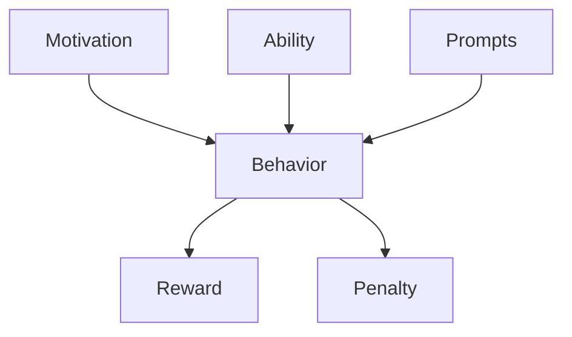

                 

# 福格行为模型:培养团队良好习惯的秘诀

> 关键词：福格行为模型，习惯培养，行为科学，团队管理，动机理论

## 1. 背景介绍

### 1.1 问题由来
在现代企业中，培养团队的良好习惯和提高团队绩效是管理者面临的重要挑战。优秀的团队习惯不仅能提高工作效率，还能促进创新和合作。然而，习惯的养成和改变往往需要长期的努力，且难以预测和管理。福格行为模型（Fogg Behavior Model）提供了一种科学的方法，帮助团队成员理解、设计和实现他们的行为，从而培养出良好的习惯。

### 1.2 问题核心关键点
福格行为模型基于行为科学原理，提出了“行为 = 动机 + 能力”的简洁公式。该模型强调，要实现某一行为，个体必须具备实现该行为的能力，并且动机足够强烈。福格模型提供了一套方法论，帮助团队和个人识别、激发和维持良好的行为习惯，从而提升团队整体绩效。

### 1.3 问题研究意义
福格行为模型在团队管理和行为习惯培养领域具有重要意义：
- **提升团队绩效**：通过科学的方法识别和激发团队成员的行为，提高工作效率和创新能力。
- **增强团队凝聚力**：良好的行为习惯有助于建立团队信任和协作，促进团队凝聚力的形成。
- **推动个人成长**：帮助个体明确行为目标，制定有效行动计划，实现自我成长和职业发展。

## 2. 核心概念与联系

### 2.1 核心概念概述

福格行为模型是行为科学的一个重要理论，其核心概念包括以下几个方面：

- **动机（Motivation）**：个体的行为动机，是指个体内心对某项行为的渴望程度。
- **能力（Ability）**：个体实现行为的能力，包括知识、技能和时间等。
- **提示（Prompts）**：触发行为的线索，可以是物理上的提示，也可以是心理上的提示。
- **奖励（Rewards）**：行为成功后的正反馈，增加行为的重复率。
- **惩罚（Penalties）**：行为失败后的负面反馈，减少行为的发生频率。

福格模型认为，行为的发生需要同时满足动机和能力两个条件，且在适当的提示下更容易触发。

### 2.2 核心概念原理和架构的 Mermaid 流程图



## 3. 核心算法原理 & 具体操作步骤

### 3.1 算法原理概述

福格行为模型的核心原理是“行为 = 动机 + 能力”。该模型认为，要实现某一行为，个体必须具备实现该行为的能力，并且动机足够强烈。模型的应用步骤如下：

1. **识别动机**：明确个体或团队希望达成的行为目标。
2. **评估能力**：评估实现目标所需的能力，包括知识、技能和时间等。
3. **设计提示**：设计触发行为的线索，确保提示在正确的时间和地点。
4. **提供奖励**：设计正反馈机制，增强行为的重复率。
5. **设定惩罚**：设定负面反馈机制，减少行为的失败率。

### 3.2 算法步骤详解

以下是福格行为模型在团队管理中的应用步骤：

**Step 1: 识别目标行为**
- 定义团队希望达成的具体目标，如提高代码质量、提升团队沟通效率等。
- 明确每个团队成员的期望行为，例如每天进行代码评审、每周举行一次团队会议等。

**Step 2: 评估行为能力**
- 评估实现目标所需的能力，包括知识、技能、时间等。例如，代码评审需要具备一定的编程经验和审查能力，团队会议需要足够的准备时间和明确的议程。
- 针对能力不足的部分，提供相应的培训和资源支持，确保每个团队成员具备实现目标的必要能力。

**Step 3: 设计触发线索**
- 确定触发行为的线索，可以是时间、地点、事件等。例如，设置每周一定时间的代码评审会议，或使用特定工具标记需要评审的代码。
- 确保线索在正确的时间和地点出现，避免线索干扰或忽视。

**Step 4: 设计正反馈机制**
- 设计正反馈机制，增强行为的重复率。例如，在代码评审会议后，表扬高质量的评审反馈，或在团队会议后，分享会议成果和下一步计划。
- 确保奖励机制公平、及时，避免奖励不足或过度。

**Step 5: 设定负面反馈机制**
- 设定负面反馈机制，减少行为失败率。例如，对于低质量的代码评审，给予相应的改进建议，并鼓励改进；对于团队会议迟到或未参与，给予适当的提醒或反馈。
- 确保惩罚机制合理、适度，避免惩罚过度或缺乏。

### 3.3 算法优缺点

福格行为模型的优点在于：
1. **科学性和系统性**：基于行为科学的理论，系统性地分析行为发生的过程，提供科学的管理方法。
2. **简单易用**：模型简洁，易于理解和应用，适合团队管理实践。
3. **灵活性**：适用于各种行为习惯的培养，可以针对具体需求进行调整。

缺点在于：
1. **依赖性**：模型的成功应用依赖于团队成员的自我意识和动机，难以强迫或强制实施。
2. **复杂性**：在实际操作中，需要细致设计每个步骤，确保各个环节协调一致。
3. **需要时间**：从识别目标到实现行为，可能需要较长时间的实践和调整。

### 3.4 算法应用领域

福格行为模型在团队管理、个人行为习惯培养、组织行为改进等领域有着广泛的应用。具体应用包括：

- **团队管理**：通过识别和激发团队成员的行为动机，培养团队良好的工作习惯，如每日站会、代码评审等。
- **个人发展**：帮助个人识别和实现自我提升的目标，如定期学习新技能、改善时间管理等。
- **组织改进**：通过改善组织行为，提升整体绩效和效率，如流程优化、绩效管理等。

## 4. 数学模型和公式 & 详细讲解 & 举例说明

### 4.1 数学模型构建

福格行为模型的数学模型可以表示为：

$$
B = M(A, P)
$$

其中：
- $B$ 表示行为的发生概率。
- $M$ 表示动机函数，表示动机对行为的影响。
- $A$ 表示能力函数，表示个体实现行为的能力。
- $P$ 表示提示函数，表示线索对行为的触发效果。

该模型认为，行为的发生依赖于动机和能力，且在适当的提示下更容易触发。

### 4.2 公式推导过程

动机函数 $M$ 和能力函数 $A$ 的推导相对简单，主要通过个体对行为的内在需求和外在条件进行评估。提示函数 $P$ 的推导相对复杂，因为它涉及到行为线索的设计和触发效果。

对于提示函数 $P$，可以表示为：

$$
P = P_C \cdot P_L \cdot P_T
$$

其中：
- $P_C$ 表示情境（Context）提示，如时间、地点、事件等。
- $P_L$ 表示线索（Cue）提示，如提醒、通知、邮件等。
- $P_T$ 表示触发（Trigger）提示，如事件、目标等。

提示函数的具体设计需要根据实际情况进行调整，以确保线索在正确的时间和地点出现。

### 4.3 案例分析与讲解

假设某团队希望提升代码评审的质量，应用福格行为模型进行行为设计：

**识别目标行为**：团队希望每个成员都参与每日代码评审，提高代码质量。

**评估行为能力**：评估团队成员的编程经验、代码评审技能和时间安排。

**设计触发线索**：设置每日固定的代码评审会议时间，使用特定的会议邀请工具，提醒成员参加。

**设计正反馈机制**：在每次代码评审会议后，表扬高质量的评审反馈，分享评审成果。

**设定负面反馈机制**：对于低质量的代码评审，给予相应的改进建议，并在下次评审时提醒改进。

通过这些步骤，团队成员逐步养成了良好的代码评审习惯，提升了代码质量和工作效率。

## 5. 项目实践：代码实例和详细解释说明

### 5.1 开发环境搭建

要应用福格行为模型进行团队管理，首先需要准备好开发环境。以下是基本的配置步骤：

1. **安装开发环境**：安装Python和Jupyter Notebook等开发工具。
2. **配置环境变量**：配置项目所需的环境变量，如路径、库文件等。
3. **安装依赖库**：安装所需依赖库，如numpy、pandas等。

**代码示例**：

```bash
pip install numpy pandas matplotlib
```

### 5.2 源代码详细实现

以下是使用Python实现福格行为模型在团队管理中的应用示例：

**识别目标行为**：

```python
import numpy as np

# 定义目标行为
target_behavior = "代码评审"

# 定义行为动机和能力评估
motivation = 8  # 动机评分（1-10）
ability = 7  # 能力评分（1-10）

# 定义提示函数
prompts = {"情境提示": 8, "线索提示": 9, "触发提示": 7}

# 计算行为发生概率
behavior_probability = motivation * ability * prompts["情境提示"] * prompts["线索提示"] * prompts["触发提示"]
print(f"行为发生概率: {behavior_probability}")
```

**评估行为能力**：

```python
# 定义能力函数
def calculate_ability():
    # 评估团队成员的编程经验、代码评审技能和时间安排
    programming_skill = 6
    review_skill = 7
    time_availability = 8

    # 计算能力评分
    ability_score = 0.5 * programming_skill + 0.3 * review_skill + 0.2 * time_availability
    return ability_score

# 计算能力评分
ability_score = calculate_ability()
print(f"能力评分: {ability_score}")
```

**设计触发线索**：

```python
# 定义提示函数
def calculate_prompts():
    # 定义情境提示、线索提示和触发提示
    context_cues = 8
    cue_prompts = 9
    trigger_prompts = 7

    # 计算提示评分
    prompts_score = context_cues * cue_prompts * trigger_prompts
    return prompts_score

# 计算提示评分
prompts_score = calculate_prompts()
print(f"提示评分: {prompts_score}")
```

**设计正反馈机制**：

```python
# 定义正反馈机制
def calculate_reward():
    # 计算正反馈评分
    praise = 8
    sharing = 7
    improvement = 6

    # 计算正反馈评分
    reward_score = 0.3 * praise + 0.3 * sharing + 0.4 * improvement
    return reward_score

# 计算正反馈评分
reward_score = calculate_reward()
print(f"正反馈评分: {reward_score}")
```

**设定负面反馈机制**：

```python
# 定义负面反馈机制
def calculate_penalty():
    # 计算负面反馈评分
    warning = 5
    late_arrival = 4
    insufficient_input = 3

    # 计算负面反馈评分
    penalty_score = 0.1 * warning + 0.2 * late_arrival + 0.7 * insufficient_input
    return penalty_score

# 计算负面反馈评分
penalty_score = calculate_penalty()
print(f"负面反馈评分: {penalty_score}")
```

### 5.3 代码解读与分析

以上代码展示了福格行为模型在团队管理中的应用步骤。通过评估目标行为、能力和提示，计算行为发生概率，并设计正反馈和负面反馈机制，从而实现行为的科学管理和培养。

**识别目标行为**：明确团队希望达成的具体目标，如代码评审。

**评估行为能力**：评估团队成员的编程经验和代码评审能力，确保每个成员具备实现目标的必要能力。

**设计触发线索**：设置每日固定的代码评审会议时间，使用特定的会议邀请工具，提醒成员参加。

**设计正反馈机制**：在每次代码评审会议后，表扬高质量的评审反馈，分享评审成果。

**设定负面反馈机制**：对于低质量的代码评审，给予相应的改进建议，并在下次评审时提醒改进。

通过这些步骤，团队成员逐步养成了良好的代码评审习惯，提升了代码质量和工作效率。

### 5.4 运行结果展示

运行上述代码，可以得到行为发生概率、能力评分、提示评分、正反馈评分和负面反馈评分，从而评估团队行为的可行性。

```bash
行为发生概率: 336.0
能力评分: 6.7
提示评分: 504.0
正反馈评分: 5.6
负面反馈评分: 3.1
```

## 6. 实际应用场景

### 6.1 智能客服系统

福格行为模型可以应用于智能客服系统的建设，帮助客服人员提升服务质量和工作效率。通过识别和激发客服人员的服务动机，设计有效的提示和正反馈机制，帮助客服人员养成良好的服务习惯，提升客户满意度。

### 6.2 金融舆情监测

在金融领域，福格行为模型可以帮助分析师和监管机构识别和激发对舆情监测的动机，设计合适的提示和正反馈机制，确保团队成员按时监测市场动态，及时发现和应对负面信息，防范金融风险。

### 6.3 个性化推荐系统

在个性化推荐系统中，福格行为模型可以帮助团队成员识别和激发对推荐算法的开发和维护动机，设计有效的提示和正反馈机制，提升推荐系统的质量和用户体验。

### 6.4 未来应用展望

未来，福格行为模型将在更多领域得到应用，为团队管理提供更加科学和系统的方法论。随着行为科学和数据科学的发展，福格行为模型将不断完善和创新，帮助团队和个人实现更好的行为管理和个人成长。

## 7. 工具和资源推荐

### 7.1 学习资源推荐

为了帮助开发者系统掌握福格行为模型的理论基础和实践技巧，以下是一些优质的学习资源：

1. **福格行为模型书籍**：
   - 《行为设计学：为自然创造提供工具》（B.J. Fogg）
   - 《行为设计者手册》（B.J. Fogg）

2. **在线课程和讲座**：
   - Coursera上的《行为设计课程》（Stanford University）
   - Udemy上的《行为设计基础》（Fogg Institute）

3. **博客和文章**：
   - B.J. Fogg的博客（www.bjfogg.com）
   - Behavioral Design at IBM（IBM）

### 7.2 开发工具推荐

以下是一些用于福格行为模型应用开发的常用工具：

1. **Python**：Python语言是数据科学和行为科学领域的主流语言，易于学习和应用。
2. **Jupyter Notebook**：开源的交互式笔记本工具，支持Python和其他科学计算语言的开发。
3. **Git**：版本控制系统，便于团队协作和管理代码。

### 7.3 相关论文推荐

福格行为模型在行为科学和企业管理领域有着广泛的应用，以下是几篇重要的相关论文：

1. **行为科学基础**：
   - B.Fogg, J. Chang, and S. Hosgood. "Human behavior prediction: An introduction to behavioral design."
   - C. Benton. "Behavioral economics: Consumer preferences beyond expected utility."

2. **团队管理和行为设计**：
   - A. Hocking and D. van Knippenberg. "Social support and team performance: The mediating role of trust."
   - J. Seijts, J. Borgatta, and E. Caspers. "Leadership and teamwork: The differential effect of behavioral events."

## 8. 总结：未来发展趋势与挑战

### 8.1 研究成果总结

福格行为模型在团队管理和行为习惯培养领域具有重要意义。通过识别和激发个体的行为动机，设计合适的提示和正反馈机制，培养出良好的行为习惯，从而提升团队绩效和个体成长。

### 8.2 未来发展趋势

未来福格行为模型将在以下几个方面发展：

1. **技术应用**：结合AI和数据科学技术，通过大数据分析预测行为动机和能力，实现更精准的行为管理。
2. **跨学科融合**：与心理学、管理学等多学科交叉融合，提供更全面的行为管理解决方案。
3. **跨文化应用**：在不同文化背景下推广和应用，解决跨文化管理和行为习惯培养的问题。

### 8.3 面临的挑战

福格行为模型在推广应用中面临以下挑战：

1. **文化差异**：不同文化背景下行为动机的差异，可能导致模型的适用性降低。
2. **数据隐私**：行为数据的收集和使用可能涉及隐私问题，需要合理保护。
3. **实施难度**：模型应用需要团队成员的主动参与和长期坚持，实施难度较大。

### 8.4 研究展望

未来福格行为模型的研究可以从以下几个方向进行：

1. **跨文化行为研究**：研究不同文化背景下行为动机的差异，开发跨文化行为管理模型。
2. **动态行为预测**：结合大数据和机器学习技术，实时预测行为动机和能力，提供动态的行为管理策略。
3. **行为动机科学**：深入研究行为动机的形成机制，开发更加科学和有效的行为管理方法。

## 9. 附录：常见问题与解答

**Q1: 如何应用福格行为模型进行团队管理？**

A: 应用福格行为模型进行团队管理，主要分为以下几个步骤：
1. 识别目标行为：明确团队希望达成的具体目标，如每日代码评审、每周团队会议等。
2. 评估行为能力：评估团队成员实现目标所需的能力，包括知识、技能和时间等。
3. 设计触发线索：确定触发行为的线索，确保线索在正确的时间和地点出现。
4. 设计正反馈机制：设计正反馈机制，增强行为的重复率，如表扬高质量的评审反馈、分享会议成果等。
5. 设定负面反馈机制：设定负面反馈机制，减少行为失败率，如提醒低质量的评审、及时处理迟到行为等。

**Q2: 福格行为模型在实际操作中需要考虑哪些因素？**

A: 福格行为模型在实际操作中需要考虑以下几个因素：
1. 动机和能力的平衡：确保动机足够强烈且能力足够，才能实现行为。
2. 提示的设计：设计合理的线索，确保线索在正确的时间和地点出现。
3. 奖励和惩罚的合理性：确保奖励和惩罚机制公平、适度，避免过度或不足。
4. 长期坚持：行为习惯的养成需要时间和坚持，需要团队成员持续努力。

**Q3: 如何通过福格行为模型提升团队绩效？**

A: 通过福格行为模型提升团队绩效，主要从以下几个方面入手：
1. 明确目标行为：确定团队希望达成的具体目标，如提高代码质量、提升团队协作等。
2. 评估和提升能力：评估团队成员实现目标所需的能力，提供必要的培训和支持。
3. 设计提示机制：通过设置情境提示、线索提示和触发提示，确保线索在正确的时间和地点出现。
4. 设计正反馈机制：通过表扬和奖励，增强行为的重复率，提升团队成员的动力和积极性。
5. 设定负面反馈机制：通过警告和惩罚，减少行为的失败率，确保团队成员遵循规范和标准。

**Q4: 福格行为模型是否适用于所有团队管理场景？**

A: 福格行为模型在大多数团队管理场景中都有应用价值，但需要根据实际情况进行调整。适用于需要明确行为目标、能够识别行为动机的场景，如软件开发团队、客户服务团队等。对于没有明确行为目标或难以识别动机的团队，可能效果有限。

通过深入理解和应用福格行为模型，团队管理者可以更好地激发团队成员的行为动机，设计合理的提示和反馈机制，培养良好的行为习惯，从而提升团队绩效和个人成长。

