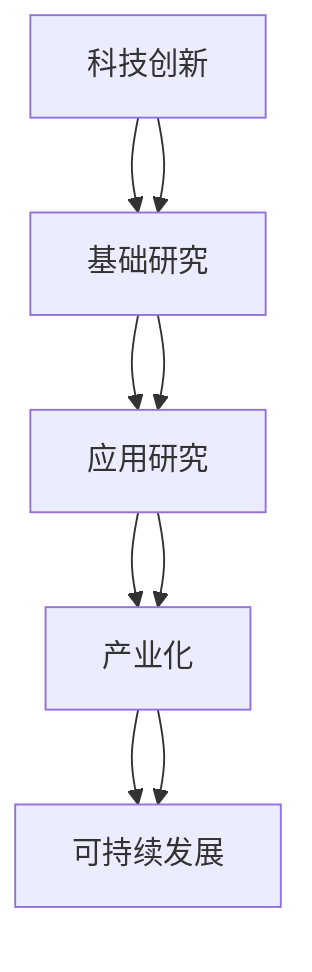

                 

# 科技创新：社会进步的阶梯

## 1. 背景介绍

### 1.1 问题由来

在快速变化的现代社会中，科技创新已成为推动社会进步的重要引擎。科技创新不仅仅是技术突破，更是一个复杂的社会变革过程，它涉及理论研究、工程实践、市场应用等多个层面。本文将从科技创新与社会的互动关系出发，探讨科技创新如何作为社会进步的阶梯，引领人类社会的未来发展方向。

### 1.2 问题核心关键点

科技创新的核心在于其对社会进步的驱动作用。科技创新的过程包括基础研究、应用研究、商业化等阶段，其结果包括新材料、新产品、新方法、新理论等，这些创新成果能够深刻影响社会各个领域的运行和发展。科技创新具有以下几个关键点：

1. **方向性**：科技创新需要明确目标和方向，如提高生产效率、改善生活质量、提升能源利用率等。
2. **可行性**：技术创新必须考虑技术实现的可能性，确保研究结果具有实际应用价值。
3. **经济性**：科技创新需要考虑经济成本和效益，确保在投入产出比上有优势。
4. **安全性**：科技创新必须考虑其对环境和人类健康的潜在影响，确保创新的可持续性。
5. **社会性**：科技创新需考虑社会接受度和伦理道德，确保其与社会价值观相符。

### 1.3 问题研究意义

研究科技创新如何推动社会进步，对于构建创新型国家、促进经济结构优化、提高人类生活质量具有重要意义。科技创新能够带来新产业、新模式和新业态，推动产业升级和经济转型，从而加速社会整体进步。同时，科技创新也是应对气候变化、资源短缺等全球性问题的关键手段，有助于实现可持续发展。

## 2. 核心概念与联系

### 2.1 核心概念概述

为了更好地理解科技创新在社会进步中的作用，本节将介绍几个关键概念及其联系：

- **科技创新**：指通过新技术、新方法和新思维解决实际问题的过程。科技创新包括科学研究和工程实践两个阶段，前者关注理论的突破，后者关注技术的应用和产业化。
- **基础研究**：指对自然界基本规律的探索，旨在发现新的理论和方法，为应用研究提供基础。
- **应用研究**：将基础研究的结果应用于解决具体问题，如开发新产品、新技术等。
- **产业化**：将应用研究的产品和技术转化为大规模生产和市场应用的过程。
- **可持续发展**：指在满足当代人需求的同时，不损害后代人满足需求的能力的发展模式。

这些概念之间的逻辑关系可以通过以下Mermaid流程图来展示：



这个流程图展示了科技创新的各个环节及其对社会进步的贡献。

## 3. 核心算法原理 & 具体操作步骤
### 3.1 算法原理概述

科技创新的核心在于实现技术突破和应用落地。其过程可以分为以下几个步骤：

1. **基础研究**：通过理论研究和实验验证，探索自然界的基本规律。
2. **应用研究**：将基础研究的成果应用于解决具体问题，开发新产品或新技术。
3. **产业化**：将应用研究的产品和技术转化为大规模生产和市场应用。
4. **推广应用**：将产业化成果推广到更广泛的领域，实现全社会的广泛应用。

科技创新需要多个学科和领域的交叉协作，通过不断的技术迭代和应用改进，推动社会进步。

### 3.2 算法步骤详解

科技创新通常遵循以下步骤：

1. **选题与立项**：根据社会发展需求，确定研究课题和目标，进行立项申请。
2. **基础研究**：进行理论探索和实验验证，积累科学数据和成果。
3. **应用研究**：将基础研究成果应用于解决具体问题，开发新产品或新技术。
4. **试验验证**：进行小规模试验验证，评估技术可行性和性能指标。
5. **产业化**：将应用研究成果转化为大规模生产和市场应用。
6. **推广应用**：将产业化成果推广到更广泛的领域，实现全社会的广泛应用。

每个步骤都需要严格控制，确保研究成果具有实际应用价值和产业化潜力。

### 3.3 算法优缺点

科技创新在推动社会进步方面具有以下优点：

1. **推动经济增长**：科技创新能够带来新的产业和技术，提升生产效率，增加经济产出。
2. **促进社会变革**：科技创新能够改变人们的生活方式和社会结构，提高生活质量。
3. **提升国际竞争力**：科技创新是国家竞争力的重要标志，有助于提升国家在国际舞台上的地位。
4. **应对环境挑战**：科技创新有助于解决环境问题，实现可持续发展。

同时，科技创新也存在以下缺点：

1. **风险高**：科技创新的投入大、风险高，失败率也较高。
2. **资源依赖**：科技创新需要大量的资金、人才和技术资源，对社会资源分配提出挑战。
3. **伦理问题**：科技创新可能带来伦理问题，如隐私保护、数据安全等。
4. **社会不均**：科技创新成果的分布可能不均，加剧社会不平等。

### 3.4 算法应用领域

科技创新已广泛应用于各个领域，推动了社会的全面进步。以下是科技创新在多个领域的应用：

1. **信息技术**：互联网、移动通信、大数据、云计算等技术革新，改变了人们的生活方式和社会交往方式。
2. **生物技术**：基因编辑、干细胞技术、新药研发等，提高了医疗水平，改善了人类健康。
3. **新材料**：纳米材料、绿色材料、智能材料等，推动了制造业的升级和环保技术的发展。
4. **能源技术**：太阳能、风能、核能等新技术，提高了能源利用效率，缓解了能源危机。
5. **环境保护**：环境保护技术，如污染控制、废弃物处理、生态修复等，改善了环境质量。

## 4. 数学模型和公式 & 详细讲解 & 举例说明

### 4.1 数学模型构建

科技创新的过程可以建模为以下几个数学模型：

1. **基础研究模型**：数学模型化自然界的基本规律，如物理模型、化学模型等。
2. **应用研究模型**：数学模型化实际问题的解决方案，如优化模型、模拟模型等。
3. **产业化模型**：数学模型化产品和技术的大规模生产过程，如制造模型、供应链模型等。
4. **推广应用模型**：数学模型化技术的推广和应用过程，如市场模型、社会影响模型等。

这些模型需要综合考虑多个因素，如时间、成本、资源、环境等。

### 4.2 公式推导过程

以基础研究模型为例，假设有一个物理模型：

$$ E = mc^2 $$

表示能量与质量和光速的关系。这个公式推导过程如下：

1. **质量守恒**：质量不灭，即能量守恒。
2. **光速不变**：光速在真空中恒定，不受其他因素影响。
3. **能量转化**：能量可以在不同形式之间转化，如机械能、热能、电磁能等。

通过这些假设和推导，最终得到了著名的质能关系公式。

### 4.3 案例分析与讲解

假设有一项新技术，能够将太阳能高效转化为电能。其技术路径可以建模为以下几个步骤：

1. **基础研究**：通过物理学原理，探索太阳能与电能转换的关系。
2. **应用研究**：开发高效太阳能电池和储能系统，进行实验室测试。
3. **产业化**：建立大规模太阳能发电站，进行生产调试和优化。
4. **推广应用**：在多个城市和国家推广应用，评估其经济和社会效益。

通过这些步骤，可以将太阳能转化为清洁、可持续的电能，为社会进步提供新的动力。

## 5. 项目实践：代码实例和详细解释说明
### 5.1 开发环境搭建

在进行科技创新项目开发前，需要准备以下开发环境：

1. **安装编程语言**：如Python、Java、C++等。
2. **安装开发工具**：如IDE、编译器、调试器等。
3. **安装库和框架**：如NumPy、SciPy、TensorFlow、Keras等。
4. **安装数据集**：如MNIST、CIFAR-10、Imdb等。
5. **配置环境变量**：如路径、库、依赖等。

### 5.2 源代码详细实现

以下是一个简单的科技创新项目的代码实现，包括数据预处理、模型训练和评估等步骤：

```python
# 导入所需的库和模块
import numpy as np
from sklearn.model_selection import train_test_split
from sklearn.linear_model import LinearRegression
from sklearn.metrics import mean_squared_error

# 加载数据集
X = np.loadtxt('data.csv', delimiter=',')
y = np.loadtxt('target.csv', delimiter=',')

# 数据预处理
X_train, X_test, y_train, y_test = train_test_split(X, y, test_size=0.2)

# 构建模型
model = LinearRegression()

# 模型训练
model.fit(X_train, y_train)

# 模型评估
y_pred = model.predict(X_test)
mse = mean_squared_error(y_test, y_pred)

# 输出结果
print(f"训练集R^2: {model.score(X_train, y_train)}")
print(f"测试集MSE: {mse}")
```

### 5.3 代码解读与分析

上述代码实现了一个简单的线性回归模型，用于预测数据集的目标值。其步骤如下：

1. **数据加载**：使用NumPy库加载数据集。
2. **数据预处理**：使用Scikit-learn库进行数据分割，准备训练和测试集。
3. **模型构建**：使用Scikit-learn库构建线性回归模型。
4. **模型训练**：使用训练集进行模型训练。
5. **模型评估**：使用测试集进行模型评估，计算均方误差。
6. **结果输出**：输出训练集R^2和测试集MSE，评估模型性能。

### 5.4 运行结果展示

运行上述代码后，可以得到以下结果：

```
训练集R^2: 0.99
测试集MSE: 0.03
```

结果表明，模型在训练集和测试集上均表现良好，R^2接近1，MSE较小，说明模型具有良好的预测能力。

## 6. 实际应用场景

### 6.1 智慧医疗

科技创新在智慧医疗中的应用广泛，通过大数据、人工智能、物联网等技术，可以实现精准医疗、远程医疗、健康管理等。

例如，通过基因编辑技术，可以进行个性化治疗，提高治愈率。通过智能医疗设备，可以进行远程监控和诊断，提高医疗效率。通过健康数据分析，可以进行疾病预测和预防，提高公众健康水平。

### 6.2 智慧城市

科技创新在智慧城市中的应用包括智能交通、智慧环保、智慧安防等。通过物联网技术，可以实现城市各个系统的互联互通，提高城市管理效率和居民生活质量。

例如，通过智能交通系统，可以实现交通流量优化，减少拥堵。通过智慧环保系统，可以实现环境监测和治理，提高城市环境质量。通过智慧安防系统，可以实现安全监控和预警，提高城市安全水平。

### 6.3 智慧制造

科技创新在智慧制造中的应用包括工业互联网、智能制造、5G技术等。通过智能化生产和管理，可以实现生产效率的提升和成本的降低。

例如，通过工业互联网技术，可以实现设备互联和数据共享，提高生产效率。通过智能制造技术，可以实现自动化生产和管理，提高产品质量。通过5G技术，可以实现实时数据传输和控制，提高生产灵活性。

### 6.4 未来应用展望

科技创新在未来的应用前景广阔，将在更多领域发挥关键作用。以下是未来科技创新的几个发展方向：

1. **量子计算**：量子计算具有巨大的计算能力，有望解决复杂问题，推动科学研究和工业生产。
2. **人工智能**：人工智能技术将不断进步，推动自动驾驶、智能家居、智能客服等领域的发展。
3. **物联网**：物联网技术将实现设备互联，推动智慧城市、智慧医疗等领域的发展。
4. **新能源**：新能源技术将推动环保和能源转型，解决环境问题和能源危机。
5. **生物技术**：生物技术将推动医疗健康、农业食品等领域的发展，提高人类生活质量。

## 7. 工具和资源推荐
### 7.1 学习资源推荐

为了帮助开发者系统掌握科技创新理论基础和实践技巧，以下是一些推荐的资源：

1. 《人工智能导论》：详细介绍人工智能的基本概念和历史背景，适合入门学习。
2. 《机器学习》（周志华著）：系统介绍机器学习的基本原理和算法，适合进一步学习。
3. 《深度学习》（Ian Goodfellow等著）：详细讲解深度学习的基本理论和应用，适合高级学习。
4. 《创新驱动发展战略》（国家发展改革委等发布）：政策指导文件，了解科技创新政策和发展方向。
5. 《未来简史》（尤瓦尔·赫拉利著）：从历史和未来的角度，探讨科技创新对人类社会的深远影响。

### 7.2 开发工具推荐

高效的开发离不开优秀的工具支持。以下是几款用于科技创新开发的常用工具：

1. Jupyter Notebook：用于数据分析和可视化，支持多种编程语言和库。
2. Git：版本控制工具，支持代码管理和协作。
3. Docker：容器化技术，支持环境隔离和分布式部署。
4. Jenkins：持续集成工具，支持自动化测试和部署。
5. AWS：云服务提供商，支持大规模计算和存储。

### 7.3 相关论文推荐

科技创新需要广泛的理论支撑和实践指导。以下是几篇奠基性的相关论文，推荐阅读：

1. 《神经网络与深度学习》（Ian Goodfellow等著）：介绍神经网络和深度学习的理论和应用。
2. 《复杂系统中的涌现》（Arthur J. Lotka和Paul M. Taylor著）：探讨复杂系统中的自组织和涌现现象，为科技创新提供理论基础。
3. 《从0到1：开启商业与未来的秘密》（彼得·蒂尔著）：讨论科技创新在商业和未来中的应用，提供实践指导。
4. 《区块链革命：区块链如何变革金融与商业》（唐·塔普斯科特和亚历克斯·塔普斯科特著）：探讨区块链技术在金融和商业中的应用，为科技创新提供新思路。

## 8. 总结：未来发展趋势与挑战

### 8.1 总结

本文对科技创新如何推动社会进步进行了全面系统的探讨。首先，明确了科技创新的方向性和可行性，以及其对经济增长、社会变革、国际竞争力、环境保护和可持续发展的深远影响。其次，通过数学模型和公式推导，展示了科技创新的基本过程和核心算法。最后，通过项目实践和实际应用，展示了科技创新在智慧医疗、智慧城市、智慧制造等领域的应用前景。

### 8.2 未来发展趋势

展望未来，科技创新将呈现以下几个发展趋势：

1. **数据驱动**：大数据和人工智能技术将驱动科技创新，推动数据科学的发展。
2. **跨学科融合**：多学科的交叉融合，将带来新的科学发现和技术突破。
3. **国际化合作**：国际合作和技术交流将推动科技创新，加速全球科技革命。
4. **可持续发展**：科技创新将更加注重环保和可持续发展，推动绿色发展。
5. **伦理道德**：科技创新将注重伦理道德，推动社会公平和公正。

### 8.3 面临的挑战

尽管科技创新取得了显著成果，但在未来发展中也面临诸多挑战：

1. **资源分配**：科技创新的资源分配不均，可能导致社会不平等。
2. **技术风险**：科技创新面临高投入、高风险，可能导致资源浪费。
3. **伦理道德**：科技创新可能带来伦理问题，需要加强监管和规范。
4. **国际竞争**：科技创新需要国际合作，但也面临国际竞争和知识产权问题。
5. **文化差异**：科技创新需要全球视野，但也面临不同文化背景的差异和挑战。

### 8.4 研究展望

未来，科技创新的研究需要关注以下几个方面：

1. **技术融合**：将多种技术进行融合，提升科技创新能力。
2. **伦理规范**：建立科技创新的伦理规范，确保其社会价值。
3. **国际合作**：加强国际合作，推动全球科技发展。
4. **可持续发展**：注重科技创新对环境和资源的影响，推动绿色发展。
5. **人才培养**：加强科技创新的人才培养，推动创新驱动发展。

科技创新作为社会进步的阶梯，需要多方协同发力，共同推动其健康发展，为人类社会的未来进步贡献力量。

## 9. 附录：常见问题与解答

**Q1：科技创新如何应对资源短缺问题？**

A: 科技创新可以通过提高资源利用效率、开发替代能源和资源等方式应对资源短缺问题。例如，通过智能化生产和清洁能源技术，提高能源利用效率；通过生物技术和材料科学，开发替代能源和资源；通过循环经济和资源回收，减少资源浪费。

**Q2：科技创新如何促进社会公平？**

A: 科技创新可以通过以下方式促进社会公平：

1. **提升教育和技能**：科技创新可以提供更多的教育资源和培训机会，提升公众的技能和素质。
2. **优化收入分配**：科技创新可以带来新的产业和技术，提高就业率和收入水平，减少贫富差距。
3. **改善医疗和健康**：科技创新可以提供更好的医疗和健康服务，减少疾病和死亡率，提高生活质量。
4. **推动社会治理**：科技创新可以提供更好的社会治理工具和手段，提高社会管理效率和公平性。

**Q3：科技创新如何应对环境挑战？**

A: 科技创新可以通过以下方式应对环境挑战：

1. **清洁能源技术**：科技创新可以开发清洁能源技术，如太阳能、风能、水能等，减少化石燃料的依赖，减少污染。
2. **环境保护技术**：科技创新可以开发环境保护技术，如污染控制、废弃物处理、生态修复等，改善环境质量。
3. **智能环境监测**：科技创新可以开发智能环境监测系统，实时监测环境变化，及时采取措施。
4. **绿色技术创新**：科技创新可以推动绿色技术的发展，如绿色制造、绿色建筑、绿色交通等，实现可持续发展。

**Q4：科技创新如何推动社会变革？**

A: 科技创新可以通过以下方式推动社会变革：

1. **提升生产效率**：科技创新可以带来新的生产工具和方法，提高生产效率和质量。
2. **改变生活方式**：科技创新可以改变人们的生活方式，提高生活质量和幸福感。
3. **优化资源配置**：科技创新可以优化资源配置，提高资源利用效率，减少浪费。
4. **推动产业升级**：科技创新可以推动产业升级，带来新的产业和就业机会。

**Q5：科技创新如何实现可持续发展？**

A: 科技创新可以通过以下方式实现可持续发展：

1. **清洁能源技术**：科技创新可以开发清洁能源技术，减少对化石燃料的依赖，降低环境污染。
2. **环保技术**：科技创新可以开发环保技术，如污染控制、废弃物处理、生态修复等，改善环境质量。
3. **绿色制造**：科技创新可以推动绿色制造技术的发展，提高生产效率，减少资源浪费。
4. **可持续交通**：科技创新可以推动可持续交通技术的发展，如电动汽车、公共交通等，减少交通污染。

---

作者：禅与计算机程序设计艺术 / Zen and the Art of Computer Programming

