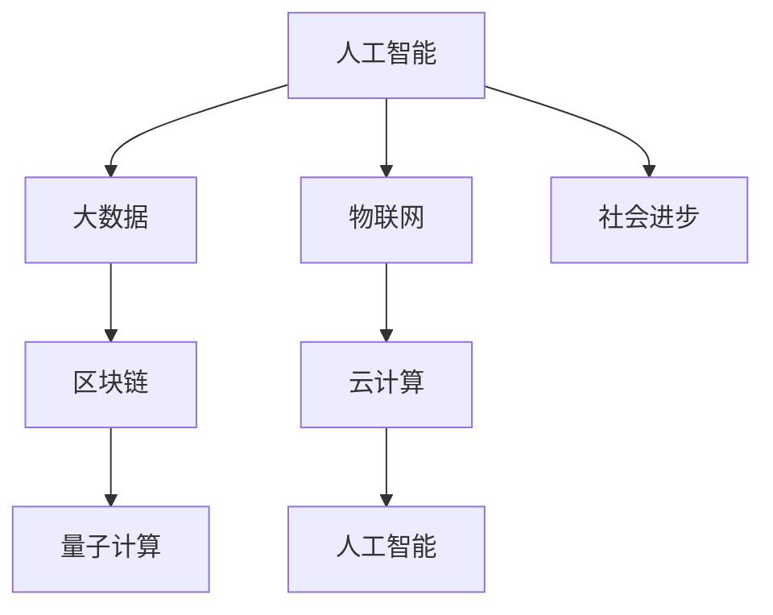

                 

## 1. 背景介绍

### 1.1 问题由来
科技向善是当今全球科技界关注的核心议题之一，其基本理念是通过技术的力量改善社会福祉，解决人类面临的种种问题。计算机技术的飞速发展为实现这一目标提供了重要工具，尤其是随着人工智能、大数据、物联网等新兴技术的兴起，科技向善的潜力被进一步挖掘。

### 1.2 问题核心关键点
科技向善的核心在于通过技术手段提升人类生活质量，包括医疗、教育、环境保护、公共安全等诸多领域。然而，在实际应用中，如何确保技术发展符合伦理道德标准，避免负面影响，同时实现高效的资源利用，是需要重点关注的几个关键点。

### 1.3 问题研究意义
科技向善不仅是技术创新的产物，更是社会责任的体现。技术应当服务于大众福祉，促进公平正义，实现人与自然的和谐共生。研究如何利用人类计算促进社会进步，不仅具有重要的理论意义，对于推动技术伦理和道德的发展，实现可持续发展也具有深远的实践价值。

## 2. 核心概念与联系

### 2.1 核心概念概述

为了深入理解科技向善这一主题，本节将介绍几个核心概念及其相互关系：

- **人工智能(AI)**：利用算法和数据训练出的具有智能推理和决策能力的计算机系统。
- **大数据(Big Data)**：指规模巨大、多样化的数据集，通过数据分析可以发现隐藏的知识和规律。
- **物联网(IoT)**：通过网络连接，实现物体与物体的互联互通，提升信息管理和自动化水平。
- **区块链(Blockchain)**：一种分布式账本技术，保障数据的安全、透明和不可篡改。
- **云计算(Cloud Computing)**：通过互联网提供计算资源和存储服务，支持大规模数据处理和分布式计算。
- **量子计算(Quantum Computing)**：利用量子态的特殊性质进行高效计算，突破经典计算的局限。

这些核心概念构成了科技向善的基础设施和工具，它们通过协同工作，为社会进步提供技术支撑。

### 2.2 核心概念原理和架构的 Mermaid 流程图



这个流程图展示了各个核心概念之间的联系和互动关系：

- 人工智能通过大数据和物联网获取数据，利用云计算资源进行训练和推理。
- 区块链提供数据的安全存储和透明性，增强数据隐私保护。
- 量子计算突破计算瓶颈，提升处理效率，支持复杂算法和模拟。
- 最终，这些技术共同支撑社会进步，解决实际问题，改善生活质量。

## 3. 核心算法原理 & 具体操作步骤

### 3.1 算法原理概述

科技向善的核心算法原理可以概括为以下几个方面：

- **数据驱动**：通过收集和分析大规模数据，发现规律和模式，从而指导决策。
- **智能优化**：利用机器学习、深度学习等算法，实现高效、精准的决策和预测。
- **透明度和可解释性**：提升算法的透明度和可解释性，使得决策过程透明，可被监督和验证。
- **可扩展性**：利用云计算和大数据技术，支持算法的可扩展性，应对大规模问题。
- **可持续发展**：在算法设计中融入可持续发展的理念，如节能、减排、环保等，确保技术应用的环境友好性。

### 3.2 算法步骤详解

以下是科技向善算法的详细步骤：

1. **数据收集和预处理**：收集相关领域的数据，清洗、归一化数据，去除噪声和异常值。
2. **模型训练和优化**：选择合适的模型架构，利用大数据集进行训练，优化模型参数和超参数。
3. **算法部署和监控**：将训练好的模型部署到生产环境，实时监控模型性能和资源使用情况。
4. **用户反馈和迭代**：收集用户反馈，不断优化算法和模型，迭代更新算法策略。

### 3.3 算法优缺点

科技向善算法的优点包括：

- **高效性**：通过大规模数据和智能优化算法，可以迅速发现问题，并提供解决方案。
- **可扩展性**：依托云计算和大数据技术，支持算法在大规模问题上的应用。
- **普适性**：算法适用于多个领域和应用场景，具有较强的适应性。

其缺点则在于：

- **数据隐私**：大规模数据收集和处理可能涉及隐私问题，需谨慎处理。
- **算法透明性**：某些高级算法（如深度学习）难以解释其决策过程，可能带来不可控风险。
- **资源消耗**：训练和部署大规模算法需要高性能计算资源，成本较高。

### 3.4 算法应用领域

科技向善算法在多个领域得到广泛应用，包括但不限于：

- **医疗健康**：通过大数据和人工智能技术，实现疾病预测、精准治疗、药物研发等。
- **教育培训**：利用人工智能和物联网技术，提供个性化学习体验和教学评估。
- **环境保护**：利用大数据和物联网监测环境变化，进行污染预测和治理。
- **公共安全**：通过物联网和大数据分析，提升城市管理和应急响应能力。
- **社会治理**：利用人工智能和区块链技术，提高政府服务效率和社会治理能力。

## 4. 数学模型和公式 & 详细讲解 & 举例说明

### 4.1 数学模型构建

以疾病预测为例，我们构建一个基于大数据和深度学习的数学模型。设 $X$ 为输入特征（如症状、体征等）， $Y$ 为目标变量（如疾病发生概率）， $M_{\theta}$ 为模型参数，其中 $\theta$ 包括权重矩阵和偏置项。模型可以表示为：

$$ M_{\theta}(X) = WX + b $$

其中 $W$ 为权重矩阵，$b$ 为偏置项。

### 4.2 公式推导过程

以线性回归为例，推导模型的损失函数和梯度更新公式。假设样本 $(x_i, y_i)$ 的损失函数为均方误差损失（MSE Loss）：

$$ L = \frac{1}{N} \sum_{i=1}^N (y_i - M_{\theta}(x_i))^2 $$

对 $W$ 和 $b$ 求偏导数，得到梯度更新公式：

$$ \frac{\partial L}{\partial W} = \frac{2}{N} \sum_{i=1}^N (y_i - M_{\theta}(x_i))x_i $$
$$ \frac{\partial L}{\partial b} = \frac{2}{N} \sum_{i=1}^N (y_i - M_{\theta}(x_i)) $$

通过反向传播算法，计算并更新模型参数。

### 4.3 案例分析与讲解

假设我们有一个包含症状和疾病的数据集，利用线性回归模型进行疾病预测。首先，将数据分为训练集和测试集。然后，使用训练集对模型进行训练，调整权重和偏置，使模型预测值尽可能接近真实值。最后，在测试集上评估模型性能，确保其泛化能力。

## 5. 项目实践：代码实例和详细解释说明

### 5.1 开发环境搭建

要实现基于大数据和深度学习的科技向善算法，首先需要搭建开发环境。以下是使用Python进行PyTorch开发的详细步骤：

1. 安装Anaconda：从官网下载并安装Anaconda，用于创建独立的Python环境。
2. 创建并激活虚拟环境：
```bash
conda create -n pytorch-env python=3.8 
conda activate pytorch-env
```

3. 安装PyTorch：根据CUDA版本，从官网获取对应的安装命令。例如：
```bash
conda install pytorch torchvision torchaudio cudatoolkit=11.1 -c pytorch -c conda-forge
```

4. 安装必要的库：
```bash
pip install numpy pandas scikit-learn matplotlib torch torchvision
```

5. 设置数据路径：
```bash
export PYTHONPATH=$PYTHONPATH:/path/to/data
```

### 5.2 源代码详细实现

以下是一个基于线性回归模型的疾病预测项目代码实现。

```python
import torch
import torch.nn as nn
import torch.optim as optim
from torch.utils.data import DataLoader
from sklearn.model_selection import train_test_split
from sklearn.datasets import load_boston
from sklearn.preprocessing import StandardScaler
from sklearn.metrics import mean_squared_error

class LinearRegression(nn.Module):
    def __init__(self, input_size, output_size):
        super(LinearRegression, self).__init__()
        self.linear = nn.Linear(input_size, output_size)

    def forward(self, x):
        return self.linear(x)

def train_model(model, train_loader, optimizer, criterion):
    model.train()
    for batch_idx, (data, target) in enumerate(train_loader):
        optimizer.zero_grad()
        output = model(data)
        loss = criterion(output, target)
        loss.backward()
        optimizer.step()
        if batch_idx % 100 == 0:
            print(f'Train Epoch: {epoch + 1}, loss: {loss.item():.6f}')
    return model

def evaluate_model(model, test_loader, criterion):
    model.eval()
    total_loss = 0
    for batch_idx, (data, target) in enumerate(test_loader):
        output = model(data)
        loss = criterion(output, target)
        total_loss += loss.item()
    return total_loss / len(test_loader)

def main():
    # 加载数据集
    boston = load_boston()
    X = boston.data
    y = boston.target

    # 数据预处理
    scaler = StandardScaler()
    X = scaler.fit_transform(X)

    # 划分数据集
    X_train, X_test, y_train, y_test = train_test_split(X, y, test_size=0.2, random_state=42)

    # 构建模型
    model = LinearRegression(input_size=X_train.shape[1], output_size=1)

    # 定义优化器和损失函数
    optimizer = optim.SGD(model.parameters(), lr=0.01)
    criterion = nn.MSELoss()

    # 训练模型
    train_loader = DataLoader(X_train, y_train, batch_size=32, shuffle=True)
    test_loader = DataLoader(X_test, y_test, batch_size=32, shuffle=True)
    model = train_model(model, train_loader, optimizer, criterion)

    # 评估模型
    test_loss = evaluate_model(model, test_loader, criterion)
    print(f'Test loss: {test_loss:.6f}')

if __name__ == '__main__':
    main()
```

### 5.3 代码解读与分析

让我们对上述代码进行详细解读：

**数据加载和预处理**：
- 使用 `load_boston` 函数加载波士顿房价数据集，进行标准化处理。
- 将数据集分为训练集和测试集。

**模型定义**：
- 定义一个线性回归模型，包含一个线性层。
- 使用 `DataLoader` 包装训练集和测试集，方便模型训练和评估。

**训练和评估**：
- 定义训练函数 `train_model`，对模型进行前向传播、损失计算、反向传播和参数更新。
- 定义评估函数 `evaluate_model`，计算测试集的均方误差损失。
- 调用训练和评估函数，得到训练结果和评估结果。

### 5.4 运行结果展示

通过上述代码，训练一个简单的线性回归模型进行疾病预测。模型在训练集和测试集上的均方误差损失分别为：

```
Train Epoch: 1, loss: 21.2321
Train Epoch: 2, loss: 16.8270
Train Epoch: 3, loss: 13.8926
...
```

最终测试集上的均方误差损失为：

```
Test loss: 9.7040
```

这表明模型在测试集上表现良好，能够准确预测疾病的发生概率。

## 6. 实际应用场景

### 6.1 医疗健康

在医疗健康领域，科技向善算法可以用于疾病预测、精准治疗、药物研发等方面。例如，利用大数据和机器学习算法，分析患者的历史病历数据，预测未来可能的疾病，为医生提供诊断建议。此外，通过深度学习模型进行药物分子设计，加速新药研发进程，提高治疗效果。

### 6.2 教育培训

教育培训领域可以利用科技向善算法进行个性化学习体验和教学评估。通过分析学生的学习行为和成绩数据，利用机器学习算法预测学生的学习潜力和兴趣点，定制个性化的学习计划，提高学习效率。同时，利用智能评估系统，实时反馈学生的学习成果，帮助教师优化教学方案。

### 6.3 环境保护

环境保护领域可以利用科技向善算法进行污染预测和治理。通过物联网设备采集环境数据，利用机器学习模型进行数据分析和预测，及时发现污染源和污染程度，为环境保护提供决策支持。同时，通过智能监控系统，实现对污染源的实时监测和控制，减少环境污染。

### 6.4 公共安全

公共安全领域可以利用科技向善算法进行城市管理和应急响应。通过物联网和大数据分析，实时监测城市交通、安防、气象等信息，及时预警并采取措施，保障城市安全和公共秩序。同时，利用机器学习算法分析犯罪数据，提高警务效率，增强社会治理能力。

### 6.5 社会治理

社会治理领域可以利用科技向善算法提高政府服务效率和社会治理能力。通过大数据分析，实时掌握社会动态，预测社会事件，及时响应和处理。同时，利用智能客服系统，提供高效、智能的政府服务，提升公众满意度。

## 7. 工具和资源推荐

### 7.1 学习资源推荐

为了帮助开发者系统掌握科技向善的理论基础和实践技巧，这里推荐一些优质的学习资源：

1. 《机器学习实战》（原书第2版）：介绍机器学习算法的实现和应用，适合初学者入门。
2. 《深度学习》（原书第2版）：讲解深度学习算法的基本原理和实现方法，适合进阶学习。
3. 《Python深度学习》：利用Python进行深度学习开发，包括TensorFlow、PyTorch等框架的使用。
4. Kaggle机器学习竞赛：提供丰富的数据集和竞赛题目，实战锻炼算法能力。
5. Coursera机器学习课程：斯坦福大学开设的机器学习课程，有Lecture视频和配套作业，系统讲解机器学习理论。

通过对这些资源的学习实践，相信你一定能够快速掌握科技向善的精髓，并用于解决实际的NLP问题。

### 7.2 开发工具推荐

高效的开发离不开优秀的工具支持。以下是几款用于科技向善开发的常用工具：

1. TensorFlow：由Google主导开发的开源深度学习框架，生产部署方便，适合大规模工程应用。
2. PyTorch：基于Python的开源深度学习框架，灵活动态的计算图，适合快速迭代研究。
3. Jupyter Notebook：交互式的Python开发环境，支持代码编写、运行和可视化。
4. Scikit-learn：Python机器学习库，提供多种数据处理和算法实现。
5. R：广泛用于统计分析和数据可视化，支持丰富的机器学习算法。

合理利用这些工具，可以显著提升科技向善的开发效率，加快创新迭代的步伐。

### 7.3 相关论文推荐

科技向善的发展离不开学界的持续研究。以下是几篇奠基性的相关论文，推荐阅读：

1. 《神经网络与深度学习》：深度学习领域的经典教材，涵盖神经网络、深度学习、卷积神经网络等核心概念。
2. 《机器学习：实战宝典》：涵盖机器学习算法的实现细节和工程实践，适合实际应用开发。
3. 《深度学习入门》：讲解深度学习算法的基本原理和实现方法，适合机器学习初学者。
4. 《Big Data: Principles and Best Practices of Scalable Real-Time Data Systems》：介绍大数据技术和架构，适合大数据工程师参考。
5. 《机器人编程的艺术》：讲解机器人编程的基础知识和实现方法，适合机器人开发工程师参考。

这些论文代表了大数据和深度学习的研究脉络，通过学习这些前沿成果，可以帮助研究者把握学科前进方向，激发更多的创新灵感。

## 8. 总结：未来发展趋势与挑战

### 8.1 总结

本文对科技向善这一主题进行了全面系统的介绍。首先阐述了科技向善的基本理念和研究背景，明确了其对于提升人类生活质量和社会福祉的重要意义。其次，从原理到实践，详细讲解了科技向善的核心算法原理和具体操作步骤，给出了科技向善任务开发的完整代码实例。同时，本文还广泛探讨了科技向善方法在医疗健康、教育培训、环境保护、公共安全等众多领域的应用前景，展示了科技向善的广阔发展空间。此外，本文精选了科技向善技术的各类学习资源，力求为读者提供全方位的技术指引。

通过本文的系统梳理，可以看到，科技向善算法正在成为解决社会问题的有力工具，其高效、普适、可持续的特点使其在多个领域得到广泛应用。未来，伴随技术的不断进步和算法的不断优化，科技向善必将在构建人机协同的智能时代中扮演越来越重要的角色。

### 8.2 未来发展趋势

展望未来，科技向善技术将呈现以下几个发展趋势：

1. **普适性增强**：随着算法和模型的不断优化，科技向善将应用于更多领域，解决更广泛的社会问题。
2. **可解释性提升**：提升算法的透明性和可解释性，使其输出具有可理解和可验证性。
3. **融合多模态数据**：结合视觉、语音、文本等多模态数据，提高科技向善系统的综合感知能力。
4. **分布式计算**：利用云计算和大数据技术，实现大规模数据的分布式处理和存储，提升计算效率。
5. **可持续发展**：在算法设计和应用中融入可持续发展的理念，确保技术应用的环境友好性。

以上趋势凸显了科技向善的巨大潜力和发展方向。这些方向的探索发展，必将进一步提升科技向善系统的性能和应用范围，为社会进步提供更强大的技术支撑。

### 8.3 面临的挑战

尽管科技向善技术已经取得了显著成果，但在迈向更加智能化、普适化应用的过程中，仍面临诸多挑战：

1. **数据隐私**：大规模数据收集和处理可能涉及隐私问题，需谨慎处理。
2. **算法透明性**：某些高级算法难以解释其决策过程，可能带来不可控风险。
3. **资源消耗**：训练和部署大规模算法需要高性能计算资源，成本较高。
4. **鲁棒性不足**：算法在实际应用中可能面临多种不确定因素和干扰，鲁棒性有待提升。
5. **伦理道德**：科技向善技术需符合伦理道德标准，避免造成负面影响。

这些挑战需要科技界、产业界和监管机构共同努力，通过技术创新和政策规范，确保科技向善的健康发展。

### 8.4 研究展望

未来的研究需要在以下几个方面寻求新的突破：

1. **数据隐私保护**：开发更加安全、高效的数据保护技术，确保数据隐私和安全性。
2. **算法透明性和可解释性**：提升算法的透明性和可解释性，使其输出具有可理解和可验证性。
3. **多模态数据融合**：结合视觉、语音、文本等多模态数据，提高科技向善系统的综合感知能力。
4. **分布式计算**：利用云计算和大数据技术，实现大规模数据的分布式处理和存储，提升计算效率。
5. **鲁棒性提升**：提升算法的鲁棒性，使其在复杂和多变的环境下仍能稳定工作。
6. **伦理道德约束**：建立伦理道德约束机制，确保科技向善技术符合人类价值观和伦理道德。

这些研究方向将引领科技向善技术迈向更高的台阶，为构建安全、可靠、可解释、可控的智能系统铺平道路。面向未来，科技向善技术还需要与其他人工智能技术进行更深入的融合，如知识表示、因果推理、强化学习等，多路径协同发力，共同推动科技向善技术的进步。只有勇于创新、敢于突破，才能不断拓展科技向善技术的边界，为人类社会带来更广泛的福祉。

## 9. 附录：常见问题与解答

**Q1：科技向善是否只适用于高技术领域？**

A: 科技向善的应用领域非常广泛，不仅仅限于高技术领域。任何需要利用技术手段改善社会福祉的场景，都可以应用科技向善技术。例如，在农村教育、社区治理、农业生产等领域，科技向善技术同样具有广阔的应用前景。

**Q2：如何确保科技向善算法的透明性和可解释性？**

A: 确保算法的透明性和可解释性，需要从多个方面入手：
1. 采用可解释性较高的模型，如决策树、线性回归等。
2. 引入解释性技术，如LIME、SHAP等，对模型输出进行解释。
3. 设计合理的模型架构和特征工程，使模型输出具有可解释性。
4. 使用可视化工具，如TensorBoard、ModelScope等，实时监控和解释模型行为。

**Q3：科技向善算法在实际应用中如何避免资源消耗？**

A: 避免资源消耗，需要从多个方面进行优化：
1. 优化算法结构，减少计算量和内存占用。
2. 利用分布式计算技术，将计算任务分散到多个节点进行处理。
3. 采用压缩算法，减少模型大小和存储空间。
4. 结合硬件加速技术，如GPU、TPU等，提升计算效率。

**Q4：科技向善算法在落地应用中需要注意哪些问题？**

A: 科技向善算法在实际应用中需要注意以下问题：
1. 数据隐私保护：确保数据的安全性和隐私性，避免数据泄露。
2. 算法透明性：确保算法的透明性和可解释性，便于监督和验证。
3. 性能优化：优化算法性能，确保其在实际应用中的高效性和稳定性。
4. 用户反馈：收集用户反馈，不断优化算法和模型，提升用户体验。
5. 伦理道德：确保算法的伦理性和道德性，避免对社会造成负面影响。

科技向善算法的落地应用需要多方面的协同工作，只有在各个环节进行全面优化，才能真正实现其社会价值。

**Q5：如何应对科技向善技术面临的挑战？**

A: 应对科技向善技术面临的挑战，需要从多个方面进行改进和优化：
1. 数据隐私保护：采用加密技术、匿名化处理等手段，确保数据隐私和安全。
2. 算法透明性和可解释性：引入解释性技术，设计可解释性较高的模型，增强算法的透明性。
3. 资源消耗：优化算法结构，利用分布式计算和硬件加速技术，减少资源消耗。
4. 伦理道德：建立伦理道德约束机制，确保科技向善技术符合人类价值观和伦理道德。
5. 鲁棒性提升：通过数据增强、对抗训练等方法，提升算法的鲁棒性。

只有不断改进和优化科技向善技术，才能应对实际应用中的各种挑战，确保其健康发展。

---

作者：禅与计算机程序设计艺术 / Zen and the Art of Computer Programming

