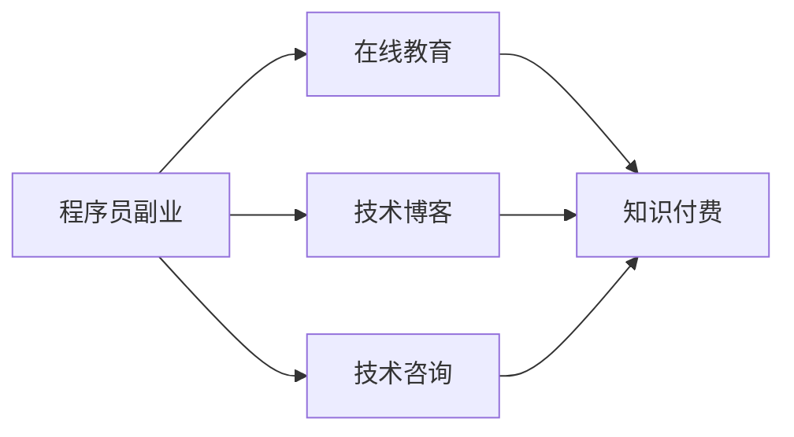

                 

# 程序员副业：知识付费的机遇与挑战

> 关键词：知识付费, 程序员副业, 在线教育, 技术博客, 版权保护

## 1. 背景介绍

在信息技术飞速发展的今天，程序员作为互联网行业的中坚力量，拥有了越来越多的学习资源和创业机会。其中，知识付费成为一个新兴趋势，为程序员提供了新的职业发展方向。本文章将从多个角度深入探讨程序员副业进行知识付费的机遇与挑战。

## 2. 核心概念与联系

### 2.1 核心概念概述

为更好地理解程序员副业进行知识付费的整个过程，首先介绍几个核心概念：

- **程序员副业**：指程序员利用业余时间，通过技术博客、在线教育、技术咨询等形式提供知识产品或服务，实现第二职业发展的过程。
- **知识付费**：指消费者通过支付费用获取知识内容，包括在线课程、电子书、技术教程、咨询服务等，以此激励知识创造者生产更高质量的知识产品。
- **在线教育**：利用互联网技术，通过视频、音频、文字等多种形式，实现知识和技能的在线传播和互动学习。
- **技术博客**：程序员通过撰写博客分享技术经验、项目实战、编程心得等内容，提升自身影响力并吸引广告收益或赞助。
- **版权保护**：通过法律手段保障知识内容创作者对其作品的版权，确保其合法收益，避免盗版和侵权行为。

### 2.2 核心概念原理和架构的 Mermaid 流程图



通过以上流程图，我们可以看到程序员副业与知识付费之间存在的紧密联系：通过在线教育、技术博客、技术咨询等副业形式，程序员创作并销售知识产品，消费者通过支付费用获取这些知识，从而形成一个完整的商业模式。

## 3. 核心算法原理 & 具体操作步骤

### 3.1 算法原理概述

知识付费的商业模式基于价值交换，即知识创造者提供有价值的内容，消费者通过支付费用获取这些内容。这一过程可以概括为三个步骤：

1. **内容创作**：程序员利用自己的技术经验，创作高质量的知识产品。
2. **平台分发**：将创作的内容通过在线教育平台、博客、技术社区等进行分发。
3. **用户付费**：用户为获得知识产品而支付费用，知识创造者获得收益。

### 3.2 算法步骤详解

**Step 1：内容创作**

1. **选题与构思**：选择具有市场需求的课题，构思知识产品的结构和内容。
2. **准备素材**：收集和整理相关的技术资料、案例分析、编程技巧等素材。
3. **制作内容**：使用Markdown、HTML、视频录制工具等创建知识产品，如文章、教程、视频课程等。

**Step 2：平台分发**

1. **选择平台**：根据目标受众选择合适的在线教育平台（如Coursera、Udemy）、博客（如Medium、CSDN）或技术社区（如GitHub、Stack Overflow）。
2. **账号注册**：注册账号并完善个人资料，以便于后续的用户互动和收益结算。
3. **内容上传**：将创作好的知识产品上传至选定的平台，填写相关元数据（如标题、简介、标签等）。

**Step 3：用户付费**

1. **定价策略**：根据成本、市场定价，设定知识产品的价格，并提供不同的付费选项（如单次购买、月度订阅、会员制等）。
2. **推广营销**：通过SEO优化、社交媒体推广、广告投放等方式提高内容曝光率。
3. **收益结算**：平台根据销售情况结算收益，打入创作者账户。

### 3.3 算法优缺点

**优点：**

- **多渠道收入**：程序员通过不同形式的内容创作和分发，实现多元化的收入来源。
- **低成本启动**：相比传统企业运营，知识付费的启动成本较低，可操作性强。
- **影响力扩大**：通过内容创作，程序员可以建立个人品牌，提升行业影响力。

**缺点：**

- **市场竞争激烈**：知识付费市场竞争激烈，内容同质化严重，创作者需要不断创新。
- **时间管理难度大**：副业与全职工作需要平衡时间，容易导致时间管理困难。
- **版权保护挑战**：盗版和侵权行为给知识创作者带来法律风险，维权成本较高。

### 3.4 算法应用领域

知识付费的商业模式广泛应用于以下几个领域：

- **编程技能培训**：面向初学者和进阶者，提供系统化的编程语言、框架、工具的培训课程。
- **项目管理与领导力**：提供敏捷开发、项目管理、团队协作等课程，帮助开发者提高职业素养。
- **大数据与人工智能**：提供数据科学、机器学习、深度学习等高级课程，推动技术前沿发展。
- **创业与产品设计**：提供产品管理、UI/UX设计、商业模式创新等课程，助力创业者和产品经理。
- **网络安全与隐私保护**：提供网络安全、数据隐私、漏洞挖掘等课程，增强安全意识和技能。

## 4. 数学模型和公式 & 详细讲解

### 4.1 数学模型构建

知识付费的商业模式可以建模为以下函数：

$$
\text{收入} = \text{内容价值} \times \text{用户支付意愿} \times \text{用户数量}
$$

其中：
- $\text{内容价值}$ 为创作者提供内容的价值和质量。
- $\text{用户支付意愿}$ 取决于用户对内容的认知和需求。
- $\text{用户数量}$ 为愿意支付费用的潜在用户数量。

### 4.2 公式推导过程

在知识付费市场，用户支付意愿与以下因素相关：

- **内容独特性**：内容独特且有深度，用户支付意愿高。
- **用户需求匹配度**：内容与用户实际需求匹配度高，用户支付意愿强。
- **创作者信誉**：创作者在行业内的信誉和影响力，直接影响用户信任度。
- **市场竞争**：市场上同类型内容的竞争程度，影响用户选择。

根据上述因素，可以推导出用户支付意愿的函数：

$$
\text{用户支付意愿} = f(\text{内容独特性}, \text{用户需求匹配度}, \text{创作者信誉}, \text{市场竞争})
$$

具体推导过程如下：

- **内容独特性**：$\text{内容独特性} \rightarrow \text{用户支付意愿}$

  - 内容独特性高，用户支付意愿强。

- **用户需求匹配度**：$\text{用户需求匹配度} \rightarrow \text{用户支付意愿}$

  - 需求匹配度高，支付意愿增强。

- **创作者信誉**：$\text{创作者信誉} \rightarrow \text{用户支付意愿}$

  - 信誉高，信任度增加，支付意愿上升。

- **市场竞争**：$\text{市场竞争} \rightarrow \text{用户支付意愿}$

  - 竞争激烈，选择余地大，支付意愿降低。

### 4.3 案例分析与讲解

以Coursera平台上的机器学习课程为例，分析知识付费的盈利模式：

- **课程内容**：课程内容包括理论基础、编程实践、项目案例，质量高，独特性强。
- **用户需求**：课程内容与市场需求高度匹配，用户在学习过程中获得实际技能提升。
- **创作者信誉**：课程由斯坦福大学教授Andrew Ng主讲，业内影响力大，用户信任度高。
- **市场竞争**：平台上虽有其他机器学习课程，但质量参差不齐，Coursera的课程相对更具优势。

综上所述，Coursera平台上的机器学习课程，通过高价值内容、精准匹配需求、高信誉度创作者和相对较低的市场竞争，实现了高用户支付意愿和收益。

## 5. 项目实践：代码实例和详细解释说明

### 5.1 开发环境搭建

在开始项目实践之前，需要搭建开发环境：

1. **安装Python**：安装最新版本的Python，确保环境稳定。
2. **安装Django框架**：用于搭建知识付费平台的前端网站。
3. **安装MySQL数据库**：用于存储用户信息、课程内容、订单记录等数据。
4. **安装Redis缓存**：用于缓存热点数据，提高系统性能。

**示例代码**：

```bash
pip install python
pip install django
pip install mysql-connector-python
pip install redis
```

### 5.2 源代码详细实现

以下是一个简单的知识付费平台网站的前端代码实现：

```python
from django.shortcuts import render
from django.http import HttpResponse

def index(request):
    # 获取课程信息
    courses = models.Course.objects.all()
    # 渲染前端页面
    return render(request, 'index.html', {'courses': courses})

def course_detail(request, course_id):
    # 获取课程详细信息
    course = models.Course.objects.get(id=course_id)
    # 渲染课程详情页面
    return render(request, 'course_detail.html', {'course': course})
```

### 5.3 代码解读与分析

**index函数**：

- 获取所有课程信息，并将其传递给前端页面。
- 前端页面根据课程信息渲染列表，展示课程概览。

**course_detail函数**：

- 根据课程ID获取课程详细信息，包括课程名称、描述、价格等。
- 前端页面根据课程详情渲染页面，展示课程的具体内容。

### 5.4 运行结果展示

启动开发服务器，访问网站主页，可以看到课程列表，点击某个课程进入详情页面，查看课程信息。

## 6. 实际应用场景

### 6.1 在线教育

知识付费在在线教育领域具有广泛应用。程序员可以结合自身专业技能，开发高质量的编程课程、架构设计课程、网络安全课程等，通过平台进行分发和销售。例如，Udemy平台上有大量由程序员创作的技术教程，涵盖了编程语言、框架、工具的各个方面。

### 6.2 技术咨询与培训

一些企业需要专业的技术咨询或培训服务，程序员可以利用自身技术经验，提供定制化的技术支持或集中式的培训课程。例如，可以通过企业内训、技术讲座、远程辅导等方式，提供高附加值的服务，获取丰厚收益。

### 6.3 开源项目维护与社区贡献

一些开源项目需要持续的维护和更新，程序员可以通过知识付费形式获得报酬，持续贡献代码和资源。例如，通过GitHub上的开源项目赞助机制，获取贡献者的捐款和奖励。

### 6.4 未来应用展望

未来，知识付费将进一步发展，涵盖更多细分领域和内容形式：

- **视频直播课程**：通过视频直播进行实时互动，提升用户体验。
- **实时问答平台**：利用在线聊天室、实时视频会议等方式，进行问题解答和实时咨询。
- **移动端学习应用**：开发移动端学习应用，提供个性化推荐和内容推送，提高学习效率。

## 7. 工具和资源推荐

### 7.1 学习资源推荐

以下是一些推荐的知识付费学习资源：

- **Coursera**：提供大量高质量的在线课程，涵盖各个技术领域。
- **Udemy**：拥有丰富的编程和技术课程，支持多种支付方式。
- **edX**：由哈佛、麻省理工等名校共同创办，提供高质量的课程和认证。
- **Udacity**：专注于技术教育和职业发展，提供实战项目和课程。
- **Codecademy**：以交互式编程练习为主，适合初学者快速上手。

### 7.2 开发工具推荐

以下是一些推荐的开发工具：

- **Python**：强大的编程语言，支持丰富的第三方库和框架。
- **Django**：流行的Web框架，适合快速搭建网站和Web应用。
- **MySQL**：开源关系型数据库，适合存储和查询结构化数据。
- **Redis**：高性能内存数据库，适合缓存热点数据。
- **GitHub**：全球最大的代码托管平台，适合开源项目协作和资源分享。

### 7.3 相关论文推荐

以下是一些推荐的与知识付费相关的论文：

- **On the Cost of Words**：探讨在线教育平台上的内容定价策略，分析影响用户支付意愿的因素。
- **The Economics of Free Digital Content**：研究知识付费市场中的价格机制，探讨成本与收益的平衡点。
- **The Impact of Technology on Learning**：分析技术手段在教育中的应用，评估其对知识获取和传播的影响。
- **Blockchain for Educational Content**：探索区块链技术在知识付费中的潜在应用，保障版权和收益。

## 8. 总结：未来发展趋势与挑战

### 8.1 总结

本文从多个角度详细探讨了程序员副业进行知识付费的机遇与挑战。首先，介绍了知识付费的商业模式及其核心概念，通过案例分析展示了其市场潜力和实际应用。其次，基于数学模型和公式推导过程，深入剖析了知识付费的盈利模式和用户支付意愿的影响因素。最后，结合项目实践和实际应用场景，全面展示了知识付费的发展趋势和未来展望。

通过本文的系统梳理，可以看到，知识付费为程序员提供了多样化的副业发展方向，同时面临着市场竞争、时间管理、版权保护等多方面的挑战。但只要不断创新和优化，克服这些挑战，知识付费必将在未来的职业发展中发挥更大的作用。

### 8.2 未来发展趋势

未来，知识付费市场将呈现以下几个发展趋势：

- **内容细分化**：知识产品将更加细分化，涵盖技术、商业、设计、管理等多个领域。
- **个性化推荐**：利用大数据和算法，提供个性化推荐，提升用户体验。
- **平台多元化**：新兴平台和独立社区将不断涌现，提供更多样化的学习和交流方式。
- **技术创新**：AI、区块链、VR/AR等新技术将进一步推动知识付费的创新发展。
- **版权保护加强**：加强版权保护，保障创作者权益，提升市场信任度。

### 8.3 面临的挑战

尽管知识付费的发展前景广阔，但在实施过程中仍面临诸多挑战：

- **用户教育**：需要进一步普及和推广，提高用户对知识付费的认知和接受度。
- **内容质量**：保持内容的高质量和高更新频率，避免同质化和内容过时。
- **市场竞争**：面对激烈的市场竞争，需不断创新和提升竞争力。
- **法律风险**：确保内容的合法性，避免侵权和盗版行为。
- **收益分配**：合理分配收益，保障创作者和平台的利益。

### 8.4 研究展望

未来的研究可以从以下几个方向进一步突破：

- **内容生成技术**：探索生成对抗网络（GAN）等技术，自动化生成高质量知识内容。
- **互动学习机制**：研究智能问答系统、实时辅导等机制，提升互动性和用户体验。
- **多渠道分发**：拓展知识付费的渠道，包括社交媒体、短视频平台、电子书等。
- **实时数据分析**：利用大数据和机器学习技术，实时分析用户行为，优化内容和定价策略。
- **全球化市场**：探索国际市场，推动知识付费的全球化发展。

## 9. 附录：常见问题与解答

**Q1：知识付费市场是否存在盗版问题？**

A: 知识付费市场确实存在盗版和侵权行为，如在线盗版课程、非法下载等。为应对这一问题，需要加强版权保护，采取技术手段（如加密、水印）和法律手段（如诉讼、打击盗版平台）相结合的方式，保障创作者权益。

**Q2：如何提高知识付费平台的吸引力？**

A: 提高平台吸引力需要多方面努力，包括：
- **优质内容**：提供高质量、有深度的课程和文章，吸引目标用户。
- **用户互动**：通过社区讨论、实时问答等互动机制，增强用户粘性。
- **营销推广**：利用SEO优化、社交媒体推广等方式，提升平台知名度和访问量。

**Q3：知识付费市场如何盈利？**

A: 知识付费市场的盈利模式主要包括以下几种：
- **单次购买**：用户一次性购买课程或内容，支付一次性费用。
- **会员制**：用户通过支付会员费，获取所有课程和内容的长期访问权。
- **广告分成**：平台通过广告分成，获取收益，如展示广告、推荐广告等。
- **赞助和捐赠**：部分用户通过赞助和捐赠方式，支持知识创造者。

通过以上问题的解答，我们可以更全面地理解程序员副业进行知识付费的机遇与挑战，为未来的实践和研究提供有价值的参考。

---

作者：禅与计算机程序设计艺术 / Zen and the Art of Computer Programming

