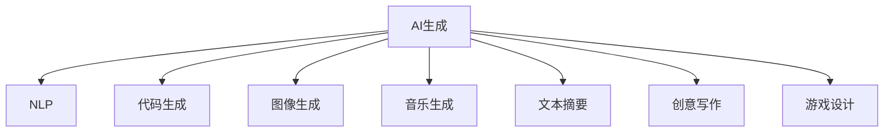

                 

# 程序员如何利用AI生成工具提升内容产出

> 关键词：AI生成,自然语言处理(NLP),代码生成,图像生成,音乐生成,文本摘要,创意写作,游戏设计

## 1. 背景介绍

随着人工智能技术的迅速发展，AI生成工具正在逐步改变程序员的内容产出方式。从简单的代码自动补全，到复杂的创意写作和图像生成，AI技术正在拓展程序员的生产力边界。本文将系统介绍几种流行的AI生成工具，探讨它们如何提升程序员的内容产出效率，并展望AI生成技术的发展前景。

## 2. 核心概念与联系

### 2.1 核心概念概述

为更好地理解AI生成技术，本节将介绍几个核心概念：

- **AI生成(AI Generation)**：利用机器学习算法自动生成文本、代码、图像等内容的技术。常见的AI生成工具包括GPT-3、GitHub Copilot、DALL-E等。

- **自然语言处理(Natural Language Processing, NLP)**：研究如何让计算机理解和生成人类语言的技术。AI生成技术多基于NLP原理。

- **代码生成(Code Generation)**：使用AI技术自动编写代码，减少手动编码工作量。广泛应用于软件开发、运维等领域。

- **图像生成(Image Generation)**：通过AI技术自动生成图像，支持图像设计、游戏开发等场景。典型工具包括DALL-E、Stable Diffusion等。

- **音乐生成(Music Generation)**：利用AI技术自动创作音乐，支持音乐制作、广告动画等领域。常用算法包括CycleGAN、WaveNet等。

- **文本摘要(Text Summarization)**：自动生成文本的精炼版本，支持信息快速检索、内容推荐等场景。

- **创意写作(Creative Writing)**：AI自动生成文学作品、新闻报道等内容，支持内容创作和信息消费。

- **游戏设计(Game Design)**：AI辅助设计游戏元素，如角色、剧情等，提升游戏开发效率和体验。

这些概念之间的逻辑关系可以通过以下Mermaid流程图来展示：



这个流程图展示出AI生成技术在不同领域的应用场景和原理。

## 3. 核心算法原理 & 具体操作步骤

### 3.1 算法原理概述

AI生成技术的核心原理基于神经网络模型，特别是基于自回归模型和自编码器等。这些模型通过大量无标签数据进行预训练，学习到数据的通用表示。在实际应用中，这些模型被进一步微调以适应特定的生成任务，如文本生成、图像生成等。

以文本生成为例，常用的算法包括：

- **自回归模型(如GPT系列)**：模型通过当前单词预测下一个单词，逐步生成文本。
- **自编码器(如GPT-3)**：模型将输入映射到低维空间，再通过解码器生成输出。
- **变分自编码器(VAE)**：模型通过优化数据分布，生成新的文本样本。

### 3.2 算法步骤详解

AI生成算法一般包括以下几个关键步骤：

**Step 1: 准备数据集**
- 收集或生成目标任务的标注数据，划分为训练集、验证集和测试集。

**Step 2: 设计生成模型**
- 选择合适的生成模型架构，如Transformer、GPT、VAE等，并设定超参数。

**Step 3: 预训练模型**
- 使用大量无标签数据对模型进行预训练，学习数据的通用表示。

**Step 4: 微调模型**
- 将预训练模型应用于特定任务，收集少量标注数据进行微调。

**Step 5: 生成输出**
- 使用微调后的模型对输入进行生成，并评估生成效果。

**Step 6: 反馈优化**
- 根据生成结果的反馈，进一步优化模型，提升生成质量。

### 3.3 算法优缺点

AI生成技术的优点包括：

- **高效性**：自动化生成内容，节省了大量手动输入的时间。
- **灵活性**：可以生成多种类型的文本、图像、音乐等内容。
- **广泛适用性**：适用于文本、图像、音频等多个领域。

然而，该技术也存在一些缺点：

- **准确性**：生成的内容可能存在事实错误、逻辑不连贯等问题。
- **可解释性**：生成的内容缺乏人类创作过程的情感和逻辑深度。
- **版权问题**：自动生成的内容可能涉及版权问题，难以界定。

### 3.4 算法应用领域

AI生成技术在多个领域都有广泛的应用：

- **文本生成**：如代码生成、创意写作、文本摘要、自动翻译等。
- **图像生成**：如游戏设计、广告创意、医学图像等。
- **音乐生成**：如自动化音乐创作、广告配乐等。
- **游戏设计**：如角色设计、剧情生成等。

## 4. 数学模型和公式 & 详细讲解 & 举例说明

### 4.1 数学模型构建

AI生成技术的数学模型通常基于神经网络，以生成模型为例，其基本框架如下：

$$
P(\text{text}) = \prod_{t=1}^T P(\text{text}_t | \text{text}_{t-1})
$$

其中，$P(\text{text})$ 表示生成文本的概率，$T$ 为文本长度，$\text{text}_t$ 表示文本的第 $t$ 个单词。模型通过已知单词预测下一个单词的概率，从而逐步生成文本。

### 4.2 公式推导过程

以GPT-3为例，推导生成模型的工作原理：

$$
P(\text{text}) = \prod_{t=1}^T \frac{exp(\text{embedding}(\text{text}_{t-1}) \cdot \text{embedding}(\text{text}_{t}))}{\sum_{w \in V} exp(\text{embedding}(\text{text}_{t-1}) \cdot \text{embedding}(w))}
$$

其中，$\text{embedding}$ 表示单词的向量表示，$V$ 为词汇表。该公式将生成过程转化为向量点积和softmax函数，用于计算每个单词的条件概率。

### 4.3 案例分析与讲解

**案例1: 文本生成**
- **任务**：使用GPT-3生成一段新闻报道。
- **数据集**：收集新闻报道和摘要数据集。
- **模型**：GPT-3。
- **训练**：使用新闻报道数据集进行微调。
- **生成**：输入一条新闻标题，模型自动生成完整报道。

**案例2: 图像生成**
- **任务**：使用DALL-E生成一张动漫角色的图像。
- **数据集**：收集动漫相关的图像数据集。
- **模型**：DALL-E。
- **训练**：使用动漫图像数据集进行微调。
- **生成**：输入描述文本（如“一个穿着斗篷的动漫角色”），模型自动生成图像。

**案例3: 音乐生成**
- **任务**：使用WaveNet生成一段古典音乐。
- **数据集**：收集古典音乐数据集。
- **模型**：WaveNet。
- **训练**：使用古典音乐数据集进行微调。
- **生成**：输入音乐风格或主题，模型自动生成音乐片段。

## 5. 项目实践：代码实例和详细解释说明

### 5.1 开发环境搭建

在进行AI生成实践前，我们需要准备好开发环境。以下是使用Python进行TensorFlow开发的环境配置流程：

1. 安装Anaconda：从官网下载并安装Anaconda，用于创建独立的Python环境。

2. 创建并激活虚拟环境：
```bash
conda create -n tf-env python=3.8 
conda activate tf-env
```

3. 安装TensorFlow：根据CUDA版本，从官网获取对应的安装命令。例如：
```bash
conda install tensorflow -c tf -c conda-forge
```

4. 安装TensorFlow addons：用于支持更多的生成模型。
```bash
pip install tensorflow-addons
```

5. 安装各类工具包：
```bash
pip install numpy pandas scikit-learn matplotlib tqdm jupyter notebook ipython
```

完成上述步骤后，即可在`tf-env`环境中开始AI生成实践。

### 5.2 源代码详细实现

这里我们以生成文本和图像为例，给出使用TensorFlow实现AI生成任务的完整代码实现。

**文本生成代码**

```python
import tensorflow as tf
import tensorflow_addons as addons
from transformers import TFGPT2LMHeadModel, GPT2Tokenizer

# 加载预训练模型和分词器
tokenizer = GPT2Tokenizer.from_pretrained('gpt2')
model = TFGPT2LMHeadModel.from_pretrained('gpt2')

# 定义文本生成函数
def generate_text(prompt):
    input_ids = tokenizer.encode(prompt, return_tensors='tf')
    outputs = model(input_ids)
    logits = outputs.logits[:, -1, :]
    predictions = tf.nn.softmax(logits, axis=-1)
    return tokenizer.decode(tf.random.categorical(predictions, num_samples=50)[0, :])

# 生成新闻报道
prompt = "2023年最新科技趋势"
output = generate_text(prompt)
print(output)
```

**图像生成代码**

```python
import tensorflow as tf
import tensorflow_addons as addons
from tensorflow_addons.layers import PixelShuffleConv2D

# 加载预训练模型
from tensorflow_addons.layers import PixelShuffleConv2D

# 定义生成模型
model = tf.keras.Sequential([
    addons.layers.GatedConv2D(32, kernel_size=3, strides=1, padding='same', activation='relu'),
    addons.layers.GatedConv2D(32, kernel_size=3, strides=2, padding='same', activation='relu'),
    addons.layers.GatedConv2D(64, kernel_size=3, strides=2, padding='same', activation='relu'),
    addons.layers.GatedConv2D(64, kernel_size=3, strides=2, padding='same', activation='relu'),
    addons.layers.GatedConv2D(128, kernel_size=3, strides=2, padding='same', activation='relu'),
    addons.layers.GatedConv2D(128, kernel_size=3, strides=2, padding='same', activation='relu'),
    addons.layers.PixelShuffleConv2D(128, scale=2, kernel_size=3, padding='same', activation='relu'),
    addons.layers.PixelShuffleConv2D(64, scale=2, kernel_size=3, padding='same', activation='relu'),
    addons.layers.PixelShuffleConv2D(32, scale=2, kernel_size=3, padding='same', activation='relu'),
    addons.layers.PixelShuffleConv2D(1, scale=2, kernel_size=3, padding='same', activation='sigmoid')
])

# 加载图像数据
image = tf.keras.preprocessing.image.load_img('path/to/image.jpg', target_size=(256, 256))
image = tf.keras.preprocessing.image.img_to_array(image)
image = tf.expand_dims(image, 0)

# 生成图像
generated_image = model.predict(image)[0]
generated_image = tf.keras.preprocessing.image.array_to_img(generated_image)
generated_image.save('path/to/generated_image.png')
```

### 5.3 代码解读与分析

让我们再详细解读一下关键代码的实现细节：

**文本生成代码**

**主要步骤**：
- 加载预训练的GPT-2模型和分词器。
- 定义文本生成函数 `generate_text`。
- 将输入文本通过分词器编码成模型的输入格式。
- 使用模型预测下一个单词的概率分布。
- 通过softmax函数计算概率分布，生成随机文本。

**关键代码**：
- `tokenizer.encode`：将文本转化为模型所需的input_ids。
- `model(input_ids)`：输入input_ids，获取模型的预测概率。
- `tf.nn.softmax(logits, axis=-1)`：计算softmax函数，将预测概率转化为概率分布。
- `tf.random.categorical(predictions, num_samples=50)[0, :]`：从概率分布中采样，生成多个单词。

**图像生成代码**

**主要步骤**：
- 加载预训练的生成模型。
- 定义生成模型结构。
- 加载图像数据。
- 使用模型生成图像。

**关键代码**：
- `tf.keras.preprocessing.image.load_img`：加载图像文件。
- `tf.keras.preprocessing.image.img_to_array`：将图像文件转化为Numpy数组。
- `model.predict(image)[0]`：输入图像数据，获取生成结果。
- `tf.keras.preprocessing.image.array_to_img`：将生成结果转化为图像文件。

## 6. 实际应用场景

### 6.1 软件开发

在软件开发中，AI生成技术可以自动生成代码、文档、测试用例等内容，极大地提升开发效率。例如，使用GitHub Copilot，程序员可以实时获得代码补全建议，快速编写代码并减少错误。同时，AI生成的代码文档也可以帮助团队成员更好地理解代码逻辑和设计思路。

### 6.2 内容创作

AI生成技术在内容创作领域也大放异彩。使用AI工具，程序员可以快速生成创意写作、新闻报道、产品说明等内容，帮助企业快速发布高质量的文章和宣传材料。例如，使用GPT-3生成博客文章、新闻报道等，可以显著提升内容创作速度和质量。

### 6.3 广告设计

AI生成技术在广告设计领域也有广泛应用。通过自动生成广告文案、图像、视频等，AI工具可以大大降低广告设计的时间和成本，提升广告创意和营销效果。例如，使用DALL-E生成广告图像，可以设计出更加吸引人的广告素材，提升品牌曝光度和用户参与度。

### 6.4 游戏开发

在游戏开发中，AI生成技术可以自动生成游戏元素、剧情、任务等内容，提升游戏开发效率和体验。例如，使用DALL-E生成游戏中的角色和场景，可以大大减少游戏美术设计师的工作量。同时，AI生成的剧情和任务也可以提升游戏的可玩性和沉浸感。

## 7. 工具和资源推荐

### 7.1 学习资源推荐

为了帮助开发者系统掌握AI生成技术，这里推荐一些优质的学习资源：

1. 《AI生成技术》系列博文：由大模型技术专家撰写，深入浅出地介绍了AI生成技术的原理和应用。

2. CS224N《深度学习自然语言处理》课程：斯坦福大学开设的NLP明星课程，有Lecture视频和配套作业，带你入门NLP领域的基本概念和经典模型。

3. 《AI生成艺术》书籍：详细介绍了AI生成技术在图像、音乐、文本等多个领域的创新应用。

4. HuggingFace官方文档：提供了海量预训练模型和完整的生成样例代码，是上手实践的必备资料。

5. CLUE开源项目：包含大量不同类型的文本生成数据集，并提供了基于AI生成的baseline模型，助力文本生成技术发展。

通过对这些资源的学习实践，相信你一定能够快速掌握AI生成技术的精髓，并用于解决实际的NLP问题。

### 7.2 开发工具推荐

高效的开发离不开优秀的工具支持。以下是几款用于AI生成开发的常用工具：

1. TensorFlow：基于Python的开源深度学习框架，灵活动态的计算图，适合快速迭代研究。适用于多种生成模型的实现。

2. PyTorch：基于Python的开源深度学习框架，灵活的动态图，适用于各种生成任务的开发。

3. Transformers库：HuggingFace开发的NLP工具库，集成了众多SOTA生成模型，支持多种生成任务的开发。

4. Weights & Biases：模型训练的实验跟踪工具，可以记录和可视化模型训练过程中的各项指标，方便对比和调优。

5. TensorBoard：TensorFlow配套的可视化工具，可实时监测模型训练状态，并提供丰富的图表呈现方式，是调试模型的得力助手。

6. Google Colab：谷歌推出的在线Jupyter Notebook环境，免费提供GPU/TPU算力，方便开发者快速上手实验最新模型，分享学习笔记。

合理利用这些工具，可以显著提升AI生成任务的开发效率，加快创新迭代的步伐。

### 7.3 相关论文推荐

AI生成技术的发展源于学界的持续研究。以下是几篇奠基性的相关论文，推荐阅读：

1. Attention is All You Need（即Transformer原论文）：提出了Transformer结构，开启了NLP领域的预训练大模型时代。

2. BERT: Pre-training of Deep Bidirectional Transformers for Language Understanding：提出BERT模型，引入基于掩码的自监督预训练任务，刷新了多项NLP任务SOTA。

3. Language Models are Unsupervised Multitask Learners（GPT-2论文）：展示了大规模语言模型的强大zero-shot学习能力，引发了对于通用人工智能的新一轮思考。

4. Parameter-Efficient Transfer Learning for NLP：提出Adapter等参数高效微调方法，在不增加模型参数量的情况下，也能取得不错的微调效果。

5. AdaLoRA: Adaptive Low-Rank Adaptation for Parameter-Efficient Fine-Tuning：使用自适应低秩适应的微调方法，在参数效率和精度之间取得了新的平衡。

6. Transformer-XL: Attentive Language Models with Relatively Longer Range Dependencies：提出了Transformer-XL模型，支持更长的自回归序列生成，进一步提升了生成模型的性能。

这些论文代表了大生成模型的发展脉络。通过学习这些前沿成果，可以帮助研究者把握学科前进方向，激发更多的创新灵感。

## 8. 总结：未来发展趋势与挑战

### 8.1 总结

本文对AI生成技术进行了全面系统的介绍。首先阐述了AI生成技术的背景和意义，明确了其在提升程序员内容产出效率方面的独特价值。其次，从原理到实践，详细讲解了生成模型的数学原理和关键步骤，给出了生成任务开发的完整代码实例。同时，本文还广泛探讨了AI生成技术在软件开发、内容创作、广告设计、游戏开发等多个领域的应用前景，展示了其巨大的潜力。

通过本文的系统梳理，可以看到，AI生成技术正在成为程序员内容产出的重要工具，极大地拓展了人类创作的方式和效率。未来，伴随预训练语言模型和生成模型的持续演进，相信AI生成技术必将在更广阔的应用领域大放异彩，深刻影响人类的创作和生产方式。

### 8.2 未来发展趋势

展望未来，AI生成技术将呈现以下几个发展趋势：

1. 模型规模持续增大。随着算力成本的下降和数据规模的扩张，预训练语言模型和生成模型的参数量还将持续增长。超大模型蕴含的丰富知识，有望支撑更加复杂多变的生成任务。

2. 生成效果提升。未来的生成模型将通过更多的自监督任务、对抗训练等技术，提升生成的自然性和连贯性，减少语法和语义错误。

3. 多模态生成兴起。当前的生成模型多聚焦于文本生成，未来的发展方向将扩展到图像、音乐、视频等多模态内容生成，实现更为丰富的生成形式。

4. 生成内容的可解释性增强。未来的生成模型将引入更多因果推断、逻辑推理等技术，提升生成的可解释性和可信度，避免生成内容的误导和滥用。

5. 生成应用的广泛化。AI生成技术将在更多行业得到应用，如教育、医疗、艺术等，拓展AI技术的社会价值。

以上趋势凸显了AI生成技术的广阔前景。这些方向的探索发展，必将进一步提升AI生成技术的效果和应用范围，为人类创作和社会生产带来新的突破。

### 8.3 面临的挑战

尽管AI生成技术已经取得了瞩目成就，但在迈向更加智能化、普适化应用的过程中，它仍面临诸多挑战：

1. 生成的真实性和可信度。自动生成的内容可能存在事实错误、逻辑不连贯等问题，影响用户的信任和接受度。

2. 版权和伦理问题。自动生成的内容可能涉及版权问题，同时也可能生成有害、误导性的信息，引发伦理和安全问题。

3. 技术复杂性和开发难度。生成模型的训练和微调需要高超的技术和丰富的数据，对开发者提出了较高要求。

4. 多模态生成技术的复杂性。图像、音乐等多模态内容生成技术难度更大，需要更多的数据和算法支持。

5. 模型的可解释性和可控性。生成模型的内部工作机制难以解释，生成过程缺乏控制，可能导致不可预知的输出结果。

6. 模型的泛化能力和鲁棒性。生成模型在面对新的输入数据时，可能无法很好地适应，出现泛化能力不足的问题。

这些挑战表明，AI生成技术仍需进一步优化和发展，才能在更多领域得到广泛应用。

### 8.4 研究展望

面对AI生成技术所面临的种种挑战，未来的研究需要在以下几个方面寻求新的突破：

1. 引入更多先验知识。将符号化的先验知识，如知识图谱、逻辑规则等，与神经网络模型进行巧妙融合，引导生成过程学习更准确、合理的语言模型。

2. 提升生成的可解释性和可控性。通过引入因果分析方法、逻辑推理技术，增强生成模型的可解释性和可控性，避免生成内容的误导和滥用。

3. 实现多模态生成。开发支持图像、音乐等多种内容形式的生成模型，实现更为丰富的生成形式。

4. 增强生成模型的鲁棒性和泛化能力。通过更多的自监督任务、对抗训练等技术，提升生成模型的鲁棒性和泛化能力，确保生成内容的真实性和连贯性。

5. 探索无监督和半监督生成方法。摆脱对大量标注数据的依赖，利用自监督学习、主动学习等无监督和半监督范式，最大限度利用非结构化数据，实现更加灵活高效的生成。

6. 引入伦理和安全约束。在生成模型的训练目标中引入伦理导向的评估指标，过滤和惩罚有害、误导性的生成内容，确保生成内容的无害性和合法性。

这些研究方向的探索，必将引领AI生成技术迈向更高的台阶，为人类创作和社会生产带来新的突破。面向未来，AI生成技术还需要与其他人工智能技术进行更深入的融合，如知识表示、因果推理、强化学习等，多路径协同发力，共同推动智能技术的发展和应用。只有勇于创新、敢于突破，才能不断拓展AI生成技术的边界，让智能技术更好地造福人类社会。

## 9. 附录：常见问题与解答

**Q1: AI生成技术是否适用于所有内容创作领域？**

A: AI生成技术在大多数内容创作领域都有广泛应用，如代码生成、文本创作、广告设计等。但对于一些需要高度创意、情感表达的领域，如文学、电影、音乐创作等，可能需要结合人类创作者的创意输入和审核，以提升内容的艺术性和情感深度。

**Q2: 生成模型训练所需的数据量有多大？**

A: 生成模型的训练通常需要大量的无标签数据进行预训练，以学习数据的通用表示。预训练数据量越大，模型的效果越好。以GPT-3为例，其训练数据量达到了40GB文本。

**Q3: 生成模型在实际应用中可能存在哪些问题？**

A: 生成模型在实际应用中可能存在以下问题：
1. 生成的内容可能包含事实错误、语法错误、逻辑不连贯等。
2. 生成的内容缺乏人类创作的情感和深度，可能无法满足特定场景的需求。
3. 生成的内容可能存在版权问题，需要特别关注版权和伦理问题。

**Q4: 如何使用AI生成技术提升软件开发效率？**

A: 使用AI生成技术可以提升软件开发效率的几种方法：
1. 代码自动补全：GitHub Copilot等工具可以自动生成代码，提升编写速度和减少错误。
2. 代码文档生成：AI工具可以自动生成代码文档，帮助团队成员更好地理解代码逻辑和设计思路。
3. 测试用例生成：AI工具可以自动生成测试用例，提升测试覆盖率和发现问题能力。

**Q5: 如何设计一个多模态生成模型？**

A: 设计一个多模态生成模型需要考虑以下步骤：
1. 选择合适的生成模型架构，如GAN、VAE等。
2. 收集和处理多模态数据，如文本、图像、音频等。
3. 设计多模态数据的融合方式，如使用注意力机制、跨模态编码器等。
4. 训练模型，并优化多模态生成效果。
5. 应用模型生成多模态内容，如生成带有图像的文本描述、生成音乐伴奏等。

通过以上步骤，可以设计出具有多模态生成能力的AI模型，提升生成效果和应用范围。

---

作者：禅与计算机程序设计艺术 / Zen and the Art of Computer Programming

