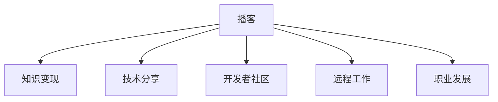

                 

# 程序员如何利用播客进行知识变现

> 关键词：播客, 知识变现, 技术分享, 开发者社区, 远程工作, 职业发展, 个人品牌, 知识经济

## 1. 背景介绍

### 1.1 问题由来
在数字化时代，知识被视作一种重要的资源和财富。程序员作为知识工作者，不仅掌握着专业的编程技能，更具备丰富的项目经验和技术见解。如何将这些知识和技能变现，是程序员面临的重要问题。传统的代码开源、技术博客、学术文章等方式虽然有效，但对于程序员个人来说，耗时耗力且收益有限。而在当下流行的互联网模式下，播客（Podcast）作为一种新兴的知识分享和变现形式，逐渐受到程序员和大众的青睐。

播客作为一种音频节目，通过手机、电脑等设备随时随地播放，灵活方便，尤其在通勤、健身、休息等碎片化时间中，为听众提供了便捷的知识学习渠道。通过播客，程序员不仅可以分享自己的技术见解，还能提升个人品牌影响力，实现知识变现。

### 1.2 问题核心关键点
播客的兴起源于移动互联网和数字音频技术的成熟，其核心价值在于通过音频节目将知识以更自然、更易于理解的方式传递给听众。播客的内容形式多样，可以是技术分享、行业分析、项目案例、职业发展经验等，形式不拘泥于单一的代码分析，更能引起听众的共鸣和兴趣。

播客的知识变现模式主要依赖于订阅、广告、赞助、付费会员等多种途径。通过播客内容建立起来的品牌影响力，吸引听众订阅和打赏，进而实现个人收益。此外，播客的商业化开发，如创建播客产品、开办播客课程等，也是知识变现的重要手段。

## 2. 核心概念与联系

### 2.1 核心概念概述

为更好地理解如何利用播客进行知识变现，本节将介绍几个密切相关的核心概念：

- **播客(Podcast)**：一种通过互联网技术发布和订阅的音频节目。播客内容通常以音频形式呈现，通过手机、电脑等设备播放，不受时间和地点的限制。
- **知识变现(Knowledge Monetization)**：指将个人或团队的知识、技能、经验等转化为货币收入的过程。播客作为一种有效的知识传播手段，为知识变现提供了新的可能性。
- **技术分享(Technical Sharing)**：通过播客等形式，将技术经验和见解分享给广大听众，提升专业影响力。
- **开发者社区(Developer Community)**：由程序员和开发者组成的社群，播客为社区成员提供交流和分享的平台，促进知识传播和技能提升。
- **远程工作(Remote Work)**：随着互联网技术的发展，远程工作成为可能，播客为远程工作者提供了一种良好的交流和学习的媒介。
- **职业发展(Professional Development)**：播客可以分享职业发展的经验和技巧，帮助程序员规划和实现职业目标。

这些核心概念之间的逻辑关系可以通过以下Mermaid流程图来展示：



这个流程图展示了几大核心概念之间的关系：

1. 播客为知识变现提供了平台，使程序员能够通过内容获取收益。
2. 播客也是程序员分享技术经验和职业发展的有力工具。
3. 播客有助于构建和维护开发者社区，促进技术交流和知识共享。
4. 播客为远程工作者提供了一个交流和学习的媒介，增加了工作的灵活性。

## 3. 核心算法原理 & 具体操作步骤
### 3.1 算法原理概述

播客的知识变现，本质上是一种基于内容的商业化过程。其核心思想是通过高质量、有价值的播客内容，吸引听众订阅和支持，进而实现内容创作者的经济回报。

播客的知识变现可以分为两个阶段：

1. **内容创作阶段**：程序员首先需要制作高质量的播客内容，包括确定选题、编写脚本、录制音频等步骤。
2. **商业化运营阶段**：通过合理的商业策略，实现播客的可持续运营和变现。

播客的知识变现主要依赖于以下几个关键因素：

1. **内容质量**：高质量、有价值的播客内容是吸引听众、实现变现的基础。
2. **用户互动**：与听众的互动可以增加播客的吸引力，促进内容的传播和订阅。
3. **商业策略**：选择合理的商业模式，如订阅、广告、赞助、付费会员等，最大化播客的经济价值。
4. **推广策略**：通过有效的推广手段，提升播客的知名度和用户基础。

### 3.2 算法步骤详解

播客的知识变现主要包括以下几个关键步骤：

**Step 1: 确定播客内容主题**
- 根据自身的专业领域和兴趣，确定播客的主题和内容方向，如技术分享、行业分析、项目案例、职业发展等。
- 调研目标听众的需求和兴趣，确保内容具有针对性和吸引力。

**Step 2: 准备播客制作工具和平台**
- 选择合适的播客制作软件，如Audacity、Adobe Audition、iZotope RX等，制作高质量音频。
- 注册播客发布平台，如Apple Podcasts、Spotify、Google Podcasts等，上传和发布播客内容。

**Step 3: 编写播客脚本和制作音频**
- 编写详细、结构化的播客脚本，包括开场白、主体内容、结尾等部分。
- 录制音频，注意语速、发音、音质等，确保音频清晰、富有感染力。
- 后期制作，包括剪辑、降噪、混音等，提升音频质量。

**Step 4: 发布和推广播客**
- 发布播客到各大平台，定期更新内容，保持听众的持续关注。
- 使用社交媒体、技术论坛、开发者社区等渠道，进行播客的推广和宣传，吸引更多听众。
- 定期举办听众互动活动，如问答环节、在线直播等，增加听众的参与感和归属感。

**Step 5: 实现知识变现**
- 选择合适的商业策略，如广告分成、会员付费、知识付费课程等，实现播客的变现。
- 使用播客平台的分析工具，监控订阅人数、播放次数、互动情况等指标，调整策略以最大化收益。

### 3.3 算法优缺点

利用播客进行知识变现具有以下优点：

1. **灵活性高**：播客可以在碎片化时间中播放，适合远程工作者和通勤族等。
2. **传播广**：通过网络平台传播，覆盖范围广泛，可触达全球听众。
3. **互动性强**：听众可以通过留言、评论等方式与播客创作者互动，增加内容的互动性和参与感。
4. **品牌影响力大**：播客有助于提升个人品牌影响力，吸引更多的关注和支持。

同时，播客的知识变现也存在以下局限性：

1. **时间成本高**：制作高质量的播客需要大量的时间和精力投入。
2. **技术和设备要求高**：需要掌握音频录制和制作的基本技术，配备专业设备。
3. **收益不稳定**：播客的订阅和打赏受到多方面因素影响，收益不具稳定性。
4. **竞争激烈**：播客市场竞争激烈，需要持续创新和优化，才能吸引和留住听众。

尽管存在这些局限性，但播客作为新兴的知识变现形式，为程序员提供了新的发展机会，值得积极探索和尝试。

### 3.4 算法应用领域

播客的知识变现主要应用于以下几个领域：

1. **技术分享和教育**：程序员可以通过播客分享技术知识和经验，如编程技巧、项目案例、新技术等，提升自身影响力，同时帮助其他开发者学习成长。
2. **职业发展和咨询**：通过播客分享职业发展经验、面试技巧、求职策略等，为程序员提供职业发展的指导和支持。
3. **远程工作与协作**：播客为远程工作者提供了一个交流和学习的平台，促进远程团队的协作和知识共享。
4. **创业与投资**：播客可以为创业者提供项目展示和融资支持，同时吸引投资者关注，获取投资机会。
5. **行业分析和评论**：程序员可以通过播客分析行业趋势、分享技术动态，提升自身在行业内的影响力。

## 4. 数学模型和公式 & 详细讲解 & 举例说明

### 4.1 数学模型构建

播客的知识变现过程可以抽象为以下数学模型：

- **订阅模型**：设听众总数为 $N$，订阅播客的听众数为 $S$，则订阅率为 $\frac{S}{N}$。订阅率和播客内容质量、推广策略、社交媒体影响力等因素正相关。
- **打赏模型**：设听众总数为 $N$，打赏的听众数为 $P$，则打赏率为 $\frac{P}{N}$。打赏率与播客内容质量、互动性和听众的社区归属感等因素正相关。
- **广告收入模型**：设广告展示次数为 $A$，每次广告收入为 $C$，则广告收入为 $A \times C$。广告收入与播客听众数和广告主投放策略等因素正相关。
- **付费会员模型**：设会员总数为 $M$，每个会员的订阅费用为 $F$，则会员总收入为 $M \times F$。会员总收入与播客内容和会员体验等因素正相关。

### 4.2 公式推导过程

以订阅模型为例，推导订阅率的影响因素。设订阅率为 $R$，内容质量为 $Q$，推广策略为 $P$，社交媒体影响力为 $S$，则：

$$
R = f(Q, P, S)
$$

其中 $f$ 为订阅率与内容质量、推广策略、社交媒体影响力之间的关系函数。假设 $Q, P, S$ 的值分别为 $q, p, s$，则：

$$
R = f(q, p, s)
$$

若忽略其他因素，假设 $f$ 为线性函数，则：

$$
R = \alpha Q + \beta P + \gamma S
$$

其中 $\alpha, \beta, \gamma$ 为模型参数，表示各项因素对订阅率的影响系数。

### 4.3 案例分析与讲解

以某程序员的播客为例，通过数据验证上述模型。设该播客的订阅率为 0.1，内容质量为 0.9，推广策略为 0.8，社交媒体影响力为 0.7，则：

$$
R = \alpha Q + \beta P + \gamma S
$$

代入数据得：

$$
0.1 = \alpha \times 0.9 + \beta \times 0.8 + \gamma \times 0.7
$$

通过求解 $\alpha, \beta, \gamma$ 的值，可以进一步优化播客内容、推广策略和社交媒体策略，提升订阅率。

## 5. 项目实践：代码实例和详细解释说明
### 5.1 开发环境搭建

要进行播客的知识变现，首先需要搭建一套完整的播客制作和发布环境。以下是搭建开发环境的具体步骤：

1. **选择合适的播客制作软件**：
   - 如Audacity、Adobe Audition、iZotope RX等，满足不同的音频录制需求。
   - 安装和配置软件，确保录制和后期制作的高质量。

2. **注册播客发布平台**：
   - 注册Apple Podcasts、Spotify、Google Podcasts等主流播客平台账号，上传和管理播客内容。
   - 了解各平台的具体要求和规范，确保播客内容符合平台标准。

3. **准备播客制作工具**：
   - 配置麦克风、耳麦、电脑等硬件设备，确保录制音频的质量。
   - 下载并安装音频编辑软件，如Audacity、Adobe Audition等，进行后期制作和处理。

4. **搭建播客制作流程**：
   - 编写播客脚本，确保内容的逻辑性和连贯性。
   - 录制音频，注意语速、发音、音质等，确保音频清晰、富有感染力。
   - 使用音频编辑软件进行剪辑、降噪、混音等，提升音频质量。

### 5.2 源代码详细实现

播客的知识变现主要依赖于播客的制作和发布，以下是一个简单的播客制作流程的代码实现。

**播客脚本编写**：

```python
def generate_script(title, intro, content, conclusion):
    """
    生成播客脚本
    :param title: 播客标题
    :param intro: 开场白
    :param content: 主体内容
    :param conclusion: 结尾
    :return: 播客脚本文本
    """
    script = f"""
    {title} - {intro}

    {content}

    {conclusion}
    """
    return script
```

**音频录制与处理**：

```python
import pyaudio
import wave

def record_audio(title):
    """
    录制音频
    :param title: 播客标题
    :return: 音频文件路径
    """
    CHUNK = 1024
    FORMAT = pyaudio.paInt16
    CHANNELS = 2
    RATE = 44100
    RECORD_SECONDS = 60

    p = pyaudio.PyAudio()
    stream = p.open(format=FORMAT,
                   channels=CHANNELS,
                   rate=RATE,
                   input=True,
                   frames_per_buffer=CHUNK)

    frames = []
    print("Recording...")

    for _ in range(0, int(RATE / CHUNK * RECORD_SECONDS)):
        data = stream.read(CHUNK)
        frames.append(data)

    print("Recording finished!")

    file_path = f"./{title}.wav"
    wave.write_wav(file_path, bytes(frames), RATE)
    return file_path
```

**音频编辑与发布**：

```python
import soundfile as sf

def edit_and_publish(title, audio_path, episode_number):
    """
    编辑并发布播客
    :param title: 播客标题
    :param audio_path: 音频文件路径
    :param episode_number: 播客集数
    :return: 发布成功
    """
    # 音频剪辑、降噪、混音等处理
    sf.load(audio_path, sr=44100)
    
    # 上传和发布播客
    # 具体实现请参考各播客平台API
    # 返回值：发布成功或失败
    return True
```

**播客内容管理**：

```python
def manage_content():
    """
    管理播客内容
    :return: 无
    """
    # 获取播客列表
    # 添加新播客
    # 更新播客内容
    # 删除过时播客
    pass
```

### 5.3 代码解读与分析

以上代码示例展示了播客制作的核心步骤，包括脚本编写、音频录制、音频处理和播客发布。在实际开发中，还需要考虑更多的细节，如音频质量的检测、错误处理、用户反馈等。

**播客脚本编写**：
- `generate_script` 函数用于生成播客脚本，包括标题、开场白、主体内容和结尾。
- 脚本的格式需要符合听众的理解和接受度，同时注意内容的逻辑性和连贯性。

**音频录制与处理**：
- `record_audio` 函数用于录制音频，使用 `pyaudio` 库实现。
- 通过 `CHUNK`、`FORMAT`、`CHANNELS`、`RATE` 等参数，可以灵活控制音频录制的质量。

**音频编辑与发布**：
- `edit_and_publish` 函数用于编辑和发布播客，具体实现请参考各播客平台的API。
- 音频处理部分可以根据实际需求进行，如剪辑、降噪、混音等。

**播客内容管理**：
- `manage_content` 函数用于管理播客内容，包括播客列表的获取、新播客的添加、内容的更新和删除等。

## 6. 实际应用场景
### 6.1 智能教育平台

播客在智能教育平台中的应用广泛，可以提供丰富的教育资源，帮助学生和教师更好地学习与交流。以下是几个具体应用场景：

1. **技术入门课程**：通过播客讲解编程基础、数据结构、算法等技术内容，帮助初学者快速入门。
2. **项目实战案例**：播放真实的项目案例，分享项目的背景、技术栈、实现细节等，帮助学生了解项目开发的实际流程。
3. **职业发展指导**：邀请业界专家分享职业发展经验、面试技巧、求职策略等，帮助学生规划和实现职业目标。
4. **知识问答互动**：设置问答环节，邀请学生提问，由播客创作者回答，增强互动性和参与感。

### 6.2 远程协作工具

播客为远程协作提供了良好的沟通平台，尤其在当前疫情环境下，远程工作逐渐成为常态。以下是几个具体应用场景：

1. **团队日常沟通**：通过播客进行日常沟通，分享项目进展、问题讨论、经验交流等，增强团队的协作和沟通效率。
2. **技术分享会议**：定期举办技术分享会议，邀请团队成员分享新技术、新项目、新想法等，促进团队技术水平的提升。
3. **跨团队合作**：播客可以跨越部门和团队的界限，促进不同团队之间的合作和交流。

### 6.3 创业与投资

播客为创业者和投资者提供了展示和交流的平台，以下是几个具体应用场景：

1. **项目展示**：通过播客详细介绍项目背景、技术优势、市场前景等，吸引投资者的关注和支持。
2. **经验分享**：邀请成功创业者分享创业经验、融资经验、管理经验等，为其他创业者提供有价值的参考和借鉴。
3. **投资机会**：通过播客发布投资机会，展示项目的价值和潜力，吸引投资者的投资兴趣。

### 6.4 未来应用展望

随着播客技术和市场的不断发展，其应用场景和功能将不断扩展。未来，播客将在以下几个方面迎来新的突破：

1. **视频播客**：结合音频和视频，提供更加生动、直观的播客内容，增强听众的沉浸感和参与感。
2. **AI语音生成**：使用AI技术自动生成播客内容，提升播客的制作效率和内容多样性。
3. **智能播客推荐**：基于用户的收听记录和偏好，智能推荐个性化的播客内容，提升用户体验。
4. **多语言播客**：提供多语言的播客内容，增强全球听众的收听体验，拓展播客的国际影响力。
5. **互动直播**：通过实时直播和互动环节，增加听众的参与感和社区归属感。

## 7. 工具和资源推荐
### 7.1 学习资源推荐

为了帮助开发者系统掌握播客的知识变现技术，这里推荐一些优质的学习资源：

1. **播客制作教程**：
   - 如Udemy上的《Podcast Production Masterclass》课程，涵盖播客制作、录制、编辑、发布等全流程。
   - Coursera上的《Podcast Masterclass》课程，提供播客制作的系统化教学。

2. **播客营销和商业化课程**：
   - 如Udemy上的《Podcast Monetization Masterclass》课程，介绍播客的商业模式、收益来源和商业策略。
   - Coursera上的《Podcast Marketing and Monetization》课程，讲解播客的营销策略和收益最大化方法。

3. **播客工具和软件**：
   - Audacity、Adobe Audition、iZotope RX等音频录制和编辑软件。
   - Libsyn、Spotify、Apple Podcasts等播客发布平台。

### 7.2 开发工具推荐

播客的制作和发布需要借助多种工具和软件，以下是几款常用的工具：

1. **音频录制软件**：
   - Audacity：开源免费的音频录制和编辑软件，功能丰富，易用性高。
   - Adobe Audition：专业级的音频录制和编辑软件，适合高质量的音频制作。

2. **音频编辑软件**：
   - Adobe Audition：专业级的音频编辑软件，支持剪辑、降噪、混音等高级编辑功能。
   - iZotope RX：行业领先的音频处理软件，支持高级降噪、修复和优化功能。

3. **播客发布平台**：
   - Apple Podcasts：苹果公司推出的播客发布平台，支持iOS设备优化。
   - Spotify：全球领先的流媒体平台，提供播客发布和收听服务。
   - Libsyn：专业的播客托管和发布平台，支持多平台分发和统计分析。

### 7.3 相关论文推荐

播客的知识变现涉及多个学科领域的知识，以下是几篇代表性的相关论文：

1. **播客受众行为分析**：
   - 《Podcast Listener Engagement and Loyalty: Insights from Behavioral Analytics》，探讨播客受众的行为模式和忠诚度。

2. **播客商业化策略**：
   - 《Podcast Monetization Strategies: An Overview》，总结播客的多种商业化策略和收益来源。

3. **播客内容推荐**：
   - 《Personalization in Podcast Recommendation》，介绍播客内容推荐的算法和模型。

4. **播客技术发展**：
   - 《The Evolution of Podcast Technology and Platforms》，回顾播客技术和平台的发展历程。

这些论文代表了大语言模型微调技术的发展脉络。通过学习这些前沿成果，可以帮助研究者把握学科前进方向，激发更多的创新灵感。

## 8. 总结：未来发展趋势与挑战

### 8.1 总结

本文对利用播客进行知识变现的方法进行了全面系统的介绍。首先阐述了播客兴起的原因和重要性，明确了播客作为知识变现手段的价值。其次，从原理到实践，详细讲解了播客的知识变现过程，包括内容创作、发布和推广等关键步骤，给出了播客制作和发布的代码实例。同时，本文还广泛探讨了播客在教育、远程工作、创业等领域的应用前景，展示了播客在知识传播和变现方面的强大潜力。最后，本文精选了播客的知识变现学习资源和工具推荐，力求为读者提供全方位的技术指引。

通过本文的系统梳理，可以看到，播客作为一种新兴的知识传播和变现手段，为程序员提供了一个新的发展方向和职业机会。未来，伴随播客市场的不断成熟和技术的持续进步，播客必将在NLP技术落地应用中扮演越来越重要的角色，推动知识经济的发展和技术的普及。

### 8.2 未来发展趋势

展望未来，播客的知识变现将呈现以下几个发展趋势：

1. **内容多样化**：播客内容将更加多样化，涵盖技术分享、行业分析、职业发展、个人生活等多个领域，满足不同听众的需求。
2. **互动性强**：通过互动环节、实时直播等方式，增强听众的参与感和社区归属感，提升播客的吸引力和用户粘性。
3. **商业化多样化**：除了传统的订阅、打赏、广告收入等，播客将探索更多商业化路径，如播客产品、知识付费课程等。
4. **技术创新**：结合AI、大数据等技术，提升播客内容的个性化推荐、用户行为分析等，优化播客运营效果。

### 8.3 面临的挑战

尽管播客的知识变现前景广阔，但在实际落地应用中也面临诸多挑战：

1. **时间成本高**：高质量的播客制作需要大量的时间和精力投入，对创作者的工作负荷较大。
2. **技术门槛高**：播客的制作和发布需要掌握音频录制、编辑、发布等技能，需要一定的技术基础。
3. **收益不稳定**：播客的订阅和打赏受到多方面因素影响，收益不具稳定性。
4. **市场竞争激烈**：播客市场竞争激烈，需要持续创新和优化，才能吸引和留住听众。

尽管存在这些挑战，但播客作为新兴的知识变现形式，为程序员提供了新的发展机会，值得积极探索和尝试。

### 8.4 研究展望

面对播客知识变现所面临的种种挑战，未来的研究需要在以下几个方面寻求新的突破：

1. **自动化内容创作**：利用AI技术，自动生成播客内容，提升播客的制作效率和内容多样性。
2. **智能内容推荐**：基于用户的收听记录和偏好，智能推荐个性化的播客内容，提升用户体验。
3. **多语言播客**：提供多语言的播客内容，增强全球听众的收听体验，拓展播客的国际影响力。
4. **用户行为分析**：结合数据分析技术，深入挖掘用户行为模式和需求，优化播客的内容和运营策略。
5. **社区互动优化**：通过智能互动和社区建设，增强听众的参与感和社区归属感，提升播客的黏性和活跃度。

这些研究方向将推动播客的知识变现进入新的发展阶段，为程序员提供更广阔的职业发展空间和更高的收益机会。相信随着技术的不断进步和市场的持续发展，播客必将成为程序员知识变现的重要工具，助力其职业成长和价值实现。

## 9. 附录：常见问题与解答

**Q1：播客制作需要哪些设备和软件？**

A: 播客制作需要以下设备和软件：
1. 麦克风：用于录制音频，选择高质量的麦克风可以提高音频质量。
2. 电脑：运行播客制作软件，支持音频录制和编辑。
3. 音频编辑软件：如Audacity、Adobe Audition等，用于剪辑、降噪、混音等处理。
4. 播客发布平台：如Apple Podcasts、Spotify等，用于上传和发布播客内容。

**Q2：如何选择适合的播客内容主题？**

A: 选择适合的播客内容主题，需要考虑以下因素：
1. 自己的专业领域和兴趣。选择自己熟悉和感兴趣的内容，可以提高创作质量和参与感。
2. 目标听众的需求和兴趣。调研目标听众的需求和兴趣，确保内容具有针对性和吸引力。
3. 市场热点和趋势。选择当前热门话题和趋势，可以吸引更多听众和关注。

**Q3：播客的知识变现如何实现？**

A: 播客的知识变现主要依赖于以下几个方面：
1. 订阅模型：通过吸引听众订阅，获取稳定的订阅收入。
2. 打赏模型：通过听众的打赏和赞助，增加播客的经济收益。
3. 广告收入模型：通过播放广告，获取广告收入。
4. 付费会员模型：通过设置付费会员，获取会员订阅收入。
5. 播客产品销售：开发和销售播客相关产品，如播客周边、播客课程等。

这些变现方式需要根据实际情况和目标受众进行选择和组合，以达到最佳的经济回报。

通过本文的系统梳理，可以看到，播客作为一种新兴的知识传播和变现手段，为程序员提供了一个新的发展方向和职业机会。未来，伴随播客市场的不断成熟和技术的持续进步，播客必将在NLP技术落地应用中扮演越来越重要的角色，推动知识经济的发展和技术的普及。

