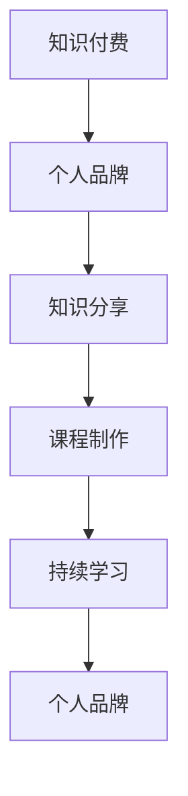

                 

## 1. 背景介绍

在数字化时代，信息爆炸和知识更新速度极快，对于程序员而言，如何在海量信息中脱颖而出，打造个人品牌，成为技术专家，是每一个有志之士的必修课。知识付费平台的兴起，为程序员提供了展示个人技术能力和分享知识的新渠道，成为一种新兴的个人品牌塑造方式。

### 1.1 问题由来

随着互联网和人工智能的快速发展，编程技能和领域知识的专业性和深度不断提升，成为一名“专家”变得越来越难。在信息泛滥的时代，如何让自己的知识和能力得到认可，如何让同行和雇主了解和信任，是每个程序员都面临的挑战。传统的技术交流方式如会议、论坛、博客等，逐渐无法满足快速迭代的需求，而知识付费平台的兴起，为程序员打造个人品牌提供了全新的机遇。

### 1.2 问题核心关键点

利用知识付费打造个人品牌，关键在于如何有效展示自己的技术深度、专业能力、思维方式和价值主张，以及如何将个人专业知识的积累转化为商业价值。知识付费平台如Coursera、Udemy、网易云课堂等，为程序员提供了展示才华和创造价值的新舞台。

具体而言，需要：
- 梳理自己的专业知识体系，明确核心竞争力。
- 在知识付费平台上开设课程或专栏，定期发布技术分享。
- 在课程中注重互动，积极解答学员提问，形成良性的互动社区。
- 通过个人品牌推广，扩大影响力，吸引更多的学员和粉丝。
- 构建持续的课程更新和迭代机制，确保内容的时效性和相关性。

## 2. 核心概念与联系

### 2.1 核心概念概述

为更好地理解如何利用知识付费打造个人品牌，我们需要首先明确一些核心概念：

- **知识付费**：指用户为获取知识而支付费用的行为。知识付费平台将知识以课程、文章、音频视频等形式进行商业化，用户通过付费获取优质学习资源。
- **个人品牌**：指个人通过其专业知识、专业技能、专业形象等在行业内建立的独特地位和影响力。
- **知识分享**：指个人通过各种渠道，将所学所知分享给他人，以助人成长。
- **课程制作**：指制作发布在知识付费平台上的课程，如技术分享、项目实战、软技能提升等。
- **持续学习**：指个人保持不断学习新知，更新知识库，以适应技术快速变化的需求。

这些概念之间的逻辑关系可以通过以下Mermaid流程图来展示：



这个流程图展示的知识付费与个人品牌之间的关系：

1. 知识付费平台为个人品牌提供展示渠道。
2. 知识分享是个人品牌形成的基础，是个人价值输出的方式。
3. 课程制作是在知识分享基础上的深化，更系统、更集中地传递知识。
4. 持续学习保障了知识分享和课程制作的源源不断的质量。
5. 最终，个人品牌在知识付费平台上逐步建立，形成影响力。

## 3. 核心算法原理 & 具体操作步骤
### 3.1 算法原理概述

个人品牌打造的核心在于系统的知识体系构建和不断的知识输出，这与算法原理在技术实现上有相似之处。个人品牌打造是一个多阶段的过程，包括但不限于知识梳理、内容创作、平台推广、学员互动、品牌建设等步骤。以下是各步骤的算法原理概述：

### 3.2 算法步骤详解

#### 步骤一：知识梳理与定位

- 梳理自身专业领域，明确核心竞争力。
- 定位目标受众，确定课程主题和难度。

#### 步骤二：课程设计

- 选择合适的知识付费平台，了解平台规则和用户需求。
- 设计课程大纲，确定每节课的主要内容和目标。
- 制作课程演示，包括开场白、课程框架、示例代码等。

#### 步骤三：内容创作

- 编写课程内容，结合实际项目或问题，深入浅出地讲解。
- 录制课程视频，注重语速、表达、互动。
- 制作练习和项目，提升学员动手能力。

#### 步骤四：平台推广

- 优化课程介绍和章节内容，使用吸引眼球的标题和描述。
- 在社交媒体、技术博客、开源社区等渠道推广课程。
- 利用SEO技术，提高课程在搜索引擎中的排名。

#### 步骤五：学员互动

- 建立学员社群，鼓励学员在课程评论区留言讨论。
- 定期解答学员问题，提供额外的学习资料。
- 根据学员反馈，调整课程内容和教学方法。

#### 步骤六：品牌建设

- 设计独特的个人logo和品牌名称，形成品牌标识。
- 发布个人博客或开设技术频道，持续输出高质量内容。
- 参与开源项目，展示技术能力和职业素养。

### 3.3 算法优缺点

#### 优点

- 构建个人品牌，提升行业影响力。
- 以知识付费的形式获得经济收入，激励持续学习和知识输出。
- 提供专业化技能和实战项目，满足学员的个性化学习需求。

#### 缺点

- 需要投入大量时间精力，知识产出压力大。
- 课程制作质量要求高，需要不断更新迭代。
- 平台推广和学员互动需要一定的技术和运营能力。

### 3.4 算法应用领域

知识付费打造个人品牌的方法适用于技术专家、开源贡献者、企业技术主管等多种角色。其应用领域包括但不限于：

- 技术培训：如编程语言、架构设计、数据分析等。
- 项目管理：如敏捷开发、测试驱动、版本控制等。
- 软技能提升：如沟通技巧、时间管理、问题解决等。
- 企业内部培训：为企业员工提供技术培训，提升团队能力。

## 4. 数学模型和公式 & 详细讲解

尽管个人品牌打造主要依赖于知识和技能，但在量化分析和数据驱动的教学改进方面，数学模型和公式的运用也是必不可少的。

### 4.1 数学模型构建

- **学员满意度模型**：$S=0.5a_1P_1 + 0.3a_2P_2 + 0.2a_3P_3$，其中$a_1$到$a_3$为课程的不同属性权重，$P_1$到$P_3$为学员对这些属性的评价分数。
- **课程推荐模型**：利用协同过滤算法，基于学员历史学习行为，推荐最合适的课程。
- **互动频率模型**：$F=k_1A+k_2Q+k_3T$，其中$k_1$到$k_3$为不同互动方式的权重，$A$到$T$为互动次数。

### 4.2 公式推导过程

- 对于学员满意度模型，通过对历史评价数据的线性回归分析，确定各个属性的权重，并计算学员的总体满意度$S$。
- 对于课程推荐模型，通过聚类算法将学员划分为不同的兴趣群体，再根据课程内容与学员群体的相似度，计算推荐概率。
- 对于互动频率模型，通过时间序列分析，发现互动次数与学员活跃度的关联，从而调整互动策略。

### 4.3 案例分析与讲解

以某技术专家在知识付费平台开设的Java编程课程为例：

- 课程内容包括基础语法、面向对象设计、数据结构、算法优化等。
- 课程视频的互动环节包括代码演示、学员提问、即时解答等。
- 课程推广通过技术博客、开源社区、社交媒体等渠道进行，并定期发布学习笔记和心得体会。
- 学员满意度调查结果显示，学员对代码实践环节的评价最高，对课程内容深度和互动质量的满意度也较高。

## 5. 项目实践：代码实例和详细解释说明
### 5.1 开发环境搭建

要开发个人品牌相关的知识付费平台课程，首先需要搭建开发环境：

1. **环境准备**：安装Python、Jupyter Notebook、Git等开发工具。
2. **框架选择**：选择Django、Flask等Web框架。
3. **数据库选择**：选择MySQL、PostgreSQL等关系型数据库，或MongoDB等非关系型数据库。
4. **课程管理**：利用课程管理工具如Coursera API、Udemy API等。

### 5.2 源代码详细实现

以下是一个简单的课程管理系统的代码示例，包括课程上传、学员管理、互动区等功能：

```python
from django.views.decorators.csrf import csrf_exempt
from django.http import JsonResponse
from django.shortcuts import render
from .models import Course, Student

@csrf_exempt
def course_upload(request):
    if request.method == 'POST':
        course_data = request.POST
        course = Course.objects.create(**course_data)
        return JsonResponse({'status': 'success', 'id': course.id})
    return JsonResponse({'status': 'error'})

@csrf_exempt
def student_login(request):
    if request.method == 'POST':
        student_data = request.POST
        student = Student.objects.filter(username=student_data['username']).first()
        if student and student.check_password(student_data['password']):
            return JsonResponse({'status': 'success', 'id': student.id})
    return JsonResponse({'status': 'error'})

@csrf_exempt
def course_page(request, course_id):
    course = Course.objects.get(id=course_id)
    students = Student.objects.filter(course_id=course_id)
    interactions = course.get_interactions()
    return render(request, 'course.html', {'course': course, 'students': students, 'interactions': interactions})
```

### 5.3 代码解读与分析

这段代码实现了一个简单的课程管理系统，包括以下几个关键点：

- **Django框架**：使用Django框架进行Web开发，提供路由、模板、表单等基础功能。
- **模型设计**：设计了Course和Student两个模型，分别对应课程和学员。
- **视图实现**：包括课程上传、学员登录、课程页面展示等功能，通过视图函数实现。
- **模板渲染**：使用模板语言渲染课程页面，展示课程内容、学员列表和互动记录。

## 6. 实际应用场景

### 6.1 技术培训课程

某知名企业内部技术主管利用知识付费平台开设了Java高级编程课程，包括Spring Boot、Spring Security、MyBatis等热门技术。该课程结合实际项目和问题，深入讲解实战技巧，受到了大量学员的欢迎，显著提升了内部开发团队的技术水平。

### 6.2 开源贡献者

某开源贡献者利用知识付费平台，开设了Git版本控制、Docker容器部署、微服务架构等系列课程，并利用课程收入支持开源社区的维护和发展。课程内容不仅具有高度实用性，还包含项目实战案例，吸引了大量技术爱好者和企业学员。

### 6.3 软技能提升

某IT专家开设了软技能提升课程，如时间管理、敏捷开发、团队协作等，通过案例分析和互动练习，帮助学员提升软技能。这些课程得到了学员的广泛好评，并在技术社区中传播开来，进一步提升了IT专家的个人影响力。

## 7. 工具和资源推荐

### 7.1 学习资源推荐

1. **Coursera**：提供来自全球顶尖高校和企业的课程，涵盖计算机科学、数据科学、商业管理等多个领域。
2. **Udemy**：以技术和软技能课程为主，通过项目实战提升学员的能力。
3. **网易云课堂**：提供丰富的IT课程资源，方便学员随时学习。
4. **Coursera API**和**Udemy API**：提供课程数据接口，方便开发者进行课程管理和学员管理。
5. **GitHub**：开源社区，提供丰富的项目实战案例和代码示例。

### 7.2 开发工具推荐

1. **Django**：Python Web框架，提供了全面的Web开发功能。
2. **Flask**：轻量级Web框架，适合快速开发简单的Web应用。
3. **MySQL**：关系型数据库，广泛用于数据存储和管理。
4. **Git**：版本控制系统，方便开发和协作。
5. **Jupyter Notebook**：交互式开发环境，适合数据科学和机器学习。

### 7.3 相关论文推荐

1. **《如何构建高效的学习社区》**：讨论如何利用知识付费平台构建高效学习社区，提升学习效果。
2. **《知识付费平台的课程推荐算法研究》**：研究基于协同过滤的课程推荐算法，提高课程推荐的准确性和个性化。
3. **《互动学习模式对学习效果的影响》**：探讨互动学习模式对学习效果的影响，提出互动学习的改进方案。

## 8. 总结：未来发展趋势与挑战

### 8.1 研究成果总结

利用知识付费平台打造个人品牌，已经在技术培训、开源贡献、软技能提升等多个领域得到了验证。通过课程设计和互动环节的优化，实现了知识共享和技术传播，提升了个人品牌的影响力。

### 8.2 未来发展趋势

未来，知识付费打造个人品牌将呈现以下几个发展趋势：

1. **课程内容的个性化和定制化**：利用人工智能和大数据分析，根据学员的学习行为和需求，推荐个性化的课程内容。
2. **跨平台的学习体验**：整合多种学习平台和工具，提供统一、便捷的学习体验。
3. **持续的学习和迭代**：课程内容实时更新和迭代，适应技术发展的最新趋势。
4. **多样化的知识呈现形式**：结合视频、文字、互动练习等多种形式，提高学习效果。
5. **全球化的知识传播**：打破地域限制，吸引全球学员，扩大个人品牌的影响力。

### 8.3 面临的挑战

尽管知识付费平台提供了丰富的个人品牌打造机会，但在实际应用中，仍面临以下挑战：

1. **知识产出压力**：课程制作需要投入大量时间和精力，知识产出压力较大。
2. **学员互动管理**：课程互动环节需要持续管理和维护，提高学员的参与度和满意度。
3. **平台竞争激烈**：知识付费市场竞争激烈，需要不断创新和优化，保持竞争力。
4. **课程质量保障**：课程内容需要经过严格的审查和测试，保证高质量和实用性。
5. **学员付费意愿**：如何提高学员的付费意愿，吸引更多的学员，是平台和课程开发者需要解决的问题。

### 8.4 研究展望

未来，知识付费平台在个人品牌打造方面的研究可以关注以下几个方向：

1. **利用人工智能优化课程推荐**：利用机器学习算法，提升课程推荐的准确性和个性化。
2. **建立知识付费生态系统**：整合多种资源和服务，构建知识付费生态，形成良性的知识传播机制。
3. **推动在线教育和终身学习的普及**：通过知识付费平台，推动在线教育和终身学习的普及，提升全社会的学习能力和素质。

## 9. 附录：常见问题与解答

**Q1：如何选择合适的知识付费平台？**

A: 选择合适的知识付费平台需要考虑多个因素，如平台用户规模、课程质量、平台功能、平台口碑等。可以通过对比分析，选择适合自己的平台。

**Q2：如何进行课程内容设计？**

A: 课程内容设计需要考虑学员的学习需求和实际问题，结合自身专业知识和项目经验，设计课程大纲和内容框架。可以参考其他成功的课程设计案例，结合自身特色进行优化。

**Q3：如何提高学员互动质量？**

A: 提高学员互动质量需要关注课程讨论区、学员社群、实时解答等环节。可以通过定期互动、课程讨论、作业反馈等方式，提升学员参与度和互动效果。

**Q4：如何管理课程质量？**

A: 课程质量管理需要建立严格的课程审核机制，定期审查和更新课程内容，保证课程的高质量和实用性。同时，可以利用学员反馈和课程评分，优化课程设计。

**Q5：如何推广课程？**

A: 课程推广可以通过社交媒体、技术博客、开源社区等多种渠道进行。可以发布课程预告、学员推荐、互动视频等，吸引潜在学员的关注和参与。

---

作者：禅与计算机程序设计艺术 / Zen and the Art of Computer Programming

