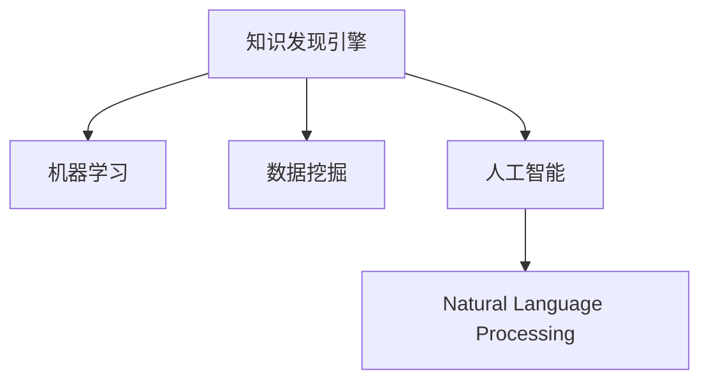

                 

# 程序员如何利用知识发现引擎提高学习效率

> 关键词：知识发现引擎, 学习效率, 机器学习, 数据挖掘, 人工智能

## 1. 背景介绍

### 1.1 问题由来
在现代信息技术飞速发展的时代，程序员面临的学习资料种类繁多，学习负担不断增加。如何从海量数据中高效筛选出有价值的学习资源，成为许多程序员关注的焦点。知识发现引擎（Knowledge Discovery Engine, KDE）作为人工智能领域的一个重要技术，具有强大的数据分析和知识挖掘能力，可以帮助程序员快速定位到最相关的学习资料，从而提高学习效率。

### 1.2 问题核心关键点
知识发现引擎是一种能够从大规模数据中自动发现知识、模式和规律的工具，广泛应用于数据挖掘、商业智能、医疗诊断等领域。对于程序员而言，它可以帮助我们从已有的编程案例、文档、代码库、问题库等数据中，自动提取、分析和总结出有价值的学习素材，以指导我们的编程学习。

在实际应用中，知识发现引擎可以：
1. 自动整理和学习资源，帮助我们筛选出最相关的资料。
2. 提供基于数据的学习推荐，帮助我们发现新知识和新方法。
3. 自动生成学习路径和计划，帮助我们系统化地学习。
4. 整合多种数据源，提供更加全面和深入的学习素材。

因此，利用知识发现引擎来提高学习效率，对于程序员而言，是一个非常值得探索的途径。

## 2. 核心概念与联系

### 2.1 核心概念概述

为了更好地理解知识发现引擎的原理和应用，本节将介绍几个密切相关的核心概念：

- 知识发现引擎（KDE）：一种利用机器学习和数据挖掘技术，自动从大量数据中提取有用信息、知识、模式和规律的工具。
- 机器学习（Machine Learning, ML）：一种通过数据训练模型，让计算机从数据中学习和改进的技术。
- 数据挖掘（Data Mining）：一种从海量数据中发现有用信息、模式和趋势的过程。
- 人工智能（Artificial Intelligence, AI）：一种通过模拟人类智能行为，使计算机能够执行复杂任务的技术。
- 自然语言处理（Natural Language Processing, NLP）：一种使计算机能够理解和处理人类语言的技术。

这些核心概念之间的逻辑关系可以通过以下Mermaid流程图来展示：



这个流程图展示了这个领域的核心概念及其之间的关系：

1. 知识发现引擎利用机器学习和数据挖掘技术，自动从大量数据中提取有用信息。
2. 机器学习是知识发现引擎的核心技术，通过训练模型来发现数据中的规律。
3. 数据挖掘是机器学习的一种应用，用于从大规模数据中发现模式和趋势。
4. 人工智能是更广泛的技术领域，包括自然语言处理、计算机视觉等多个子领域。

这些概念共同构成了知识发现引擎的基础，使其能够帮助程序员从大量数据中自动发现有用的学习素材。

## 3. 核心算法原理 & 具体操作步骤
### 3.1 算法原理概述

知识发现引擎的算法原理主要包括机器学习、数据挖掘和人工智能技术。其核心思想是通过构建数据模型，从大规模数据中自动发现知识、模式和规律，并将其应用于学习资料的整理、筛选和推荐。

以Python为例，我们可以使用Scikit-learn、TensorFlow、Keras等流行的机器学习框架来实现知识发现引擎的功能。这些框架提供了丰富的机器学习算法和模型，可以应用于分类、回归、聚类、降维等多种任务，从而实现数据挖掘和知识发现。

### 3.2 算法步骤详解

知识发现引擎的具体操作步骤如下：

**Step 1: 数据准备**
- 收集和学习资源的数据集，包括编程案例、文档、代码库、问题库等。
- 清洗数据，去除噪声和无关信息，确保数据质量。

**Step 2: 特征提取**
- 使用自然语言处理技术，对文档和代码进行分析，提取关键特征，如关键字、代码结构、注释等。
- 使用文本挖掘技术，对文档和问题进行分析，提取常见问题和解决方案。

**Step 3: 模型训练**
- 使用机器学习算法，训练数据模型，如朴素贝叶斯、支持向量机、决策树、随机森林等。
- 使用深度学习算法，训练神经网络模型，如卷积神经网络（CNN）、循环神经网络（RNN）、长短期记忆网络（LSTM）等。

**Step 4: 模型评估**
- 使用交叉验证等方法，评估模型的准确率和性能。
- 调整模型参数，优化模型效果。

**Step 5: 模型应用**
- 使用训练好的模型，对新的学习资源进行分析和推荐。
- 根据用户反馈和行为数据，进一步优化模型。

### 3.3 算法优缺点

知识发现引擎具有以下优点：
1. 自动化程度高，可以节省大量手工筛选和整理数据的时间。
2. 基于数据分析，可以发现数据中隐藏的知识和规律。
3. 可以整合多种数据源，提供更加全面和深入的学习素材。
4. 提供基于数据的推荐，可以帮助用户快速发现新知识和新方法。

同时，它也存在一些局限性：
1. 对数据质量要求较高，需要清洗和预处理大量的数据。
2. 模型训练需要大量的计算资源和时间，对于大规模数据集可能不适用。
3. 需要选择合适的算法和模型，不同的算法适用于不同的任务。
4. 结果可能存在偏差，需要人工干预和验证。

尽管存在这些局限性，知识发现引擎仍然是一个非常有潜力的工具，可以帮助程序员快速定位和筛选学习资源，提高学习效率。

### 3.4 算法应用领域

知识发现引擎不仅可以应用于程序员的学习，还可以广泛应用于以下领域：

- 医学领域：从大量的医疗数据中，自动发现疾病模式和规律，辅助医生进行诊断和治疗。
- 商业智能：从销售数据、客户反馈等大数据中，自动发现商业趋势和市场规律，指导企业决策。
- 金融领域：从交易数据、市场数据等大数据中，自动发现金融规律和风险，优化投资策略。
- 教育领域：从学生数据、课程数据等大数据中，自动发现学习模式和规律，提供个性化学习建议。
- 公共安全：从监控视频、社会数据等大数据中，自动发现异常行为和规律，提高公共安全水平。

## 4. 数学模型和公式 & 详细讲解 & 举例说明

### 4.1 数学模型构建

知识发现引擎的数学模型主要基于机器学习和数据挖掘技术。我们可以使用以下模型来进行数据处理和分析：

- 朴素贝叶斯分类器（Naive Bayes Classifier）：用于分类问题，模型简单高效，常用于文本分类和垃圾邮件过滤。
- 支持向量机（Support Vector Machine, SVM）：用于分类和回归问题，模型可解释性强，常用于图像分类和回归分析。
- 决策树（Decision Tree）：用于分类和回归问题，模型易于解释和调试，常用于数据可视化。
- 随机森林（Random Forest）：用于分类和回归问题，模型鲁棒性强，常用于大规模数据集分析。
- 卷积神经网络（Convolutional Neural Network, CNN）：用于图像分类和特征提取，模型复杂但效果显著，常用于图像处理和计算机视觉。
- 循环神经网络（Recurrent Neural Network, RNN）：用于序列数据分析，模型可以处理时间序列数据，常用于自然语言处理和语音识别。
- 长短期记忆网络（Long Short-Term Memory, LSTM）：一种特殊类型的RNN，可以更好地处理长序列数据，常用于文本生成和语言建模。

### 4.2 公式推导过程

以朴素贝叶斯分类器为例，推导其分类决策公式：

设训练集为 $D=\{(x_i, y_i)\}_{i=1}^N$，其中 $x_i$ 为输入特征，$y_i$ 为标签。根据贝叶斯公式，可以计算样本 $x$ 属于类别 $c$ 的后验概率 $P(c|x)$：

$$
P(c|x) = \frac{P(c)}{P(x|c)P(x)}
$$

其中，$P(x|c)$ 表示在类别 $c$ 的条件下，输入特征 $x$ 的概率分布，可以通过训练得到。$P(c)$ 表示类别 $c$ 的概率分布，可以通过训练得到。$P(x)$ 表示输入特征 $x$ 的概率分布，通常假设为高斯分布。

在实际应用中，我们通过最大化后验概率来确定样本 $x$ 的类别 $c$：

$$
c = \mathop{\arg\max}_c P(c|x)
$$

这就是朴素贝叶斯分类器的分类决策公式。

### 4.3 案例分析与讲解

假设我们有一组编程案例数据集，每条记录包含问题描述、代码和标签等信息。我们可以使用朴素贝叶斯分类器对其进行分析，提取常见问题和解决方案，并自动生成学习路径和计划。具体步骤如下：

**Step 1: 数据预处理**
- 收集编程案例数据集，包括问题描述、代码和标签等信息。
- 清洗数据，去除噪声和无关信息，确保数据质量。

**Step 2: 特征提取**
- 使用自然语言处理技术，对问题描述进行分析，提取常见问题和关键词。
- 使用文本挖掘技术，对代码进行分析，提取常见代码结构和注释。

**Step 3: 模型训练**
- 使用朴素贝叶斯分类器，训练数据模型，预测问题所属的标签。
- 使用交叉验证等方法，评估模型的准确率和性能。

**Step 4: 模型应用**
- 使用训练好的模型，对新的编程案例进行分类和推荐。
- 根据用户反馈和行为数据，进一步优化模型。

## 5. 项目实践：代码实例和详细解释说明

### 5.1 开发环境搭建

在进行知识发现引擎实践前，我们需要准备好开发环境。以下是使用Python进行Scikit-learn开发的环境配置流程：

1. 安装Anaconda：从官网下载并安装Anaconda，用于创建独立的Python环境。

2. 创建并激活虚拟环境：
```bash
conda create -n sklearn-env python=3.8 
conda activate sklearn-env
```

3. 安装Scikit-learn：
```bash
conda install scikit-learn
```

4. 安装相关库：
```bash
pip install numpy pandas scikit-learn matplotlib
```

5. 安装TensorFlow：
```bash
pip install tensorflow
```

6. 安装Keras：
```bash
pip install keras
```

完成上述步骤后，即可在`sklearn-env`环境中开始项目实践。

### 5.2 源代码详细实现

这里我们以朴素贝叶斯分类器为例，给出使用Scikit-learn进行知识发现引擎的代码实现。

首先，定义数据预处理函数：

```python
import numpy as np
import pandas as pd
from sklearn.feature_extraction.text import CountVectorizer

def preprocess_data(data_path):
    # 读取数据集
    df = pd.read_csv(data_path)
    
    # 清洗数据
    df = df.dropna()
    df = df.drop_duplicates()
    
    # 提取特征
    X = df['question']
    y = df['label']
    
    # 特征提取
    vectorizer = CountVectorizer(stop_words='english')
    X = vectorizer.fit_transform(X)
    
    return X, y
```

然后，定义模型训练函数：

```python
from sklearn.naive_bayes import MultinomialNB
from sklearn.model_selection import train_test_split
from sklearn.metrics import accuracy_score

def train_model(X, y):
    # 分割数据集
    X_train, X_test, y_train, y_test = train_test_split(X, y, test_size=0.2, random_state=42)
    
    # 训练模型
    model = MultinomialNB(alpha=1.0)
    model.fit(X_train, y_train)
    
    # 评估模型
    y_pred = model.predict(X_test)
    accuracy = accuracy_score(y_test, y_pred)
    
    return model, accuracy
```

接着，定义模型应用函数：

```python
def apply_model(model, X_new):
    # 预测新数据
    y_pred = model.predict(X_new)
    
    return y_pred
```

最后，启动模型训练和应用流程：

```python
data_path = 'path/to/data.csv'
X, y = preprocess_data(data_path)
model, accuracy = train_model(X, y)
X_new = vectorizer.transform(['New programming question'])
y_pred = apply_model(model, X_new)
print(f'Accuracy: {accuracy:.2f}%, Predicted label: {y_pred[0]}')
```

以上就是使用Scikit-learn进行朴素贝叶斯分类器的代码实现。可以看到，借助Scikit-learn库，我们可以用非常简洁的代码实现知识发现引擎的功能。

### 5.3 代码解读与分析

让我们再详细解读一下关键代码的实现细节：

**preprocess_data函数**：
- 读取数据集，并进行清洗和预处理，包括去除噪声、去除重复项等。
- 使用CountVectorizer对文本数据进行特征提取，转换为向量形式。

**train_model函数**：
- 使用train_test_split将数据集划分为训练集和测试集。
- 使用MultinomialNB训练朴素贝叶斯分类器模型。
- 使用accuracy_score评估模型在测试集上的准确率。

**apply_model函数**：
- 使用训练好的模型对新的文本数据进行分类和预测。

**训练和应用流程**：
- 在数据预处理、模型训练、模型应用等各个环节，利用Scikit-learn的内置函数，可以极大地简化代码实现。
- 在实际应用中，还需要针对具体任务进行优化，如选择更合适的特征提取方法、调整模型参数等。

## 6. 实际应用场景

### 6.1 智能编程助手

基于知识发现引擎的编程助手，可以自动从代码库和问题库中提取常见问题和解决方案，为用户提供即时的编程帮助。具体而言，当用户遇到编程问题时，编程助手可以自动分析问题描述，提取关键信息，并从知识库中查找相似问题和解决方案。这不仅能提高用户编程效率，还能促进知识共享和传播。

### 6.2 学习路径推荐

知识发现引擎可以根据用户的学习记录和行为数据，自动生成个性化的学习路径和计划，帮助用户系统化地学习。具体而言，知识发现引擎可以分析用户已学过的课程、掌握的技能、遇到的问题等信息，自动推荐相关课程和资源，避免重复学习和遗漏关键知识。

### 6.3 问题解答系统

基于知识发现引擎的问题解答系统，可以自动从问题库中提取常见问题和解决方案，为初学者提供即时的解答。具体而言，当用户提出问题时，问题解答系统可以自动分析问题描述，提取关键信息，并从知识库中查找最相关的解决方案。这不仅能提高问题解答的效率，还能增强知识库的可用性和普及性。

### 6.4 未来应用展望

随着知识发现引擎技术的不断进步，其在程序员学习中的应用前景将更加广阔。未来，知识发现引擎不仅可以应用于简单的编程问题，还可以应用于更复杂的算法设计、系统架构设计等高级任务。此外，知识发现引擎还可以与其他人工智能技术进行更深入的融合，如自然语言处理、机器翻译等，构建更加智能化的学习系统。

## 7. 工具和资源推荐

### 7.1 学习资源推荐

为了帮助程序员系统掌握知识发现引擎的理论基础和实践技巧，这里推荐一些优质的学习资源：

1. 《Python数据科学手册》：一本涵盖数据科学和机器学习基础知识的书籍，适合初学者入门。

2. Scikit-learn官方文档：Scikit-learn库的官方文档，详细介绍了各个机器学习算法的实现细节和使用示例，是学习知识发现引擎的必备资料。

3. Kaggle平台：数据科学和机器学习的竞赛平台，提供了大量的数据集和解决方案，可以供程序员学习和实践。

4. 《机器学习实战》：一本实用性很强的机器学习入门书籍，包含大量实战案例和代码实现。

5. 《深度学习》：斯坦福大学开设的深度学习课程，提供了Lecture视频和配套作业，可以深入学习深度学习技术。

通过对这些资源的学习实践，相信你一定能够快速掌握知识发现引擎的精髓，并用于解决实际的编程问题。

### 7.2 开发工具推荐

高效的开发离不开优秀的工具支持。以下是几款用于知识发现引擎开发的常用工具：

1. Scikit-learn：Python的机器学习库，提供了丰富的机器学习算法和模型，是知识发现引擎的核心工具。

2. TensorFlow：Google主导开发的深度学习框架，支持大规模分布式训练，适合处理复杂的数据任务。

3. Keras：一种简单易用的深度学习库，可以简化模型的设计和训练过程。

4. Weights & Biases：模型训练的实验跟踪工具，可以记录和可视化模型训练过程中的各项指标，方便对比和调优。

5. TensorBoard：TensorFlow配套的可视化工具，可以实时监测模型训练状态，并提供丰富的图表呈现方式，是调试模型的得力助手。

6. Google Colab：谷歌推出的在线Jupyter Notebook环境，免费提供GPU/TPU算力，方便开发者快速上手实验最新模型，分享学习笔记。

合理利用这些工具，可以显著提升知识发现引擎的开发效率，加快创新迭代的步伐。

### 7.3 相关论文推荐

知识发现引擎的研究源于学界的持续研究。以下是几篇奠基性的相关论文，推荐阅读：

1. "Knowledge Discovery in Databases"（数据库中的知识发现）：1999年，Jerry Kilian和Michael Stonebraker撰写的经典论文，奠定了知识发现领域的理论基础。

2. "Data Mining: Concepts and Techniques"（数据挖掘：概念与技术）：2003年，Jian Pei和Manish Agrawal撰写的经典书籍，详细介绍了数据挖掘的各种技术和算法。

3. "Pattern Recognition and Machine Learning"（模式识别与机器学习）：2006年，Christopher Bishop撰写的经典书籍，涵盖了机器学习的各个方面。

4. "The Elements of Statistical Learning"（统计学习基础）：2009年，Tibshirani、Hastie和Friedman撰写的经典书籍，详细介绍了统计学习的方法和应用。

5. "Deep Learning"（深度学习）：2015年，Ian Goodfellow、Yoshua Bengio和Aaron Courville撰写的经典书籍，介绍了深度学习的基本概念和前沿技术。

这些论文代表了这个领域的经典成果，帮助程序员了解知识发现引擎的最新进展和技术细节。

## 8. 总结：未来发展趋势与挑战

### 8.1 总结

本文对知识发现引擎进行了全面系统的介绍。首先阐述了知识发现引擎的基本原理和应用背景，明确了其在提高程序员学习效率方面的独特价值。其次，从原理到实践，详细讲解了知识发现引擎的算法原理和操作步骤，给出了知识发现引擎任务开发的完整代码实例。同时，本文还广泛探讨了知识发现引擎在智能编程助手、学习路径推荐、问题解答系统等多个场景中的应用前景，展示了其巨大的潜力。此外，本文精选了知识发现引擎的各类学习资源，力求为程序员提供全方位的技术指引。

通过本文的系统梳理，可以看到，知识发现引擎已经广泛应用于数据挖掘和人工智能领域，能够帮助程序员快速定位和筛选学习资源，提高学习效率。未来，伴随知识发现引擎技术的不断进步，相信其在程序员学习中的应用将更加广泛，带来更多的学习便利和效率提升。

### 8.2 未来发展趋势

展望未来，知识发现引擎的发展趋势如下：

1. 深度学习应用的普及：随着深度学习技术的发展，知识发现引擎将越来越多地采用深度学习算法，提高模型的准确率和泛化能力。

2. 跨领域知识融合：知识发现引擎将进一步整合多种数据源，如文本、图像、视频、语音等，构建更加全面和深入的知识库。

3. 个性化学习推荐：知识发现引擎将结合用户行为数据，提供更加个性化的学习推荐，帮助用户快速发现新知识和新方法。

4. 自动化和智能化：知识发现引擎将进一步自动化和智能化，减少人工干预和调优，提高系统的效率和效果。

5. 与其他技术的融合：知识发现引擎将与其他人工智能技术，如自然语言处理、机器翻译等，进行更深入的融合，构建更加智能化的学习系统。

这些趋势凸显了知识发现引擎的广阔前景。这些方向的探索发展，必将进一步提升知识发现引擎的性能和应用范围，为程序员的学习提供更多便利和效率提升。

### 8.3 面临的挑战

尽管知识发现引擎已经取得了一定的成果，但在迈向更加智能化、普适化应用的过程中，它仍面临着诸多挑战：

1. 数据质量问题：知识发现引擎对数据质量要求较高，需要清洗和预处理大量的数据，这可能耗费大量的时间和精力。

2. 模型复杂性：知识发现引擎涉及多种机器学习算法和模型，选择和优化模型的难度较大，需要大量的实验和调参。

3. 计算资源需求高：知识发现引擎处理大规模数据集需要大量的计算资源，可能面临硬件瓶颈。

4. 结果准确性：知识发现引擎的模型评估和调优需要依赖大量标注数据，模型结果可能存在偏差。

5. 解释性和可控性：知识发现引擎的模型结果和决策过程缺乏可解释性，难以进行调试和优化。

6. 安全性和隐私保护：知识发现引擎可能涉及用户隐私数据，需要考虑数据安全性和隐私保护问题。

7. 与其他系统的集成：知识发现引擎需要与其他系统进行集成，如编程助手、问题解答系统等，实现无缝连接和协作。

这些挑战需要研究人员和开发者共同努力，不断改进和优化知识发现引擎的技术和应用。相信随着技术的不断进步，知识发现引擎将越来越成熟，为程序员提供更加智能、高效、可靠的学习体验。

### 8.4 研究展望

面对知识发现引擎所面临的挑战，未来的研究需要在以下几个方面寻求新的突破：

1. 高效数据预处理技术：开发高效的数据清洗和预处理算法，减少数据处理的复杂度和时间消耗。

2. 自动化模型选择和优化：开发自动化模型选择和优化的技术，提高模型训练和调优的效率和效果。

3. 低成本高效率计算：开发低成本、高效率的计算资源调度技术，支持大规模数据集的快速处理和分析。

4. 可解释性和可控性增强：开发可解释性和可控性强的模型，增强知识发现引擎的决策过程的可解释性和可控性。

5. 多模态数据融合技术：开发多模态数据融合技术，整合文本、图像、视频、语音等多种数据，构建更加全面和深入的知识库。

6. 与其他系统的无缝集成：开发知识发现引擎与其他系统的无缝集成技术，实现知识共享和协同工作。

这些研究方向将有助于知识发现引擎技术的进一步完善和发展，为程序员提供更加智能、高效、可靠的学习和开发环境。总之，知识发现引擎的应用前景广阔，未来必将在程序员的学习和开发中发挥更大的作用。

## 9. 附录：常见问题与解答

**Q1：知识发现引擎是否适用于所有学习场景？**

A: 知识发现引擎在大多数学习场景中都能发挥作用，尤其适用于编程学习、数据分析、文本处理等领域。但对于某些需要高度人工干预和创造性的领域，如艺术创作、哲学思考等，可能效果有限。

**Q2：知识发现引擎需要大量标注数据吗？**

A: 知识发现引擎通常需要标注数据进行模型训练，但在微调阶段，可以通过无监督学习或半监督学习的方式，减少对标注数据的依赖。

**Q3：知识发现引擎的计算资源需求高吗？**

A: 知识发现引擎处理大规模数据集确实需要大量计算资源，但随着计算资源和硬件技术的不断发展，其计算需求逐渐降低，越来越多的公司和个人能够使用知识发现引擎进行数据挖掘和知识发现。

**Q4：知识发现引擎的决策过程是否可解释？**

A: 知识发现引擎的模型结果和决策过程通常缺乏可解释性，但研究人员正在开发可解释性和可控性强的模型，以提高其应用价值。

**Q5：知识发现引擎的未来发展方向是什么？**

A: 知识发现引擎的未来发展方向包括深度学习应用的普及、跨领域知识融合、个性化学习推荐、自动化和智能化、与其他技术的融合等。这些方向将推动知识发现引擎技术的不断进步，带来更多便利和效率提升。

---

作者：禅与计算机程序设计艺术 / Zen and the Art of Computer Programming

