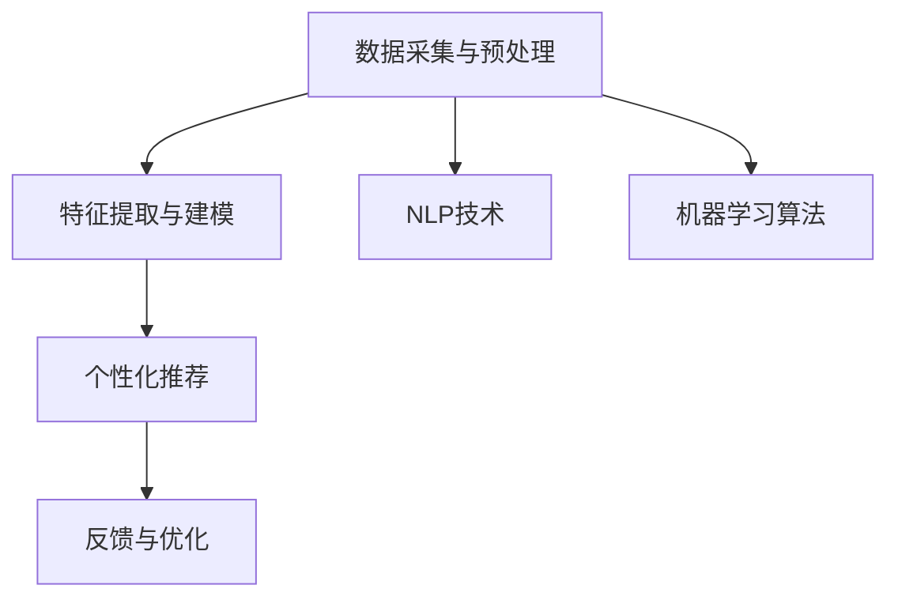

                 

# 程序员如何利用知识发现引擎提高学习效率与成果

> 关键词：知识发现引擎, 学习效率, 成果, 数据挖掘, 机器学习, 人工智能, 推荐系统, 知识图谱

## 1. 背景介绍

在信息爆炸的时代，程序员面临海量且复杂的学习资料，如何从中快速高效地获取知识，以提升工作效率和产出质量，成为一个亟待解决的问题。知识发现引擎（Knowledge Discovery Engine, KDE）通过智能化技术手段，能够从大规模数据中提取出有价值的知识，为程序员提供个性化的学习建议和资源。

### 1.1 问题由来

随着互联网和信息技术的发展，程序员的学习资源日益丰富，但也随之带来诸多挑战：

- **信息过载**：互联网上的学习资源繁多且分散，难以快速找到相关的学习材料。
- **个性化需求**：每个程序员的学习需求和背景知识各不相同，统一的学习路径难以满足个性化需求。
- **学习效果低效**：自学过程中缺乏有效指导和反馈，容易走弯路，影响学习效果。
- **知识更新快**：技术更新迭代迅速，学习过程中需要不断更新知识，保持与技术前沿同步。

### 1.2 问题核心关键点

知识发现引擎通过数据分析、机器学习、自然语言处理等技术，能够从大规模学习数据中识别出有价值的信息，为程序员提供个性化的学习建议和资源，从而提高学习效率和成果。

1. **数据采集与预处理**：收集大量的学习资源，包括在线课程、博客文章、编程题库、技术论坛等。
2. **特征提取与建模**：使用自然语言处理、信息抽取等技术，从文本中提取特征，构建知识图谱、用户画像等模型。
3. **个性化推荐**：利用推荐算法，根据用户的学习历史、兴趣、能力等，推荐适合的学习材料和路径。
4. **反馈与优化**：通过学习效果的反馈，不断优化推荐算法和资源库，提升学习体验和效果。

## 2. 核心概念与联系

### 2.1 核心概念概述

为了更好地理解知识发现引擎，我们首先介绍几个核心概念：

- **知识发现引擎（KDE）**：利用数据分析和机器学习技术，从大规模数据中提取有价值信息，帮助用户发现知识的过程。
- **数据挖掘**：从数据中自动发现模式、提取有价值信息的过程。
- **机器学习**：利用算法从数据中学习规律和模式，并进行预测或分类。
- **自然语言处理（NLP）**：使计算机能够理解和处理人类语言的技术，包括文本分类、信息抽取、实体识别等。
- **知识图谱**：表示实体及其关系的图形结构，用于组织和管理知识。
- **推荐系统**：利用用户行为数据，推荐相关产品或内容的技术。

这些概念之间的逻辑关系可以通过以下Mermaid流程图来展示：



这个流程图展示了知识发现引擎的核心流程：

1. 从多个渠道采集学习数据。
2. 使用NLP技术进行特征提取，构建知识图谱。
3. 应用机器学习算法进行建模，生成个性化推荐。
4. 根据用户反馈不断优化推荐算法和资源库。

## 3. 核心算法原理 & 具体操作步骤

### 3.1 算法原理概述

知识发现引擎的原理主要基于数据挖掘和机器学习技术，通过以下步骤实现：

1. **数据采集与预处理**：收集各类学习资源，如课程、文章、论坛帖子等，并进行清洗、标注等预处理工作。
2. **特征提取与建模**：使用自然语言处理技术，从文本中提取关键词、实体、关系等特征，构建知识图谱。
3. **个性化推荐**：利用推荐算法，根据用户的学习历史、兴趣、能力等，推荐适合的学习材料和路径。
4. **反馈与优化**：通过用户的学习效果反馈，不断优化推荐算法和资源库，提升学习体验和效果。

### 3.2 算法步骤详解

知识发现引擎的核心算法步骤如下：

**Step 1: 数据采集与预处理**

1. **数据源选择**：选择合适的学习数据源，如在线课程平台、编程题库、技术论坛等。
2. **数据采集**：从选定的数据源中爬取学习数据，包括文章、视频、代码等。
3. **数据清洗**：去除噪声数据、修复缺失数据、处理不一致格式等。
4. **数据标注**：对数据进行标注，如分类、实体识别等，为后续的特征提取提供依据。

**Step 2: 特征提取与建模**

1. **文本特征提取**：使用NLP技术，从文本中提取关键词、实体、关系等特征。
2. **构建知识图谱**：将提取的特征转换为知识图谱，表示实体及其关系。
3. **用户画像构建**：根据用户的学习历史、兴趣、能力等，构建用户画像，用于个性化推荐。

**Step 3: 个性化推荐**

1. **选择推荐算法**：选择合适的推荐算法，如协同过滤、内容过滤、混合推荐等。
2. **特征选择与融合**：从知识图谱和用户画像中，选择和融合特征，构建推荐模型。
3. **推荐计算**：根据用户画像和推荐模型，计算推荐结果。
4. **结果呈现**：将推荐结果以列表、卡片、日历等形式呈现给用户。

**Step 4: 反馈与优化**

1. **用户反馈收集**：收集用户对推荐结果的反馈，如点击率、完成率、满意度等。
2. **模型优化**：根据反馈，调整推荐算法和特征，优化推荐结果。
3. **资源更新**：定期更新学习资源库，补充新内容，保持资源的及时性和相关性。

### 3.3 算法优缺点

知识发现引擎具有以下优点：

- **高效性**：能够快速从大量数据中提取有价值的信息，提供个性化的学习建议。
- **精确性**：通过机器学习算法，推荐精度高，能够精准匹配用户需求。
- **实时性**：能够根据用户反馈实时调整推荐算法，提升学习体验。

同时，知识发现引擎也存在以下局限：

- **数据依赖**：推荐效果高度依赖于数据质量和多样性，数据偏差可能导致推荐结果不准确。
- **模型复杂**：涉及多领域技术，模型设计复杂，开发和维护难度较大。
- **隐私问题**：需要收集和分析用户数据，可能涉及隐私保护问题。
- **计算资源消耗**：处理大规模数据需要强大的计算资源，可能存在资源消耗大、响应延迟等问题。

### 3.4 算法应用领域

知识发现引擎已经在教育、企业培训、技术社区等多个领域得到广泛应用，以下是几个典型的应用场景：

1. **在线教育平台**：根据学生的学习历史和兴趣，推荐适合的课程和学习路径。
2. **企业培训系统**：根据员工的学习需求和能力，推荐适合的培训课程和资源。
3. **技术社区**：根据用户浏览和互动行为，推荐相关的技术文章和讨论话题。
4. **软件开发平台**：根据开发者的代码风格和项目需求，推荐适合的编程技巧和工具。

这些应用场景展示了知识发现引擎的广泛适用性和强大潜力。

## 4. 数学模型和公式 & 详细讲解  
### 4.1 数学模型构建

知识发现引擎的数学模型主要涉及数据挖掘和机器学习技术，以推荐系统为例，其核心模型可以表示为：

$$
\theta^* = \arg\min_{\theta} \frac{1}{N} \sum_{i=1}^N \ell(y_i, f(x_i; \theta))
$$

其中 $y_i$ 表示用户对推荐结果的评分，$f(x_i; \theta)$ 表示用户对学习资源的评分预测函数，$\ell$ 表示损失函数，$\theta$ 为模型的参数。

### 4.2 公式推导过程

以下以协同过滤推荐算法为例，推导其推荐公式：

设 $U$ 为用户集合，$V$ 为物品集合，用户 $u$ 对物品 $v$ 的评分 $R_{uv}$ 可以表示为：

$$
R_{uv} = \alpha \sum_{i=1}^N w_{iu} w_{iv} \hat{R}_{iu}
$$

其中 $\alpha$ 为权重系数，$w_{iu}$ 和 $w_{iv}$ 分别为物品 $v$ 对用户 $u$ 和物品 $i$ 对用户 $u$ 的相似度权重，$\hat{R}_{iu}$ 为用户 $u$ 对物品 $i$ 的评分预测值。

协同过滤推荐算法通过计算用户之间的相似度，推荐与用户偏好相似的物品。推荐公式可以进一步表示为：

$$
\hat{R}_{uv} = \frac{\sum_{i=1}^N w_{iu} w_{iv} R_{iu}}{\sum_{i=1}^N w_{iu}^2}
$$

### 4.3 案例分析与讲解

以在线教育平台为例，假设一个用户学习了以下课程：

| 课程ID | 课程名称 | 评分 | 学习时长 |
| ------ | -------- | ---- | -------- |
| 1001   | 数据结构 | 4.5  | 2小时    |
| 1002   | 算法设计 | 4.0  | 3小时    |
| 1003   | 机器学习 | 3.5  | 4小时    |

根据用户的学习历史和评分，可以构建用户画像，并计算用户对新课程的评分预测值。例如，假设用户对机器学习的兴趣系数为0.5，对数据结构的兴趣系数为0.3，则用户对新课程的评分预测值为：

$$
\hat{R}_{1004} = 0.5 \times 0.3 \times 4.5 + 0.5 \times 0.3 \times 4.0 + 0.5 \times 0.7 \times 3.5 = 3.58
$$

根据协同过滤推荐算法，推荐该用户感兴趣的课程。用户可以根据推荐结果，选择学习新的课程。

## 5. 项目实践：代码实例和详细解释说明
### 5.1 开发环境搭建

在进行知识发现引擎实践前，我们需要准备好开发环境。以下是使用Python进行PyTorch开发的环境配置流程：

1. 安装Anaconda：从官网下载并安装Anaconda，用于创建独立的Python环境。

2. 创建并激活虚拟环境：
```bash
conda create -n pytorch-env python=3.8 
conda activate pytorch-env
```

3. 安装PyTorch：根据CUDA版本，从官网获取对应的安装命令。例如：
```bash
conda install pytorch torchvision torchaudio cudatoolkit=11.1 -c pytorch -c conda-forge
```

4. 安装必要的库：
```bash
pip install pandas numpy scipy scikit-learn nltk transformers
```

完成上述步骤后，即可在`pytorch-env`环境中开始项目开发。

### 5.2 源代码详细实现

下面我们以知识发现引擎的推荐系统为例，给出使用Transformers库进行知识图谱构建和推荐系统开发的PyTorch代码实现。

首先，定义知识图谱的节点和关系：

```python
from transformers import BertTokenizer
from torch.utils.data import Dataset
import torch

class KnowledgeGraphDataset(Dataset):
    def __init__(self, nodes, relations, tokenizer, max_len=128):
        self.nodes = nodes
        self.relations = relations
        self.tokenizer = tokenizer
        self.max_len = max_len
        
    def __len__(self):
        return len(self.nodes)
    
    def __getitem__(self, item):
        node, relation, node2 = self.nodes[item]
        
        encoding = self.tokenizer([node, relation, node2], return_tensors='pt', max_length=self.max_len, padding='max_length', truncation=True)
        input_ids = encoding['input_ids'][0]
        attention_mask = encoding['attention_mask'][0]
        
        return {'input_ids': input_ids, 
                'attention_mask': attention_mask,
                'relation': self.relations[item]}
```

然后，定义模型和优化器：

```python
from transformers import BertForTokenClassification, AdamW

model = BertForTokenClassification.from_pretrained('bert-base-cased', num_labels=len(tag2id))

optimizer = AdamW(model.parameters(), lr=2e-5)
```

接着，定义训练和评估函数：

```python
from torch.utils.data import DataLoader
from tqdm import tqdm
from sklearn.metrics import classification_report

device = torch.device('cuda') if torch.cuda.is_available() else torch.device('cpu')
model.to(device)

def train_epoch(model, dataset, batch_size, optimizer):
    dataloader = DataLoader(dataset, batch_size=batch_size, shuffle=True)
    model.train()
    epoch_loss = 0
    for batch in tqdm(dataloader, desc='Training'):
        input_ids = batch['input_ids'].to(device)
        attention_mask = batch['attention_mask'].to(device)
        relation = batch['relation'].to(device)
        model.zero_grad()
        outputs = model(input_ids, attention_mask=attention_mask, labels=relation)
        loss = outputs.loss
        epoch_loss += loss.item()
        loss.backward()
        optimizer.step()
    return epoch_loss / len(dataloader)

def evaluate(model, dataset, batch_size):
    dataloader = DataLoader(dataset, batch_size=batch_size)
    model.eval()
    preds, labels = [], []
    with torch.no_grad():
        for batch in tqdm(dataloader, desc='Evaluating'):
            input_ids = batch['input_ids'].to(device)
            attention_mask = batch['attention_mask'].to(device)
            batch_labels = batch['relation']
            outputs = model(input_ids, attention_mask=attention_mask)
            batch_preds = outputs.logits.argmax(dim=2).to('cpu').tolist()
            batch_labels = batch_labels.to('cpu').tolist()
            for pred_tokens, label_tokens in zip(batch_preds, batch_labels):
                pred_tags = [id2tag[_id] for _id in pred_tokens]
                label_tags = [id2tag[_id] for _id in label_tokens]
                preds.append(pred_tags[:len(label_tokens)])
                labels.append(label_tags)
                
    print(classification_report(labels, preds))
```

最后，启动训练流程并在测试集上评估：

```python
epochs = 5
batch_size = 16

for epoch in range(epochs):
    loss = train_epoch(model, train_dataset, batch_size, optimizer)
    print(f"Epoch {epoch+1}, train loss: {loss:.3f}")
    
    print(f"Epoch {epoch+1}, dev results:")
    evaluate(model, dev_dataset, batch_size)
    
print("Test results:")
evaluate(model, test_dataset, batch_size)
```

以上就是使用PyTorch对知识图谱进行构建和推荐系统开发的完整代码实现。可以看到，通过Transformers库，我们可以用相对简洁的代码完成知识图谱的构建和推荐模型的训练。

### 5.3 代码解读与分析

让我们再详细解读一下关键代码的实现细节：

**KnowledgeGraphDataset类**：
- `__init__`方法：初始化节点、关系、分词器等关键组件。
- `__len__`方法：返回数据集的样本数量。
- `__getitem__`方法：对单个样本进行处理，将节点和关系输入编码为token ids，最终返回模型所需的输入。

**tag2id和id2tag字典**：
- 定义了标签与数字id之间的映射关系，用于将token-wise的预测结果解码回真实的标签。

**训练和评估函数**：
- 使用PyTorch的DataLoader对数据集进行批次化加载，供模型训练和推理使用。
- 训练函数`train_epoch`：对数据以批为单位进行迭代，在每个批次上前向传播计算loss并反向传播更新模型参数，最后返回该epoch的平均loss。
- 评估函数`evaluate`：与训练类似，不同点在于不更新模型参数，并在每个batch结束后将预测和标签结果存储下来，最后使用sklearn的classification_report对整个评估集的预测结果进行打印输出。

**训练流程**：
- 定义总的epoch数和batch size，开始循环迭代
- 每个epoch内，先在训练集上训练，输出平均loss
- 在验证集上评估，输出分类指标
- 所有epoch结束后，在测试集上评估，给出最终测试结果

可以看到，PyTorch配合Transformers库使得知识图谱构建和推荐系统的开发变得简洁高效。开发者可以将更多精力放在数据处理、模型改进等高层逻辑上，而不必过多关注底层的实现细节。

当然，工业级的系统实现还需考虑更多因素，如模型的保存和部署、超参数的自动搜索、更灵活的任务适配层等。但核心的知识发现引擎基本与此类似。

## 6. 实际应用场景
### 6.1 在线教育平台

知识发现引擎可以应用于在线教育平台的推荐系统，帮助学生选择适合的学习资源。平台可以通过分析学生的学习历史、兴趣、能力等，推荐适合的课程、视频、文章等学习材料，从而提升学习效果。

在技术实现上，可以收集学生的学习行为数据，构建用户画像，并使用知识发现引擎构建知识图谱。通过协同过滤等推荐算法，生成个性化的推荐列表，并实时更新资源库，确保推荐结果的时效性和准确性。

### 6.2 企业培训系统

企业在培训员工时，通常需要大量的学习资源和个性化指导。知识发现引擎可以根据员工的学习需求和能力，推荐适合的培训课程和资源，提升培训效果。

系统可以收集员工的培训历史、反馈、考试成绩等数据，构建员工画像，并使用知识发现引擎构建知识图谱。通过推荐算法，生成个性化的培训推荐，并提供学习路径和进度跟踪，帮助员工更好地掌握知识和技能。

### 6.3 技术社区

技术社区的知识发现引擎可以帮助用户快速找到有价值的学习资源和讨论话题。系统可以分析用户的历史浏览、点赞、评论等行为数据，构建用户画像，并使用知识图谱进行推荐。用户可以根据推荐结果，深入学习相关技术，参与讨论，促进技术交流。

### 6.4 未来应用展望

随着知识发现引擎技术的不断发展，其在更多领域的应用前景值得期待：

- **智能医疗**：利用知识发现引擎构建医疗知识图谱，推荐适合的治疗方案和药物，提升医疗服务的智能化水平。
- **智能金融**：构建金融知识图谱，推荐适合的投资策略和风险管理方法，帮助用户做出更明智的金融决策。
- **智能家居**：利用知识发现引擎构建智能家居知识图谱，推荐适合的家庭管理方案和生活建议，提升家庭生活的智能化水平。
- **智能交通**：构建智能交通知识图谱，推荐最优的交通路线和出行方案，提升交通系统的智能化水平。

这些应用场景展示了知识发现引擎的广泛适用性和强大潜力。未来，随着技术的不断进步，知识发现引擎将在更多领域发挥重要作用。

## 7. 工具和资源推荐
### 7.1 学习资源推荐

为了帮助开发者系统掌握知识发现引擎的理论基础和实践技巧，这里推荐一些优质的学习资源：

1. 《机器学习实战》系列书籍：深入浅出地介绍了机器学习的基本概念和常用算法，适合初学者入门。
2. Coursera《机器学习》课程：由斯坦福大学教授Andrew Ng主讲的经典课程，涵盖机器学习的基本原理和应用。
3. Kaggle数据科学竞赛平台：提供丰富的数据集和实战项目，帮助开发者锻炼数据挖掘和机器学习技能。
4. PyTorch官方文档：全面介绍PyTorch库的使用方法，包括数据加载、模型构建、优化器配置等。
5. Transformers官方文档：详细介绍Transformers库的API和应用示例，包括预训练模型和推荐系统等。

通过对这些资源的学习实践，相信你一定能够快速掌握知识发现引擎的精髓，并用于解决实际的数据挖掘和推荐问题。

### 7.2 开发工具推荐

高效的开发离不开优秀的工具支持。以下是几款用于知识发现引擎开发的常用工具：

1. Jupyter Notebook：交互式的数据分析和机器学习开发环境，方便调试和实验。
2. Weights & Biases：模型训练的实验跟踪工具，可以记录和可视化模型训练过程中的各项指标，方便对比和调优。
3. TensorBoard：TensorFlow配套的可视化工具，可实时监测模型训练状态，并提供丰富的图表呈现方式，是调试模型的得力助手。
4. PyTorch：基于Python的开源深度学习框架，灵活动态的计算图，适合快速迭代研究。

合理利用这些工具，可以显著提升知识发现引擎的开发效率，加快创新迭代的步伐。

### 7.3 相关论文推荐

知识发现引擎的发展源于学界的持续研究。以下是几篇奠基性的相关论文，推荐阅读：

1. P. S. Yu, J. Cheng. “A Survey of Knowledge Discovery and Data Mining”：全面回顾知识发现和数据挖掘的发展历史和主要方法。
2. J. Kleinberg, J. Kleinberg. “Algorithmic Foundations of Recommendation Systems”：介绍推荐系统的主要算法和理论基础。
3. M. Wang, Z. Liu, J. Liu. “Knowledge Discovery and Recommendation for Social Networks”：探讨在社交网络中如何进行知识发现和推荐。
4. G. J. Stepney, D. C. Parkes. “Knowledge Discovery in Multi-Agent Systems”：讨论在多智能体系统中如何进行知识发现和共享。
5. B. C. Maier, C. R. Alferd. “Learning from Data: The Value of a Data Discovery Tool”：分析数据发现工具在知识获取中的作用和价值。

这些论文代表了大数据挖掘和知识发现技术的发展脉络。通过学习这些前沿成果，可以帮助研究者把握学科前进方向，激发更多的创新灵感。

## 8. 总结：未来发展趋势与挑战

### 8.1 总结

本文对知识发现引擎在程序员学习效率提升方面的应用进行了全面系统的介绍。首先阐述了知识发现引擎的研究背景和意义，明确了知识发现引擎在个性化推荐、数据挖掘和机器学习中的应用价值。其次，从原理到实践，详细讲解了知识发现引擎的核心算法和操作步骤，给出了知识图谱构建和推荐系统开发的完整代码实现。同时，本文还广泛探讨了知识发现引擎在多个领域的应用前景，展示了其在提升学习效率和成果方面的巨大潜力。最后，本文精选了知识发现引擎的各类学习资源，力求为读者提供全方位的技术指引。

通过本文的系统梳理，可以看到，知识发现引擎正在成为程序员学习资源推荐的强力工具，极大地提升了学习效率和成果。未来，伴随知识发现引擎技术的不断进步，必将有更多智能化的学习推荐系统涌现，进一步推动技术教育和自学领域的革命性变革。

### 8.2 未来发展趋势

展望未来，知识发现引擎将呈现以下几个发展趋势：

1. **自动化程度提升**：知识发现引擎将更加智能，能够自动化地进行数据清洗、特征提取和模型训练，减少人工干预。
2. **多模态融合**：知识发现引擎将支持多模态数据的融合，整合文本、图像、视频等多种信息，提供更全面、深入的学习推荐。
3. **实时推荐**：知识发现引擎将实现实时推荐，根据用户实时行为动态调整推荐结果，提升用户体验。
4. **个性化深化**：知识发现引擎将更深入地理解用户需求，提供更加个性化的学习建议。
5. **跨领域应用**：知识发现引擎将广泛应用于更多领域，如智能医疗、智能金融、智能家居等，拓展应用场景。

这些趋势展示了知识发现引擎的广阔前景。技术的发展和应用的拓展，将使知识发现引擎在更多领域发挥重要作用。

### 8.3 面临的挑战

尽管知识发现引擎已经取得了显著进展，但在迈向更加智能化、普适化应用的过程中，仍面临诸多挑战：

1. **数据质量和多样性**：推荐效果高度依赖于数据质量和多样性，数据偏差可能导致推荐结果不准确。
2. **计算资源需求**：处理大规模数据需要强大的计算资源，可能存在资源消耗大、响应延迟等问题。
3. **用户隐私保护**：需要收集和分析用户数据，可能涉及隐私保护问题。
4. **模型复杂性**：涉及多领域技术，模型设计复杂，开发和维护难度较大。
5. **推荐算法偏见**：推荐算法可能存在偏见，影响推荐结果的公平性和可靠性。

### 8.4 研究展望

面对知识发现引擎所面临的挑战，未来的研究需要在以下几个方面寻求新的突破：

1. **多模态数据融合**：结合文本、图像、视频等多种信息，提升推荐系统的深度和广度。
2. **数据增强技术**：通过数据增强技术，提高推荐系统的泛化能力和鲁棒性。
3. **跨领域知识图谱**：构建跨领域的知识图谱，促进不同领域之间的知识共享和迁移。
4. **自动化推荐系统**：开发自动化推荐系统，减少人工干预，提高推荐效率。
5. **推荐算法公平性**：研究推荐算法的公平性和鲁棒性，确保推荐结果的公平和可靠。

这些研究方向的研究进展，将引领知识发现引擎技术迈向更高的台阶，为构建更加智能、高效的学习推荐系统提供强有力的技术支持。面向未来，知识发现引擎需要与其他人工智能技术进行更深入的融合，如知识表示、因果推理、强化学习等，共同推动人工智能技术的发展。只有勇于创新、敢于突破，才能不断拓展知识发现引擎的边界，让人工智能技术更好地服务于人类社会的各个方面。

## 9. 附录：常见问题与解答

**Q1：知识发现引擎与传统推荐系统的区别是什么？**

A: 知识发现引擎与传统推荐系统的主要区别在于：

- **数据来源**：知识发现引擎主要依赖于文本数据，如课程描述、用户评论、技术文章等。而传统推荐系统则来源于用户行为数据，如浏览记录、购买记录、评分记录等。
- **推荐依据**：知识发现引擎通过文本特征提取和建模，推荐相关文本或知识点。而传统推荐系统则通过用户行为数据，推荐相似物品或内容。
- **推荐效果**：知识发现引擎在特定领域内的推荐效果往往比传统推荐系统更好，因为其能深入理解领域知识和用户需求。

**Q2：知识发现引擎如何处理大规模数据？**

A: 知识发现引擎通常采用分布式计算和大数据技术，处理大规模数据。具体步骤如下：

1. **数据分布**：将数据分散存储在多个节点上，采用分布式存储技术，如Hadoop、Spark等。
2. **任务分解**：将大规模任务分解为多个小任务，分配到各个节点上进行计算。
3. **并行计算**：利用分布式计算框架，如MapReduce、Spark等，实现并行计算。
4. **数据汇总**：将各个节点的计算结果汇总，得到全局结果。

通过这些技术手段，知识发现引擎能够高效处理大规模数据，保证推荐系统的实时性和准确性。

**Q3：知识发现引擎如何保证推荐结果的公平性？**

A: 知识发现引擎可以通过以下方法保证推荐结果的公平性：

1. **多样性约束**：在推荐算法中加入多样性约束，确保推荐结果覆盖更多不同的领域和主题。
2. **公平性评估**：引入公平性评估指标，如性别、种族、年龄等，确保推荐结果对不同群体的公平性。
3. **算法优化**：通过优化推荐算法，减少算法偏见，提升推荐结果的公平性。
4. **用户反馈机制**：收集用户对推荐结果的反馈，及时调整推荐算法，优化推荐效果。

这些方法能够帮助知识发现引擎实现更加公平、可靠、精准的推荐结果。

**Q4：知识发现引擎如何处理用户隐私问题？**

A: 知识发现引擎在处理用户隐私问题时，可以采取以下措施：

1. **数据匿名化**：对用户数据进行匿名化处理，去除或模糊化个人敏感信息。
2. **数据加密**：采用数据加密技术，确保数据传输和存储过程中的安全性。
3. **访问控制**：对用户数据进行严格访问控制，确保只有授权人员才能访问和使用。
4. **隐私保护算法**：采用隐私保护算法，如差分隐私、同态加密等，保护用户隐私。

通过这些措施，知识发现引擎能够在保证推荐效果的同时，保护用户隐私，确保系统的安全性。

**Q5：知识发现引擎如何优化推荐结果？**

A: 知识发现引擎可以通过以下方法优化推荐结果：

1. **模型训练优化**：通过调整超参数、选择更好的优化器等方法，优化模型的训练过程，提高推荐精度。
2. **数据预处理优化**：采用更有效的数据预处理方法，如数据增强、数据清洗等，提升数据质量。
3. **推荐算法优化**：选择更合适的推荐算法，如协同过滤、内容过滤、混合推荐等，提升推荐效果。
4. **反馈机制优化**：引入反馈机制，收集用户对推荐结果的反馈，不断优化推荐算法和数据模型。

这些方法能够帮助知识发现引擎不断优化推荐结果，提升用户体验。

---

作者：禅与计算机程序设计艺术 / Zen and the Art of Computer Programming

