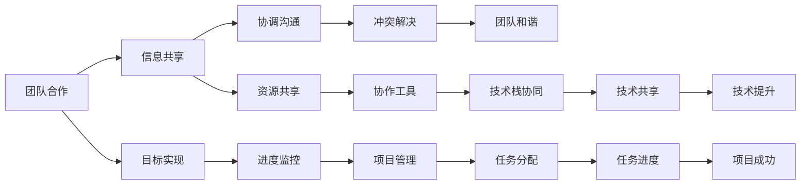

                 

# 程序员如何应对职场人际关系挑战

> 关键词：职场人际关系,团队合作,沟通技巧,冲突解决,心理健康

## 1. 背景介绍

### 1.1 问题由来
在快速发展的科技行业中，程序员们面临着复杂的职场环境。团队协作、跨部门沟通、项目协调、职业发展等，都是程序员在职业生涯中需要面对的重要挑战。尤其是在大公司或具有复杂组织结构的团队中，如何有效应对职场人际关系挑战，成为每一位程序员必备的技能。本文将从多个角度，探讨程序员在职场人际关系中常见的挑战，并提供实用的应对策略，帮助程序员更好地适应和提升职场技能。

## 2. 核心概念与联系

### 2.1 核心概念概述

为了更好地理解职场人际关系中的挑战，本节将介绍几个密切相关的核心概念：

- **团队合作**：在协作性任务中，多个成员共同工作，共享信息和资源，以实现共同的目标。

- **跨部门沟通**：在不同部门之间，有效传递信息和交换想法，确保项目顺利进行。

- **冲突解决**：在团队中，冲突不可避免。正确地识别、分析和解决冲突，是保持团队和谐的关键。

- **心理健康**：在高压的工作环境中，程序员需要保持良好的心理状态，以应对各种挑战。

- **职业发展**：个人在职场中的成长和晋升，涉及技术提升、经验积累、人际网络建设等方面。

这些核心概念共同构成了职场人际关系的复杂网络，程序员需要在其中寻找平衡，以实现个人与团队的共赢。

### 2.2 核心概念原理和架构的 Mermaid 流程图(Mermaid 流程节点中不要有括号、逗号等特殊字符)



此图展示了团队合作、跨部门沟通、冲突解决等核心概念在职场人际关系中的相互关联，以及这些概念如何通过信息共享、资源共享、目标实现、进度监控等手段，共同支撑项目成功和个人职业发展。

## 3. 核心算法原理 & 具体操作步骤

### 3.1 算法原理概述

在职场人际关系中，团队合作和沟通是不可或缺的。有效的沟通可以提高工作效率，减少误解和冲突。在实际应用中，可以采用以下算法原理：

1. **信息共享算法**：确保所有团队成员都具备足够的信息，以便于协作和决策。
2. **冲突解决算法**：通过有效的冲突管理方法，如调解、谈判等，快速解决团队内的冲突。
3. **沟通算法**：设计高效的沟通机制，如定期会议、即时消息等，确保信息的及时传递。

### 3.2 算法步骤详解

以下是职场人际关系中具体的算法步骤：

**Step 1: 团队建立与初始化**
- 识别项目需求和目标，组建团队。
- 明确团队成员的职责和任务。
- 使用项目管理工具，如Jira、Trello等，记录任务进展和沟通信息。

**Step 2: 信息共享与沟通**
- 确定信息共享渠道，如内部邮件、Slack、GitHub等。
- 定期召开团队会议，汇报进展和讨论问题。
- 使用协作工具，如Confluence、Google Docs等，记录和共享文档。

**Step 3: 冲突解决**
- 建立冲突解决机制，如设立冲突调解员，进行定期沟通。
- 使用如SWOT分析、鱼骨图等工具，识别冲突根源。
- 应用调解和谈判技巧，解决冲突。

**Step 4: 心理健康与职业发展**
- 定期进行心理健康评估，提供心理健康支持。
- 制定职业发展规划，提供职业培训和提升机会。
- 定期评估团队成员表现，提供反馈和奖励。

### 3.3 算法优缺点

职场人际关系中的算法具有以下优点：

- **提高效率**：信息共享和高效沟通可以大大提高团队的工作效率。
- **减少冲突**：有效的冲突解决机制可以降低团队内部的紧张和矛盾。
- **增强团队凝聚力**：心理支持和职业发展机制可以提高团队成员的归属感和忠诚度。

同时，该算法也存在一些缺点：

- **信息过载**：过多的信息共享可能导致信息过载，影响工作效率。
- **沟通成本**：沟通机制的设立和维护需要消耗额外的资源。
- **心理健康风险**：高压力工作环境可能带来心理问题，需要额外关注。

### 3.4 算法应用领域

职场人际关系中的算法可以应用于各种团队协作场景，例如：

- **软件开发团队**：需要高效的代码共享和版本控制。
- **数据科学团队**：需要数据共享和协同分析。
- **设计团队**：需要创意共享和设计评审。
- **市场营销团队**：需要市场信息共享和活动协调。

这些应用场景都依赖于良好的团队合作和沟通，算法能够帮助团队实现共同目标。

## 4. 数学模型和公式 & 详细讲解 & 举例说明

### 4.1 数学模型构建

在职场人际关系中，我们可以用数学模型来表示团队的协作和沟通过程。设团队成员数量为 $n$，任务数量为 $m$。

- **信息共享模型**：每个任务 $i$ 的信息共享量可以表示为 $I_i$，总的信息共享量为 $\Sigma I_i$。
- **沟通模型**：每个任务 $i$ 的沟通次数可以表示为 $C_i$，总沟通次数为 $\Sigma C_i$。
- **冲突解决模型**：每次冲突的解决时间可以表示为 $T_i$，总冲突解决时间为 $\Sigma T_i$。
- **心理健康模型**：每个成员的心理健康状态可以表示为 $H_i$，平均心理健康状态为 $\overline{H}$。

### 4.2 公式推导过程

1. **信息共享模型**：

   $$
   \Sigma I_i = \sum_{i=1}^m I_i
   $$

   其中 $I_i$ 为任务 $i$ 的信息共享量。

2. **沟通模型**：

   $$
   \Sigma C_i = \sum_{i=1}^m C_i
   $$

   其中 $C_i$ 为任务 $i$ 的沟通次数。

3. **冲突解决模型**：

   $$
   \Sigma T_i = \sum_{i=1}^m T_i
   $$

   其中 $T_i$ 为任务 $i$ 的冲突解决时间。

4. **心理健康模型**：

   $$
   \overline{H} = \frac{1}{n} \sum_{i=1}^n H_i
   $$

   其中 $H_i$ 为成员 $i$ 的心理健康状态，$\overline{H}$ 为平均心理健康状态。

### 4.3 案例分析与讲解

假设一个软件开发团队有5名成员，共需要完成3个任务，每个任务的信息共享量、沟通次数和冲突解决时间如下：

- 任务1：信息共享量 $I_1 = 5$，沟通次数 $C_1 = 8$，冲突解决时间 $T_1 = 2$
- 任务2：信息共享量 $I_2 = 3$，沟通次数 $C_2 = 6$，冲突解决时间 $T_2 = 3$
- 任务3：信息共享量 $I_3 = 2$，沟通次数 $C_3 = 5$，冲突解决时间 $T_3 = 4$

根据以上信息，可以计算总的信息共享量 $\Sigma I_i = 10$，总沟通次数 $\Sigma C_i = 19$，总冲突解决时间 $\Sigma T_i = 9$，平均心理健康状态 $\overline{H} = 4$。

通过这些数据，团队可以评估其协作和沟通的效率，并采取相应措施改善心理健康状况。

## 5. 项目实践：代码实例和详细解释说明

### 5.1 开发环境搭建

在职场人际关系中，项目管理工具的使用可以显著提高团队的协作效率。以下是使用Jira进行项目管理的环境配置流程：

1. 安装Jira Server或Jira Cloud。
2. 创建一个新的Jira项目。
3. 在项目中定义任务、问题和用户故事。
4. 设置敏捷看板，分配任务给团队成员。

### 5.2 源代码详细实现

以下是一个使用Python编写的Jira API示例，用于创建和更新任务：

```python
import requests

# Jira API访问地址和认证信息
URL = "https://your-jira-url/api/2"
username = "your-jira-username"
password = "your-jira-password"

# 创建任务
def create_issue(issuetype, summary, description, assignee_id):
    data = {
        "fields": {
            "issuetype": {"id": issuetype},
            "summary": summary,
            "description": description,
            "assignee": {"id": assignee_id},
            "labels": ["task"]
        }
    }
    response = requests.post(URL + "/issue", auth=(username, password), json=data)
    if response.status_code == 201:
        return response.json()["id"]
    else:
        print("Failed to create issue: ", response.text)

# 更新任务
def update_issue(issue_id, status):
    data = {
        "fields": {
            "status": {"id": status}
        }
    }
    response = requests.put(URL + f"/issue/{issue_id}", auth=(username, password), json=data)
    if response.status_code == 204:
        print(f"Issue {issue_id} updated successfully")
    else:
        print("Failed to update issue: ", response.text)

# 示例：创建一个任务并更新其状态
issue_type = "10001"
summary = "Bug Fix"
description = "修复bug"
assignee_id = "20001"
status = "Done"

issue_id = create_issue(issue_type, summary, description, assignee_id)
update_issue(issue_id, status)
```

### 5.3 代码解读与分析

以上代码展示了如何使用Jira API创建一个新任务并更新其状态。具体步骤包括：

1. 使用Jira的认证信息进行API访问。
2. 创建任务时，需要指定issuetype、summary、description、assignee_id等字段。
3. 更新任务时，指定issue_id和新的status字段。
4. 通过try-except结构处理API返回的异常信息。

该代码简洁明了，易于理解和修改，适用于多种Jira项目配置。

### 5.4 运行结果展示

运行以上代码后，可以在Jira项目中查看新创建的任务及其状态更新情况，确保任务管理系统的有效性。

## 6. 实际应用场景

### 6.1 团队建设与管理

在软件开发项目中，使用Jira等项目管理工具，能够帮助团队清晰地跟踪任务进展，确保项目按时交付。同时，通过定期回顾和改进，团队能够不断优化协作流程，提升整体效率。

### 6.2 信息共享与沟通

项目管理工具不仅支持任务跟踪，还可以记录团队会议、沟通记录等信息。通过信息共享机制，团队成员能够快速获取所需的信息，减少误解和冲突。

### 6.3 冲突解决

冲突解决是团队协作中的重要环节。通过Jira等工具的实时更新功能，团队管理者能够及时发现和解决冲突，保持团队的和谐稳定。

## 7. 工具和资源推荐

### 7.1 学习资源推荐

为了帮助程序员掌握职场人际关系中的各种技能，推荐以下学习资源：

1. **《非暴力沟通》**：马歇尔·卢森堡的书籍，介绍了如何通过有效的沟通方式，化解职场冲突。
2. **《高效能人士的七个习惯》**：史蒂芬·柯维的书籍，提供了个人成长和团队协作的实用建议。
3. **《团队合作的五个关键》**：帕特里克·莱西奇的书籍，介绍了团队合作的五个关键要素。
4. **Coursera《有效沟通技巧》课程**：由耶鲁大学提供，帮助提高沟通能力。
5. **Udemy《项目管理实战》课程**：提供项目管理工具和实践指南。

这些资源能够帮助程序员提升职场技能，更好地应对各种人际关系挑战。

### 7.2 开发工具推荐

以下是一些常用的开发工具，推荐程序员使用：

1. **Jira**：项目管理和协作工具，帮助团队跟踪任务和沟通。
2. **Slack**：即时通讯工具，支持跨部门沟通和协作。
3. **Confluence**：知识管理和文档协作工具，用于共享和存储信息。
4. **GitHub**：代码托管平台，支持版本控制和代码共享。
5. **Trello**：看板工具，便于任务分配和管理。

合理使用这些工具，可以显著提升团队协作的效率和效果。

### 7.3 相关论文推荐

职场人际关系的研究涉及多个学科，以下是几篇相关论文推荐：

1. **《团队合作中的冲突管理》**：探讨了团队合作中的冲突类型和解决方法。
2. **《跨部门沟通中的信息不对称问题》**：分析了跨部门沟通中的信息不对称问题及其影响。
3. **《心理学在职场人际关系中的应用》**：介绍了心理学在提升职场人际关系中的应用。
4. **《基于人工智能的团队协作系统》**：介绍了使用AI技术优化团队协作的案例和方法。

这些论文能够帮助程序员深入理解职场人际关系中的理论和实践，为职业发展提供支持。

## 8. 总结：未来发展趋势与挑战

### 8.1 研究成果总结

本文系统探讨了程序员在职场人际关系中的常见挑战，并提供了实用的应对策略。从团队合作、跨部门沟通、冲突解决到心理健康和职业发展，每个方面都有详细的讲解和案例分析。通过使用项目管理工具和沟通机制，程序员能够更好地应对职场中的各种人际关系挑战，提高团队协作效率。

### 8.2 未来发展趋势

未来，职场人际关系将面临更多复杂和多元化的挑战，主要趋势包括：

1. **跨文化协作**：全球化的发展使得跨文化团队协作成为常态，需要更加灵活和包容的沟通方式。
2. **虚拟协作**：远程工作和虚拟团队的普及，需要更加依赖在线协作工具和平台。
3. **多样性和包容性**：多样性和包容性的提升，需要建立更加开放和公平的职场环境。
4. **技术驱动的团队协作**：AI和自动化技术的引入，将改变团队协作的方式和流程。
5. **心理健康支持**：高压工作环境和快节奏生活带来的心理压力，需要更多的心理健康支持和干预。

这些趋势将进一步推动职场人际关系的研究和应用，为程序员带来新的挑战和机遇。

### 8.3 面临的挑战

尽管职场人际关系的研究已经取得了一定的进展，但仍面临诸多挑战：

1. **沟通障碍**：不同部门和岗位的成员可能存在沟通障碍，导致信息传递不畅。
2. **文化差异**：跨文化团队中，文化差异可能导致误解和冲突。
3. **技术依赖**：过度依赖工具和技术，可能导致人际关系的疏离。
4. **心理健康问题**：高压和快节奏的工作环境，可能带来心理压力和职业倦怠。
5. **多样性管理**：如何有效管理多样性和包容性，是一个长期且复杂的挑战。

解决这些挑战需要更多的创新和实践，同时也需要全社会的共同努力。

### 8.4 研究展望

未来，职场人际关系的研究将更加深入和多元，可以从以下几个方面进行探索：

1. **团队协作算法**：开发更加智能和高效的团队协作算法，提升团队协作的效率和效果。
2. **跨文化沟通研究**：研究跨文化团队中的沟通方式和冲突解决策略，提升跨文化协作的适应性。
3. **心理健康支持系统**：开发基于AI的心理健康支持系统，为程序员提供实时心理辅导和支持。
4. **多样性和包容性管理**：研究多样性和包容性管理策略，建立更加公平和包容的职场环境。
5. **虚拟协作技术**：探索虚拟协作技术的应用，提高远程工作的效率和体验。

通过这些研究方向，职场人际关系的研究将不断深化，为程序员提供更好的职业发展支持。

## 9. 附录：常见问题与解答

### Q1：如何提高团队协作的效率？

A: 提高团队协作效率的关键在于建立良好的沟通机制和信息共享机制。使用项目管理工具如Jira、Slack等，确保信息及时传递，减少误解和冲突。定期召开团队会议，汇报进展和讨论问题，确保任务按时完成。

### Q2：如何应对跨部门沟通中的信息不对称问题？

A: 信息不对称是跨部门沟通中的常见问题。可以通过定期沟通和反馈机制，确保各部门的协作信息及时更新。同时，建立文档共享和协作平台，如Confluence、Google Docs等，便于信息传递和查阅。

### Q3：如何有效解决团队内部的冲突？

A: 团队冲突的解决需要及时发现和有效调解。可以通过设立冲突调解员，定期召开沟通会议，了解冲突的根源，应用调解和谈判技巧，达成共识。同时，建立公平透明的管理机制，减少冲突的发生。

### Q4：如何维护团队的心理健康？

A: 心理健康是职场人际关系的重要组成部分。可以通过定期心理健康评估，提供心理辅导和支持。建立良好的工作氛围，减少工作压力和职业倦怠。同时，提供职业发展机会，增强团队成员的归属感和成就感。

### Q5：如何应对职场中的多样性和包容性挑战？

A: 多样性和包容性的提升需要全社会的共同努力。可以通过建立包容性的企业文化，培养团队成员的多样性意识。在团队中设立多样性指导员，定期组织多样性培训和活动，提升团队的多样性和包容性。

这些问题的解答能够帮助程序员更好地应对职场人际关系中的各种挑战，提升职业发展水平。

---

作者：禅与计算机程序设计艺术 / Zen and the Art of Computer Programming

