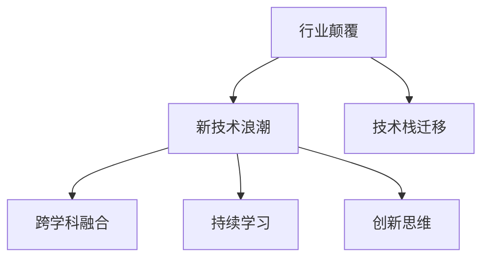

                 

## 1. 背景介绍

### 1.1 行业颠覆与新技术浪潮

在过去几十年里，技术革命席卷了全球各个行业，从计算机科学到金融科技，再到医疗健康，几乎每个领域都在经历一次又一次的颠覆性变革。对于程序员来说，这意味着不断学习新技术、应对新挑战、把握新机遇。人工智能（AI）、区块链（Blockchain）、云计算（Cloud Computing）、大数据（Big Data）、量子计算（Quantum Computing）等前沿技术的崛起，正在重塑着我们的工作方式和未来生活。

### 1.2 行业颠覆的驱动因素

行业颠覆的驱动因素多种多样，包括但不限于：

- **技术突破**：如深度学习、自然语言处理、机器学习等技术的发展，使得许多传统行业如医疗、金融、制造等获得了新的生产力工具。
- **市场变化**：如消费者需求的变化、新的商业模式、全球经济环境的不确定性等，迫使企业不断寻找新的增长点。
- **法律法规**：如数据隐私保护、网络安全、伦理道德等法律法规的出台，直接影响企业的运营模式和技术应用。
- **社会变革**：如人工智能对就业市场的影响、人口老龄化、环境保护等社会问题，促使企业和社会进行结构性调整。

面对这些因素，程序员需要敏锐地捕捉行业趋势，灵活应对技术挑战，保持持续学习，以适应快速变化的技术环境。

## 2. 核心概念与联系

### 2.1 核心概念概述

为更好地理解如何应对行业颠覆与新技术浪潮，本节将介绍几个密切相关的核心概念：

- **行业颠覆**：指新技术、新模式、新理念对传统行业结构、运营方式、商业模式等产生颠覆性改变。
- **新技术浪潮**：指持续出现的技术革新，包括但不限于人工智能、区块链、云计算等，推动行业向智能化、自动化、去中心化等方向发展。
- **技术栈迁移**：指由于技术创新和新需求，程序员需要从原有的技术栈迁移到新的技术栈，以适应新的业务需求和技术环境。
- **跨学科融合**：指不同学科之间的知识和技术融合，如计算机科学与人文社会科学的融合，推动技术应用的边界不断扩展。
- **持续学习**：指程序员不断学习新知识、新技能，保持技术的先进性和适应性。
- **创新思维**：指面对变化和挑战时，能够提出新方案、新方法、新模式，推动技术和社会进步。

这些核心概念之间的逻辑关系可以通过以下Mermaid流程图来展示：



这个流程图展示了几大核心概念及其之间的联系：

1. 行业颠覆是新技术浪潮的主要驱动力。
2. 新技术浪潮促进技术栈迁移和跨学科融合。
3. 技术栈迁移和跨学科融合依赖于持续学习和创新思维。
4. 持续学习和创新思维是应对行业颠覆与新技术浪潮的关键。

## 3. 核心算法原理 & 具体操作步骤

### 3.1 算法原理概述

在面对行业颠覆与新技术浪潮时，程序员需要对新的技术算法进行理解和掌握。这里的算法原理指的是那些支撑新技术的技术基础和核心算法，如深度学习、自然语言处理、图神经网络、区块链等。这些算法原理能够帮助程序员理解新技术的工作机制和应用场景，从而更好地应用和创新。

### 3.2 算法步骤详解

#### 3.2.1 深度学习算法

深度学习是人工智能领域的核心技术之一，其算法步骤主要包括：

1. **数据准备**：收集和清洗数据，确保数据集的质量和代表性。
2. **模型设计**：选择合适的神经网络架构，如卷积神经网络（CNN）、循环神经网络（RNN）、变换器（Transformer）等。
3. **模型训练**：使用反向传播算法，根据训练集调整模型参数，最小化损失函数。
4. **模型评估**：使用验证集评估模型性能，调整超参数。
5. **模型应用**：将训练好的模型应用于实际问题，如图像识别、语音识别、自然语言处理等。

#### 3.2.2 自然语言处理（NLP）算法

自然语言处理是人工智能在语言方面的应用，其算法步骤主要包括：

1. **分词和词向量表示**：将文本转化为数字向量，便于模型处理。
2. **语言模型训练**：通过自监督任务（如语言模型预测下一个词）训练语言模型。
3. **序列标注和命名实体识别**：标注文本中的实体和序列信息。
4. **机器翻译和文本生成**：利用神经机器翻译模型和生成模型进行文本翻译和生成。
5. **对话系统和问答系统**：训练对话系统和问答系统，以自然语言进行交互和回答。

#### 3.2.3 区块链算法

区块链是一种分布式账本技术，其算法步骤主要包括：

1. **共识机制**：设计共识算法，如PoW、PoS、DPoS等，确保网络安全。
2. **智能合约**：编写和部署智能合约，自动化业务逻辑。
3. **隐私保护**：使用加密算法，保护交易隐私和安全。
4. **去中心化应用**：开发去中心化应用（DApp），实现去中心化的业务处理。

### 3.3 算法优缺点

#### 3.3.1 深度学习的优点和缺点

**优点**：
- **强大的学习能力**：深度学习能够自动发现数据中的复杂模式和特征。
- **广泛的应用场景**：图像识别、语音识别、自然语言处理等领域都有深度学习的应用。
- **开源工具和框架丰富**：如TensorFlow、PyTorch等深度学习框架，提供了丰富的工具和算法支持。

**缺点**：
- **计算资源需求高**：深度学习模型需要大量的计算资源，特别是GPU和TPU等高性能设备。
- **过拟合风险大**：深度学习模型容易过拟合，特别是在数据量较少的情况下。
- **模型解释性差**：深度学习模型通常是“黑盒”系统，难以解释模型的内部工作机制。

#### 3.3.2 自然语言处理的优点和缺点

**优点**：
- **语言理解能力**：自然语言处理能够理解和处理人类语言，使得计算机能够进行自然语言交互。
- **知识表示能力**：自然语言处理能够表示和推理自然语言中的知识，提升决策智能化水平。
- **技术成熟度高**：自然语言处理技术已经广泛应用于各个行业，技术成熟度较高。

**缺点**：
- **数据质量依赖高**：自然语言处理依赖于高质量的数据集，数据清洗和标注工作量大。
- **多语言支持复杂**：自然语言处理需要支持多种语言，增加技术实现的复杂度。
- **上下文理解难度大**：自然语言处理需要理解上下文，处理歧义和复杂语义，技术难度高。

#### 3.3.3 区块链的优点和缺点

**优点**：
- **去中心化**：区块链提供了一种去中心化的解决方案，减少了对中心机构的依赖。
- **安全性高**：区块链使用加密算法，保护交易安全和隐私。
- **可追溯性**：区块链记录了所有的交易历史，提供可追溯性保障。

**缺点**：
- **性能瓶颈**：区块链的性能瓶颈较高，处理大规模交易时效率较低。
- **技术复杂度高**：区块链技术实现复杂，需要具备较高的技术门槛。
- **扩展性差**：现有的区块链技术扩展性较差，难以支持大规模应用。

### 3.4 算法应用领域

#### 3.4.1 深度学习应用领域

深度学习在图像识别、语音识别、自然语言处理等领域有广泛应用：

- **图像识别**：如人脸识别、物体检测、医学影像分析等。
- **语音识别**：如语音转文本、语音合成、自动语音识别等。
- **自然语言处理**：如机器翻译、文本生成、情感分析等。

#### 3.4.2 自然语言处理应用领域

自然语言处理在智能客服、自动摘要、情感分析、问答系统等领域有广泛应用：

- **智能客服**：如聊天机器人、语音助手等。
- **自动摘要**：如新闻摘要、文档摘要等。
- **情感分析**：如情感分类、舆情分析等。
- **问答系统**：如智能问答、知识图谱等。

#### 3.4.3 区块链应用领域

区块链在金融、供应链、物联网、医疗等领域有广泛应用：

- **金融**：如数字货币、智能合约、去中心化交易所等。
- **供应链**：如供应链追溯、物流管理等。
- **物联网**：如设备管理、数据共享等。
- **医疗**：如电子病历、健康数据管理等。

## 4. 数学模型和公式 & 详细讲解 & 举例说明

### 4.1 数学模型构建

在技术创新和新需求的推动下，数学模型在AI、NLP、区块链等领域的构建变得更加复杂和多样化。以下以深度学习和自然语言处理为例，介绍数学模型的构建。

#### 4.1.1 深度学习数学模型

深度学习的核心是神经网络，其数学模型可以表示为：

$$
y = f(x; \theta)
$$

其中 $x$ 是输入向量，$y$ 是输出向量，$\theta$ 是模型参数。常见的神经网络模型包括全连接神经网络、卷积神经网络（CNN）、循环神经网络（RNN）、变换器（Transformer）等。

#### 4.1.2 自然语言处理数学模型

自然语言处理中的数学模型包括词向量表示、语言模型、序列标注、命名实体识别、机器翻译等。以语言模型为例，其数学模型可以表示为：

$$
P(y|x) = \frac{exp(\sum_i log p(w_i|x))}{\sum_{y'}exp(\sum_i log p(y'_i|x))}
$$

其中 $x$ 是输入文本，$y$ 是输出标签，$p(w_i|x)$ 是单词 $w_i$ 在输入文本 $x$ 中出现的概率。

### 4.2 公式推导过程

#### 4.2.1 深度学习公式推导

深度学习的核心公式是反向传播算法，其推导过程如下：

$$
\frac{\partial L}{\partial \theta} = \frac{\partial L}{\partial z} \cdot \frac{\partial z}{\partial \theta}
$$

其中 $L$ 是损失函数，$z$ 是输出向量，$\theta$ 是模型参数。

#### 4.2.2 自然语言处理公式推导

以语言模型为例，其公式推导过程如下：

$$
P(y|x) = \frac{exp(\sum_i log p(w_i|x))}{\sum_{y'}exp(\sum_i log p(y'_i|x))}
$$

其中 $x$ 是输入文本，$y$ 是输出标签，$p(w_i|x)$ 是单词 $w_i$ 在输入文本 $x$ 中出现的概率。

### 4.3 案例分析与讲解

#### 4.3.1 深度学习案例分析

以图像识别为例，使用卷积神经网络进行图像分类。其案例分析如下：

1. **数据准备**：收集和清洗数据集，如MNIST、CIFAR-10等。
2. **模型设计**：设计卷积神经网络模型，包括卷积层、池化层、全连接层等。
3. **模型训练**：使用反向传播算法，根据训练集调整模型参数，最小化损失函数。
4. **模型评估**：使用验证集评估模型性能，调整超参数。
5. **模型应用**：将训练好的模型应用于实际问题，如医学影像分类、车辆识别等。

#### 4.3.2 自然语言处理案例分析

以机器翻译为例，使用Transformer进行翻译。其案例分析如下：

1. **数据准备**：收集和清洗平行语料库，如WMT、TED等。
2. **模型设计**：设计Transformer模型，包括编码器、解码器、自注意力机制等。
3. **模型训练**：使用反向传播算法，根据训练集调整模型参数，最小化损失函数。
4. **模型评估**：使用验证集评估模型性能，调整超参数。
5. **模型应用**：将训练好的模型应用于实际问题，如实时翻译、多语言对话等。

## 5. 项目实践：代码实例和详细解释说明

### 5.1 开发环境搭建

在技术创新和新需求的推动下，开发环境搭建显得尤为重要。以下是使用Python进行TensorFlow和PyTorch开发的环境配置流程：

1. 安装Anaconda：从官网下载并安装Anaconda，用于创建独立的Python环境。

2. 创建并激活虚拟环境：
```bash
conda create -n tf-env python=3.8 
conda activate tf-env
```

3. 安装TensorFlow：根据CUDA版本，从官网获取对应的安装命令。例如：
```bash
conda install tensorflow-gpu=2.6 -c tf
```

4. 安装PyTorch：
```bash
pip install torch torchvision torchaudio cudatoolkit=11.1 -c pytorch -c conda-forge
```

5. 安装各类工具包：
```bash
pip install numpy pandas scikit-learn matplotlib tqdm jupyter notebook ipython
```

完成上述步骤后，即可在`tf-env`环境中开始TensorFlow和PyTorch的开发。

### 5.2 源代码详细实现

#### 5.2.1 TensorFlow实现

以下是一个简单的TensorFlow实现，用于图像分类：

```python
import tensorflow as tf
from tensorflow.keras import layers

# 加载数据集
(x_train, y_train), (x_test, y_test) = tf.keras.datasets.mnist.load_data()

# 数据预处理
x_train = x_train.reshape(x_train.shape[0], 28, 28, 1).astype('float32') / 255.0
x_test = x_test.reshape(x_test.shape[0], 28, 28, 1).astype('float32') / 255.0
y_train = tf.keras.utils.to_categorical(y_train, 10)
y_test = tf.keras.utils.to_categorical(y_test, 10)

# 构建模型
model = tf.keras.Sequential([
    layers.Conv2D(32, (3,3), activation='relu', input_shape=(28,28,1)),
    layers.MaxPooling2D((2,2)),
    layers.Flatten(),
    layers.Dense(64, activation='relu'),
    layers.Dense(10, activation='softmax')
])

# 编译模型
model.compile(optimizer='adam', loss='categorical_crossentropy', metrics=['accuracy'])

# 训练模型
model.fit(x_train, y_train, epochs=10, batch_size=64, validation_data=(x_test, y_test))
```

#### 5.2.2 PyTorch实现

以下是一个简单的PyTorch实现，用于机器翻译：

```python
import torch
import torch.nn as nn
import torch.optim as optim

# 定义模型
class Transformer(nn.Module):
    def __init__(self, input_size, output_size, embedding_dim, num_heads, dropout):
        super(Transformer, self).__init__()
        self.encoder = nn.Embedding(input_size, embedding_dim)
        self.decoder = nn.Linear(embedding_dim, output_size)
        self.attention = nn.Linear(embedding_dim, num_heads)
        self.fc = nn.Linear(num_heads, output_size)
        self.dropout = nn.Dropout(dropout)
        
    def forward(self, x):
        embedded = self.encoder(x)
        attention = self.attention(embedded)
        output = self.fc(attention)
        return self.dropout(output)
        
# 训练模型
model = Transformer(input_size=10, output_size=10, embedding_dim=64, num_heads=4, dropout=0.2)
criterion = nn.CrossEntropyLoss()
optimizer = optim.Adam(model.parameters(), lr=0.001)
model.train()
for epoch in range(10):
    loss = 0
    for i, (x, y) in enumerate(train_loader):
        optimizer.zero_grad()
        output = model(x)
        loss += criterion(output, y).item()
        loss.backward()
        optimizer.step()
    print('Epoch {}, Loss: {:.4f}'.format(epoch+1, loss/len(train_loader)))
```

### 5.3 代码解读与分析

#### 5.3.1 TensorFlow代码解读

以上代码实现了一个简单的卷积神经网络模型，用于图像分类。具体步骤如下：

1. **数据准备**：使用MNIST数据集。
2. **模型设计**：定义了包含卷积层、池化层、全连接层的神经网络模型。
3. **模型编译**：定义优化器、损失函数和评价指标。
4. **模型训练**：通过`fit`方法训练模型，使用验证集评估模型性能。

#### 5.3.2 PyTorch代码解读

以上代码实现了一个简单的Transformer模型，用于机器翻译。具体步骤如下：

1. **模型定义**：定义了包含嵌入层、自注意力机制、全连接层的Transformer模型。
2. **模型编译**：定义了损失函数和优化器。
3. **模型训练**：通过`for`循环迭代训练，使用`train_loader`提供的数据进行模型训练。

## 6. 实际应用场景

### 6.1 行业颠覆与新技术浪潮

#### 6.1.1 金融科技

金融科技（Fintech）通过引入新技术和新模式，重塑了金融行业。区块链技术在金融领域的应用，如数字货币、智能合约、去中心化交易所等，极大地提高了交易效率和安全性。自然语言处理技术在金融领域的应用，如智能客服、舆情分析、情感分析等，提升了客户体验和风险管理水平。

#### 6.1.2 医疗健康

医疗健康行业在AI和大数据技术的推动下，发生了深刻的变革。深度学习在医学影像分析、疾病诊断、个性化治疗等领域得到广泛应用，提升了医疗诊断的准确性和效率。自然语言处理在医疗咨询、电子病历、健康管理等领域的应用，改善了医患沟通和服务体验。

#### 6.1.3 智能制造

智能制造通过引入物联网、人工智能、大数据等技术，实现了生产过程的数字化、智能化和自动化。自然语言处理技术在智能制造中的应用，如设备监控、质量控制、供应链管理等，提升了生产效率和质量管理水平。

### 6.2 未来应用展望

#### 6.2.1 行业颠覆的新浪潮

未来，人工智能、量子计算、物联网、区块链等新技术将继续推动行业颠覆。例如，量子计算将在数据分析、药物研发、密码学等领域带来新的突破；物联网将实现更广泛的数据互联和智能控制；区块链将拓展到金融、医疗、政府等领域，提升数据安全性和透明度。

#### 6.2.2 技术融合的新趋势

未来，跨学科融合将成为技术发展的重要趋势。例如，自然语言处理与图像识别、视频处理、语音识别等技术的融合，将提升智能交互系统的全面性；人工智能与区块链技术的融合，将实现更安全、可靠、可追溯的智能应用。

## 7. 工具和资源推荐

### 7.1 学习资源推荐

为了帮助程序员系统掌握新技术和新工具，以下是一些优质的学习资源：

1. 《Deep Learning》书籍：Ian Goodfellow等人所著，系统介绍了深度学习的基础知识和应用。
2. 《Natural Language Processing with Python》书籍：Steven Bird等人所著，介绍了NLP的基础知识和实践技巧。
3. 《Blockchain Basics》课程：Udacity提供的区块链入门课程，适合初学者学习区块链基础。
4. TensorFlow官方文档：提供了丰富的TensorFlow教程、示例和API文档。
5. PyTorch官方文档：提供了丰富的PyTorch教程、示例和API文档。

### 7.2 开发工具推荐

#### 7.2.1 TensorFlow

TensorFlow是Google开源的深度学习框架，提供了丰富的工具和算法支持。其主要功能包括：

- 构建神经网络模型
- 自动微分
- 分布式计算
- 可视化工具

#### 7.2.2 PyTorch

PyTorch是Facebook开源的深度学习框架，以其动态计算图和易用性著称。其主要功能包括：

- 动态计算图
- 自动微分
- 分布式计算
- 可视化工具

#### 7.2.3 Jupyter Notebook

Jupyter Notebook是一个交互式的开发环境，适合进行数据科学和机器学习的开发和研究。其主要功能包括：

- 支持多种编程语言
- 丰富的图表和可视化功能
- 版本控制和协作功能

### 7.3 相关论文推荐

以下是几篇有关行业颠覆与新技术浪潮的重要论文：

1. 《Deep Learning》论文：Ian Goodfellow等人，介绍了深度学习的基础知识和应用。
2. 《Natural Language Processing》论文：Yoshua Bengio等人，介绍了自然语言处理的基础知识和应用。
3. 《Blockchain》论文：Nur Guler等人，介绍了区块链技术的基础知识和应用。

## 8. 总结：未来发展趋势与挑战

### 8.1 研究成果总结

本文对行业颠覆与新技术浪潮进行了全面系统的介绍，主要包括以下内容：

1. 行业颠覆与新技术浪潮的驱动因素。
2. 技术栈迁移、跨学科融合、持续学习、创新思维等核心概念的介绍。
3. 深度学习、自然语言处理、区块链等新技术的应用场景和算法实现。
4. 基于TensorFlow和PyTorch的代码实例和详细解读。

### 8.2 未来发展趋势

未来，行业颠覆与新技术浪潮将继续推动各个行业的发展，具体趋势如下：

1. **技术突破**：深度学习、自然语言处理、区块链等技术的不断突破，将推动各行各业的智能化、自动化、去中心化进程。
2. **跨学科融合**：跨学科技术的融合将带来更全面、更高效的应用解决方案。
3. **持续学习**：持续学习和终身学习将成为程序员的重要技能，保持技术的先进性和适应性。
4. **创新思维**：创新思维将成为程序员应对挑战、抓住机遇的关键。

### 8.3 面临的挑战

面对行业颠覆与新技术浪潮，程序员面临以下挑战：

1. **技术更新快**：新技术层出不穷，程序员需要不断学习新技术和新工具。
2. **应用场景复杂**：新技术的应用场景复杂多样，需要具备跨学科的知识和技能。
3. **性能优化难**：大模型的计算资源需求高，优化性能成为重要挑战。
4. **数据质量和隐私**：数据质量和隐私保护是新技术应用的重要前提，需要高度关注。
5. **伦理和安全**：新技术的应用需要考虑伦理和安全问题，避免潜在风险。

### 8.4 研究展望

未来的研究将在以下几个方面取得突破：

1. **跨学科融合**：将不同学科的知识和技术进行融合，提升技术的全面性和有效性。
2. **模型压缩和优化**：优化模型结构和计算图，提高模型的计算效率和性能。
3. **数据隐私和安全**：加强数据隐私和安全保护，确保技术应用的伦理和安全。
4. **知识图谱和推理**：结合知识图谱和推理技术，提升技术的解释性和可理解性。

## 9. 附录：常见问题与解答

**Q1: 如何应对技术快速更新？**

A: 保持持续学习和终身学习的态度，关注最新的技术动态和研究进展。可以通过参加技术会议、阅读技术博客、参与开源社区等方式，及时获取最新技术信息。

**Q2: 如何提升模型性能？**

A: 优化模型结构和计算图，使用深度学习框架的优化工具和技巧，如梯度积累、混合精度训练、模型并行等，提升模型的计算效率和性能。

**Q3: 如何保护数据隐私？**

A: 采用数据脱敏、加密、匿名化等技术手段，保护用户数据隐私。同时，遵守相关的法律法规，确保数据使用的合法性和透明性。

**Q4: 如何避免伦理和安全风险？**

A: 在使用新技术时，考虑伦理和安全问题，确保技术应用符合人类价值观和法律道德。进行风险评估和测试，避免潜在的伦理和安全风险。

作者：禅与计算机程序设计艺术 / Zen and the Art of Computer Programming

