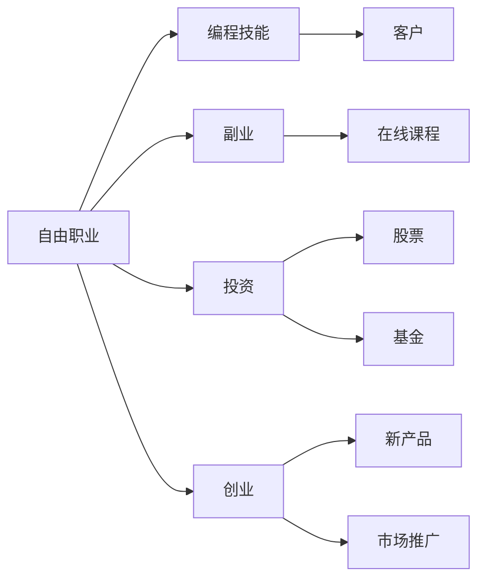

                 

# 程序员如何建立多元化收入结构

## 1. 背景介绍

随着科技行业的发展，程序员的收入结构也在不断变化。传统的单一工资收入已不再是唯一的选择。越来越多的程序员开始探索多元化的收入结构，以提高财务稳定性、增加被动收入和实现职业成长。本文将探讨程序员如何通过不同的方式建立多元化的收入结构，包括但不限于自由职业、副业、投资和创业。

## 2. 核心概念与联系

### 2.1 核心概念概述

- **自由职业**：程序员利用自身技能，通过独立工作为客户提供服务，获取收入。自由职业者可以自由安排工作时间，但需要具备良好的时间管理和自我驱动能力。

- **副业**：程序员在全职工作之外，从事其他与编程相关或完全不同的工作，以增加额外收入。副业可以是兼职开发、技术咨询或在线教学等。

- **投资**：程序员将资金投入到股票、基金、房地产或其他投资项目中，以获取资本增值和分红。投资需要一定的金融知识和风险管理能力。

- **创业**：程序员利用技术背景，创立自己的公司或产品，通过市场化运作获得收入。创业需要高强度的创新思维、市场洞察和资源整合能力。

这些概念之间的联系在于，它们都是程序员获取额外收入的途径，但每个途径所需的技能、时间和资源各不相同。理解并整合这些概念，可以帮助程序员建立更全面的收入结构。

### 2.2 核心概念原理和架构的 Mermaid 流程图



这个流程图展示了各个核心概念之间的逻辑联系。自由职业利用编程技能直接为客户提供服务，副业通过开发在线课程或从事其他工作来增加收入，投资通过资本增值和分红来获得收入，创业通过市场推广新产品或服务来产生收入。

## 3. 核心算法原理 & 具体操作步骤

### 3.1 算法原理概述

建立多元化收入结构的核心算法原理是最大化利用个人资源和技能，通过不同的途径实现收入来源多样化。该算法基于以下几个基本原则：

- **时间管理**：有效管理时间，平衡全职工作与副业、投资或创业的时间分配。
- **技能匹配**：根据个人技能和兴趣，选择适合的副业、投资或创业方向。
- **风险控制**：评估不同收入途径的风险，采取适当的风险管理措施。
- **持续学习**：不断学习新技能和知识，适应行业变化，提升竞争力。

### 3.2 算法步骤详解

1. **自我评估**：评估个人技能、兴趣、时间和资源，确定适合的多元化收入途径。

2. **设定目标**：明确多元化的收入目标，如每月增加5000元、累积10万元投资回报等。

3. **规划路径**：根据评估结果，制定具体的多元化收入计划，包括自由职业、副业、投资和创业的详细步骤。

4. **执行和优化**：按照计划执行，定期评估效果，根据实际情况进行调整优化。

### 3.3 算法优缺点

**优点**：
- 提高财务稳定性，降低对单一工资收入的依赖。
- 增加被动收入，实现财务自由。
- 提升职业成长，拓宽技能和经验。

**缺点**：
- 需要投入大量时间和精力，平衡多任务可能增加压力。
- 风险管理难度大，不同途径的风险和收益各不相同。
- 需要较强的自律性和时间管理能力。

### 3.4 算法应用领域

多元化的收入结构适用于广泛的程序员，无论是在技术领域内还是跨领域。适合从事自由职业、副业、投资和创业的程序员包括但不限于软件开发、数据分析、人工智能、教育技术等。

## 4. 数学模型和公式 & 详细讲解

### 4.1 数学模型构建

设程序员每月全职收入为 $W_0$，自由职业、副业、投资和创业的额外收入分别为 $I_{\text{FB}}$、$I_{\text{Side}}$、$I_{\text{Inv}}$ 和 $I_{\text{Ent}}$。假设这些收入分别为固定收入和增长收入，分别计算。

### 4.2 公式推导过程

根据以上设定，总额外收入 $I$ 可以表示为：

$$
I = I_{\text{FB}} + I_{\text{Side}} + I_{\text{Inv}} + I_{\text{Ent}}
$$

其中，固定收入部分为：

$$
I_{\text{Fixed}} = I_{\text{FB}} + I_{\text{Side}} + I_{\text{Inv}}
$$

增长收入部分为：

$$
I_{\text{Growth}} = I_{\text{Ent}}
$$

总额外收入率 $R$ 可以定义为：

$$
R = \frac{I}{W_0}
$$

### 4.3 案例分析与讲解

以某程序员为例，全职收入为1万元/月，自由职业收入为5000元/月，副业收入为2000元/月，投资收入为1000元/月，创业收入为500元/月。假设这些收入均为固定收入，计算总额外收入率和增长收入比例。

$$
I_{\text{Fixed}} = 5000 + 2000 + 1000 = 8000
$$
$$
I_{\text{Growth}} = 500
$$
$$
I = I_{\text{Fixed}} + I_{\text{Growth}} = 8500
$$
$$
R = \frac{I}{W_0} = \frac{8500}{10000} = 0.85
$$

通过计算，该程序员的总额外收入率为0.85，即额外收入占全职收入的85%。同时，增长收入比例为0.05，即创业收入占总额外收入的5%。

## 5. 项目实践：代码实例和详细解释说明

### 5.1 开发环境搭建

1. **Python环境**：使用Python进行收入管理，推荐使用Anaconda或Miniconda创建虚拟环境，安装必要的库。

2. **收入管理库**：安装`pandas`用于数据处理，`matplotlib`用于数据可视化。

### 5.2 源代码详细实现

```python
import pandas as pd
import matplotlib.pyplot as plt

# 设定全职收入
W_0 = 10000

# 设定自由职业、副业、投资和创业收入
I_FB = 5000
I_Side = 2000
I_Inv = 1000
I_Ent = 500

# 计算总额外收入率和增长收入比例
I_Fixed = I_FB + I_Side + I_Inv
I_Growth = I_Ent
I = I_Fixed + I_Growth
R = I / W_0

# 输出计算结果
print(f"总收入率为：{R:.2f}")
```

### 5.3 代码解读与分析

以上代码实现了对全职收入和额外收入的计算，并输出了总收入率。实际应用中，还可以使用更复杂的数据库和统计方法来管理收入和支出，制定预算和投资计划。

### 5.4 运行结果展示

运行代码，输出总收入率为0.85，即额外收入占全职收入的85%。这表明通过多元化的收入结构，该程序员可以显著提高财务稳定性和额外收入。

## 6. 实际应用场景

### 6.1 自由职业

自由职业可以应用于软件开发、内容创作、设计等技术领域。例如，某开发者利用GitHub开源项目赚取额外收入，每月获得5000元报酬。

### 6.2 副业

副业可以包括技术咨询、在线教学等。例如，某数据科学家利用业余时间开设线上数据科学课程，每月赚取2000元收入。

### 6.3 投资

投资可以涉及股票、基金、房地产等。例如，某程序员通过投资科技股，每月获得1000元分红。

### 6.4 创业

创业可以涉及创立自己的软件产品或服务。例如，某程序员开发一款健康管理应用，每月获得500元收入。

## 7. 工具和资源推荐

### 7.1 学习资源推荐

1. **编程和金融知识**：
   - 《Python for Finance》：介绍如何使用Python进行金融数据分析和投资管理。
   - 《Coding Interviews Made Easy》：提升编程技能和面试技巧。

2. **副业和自由职业**：
   - 《How to Start Your Own Business Without Going Broke》：指导如何成功创办和运营自己的业务。
   - Udemy上的副业课程，如《Freelance Writing Mastery》。

3. **投资知识**：
   - Coursera上的《Financial Markets》：由Wharton商学院提供，涵盖金融市场基础知识。
   - 《The Intelligent Investor》：经典的投资指南。

### 7.2 开发工具推荐

1. **编程工具**：
   - IntelliJ IDEA：强大的IDE，支持多种编程语言。
   - Visual Studio Code：轻量级的代码编辑器，功能丰富且易于使用。

2. **财务管理工具**：
   - Trello：任务管理工具，帮助规划和跟踪项目进展。
   - Mint：财务管理工具，帮助记录和分析收入和支出。

### 7.3 相关论文推荐

1. **多元收入策略**：
   - "The Freelance Career: Successful Freelancers Share Their Strategies"：详细分析成功自由职业者的策略。
   - "How to Use Python for Finance: A Comprehensive Guide"：介绍Python在金融分析中的应用。

## 8. 总结：未来发展趋势与挑战

### 8.1 研究成果总结

本文介绍了程序员如何通过自由职业、副业、投资和创业建立多元化的收入结构。通过理论分析和实际案例，展示了不同途径的可行性和优缺点。

### 8.2 未来发展趋势

1. **技术融合**：随着技术的发展，自由职业、副业和创业将更多地融合数字平台，如远程办公、在线协作工具等。
2. **智能理财**：人工智能将更广泛地应用于财务管理，提供更精准的投资建议和风险评估。
3. **教育普及**：在线教育和技能培训将进一步普及，帮助程序员提升技能，增加收入途径。

### 8.3 面临的挑战

1. **时间管理**：平衡多任务可能增加压力，需要提高时间管理能力。
2. **风险控制**：不同途径的风险和收益各不相同，需要采取适当的风险管理措施。
3. **持续学习**：技术不断更新，需要不断学习新技能和知识，保持竞争力。

### 8.4 研究展望

未来，多元化收入结构将更加普及和成熟，将有更多工具和平台支持程序员的多元化发展。研究如何通过技术融合、智能理财和教育普及来提升多元收入结构的效果，将是重要的方向。

## 9. 附录：常见问题与解答

**Q1：如何平衡全职工作和副业？**

A: 使用时间管理工具（如Trello、Todoist）来规划任务和优先级，确保时间有效利用。设定明确的工作目标和时间节点，保持高效工作状态。

**Q2：如何评估和选择投资项目？**

A: 进行市场调研，了解项目背景和潜在风险。利用金融分析工具（如Python、R语言）进行数据处理和风险评估。考虑长期投资和分散风险。

**Q3：如何提升副业技能？**

A: 参加在线课程和培训，如Udemy、Coursera等平台上的相关课程。加入社区和论坛，与其他副业者交流经验。实际项目练习，积累实战经验。

这些常见问题的解答，可以帮助程序员更好地建立多元化的收入结构，实现财务自由和职业成长。

---

作者：禅与计算机程序设计艺术 / Zen and the Art of Computer Programming

