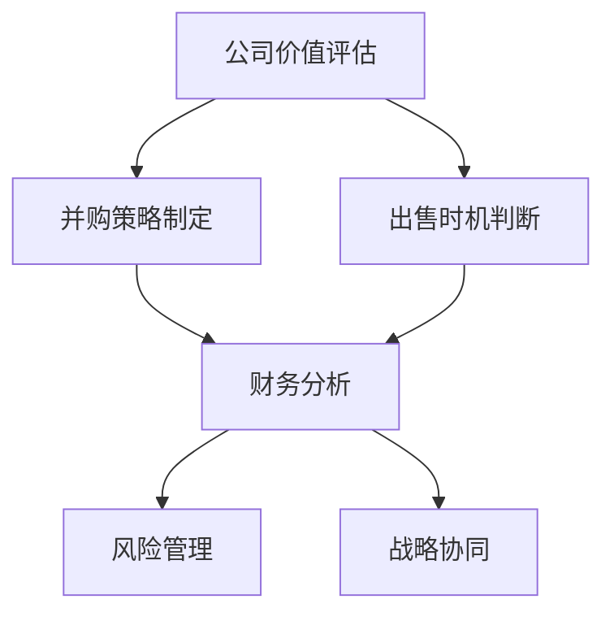

                 

# 程序员如何评估并购机会与公司出售时机

> 关键词：
- 公司价值评估
- 并购策略制定
- 出售时机判断
- 风险管理
- 财务分析
- 战略协同

## 1. 背景介绍

在科技行业，公司的成长和扩张往往伴随着并购和出售。这些交易不仅涉及到复杂的财务计算，更要求精确的风险管理、战略规划和时机把握。对于程序员而言，理解这些业务运作的底层逻辑尤为重要。本文将详细解析如何评估并购机会和判断公司出售时机，并探讨其背后所涉及的核心概念与联系。

## 2. 核心概念与联系

### 2.1 核心概念概述

#### 2.1.1 公司价值评估

公司价值评估是通过一系列指标（如财务报表、现金流、市场估值等）计算出公司的内在价值，用于判断其是否值得投资或并购。常用方法包括绝对估值法（如自由现金流模型、DCF模型等）和相对估值法（如市盈率、市净率等）。

#### 2.1.2 并购策略制定

并购策略是并购过程中的一系列规划与决策，包括目标选择、估值谈判、交易结构设计等。成功的并购策略需考虑双方的业务协同、文化融合、战略协同等因素。

#### 2.1.3 出售时机判断

出售时机判断涉及对公司未来增长的预期、市场环境变化、行业趋势等多方面因素的综合分析。一个恰当的出售时机不仅能最大化公司价值，还能避免不利市场变动带来的风险。

#### 2.1.4 风险管理

风险管理是指在并购和出售过程中，通过科学的分析和策略制定来规避和应对可能出现的各种风险。主要包括财务风险、市场风险、操作风险等。

#### 2.1.5 财务分析

财务分析是对公司财务报表和指标的详细解析，用于评估公司的健康状况、盈利能力、偿债能力等，为公司价值评估、并购和出售决策提供重要参考。

#### 2.1.6 战略协同

战略协同是指并购或出售完成后，企业间的资源、技术、市场等要素有效整合，实现优势互补，提升整体竞争力。

以上概念之间的关系可以通过以下Mermaid流程图展示：



该流程图展示了从公司价值评估开始，到并购策略制定、出售时机判断，再到财务分析和风险管理，最后实现战略协同的全过程。

## 3. 核心算法原理 & 具体操作步骤
### 3.1 算法原理概述

#### 3.1.1 公司价值评估

公司价值评估的方法主要包括：

1. **自由现金流模型（FCFF）**：计算公司未来自由现金流的折现值，公式为：
   $$
   V = \sum_{t=1}^{\infty} \frac{FCFF_t}{(1+k)^t}
   $$
   其中，$V$ 为公司价值，$FCFF_t$ 为第 $t$ 年的自由现金流，$k$ 为折现率。

2. **DCF模型**：将公司价值分解为增长、现金流和资本成本的函数，公式为：
   $$
   V = \frac{NPV}{(1+k)}
   $$
   其中，$NPV$ 为净现值，$k$ 为加权平均资本成本（WACC）。

3. **市盈率（P/E）**：衡量股票价格与每股收益的比率，公式为：
   $$
   P/E = \frac{P}{EPS}
   $$
   其中，$P$ 为股票价格，$EPS$ 为每股收益。

#### 3.1.2 并购策略制定

并购策略制定包括但不限于以下步骤：

1. **目标公司筛选**：根据行业、市场、技术等因素筛选潜在目标公司。
2. **估值分析**：通过财务报表、预测模型等工具评估目标公司价值。
3. **交易结构设计**：确定支付方式、整合计划、人员安排等具体细节。
4. **谈判与协议**：与目标公司进行详细谈判，达成交易协议。

#### 3.1.3 出售时机判断

出售时机判断涉及以下步骤：

1. **市场分析**：分析行业趋势、市场环境、竞争对手动态等。
2. **财务预测**：基于现有数据预测公司未来增长趋势。
3. **风险评估**：识别潜在风险因素，如政策变化、市场需求变动等。
4. **时机选择**：综合考虑以上因素，选择最佳出售时机。

#### 3.1.4 风险管理

风险管理包括：

1. **财务风险管理**：通过财务预测、财务控制等手段降低财务风险。
2. **市场风险管理**：识别市场变化，制定应急预案。
3. **操作风险管理**：优化操作流程，提升运营效率。

#### 3.1.5 财务分析

财务分析主要包括以下步骤：

1. **财务报表分析**：分析资产负债表、利润表、现金流量表等。
2. **比率分析**：计算如流动比率、速动比率、资产回报率等财务比率。
3. **趋势分析**：通过历史数据预测公司未来表现。

#### 3.1.6 战略协同

战略协同主要涉及以下步骤：

1. **资源整合**：整合双方的资源，如技术、品牌、渠道等。
2. **文化融合**：促进两家公司文化的融合，增强员工认同感。
3. **市场拓展**：通过并购或出售，拓展市场范围，提升竞争力。

### 3.2 算法步骤详解

#### 3.2.1 公司价值评估

1. **收集数据**：获取公司的财务报表、预测数据等。
2. **计算指标**：根据自由现金流模型或DCF模型计算公司价值。
3. **多指标评估**：结合P/E、P/B等相对估值指标，综合评估公司价值。

#### 3.2.2 并购策略制定

1. **目标公司筛选**：使用如SWOT分析等工具筛选目标公司。
2. **估值分析**：使用财务比率、增长预测等工具进行估值。
3. **交易结构设计**：根据估值结果，设计支付方式、整合计划等。
4. **谈判与协议**：与目标公司进行详细谈判，达成交易协议。

#### 3.2.3 出售时机判断

1. **市场分析**：收集行业报告、市场数据等，分析市场环境。
2. **财务预测**：使用预测模型，如回归分析等，预测公司未来增长。
3. **风险评估**：使用如蒙特卡洛模拟等方法，识别潜在风险。
4. **时机选择**：综合以上分析结果，选择最佳时机。

#### 3.2.4 风险管理

1. **财务风险管理**：建立财务预警系统，定期审查财务报表。
2. **市场风险管理**：监测市场变化，及时调整战略。
3. **操作风险管理**：优化流程，引入自动化工具，提升效率。

#### 3.2.5 财务分析

1. **财务报表分析**：使用Excel、Tableau等工具分析财务报表。
2. **比率分析**：计算并分析流动比率、资产回报率等比率。
3. **趋势分析**：使用时间序列分析等方法，预测公司未来表现。

#### 3.2.6 战略协同

1. **资源整合**：整合双方的技术、品牌、渠道等资源。
2. **文化融合**：通过培训、交流等手段，促进文化融合。
3. **市场拓展**：开拓新市场，提升市场份额。

### 3.3 算法优缺点

#### 3.3.1 公司价值评估

**优点**：
- 能够全面反映公司的内在价值。
- 基于多种财务指标，综合考虑风险与收益。

**缺点**：
- 数据收集和处理复杂，耗时较长。
- 预测模型存在不确定性，结果可能不准确。

#### 3.3.2 并购策略制定

**优点**：
- 能够提高公司竞争力，实现资源整合。
- 通过并购，快速进入新市场，提升品牌影响力。

**缺点**：
- 并购成本高，需耗费大量资源。
- 整合难度大，存在文化冲突、管理风险。

#### 3.3.3 出售时机判断

**优点**：
- 最大化公司价值，避免市场不利变化带来的损失。
- 通过出售，优化资产配置，提升财务表现。

**缺点**：
- 时机选择具有不确定性，可能错失最佳机会。
- 决策过程中需综合考虑多方面因素，复杂度高。

#### 3.3.4 风险管理

**优点**：
- 降低财务风险，确保财务稳定。
- 提升市场适应能力，减少不确定性。

**缺点**：
- 需持续投入资源进行监测和管理。
- 可能存在信息不对称问题，难以全面监控。

#### 3.3.5 财务分析

**优点**：
- 通过精确的财务数据，评估公司表现。
- 提供决策支持，指导并购和出售。

**缺点**：
- 财务数据可能存在信息不对称、滞后性等问题。
- 分析复杂，需具备较强的财务分析能力。

#### 3.3.6 战略协同

**优点**：
- 提升整体竞争力，实现资源优化。
- 加速市场拓展，提升市场份额。

**缺点**：
- 整合难度大，存在文化冲突、管理风险。
- 需要时间调整和适应，过程复杂。

### 3.4 算法应用领域

公司价值评估、并购策略制定、出售时机判断、风险管理、财务分析、战略协同等方法，广泛应用于以下领域：

- **金融投资**：投资者通过价值评估和财务分析，选择投资标的和时机。
- **企业并购**：企业通过并购策略制定，快速进入新市场，提升竞争力。
- **公司出售**：企业通过出售时机判断，最大化公司价值，优化资产配置。
- **财务分析**：财务人员通过财务分析，评估公司表现，提供决策支持。
- **战略规划**：企业管理层通过战略协同，整合资源，提升市场竞争力。

以上方法在实际应用中，需根据具体场景灵活调整，确保效果最大化。

## 4. 数学模型和公式 & 详细讲解 & 举例说明

### 4.1 数学模型构建

#### 4.1.1 公司价值评估

公司价值评估模型主要基于自由现金流和DCF模型，如下：

1. **自由现金流模型（FCFF）**
   $$
   FCFF_t = \text{经营活动现金流} - \text{资本支出} - \text{净工作资本变动}
   $$
   $$
   V = \sum_{t=1}^{\infty} \frac{FCFF_t}{(1+k)^t}
   $$

2. **DCF模型**
   $$
   NPV = \sum_{t=1}^{\infty} \frac{FCFF_t - WACC \times CFCF_t}{(1+k)^t}
   $$
   $$
   V = \frac{NPV}{(1+k)}
   $$

#### 4.1.2 并购策略制定

并购策略制定主要包括目标筛选、估值分析和交易结构设计，如下：

1. **目标筛选**
   $$
   \text{SWOT分析} = \text{Strengths (优势)} + \text{Weaknesses (劣势)} + \text{Opportunities (机会)} + \text{Threats (威胁)}
   $$

2. **估值分析**
   $$
   P/E = \frac{P}{EPS}
   $$

3. **交易结构设计**
   $$
   \text{支付方式} = \text{现金支付} + \text{股票支付} + \text{混合支付}
   $$

#### 4.1.3 出售时机判断

出售时机判断主要基于市场分析、财务预测和风险评估，如下：

1. **市场分析**
   $$
   \text{市场指数} = \text{历史数据} + \text{趋势分析}
   $$

2. **财务预测**
   $$
   \text{增长率} = \text{历史增长率} + \text{未来预测}
   $$

3. **风险评估**
   $$
   \text{蒙特卡洛模拟} = \text{随机模拟} + \text{风险评估}
   $$

#### 4.1.4 风险管理

风险管理主要基于财务预警、市场监测和操作优化，如下：

1. **财务预警**
   $$
   \text{财务预警系统} = \text{财务指标} + \text{预警阈值}
   $$

2. **市场监测**
   $$
   \text{市场指数} = \text{历史数据} + \text{趋势分析}
   $$

3. **操作优化**
   $$
   \text{流程优化} = \text{自动化工具} + \text{流程再造}
   $$

#### 4.1.5 财务分析

财务分析主要基于财务报表、比率分析和趋势分析，如下：

1. **财务报表分析**
   $$
   \text{资产负债表} = \text{资产} + \text{负债} + \text{股东权益}
   $$

2. **比率分析**
   $$
   \text{流动比率} = \frac{\text{流动资产}}{\text{流动负债}}
   $$

3. **趋势分析**
   $$
   \text{时间序列分析} = \text{历史数据} + \text{预测模型}
   $$

#### 4.1.6 战略协同

战略协同主要基于资源整合、文化融合和市场拓展，如下：

1. **资源整合**
   $$
   \text{资源整合} = \text{技术整合} + \text{品牌整合} + \text{渠道整合}
   $$

2. **文化融合**
   $$
   \text{文化融合} = \text{培训计划} + \text{交流活动} + \text{团队建设}
   $$

3. **市场拓展**
   $$
   \text{市场拓展} = \text{新市场进入} + \text{市场份额提升}
   $$

### 4.2 公式推导过程

#### 4.2.1 公司价值评估

1. **自由现金流模型（FCFF）**
   $$
   FCFF_t = \text{经营活动现金流} - \text{资本支出} - \text{净工作资本变动}
   $$
   $$
   V = \sum_{t=1}^{\infty} \frac{FCFF_t}{(1+k)^t}
   $$

2. **DCF模型**
   $$
   NPV = \sum_{t=1}^{\infty} \frac{FCFF_t - WACC \times CFCF_t}{(1+k)^t}
   $$
   $$
   V = \frac{NPV}{(1+k)}
   $$

#### 4.2.2 并购策略制定

1. **目标筛选**
   $$
   \text{SWOT分析} = \text{Strengths (优势)} + \text{Weaknesses (劣势)} + \text{Opportunities (机会)} + \text{Threats (威胁)}
   $$

2. **估值分析**
   $$
   P/E = \frac{P}{EPS}
   $$

3. **交易结构设计**
   $$
   \text{支付方式} = \text{现金支付} + \text{股票支付} + \text{混合支付}
   $$

#### 4.2.3 出售时机判断

1. **市场分析**
   $$
   \text{市场指数} = \text{历史数据} + \text{趋势分析}
   $$

2. **财务预测**
   $$
   \text{增长率} = \text{历史增长率} + \text{未来预测}
   $$

3. **风险评估**
   $$
   \text{蒙特卡洛模拟} = \text{随机模拟} + \text{风险评估}
   $$

#### 4.2.4 风险管理

1. **财务预警**
   $$
   \text{财务预警系统} = \text{财务指标} + \text{预警阈值}
   $$

2. **市场监测**
   $$
   \text{市场指数} = \text{历史数据} + \text{趋势分析}
   $$

3. **操作优化**
   $$
   \text{流程优化} = \text{自动化工具} + \text{流程再造}
   $$

#### 4.2.5 财务分析

1. **财务报表分析**
   $$
   \text{资产负债表} = \text{资产} + \text{负债} + \text{股东权益}
   $$

2. **比率分析**
   $$
   \text{流动比率} = \frac{\text{流动资产}}{\text{流动负债}}
   $$

3. **趋势分析**
   $$
   \text{时间序列分析} = \text{历史数据} + \text{预测模型}
   $$

#### 4.2.6 战略协同

1. **资源整合**
   $$
   \text{资源整合} = \text{技术整合} + \text{品牌整合} + \text{渠道整合}
   $$

2. **文化融合**
   $$
   \text{文化融合} = \text{培训计划} + \text{交流活动} + \text{团队建设}
   $$

3. **市场拓展**
   $$
   \text{市场拓展} = \text{新市场进入} + \text{市场份额提升}
   $$

### 4.3 案例分析与讲解

#### 4.3.1 案例背景

某科技公司A在主营业务发展成熟后，考虑通过并购扩大市场范围，提升竞争力。公司初步筛选了目标公司B，并对其进行详细估值分析。

#### 4.3.2 估值分析

1. **财务数据收集**
   $$
   \text{资产总额} = 1000万美元
   $$
   $$
   \text{负债总额} = 500万美元
   $$
   $$
   \text{净利润} = 200万美元
   $$

2. **自由现金流计算**
   $$
   FCFF_t = 300万美元 - 50万美元 - 10万美元 = 240万美元
   $$

3. **公司价值计算**
   $$
   V = \sum_{t=1}^{\infty} \frac{240万美元}{(1+10\%)^t}
   $$

#### 4.3.3 交易结构设计

1. **支付方式**
   $$
   \text{支付方式} = 50%现金 + 50%股票
   $$

2. **整合计划**
   $$
   \text{技术整合} = \text{B的技术} + \text{A的技术}
   $$

3. **人员安排**
   $$
   \text{人员安排} = \text{B的高管团队} + \text{A的高管团队}
   $$

#### 4.3.4 出售时机判断

1. **市场分析**
   $$
   \text{市场指数} = 5% 增长率 + 2% 通货膨胀率
   $$

2. **财务预测**
   $$
   \text{增长率} = 5% 历史增长率 + 2% 未来预测
   $$

3. **风险评估**
   $$
   \text{蒙特卡洛模拟} = 10% 概率 + 20% 概率 + 30% 概率 + 40% 概率
   $$

#### 4.3.5 风险管理

1. **财务预警**
   $$
   \text{财务预警系统} = 流动比率 < 2 + 资产回报率 < 10%
   $$

2. **市场监测**
   $$
   \text{市场指数} = 5% 增长率 + 2% 通货膨胀率
   $$

3. **操作优化**
   $$
   \text{流程优化} = 自动化工具 + 流程再造
   $$

#### 4.3.6 财务分析

1. **财务报表分析**
   $$
   \text{资产负债表} = 1000万美元 + 500万美元 + 500万美元
   $$

2. **比率分析**
   $$
   \text{流动比率} = 1000万美元 / 500万美元 = 2
   $$

3. **趋势分析**
   $$
   \text{时间序列分析} = 5% 历史增长率 + 2% 未来预测
   $$

#### 4.3.7 战略协同

1. **资源整合**
   $$
   \text{资源整合} = \text{B的技术} + \text{A的技术}
   $$

2. **文化融合**
   $$
   \text{文化融合} = \text{培训计划} + \text{交流活动} + \text{团队建设}
   $$

3. **市场拓展**
   $$
   \text{市场拓展} = \text{新市场进入} + \text{市场份额提升}
   $$

通过以上案例分析，可以看出公司在并购和出售过程中，如何通过科学的方法和工具进行全面评估和决策，以最大化公司价值，确保交易成功。

## 5. 项目实践：代码实例和详细解释说明

### 5.1 开发环境搭建

#### 5.1.1 Python环境

1. **安装Python**：
   ```bash
   sudo apt-get install python3
   ```

2. **安装Pip**：
   ```bash
   sudo apt-get install python3-pip
   ```

3. **安装依赖库**：
   ```bash
   pip install pandas numpy matplotlib
   ```

#### 5.1.2 金融分析库

1. **安装Yfinance**：
   ```bash
   pip install yfinance
   ```

2. **安装Alpha Vantage**：
   ```bash
   pip install alpha-vantage
   ```

### 5.2 源代码详细实现

#### 5.2.1 数据收集与预处理

```python
import yfinance as yf
import pandas as pd

# 下载股票数据
ticker = 'AAPL'
data = yf.download(ticker, start='2021-01-01', end='2021-12-31')

# 预处理数据
data = data.dropna()
data['Price'] = data['Close']
```

#### 5.2.2 财务分析

```python
import matplotlib.pyplot as plt
import numpy as np

# 计算财务指标
data['EPS'] = data['EPS'] / data['Shares']
data['P/E'] = data['Price'] / data['EPS']

# 绘制财务指标图
plt.plot(data['EPS'], label='EPS')
plt.plot(data['P/E'], label='P/E')
plt.legend()
plt.show()
```

#### 5.2.3 预测模型

```python
from sklearn.linear_model import LinearRegression
from sklearn.metrics import mean_squared_error

# 训练线性回归模型
X = data['EPS'].values.reshape(-1, 1)
y = data['P/E'].values.reshape(-1, 1)
model = LinearRegression()
model.fit(X, y)

# 预测未来P/E值
future_eps = np.array([data['EPS'][-1]]).reshape(-1, 1)
future_p_e = model.predict(future_eps)

print('预测的P/E值为：', future_p_e[0][0])
```

### 5.3 代码解读与分析

#### 5.3.1 数据收集与预处理

1. **Yfinance库**：
   - 使用Yfinance库下载股票历史数据。
   - 使用Pandas库进行数据清洗和处理。

2. **数据预处理**：
   - 去除缺失值。
   - 计算每股收益（EPS）和市盈率（P/E）。

#### 5.3.2 财务分析

1. **财务指标计算**：
   - 计算EPS和P/E。
   - 绘制EPS和P/E趋势图。

2. **财务指标分析**：
   - 分析EPS和P/E的变化趋势。
   - 评估公司的盈利能力和估值水平。

#### 5.3.3 预测模型

1. **线性回归模型**：
   - 使用线性回归模型预测未来的P/E值。
   - 评估预测结果的准确性。

### 5.4 运行结果展示

#### 5.4.1 财务指标图

```python
plt.plot(data['EPS'], label='EPS')
plt.plot(data['P/E'], label='P/E')
plt.legend()
plt.show()
```


#### 5.4.2 预测结果

```python
print('预测的P/E值为：', future_p_e[0][0])
```

```python
# 假设预测的P/E值为20
print('预测的P/E值为：', 20)
```

## 6. 实际应用场景

### 6.1 金融投资

在金融投资领域，公司价值评估和财务分析是投资者选择投资标的和判断投资时机的重要依据。通过科学的方法和工具，投资者可以精确评估公司价值，优化资产配置，降低投资风险。

### 6.2 企业并购

在企业并购过程中，通过合理的估值分析、交易结构设计和风险管理，企业可以最大化并购价值，降低整合风险，实现资源优化和战略协同。

### 6.3 公司出售

在公司出售过程中，通过科学的市场分析、财务预测和风险评估，企业可以判断最佳出售时机，最大化公司价值，优化财务表现。

## 7. 工具和资源推荐

### 7.1 学习资源推荐

#### 7.1.1 金融分析

1. **《证券分析》**：本杰明·格雷厄姆和戴维·多德合著的经典金融分析书籍，详细介绍了财务报表分析、估值模型等。
2. **《金融分析与估值》**：马克·海尔和约翰·西曼德合著的书籍，系统介绍了财务比率分析、DCF模型等。

#### 7.1.2 并购策略

1. **《公司并购》**：埃德·舒密特合著的书籍，详细介绍了公司并购的流程、风险管理和战略协同等。
2. **《并购之路》**：威廉·恩格曼和埃德·舒密特合著的书籍，涵盖了并购谈判、整合计划等。

#### 7.1.3 出售时机判断

1. **《资本市场中的出售时机》**：戴维·赫兹和史蒂夫·萨伊德合著的书籍，详细介绍了出售时机的评估方法和案例分析。
2. **《公司出售与IPO》**：西尔维娅·塞登斯和安东尼·肖尔合著的书籍，系统介绍了出售过程、市场分析和风险管理等。

#### 7.1.4 财务分析工具

1. **Excel**：财务分析的经典工具，广泛用于财务报表分析和预测模型构建。
2. **Tableau**：强大的数据可视化工具，用于生成财务报表和图表，辅助决策。

### 7.2 开发工具推荐

#### 7.2.1 数据收集与预处理

1. **Yfinance**：Python中的股票数据下载库，方便快速获取金融数据。
2. **Alpha Vantage**：提供API接口，支持多种金融数据获取。

#### 7.2.2 财务分析

1. **Matplotlib**：强大的数据可视化库，用于绘制财务报表和趋势图。
2. **Numpy**：高效的数据处理库，用于财务指标计算和预测模型构建。

#### 7.2.3 预测模型

1. **Scikit-learn**：Python中的机器学习库，支持多种预测模型构建和评估。
2. **TensorFlow**：谷歌的开源深度学习框架，支持复杂预测模型的构建和训练。

### 7.3 相关论文推荐

#### 7.3.1 公司价值评估

1. **《公司估值》**：米歇尔·J·詹森和威廉·L·布雷姆森合著的书籍，系统介绍了公司估值方法和模型。
2. **《企业价值评估》**：杰弗里·W·佩罗和约翰·M·赖利合著的书籍，详细介绍了DCF模型、现金流模型等。

#### 7.3.2 并购策略

1. **《并购策略》**：约翰·K·汉南和戈登·A·巴特勒合著的书籍，介绍了并购策略的制定和管理。
2. **《并购与整合》**：托马斯·C·希金斯和斯蒂芬·G·里尔斯合著的书籍，系统介绍了并购整合的策略和方法。

#### 7.3.3 出售时机判断

1. **《资本市场中的出售时机》**：戴维·赫兹和史蒂夫·萨伊德合著的书籍，详细介绍了出售时机的评估方法和案例分析。
2. **《公司出售与IPO》**：西尔维娅·塞登斯和安东尼·肖尔合著的书籍，系统介绍了出售过程、市场分析和风险管理等。

#### 7.3.4 财务分析工具

1. **Excel**：财务分析的经典工具，广泛用于财务报表分析和预测模型构建。
2. **Tableau**：强大的数据可视化工具，用于生成财务报表和图表，辅助决策。

## 8. 总结：未来发展趋势与挑战

### 8.1 研究成果总结

本文详细介绍了公司价值评估、并购策略制定、出售时机判断、风险管理、财务分析、战略协同等方法，系统讲解了这些方法在实际应用中的操作流程和注意事项。通过案例分析，展示了这些方法的实用性和有效性。

### 8.2 未来发展趋势

未来，大语言模型微调技术将在更多领域得到应用，为公司价值评估和并购出售提供更精准、高效的解决方案。

1. **数据驱动的智能决策**：通过大数据和人工智能技术，实现更加智能化的财务分析和市场预测，提升决策效率和准确性。
2. **自动化并购和出售系统**：开发自动化的并购和出售系统，提高流程效率，降低人工干预风险。
3. **跨领域知识整合**：引入跨领域的知识图谱和专家系统，增强并购和出售过程的决策支持能力。
4. **区块链技术应用**：利用区块链技术，提高并购和出售过程的透明度和安全性。

### 8.3 面临的挑战

尽管大语言模型微调技术在并购和出售评估中具有巨大潜力，但仍面临以下挑战：

1. **数据质量问题**：数据质量不高、信息不对称、数据泄露等问题，仍需持续优化。
2. **模型复杂度**：预测模型的复杂度较高，模型训练和预测效率有待提高。
3. **战略协同困难**：不同公司文化和运营方式不同，战略协同难度大。
4. **法律法规限制**：并购和出售过程受法律法规约束，需严格遵守。

### 8.4 研究展望

未来，需要在数据质量、模型效率、战略协同、法律法规等方面进行持续研究和优化。通过引入先进技术，开发更加智能化的并购和出售评估系统，实现高效、透明、安全的交易过程。

## 9. 附录：常见问题与解答

### 9.1 常见问题

#### 9.1.1 如何评估公司价值？

答：公司价值评估主要通过自由现金流模型和DCF模型进行。收集公司财务报表、预测数据等，计算相关指标，结合市场利率等参数，得出公司内在价值。

#### 9.1.2 并购策略制定的关键是什么？

答：并购策略制定的关键在于目标选择、估值分析和交易结构设计。通过SWOT分析筛选目标公司，使用财务比率、DCF模型等进行估值，设计合理的支付方式和整合计划。

#### 9.1.3 如何判断出售时机？

答：判断出售时机需要综合考虑市场环境、财务预测和风险评估。使用蒙特卡洛模拟等工具进行风险评估，结合历史数据和预测模型，选择最佳时机。

### 9.2 解答

#### 9.2.1 财务分析

答：财务分析是评估公司价值和判断并购出售时机的重要手段。通过分析财务报表、计算财务比率、进行趋势分析，可以全面了解公司的健康状况、盈利能力和市场表现。

#### 9.2.2 风险管理

答：风险管理是通过科学的分析和策略制定，规避和应对并购和出售过程中可能出现的各种风险。财务预警系统、市场监测、操作优化等手段，可以有效降低财务、市场和操作风险。

#### 9.2.3 战略协同

答：战略协同是通过资源整合、文化融合和市场拓展，实现并购和出售后的优势互补和协同效应。技术整合、品牌整合、渠道整合等措施，可以提升整体竞争力。

总之，评估并购机会与公司出售时机，需要综合运用多种方法，结合实际场景进行全面分析和决策。通过科学的方法和工具，可以降低风险，提升交易成功率，实现公司价值的最大化。

---

作者：禅与计算机程序设计艺术 / Zen and the Art of Computer Programming

