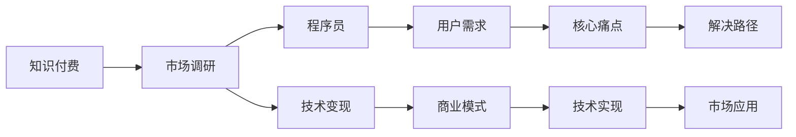

                 

# 程序员如何进行知识付费的市场调研

> 关键词：知识付费, 市场调研, 程序员, 行业趋势, 用户需求, 商业模式, 技术变现

## 1. 背景介绍

### 1.1 问题由来

随着互联网和技术的迅猛发展，知识付费逐渐成为全球热门话题，尤其在教育、技术、健康、理财等高附加值领域，知识付费已形成较为成熟的产业链。而在编程领域，作为互联网技术创新的基础和核心，程序员的知识和经验共享一直是行业焦点。但随着市场竞争加剧和知识传播方式的多样化，传统程序员社区、博客、论坛等交流形式已经难以满足用户对深度和系统化知识的需求，程序员的知识付费逐渐成为行业新趋势。

### 1.2 问题核心关键点

本文聚焦于程序员如何进行知识付费市场调研这一主题，探索不同阶段和领域的关键问题与核心概念。主要研究问题包括：

1. 知识付费的市场规模和趋势预测。
2. 用户需求分析与核心痛点解决。
3. 商业模式选择与路径规划。
4. 关键技术实施与市场应用。

## 2. 核心概念与联系

### 2.1 核心概念概述

为更好地理解程序员知识付费市场调研的核心问题，我们需要梳理一些关键概念及其关联：

1. **知识付费 (Knowledge Monetization)**：通过在线付费订阅、一次性支付、按需咨询服务等方式，将知识或经验货币化的过程。

2. **市场调研 (Market Research)**：通过调查、数据收集与分析，了解市场环境、用户需求和竞争态势，为知识付费业务决策提供依据。

3. **程序员 (Programmers)**：拥有编程技能和专业知识的专业人员，常聚焦于软件开发、架构设计、算法优化等技术领域。

4. **技术变现 (Tech Monetization)**：将编程技巧、软件应用、技术栈、工具教程等技术资产转化为实际经济收益的方式。

5. **用户需求 (User Needs)**：包括程序员对编程学习、代码共享、项目合作、技术讨论等内容的实际需求。

6. **商业模式 (Business Model)**：知识付费项目如何利用技术、市场和用户需求，创造并实现商业价值。

7. **技术实现 (Technical Implementation)**：知识付费平台的搭建、技术工具的选择、数据处理与分析等技术手段。

8. **市场应用 (Market Application)**：知识付费服务在实际应用场景中的表现和影响。

这些核心概念之间的关系可以通过以下Mermaid流程图来展示：



这个流程图展示了大语言模型的核心概念及其之间的关系：

1. 知识付费是调研的目标，程序员是调研的主要对象。
2. 技术变现是知识付费的实现路径。
3. 用户需求分析是调研的关键环节。
4. 商业模式设计是调研的基础。
5. 技术实现是知识付费的支撑。
6. 市场应用是最终效果评估。

这些概念共同构成了程序员知识付费市场调研的框架，帮助我们深入理解问题。

## 3. 核心算法原理 & 具体操作步骤
### 3.1 算法原理概述

程序员知识付费市场调研，本质上是一个数据驱动的决策过程。该过程主要包括数据收集、用户需求分析、技术应用规划、商业模式设计以及市场应用评估。调研目标是通过对关键数据的收集与分析，找到市场的机会点，解决用户的核心痛点，最终设计出具有竞争力的商业模式。

形式化地，调研过程可以表示为：

$$
\text{调研目标} = \text{用户需求} + \text{技术变现} - \text{核心痛点}
$$

其中，$\text{用户需求}$ 和 $\text{技术变现}$ 共同构成调研的基础，$\text{核心痛点}$ 则是需要解决的关键问题。调研的核心在于分析这些因素的互动关系，找到最优解。

### 3.2 算法步骤详解

基于上述原理，程序员知识付费市场调研可以分解为以下步骤：

**Step 1: 数据收集与分析**
- 定义调研目标：如技术教程销售、代码托管平台会员费、在线编程培训等。
- 选择调研对象：包括实际程序员、技术培训机构、技术社区平台等。
- 设计问卷和调查表，收集用户需求和技术实现情况。
- 使用工具如SurveyMonkey、问卷星等进行在线调研。
- 数据分析：使用统计软件如R、Python等，对数据进行清洗、处理和可视化。

**Step 2: 用户需求分析**
- 分析问卷结果，识别主要问题和需求点。
- 使用文本挖掘技术，从用户反馈中提取核心痛点。
- 进行用户画像分析，创建典型用户角色。
- 通过用户访谈，验证调研数据的准确性和深度。

**Step 3: 技术实现规划**
- 选择适合的技术栈和框架，如Python、Java、React、Node.js等。
- 设计核心功能和模块，如在线课程、代码托管、知识问答等。
- 设计数据架构，选择数据库、缓存、消息队列等技术。
- 制定技术开发路线图，规划迭代开发和版本管理。

**Step 4: 商业模式设计**
- 根据用户需求和技术实现，设计知识付费服务的具体形态。
- 选择适合的商业模式，如按需付费、订阅模式、课程包销售等。
- 制定收费策略，如单次付费、月度订阅、免费试用等。
- 规划收入来源，如平台广告、企业合作、增值服务等。

**Step 5: 市场应用评估**
- 在选定平台上搭建知识付费服务。
- 对服务进行小规模测试，收集用户反馈和行为数据。
- 分析测试结果，评估服务效果和用户满意度。
- 根据反馈调整产品功能和策略，进行大规模部署。

### 3.3 算法优缺点

知识付费市场调研具有以下优点：
1. 数据驱动：调研过程依托大量数据，决策依据更加科学可靠。
2. 用户导向：以用户需求为核心，设计更贴合市场的产品和服务。
3. 技术支持：借助先进的技术手段，提升调研效率和数据处理能力。

同时，该方法也存在以下局限性：
1. 数据收集难度大：调研需要大量用户参与，数据获取和处理难度较大。
2. 时间成本高：调研过程耗时较长，特别是需求分析和模型设计阶段。
3. 技术复杂性高：调研过程涉及多种技术工具和方法，技术门槛较高。
4. 市场变化快：市场和技术环境不断变化，调研结果可能过时。

尽管存在这些局限性，但知识付费市场调研仍是评估知识付费项目可行性的重要工具，具有较高的应用价值。

### 3.4 算法应用领域

知识付费市场调研的应用领域广泛，以下是几个典型的应用场景：

1. **在线编程培训平台**
   - 分析用户对不同编程语言的培训需求。
   - 设计适合的课程结构和学习路径。
   - 规划付费模式和收益策略。

2. **代码托管平台**
   - 调研程序员对代码托管服务的核心痛点。
   - 设计代码版本控制、项目管理、权限管理等功能。
   - 探索开源代码的商业模式，如Code Review、企业订阅等。

3. **技术社区平台**
   - 调研社区成员的技术讨论和知识分享需求。
   - 设计技术问答、文章发布、代码交流等功能。
   - 探索基于广告、会员、付费咨询的盈利模式。

4. **企业内训系统**
   - 分析员工对编程技能提升的需求。
   - 设计企业内部的技术培训课程和评估体系。
   - 探索企业内训服务的商业模式和市场推广策略。

以上场景展示了知识付费市场调研的多样性和应用潜力，调研结果对各领域的知识付费产品设计和运营具有重要参考价值。

## 4. 数学模型和公式 & 详细讲解  
### 4.1 数学模型构建

为了构建知识付费市场调研的数学模型，我们假设调研结果可以通过以下指标衡量：

- **用户满意度 (Satisfaction)**：用户对知识付费服务的满意程度。
- **用户活跃度 (Engagement)**：用户在平台上的活跃程度，包括访问频率、交互次数等。
- **付费转化率 (Conversion Rate)**：用户从免费试用到付费购买的转化率。
- **收入预测 (Revenue Prediction)**：平台在未来一段时间内的预期收入。

定义变量：
- $S$：用户满意度
- $E$：用户活跃度
- $C$：付费转化率
- $R$：收入预测

根据调研数据，构建数学模型：

$$
S = f(E, C, R)
$$

其中 $f$ 为满意度与活跃度、转化率、收入之间的关系函数。通过分析函数关系，可以优化知识付费服务的各个方面。

### 4.2 公式推导过程

满意度 $S$ 可以分解为以下几个因素：
- **课程质量 (Course Quality)**：课程内容的深度、实用性和时效性。
- **平台体验 (Platform Experience)**：平台的用户界面、交互设计和稳定性。
- **用户反馈 (User Feedback)**：用户对服务的评价和建议。

将这些因素引入模型，得到：

$$
S = C_Q \times C_P \times U_F
$$

其中 $C_Q$、$C_P$、$U_F$ 分别为课程质量、平台体验和用户反馈的权重。通过调查问卷等手段，可以获得这些变量的值。

将用户活跃度 $E$ 和付费转化率 $C$ 也引入模型，得到：

$$
S = f(E, C_Q, C_P, C, U_F)
$$

根据调研结果，可进一步将 $E$、$C_Q$、$C_P$、$C$、$U_F$ 分别定义为：

$$
E = \sum_i (E_i \times \text{Weight}_i)
$$

$$
C_Q = \sum_j (C_{Qj} \times \text{Weight}_{Qj})
$$

$$
C_P = \sum_k (C_{Pj} \times \text{Weight}_{Pj})
$$

$$
C = \sum_l (C_l \times \text{Weight}_l)
$$

$$
U_F = \sum_m (U_{Fm} \times \text{Weight}_{Fm})
$$

其中 $E_i$、$C_{Qj}$、$C_{Pj}$、$C_l$、$U_{Fm}$ 为调研数据，$\text{Weight}_i$、$\text{Weight}_{Qj}$、$\text{Weight}_{Pj}$、$\text{Weight}_l$、$\text{Weight}_{Fm}$ 为各因素的权重，通过专家打分等方式确定。

### 4.3 案例分析与讲解

以在线编程培训平台为例，进行案例分析：

**调研目标**：分析用户对不同编程语言的培训需求。

**调研方法**：
- 问卷调查：设计问卷，收集用户对不同编程语言的学习需求和偏好。
- 数据挖掘：使用文本挖掘技术，分析社区讨论中的热门话题和技术趋势。
- 用户访谈：与部分社区成员进行深度访谈，获取更深入的用户反馈。

**数据分析**：
- 分析问卷结果，统计不同编程语言的需求比例。
- 使用文本挖掘技术，提取热门话题和技术趋势。
- 根据用户访谈，调整问卷调查的权重，提升数据的准确性。

**模型构建**：
- 定义满意度 $S$：用户对课程质量、平台体验和用户反馈的满意度。
- 定义用户活跃度 $E$：用户访问频率、学习时长和互动次数。
- 定义付费转化率 $C$：用户从免费试用到付费购买的转化率。

**模型结果**：
- 根据调研数据，构建数学模型，计算不同编程语言课程的满意度、活跃度和转化率。
- 分析模型结果，找到用户需求最大的编程语言，设计适合的课程内容和形式。
- 制定相应的定价策略和付费模式，提升平台的商业价值。

通过上述分析，可以清晰地了解用户对不同编程语言的需求，设计出更具竞争力的知识付费服务。

## 5. 项目实践：代码实例和详细解释说明
### 5.1 开发环境搭建

在进行知识付费市场调研的代码实践前，我们需要准备好开发环境。以下是使用Python进行PyTorch开发的环境配置流程：

1. 安装Anaconda：从官网下载并安装Anaconda，用于创建独立的Python环境。

2. 创建并激活虚拟环境：
```bash
conda create -n pytorch-env python=3.8 
conda activate pytorch-env
```

3. 安装PyTorch：根据CUDA版本，从官网获取对应的安装命令。例如：
```bash
conda install pytorch torchvision torchaudio cudatoolkit=11.1 -c pytorch -c conda-forge
```

4. 安装其他必要库：
```bash
pip install pandas numpy matplotlib jupyter notebook
```

5. 安装在线调查工具：
```bash
pip install surveyMonkey
```

6. 安装数据分析工具：
```bash
pip install scipy seaborn
```

完成上述步骤后，即可在`pytorch-env`环境中开始市场调研的代码实践。

### 5.2 源代码详细实现

这里我们以在线编程培训平台为例，给出使用PyTorch进行知识付费市场调研的Python代码实现。

```python
import pandas as pd
import numpy as np
import seaborn as sns
from scipy.stats import ttest_ind
from surveyMonkey import SurveyMonkey

# 1. 数据收集
# 使用SurveyMonkey进行在线问卷调查
# 调研目标：用户对不同编程语言的培训需求
# 问卷设计：用户是否需要学习该编程语言，需要学习时长，课程质量评价等

# 2. 数据预处理
# 将收集的数据导入Pandas DataFrame，进行清洗和处理

# 3. 数据分析
# 使用文本挖掘技术，分析社区讨论中的热门话题和技术趋势
# 统计热门话题和技术趋势，提取关键信息

# 4. 用户反馈分析
# 与部分社区成员进行深度访谈，获取更深入的用户反馈
# 对访谈结果进行整理，调整问卷调查的权重

# 5. 模型构建
# 定义满意度、用户活跃度和付费转化率等指标，使用数学模型进行计算
# 模型结果可以用于课程设计、定价策略和付费模式的优化

# 6. 结果展示
# 使用Matplotlib和Seaborn绘制图表，展示用户需求、课程质量和平台体验的关系
# 使用文本挖掘技术展示热门话题和技术趋势，帮助设计课程内容和形式
# 使用数据分析工具展示用户反馈，优化定价策略和付费模式

# 7. 报告撰写
# 根据调研结果，撰写市场调研报告，总结用户需求、课程设计、定价策略和付费模式等
# 报告可以用于知识付费平台的优化和商业决策
```

### 5.3 代码解读与分析

让我们再详细解读一下关键代码的实现细节：

**调研目标**：
- 使用SurveyMonkey创建在线问卷，设计问卷题目，进行用户调研。

**数据预处理**：
- 将调研数据导入Pandas DataFrame，进行数据清洗和处理。
- 使用Python库进行数据可视化，帮助理解数据分布和趋势。

**数据分析**：
- 使用文本挖掘技术，如TF-IDF等，分析社区讨论中的热门话题和技术趋势。
- 统计热门话题和技术趋势，提取关键信息，分析用户需求。

**用户反馈分析**：
- 与部分社区成员进行深度访谈，获取更深入的用户反馈。
- 对访谈结果进行整理，调整问卷调查的权重，提升数据的准确性。

**模型构建**：
- 定义满意度、用户活跃度和付费转化率等指标，使用数学模型进行计算。
- 使用Python库进行数学模型求解，得到不同编程语言课程的满意度、活跃度和转化率。

**结果展示**：
- 使用Matplotlib和Seaborn绘制图表，展示用户需求、课程质量和平台体验的关系。
- 使用文本挖掘技术展示热门话题和技术趋势，帮助设计课程内容和形式。
- 使用数据分析工具展示用户反馈，优化定价策略和付费模式。

**报告撰写**：
- 根据调研结果，撰写市场调研报告，总结用户需求、课程设计、定价策略和付费模式等。
- 报告可以用于知识付费平台的优化和商业决策。

通过上述代码实现，可以清晰地完成知识付费市场调研的各个环节，帮助程序员设计和优化知识付费服务。

## 6. 实际应用场景

### 6.1 在线编程培训平台
在线编程培训平台通过知识付费模式，提供系统化的编程学习课程。用户可以根据自身需求，选择适合的课程和付费模式。平台可以根据调研结果，设计更具针对性的课程内容和形式，提升用户满意度和转化率。

**案例分析**：
- 调研发现用户对Python编程语言有较高需求，设计了Python基础、进阶、项目实战等系列课程。
- 调研用户对互动性高的学习方式更感兴趣，增加了编程作业、项目实践和在线讨论等互动环节。
- 根据调研结果，制定了按需付费、月度订阅和课程包销售等多种付费模式，满足了不同用户的需求。

### 6.2 代码托管平台
代码托管平台通过知识付费模式，提供代码管理、版本控制、项目协作等功能。用户可以根据需求，选择适合的代码托管服务。平台可以根据调研结果，优化代码管理工具和功能，提升用户活跃度和转化率。

**案例分析**：
- 调研发现用户对代码版本控制和项目协作功能有较高需求，设计了Git、SVN、GitHub等版本控制工具。
- 调研用户对代码共享和开源合作有强烈兴趣，增加了开源项目和社区讨论等功能。
- 根据调研结果，设计了企业版和企业订阅服务等收费模式，满足了企业用户的实际需求。

### 6.3 技术社区平台
技术社区平台通过知识付费模式，提供技术问答、文章发布、代码交流等功能。用户可以根据需求，选择适合的技术学习资源。平台可以根据调研结果，优化社区功能和服务，提升用户活跃度和转化率。

**案例分析**：
- 调研发现用户对高质量技术问答和文章有较高需求，增加了专家答疑和优质文章推荐等功能。
- 调研用户对开源项目和代码交流有较强兴趣，增加了开源项目和代码提交等功能。
- 根据调研结果，设计了按需付费、会员订阅和广告收益等多种盈利模式，满足了社区用户的实际需求。

### 6.4 未来应用展望

随着知识付费市场的发展，程序员知识付费调研的应用前景将更加广阔。未来，调研技术将更加智能化、自动化，能够实时监测市场变化和用户反馈，提供更加精准的决策支持。

1. **AI辅助调研**：引入人工智能技术，自动分析大量数据，提供市场趋势和用户需求分析报告。
2. **实时监测**：利用大数据和实时分析工具，实时监测用户行为和反馈，及时调整产品和服务。
3. **个性化推荐**：基于用户行为数据，提供个性化课程推荐和学习路径规划，提升用户体验和满意度。
4. **多渠道变现**：结合广告、会员、企业合作等多种渠道，实现多样化的知识付费变现方式。
5. **国际市场拓展**：在全球范围内进行调研，分析不同国家和地区的市场需求和用户习惯，开拓国际市场。

## 7. 工具和资源推荐
### 7.1 学习资源推荐

为了帮助开发者系统掌握知识付费市场调研的理论基础和实践技巧，这里推荐一些优质的学习资源：

1. **《知识付费与在线课程设计》**：详细介绍了知识付费市场的现状、用户需求分析、课程设计和商业模型等。
2. **《编程学习市场需求与用户画像》**：分析编程学习市场的需求特点和用户画像，提供市场调研方法和案例。
3. **《知识付费商业模式与实践》**：讲解知识付费商业模式的设计、实施和优化，涵盖多种盈利模式和变现方式。
4. **《市场调研与数据分析》**：介绍市场调研的基本方法、工具和分析技巧，提供大量实用的数据分析案例。

通过学习这些资源，相信你一定能够快速掌握知识付费市场调研的精髓，并用于解决实际的程序员知识付费问题。

### 7.2 开发工具推荐

高效的开发离不开优秀的工具支持。以下是几款用于知识付费市场调研开发的常用工具：

1. **SurveyMonkey**：在线调查工具，用于设计和分发问卷，收集用户反馈。
2. **TextBlob**：自然语言处理库，用于文本挖掘和情感分析。
3. **Matplotlib**和**Seaborn**：数据可视化工具，用于绘制图表和展示数据分析结果。
4. **Scikit-learn**：机器学习库，用于数据预处理和模型构建。
5. **Jupyter Notebook**：交互式编程环境，便于快速迭代和实验。

合理利用这些工具，可以显著提升知识付费市场调研的开发效率，加快创新迭代的步伐。

### 7.3 相关论文推荐

知识付费市场调研的发展源于学界的持续研究。以下是几篇奠基性的相关论文，推荐阅读：

1. **《知识付费平台用户行为分析》**：通过数据分析，理解知识付费用户的行为模式和心理特征。
2. **《编程学习需求与用户画像研究》**：使用数据挖掘技术，分析编程学习需求和用户画像，提供市场调研方法。
3. **《知识付费商业模式设计与实践》**：探讨知识付费商业模式的多种形式和实施策略。
4. **《在线课程设计与用户反馈分析》**：详细介绍了在线课程的设计过程和用户反馈分析方法。
5. **《知识付费平台的价值创造与用户体验》**：分析知识付费平台的价值创造机制和用户体验优化策略。

这些论文代表了大语言模型微调技术的发展脉络。通过学习这些前沿成果，可以帮助研究者把握学科前进方向，激发更多的创新灵感。

## 8. 总结：未来发展趋势与挑战

### 8.1 总结

本文对程序员如何进行知识付费市场调研这一主题进行了全面系统的介绍。首先阐述了知识付费市场调研的背景和意义，明确了调研在知识付费业务决策中的核心作用。其次，从原理到实践，详细讲解了调研的数学模型构建和关键步骤，给出了市场调研的完整代码实例。同时，本文还广泛探讨了调研方法在程序员知识付费中的广泛应用，展示了调研技术的巨大潜力。最后，本文精选了知识付费调研的各类学习资源，力求为读者提供全方位的技术指引。

通过本文的系统梳理，可以看到，知识付费市场调研技术正在成为程序员知识付费的重要工具，极大地拓展了知识付费产品设计和运营的范围。调研结果对各领域的知识付费项目设计和运营具有重要参考价值。

### 8.2 未来发展趋势

展望未来，知识付费市场调研技术将呈现以下几个发展趋势：

1. **技术智能化**：引入人工智能技术，自动分析大量数据，提供实时监测和预测报告。
2. **数据多样化**：利用多渠道数据，全面了解用户行为和反馈，提供更加精准的决策支持。
3. **用户体验优化**：基于用户行为数据，提供个性化推荐和学习路径规划，提升用户体验和满意度。
4. **国际市场拓展**：在全球范围内进行调研，分析不同国家和地区的市场需求和用户习惯，开拓国际市场。
5. **多渠道变现**：结合广告、会员、企业合作等多种渠道，实现多样化的知识付费变现方式。

以上趋势凸显了知识付费市场调研技术的广阔前景。这些方向的探索发展，必将进一步提升程序员知识付费服务的质量和效率，为技术变现带来新的突破。

### 8.3 面临的挑战

尽管知识付费市场调研技术已经取得了瞩目成就，但在迈向更加智能化、普适化应用的过程中，它仍面临诸多挑战：

1. **数据获取难度大**：调研需要大量用户参与，数据获取和处理难度较大。
2. **技术复杂性高**：调研过程涉及多种技术工具和方法，技术门槛较高。
3. **市场变化快**：市场和技术环境不断变化，调研结果可能过时。
4. **用户隐私保护**：调研数据涉及用户隐私，需要严格遵守数据保护法规。
5. **多渠道整合**：调研数据来自多个渠道，如何整合和分析这些数据，是一大挑战。

尽管存在这些挑战，但知识付费市场调研仍是评估知识付费项目可行性的重要工具，具有较高的应用价值。通过不断优化调研方法和技术，可以克服这些挑战，为程序员知识付费服务提供有力支持。

### 8.4 研究展望

面对知识付费市场调研所面临的种种挑战，未来的研究需要在以下几个方面寻求新的突破：

1. **自动化调研工具**：开发更加智能化的调研工具，减少人工参与，提升调研效率。
2. **多模态数据融合**：结合文本、语音、图像等多模态数据，进行更加全面的用户行为分析。
3. **实时监测与预警**：建立实时监测系统，及时发现市场变化和用户反馈，进行预警和调整。
4. **用户隐私保护**：制定严格的数据保护策略，确保用户隐私和安全。
5. **跨平台数据整合**：引入大数据技术，整合不同渠道的数据，进行综合分析。

这些研究方向将引领知识付费市场调研技术迈向更高的台阶，为程序员知识付费服务提供更加精准和可靠的数据支持。面向未来，知识付费市场调研技术还需要与其他人工智能技术进行更深入的融合，如知识表示、因果推理、强化学习等，多路径协同发力，共同推动知识付费服务的发展。只有勇于创新、敢于突破，才能不断拓展知识付费服务的应用边界，为程序员知识变现提供新的机遇。

## 9. 附录：常见问题与解答

**Q1：知识付费市场调研对程序员有哪些实际帮助？**

A: 知识付费市场调研可以帮助程序员了解用户需求和技术趋势，优化知识付费服务的设计和运营。具体帮助包括：
1. 分析用户需求：通过调研，了解用户对编程语言、工具、课程等的需求，设计更加贴合用户需求的知识付费产品。
2. 优化课程内容：根据调研结果，设计更具吸引力和实用性的课程内容，提升用户满意度和转化率。
3. 制定收费策略：基于调研数据，制定合理的课程定价和付费模式，提高商业价值。
4. 提升用户体验：根据用户反馈，优化平台体验和功能，提升用户体验和满意度。
5. 数据驱动决策：通过系统化的数据分析，提供科学的决策依据，减少决策风险。

**Q2：知识付费市场调研需要哪些关键数据？**

A: 知识付费市场调研需要以下关键数据：
1. 用户调研数据：包括问卷调查、用户访谈、社区讨论等，了解用户需求和反馈。
2. 用户行为数据：包括用户访问频率、学习时长、互动次数等，分析用户活跃度和转化率。
3. 社区讨论数据：包括社区帖子的数量、热度、内容分析等，了解技术趋势和热门话题。
4. 课程反馈数据：包括课程评价、评分、用户评论等，评估课程质量和用户满意度。
5. 课程销售数据：包括课程购买量、销售额、付费用户数等，评估课程的商业价值。

**Q3：知识付费市场调研有哪些工具和方法？**

A: 知识付费市场调研的工具和方法包括：
1. SurveyMonkey：在线问卷调查工具，用于收集用户调研数据。
2. TextBlob：自然语言处理库，用于文本挖掘和情感分析。
3. Matplotlib和Seaborn：数据可视化工具，用于绘制图表和展示数据分析结果。
4. Scikit-learn：机器学习库，用于数据预处理和模型构建。
5. Jupyter Notebook：交互式编程环境，便于快速迭代和实验。

这些工具和方法能够帮助开发者系统地进行市场调研，提升调研效率和数据处理能力。

**Q4：知识付费市场调研的局限性有哪些？**

A: 知识付费市场调研的局限性包括：
1. 数据获取难度大：调研需要大量用户参与，数据获取和处理难度较大。
2. 技术复杂性高：调研过程涉及多种技术工具和方法，技术门槛较高。
3. 市场变化快：市场和技术环境不断变化，调研结果可能过时。
4. 用户隐私保护：调研数据涉及用户隐私，需要严格遵守数据保护法规。
5. 多渠道整合：调研数据来自多个渠道，如何整合和分析这些数据，是一大挑战。

尽管存在这些局限性，但知识付费市场调研仍是评估知识付费项目可行性的重要工具，具有较高的应用价值。通过不断优化调研方法和技术，可以克服这些挑战，为程序员知识付费服务提供有力支持。

**Q5：知识付费市场调研对程序员知识付费服务有哪些具体建议？**

A: 知识付费市场调研对程序员知识付费服务的具体建议包括：
1. 定期调研：定期进行用户调研和市场分析，了解最新用户需求和技术趋势。
2. 多渠道数据整合：整合不同渠道的数据，进行综合分析，提供更加全面的市场洞察。
3. 实时监测：建立实时监测系统，及时发现市场变化和用户反馈，进行预警和调整。
4. 用户隐私保护：制定严格的数据保护策略，确保用户隐私和安全。
5. 智能调研工具：引入人工智能技术，自动分析大量数据，提供实时监测和预测报告。

通过这些建议，可以进一步提升知识付费服务的质量和效率，为程序员知识变现提供新的机遇。

---

作者：禅与计算机程序设计艺术 / Zen and the Art of Computer Programming

