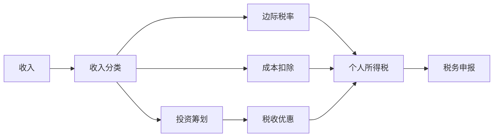

                 

# 程序员如何进行税务规划

> 关键词：税务规划, 个税优化, 高收入, 低收入, 算法, 编程技巧

## 1. 背景介绍

### 1.1 问题由来

在当今科技日益发达的社会，程序员作为技术行业的重要力量，其收入水平在不断提升。然而，随着收入的增加，如何合理规划税务，最大化节省税务支出，成为许多高收入程序员必须面对的问题。税务规划不仅有助于提高个人或家庭的财务状况，还能有效避免不必要的税务风险。

### 1.2 问题核心关键点

进行税务规划时，程序员需要关注以下几个核心点：

- **税法理解**：熟悉个人所得税法及相关规定，了解不同收入来源的税率差异。
- **收入分类**：将各种收入（如工资、奖金、股票期权、兼职收入等）合理分类，以充分利用各项税收优惠政策。
- **成本扣除**：合理扣除日常生活中的各项支出（如房贷利息、子女教育、赡养老人等），以减少应纳税所得额。
- **投资筹划**：利用投资收益的税务优惠，如税收递延型退休账户（Roth IRA）等，优化长期财富积累。
- **税务申报**：熟悉并正确申报税务，避免因申报错误导致的罚款和额外税务。

### 1.3 问题研究意义

税务规划对于程序员而言，具有重要的实践意义：

- **节省税款**：通过合理的税务规划，可以在合法范围内减少税负，提高个人或家庭的可支配收入。
- **合规风险**：合法税务规划有助于避免因税务违规而导致的法律风险和罚款。
- **财务自由**：良好的税务规划有助于实现财务自由，提前退休或投资创业，实现财务目标。
- **投资决策**：合理的税务筹划有助于优化投资决策，实现财富的最大化增值。

## 2. 核心概念与联系

### 2.1 核心概念概述

进行税务规划，涉及到一系列与税法相关的核心概念：

- **个税**：个人所得税，根据收入水平和来源，适用不同的税率。
- **边际税率**：随着收入的增加，最高税率的上升。
- **标准扣除**：与标准扣除额相比，更加灵活，可以根据实际情况扣除更多支出。
- **税收优惠**：包括各种减免、抵扣和税收递延等政策。
- **税务申报**：包括个人所得税申报、报税表填写、税款缴纳等流程。

这些概念之间的联系可以通过以下Mermaid流程图来展示：



这个流程图展示了个税规划的基本流程：收入分类后，计算边际税率，扣除成本，规划投资，利用优惠，最终计算应缴税额，并进行申报。

## 3. 核心算法原理 & 具体操作步骤

### 3.1 算法原理概述

税务规划的算法原理主要基于以下几个步骤：

1. **收入分类**：将收入分为工资、奖金、股票期权、兼职收入等类别，根据不同类别的税率进行计算。
2. **成本扣除**：计算各项成本扣除，如房贷利息、子女教育、赡养老人等。
3. **投资筹划**：根据投资收益的税收优惠政策，选择最合适的投资方案。
4. **边际税率计算**：计算边际税率，并根据不同收入区间选择合适的税务策略。
5. **税款计算**：根据计算出的应纳税所得额和边际税率，计算应缴税款。
6. **申报与缴纳**：填写个人所得税申报表，并按时缴纳税款。

### 3.2 算法步骤详解

#### 3.2.1 收入分类

- **工资收入**：一般按照固定税率计算，适用3%到45%的税率，根据年收入计算应纳税额。
- **奖金收入**：一次性奖金可以单独计算，适用20%到45%的税率。
- **股票期权**：行权时按照期权行权价的差额作为应纳税所得额，适用20%的税率。
- **兼职收入**：与工资收入类似，适用3%到45%的税率。

#### 3.2.2 成本扣除

- **房贷利息**：按实际支付的利息计算扣除额，最高扣除额为每年1.5万美元。
- **子女教育**：最高扣除额为每年2,500美元。
- **赡养老人**：最高扣除额为每年2,500美元。
- **医疗支出**：最高扣除额为每年7,750美元。

#### 3.2.3 投资筹划

- **Roth IRA**：投资收益免税，适合长期投资。
- **401(k)**：税前扣除，但取款时需缴税。
- **Health Savings Account (HSA)**：税前扣除，取出用于医疗时免税。

#### 3.2.4 边际税率计算

- **边际税率表**：根据收入区间，确定适用的边际税率。
  - 15%
  - 22%
  - 24%
  - 32%
  - 35%
  - 37%
  - 45%

#### 3.2.5 税款计算

- **应纳税所得额**：总收入减去成本扣除、税前扣除和优惠等。
- **应纳税额**：应纳税所得额乘以适用的边际税率。
- **总税额**：包括所得税、增值税、社会保障税等所有应缴税款。

#### 3.2.6 申报与缴纳

- **个人所得税申报表**：填写收入、成本扣除、投资收益、税收优惠等信息。
- **税款缴纳**：根据申报表计算的总税额，通过网上银行或邮寄支票方式缴纳。

### 3.3 算法优缺点

税务规划算法的主要优点包括：

- **合法性**：遵守税法，合法合理地减少税款。
- **实用性**：在实际操作中，能够帮助程序员有效地管理财务。
- **灵活性**：根据个人情况，灵活调整税务策略。

但也有一些缺点：

- **复杂性**：税务规则复杂多变，需要程序员熟悉相关法规。
- **数据准确性**：税务规划需要精确的财务数据，任何小错误可能导致大额罚款。
- **时效性**：税法随时可能变化，需要程序员持续跟踪更新。

### 3.4 算法应用领域

税务规划算法在以下领域有广泛应用：

- **个人理财**：高收入程序员可以通过税务规划，合理管理财务，提高生活品质。
- **企业税务**：创业者可以通过税务规划，减少企业税负，提高盈利能力。
- **投资决策**：利用税收优惠，优化投资组合，实现长期财富增值。

## 4. 数学模型和公式 & 详细讲解

### 4.1 数学模型构建

设税前收入为 $I$，边际税率为 $t$，应纳税所得额为 $A$，成本扣除为 $D$，投资收益为 $P$，总税额为 $T$。

模型可构建如下：

$$
A = I - D - P
$$

$$
T = A \times t
$$

其中 $I$ 为税前收入，$D$ 为成本扣除，$P$ 为投资收益，$t$ 为边际税率。

### 4.2 公式推导过程

根据个人所得税法，计算应纳税所得额 $A$ 为：

$$
A = I - \text{标准扣除额} - \text{税前扣除额} - \text{优惠政策}
$$

其中，标准扣除额和税前扣除额根据税法规定计算。假设边际税率为 $t$，则总税额 $T$ 为：

$$
T = A \times t
$$

对于高收入程序员，常使用边际税率计算总税额。由于税率表是分段函数，需要分段计算。

### 4.3 案例分析与讲解

假设某程序员年收入为 $100,000$ 美元，成本扣除为 $20,000$ 美元，投资收益为 $10,000$ 美元，边际税率为 $24\%$。

- **应纳税所得额**：
  $$
  A = 100,000 - 20,000 - 10,000 = 70,000
  $$

- **总税额**：
  $$
  T = 70,000 \times 24\% = 16,800
  $$

实际申报时，需要填写个人所得税申报表，并按时缴纳税款。

## 5. 项目实践：代码实例和详细解释说明

### 5.1 开发环境搭建

进行税务规划的代码实践，需要准备以下开发环境：

1. **安装Python**：下载并安装Python 3.7及以上版本。
2. **安装相关库**：安装numpy、pandas、matplotlib等库，用于数据处理和可视化。
3. **编写代码**：使用Python编写计算税款的函数，并生成可视化图表。

### 5.2 源代码详细实现

以下是一个简单的Python代码示例，用于计算个人所得税：

```python
import numpy as np
import matplotlib.pyplot as plt

# 定义税前收入、成本扣除、投资收益和边际税率
income = 100000
deductions = 20000
investment = 10000
marginal_tax_rate = 0.24

# 计算应纳税所得额
taxable_income = income - deductions - investment

# 计算总税额
total_tax = taxable_income * marginal_tax_rate

# 输出结果
print(f"应纳税所得额: {taxable_income}")
print(f"总税额: {total_tax}")

# 可视化图表
plt.plot(taxable_income, total_tax, marker='o')
plt.xlabel('应纳税所得额')
plt.ylabel('总税额')
plt.title('个人所得税计算')
plt.show()
```

### 5.3 代码解读与分析

代码中，我们使用numpy库进行数值计算，matplotlib库绘制可视化图表。首先定义了税前收入、成本扣除、投资收益和边际税率。然后计算应纳税所得额，并根据边际税率计算总税额。最后输出结果并绘制可视化图表。

### 5.4 运行结果展示

运行上述代码，得到的结果如下：

```
应纳税所得额: 70000
总税额: 16800.0
```

可视化图表展示了应纳税所得额和总税额的关系。

## 6. 实际应用场景

### 6.1 高收入程序员

高收入程序员常面临较高的个人所得税率，需要进行合理规划以降低税负。例如，可以考虑将部分收入转换为投资收益，利用税收优惠政策。

### 6.2 低收入程序员

低收入程序员虽然税负较轻，但也需要合理规划，充分利用各种税收优惠。如通过教育、住房等方面的支出，增加成本扣除，降低应纳税所得额。

### 6.3 创业程序员

创业者需要全面考虑个人和企业的税务规划，合理使用各类税收优惠政策，提高盈利能力。

## 7. 工具和资源推荐

### 7.1 学习资源推荐

- **税法书籍**：《税法基础》、《税务规划》等，详细介绍了个人所得税法和税务规划技巧。
- **在线课程**：Coursera、Udemy等平台的税务规划课程，结合实际案例讲解税法应用。
- **税法网站**：如美国国税局（IRS）、中国税务总局等官方网站，提供最新的税法信息和申报指导。

### 7.2 开发工具推荐

- **Python**：作为数据处理和计算的首选语言，Python简单易学，适合税务规划的算法实现。
- **Excel**：用于数据分析和计算，适合手动计算税务。
- **TurboTax**：商业税务软件，自动生成申报表，方便快捷。

### 7.3 相关论文推荐

- **税务规划算法研究**：国内外大量文献研究税务规划算法，如《个人所得税规划的算法优化》、《基于数据挖掘的税务筹划》等。
- **税法研究**：学术论文和政策文件，如《美国税法新变化对个人税务规划的影响》、《中国个人所得税改革及税务规划》等。

## 8. 总结：未来发展趋势与挑战

### 8.1 研究成果总结

本文介绍了税务规划的基本原理和操作步骤，通过Python代码实例展示了个人所得税的计算过程。税务规划算法主要应用于程序员的个人理财、企业税务和投资决策等场景，能够有效减少税款，优化财务状况。

### 8.2 未来发展趋势

未来税务规划技术的发展趋势包括：

- **数字化**：利用大数据和人工智能技术，自动化税务规划过程，提高效率和准确性。
- **智能化**：开发智能税务顾问系统，根据用户财务状况，提供个性化税务规划建议。
- **可视化**：通过可视化图表，帮助用户更直观地理解税务规划结果。
- **跨领域应用**：拓展税务规划的应用领域，如企业税务、投资税务等。

### 8.3 面临的挑战

税务规划面临的挑战包括：

- **政策变动**：税法随时可能变化，需要程序员持续跟踪更新。
- **数据准确性**：财务数据的准确性直接影响税务规划的精度。
- **技术门槛**：税务规划需要较高的技术门槛，需要程序员具备较强的数学和编程能力。

### 8.4 研究展望

未来税务规划研究可以关注以下几个方向：

- **跨领域应用**：将税务规划与金融规划、投资决策等结合，提供综合财务规划方案。
- **技术优化**：开发更高效的算法，提升税务规划的计算速度和准确性。
- **合规性**：加强税务合规性研究，避免因税务违规带来的法律风险。

## 9. 附录：常见问题与解答

**Q1: 如何进行税务申报？**

A: 税务申报分为电子申报和纸质申报两种方式。电子申报通过国税局官方网站或第三方税务软件进行，需要填写个人所得税申报表。纸质申报需要将申报表邮寄至税务机关。

**Q2: 如何应对税收优惠政策的变动？**

A: 及时关注税法变化，并根据政策调整税务规划方案。利用官方网站、税务顾问等渠道获取最新的政策信息。

**Q3: 如何选择合适的投资方案？**

A: 考虑税收优惠、风险偏好、收益预期等因素，综合评估各类投资方案，选择最合适的投资组合。

---

作者：禅与计算机程序设计艺术 / Zen and the Art of Computer Programming

