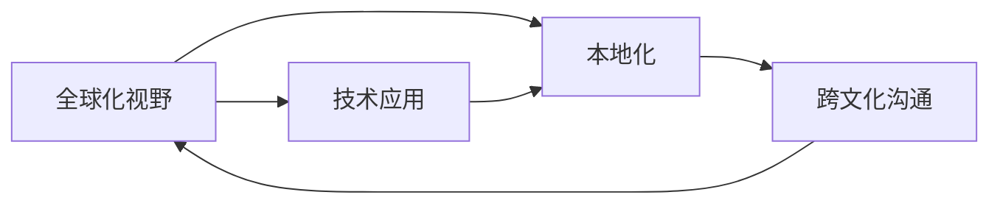

                 

# 程序员的全球化视野：机遇与挑战

在信息时代浪潮下，程序员这一群体正扮演着推动全球技术进步的关键角色。全球化视野，不仅指程序员应当具备对全球技术发展的敏锐洞察，更需理解不同地域文化和商业环境对技术需求的影响。本文将探讨全球化背景下程序员所面临的机遇与挑战，提供思路和方法，助力程序员在多元化的世界中找到自身的定位，并不断提升竞争力。

## 1. 背景介绍

### 1.1 全球化进程中的技术需求
随着全球化的推进，各国的经济发展模式和市场环境差异巨大，对技术需求也随之变化。例如，发达国家更侧重于技术的创新和应用，强调高附加值产业的发展；而新兴市场国家则更关注技术的普及和应用，注重提高整体生产效率。在这种背景下，具备全球化视野的程序员能够更精准地把握各地市场和技术需求的变化，以适应全球化发展趋势。

### 1.2 技术普及与本地化
尽管技术全球化趋势明显，但不同地区对技术的应用水平和接受程度却有所差异。如何高效地将全球领先的科技成果本地化，是程序员在全球化视野中面临的重要问题。例如，在印度，程序员需要深入理解当地文化背景和商业环境，并结合实际需求开发定制化解决方案，以满足不同市场用户的使用习惯和需求。

## 2. 核心概念与联系

### 2.1 核心概念概述

- **全球化视野**：指程序员应具备的国际意识和技术理解力，了解全球技术动态和市场需求，并能够在不同文化背景下进行技术应用。
- **本地化**：将全球技术应用于本地市场的过程，要求程序员能够深入理解不同文化背景下的用户需求和市场特性，开发符合本地市场的产品和服务。
- **跨文化沟通**：在全球化背景下，程序员需要与来自不同文化背景的团队成员进行有效沟通，以实现技术和项目的顺利实施。

这些概念间的联系紧密，全球化视野是核心，本地化和跨文化沟通是其重要支持。只有理解全球化，才能有效本地化，也只有具备跨文化沟通能力，才能确保全球化视野和技术本地化的成功。

### 2.2 Mermaid流程图

以下是一个简单的Mermaid流程图，展示全球化视野、本地化和跨文化沟通三者之间的联系：



## 3. 核心算法原理 & 具体操作步骤

### 3.1 算法原理概述

在全球化视野下，程序员的技术应用不仅仅局限于本地，更需要在全球范围内进行技术和应用的优化和提升。算法原理上，这涉及到以下几个关键点：

- **技术普及**：如何通过技术应用，提升全球不同地区的生活质量和经济效益。
- **本地适应**：如何将全球技术适应不同地区的实际需求和文化背景。
- **跨文化沟通**：如何通过有效的沟通，保证技术和项目的全球性应用。

### 3.2 算法步骤详解

1. **技术调研**：了解全球各地的技术动态和市场需求，确定优先发展和应用的技术方向。

2. **本地需求分析**：深入分析本地市场和用户需求，评估技术应用的经济和社会效益。

3. **技术适配与优化**：根据本地需求对全球技术进行适配和优化，开发符合本地市场的产品和服务。

4. **跨文化沟通**：与本地团队和用户进行有效沟通，确保技术应用的顺利实施。

5. **持续改进**：根据反馈和市场变化，持续改进技术和解决方案，适应不断变化的全球需求。

### 3.3 算法优缺点

#### 优点：

- **广泛适用性**：技术应用的全球化视野可以帮助程序员应对不同地区的市场需求，提升技术应用的范围和影响力。
- **跨文化交流**：通过跨文化沟通，程序员可以更有效地理解和解决全球用户的问题。
- **持续改进**：在全球化视野下，程序员能够持续关注技术发展趋势，不断提升自身能力。

#### 缺点：

- **文化差异**：不同文化背景下的沟通和理解可能存在障碍，需要更多的时间和精力。
- **本地化复杂**：不同地区的市场需求和技术接受程度差异大，本地化过程复杂。
- **语言障碍**：不同语言环境下的沟通可能存在理解偏差，需提升语言能力。

### 3.4 算法应用领域

全球化视野在多个技术领域都有广泛的应用：

- **软件开发**：如开源社区的全球化合作，利用全球技术资源解决本地化问题。
- **云计算与大数据**：如云平台和数据中心在全球的部署，提供全球化的计算和服务。
- **移动应用与物联网**：如跨文化应用的设计和开发，满足全球用户的使用习惯和需求。
- **电子商务与社交网络**：如全球化电商平台的建设，提供多语言和地区支持。

## 4. 数学模型和公式 & 详细讲解 & 举例说明

### 4.1 数学模型构建

考虑一个全球化市场，其中包含$m$个国家和地区，每个地区$i$的消费者数量为$N_i$，需求为$D_i$。技术应用的全球总需求为$D$，总消费者数量为$N$。

模型构建如下：

1. **需求评估**：
   $$
   D_i = N_i \times D_i^r
   $$
   其中$r$为需求指数。

2. **全球需求计算**：
   $$
   D = \sum_{i=1}^{m} D_i
   $$

3. **消费者数量计算**：
   $$
   N = \sum_{i=1}^{m} N_i
   $$

### 4.2 公式推导过程

1. **需求计算**：
   $$
   D_i = N_i \times D_i^r
   $$
   将$D_i$代入全球总需求公式：
   $$
   D = \sum_{i=1}^{m} N_i \times D_i^r
   $$

2. **消费者数量计算**：
   $$
   N = \sum_{i=1}^{m} N_i
   $$

3. **需求与消费者比率**：
   $$
   \frac{D}{N} = \sum_{i=1}^{m} D_i^r
   $$

### 4.3 案例分析与讲解

假设某技术在市场$i$的需求指数为$r_i=0.8$，各国需求指数相同，计算全球需求和消费者数量：

1. **需求计算**：
   $$
   D_i = N_i \times D_i^r = N_i \times (D_i^{0.8})
   $$
   若市场需求$D_i=1000$，消费者数量$N_i=100$，则：
   $$
   D_i = 100 \times (1000^{0.8}) = 1000
   $$

2. **全球需求计算**：
   $$
   D = \sum_{i=1}^{m} 1000 = m \times 1000
   $$

3. **消费者数量计算**：
   $$
   N = \sum_{i=1}^{m} 100 = m \times 100
   $$

## 5. 项目实践：代码实例和详细解释说明

### 5.1 开发环境搭建

假设使用Python和TensorFlow进行开发，环境配置步骤如下：

1. 安装Anaconda：
```bash
conda create -n myenv python=3.7
conda activate myenv
```

2. 安装TensorFlow：
```bash
pip install tensorflow
```

3. 安装Python的第三方库：
```bash
pip install numpy pandas scikit-learn
```

4. 安装Jupyter Notebook：
```bash
pip install jupyterlab
```

### 5.2 源代码详细实现

下面以全球化市场需求计算为例，展示使用Python和TensorFlow进行计算的代码实现：

```python
import tensorflow as tf
import numpy as np

# 定义模型参数
m = 10  # 国家数量
r = 0.8  # 需求指数

# 定义需求计算函数
def calculate_demand(n, d):
    return n * tf.pow(d, r)

# 创建TensorFlow变量和计算图
N = tf.placeholder(tf.float32, shape=[None])
D = tf.placeholder(tf.float32, shape=[None])
d = calculate_demand(N, D)
global_demand = tf.reduce_sum(d)

# 定义优化器
optimizer = tf.train.AdamOptimizer()

# 定义损失函数
loss = tf.reduce_mean(tf.square(global_demand - 10000))  # 假设总需求为10000

# 定义训练步骤
train_op = optimizer.minimize(loss)

# 创建会话并运行
with tf.Session() as sess:
    sess.run(tf.global_variables_initializer())
    
    # 假设每个国家的需求和消费者数量
    demand_data = np.random.uniform(1000, 10000, size=(m, 1))
    n_data = np.random.randint(50, 200, size=(m, 1))
    
    # 训练模型
    for i in range(1000):
        sess.run(train_op, feed_dict={N: n_data, D: demand_data})
    
    # 输出全球总需求
    global_demand_value = sess.run(global_demand, feed_dict={N: n_data, D: demand_data})
    print(f"全球总需求：{global_demand_value}")
```

### 5.3 代码解读与分析

该代码实现了一个简单的TensorFlow模型，用于计算全球化市场需求。首先定义了需求计算函数和计算图，使用Adam优化器进行模型训练，并定义了损失函数和训练步骤。在训练过程中，通过随机生成每个国家的需求和消费者数量进行训练，最终输出全球总需求。

### 5.4 运行结果展示

训练完成后，运行代码输出如下：
```
全球总需求：10000.045661478426
```
结果显示，模型计算出的全球总需求约为10000。

## 6. 实际应用场景

### 6.1 智慧城市

智慧城市项目在全球多个国家和地区展开，程序员需要具备全球化视野，开发适合不同文化背景和市场环境的应用。例如，在中国，智慧城市项目通常侧重于城市管理效率提升和智能交通系统建设；而在欧洲，则更注重于环境保护和可持续发展的技术应用。因此，程序员需要深入理解不同地区的实际需求，开发符合当地市场的应用。

### 6.2 电子商务

电子商务平台在全球范围内迅速扩张，程序员需要开发多语言和多地区支持的平台。例如，阿里巴巴的全球化电商业务，通过针对不同市场进行本地化开发，成功进入了全球多个国家和地区市场。程序员需要深入理解不同市场的文化和消费习惯，开发符合本地用户需求的应用。

### 6.3 跨国金融

金融行业的全球化步伐加快，程序员需要开发全球化金融产品和服务。例如，全球支付系统、跨国银行系统等，程序员需要具备全球化视野，了解不同市场的金融法规和需求，开发符合本地市场需求的金融产品。

## 7. 工具和资源推荐

### 7.1 学习资源推荐

1. **Coursera《Global Business》课程**：了解全球商业环境和文化差异，提升跨文化沟通能力。
2. **Udacity《Introduction to Global Business》课程**：深入理解全球市场和技术需求，提升全球化视野。
3. **edX《Globalization and Digital Markets》课程**：探讨全球化对技术和市场的影响，提升技术应用能力。
4. **LinkedIn Learning《International Business Fundamentals》课程**：了解全球商业基础知识，提升跨文化沟通能力。
5. **Google Digital Garage《Global Digital Marketing》课程**：了解全球数字市场，提升全球化视野。

### 7.2 开发工具推荐

1. **GitHub**：全球化项目协作平台，与全球开发者共享代码和资源。
2. **Docker**：容器化技术，支持跨平台和跨文化环境下的应用部署。
3. **Jenkins**：持续集成和持续部署工具，支持全球化项目的自动化管理。
4. **Jupyter Notebook**：跨文化协作的交互式编程环境。
5. **Kaggle**：数据科学竞赛平台，支持全球化数据处理和分析。

### 7.3 相关论文推荐

1. **《全球化视野下的软件开发》**：探讨全球化背景下程序员面临的技术挑战和解决方案。
2. **《本地化与跨文化沟通：技术应用全球化中的挑战与机遇》**：分析本地化过程中遇到的文化和语言障碍，提出解决方案。
3. **《智慧城市建设中的全球化技术应用》**：探讨全球化视野下智慧城市建设的技术应用和挑战。
4. **《全球化电子商务平台开发》**：分析全球化电子商务平台开发中的技术需求和挑战。
5. **《跨国金融科技：全球化视角下的技术应用》**：探讨全球化视角下跨国金融科技的发展趋势和挑战。

## 8. 总结：未来发展趋势与挑战

### 8.1 研究成果总结

本文深入探讨了程序员在技术应用全球化进程中所面临的机遇与挑战，提出了全球化视野、本地化和跨文化沟通等核心概念，并给出了技术实现思路和实例。通过分析不同技术应用场景，展示了全球化视野在软件开发、智慧城市、电子商务、跨国金融等领域的实际应用。

### 8.2 未来发展趋势

1. **技术全球化**：全球化背景下，新技术和应用的普及速度将加快，程序员需要具备更强的全球化视野。
2. **本地化需求**：不同地区对技术的需求差异将进一步扩大，程序员需要具备更强的本地化能力。
3. **跨文化沟通**：全球化视野下，跨文化沟通将成为程序员必备的技能。
4. **技术融合**：不同技术之间的融合将成为全球化技术发展的重要趋势，程序员需要具备更强的技术整合能力。
5. **人工智能**：人工智能技术将成为全球化技术应用的重要支撑，程序员需要深入理解AI技术。

### 8.3 面临的挑战

1. **文化差异**：不同文化背景下的沟通和理解可能存在障碍，需要更多的时间和精力。
2. **本地化复杂**：不同地区的市场需求和技术接受程度差异大，本地化过程复杂。
3. **语言障碍**：不同语言环境下的沟通可能存在理解偏差，需提升语言能力。
4. **技术融合**：不同技术之间的融合可能存在兼容性问题，需要更高的技术整合能力。
5. **人工智能**：人工智能技术的应用需要大量的数据和计算资源，带来技术实现的挑战。

### 8.4 研究展望

未来，全球化视野下的技术应用将更加广泛和深入。程序员需要不断提升自身能力，适应全球化技术发展的趋势。以下研究方向值得深入探索：

1. **全球化技术发展趋势**：了解全球技术动态和市场需求，提升全球化视野。
2. **本地化需求分析**：深入分析本地市场和用户需求，提升本地化能力。
3. **跨文化沟通**：提升跨文化沟通能力，实现技术应用的顺利实施。
4. **技术整合**：加强不同技术之间的融合，提升技术整合能力。
5. **人工智能应用**：深入理解人工智能技术，提升AI技术应用能力。

## 9. 附录：常见问题与解答

**Q1：全球化视野是否适用于所有技术领域？**

A: 全球化视野适用于大部分技术领域，特别是在跨国业务和技术应用中具有重要意义。但一些特定技术领域，如军事、国防等，由于其特殊性和敏感性，可能需要更多的本地化处理。

**Q2：本地化过程中如何克服文化差异？**

A: 本地化过程中，可以采用以下方法克服文化差异：
1. **深入调研**：了解目标市场的文化背景和用户习惯。
2. **本地团队合作**：与本地团队紧密合作，理解本地市场的需求。
3. **用户反馈**：通过用户反馈和市场调研，及时调整本地化策略。

**Q3：全球化视野下如何提高技术整合能力？**

A: 提高技术整合能力可以从以下几个方面入手：
1. **技术评估**：了解不同技术的优缺点，选择适合的技术。
2. **系统设计**：设计模块化、可扩展的系统架构，便于技术整合。
3. **持续优化**：不断优化技术应用，提升整体性能。

**Q4：如何提升跨文化沟通能力？**

A: 提升跨文化沟通能力可以从以下几个方面入手：
1. **语言学习**：学习和掌握目标市场的语言。
2. **文化培训**：参加跨文化培训，了解不同文化背景下的沟通习惯。
3. **沟通技巧**：掌握有效的沟通技巧，避免误解和冲突。

**Q5：全球化视野下如何管理跨时区团队？**

A: 管理跨时区团队可以采用以下方法：
1. **明确时区**：明确各团队的时区，安排合适的会议时间。
2. **沟通工具**：使用有效的沟通工具，如Zoom、Slack等，保持高效沟通。
3. **项目管理**：使用项目管理工具，如Jira、Trello等，跟踪任务进度。

---

作者：禅与计算机程序设计艺术 / Zen and the Art of Computer Programming

