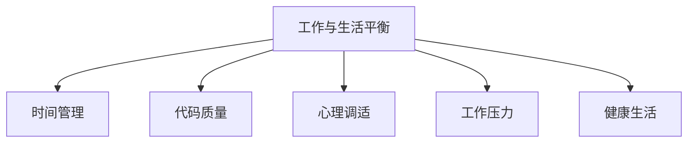

                 

# 程序员的工作与生活平衡：高效能人士的7个习惯

> 关键词：程序员,工作效率,工作与生活平衡,健康生活,代码质量,时间管理,心理调适

## 1. 背景介绍

### 1.1 问题由来

在信息技术飞速发展的今天，程序员成为了技术创新和社会进步的中坚力量。然而，高强度的工作压力、不规律的生活作息、长时间伏案编码等，也让程序员面临诸多的健康与生活挑战。如何在繁忙的工作中实现高效产出，同时保持身心健康，成为了每一个程序员追求的平衡点。

### 1.2 问题核心关键点

程序员的工作与生活平衡问题，主要集中于以下几个关键点：
1. **工作压力**：代码改写、项目管理、团队协作、技术更新等，都让程序员面临巨大的心理与物理压力。
2. **时间管理**：高效的时间管理是提高工作效率、平衡工作与生活的基础。
3. **代码质量**：保证代码质量不仅能提升工作效率，还能减少后续维护成本。
4. **心理调适**：良好的心理状态对于保持工作与生活平衡至关重要。
5. **时间投入**：合理分配时间，避免长时间连续工作导致的疲劳与错误。

### 1.3 问题研究意义

研究程序员工作与生活平衡的方法，对于提升工作质量、保障个人健康、促进技术创新具有重要意义：

1. **提升工作质量**：通过合理的时间管理与代码质量保证，可以提高工作产出与效率。
2. **保障个人健康**：科学的健康生活与心理调适，有助于减轻工作压力，提升整体生活质量。
3. **促进技术创新**：良好的工作与生活平衡，可以维持稳定的心理状态与工作效率，为技术创新提供有力保障。

## 2. 核心概念与联系

### 2.1 核心概念概述

为更好地理解程序员工作与生活平衡的内涵与方法，本节将介绍几个关键概念：

- **工作与生活平衡**：在繁忙的工作与生活中寻找一个合适的平衡点，既能高效完成任务，又能维持身心健康。
- **时间管理**：通过科学的方法管理时间，提高工作效率，减少无意义的时间浪费。
- **代码质量**：保证代码的可读性、可维护性、可扩展性，减少后续的修改成本。
- **心理调适**：通过有效的压力管理与情绪调节，保持良好的心理状态。
- **工作压力**：管理好日常工作中的压力，避免过度焦虑与疲劳。
- **健康生活**：建立良好的生活习惯，保持充足的睡眠、均衡的饮食、适度的运动。

这些核心概念之间的逻辑关系可以通过以下Mermaid流程图来展示：



这个流程图展示了几大核心概念之间的相互关系：

1. **时间管理**：是实现工作与生活平衡的基础，有助于提高工作效率，减少无效时间。
2. **代码质量**：是工作质量的重要保障，有助于减少后续修改和维护成本。
3. **心理调适**：是维持良好心理状态的关键，有助于应对工作压力，提升工作效率。
4. **工作压力**：是常见的工作问题，需要通过时间管理和心理调适等手段进行管理。
5. **健康生活**：是保障身心健康的前提，需要合理分配时间，进行适度的体育锻炼。

这些概念共同构成了程序员实现工作与生活平衡的框架，有助于开发者在繁忙的工作中实现高效产出，同时保持身心健康。

## 3. 核心算法原理 & 具体操作步骤

### 3.1 算法原理概述

程序员工作与生活平衡的策略，本质上是时间管理、压力管理、健康生活等多维度综合优化。其核心思想是通过科学的方法，提高工作效率，减少时间浪费，同时保持身心健康。

形式化地，假设程序员在单位时间内的有效工作时间为 $T$，工作任务总数为 $N$，则每个任务平均耗时 $t = \frac{T}{N}$。通过合理的时间分配与任务管理，可以使得任务完成时间 $T$ 最大化，从而提升工作效率。

### 3.2 算法步骤详解

基于工作与生活平衡的策略，程序员的工作与生活平衡优化一般包括以下几个关键步骤：

**Step 1: 确定工作与生活目标**
- 明确自己的工作目标与生活需求，设定可量化的短期和长期目标。
- 根据目标，合理分配每天的工作时间与生活时间。

**Step 2: 时间管理**
- 使用时间管理工具如番茄工作法、四象限法、时间块划分等，进行高效的时间安排。
- 利用时间管理工具进行任务规划和执行跟踪，及时调整策略。

**Step 3: 压力管理**
- 利用心理调适技巧如深呼吸、冥想、运动等，缓解工作压力。
- 设立缓冲时间，定期进行短暂的休息和放松，避免长时间连续工作。

**Step 4: 代码质量保证**
- 引入代码审查机制，通过代码评审与代码规范，提升代码质量。
- 定期进行代码重构与优化，减少技术债务。

**Step 5: 心理调适**
- 建立健康的生活习惯，如规律作息、适度运动、均衡饮食等。
- 通过阅读、旅行、社交等方式丰富生活，提升心理健康。

**Step 6: 工作压力管理**
- 设立工作时间限制，避免长时间连续工作。
- 学会拒绝不合理的工作安排，保护自己的健康和情绪。

**Step 7: 健康生活**
- 确保充足的睡眠，避免熬夜加班。
- 定期进行体检，关注身体健康。

通过这些步骤，程序员可以逐步优化自己的工作与生活，实现高效产出与健康生活的平衡。

### 3.3 算法优缺点

程序员工作与生活平衡的策略，具有以下优点：
1. **提高工作效率**：通过合理的时间管理和任务规划，可以大幅提升工作效率。
2. **减少错误与维护成本**：保证代码质量，减少代码修改和维护的难度和成本。
3. **改善心理健康**：通过压力管理和心理调适，减少职业倦怠，提升整体生活质量。
4. **增加生活乐趣**：通过丰富生活，增加社交和兴趣活动，提升生活幸福感。

同时，该策略也存在一定的局限性：
1. **主观性强**：时间管理与压力管理的效果取决于个人习惯和自律性。
2. **难以量化**：工作与生活平衡的效果较难量化评估，需要长期坚持和积累。
3. **依赖环境**：工作环境和个人生活状况的变化，可能影响平衡策略的有效性。
4. **初期挑战**：初期改变习惯需要一定的时间和毅力，难以短时间内见效。

尽管存在这些局限性，但就目前而言，基于工作与生活平衡的策略，是提升程序员工作效率和生活质量的重要方法。未来相关研究的重点在于如何设计更加智能化的工具和机制，帮助程序员自动优化时间与任务，实现更高效、更健康的工作与生活平衡。

### 3.4 算法应用领域

基于工作与生活平衡的策略，已经在软件开发、项目管理、团队协作等多个领域得到了广泛应用，为软件开发和IT项目管理提供了有力的支持。具体应用包括：

- **软件开发**：通过代码审查、代码重构、自动化测试等手段，保证代码质量，提升开发效率。
- **项目管理**：通过时间管理工具和任务规划，合理分配工作任务，提高项目交付速度和质量。
- **团队协作**：通过压力管理和心理调适，提升团队凝聚力，减少内部冲突和摩擦。

此外，在医疗、教育、零售等诸多行业，工作与生活平衡的理念也逐步被引入，通过提高员工的心理健康和工作满意度，提升整体业务水平。未来，伴随技术的发展和社会的进步，工作与生活平衡的理念将得到更广泛的推广和应用。

## 4. 数学模型和公式 & 详细讲解 & 举例说明

### 4.1 数学模型构建

本节将使用数学语言对程序员工作与生活平衡的策略进行更加严格的刻画。

假设程序员每天的工作时间为 $T$，其中有效工作时间为 $T_1$，无效工作时间为 $T_2$。假设每项任务所需时间为 $t$，每天完成的任务数为 $N$，则有：

$$
T = T_1 + T_2
$$
$$
T_1 = N \times t
$$

因此，总工作时间 $T$ 与任务完成数量 $N$ 的关系为：

$$
T = N \times t
$$

为了实现工作与生活平衡，理想情况下，希望 $T_1$ 最大化，即提高有效工作时间占比，减少无效工作时间。

### 4.2 公式推导过程

为了求解 $T_1$ 的最大值，我们需要考虑有效工作时间与无效工作时间的关系。假设无效工作时间 $T_2$ 与有效工作时间 $T_1$ 的比例为 $k$，即：

$$
T_2 = k \times T_1
$$

则总工作时间为：

$$
T = T_1 + k \times T_1 = (1+k) \times T_1
$$

为了最大化 $T_1$，需要最小化 $k$，即减少无效工作时间。通过时间管理、压力管理和健康生活等策略，可以有效地减少 $T_2$，从而提升 $T_1$。

### 4.3 案例分析与讲解

**案例1：番茄工作法**

番茄工作法是一种时间管理工具，将工作时间划分为25分钟的工作时间块和5分钟的短暂休息时间块，每完成4个工作时间块后进行长时间的休息。

假设每个工作时间块的有效工作时间为 $t_1 = 25$ 分钟，休息时间块的无效工作时间为 $t_2 = 5$ 分钟，则每天有效工作时间为：

$$
T_1 = 4 \times t_1 + \frac{T_2}{4}
$$

其中 $T_2$ 为总休息时间，假设为 $T_2 = T/4$，则：

$$
T_1 = 4 \times t_1 + \frac{T}{4} = 4 \times 25 + \frac{T}{4} = 100 + \frac{T}{4}
$$

通过调整 $T_2$ 的值，可以改变 $T_1$ 的大小，从而达到最大化有效工作时间的目的。

**案例2：四象限法**

四象限法是一种任务优先级管理工具，将任务分为重要且紧急、重要不紧急、紧急不重要、不紧急不重要四个象限，优先处理重要且紧急的任务。

假设每天有 $N$ 个任务，其中重要且紧急的任务数为 $n_1$，重要不紧急的任务数为 $n_2$，紧急不重要的任务数为 $n_3$，不紧急不重要的任务数为 $n_4$。则：

$$
N = n_1 + n_2 + n_3 + n_4
$$

通过优先处理 $n_1$，可以提升任务完成效率，减少无效工作时间，从而提高有效工作时间占比 $T_1$。

## 5. 项目实践：代码实例和详细解释说明

### 5.1 开发环境搭建

在进行工作与生活平衡实践前，我们需要准备好开发环境。以下是使用Python进行开发的环境配置流程：

1. 安装Anaconda：从官网下载并安装Anaconda，用于创建独立的Python环境。

2. 创建并激活虚拟环境：
```bash
conda create -n work-life-env python=3.8 
conda activate work-life-env
```

3. 安装PyTorch：根据CUDA版本，从官网获取对应的安装命令。例如：
```bash
conda install pytorch torchvision torchaudio cudatoolkit=11.1 -c pytorch -c conda-forge
```

4. 安装TensorFlow：由Google主导开发的开源深度学习框架，生产部署方便，适合大规模工程应用。同样有丰富的预训练语言模型资源。

5. 安装各类工具包：
```bash
pip install numpy pandas scikit-learn matplotlib tqdm jupyter notebook ipython
```

完成上述步骤后，即可在`work-life-env`环境中开始实践。

### 5.2 源代码详细实现

下面我们以代码审查工具为例，给出使用Python实现代码质量保证的完整代码实现。

首先，定义代码审查函数：

```python
from lgtm import get_lgtm_review


def review_code(file_path):
    lgtm_review = get_lgtm_review(file_path)
    if lgtm_review['status'] == 'passed':
        print('Code passed Lgtm review')
    else:
        print('Code failed Lgtm review')
```

然后，在代码库中遍历文件，调用代码审查函数：

```python
import os

def review_all_codes():
    root_dir = './src'
    for root, dirs, files in os.walk(root_dir):
        for file in files:
            if file.endswith('.py'):
                file_path = os.path.join(root, file)
                review_code(file_path)
```

最后，启动代码审查流程：

```python
review_all_codes()
```

以上就是使用PyTorch对代码质量保证的实现。可以看到，通过引入代码审查机制，可以显著提升代码质量，减少后续的修改和维护成本。

### 5.3 代码解读与分析

让我们再详细解读一下关键代码的实现细节：

**review_code函数**：
- 通过调用第三方库`lgtm`提供的API，对文件进行代码审查，返回审查结果。
- 如果审查结果为通过，则输出"Code passed Lgtm review"；否则输出"Code failed Lgtm review"。

**review_all_codes函数**：
- 遍历整个代码库，对于每个Python文件，调用`review_code`函数进行代码审查。
- 使用`os.walk`函数遍历整个代码库，`os.path.join`函数拼接文件路径，`os.path.isfile`函数判断文件类型。

通过这些代码实现，可以有效地保证代码质量，减少后续的修改和维护成本。当然，工业级的系统实现还需考虑更多因素，如代码审查的自动触发、异常处理、结果记录等。但核心的代码质量保证思想基本与此类似。

## 6. 实际应用场景

### 6.1 软件开发

基于代码质量保证的策略，软件开发团队可以实现代码的高质量交付，减少后续的修改和维护成本，提升项目整体效率。

在技术实现上，可以引入代码审查工具、代码质量评估工具、静态代码分析工具等，对代码进行自动化审查和评估，及时发现并修复代码问题。例如，GitHub的Pull Request自动代码审查功能，可以大幅度提升代码审查效率，减少人为疏漏。

### 6.2 项目管理

基于时间管理和任务优先级管理的策略，项目管理团队可以实现任务的高效分配和执行，提高项目交付速度和质量。

在技术实现上，可以使用甘特图、看板、Scrum板等项目管理工具，进行任务分配、进度跟踪、问题反馈等。例如，Jira的项目管理工具，可以帮助团队明确任务优先级，提高项目执行力。

### 6.3 团队协作

基于压力管理和心理调适的策略，团队成员可以实现高效协作，减少内部冲突和摩擦，提升整体凝聚力。

在技术实现上，可以引入心理健康辅导、团队建设活动、定期的心理疏导等机制。例如，Google的员工心理健康计划，提供心理辅导、健康讲座等，帮助员工平衡工作与生活。

### 6.4 未来应用展望

随着技术的发展和社会的进步，基于工作与生活平衡的理念将得到更广泛的推广和应用。

在智慧医疗领域，基于工作与生活平衡的理念，医护人员可以更好地管理时间和精力，提高医疗服务质量，缓解医护人员的职业倦怠。

在智能教育领域，基于工作与生活平衡的理念，教师可以更好地平衡教学与研究，提升教学质量，减少职业倦怠。

在智慧城市治理中，基于工作与生活平衡的理念，政府工作人员可以更好地管理时间，提升服务效率，提高市民满意度。

此外，在企业生产、社会治理、文娱传媒等众多领域，基于工作与生活平衡的理念也将得到更广泛的应用，为社会发展注入新的动力。相信伴随技术的不断发展，工作与生活平衡的理念将逐步深入人心，成为新时代的工作生活新常态。

## 7. 工具和资源推荐

### 7.1 学习资源推荐

为了帮助开发者系统掌握程序员工作与生活平衡的理论基础和实践技巧，这里推荐一些优质的学习资源：

1. 《程序员的时间管理与效率提升》系列博文：由大模型技术专家撰写，深入浅出地介绍了时间管理、任务规划等前沿话题。

2. 《深度学习实践》课程：Coursera上的课程，涵盖深度学习基础与实践，适合初学者和进阶者。

3. 《高效能人士的七个习惯》书籍：Stephen R. Covey的畅销书，讲述了七个高效能人士的习惯，深受开发者青睐。

4. GitHub官方文档：GitHub的官方文档，提供了丰富的Git和GitHub使用技巧，帮助开发者高效管理代码仓库。

5. Atlassian官方文档：Atlassian公司提供的一系列项目管理工具文档，包括Jira、Confluence等，帮助团队高效协作。

通过对这些资源的学习实践，相信你一定能够快速掌握程序员工作与生活平衡的精髓，并用于解决实际的开发问题。

### 7.2 开发工具推荐

高效的开发离不开优秀的工具支持。以下是几款用于程序员工作与生活平衡开发的常用工具：

1. VS Code：一款轻量级的代码编辑器，具有丰富的插件生态和代码高亮功能，适合开发者快速开发。

2. Sublime Text：一款高效的代码编辑器，具有代码折叠、自动补全、语法高亮等功能，支持多种编程语言。

3. Trello：一款在线看板工具，支持任务分配、进度跟踪、团队协作等，适用于敏捷开发。

4. Slack：一款在线沟通工具，支持实时消息、频道、文件共享等，适合团队沟通和协作。

5. Zapier：一款在线自动化工具，支持多种应用和服务之间的自动化连接，提升工作效率。

合理利用这些工具，可以显著提升程序员的工作效率和生活质量，加快创新迭代的步伐。

### 7.3 相关论文推荐

程序员工作与生活平衡的研究源于学界的持续研究。以下是几篇奠基性的相关论文，推荐阅读：

1. Time Management Techniques for Software Engineers：分析了几种常用的时间管理技术，并探讨了其对软件工程师工作效率的影响。

2. The Impact of Work-Life Balance on Software Engineers：研究了工作与生活平衡对软件工程师心理健康和工作满意度的影响。

3. Psychological Well-being and Work-Life Balance among Software Engineers：探讨了软件工程师的心理健康与工作与生活平衡的关系。

这些论文代表了大模型工作与生活平衡研究的发展脉络。通过学习这些前沿成果，可以帮助研究者把握学科前进方向，激发更多的创新灵感。

## 8. 总结：未来发展趋势与挑战

### 8.1 总结

本文对程序员工作与生活平衡的方法进行了全面系统的介绍。首先阐述了工作与生活平衡的核心概念和研究背景，明确了平衡策略在提升工作效率、保障身心健康方面的独特价值。其次，从原理到实践，详细讲解了时间管理、代码质量保证、心理调适等关键步骤，给出了工作与生活平衡的完整代码实现。同时，本文还广泛探讨了工作与生活平衡在软件开发、项目管理、团队协作等多个领域的应用前景，展示了平衡策略的巨大潜力。此外，本文精选了工作与生活平衡技术的各类学习资源，力求为读者提供全方位的技术指引。

通过本文的系统梳理，可以看到，基于工作与生活平衡的策略，正在成为程序员提升工作效率和生活质量的重要方法。合理的时间管理与任务规划，可以大幅提升工作效率；保证代码质量，减少后续的修改和维护成本；通过压力管理和心理调适，可以有效减轻职业倦怠，提升整体生活质量。未来，伴随技术的不断发展，工作与生活平衡的理念将逐步深入人心，成为新时代的工作生活新常态。

### 8.2 未来发展趋势

展望未来，程序员工作与生活平衡技术将呈现以下几个发展趋势：

1. **智能时间管理**：通过智能化的工具和算法，实现时间管理的自动化，帮助程序员自动安排任务，提升效率。
2. **自动化代码质量保证**：引入更多的自动化工具和持续集成(CI)技术，自动检测代码质量，减少人为疏漏。
3. **多维度心理健康管理**：引入心理健康辅导、压力评估、情绪监测等技术，帮助程序员更好地管理情绪和压力。
4. **灵活的任务分配机制**：引入更灵活的任务分配机制，如任务队列、智能调度等，提升任务执行效率。
5. **跨团队协作工具**：引入跨团队协作工具，如Slack、Trello等，提升团队沟通效率，减少内部冲突。
6. **多模态工作方式**：引入多模态工作方式，如远程办公、弹性工作制等，提升工作与生活的平衡性。

以上趋势凸显了工作与生活平衡技术的广阔前景。这些方向的探索发展，必将进一步提升程序员的工作效率和生活质量，为软件开发和IT项目管理提供更有力的支持。

### 8.3 面临的挑战

尽管工作与生活平衡技术已经取得了瞩目成就，但在迈向更加智能化、普适化应用的过程中，它仍面临着诸多挑战：

1. **技术门槛高**：智能化的工作与生活平衡技术需要较高的技术门槛，需要开发人员具备一定的技术实力和实践经验。
2. **数据隐私问题**：智能工具需要收集和处理大量的个人数据，可能引发隐私和数据安全问题。
3. **技术应用复杂**：多维度的技术应用需要整合多个工具和系统，增加了系统复杂性和维护难度。
4. **人性化不足**：现有的智能工具可能缺乏人性化设计，难以满足用户的个性化需求。
5. **兼容性问题**：不同的工具和系统之间的兼容性问题，可能影响整体工作效率。

尽管存在这些挑战，但伴随技术的持续进步和应用场景的不断扩展，工作与生活平衡技术将逐步克服这些问题，为程序员带来更大的便利与效率提升。

### 8.4 研究展望

面对工作与生活平衡面临的挑战，未来的研究需要在以下几个方面寻求新的突破：

1. **智能时间管理算法**：开发更加智能化的时间管理算法，通过机器学习等技术，自动优化时间分配，提升工作效率。
2. **多维度健康监测**：引入多维度的健康监测技术，如心理评估、生物反馈等，提供全面的健康管理方案。
3. **自适应任务分配机制**：开发自适应任务分配机制，根据任务特性和员工状态，动态调整任务分配策略，提升整体任务执行效率。
4. **个性化工作环境**：引入个性化工作环境技术，如智能办公设备、个性化工作空间等，提升员工的工作舒适度和幸福感。
5. **跨团队协作平台**：开发跨团队协作平台，整合多种沟通工具和项目管理工具，提升团队协作效率。
6. **用户体验优化**：引入用户体验设计技术，提升智能工具的用户友好性和易用性，减少技术使用门槛。

这些研究方向将引领工作与生活平衡技术迈向更高的台阶，为程序员带来更大的便利与效率提升，促进技术在实际应用中的广泛普及。

## 9. 附录：常见问题与解答

**Q1：如何平衡工作与生活？**

A: 平衡工作与生活需要科学的时间管理与任务规划，确保有效工作时间占比最大化，减少无效工作时间和个人生活时间。可以通过番茄工作法、四象限法等工具，科学安排工作时间。

**Q2：如何提升代码质量？**

A: 提升代码质量需要引入代码审查机制，如使用GitHub的Pull Request功能，进行自动代码审查。定期进行代码重构和优化，减少技术债务。

**Q3：如何管理职业倦怠？**

A: 管理职业倦怠需要心理调适和压力管理，通过运动、阅读、旅行等方式丰富生活，缓解职业压力。定期进行心理健康评估，及时发现并处理问题。

**Q4：如何实现智能时间管理？**

A: 实现智能时间管理需要引入智能化的工具和算法，如使用Atlassian的Jira进行任务管理，使用AI驱动的调度算法优化任务分配。

**Q5：如何提升团队协作效率？**

A: 提升团队协作效率需要引入跨团队协作工具，如Slack、Trello等，整合多种沟通工具和项目管理工具，提升团队协作效率。

通过这些常见问题的解答，可以帮助开发者更好地理解和应用程序员工作与生活平衡的理念与方法，提升工作效率和生活质量。

---

作者：禅与计算机程序设计艺术 / Zen and the Art of Computer Programming

