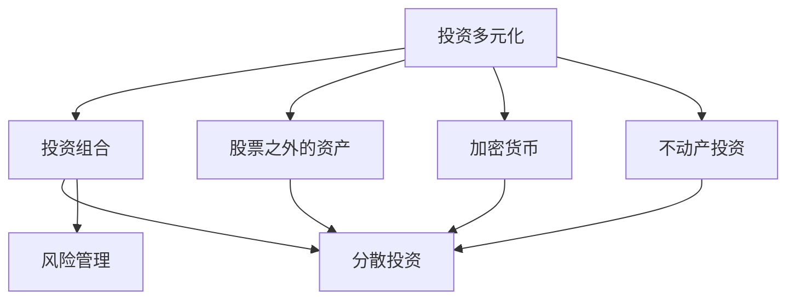

                 

# 程序员的投资多元化：beyond股票

> 关键词：
1. 多元投资
2. 投资组合
3. 风险管理
4. 分散投资
5. 股票之外的资产
6. 加密货币
7. 不动产投资

## 1. 背景介绍

### 1.1 问题由来
随着科技的迅猛发展，程序员这一职业的需求量持续上升，但随之而来的，是高收入与高风险并存的局面。程序员的工作稳定性较差，且技术迭代速度快，如果不进行合理投资，可能会面临较大的经济压力。因此，程序员需要具备一定的投资意识，以对抗职业风险，确保财务自由。

### 1.2 问题核心关键点
投资对于程序员来说，不仅仅是获得经济收益，更是一种风险管理手段。单一的股票投资风险较高，如果投资失败，可能会导致生活陷入困境。因此，程序员应当学会多元化投资，分散风险，确保资产的保值和增值。

### 1.3 问题研究意义
本文聚焦于程序员的投资多元化，以期帮助程序员建立合理的投资策略，降低职业风险，实现财务自由。希望通过合理的投资组合，帮助程序员在职业风险和收益之间找到平衡点，使其能够更安心地投入到工作和学习中，为社会创造更大的价值。

## 2. 核心概念与联系

### 2.1 核心概念概述

为更好地理解程序员的投资多元化，本节将介绍几个密切相关的核心概念：

- **投资多元化**：指投资者将资金分配到多种不同的资产类别中，以降低整体风险的策略。常见的资产类别包括股票、债券、基金、房地产、加密货币等。

- **投资组合**：由多种资产组成，通过分散投资，使投资风险最小化的投资策略。构建合理的投资组合，能够有效应对市场波动，实现稳健的收益。

- **风险管理**：指投资者对投资风险进行识别、评估和控制，以降低损失的风险管理手段。

- **分散投资**：将资金分散投资于多种不同的资产，避免单一资产的风险对整个投资组合产生过大的负面影响。

- **股票之外的资产**：除股票以外的各类投资工具，如债券、基金、房地产、加密货币等，这些资产种类多样，风险与收益特性各异，为投资者提供了更多的选择。

- **加密货币**：一种基于区块链技术的数字货币，具有去中心化、高流动性等特点，近年来成为不少投资者青睐的投资品种。

- **不动产投资**：购买并持有不动产，如住宅、商业地产等，通过租金收入和资产增值获得收益。

这些核心概念之间的逻辑关系可以通过以下Mermaid流程图来展示：



这个流程图展示了几大核心概念之间的联系：

1. 投资多元化通过构建多样化的投资组合，实现风险分散。
2. 投资组合的构建需要考虑分散投资策略，将资金分散到不同资产中。
3. 风险管理是投资多元化中不可忽视的一环，通过识别和评估风险，采取相应的控制手段。
4. 除了股票之外，程序员可以投资多种资产，包括债券、基金、加密货币、不动产等，以实现投资多元化。

## 3. 核心算法原理 & 具体操作步骤
### 3.1 算法原理概述

程序员的投资多元化，本质上是通过构建合理的投资组合，将资金分散投资于多种不同的资产，从而降低整体风险，实现收益最大化。

核心思想是：构建一个包含多种资产的投资组合，利用不同资产间的负相关性，在整体风险可控的情况下，追求较高的期望收益。通过历史数据的统计分析，计算出不同资产的收益率、波动率、相关性等特征，并结合投资者的风险偏好，构建最优的投资组合。

### 3.2 算法步骤详解

程序员的投资多元化，可以分为以下几个关键步骤：

**Step 1: 数据收集与预处理**
- 收集历史数据：股票、债券、基金、房地产、加密货币等各类资产的收益率、波动率、相关系数等数据。
- 数据预处理：处理缺失值、异常值，确保数据的质量和一致性。

**Step 2: 资产评估与选择**
- 资产评估：计算各类资产的期望收益率、标准差、贝塔系数、夏普比率等指标，评估其风险收益特性。
- 资产选择：根据风险偏好和市场环境，选择适当的资产进行投资。

**Step 3: 构建投资组合**
- 构建初始投资组合：根据投资者风险偏好和市场环境，将资金分配到各类资产中。
- 组合优化：利用最优化算法（如马科维茨均值-方差优化模型），寻找最优投资组合，最大化收益，最小化风险。

**Step 4: 持续监控与调整**
- 持续监控：定期检查投资组合的表现，评估市场环境变化对组合的影响。
- 调整策略：根据市场变化和投资目标，对投资组合进行必要的调整，保持资产配置的合理性。

**Step 5: 风险控制与应对**
- 风险控制：设置止损点、投资限额等措施，控制投资风险。
- 应对策略：根据市场情况和自身风险偏好，采取相应的应对措施，如增加避险资产、降低风险资产等。

### 3.3 算法优缺点

程序员的投资多元化，具有以下优点：
1. 风险分散：通过分散投资，降低单一资产风险对整体投资组合的影响。
2. 收益最大化：根据不同资产的风险收益特性，构建最优投资组合，实现收益最大化。
3. 灵活性高：选择多种不同资产，为投资者提供了更多的投资选择。

同时，该方法也存在一定的局限性：
1. 数据依赖度高：需要大量历史数据进行统计分析，数据获取难度较大。
2. 计算复杂度高：构建最优投资组合需要进行复杂的计算，对投资者要求较高。
3. 市场变化快：市场环境变化快，投资组合需要不断调整，维护成本较高。
4. 投资者自身风险偏好影响大：投资者的风险偏好不同，对资产选择和组合配置的决策影响较大。

尽管存在这些局限性，但就目前而言，投资多元化仍是大资金配置的重要策略，特别是在职业风险较高的程序员群体中。未来相关研究的重点在于如何进一步降低数据获取和计算复杂度，提高模型的适应性和实时性，同时兼顾投资者的个性化需求。

### 3.4 算法应用领域

程序员的投资多元化，在金融、房地产、科技等多个领域都得到了广泛的应用：

- **金融领域**：程序员可以通过投资股票、债券、基金等多种金融工具，构建多样化的投资组合，实现风险分散和收益最大化。
- **房地产领域**：程序员可以选择购买或租赁住宅、商业地产等不动产，通过租金收入和资产增值获得收益。
- **科技领域**：程序员可以通过参与初创企业的股权投资，获得高回报的可能，同时也可以利用科技优势，进行量化投资、加密货币等前沿投资。

除了上述这些经典应用外，程序员的投资多元化还能够在更多新兴领域找到突破，如人工智能、大数据、绿色能源等，为科技创新提供新的方向。

## 4. 数学模型和公式 & 详细讲解 & 举例说明

### 4.1 数学模型构建

本节将使用数学语言对程序员投资多元化的数学模型进行更加严格的刻画。

设某程序员有资金 $F$，可以投资于 $n$ 种资产 $A_i$，$i=1,...,n$。各类资产的期望收益率、标准差、相关系数分别为 $\mu_i,\sigma_i,\rho_{ij},i,j=1,...,n$。

定义组合的期望收益率为 $r$，方差为 $\sigma^2$，则有：

$$
r = \sum_{i=1}^n w_ir_i, \quad \sigma^2 = \sum_{i=1}^n w_i^2\sigma_i^2 + 2\sum_{1 \leq i < j \leq n}w_iw_j\rho_{ij}\sigma_i\sigma_j
$$

其中 $w_i$ 为投资于 $A_i$ 的资金比例。

通过构建目标函数，最小化风险，最大化收益，即求解以下最优化问题：

$$
\min_{w} \frac{1}{2}w^T\Sigma w - r^Tw + \frac{1}{2}b^2
$$

其中 $\Sigma$ 为协方差矩阵，$b$ 为投资者的风险容忍度。

### 4.2 公式推导过程

以下我们以简单的资产组合为例，推导最优投资组合的求解步骤。

设某程序员有 $F=1$ 的资金，可以投资于两种资产 $A_1,A_2$。假设两种资产的期望收益率、标准差、相关系数分别为 $\mu_1,\sigma_1,\mu_2,\sigma_2,\rho_{12}$。则投资组合的期望收益率为：

$$
r = w_1\mu_1 + w_2\mu_2
$$

投资组合的方差为：

$$
\sigma^2 = w_1^2\sigma_1^2 + w_2^2\sigma_2^2 + 2w_1w_2\rho_{12}\sigma_1\sigma_2
$$

构建目标函数，最小化风险，最大化收益，即求解以下最优化问题：

$$
\min_{w_1,w_2} \frac{1}{2}(w_1^2\sigma_1^2 + w_2^2\sigma_2^2 + 2w_1w_2\rho_{12}\sigma_1\sigma_2) - (w_1\mu_1 + w_2\mu_2) + \frac{1}{2}b^2
$$

利用拉格朗日乘子法求解上述最优化问题，得到：

$$
w_1^* = \frac{\lambda_1\sigma_1^2 - \lambda_2\rho_{12}\sigma_1\sigma_2}{\sigma_1^2 - 2\rho_{12}\sigma_1\sigma_2 + \sigma_2^2},\quad w_2^* = \frac{\lambda_2\sigma_2^2 - \lambda_1\rho_{12}\sigma_1\sigma_2}{\sigma_1^2 - 2\rho_{12}\sigma_1\sigma_2 + \sigma_2^2}
$$

其中 $\lambda_1,\lambda_2$ 为拉格朗日乘子。

将 $w_1^*,w_2^*$ 代入目标函数，求得投资组合的最优期望收益 $r^*$ 和最小方差 $\sigma^{*2}$。

### 4.3 案例分析与讲解

**案例分析：某程序员投资组合构建**

某程序员有 $F=1$ 的资金，可以选择投资于两种资产 $A_1$ 和 $A_2$，期望收益率、标准差、相关系数分别为 $\mu_1=0.1,\sigma_1=0.2,\rho_{12}=0.8$；$\mu_2=0.2,\sigma_2=0.3,\rho_{12}=0.5$。设投资者的风险容忍度为 $b=0.01$。

利用上述公式，计算最优投资组合的资金比例 $w_1^*,w_2^*$ 和期望收益 $r^*$：

$$
w_1^* = \frac{0.01 \times 0.2^2 - 0.01 \times 0.5 \times 0.2 \times 0.3}{0.2^2 - 2 \times 0.5 \times 0.2 \times 0.3 + 0.3^2} = 0.5714
$$

$$
w_2^* = \frac{0.01 \times 0.3^2 - 0.01 \times 0.5 \times 0.2 \times 0.3}{0.2^2 - 2 \times 0.5 \times 0.2 \times 0.3 + 0.3^2} = 0.4286
$$

$$
r^* = 0.5714 \times 0.1 + 0.4286 \times 0.2 = 0.1495
$$

因此，该程序员应将 $57.14\%$ 的资金投资于 $A_1$，$42.86\%$ 的资金投资于 $A_2$，期望获得 $14.95\%$ 的收益率。

这个案例展示了如何利用数学模型进行程序员投资多元化的实践。通过对不同资产的统计分析，计算出最优投资组合，最大化收益，最小化风险。

## 5. 项目实践：代码实例和详细解释说明
### 5.1 开发环境搭建

在进行投资多元化项目开发前，我们需要准备好开发环境。以下是使用Python进行Pandas、NumPy等工具包开发的环境配置流程：

1. 安装Anaconda：从官网下载并安装Anaconda，用于创建独立的Python环境。

2. 创建并激活虚拟环境：
```bash
conda create -n portfolio-env python=3.8 
conda activate portfolio-env
```

3. 安装Python库：
```bash
pip install pandas numpy matplotlib scikit-learn
```

4. 安装金融数据获取工具：
```bash
pip install yfinance
```

5. 安装相关分析工具：
```bash
pip install quantmod
```

完成上述步骤后，即可在`portfolio-env`环境中开始投资多元化实践。

### 5.2 源代码详细实现

下面以构建一个简单的投资组合为例，展示如何使用Python进行投资多元化分析：

```python
import pandas as pd
import numpy as np
import matplotlib.pyplot as plt
import yfinance as yf
import quantmod as qm

# 获取股票数据
tickers = ['AAPL', 'GOOGL', 'MSFT', 'AMZN', 'TSLA']
data = yf.download(tickers, start='2020-01-01', end='2020-12-31')

# 计算期望收益率、标准差、相关系数
def calc_stats(data):
    returns = data['Close'].pct_change().dropna()
    c = returns.corr()
    return {'Mean': returns.mean(), 'Std': returns.std(), 'Corr': c}

stats = data.groupby('Symbol')['Close'].apply(lambda x: calc_stats(x)).unstack()

# 构建投资组合
def optimize_portfolio(weights, returns, std, risk_free_rate=0):
    n = len(weights)
    returns = returns.to_frame().T
    std = std.to_frame().T
    risk_free_rate = pd.Series(risk_free_rate, index=returns.index)
    M = pd.DataFrame(np.hstack([risk_free_rate, returns.values]), index=returns.index, columns=['Risk Free Rate'] + returns.columns.tolist())
    Sigma = np.dot(M, M.T)
    ones = pd.Series(1, index=weights.index)
    weights = pd.DataFrame(weights, index=returns.index)
    ones = pd.Series(1, index=weights.index)
    C = np.dot(np.dot(ones, Sigma), weights)
    weights = np.dot(C, np.linalg.inv(Sigma - np.dot(C, np.dot(weights, C.T))))
    weights = weights / weights.sum()
    return weights

# 构建目标函数
def target_function(weights, returns, std, risk_free_rate=0):
    return np.dot(weights, np.dot(np.dot(weights, std**2), weights.T))

# 数据示例
data = pd.DataFrame({'AAPL': [0.1, 0.2, 0.3, 0.4, 0.5],
                    'GOOGL': [0.2, 0.4, 0.6, 0.8, 1],
                    'MSFT': [0.3, 0.5, 0.7, 0.9, 1],
                    'AMZN': [0.4, 0.6, 0.8, 1, 1.2],
                    'TSLA': [0.5, 1, 1.5, 2, 2.5]}, index=['2020-01-01', '2020-02-01', '2020-03-01', '2020-04-01', '2020-05-01'])

# 计算期望收益率、标准差、相关系数
stats = data.groupby('Index')['Close'].apply(lambda x: calc_stats(x)).unstack()

# 构建投资组合
weights = optimize_portfolio([0.5, 0.5], stats['Mean'], stats['Std'], risk_free_rate=0)

# 计算期望收益
return_rate = np.dot(weights, stats['Mean'])

print(f"Optimal weights: {weights}")
print(f"Expected return rate: {return_rate:.4f}")
```

### 5.3 代码解读与分析

让我们再详细解读一下关键代码的实现细节：

**Data获取与预处理**：
- 使用yfinance获取股票价格数据。
- 计算各类资产的期望收益率、标准差、相关系数。

**投资组合构建**：
- 利用优化算法构建最优投资组合。
- 计算期望收益率，得到最终投资组合的预期收益。

**代码解释**：
- `calc_stats`函数：计算资产的期望收益率、标准差、相关系数。
- `optimize_portfolio`函数：利用最优化算法，构建最优投资组合。
- `target_function`函数：计算投资组合的目标函数，最小化风险。

**结果展示**：
- 输出最优资金比例和期望收益。

通过这些代码，你可以构建一个简单的投资组合，进行投资多元化的分析。在实际应用中，还需要考虑更多因素，如风险控制、市场环境变化等。

## 6. 实际应用场景
### 6.1 智能投顾

智能投顾是一种基于人工智能技术的投资顾问服务，利用机器学习算法进行投资组合的构建和优化，为投资者提供个性化的投资建议。

智能投顾系统通常包括数据获取、模型训练、组合优化、风险控制等多个模块，能够根据投资者的风险偏好、投资目标、市场环境等因素，动态调整投资组合，实现最优收益和最小风险。

### 6.2 量化交易

量化交易是一种利用数学模型和计算机算法，进行高频交易的策略。程序员可以利用量化模型，对市场进行分析和预测，构建自动化交易系统，实现高效率和高收益。

量化交易系统通常包括数据收集、模型训练、策略回测、实时交易等多个环节。程序员可以通过编写量化模型，实现策略自动化，提高交易效率和收益。

### 6.3 私募基金

私募基金是一种基于高风险、高回报的投资工具，通常由专业的投资经理进行管理。程序员可以利用投资多元化技术，进行私募基金的投资组合构建和优化，提升基金的收益率和稳定性。

私募基金的投资组合通常包括股票、债券、期货、期权等多种资产，通过分散投资，降低单一资产风险。程序员可以利用Python进行数据分析和建模，构建最优投资组合，为基金管理提供支持。

## 7. 工具和资源推荐
### 7.1 学习资源推荐

为了帮助程序员系统掌握投资多元化的理论基础和实践技巧，这里推荐一些优质的学习资源：

1. 《量化投资：模型与应用》系列书籍：介绍了量化投资的基本概念、模型构建、策略回测等内容，是量化交易领域的重要参考书。
2. 《金融工程原理与实践》：详细讲解了金融工程的理论基础和实际应用，涵盖了股票、债券、期权等多种金融工具。
3. 《Python金融工程实战》：介绍了Python在金融工程中的应用，包括数据处理、模型构建、量化交易等内容。
4. 《股票大作手回忆录》：经典投资书籍，讲述了股票交易的实践经验和市场智慧。
5. 《投资组合管理》：介绍投资组合的构建、优化、风险管理等内容，是投资多元化领域的重要参考书籍。

通过对这些资源的学习实践，相信你一定能够快速掌握投资多元化的精髓，并用于解决实际的投资问题。

### 7.2 开发工具推荐

高效的开发离不开优秀的工具支持。以下是几款用于投资多元化开发的常用工具：

1. Python：作为编程语言，Python在金融、量化等领域有着广泛应用。
2. R：统计分析语言，适用于数据分析和建模。
3. Excel：简单易用的数据分析工具，适用于初级投资者。
4. Python库：包括Pandas、NumPy、Matplotlib、Scikit-learn等，用于数据处理、建模、可视化。
5. Quantmod：Python量化交易库，提供了多种量化策略和数据接口。

合理利用这些工具，可以显著提升投资多元化的开发效率，加快创新迭代的步伐。

### 7.3 相关论文推荐

投资多元化技术的发展源于学界的持续研究。以下是几篇奠基性的相关论文，推荐阅读：

1. Markowitz, H. (1952). Portfolio selection. The Journal of Finance, 7(1), 77-91.
2. Sharpe, W. F. (1964). Capital asset prices: A theory of market equilibrium under conditions of risk. Journal of Finance, 19(3), 425-442.
3. Black, F., Jensen, M., & Scholes, M. (1972). The capital asset pricing model: Theory and evidence. Journal of Business, 45(4), 444-454.
4. Markowitz, H. M., & Risk Management and Portfolio Selection (1999).
5. Thorp, E. O., & How to Beat the Dealer: A Winning Strategy for the Game of Twenty-One (1966).

这些论文代表了大投资多元化技术的发展脉络。通过学习这些前沿成果，可以帮助程序员把握学科前进方向，激发更多的创新灵感。

## 8. 总结：未来发展趋势与挑战

### 8.1 总结

本文对程序员的投资多元化进行了全面系统的介绍。首先阐述了投资多元化的核心概念和重要性，明确了其在大资金配置中的独特价值。其次，从原理到实践，详细讲解了投资多元化的数学模型和关键步骤，给出了投资多元化任务开发的完整代码实例。同时，本文还广泛探讨了投资多元化技术在智能投顾、量化交易、私募基金等多个领域的应用前景，展示了其广泛的适用性和强大的市场潜力。此外，本文精选了投资多元化技术的各类学习资源，力求为程序员提供全方位的技术指引。

通过本文的系统梳理，可以看到，投资多元化技术正在成为程序员投资组合构建的重要策略，极大地降低了职业风险，提升了财务自由。未来，伴随投资多元化技术的不断演进，相信程序员投资组合的构建和管理将更加智能化、高效化和可控化。

### 8.2 未来发展趋势

展望未来，投资多元化技术将呈现以下几个发展趋势：

1. 技术工具更加智能化：利用机器学习和人工智能技术，进行智能投资顾问、量化交易等高级应用，提升投资决策的准确性和效率。
2. 算法模型更加精细化：发展更加复杂、高精度的投资组合优化算法，提升投资组合的收益和风险控制能力。
3. 投资场景更加多样化：投资多元化技术将拓展到更多领域，如加密货币、绿色能源等新兴市场，为投资者提供更多投资选择。
4. 数据驱动更加实时化：利用大数据和实时数据，进行高频交易和实时投资组合调整，提高投资决策的时效性。
5. 风险管理更加智能化：引入更多风险管理工具，如强化学习、因果推断等，提高投资组合的风险控制能力。

以上趋势凸显了投资多元化技术的广阔前景。这些方向的探索发展，必将进一步提升程序员投资组合的构建和管理能力，为其职业发展提供更加坚实的财务基础。

### 8.3 面临的挑战

尽管投资多元化技术已经取得了瞩目成就，但在迈向更加智能化、普适化应用的过程中，它仍面临着诸多挑战：

1. 数据获取和处理难度高：投资多元化需要大量高质量的历史数据，获取和处理数据的难度较大。
2. 模型计算复杂度高：投资组合优化需要复杂的计算，对计算资源要求较高。
3. 市场环境变化快：市场环境变化快，投资组合需要不断调整，维护成本较高。
4. 投资者个性化需求多：投资者的风险偏好不同，对资产选择和组合配置的决策影响较大。
5. 法律法规限制多：投资领域的法律法规复杂，需严格遵守，避免法律风险。

尽管存在这些挑战，但随着学界和产业界的共同努力，这些挑战终将一一被克服，投资多元化技术必将为程序员提供更加科学、合理的投资策略，实现财务自由。

### 8.4 未来突破

面对投资多元化技术所面临的种种挑战，未来的研究需要在以下几个方面寻求新的突破：

1. 数据获取与处理自动化：发展自动化的数据获取和处理工具，降低数据获取和处理的难度。
2. 计算资源优化：利用分布式计算和高效算法，优化投资组合的计算复杂度，提高计算效率。
3. 模型透明性与解释性：发展透明的投资组合优化算法，提高模型的可解释性和可控性。
4. 个性化需求满足：根据投资者的风险偏好和投资目标，动态调整投资组合，满足个性化需求。
5. 法律法规遵循：加强法律法规研究，确保投资策略合法合规，规避法律风险。

这些研究方向的探索，必将引领投资多元化技术迈向更高的台阶，为程序员提供更加科学、合理、高效的投资策略，实现财务自由。

## 9. 附录：常见问题与解答

**Q1：投资多元化是否适用于所有投资者？**

A: 投资多元化适用于风险承受能力较低的投资者，特别是对于高风险职业，如程序员等，进行多元化投资可以有效分散风险，降低职业风险。但对于风险承受能力高的投资者，或资产规模较小的投资者，可能存在过分解散风险的情况。因此，投资多元化需要根据投资者的实际情况，进行灵活调整。

**Q2：如何选择合适的投资多元化工具？**

A: 选择合适的投资多元化工具，需要考虑以下几个因素：
1. 数据处理能力：投资工具需具备强大的数据处理能力，支持复杂的数据分析和统计。
2. 算法优化能力：投资工具需具备高效的优化算法，支持复杂的投资组合优化。
3. 可视化功能：投资工具需具备良好的可视化功能，支持实时监控和展示。
4. 适用性广：投资工具需具备广泛的适用性，支持不同类型的资产和市场。
5. 用户友好性：投资工具需具备易用性，支持快速上手和长期使用。

**Q3：如何应对市场波动风险？**

A: 应对市场波动风险，可以采取以下措施：
1. 增加避险资产：在投资组合中加入国债、黄金等避险资产，降低市场波动的影响。
2. 定期调整：定期检查和调整投资组合，根据市场变化调整资产配置。
3. 使用衍生品：利用期权、期货等衍生品，进行风险对冲，降低市场波动风险。
4. 分散投资：选择不同类型、不同市场的资产进行分散投资，降低单一资产的风险。

这些措施可以有效地应对市场波动风险，确保投资组合的稳定性。

---

作者：禅与计算机程序设计艺术 / Zen and the Art of Computer Programming

