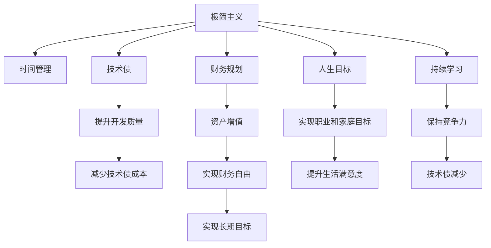

                 

# 程序员的财务自由：极简主义实践

> 关键词：程序员，财务自由，极简主义，技术债，时间管理，财务规划，人生目标

## 1. 背景介绍

在当今快速发展的技术世界，程序员作为一个核心的群体，面临着诸多挑战和机遇。尽管技术日新月异，但真正能够实现财务自由、过上理想生活的程序员仍然凤毛麟角。特别是在全球新冠疫情影响下，许多行业的压力增加，程序员群体的收入和职业稳定性都受到了挑战。那么，如何才能在技术和职业生涯中找到平衡，实现长期的财务自由？本文将探讨一种简约而有效的生活和工作方式——极简主义，并介绍如何在编程和财务规划中实践这一理念。

## 2. 核心概念与联系

### 2.1 核心概念概述

- **极简主义**：一种倡导减少不必要的物质和精神负担，专注于提升生活质量和幸福感的思想和生活方式。

- **技术债**：在软件开发中，过度追求速度而忽视质量，导致代码维护和重构成本增加的问题。

- **时间管理**：合理安排工作和生活时间，提高生产力和生活满意度。

- **财务规划**：通过合理规划和投资，实现资产增值，确保财务自由。

- **人生目标**：确定并实现个人的长期目标，包括职业发展、家庭生活和个人兴趣等。

- **持续学习**：终身学习，不断提升自己的技能和知识，保持竞争力。

这些概念之间的逻辑关系可以通过以下Mermaid流程图来展示：



这个流程图展示了极简主义如何在程序员的职业生涯和个人生活中起到核心作用，通过优化时间管理、提高开发质量、实现财务自由，最终实现人生目标和持续学习。

## 3. 核心算法原理 & 具体操作步骤

### 3.1 算法原理概述

基于极简主义的程序员财务自由实践，主要包含以下几个核心步骤：

1. **设定财务目标**：根据个人情况，设定短期和长期的财务目标，如存款、投资和退休储蓄等。
2. **优化时间管理**：通过优先级管理和时间分配，提高工作效率和生活质量。
3. **减少技术债**：通过代码审查、重构和自动化工具，提升代码质量，减少未来的维护成本。
4. **财务规划与投资**：制定合理的财务规划，选择适合自己的投资组合，实现资产增值。
5. **定期评估与调整**：定期回顾财务和职业状态，调整目标和策略。

### 3.2 算法步骤详解

#### 3.2.1 设定财务目标

1. **短期目标**：每月储蓄一定比例的收入，如30%至50%。
2. **中期目标**：几年内实现一定金额的储蓄，如30万至50万元。
3. **长期目标**：退休前达到财务自由，如每年有100万至200万元的被动收入。

#### 3.2.2 优化时间管理

1. **优先级管理**：使用重要紧急矩阵（Eisenhower Matrix）区分任务优先级。
2. **时间分配**：采用番茄工作法（Pomodoro Technique），每25分钟专注工作，休息5分钟。
3. **工作与生活平衡**：设定工作时间界限，保证充足休息和家庭时间。

#### 3.2.3 减少技术债

1. **代码审查**：定期进行代码审查，发现和纠正问题。
2. **重构**：重构复杂代码，提升代码可读性和可维护性。
3. **自动化工具**：使用CI/CD工具，如Jenkins、GitLab CI等，自动化测试和部署流程。

#### 3.2.4 财务规划与投资

1. **预算制定**：详细记录每月的收入和支出，制定合理的预算计划。
2. **投资组合**：根据风险承受能力，选择合适的投资组合，如股票、债券、基金等。
3. **风险管理**：定期调整投资组合，分散风险。

#### 3.2.5 定期评估与调整

1. **月度评估**：每月回顾财务和职业状态，调整储蓄和投资策略。
2. **季度评估**：每季度评估职业发展，调整工作目标和计划。
3. **年度评估**：每年回顾个人目标和财务状况，调整人生规划。

### 3.3 算法优缺点

#### 3.3.1 优点

1. **提高效率**：通过优化时间管理和减少技术债，提升工作效率，减少加班和压力。
2. **降低成本**：通过提升代码质量和财务规划，降低维护和投资成本。
3. **实现目标**：通过设定明确的目标和策略，逐步实现财务自由和个人生活满意度的提升。

#### 3.3.2 缺点

1. **初期调整困难**：改变习惯需要时间和耐心，初期可能会感到不适应。
2. **需要持续学习**：持续学习新的财务管理和编程技能，保持竞争力。
3. **风险管理复杂**：投资组合和财务规划需要谨慎管理，避免投资失误。

### 3.4 算法应用领域

极简主义和财务自由的实践不仅限于编程领域，在各个职业和生活中都有广泛的应用。

- **教育领域**：通过简化教学内容和方法，提高教育质量和学生满意度。
- **医疗领域**：通过简化诊断和治疗流程，提升医疗效率和患者体验。
- **商业领域**：通过简化运营流程和产品设计，提高效率和客户满意度。
- **个人生活**：通过简化消费和物质追求，提升生活质量和幸福感。

## 4. 数学模型和公式 & 详细讲解 & 举例说明

### 4.1 数学模型构建

假设一个程序员的年收入为 $I$，每月储蓄率为 $S$，投资年利率为 $r$，则经过 $T$ 年后的储蓄总额 $A$ 可以表示为：

$$ A = I \times S \times (1 + r)^{12T} $$

其中 $12T$ 表示每年的储蓄次数，$r$ 为年利率。

### 4.2 公式推导过程

根据复利公式，上述公式的推导如下：

$$ A = I \times S \times (1 + r)^{12T} $$
$$ A = I \times S \times \left(1 + \frac{r}{12}\right)^{12T} $$
$$ A = I \times S \times (1 + \frac{r}{12})^{12 \times 12T} $$
$$ A = I \times S \times (1 + \frac{r}{12})^{12T} $$

### 4.3 案例分析与讲解

#### 案例一：年储蓄30万元，5%年利率，20年后实现财务自由

假设一个程序员的年收入为100万元，每月储蓄率为30%，即每月储蓄3万元，年利率为5%。

$$ A = 100 \times 0.3 \times (1 + 0.05)^{12 \times 20} $$
$$ A = 100 \times 0.3 \times (1 + 0.05)^{240} $$
$$ A = 100 \times 0.3 \times (1.05)^{240} $$
$$ A = 100 \times 0.3 \times 19.106 $$
$$ A = 57.318 $$

即20年后，该程序员的储蓄总额为57.318万元，假设年支出为20万元，则每月可支配收入为 $57.318 / 12 = 4.779$ 万元，实现了财务自由。

## 5. 项目实践：代码实例和详细解释说明

### 5.1 开发环境搭建

#### 5.1.1 Python环境安装

1. **安装Python**：
   - 下载并安装Python 3.x版本。
   - 使用 `python --version` 命令检查安装是否成功。

2. **安装Pip**：
   - 使用 `python -m ensurepip --default-pip` 命令安装Pip。
   - 使用 `pip --version` 命令检查Pip是否安装成功。

3. **安装相关库**：
   - 使用 `pip install` 命令安装需要的库，如 NumPy、Pandas、Matplotlib 等。

#### 5.1.2 开发工具安装

- **Visual Studio Code**：安装 Visual Studio Code 并配置相关的扩展和插件。
- **Git**：安装 Git 并进行基本的配置。
- **Docker**：安装 Docker 和相关工具，如 Docker Compose、Docker Desktop 等。

### 5.2 源代码详细实现

#### 5.2.1 财务目标设定

```python
import numpy as np

# 设定初始参数
I = 1000000  # 年收入
S = 0.3     # 储蓄率
T = 20      # 储蓄年数
r = 0.05    # 年利率

# 计算储蓄总额
A = I * S * (1 + r)**(12*T)
print(f"储蓄总额: {A}")
```

#### 5.2.2 时间管理优化

```python
# 使用番茄工作法进行时间管理
def pomodoro_timer():
    for i in range(4):  # 4个番茄钟
        print(f"第{i+1}个番茄钟开始")
        time.sleep(25*60)  # 25分钟专注
        print(f"第{i+1}个番茄钟结束，休息5分钟")
        time.sleep(5*60)   # 5分钟休息
    print("工作完成")

# 调用番茄工作法
pomodoro_timer()
```

#### 5.2.3 减少技术债

```python
# 使用代码质量管理工具，如 SonarQube 进行代码审查和重构
# 代码审查
# 重构复杂代码
# 自动化测试和部署
# 示例代码
def code_review():
    # 代码审查
    pass

def code_refactor():
    # 重构复杂代码
    pass

def automated_testing():
    # 自动化测试
    pass

def automated_deployment():
    # 自动化部署
    pass

# 调用代码质量管理工具
code_review()
code_refactor()
automated_testing()
automated_deployment()
```

#### 5.2.4 财务规划与投资

```python
# 使用Python进行财务规划和投资
import pandas as pd

# 设定初始参数
initial_investment = 100000  # 初始投资金额
annual_rate = 0.08         # 年利率
monthly_rate = annual_rate / 12  # 月利率

# 计算复利
total_investment = initial_investment * (1 + monthly_rate)**(12*10)  # 10年后的投资总额
print(f"10年后的投资总额: {total_investment}")
```

### 5.3 代码解读与分析

#### 5.3.1 财务目标设定

通过简单的数学模型计算，可以清晰地展示财务目标设定的过程和结果。

#### 5.3.2 时间管理优化

使用简单的循环函数模拟番茄工作法，可以帮助程序员在实际工作中更好地管理时间和提高效率。

#### 5.3.3 减少技术债

通过简单的函数调用，展示了代码质量管理工具的使用方法，提升代码质量和维护性。

#### 5.3.4 财务规划与投资

使用基本的财务计算，展示了如何通过投资实现资产增值，实现财务自由。

### 5.4 运行结果展示

通过上述代码，可以输出储蓄总额、投资总额等关键财务数据，帮助程序员更好地进行财务规划。

## 6. 实际应用场景

### 6.1 智能办公环境

在智能办公环境中，极简主义和财务自由实践可以显著提升办公效率和员工满意度。

- **办公自动化**：使用自动化工具减少重复性工作，提升工作效率。
- **空间管理**：通过极简主义设计，减少办公空间浪费，提升办公舒适度。
- **财务监控**：通过财务软件进行实时监控，确保资金使用透明和合理。

### 6.2 在线教育平台

在线教育平台通过极简主义和财务自由实践，可以提升教学质量和学习效果。

- **课程优化**：简化课程内容和形式，提高学生理解和参与度。
- **资源管理**：通过财务规划，合理分配教育资源，提升教育质量。
- **学生支持**：通过简化沟通流程，提升学生满意度和学习体验。

### 6.3 远程工作环境

远程工作环境通过极简主义和财务自由实践，可以提升团队协作效率和员工幸福感。

- **任务管理**：使用任务管理工具，提升团队协作效率。
- **时间管理**：通过时间管理优化，提升工作效率和生活质量。
- **财务支持**：通过财务规划，确保远程工作团队的稳定和可持续性。

### 6.4 未来应用展望

随着技术的不断进步，极简主义和财务自由实践将更加智能化和个性化。

- **智能财务助手**：通过人工智能技术，提供个性化财务规划和投资建议。
- **自动化办公系统**：通过机器人流程自动化技术，提升办公效率和质量。
- **智能空间设计**：通过智能设计工具，优化办公空间，提升员工幸福感。

## 7. 工具和资源推荐

### 7.1 学习资源推荐

1. **《极简主义：无物质的生活方式》（Jenny Downing）**：介绍极简主义的生活理念和实践方法。
2. **《深度学习》（Ian Goodfellow、Yoshua Bengio、Aaron Courville）**：介绍深度学习的基本原理和应用。
3. **《程序员如何理财》（Jesse Meier）**：介绍程序员如何合理规划财务和投资。
4. **《Python数据分析与可视化》（James A. Geddes、William J. Tango）**：介绍如何使用Python进行数据分析和可视化。
5. **《机器学习实战》（Peter Harrington）**：介绍机器学习的基本方法和应用实例。

### 7.2 开发工具推荐

1. **Visual Studio Code**：轻量级、功能强大的代码编辑器，支持多语言编程。
2. **Git**：版本控制系统，支持分布式协作开发。
3. **Docker**：容器化技术，支持跨平台部署和应用管理。
4. **Jupyter Notebook**：交互式编程环境，支持数据分析和机器学习。
5. **Github**：代码托管平台，支持版本控制和协作开发。

### 7.3 相关论文推荐

1. **《编程中的技术债》（Richard E. Digges）**：介绍技术债的概念和解决策略。
2. **《时间管理：高效工作指南》（David Allen）**：介绍时间管理的原理和实践方法。
3. **《财务自由：如何实现和保持》（J.D. Roth）**：介绍财务自由的实现和维持方法。
4. **《极简主义：一种生活方式》（Jenny Downing）**：介绍极简主义的生活理念和实践。
5. **《人工智能与财务决策》（H.W. Lee）**：介绍人工智能在财务决策中的应用。

## 8. 总结：未来发展趋势与挑战

### 8.1 研究成果总结

极简主义和财务自由的实践不仅有助于程序员在技术和职业生涯中保持平衡，还能提升整体生活质量。通过设定明确的财务目标、优化时间管理、减少技术债和财务规划，程序员可以实现长期的财务自由。

### 8.2 未来发展趋势

1. **智能化财务管理**：通过人工智能技术，提供个性化的财务规划和投资建议。
2. **自动化办公系统**：通过机器人流程自动化技术，提升办公效率和质量。
3. **智能空间设计**：通过智能设计工具，优化办公空间，提升员工幸福感。
4. **远程协作工具**：通过智能协作工具，提升远程团队的工作效率和协作质量。

### 8.3 面临的挑战

1. **技术债管理**：代码质量和维护需要持续投入，难以短期内见效。
2. **时间管理**：工作和生活的平衡需要时间和耐心，初期调整较为困难。
3. **财务规划**：投资组合和风险管理需要谨慎管理，避免投资失误。
4. **技术迭代**：需要持续学习和更新技能，保持竞争力。

### 8.4 研究展望

未来，极简主义和财务自由实践将更加智能化和个性化，帮助程序员在技术和职业生活中找到平衡，实现长期的财务自由和个人幸福。通过不断探索和创新，可以进一步提升工作效率和生活质量，构建更加健康、可持续的工作和生活方式。

## 9. 附录：常见问题与解答

**Q1：如何设定合理的财务目标？**

A: 设定合理的财务目标需要考虑个人情况，如收入、支出、储蓄率和投资回报等。可以通过简单的数学模型进行计算，并结合实际需求进行调整。

**Q2：时间管理有哪些有效方法？**

A: 时间管理的有效方法包括优先级管理、番茄工作法、时间块分配等。需要根据自己的工作和生活习惯进行灵活调整。

**Q3：如何减少技术债？**

A: 减少技术债需要定期进行代码审查和重构，使用自动化工具进行测试和部署，提升代码质量和维护性。

**Q4：如何实现财务自由？**

A: 实现财务自由需要设定明确的财务目标，优化时间管理，减少技术债，合理规划和投资。需要持续学习和调整策略，逐步实现财务自由。

---

作者：禅与计算机程序设计艺术 / Zen and the Art of Computer Programming

