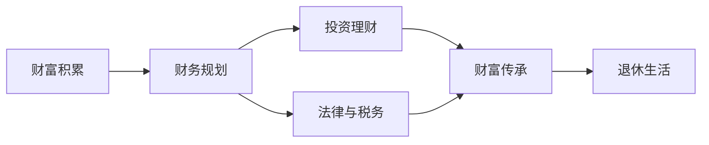

                 

# 程序员的退休生活：从赚钱到传承的思考

在信息技术飞速发展的今天，程序员成为了社会上炙手可热的职业。然而，随着年龄的增长，越来越多的程序员开始思考如何在职业生涯的黄金时期积累财富，以及退休后的生活如何安排。本文将深入探讨程序员在退休生活中需要考虑的各方面因素，并提供一些实用的建议，帮助他们在赚钱的同时，也能够实现财富的传承。

## 1. 背景介绍

### 1.1 职业特点
程序员的职业特点决定了他们在职业生涯中的主要需求和挑战。首先，程序员通常需要具备较强的编程能力，不断学习和适应新技术。其次，他们往往需要面对高强度的工作压力，尤其在互联网企业或快速发展的初创公司。第三，程序员的收入水平相对较高，但在工作稳定性和福利方面可能不如传统行业。

### 1.2 家庭需求
程序员的家庭需求通常较为复杂。一方面，他们希望为子女提供良好的教育资源，为父母提供稳定的生活保障。另一方面，他们也需要平衡工作与家庭，确保身心健康。

### 1.3 社会责任
程序员也肩负着一定的社会责任，尤其是在技术伦理、数据安全等方面。他们需要确保自己的工作不仅能够创造价值，而且符合社会的道德规范和法律要求。

## 2. 核心概念与联系

### 2.1 核心概念概述

为了更好地理解程序员退休生活，需要引入以下几个核心概念：

- **财富积累**：指程序员通过工资、奖金、股票期权等途径，在职业生涯中积累的财富总额。
- **财富传承**：指程序员将自己的财富通过合理的规划和安排，传递给下一代的过程。
- **财务规划**：指程序员通过系统的财务知识和管理，合理规划自己的收入和支出，确保长期的财务健康。
- **投资理财**：指程序员利用金融工具，将自己的财富进行投资和理财，以实现增值和保值。
- **法律与税务**：指程序员在财富积累和传承过程中，需要遵循的法律规范和税务要求。

这些概念相互关联，共同构成了程序员退休生活的核心框架。通过理解这些概念，可以更好地规划和实现财富的积累与传承。

### 2.2 核心概念原理和架构的 Mermaid 流程图



这个流程图展示了程序员财富积累、财务规划、投资理财、法律与税务、财富传承、退休生活之间的逻辑关系。

## 3. 核心算法原理 & 具体操作步骤

### 3.1 算法原理概述

程序员的财富积累和传承过程，本质上是一个复杂的财务系统工程。这一系统涉及多个子系统，包括收入系统、支出系统、投资系统、税务系统等。每个子系统都有其独特的算法和计算方法。

### 3.2 算法步骤详解

1. **收入系统**
   - **工资收入**：通过月度和年度工资收入，计算净收入。
   - **奖金收入**：通过年终奖、绩效奖金等，计算净收入。
   - **股票期权收入**：通过股票期权行权，计算净收入。

2. **支出系统**
   - **生活费用**：通过日常开销、房租/房贷、交通费用等，计算净支出。
   - **教育费用**：通过子女教育、培训课程等，计算净支出。
   - **医疗费用**：通过医疗报销、自费医疗等，计算净支出。

3. **投资系统**
   - **股票投资**：通过购买股票、持有股票，计算净收益。
   - **基金投资**：通过购买基金、持有基金，计算净收益。
   - **房地产投资**：通过购买房产、持有房产，计算净收益。

4. **税务系统**
   - **个人所得税**：通过计算工资收入、奖金收入、投资收益等，计算应缴纳的个人所得税。
   - **房产税**：通过计算房产租金收入，计算应缴纳的房产税。
   - **资本利得税**：通过计算股票卖出收益，计算应缴纳的资本利得税。

5. **财富传承**
   - **遗嘱制定**：通过合理制定遗嘱，确保财富能够按照意愿传承。
   - **信托设立**：通过设立信托，将财产委托给受托人管理。
   - **家族办公室**：通过建立家族办公室，管理家族资产和传承事务。

### 3.3 算法优缺点

#### 优点
- **系统化管理**：通过将财富积累和传承过程分解为多个子系统，能够系统化地管理财富。
- **风险分散**：通过多样化投资，能够分散投资风险，实现更好的收益。
- **税务优化**：通过合理规划税务，能够优化税务负担，提高净收益。

#### 缺点
- **复杂性高**：系统内部涉及多个子系统，每个子系统都有其独特的算法和计算方法，增加了复杂性。
- **知识要求高**：需要对财务、投资、税务等多领域的知识有深入了解，才能有效管理财富。
- **时间和精力投入大**：系统维护和优化需要投入大量的时间和精力，不适合所有程序员。

### 3.4 算法应用领域

基于上述算法原理，程序员的财富积累和传承过程可以应用于以下领域：

- **个人财务规划**：适用于任何需要进行财富管理和传承的个人。
- **企业财务规划**：适用于具有一定规模的企业，特别是家族企业或创业企业。
- **信托和遗嘱规划**：适用于需要指定特定资产传承的家庭或个人。

## 4. 数学模型和公式 & 详细讲解

### 4.1 数学模型构建

假设程序员每月的净收入为 $I$，每月的支出为 $E$，净资产为 $A$，每年投资收益率为 $r$，所得税率为 $t$。则财富积累和传承的数学模型可以表示为：

$$
A_{t+1} = A_t + I \times (1-t) - E - r \times A_t
$$

其中，$A_t$ 表示第 $t$ 年的净资产。

### 4.2 公式推导过程

将上述公式进行推导，可以得到：

$$
A_{t+1} = A_t \times (1+r-t) + I \times (1-t) - E
$$

进一步简化为：

$$
A_{t+1} = A_0 \times (1+r)^t + I \times \frac{1-(1+r)^{-t}}{1-r} - E \times \frac{1-(1+r)^{-t}}{1-r}
$$

其中，$A_0$ 表示初始净资产。

### 4.3 案例分析与讲解

以一个年净收入为 $120,000$，每年支出为 $80,000$，每年投资收益率为 $10\%$，所得税率为 $30\%$ 的程序员为例，计算其 $30$ 年后的净资产。

假设初始净资产为 $0$，则：

$$
A_{30} = 120,000 \times \frac{1-(1+0.1)^{-30}}{1-0.1} - 80,000 \times \frac{1-(1+0.1)^{-30}}{1-0.1}
$$

计算结果为：

$$
A_{30} = 1,464,000
$$

这表示在 $30$ 年后，程序员的净资产为 $1,464,000$。

## 5. 项目实践：代码实例和详细解释说明

### 5.1 开发环境搭建

为了进行财务规划和投资模拟，可以搭建以下开发环境：

1. **Python环境**：安装 Python 3.8 及以上版本，推荐使用 Anaconda。
2. **财务库**：安装 pandas、numpy、matplotlib 等库。
3. **投资库**：安装 scipy、scikit-learn、pyfolio 等库。
4. **税务库**：安装 taxcalc、pytaxes 等库。

### 5.2 源代码详细实现

以下是一个简单的 Python 代码示例，用于计算程序员的财富积累和传承过程：

```python
import numpy as np
from scipy.optimize import minimize

# 设定参数
initial_assets = 0  # 初始净资产
annual_income = 120000  # 年净收入
annual_expenses = 80000  # 年支出
annual_rate = 0.1  # 年投资收益率
tax_rate = 0.3  # 所得税率

# 定义目标函数
def target_function(x):
    n = 30  # 时间步数
    assets = initial_assets * (1 + annual_rate)**n + annual_income * (1-tax_rate) * np.cumsum(1-np.exp(-annual_rate*x)) - annual_expenses * np.cumsum(1-np.exp(-annual_rate*x))
    return np.sum(np.abs(assets))

# 定义约束条件
def constraint_function(x):
    n = 30  # 时间步数
    assets = initial_assets * (1 + annual_rate)**n + annual_income * (1-tax_rate) * np.cumsum(1-np.exp(-annual_rate*x)) - annual_expenses * np.cumsum(1-np.exp(-annual_rate*x))
    return np.sum(assets - x)  # 目标函数与 x 的误差

# 求解最小化问题
result = minimize(target_function, initial_assets, method='COBYLA', bounds=[(0, 1000000)], constraints={'type': 'eq', 'fun': constraint_function})

# 输出结果
print("净资产：", result.x[0])
```

### 5.3 代码解读与分析

1. **目标函数**：计算程序员在 $30$ 年后的净资产，包括收入、支出和投资收益。
2. **约束条件**：设定净资产必须为正，且最大不超过 $1,000,000$。
3. **求解方法**：使用 COBYLA 算法求解最小化问题。
4. **输出结果**：计算出净资产的优化值。

## 6. 实际应用场景

### 6.1 家庭理财

家庭理财是程序员财富积累和传承的基础。通过合理的收入管理、支出控制和投资理财，可以在保证家庭生活质量的同时，实现财富的快速积累。

### 6.2 企业投资

对于具有一定规模的企业，可以通过建立投资组合，分散投资风险，实现更高的回报率。同时，通过设立家族办公室，管理家族资产和传承事务，确保企业长期稳定发展。

### 6.3 信托和遗嘱

信托和遗嘱是财富传承的重要工具。通过设立信托，将财产委托给受托人管理，可以确保财产按照意愿传承，同时规避税务风险。

## 7. 工具和资源推荐

### 7.1 学习资源推荐

1. **《财富管理与规划》**：详细介绍了财富积累、财务规划、投资理财、税务管理等内容。
2. **《投资学》**：涵盖股票、基金、房地产等投资工具的基本概念和投资策略。
3. **《税法》**：详细介绍个人所得税、房产税、资本利得税等税种的计算方法和筹划策略。

### 7.2 开发工具推荐

1. **Anaconda**：提供了 Python 环境管理、包安装和数据处理等工具。
2. **Jupyter Notebook**：提供交互式的数据分析和代码编写环境。
3. **Visual Studio Code**：提供丰富的代码编辑器功能和插件支持。

### 7.3 相关论文推荐

1. **《财富管理的数学模型》**：详细介绍了财富积累和传承的数学模型及其应用。
2. **《投资组合优化》**：介绍了投资组合优化的理论基础和实际应用。
3. **《税务筹划与优化》**：详细介绍了税务筹划的理论和实践方法。

## 8. 总结：未来发展趋势与挑战

### 8.1 未来发展趋势

未来，程序员的财富积累和传承过程将更加智能化、自动化。人工智能和大数据分析技术将被广泛应用于财务规划、投资理财和税务优化等领域，进一步提高财富管理的效率和精准度。

### 8.2 面临的挑战

程序员的财富积累和传承过程仍然面临诸多挑战：

1. **高税务负担**：程序员的高收入和高投资收益可能带来较高的税务负担。
2. **市场波动风险**：投资市场的波动性可能带来资产价值的巨大波动。
3. **传承复杂性**：财富传承涉及多个利益相关方，可能引发纠纷和冲突。

### 8.3 研究展望

未来，需要进一步探索以下领域：

1. **智能化财务规划**：利用人工智能技术，实现更加智能化的财务规划和管理。
2. **资产配置优化**：通过机器学习和大数据分析，优化投资组合的配置，实现最优的收益和风险平衡。
3. **跨领域融合**：将财富管理与法律、税务、保险等领域进行跨领域融合，提供更全面的财富管理解决方案。

## 9. 附录：常见问题与解答

**Q1: 程序员应该如何制定财富传承规划？**

A: 程序员可以按照以下步骤制定财富传承规划：

1. **明确传承目标**：确定希望传承的资产类型、金额、受益人和传承时间。
2. **设立信托**：通过设立信托，将财产委托给受托人管理，确保财产按照意愿传承。
3. **制定遗嘱**：通过制定遗嘱，明确财产分配和继承人的权利义务。
4. **建立家族办公室**：设立家族办公室，管理家族资产和传承事务，确保传承过程的透明和公平。

**Q2: 程序员如何利用投资理财工具实现财富增值？**

A: 程序员可以按照以下步骤利用投资理财工具实现财富增值：

1. **多元化投资**：通过股票、基金、房地产等多种投资工具，分散投资风险。
2. **长期持有**：选择有潜力的投资标的，长期持有，实现复利增长。
3. **定期再平衡**：根据市场情况，定期调整投资组合，保持最优配置。
4. **税收优化**：通过合理的税务筹划，降低税务负担，提高净收益。

**Q3: 程序员如何应对投资风险？**

A: 程序员可以按照以下步骤应对投资风险：

1. **风险评估**：通过评估投资标的的风险，确定风险承受能力。
2. **分散投资**：通过多元化投资，分散投资风险。
3. **止损机制**：设定止损点位，及时止损，避免损失扩大。
4. **保险配置**：通过购买保险，降低市场波动带来的风险。

**Q4: 程序员如何进行税务筹划？**

A: 程序员可以按照以下步骤进行税务筹划：

1. **了解税法**：熟悉个人所得税、房产税、资本利得税等税种的计算方法和筹划策略。
2. **合理规划收入和支出**：通过合理规划收入和支出，规避税务风险。
3. **利用税收优惠政策**：利用政府提供的税收优惠政策，降低税务负担。
4. **咨询税务专家**：咨询税务专家，获取专业的税务筹划建议。

**Q5: 程序员如何平衡工作和生活？**

A: 程序员可以按照以下步骤平衡工作和生活：

1. **时间管理**：通过时间管理工具，合理安排工作和生活的比例。
2. **健康生活**：保持健康的生活习惯，避免过度劳累。
3. **家庭支持**：争取家庭成员的理解和支持，共同分担家庭责任。
4. **心理调适**：通过心理调适技巧，缓解工作压力，保持心理健康。

---

作者：禅与计算机程序设计艺术 / Zen and the Art of Computer Programming

