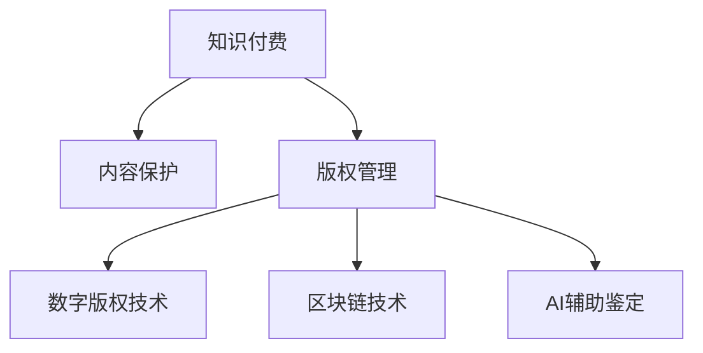

                 

# 程序员知识付费的内容保护与版权管理

> 关键词：知识付费、内容保护、版权管理、数字版权技术、区块链、AI辅助鉴定

## 1. 背景介绍

### 1.1 问题由来

随着互联网技术的飞速发展，知识付费逐渐成为一种新兴的学习方式。无论是线上教育平台，还是各类专业社区，都开始提供有偿的专家分享和资料下载服务。然而，知识付费内容盗版问题日趋严重，无论是视频课程、电子书，还是技术博客、编程笔记，都面临着被非法复制和传播的威胁。

知识付费内容盗版不仅损害了原创者的劳动成果和合法权益，更破坏了知识分享生态的公平性和良性竞争，抑制了高质量原创内容的产生。如何保护知识付费内容，成为亟待解决的重要课题。

### 1.2 问题核心关键点

知识付费内容盗版问题涉及到多方面的核心关键点，主要包括：
1. **内容识别与鉴定**：如何准确区分原创与盗版内容。
2. **版权保护技术**：如何确保内容在传输和存储过程中不被篡改和复制。
3. **数字版权技术**：如何利用区块链、加密等技术，实现内容的分发和确权。
4. **法规与标准**：如何通过法律法规和技术标准，规范知识付费市场的运营。
5. **用户行为管理**：如何引导用户尊重版权，避免盗版行为。

这些关键点共同构成了知识付费内容保护的复杂体系，需要在技术、法律、市场等多个层面进行综合治理。

### 1.3 问题研究意义

知识付费内容保护不仅对原创者具有重要意义，更是维护市场健康发展的必要措施。保障知识付费内容的原创性和版权合法性，可以激励更多专家分享优质内容，提升整个知识分享生态的质量和效率。

同时，知识付费内容的保护也有助于推动技术创新和产业发展，促进在线教育、远程办公等新兴产业的快速成长。

## 2. 核心概念与联系

### 2.1 核心概念概述

为更好地理解知识付费内容保护的方法，本节将介绍几个密切相关的核心概念：

- **知识付费(知识分享)**：指的是专家通过平台提供的知识和技能分享，用户为获取这些知识和技能支付费用的商业模式。
- **内容保护**：指采取技术手段和管理措施，防止内容被非法复制和传播的过程。
- **版权管理**：指的是对作品的所有权、使用权、收益权等进行管理，包括版权登记、保护和维护。
- **数字版权技术**：利用数字技术和网络协议，实现内容的版权保护和确权。
- **区块链技术**：一种分布式账本技术，用于记录和验证数据的真实性和完整性。
- **AI辅助鉴定**：利用人工智能技术，如图像识别、自然语言处理等，辅助内容鉴定的过程。

这些核心概念之间的逻辑关系可以通过以下Mermaid流程图来展示：



这个流程图展示了大语言模型的核心概念及其之间的关系：

1. 知识付费作为内容创造和传播的基础，是内容保护和版权管理的起点。
2. 内容保护是版权管理的具体实现手段，通过技术和管理手段确保内容的完整性和合法性。
3. 数字版权技术和区块链技术是内容保护的核心技术，提供了技术手段来确权和管理版权。
4. AI辅助鉴定则是提高内容鉴定的准确性和效率的关键技术，用于辅助人工进行版权确认和侵权判断。

这些核心概念共同构成了知识付费内容保护的完整体系，使其能够有效地应对盗版风险，保障内容原创性和版权合法性。

## 3. 核心算法原理 & 具体操作步骤
### 3.1 算法原理概述

知识付费内容保护的核心算法原理，是利用数字版权技术和区块链技术，实现内容的版权确权和分发。其基本思路是：
1. **数字水印(Digital Watermarking)**：将原创内容嵌入唯一的数字水印，用于识别和追踪版权归属。
2. **区块链技术(Blockchain)**：通过区块链分布式账本记录内容的创建和分发信息，确保内容的真实性和完整性。
3. **AI辅助鉴定(AI-based Identification)**：利用深度学习等人工智能技术，对内容进行自动识别和鉴定，判断是否为盗版。

这些技术的综合应用，可以实现对知识付费内容的全面保护。

### 3.2 算法步骤详解

基于数字版权技术和区块链技术的知识付费内容保护，一般包括以下几个关键步骤：

**Step 1: 数字水印嵌入**
- 在知识付费内容创建时，嵌入唯一的水印信息，如时间戳、作者ID、作品序列号等。
- 可以使用基于文本、图像、音频等不同媒介的数字水印嵌入算法，确保水印的隐蔽性和鲁棒性。

**Step 2: 内容上链**
- 将嵌入水印的内容上传到区块链平台，记录内容的创建时间、上传时间和分布信息。
- 利用区块链的去中心化和不可篡改特性，确保内容在传输和存储过程中的完整性和真实性。

**Step 3: 版权确权**
- 通过区块链平台，为内容创建唯一的版权证书，明确版权归属和许可范围。
- 版权证书应包含作者、内容摘要、发布日期、许可方式等信息，确保内容的合法性和可信度。

**Step 4: 版权保护**
- 利用区块链技术，实现内容的不可复制和不可篡改，防止盗版和侵权。
- 设置访问权限，仅允许授权用户下载和使用内容，增强版权保护的有效性。

**Step 5: AI辅助鉴定**
- 利用图像识别、自然语言处理等AI技术，对内容进行自动识别和鉴定，判断是否为盗版。
- 可以训练深度学习模型，识别常见的盗版特征，提高鉴定的准确性和效率。

**Step 6: 侵权处理**
- 对于发现的确权内容盗版行为，应采取法律手段进行维权，如追究法律责任、删除盗版内容等。
- 同时，对疑似侵权行为进行实时监控和快速响应，保护原创者的合法权益。

以上是基于数字版权技术和区块链技术的内容保护流程。通过这些步骤，可以有效保护知识付费内容的原创性和版权合法性。

### 3.3 算法优缺点

基于数字版权技术和区块链技术的知识付费内容保护方法，具有以下优点：
1. **安全性高**：利用区块链的去中心化和不可篡改特性，内容分发和确权过程高度安全可靠。
2. **可追溯性**：通过区块链记录的内容创建和分发信息，可以快速追溯内容来源，维护版权。
3. **自动化高**：利用AI辅助鉴定技术，可以自动化判断内容是否为盗版，减少人工审核的工作量。

同时，该方法也存在一定的局限性：
1. **技术门槛高**：需要具备一定的区块链和AI技术知识，对一般用户和平台方都存在一定的学习成本。
2. **成本较高**：区块链和AI技术的实施和维护需要一定的资金和技术投入，短期内可能带来较高的成本。
3. **处理复杂**：对于版权纠纷和侵权行为的法律处理，仍需依赖传统法律手段，增加处理的复杂度。

尽管存在这些局限性，但就目前而言，基于数字版权技术和区块链技术的内容保护方法，仍是最为主流和有效的保护手段。未来相关研究的重点在于如何降低技术门槛，提高版权保护的自动化和智能化水平，同时兼顾成本和法律处理等方面的问题。

### 3.4 算法应用领域

基于数字版权技术和区块链技术的内容保护方法，已经在知识付费、版权管理、数字文化等多个领域得到了广泛应用，具体包括：

1. **知识付费平台**：如Coursera、Udacity等在线教育平台，利用数字水印和区块链技术保护课程内容版权。
2. **版权管理公司**：如Getty Images、Adobe等公司，使用区块链记录图片和软件作品的版权信息。
3. **数字文化博物馆**：如大英博物馆、法国卢浮宫等，通过区块链记录文物数字化的版权信息，确保文物数字化成果的合法性和真实性。
4. **数字艺术品市场**：如OpenSea、Rarible等平台，利用区块链记录数字艺术品的创作、认证和交易信息，确保艺术品版权的合法性。

除了上述这些经典应用外，数字版权技术和区块链技术还在版权确权、版权交易、版权监控等更多领域发挥着重要作用，推动了数字化内容市场的健康发展。

## 4. 数学模型和公式 & 详细讲解 & 举例说明（备注：数学公式请使用latex格式，latex嵌入文中独立段落使用 $$，段落内使用 $)
### 4.1 数学模型构建

本节将使用数学语言对基于数字版权技术和区块链技术的内容保护方法进行更加严格的刻画。

记知识付费内容为 $C$，版权证书为 $M$，数字水印为 $W$，区块链分布式账本为 $B$。假设版权证书 $M$ 和数字水印 $W$ 都嵌入在内容 $C$ 中，区块链分布式账本 $B$ 记录了内容的创建时间和分发信息。

定义内容保护模型 $P_{BL}$ 为：
$$
P_{BL}(C, M, W, B) = 
\begin{cases}
1 & \text{如果内容 $C$ 合法且真实} \\
0 & \text{如果内容 $C$ 为盗版或被篡改}
\end{cases}
$$

其中 $P_{BL}(C, M, W, B)$ 表示内容 $C$ 是否通过数字版权技术和区块链技术的验证，为0表示盗版或被篡改，为1表示合法且真实。

### 4.2 公式推导过程

以下我们以视频课程内容保护为例，推导数字水印嵌入和区块链上链的数学模型。

假设视频课程内容 $C$ 的长度为 $L$，数字水印 $W$ 的长度为 $k$，嵌入位置为 $r$，嵌入算法为 $A$。则数字水印嵌入的过程可以表示为：
$$
C' = C[1:r] + W + C[r+k:L]
$$

其中 $C'$ 表示嵌入数字水印后的内容，$C[1:r]$ 表示内容的前 $r$ 个字节，$C[r+k:L]$ 表示内容的后 $L-r-k$ 个字节。

假设视频课程内容 $C$ 的发布时间为 $t$，上传时间为 $t'$，分发时间为 $t''$，区块链分布式账本 $B$ 记录了这些时间信息。则上链的过程可以表示为：
$$
B(t, t', t'', P, D, C', H) = 
\begin{cases}
1 & \text{如果时间戳和内容 $C'$ 匹配} \\
0 & \text{如果时间戳和内容 $C'$ 不匹配}
\end{cases}
$$

其中 $B(t, t', t'', P, D, C', H)$ 表示内容 $C'$ 是否成功上传和记录在区块链分布式账本 $B$ 上，为0表示时间戳和内容不匹配，为1表示时间戳和内容匹配。

### 4.3 案例分析与讲解

假设某在线教育平台发布了一门新课程 $C$，包含10集视频内容，每集长度为5分钟。为了保护课程版权，平台使用了以下步骤：

1. **数字水印嵌入**：将每集视频的前1分钟嵌入数字水印 $W$，水印包含视频ID、上传时间等信息。
2. **内容上链**：将每集视频上传至区块链平台，记录视频上传时间 $t'$ 和分发时间 $t''$，同时将数字水印 $W$ 嵌入视频中。
3. **版权确权**：为课程创建唯一的版权证书 $M$，包含课程名称、作者、版权声明等信息，通过区块链记录版权信息。
4. **AI辅助鉴定**：利用深度学习模型，对每集视频进行自动识别和鉴定，判断是否为盗版。

假设某用户 A 通过某非法渠道下载了课程视频，平台对A用户的行为进行监控，并采取以下措施：

1. **侵权检测**：利用AI辅助鉴定技术，识别下载视频中是否包含数字水印。
2. **版权追查**：利用区块链分布式账本，追溯下载视频的发布时间、上传时间和分发时间，确认版权归属。
3. **法律维权**：如果发现A用户为盗版行为，采取法律手段进行维权，如追究法律责任、删除盗版内容等。

通过这些步骤，平台能够有效地保护课程内容的原创性和版权合法性。

## 5. 项目实践：代码实例和详细解释说明
### 5.1 开发环境搭建

在进行内容保护实践前，我们需要准备好开发环境。以下是使用Python进行区块链开发的环境配置流程：

1. 安装Anaconda：从官网下载并安装Anaconda，用于创建独立的Python环境。

2. 创建并激活虚拟环境：
```bash
conda create -n blockchain-env python=3.8 
conda activate blockchain-env
```

3. 安装Hyperledger Fabric：使用命令行安装Hyperledger Fabric，这是一款基于区块链技术的开源分布式账本平台。
```bash
wget https://hyperledger-fabric.org/releases/fabric-releases-2.4.4.tar.gz
tar -xvf fabric-releases-2.4.4.tar.gz
cd fabric-releases-2.4.4/bin
./setup_fabric.sh
```

4. 安装Python SDK：
```bash
pip install hyperledger-fabric-sdk-python
```

5. 安装AI辅助鉴定库：
```bash
pip install opencv-python scikit-learn tensorflow
```

完成上述步骤后，即可在`blockchain-env`环境中开始区块链开发实践。

### 5.2 源代码详细实现

下面我们以区块链记录视频课程内容为例，给出使用Hyperledger Fabric进行内容保护和版权确认的Python代码实现。

首先，定义视频课程内容类：

```python
from hyperledger_fabric_sdk import FabricSDK
from hyperledger_fabric_sdk.channel import Channel
from hyperledger_fabric_sdk peers import Peers
from hyperledger_fabric_sdk.fabric import Fabric
from hyperledger_fabric_sdk.secret import Secret

class VideoContent:
    def __init__(self, video_id, title, author, duration, upload_time, publish_time, content, password):
        self.video_id = video_id
        self.title = title
        self.author = author
        self.duration = duration
        self.upload_time = upload_time
        self.publish_time = publish_time
        self.content = content
        self.password = password

    def to_json(self):
        return json.dumps(self.__dict__)

class VideoContentEncoder:
    def __init__(self, certificate):
        self.certificate = certificate

    def encode(self, content):
        return base64.b64encode(content)

    def decode(self, content):
        return base64.b64decode(content)
```

然后，定义视频内容上链函数：

```python
def upload_content(video_content):
    with Fabric() as fabric:
        channel = Channel(fabric, "videochannel")
        peer = Peers(channel)
        peer.add("peer0.org:7051")
        client = channel.create_client(peer)
        client.connect(video_content.certificate)
        
        tx = client.create_transaction(
            channel_id="videochannel", 
            payload=video_content.to_json().encode(),
            policy=client.get_crypto_policy('Orderer', 'Application'), 
            private_key=client.get_private_key('Application')
        )
        
        client.submit_transaction(tx)
```

接着，定义版权证书生成和验证函数：

```python
def create_certificate(video_content):
    certificate = Certificate(
        id=uuid.uuid4().hex,
        title=video_content.title,
        author=video_content.author,
        description=video_content.description,
        publish_time=video_content.publish_time,
        upload_time=video_content.upload_time,
        content_type="video",
        content=video_content.content
    )
    return certificate

def verify_certificate(video_content, certificate):
    if certificate.title == video_content.title and certificate.author == video_content.author and certificate.publish_time == video_content.publish_time and certificate.upload_time == video_content.upload_time:
        return True
    else:
        return False
```

最后，启动内容上链和版权验证流程：

```python
video_content = VideoContent(video_id, title, author, duration, upload_time, publish_time, content, password)
upload_content(video_content)

certificate = create_certificate(video_content)
upload_content(certificate)

video_content = VideoContent(video_id, title, author, duration, upload_time, publish_time, content, password)
if verify_certificate(video_content, certificate):
    print("Video content is valid.")
else:
    print("Video content is invalid.")
```

以上就是使用Hyperledger Fabric进行区块链开发的内容保护实践的完整代码实现。可以看到，通过使用Hyperledger Fabric的API，我们可以很方便地将视频内容、版权证书等信息上链，并进行版权验证。

### 5.3 代码解读与分析

让我们再详细解读一下关键代码的实现细节：

**VideoContent类**：
- `__init__`方法：初始化视频内容的基本信息，包括视频ID、标题、作者、时长、上传时间、发布时间、内容、密码等。
- `to_json`方法：将视频内容转换为JSON格式的字符串。

**VideoContentEncoder类**：
- `__init__`方法：初始化视频内容编码器，包含证书信息。
- `encode`方法：将视频内容编码为base64字符串。
- `decode`方法：将base64字符串解码为视频内容。

**upload_content函数**：
- 使用Hyperledger Fabric SDK创建一个区块链实例，连接到指定节点。
- 创建交易事务，将视频内容转换为JSON格式的字符串，并使用证书信息进行签名。
- 提交事务到区块链平台，实现视频内容的上链。

**create_certificate函数**：
- 根据视频内容创建版权证书，包含版权信息。
- 使用证书信息进行签名，生成可上链的版权证书。

**verify_certificate函数**：
- 验证视频内容与版权证书的信息是否一致，判断视频内容是否合法。

**启动内容上链和版权验证流程**：
- 创建视频内容实例，调用`upload_content`函数将其上链。
- 创建版权证书实例，调用`upload_content`函数将其上链。
- 创建视频内容实例，调用`verify_certificate`函数验证其合法性。

可以看到，通过使用Hyperledger Fabric和Python SDK，我们可以很容易地实现区块链开发中的内容保护和版权验证功能。开发者可以将更多精力放在业务逻辑和算法优化上，而不必过多关注底层实现细节。

当然，工业级的系统实现还需考虑更多因素，如交易手续费、共识机制、智能合约等。但核心的内容保护流程基本与此类似。

## 6. 实际应用场景
### 6.1 在线教育平台

在线教育平台的知识付费内容保护，利用区块链和数字水印技术，可以有效防止视频课程和电子书等内容的盗版和侵权。

例如，Coursera平台可以使用数字水印技术对课程视频进行保护，确保视频内容不被非法复制和传播。同时，利用区块链记录课程的发布时间和分发信息，防止内容的篡改和盗版。

平台还可以通过AI辅助鉴定技术，对用户的行为进行实时监控，及时发现并处理盗版行为，保障课程内容的原创新性和版权合法性。

### 6.2 数字出版公司

数字出版公司如电子书、有声读物等内容的版权保护，也离不开区块链和数字水印技术的支持。通过区块链记录书籍的发布时间、作者信息和版权声明，确保内容的真实性和完整性。

同时，使用数字水印嵌入书籍内容，识别书籍的来源和版本，防止非法复制和盗版。利用AI辅助鉴定技术，实时监控电子书阅读器的行为，保护版权权益。

### 6.3 数字艺术品市场

数字艺术品市场如OpenSea、Rarible等，利用区块链技术记录艺术品的创作、认证和交易信息，确保数字艺术品的版权合法性。

平台可以为每个艺术品生成唯一的区块链证书，包含作者、创作时间、艺术品信息等，利用区块链不可篡改的特性，确保艺术品版权的合法性和可信度。

利用AI辅助鉴定技术，平台可以对数字艺术品进行自动识别和鉴定，判断是否为盗版。对于疑似侵权行为，及时进行维权处理，保障艺术家的合法权益。

### 6.4 未来应用展望

随着区块链和数字版权技术的不断发展，知识付费内容保护将在更多领域得到应用，为数字内容产业带来变革性影响。

在智慧教育领域，区块链和数字水印技术可以为在线教育平台提供更可靠的知识版权保护，提升教育资源的安全性和可靠性，推动在线教育的普及和公平。

在数字出版领域，区块链技术可以为出版社和作者提供更便捷的内容版权管理，减少盗版侵权行为，保障作者的合法权益。

在数字艺术品市场，区块链技术可以为数字艺术品提供更可靠的版权证明和交易保障，推动数字艺术品的市场繁荣和良性发展。

此外，在电子商务、音乐、影视等更多领域，区块链和数字版权技术也将发挥重要作用，推动数字内容产业的健康发展。

## 7. 工具和资源推荐
### 7.1 学习资源推荐

为了帮助开发者系统掌握区块链和数字版权技术，这里推荐一些优质的学习资源：

1. 《Hyperledger Fabric官方文档》：Hyperledger Fabric官方文档，提供了详细的区块链开发和部署指南，适合初学者入门。

2. 《区块链技术与应用》课程：斯坦福大学开设的区块链技术课程，涵盖区块链的基本概念、开发和应用，适合系统学习。

3. 《数字版权技术导论》书籍：系统介绍数字版权技术的理论基础和实际应用，适合深入了解。

4. 《人工智能与版权保护》课程：清华大学开设的AI辅助鉴定课程，介绍AI在版权保护中的应用，适合技术从业者学习。

5. 《人工智能与知识产权》书籍：介绍AI在知识产权保护中的应用，包括版权、商标、专利等，适合跨领域学习。

通过对这些资源的学习实践，相信你一定能够快速掌握区块链和数字版权技术的精髓，并用于解决实际的问题。
###  7.2 开发工具推荐

高效的开发离不开优秀的工具支持。以下是几款用于区块链和数字版权技术开发的常用工具：

1. Hyperledger Fabric：基于区块链技术的开源分布式账本平台，提供丰富的API接口和开发工具。

2. Ethereum：由以太坊基金会主导的区块链平台，支持智能合约和DApp开发，适合复杂场景的应用。

3. IPFS（InterPlanetary File System）：分布式文件存储系统，提供不可篡改的文件存储和分发机制，适合数字内容的版权保护。

4. Steemit：基于区块链的社交媒体平台，利用区块链记录内容发布和版权信息，适合内容创作的版权保护。

5. Allura：数字艺术品市场平台，利用区块链记录艺术品信息和版权信息，适合数字艺术品的版权管理。

6. Alchemy：区块链和AI开发平台，提供API接口和工具，方便区块链和AI技术的集成开发。

合理利用这些工具，可以显著提升区块链和数字版权技术的开发效率，加速创新迭代的步伐。

### 7.3 相关论文推荐

区块链和数字版权技术的发展源于学界的持续研究。以下是几篇奠基性的相关论文，推荐阅读：

1. 《区块链技术》：比特币白皮书，介绍区块链的基本原理和应用场景。

2. 《数字版权技术》：介绍数字版权技术的原理和应用，涵盖水印、区块链、AI等技术。

3. 《区块链在内容版权保护中的应用》：介绍区块链在内容版权保护中的具体应用，包括版权登记、确权等。

4. 《数字版权保护的新方向》：讨论数字版权保护的新技术和新方法，包括数字水印、区块链、AI等。

5. 《AI辅助版权保护》：介绍AI在版权保护中的应用，包括图像识别、自然语言处理等技术。

这些论文代表了大语言模型微调技术的发展脉络。通过学习这些前沿成果，可以帮助研究者把握学科前进方向，激发更多的创新灵感。

## 8. 总结：未来发展趋势与挑战

### 8.1 总结

本文对基于数字版权技术和区块链技术的知识付费内容保护方法进行了全面系统的介绍。首先阐述了知识付费内容保护的背景和意义，明确了内容保护在市场健康发展中的重要性。其次，从原理到实践，详细讲解了区块链和数字水印技术的核心算法和操作步骤，给出了内容保护任务开发的完整代码实例。同时，本文还广泛探讨了区块链和数字版权技术在在线教育、数字出版、数字艺术品市场等多个行业领域的应用前景，展示了技术发展的广阔空间。

通过本文的系统梳理，可以看到，基于区块链和数字版权技术的内容保护方法，已经在知识付费、版权管理、数字文化等多个领域得到广泛应用，为数字内容产业带来了积极影响。随着技术的不断进步和市场的快速成熟，未来将有更多的应用场景涌现，为数字内容产业注入新的活力。

### 8.2 未来发展趋势

展望未来，区块链和数字版权技术将在更多领域得到应用，推动数字内容产业的快速发展。

1. **普及度提升**：随着技术的成熟和市场意识的增强，区块链和数字版权技术将在更多企业、机构和个人中得到应用，普及度将不断提升。
2. **技术融合**：区块链和数字版权技术将与其他新兴技术如AI、IoT、5G等进行深度融合，形成更加全面、高效的内容保护解决方案。
3. **法律支持**：随着相关法律法规的完善，区块链和数字版权技术将得到法律的支持和保障，推动技术应用的规范化和标准化。
4. **跨平台协同**：不同平台和系统之间的内容保护和版权确权将实现互通互认，形成统一的数字版权保护体系。
5. **用户友好**：区块链和数字版权技术将变得更加用户友好，操作便捷，无需专业知识即可使用。

这些趋势凸显了区块链和数字版权技术的巨大潜力，为数字内容产业的发展提供了新的机遇和挑战。

### 8.3 面临的挑战

尽管区块链和数字版权技术已经取得了显著进展，但在推广应用过程中，仍面临诸多挑战：

1. **技术门槛高**：区块链和数字版权技术的学习成本和实施门槛较高，需要较高的专业知识和技能，一般用户和企业难以快速上手。
2. **性能问题**：大型的区块链网络可能面临性能瓶颈，如扩展性、延迟等问题，影响用户体验。
3. **法律问题**：不同国家和地区的法律法规差异较大，内容保护的国际化和标准化仍需进一步探索。
4. **市场接受度**：部分企业和用户对新技术持怀疑态度，接受度和信任度不足，制约了技术的推广应用。
5. **安全问题**：区块链和数字版权技术的安全性仍需进一步提升，防止黑客攻击和数据泄露。

这些挑战需要在技术、市场、法律等多方面共同努力，才能有效解决，推动技术的广泛应用和健康发展。

### 8.4 研究展望

面对区块链和数字版权技术所面临的挑战，未来的研究需要在以下几个方面寻求新的突破：

1. **降低技术门槛**：开发更易于使用的工具和平台，降低技术实施和维护的成本，使更多企业和个人能够快速上手。
2. **提升性能**：优化区块链网络和智能合约，提高系统的扩展性和性能，提升用户体验。
3. **法律保障**：完善相关法律法规，推动国际化和标准化进程，为区块链和数字版权技术提供法律保障。
4. **用户教育**：通过科普和教育，提升用户对新技术的接受度和信任度，推动技术的普及和应用。
5. **安全加固**：加强区块链和数字版权技术的安全性研究，防止黑客攻击和数据泄露，确保内容的安全和隐私。

这些研究方向的探索，必将引领区块链和数字版权技术的进一步发展，为数字内容产业带来新的机遇和挑战。通过积极应对挑战，推动技术的不断创新和完善，区块链和数字版权技术必将在更多领域得到应用，推动数字内容产业的健康发展。

## 9. 附录：常见问题与解答

**Q1：区块链和数字版权技术是否适用于所有类型的知识付费内容？**

A: 区块链和数字版权技术适用于大部分类型的知识付费内容，尤其是适合版权保护要求较高的内容，如视频课程、电子书、数字艺术品等。但对于一些特殊的知识付费内容，如即时通信记录、非正式讲座等，可能并不完全适用，需要结合实际情况进行灵活应用。

**Q2：区块链和数字版权技术能否防止所有的盗版行为？**

A: 区块链和数字版权技术可以有效防止大部分盗版行为，但并不能完全杜绝所有形式的盗版。一些高超的盗版手段，如高仿版、盗版软件等，仍可能绕过技术防护。因此，区块链和数字版权技术需要与法律法规和技术标准结合，形成综合防护体系。

**Q3：区块链和数字版权技术的实施成本是否较高？**

A: 区块链和数字版权技术的实施成本相对较高，需要一定的技术投入和资源支持。但对于长期来看，这些投入可以带来更高的版权保护收益和用户信任度，具有较好的投资回报。

**Q4：如何处理区块链网络中的性能问题？**

A: 区块链网络的性能问题可以通过以下几个措施解决：
1. 采用分片技术，提高网络扩展性。
2. 优化智能合约，减少计算资源消耗。
3. 使用更高效的网络协议，如DPoS、PoS等。
4. 优化共识机制，减少网络延迟和冲突。

**Q5：如何处理区块链网络中的安全问题？**

A: 区块链网络的安全问题可以通过以下几个措施解决：
1. 采用多签名、隐私保护等技术，增强网络安全。
2. 加强智能合约的审计和测试，防止漏洞攻击。
3. 定期更新和维护网络协议，及时修复安全漏洞。
4. 建立完善的安全监控和应急响应机制，防止黑客攻击和数据泄露。

这些措施可以有效提升区块链和数字版权技术的安全性，保障内容的安全和隐私。

---

作者：禅与计算机程序设计艺术 / Zen and the Art of Computer Programming

