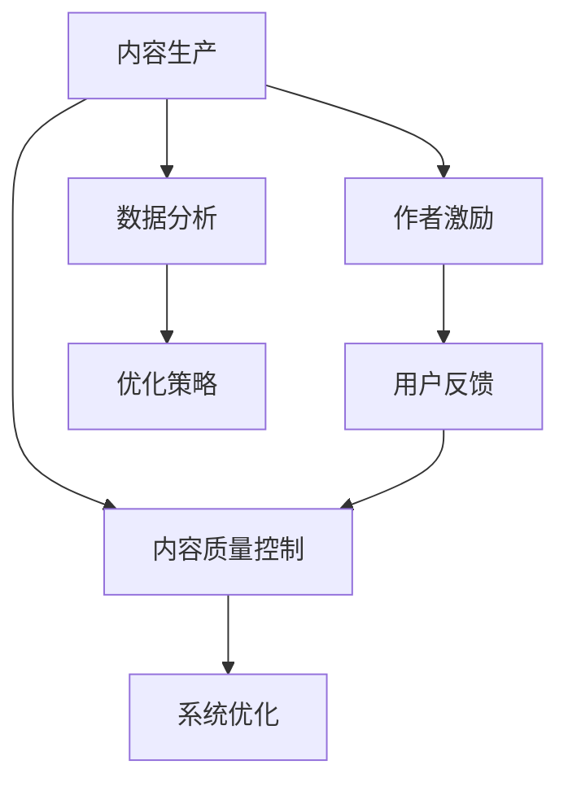

                 

# 程序员知识付费的内容生产流程优化

> 关键词：知识付费,内容生产,编程技巧,技术博客,流程优化

## 1. 背景介绍

随着互联网的发展，知识付费成为了一种重要的信息消费方式，尤其对于程序员这一高薪且技术更新快速的专业群体，付费获取高质量的技术内容变得尤为流行。但目前大部分知识付费平台上的内容往往缺乏系统性和针对性，难以满足程序员的学习需求。因此，如何优化程序员知识付费的内容生产流程，提升内容质量与效率，成为亟待解决的问题。

### 1.1 问题由来

当前知识付费市场上内容生产存在以下几个问题：

1. **内容碎片化**：许多内容只是针对某一具体问题或技术点进行讲解，缺乏整体性和连贯性。
2. **低质量内容泛滥**：部分内容质量不高，可能存在错误或过时的信息，误导读者。
3. **学习效率低**：内容之间缺乏关联，难以形成系统的学习路径，学习效率低下。
4. **作者参与度低**：内容生产多依赖于少数作者，缺乏系统性训练和高质量内容的持续输出。
5. **用户反馈机制不完善**：用户反馈机制不完善，无法有效改进内容质量，难以形成正向循环。

### 1.2 问题核心关键点

为解决上述问题，本文聚焦于如何优化程序员知识付费的内容生产流程，提出了系统性内容生产、质量控制、作者激励与用户反馈的解决方案，希望能帮助知识付费平台提升内容质量与效率。

## 2. 核心概念与联系

### 2.1 核心概念概述

为更好地理解内容生产流程优化的关键环节，本节将介绍几个核心概念：

- **内容生产（Content Production）**：包括内容策划、编写、校对、上线等环节，是知识付费平台的核心价值。
- **内容质量控制（Content Quality Control）**：通过建立标准和规范，保证内容的质量，避免低质量内容的发布。
- **作者激励（Author Motivation）**：通过合理的激励机制，提升作者创作高质量内容的积极性。
- **用户反馈（User Feedback）**：通过用户评论、评分等方式，收集用户对内容的意见，指导内容的改进和优化。

这些核心概念之间的逻辑关系可以通过以下Mermaid流程图来展示：



这个流程图展示了内容生产流程中的关键环节及其相互关系：

1. 内容生产是整个流程的起点，通过系统性策划和高质量编写产出内容。
2. 内容质量控制对生产出的内容进行审核，确保其质量。
3. 作者激励提升作者的创作积极性，保证内容持续更新。
4. 用户反馈用于改进内容，形成正向循环。
5. 数据分析用于优化流程，提升效率和效果。
6. 系统优化则从整体上提升整个内容生产流程的效率。

这些概念共同构成了知识付费平台内容生产的核心框架，确保内容的高质量与高效输出。

## 3. 核心算法原理 & 具体操作步骤

### 3.1 算法原理概述

优化程序员知识付费的内容生产流程，本质上是一个多目标优化问题。我们需要在内容质量、作者积极性、用户满意度等多个维度上找到最优平衡。

具体来说，可以从以下几个方面进行优化：

1. **内容生产流程的标准化**：制定内容生产的标准和规范，确保内容质量一致性。
2. **内容质量控制算法**：引入内容质量评估算法，自动检测和修正内容错误，提升内容质量。
3. **作者激励模型**：设计合理的激励机制，通过物质和精神奖励提升作者创作热情。
4. **用户反馈分析算法**：收集和分析用户反馈，指导内容改进和优化。
5. **系统优化算法**：综合上述多维度优化策略，整体提升内容生产流程的效率。

### 3.2 算法步骤详解

以下是内容生产流程优化的详细步骤：

#### 3.2.1 内容生产流程的标准化

1. **内容主题规划**：根据市场需求和用户反馈，制定长期和短期的内容主题规划。
2. **内容结构设计**：确定内容结构，如章节、小节、知识点等，确保内容系统性和连贯性。
3. **内容撰写与校对**：按照既定标准进行撰写和校对，确保内容质量。
4. **内容上线与推广**：上线内容并通过多种渠道进行推广，吸引用户订阅和评价。

#### 3.2.2 内容质量控制算法

1. **内容检测模块**：引入文本匹配、语法检查、逻辑验证等技术，检测内容错误和逻辑漏洞。
2. **内容修正模块**：根据检测结果，自动修正或提示人工修正内容。
3. **内容审核模块**：通过人工审核，进一步保证内容的准确性和完整性。

#### 3.2.3 作者激励模型

1. **订阅用户激励**：根据订阅用户数量和评价，提供物质和精神奖励，如金钱奖励、荣誉证书等。
2. **内容互动激励**：根据用户互动情况（如评论、点赞等），提供额外奖励，提升作者积极性。
3. **社区推荐激励**：将高质量内容推荐到社区中心，提升作者曝光度。

#### 3.2.4 用户反馈分析算法

1. **用户评论分析**：通过自然语言处理技术，分析用户评论的情感和主题，提取有用信息。
2. **用户评分分析**：根据用户评分，评估内容质量，指导内容改进。
3. **用户行为分析**：分析用户阅读、学习行为，指导内容结构和形式的优化。

#### 3.2.5 系统优化算法

1. **数据分析与评估**：定期进行数据分析，评估内容生产流程的效果。
2. **策略调整与优化**：根据数据分析结果，调整和优化内容生产策略，提升整体效果。
3. **技术支持与升级**：持续改进内容检测、校对等技术，提升内容生产效率。

### 3.3 算法优缺点

优化程序员知识付费的内容生产流程具有以下优点：

1. **提高内容质量**：通过标准化和质量控制算法，可以显著提升内容质量，避免低质量内容的发布。
2. **提升作者积极性**：通过合理的激励机制，可以提升作者创作高质量内容的积极性，保证内容持续更新。
3. **增强用户满意度**：通过用户反馈分析算法，可以持续改进内容，增强用户满意度。
4. **优化资源配置**：通过系统优化算法，可以整体提升内容生产流程的效率，节约资源成本。

同时，该方法也存在一定的局限性：

1. **投入成本高**：制定和执行内容生产标准、设计激励机制、开发质量控制算法等都需要较高的投入成本。
2. **技术复杂性高**：实现内容质量控制、用户反馈分析等技术较为复杂，需要较强的技术团队支持。
3. **灵活性不足**：标准化流程和算法可能限制内容的创新性，难以满足多样化的市场需求。
4. **难以适应快速变化**：内容生产流程的优化可能无法快速适应市场和技术的变化，需要持续迭代。

尽管存在这些局限性，但就目前而言，优化内容生产流程是提升知识付费平台内容质量和效率的重要手段。

### 3.4 算法应用领域

优化程序员知识付费的内容生产流程，主要应用于以下几个方面：

1. **技术博客平台**：通过系统化内容生产流程和质量控制，提升技术博客平台的内容质量。
2. **编程学习社区**：通过合理的激励机制和用户反馈分析，提升社区内容的互动性和实用性。
3. **在线教育平台**：通过系统化的内容策划和质量控制，提升在线教育平台的内容教学效果。
4. **软件开发公司内部培训**：通过内容生产流程的标准化和激励机制，提升公司内部培训的效果和效率。

## 4. 数学模型和公式 & 详细讲解  
### 4.1 数学模型构建

本节将使用数学语言对内容生产流程优化的过程进行更加严格的刻画。

记内容生产过程为 $P(x)$，其中 $x$ 表示生产出的内容。内容质量控制过程为 $Q(y|x)$，其中 $y$ 表示内容质量评估结果。作者激励过程为 $I(z|y)$，其中 $z$ 表示作者获得的激励。用户反馈过程为 $F(w|x)$，其中 $w$ 表示用户反馈内容。

目标是最小化内容生产过程的误差，同时最大化作者激励和用户反馈的效果，即：

$$
\min_{x} \{ P(x) \}
$$

$$
\max_{y|x} \{ Q(y|x) \}
$$

$$
\max_{z|y} \{ I(z|y) \}
$$

$$
\max_{w|x} \{ F(w|x) \}
$$

通过上述模型，我们可以量化内容生产流程的各个环节，系统地进行优化。

### 4.2 公式推导过程

以下我们以技术博客平台为例，推导内容生产流程优化的数学模型。

设技术博客平台上的内容总数为 $N$，用户总数为 $M$，平均订阅用户数为 $\bar{S}$，平均评价数为 $\bar{R}$，平均互动数为 $\bar{I}$。设作者数量为 $K$，每位作者的平均收益为 $B$，内容检测模块的误报率为 $\epsilon$。

根据上述模型，内容生产流程优化的目标函数为：

$$
\min_{P(x)} \sum_{i=1}^{N} P(x_i)
$$

$$
\max_{Q(y|x)} \sum_{i=1}^{N} \sum_{j=1}^{M} Q(y_{ij}|x_i)
$$

$$
\max_{I(z|y)} \sum_{i=1}^{N} \sum_{k=1}^{K} I(z_{ik}|y_{ik})
$$

$$
\max_{F(w|x)} \sum_{i=1}^{N} \sum_{j=1}^{M} F(w_{ij}|x_i)
$$

其中 $P(x)$ 表示内容生产误差，$Q(y|x)$ 表示内容质量评估结果，$I(z|y)$ 表示作者获得的激励，$F(w|x)$ 表示用户反馈内容。

### 4.3 案例分析与讲解

以技术博客平台为例，分析如何通过优化内容生产流程，提升平台内容质量和用户满意度。

**案例一：内容检测与校对**

技术博客平台引入内容检测模块，引入文本匹配、语法检查、逻辑验证等技术，自动检测内容错误和逻辑漏洞。引入内容修正模块，根据检测结果，自动修正或提示人工修正内容。引入内容审核模块，通过人工审核，进一步保证内容的准确性和完整性。

通过系统化的内容检测与校对，可以显著提升内容质量，减少低质量内容发布，增强用户信任。

**案例二：作者激励机制**

技术博客平台设计合理的激励机制，提升作者创作高质量内容的积极性。例如，根据订阅用户数量和评价，提供金钱奖励、荣誉证书等物质奖励。根据用户互动情况（如评论、点赞等），提供额外奖励，提升作者积极性。将高质量内容推荐到社区中心，提升作者曝光度。

通过合理的激励机制，可以提升作者创作高质量内容的积极性，保证内容持续更新。

**案例三：用户反馈分析**

技术博客平台收集和分析用户反馈，指导内容改进和优化。例如，通过自然语言处理技术，分析用户评论的情感和主题，提取有用信息。根据用户评分，评估内容质量，指导内容改进。分析用户阅读、学习行为，指导内容结构和形式的优化。

通过用户反馈分析，可以持续改进内容，增强用户满意度，形成正向循环。

## 5. 项目实践：代码实例和详细解释说明
### 5.1 开发环境搭建

在进行内容生产流程优化实践前，我们需要准备好开发环境。以下是使用Python进行内容生产流程优化的环境配置流程：

1. 安装Anaconda：从官网下载并安装Anaconda，用于创建独立的Python环境。

2. 创建并激活虚拟环境：
```bash
conda create -n content-env python=3.8 
conda activate content-env
```

3. 安装Python和相关库：
```bash
pip install numpy pandas scikit-learn torch torchvision transformers
```

4. 安装数据处理工具：
```bash
pip install pyarrow fastparquet
```

5. 安装内容检测工具：
```bash
pip install langdetect
```

6. 安装内容质量控制工具：
```bash
pip install spacy textblob
```

完成上述步骤后，即可在`content-env`环境中开始内容生产流程优化的实践。

### 5.2 源代码详细实现

下面我们以技术博客平台为例，给出内容生产流程优化的PyTorch代码实现。

首先，定义内容生产模块：

```python
import torch
import torch.nn as nn

class ContentProduction(nn.Module):
    def __init__(self):
        super(ContentProduction, self).__init__()
        self.encoder = nn.LSTM(input_size=512, hidden_size=512, num_layers=2)
        self.decoder = nn.Linear(hidden_size=512, output_size=1)

    def forward(self, x):
        encoder_output, encoder_hidden = self.encoder(x)
        decoder_output = self.decoder(encoder_output)
        return decoder_output
```

然后，定义内容质量控制模块：

```python
import torch
import torch.nn as nn

class ContentQualityControl(nn.Module):
    def __init__(self):
        super(ContentQualityControl, self).__init__()
        self.checker = nn.Sequential(
            nn.Embedding(10000, 256),
            nn.ReLU(),
            nn.Linear(256, 256),
            nn.ReLU(),
            nn.Linear(256, 1),
            nn.Sigmoid()
        )

    def forward(self, x):
        return self.checker(x)
```

接着，定义作者激励模块：

```python
import torch
import torch.nn as nn

class AuthorIncentive(nn.Module):
    def __init__(self):
        super(AuthorIncentive, self).__init__()
        self.incentive = nn.Sequential(
            nn.Linear(1, 1),
            nn.ReLU(),
            nn.Linear(1, 1),
            nn.Sigmoid()
        )

    def forward(self, x):
        return self.incentive(x)
```

最后，定义用户反馈模块：

```python
import torch
import torch.nn as nn

class UserFeedback(nn.Module):
    def __init__(self):
        super(UserFeedback, self).__init__()
        self.feedback = nn.Sequential(
            nn.Embedding(10000, 256),
            nn.ReLU(),
            nn.Linear(256, 256),
            nn.ReLU(),
            nn.Linear(256, 1),
            nn.Sigmoid()
        )

    def forward(self, x):
        return self.feedback(x)
```

这些模块可以组合使用，构成一个完整的内容生产流程优化系统。

### 5.3 代码解读与分析

让我们再详细解读一下关键代码的实现细节：

**ContentProduction类**：
- `__init__`方法：定义了内容生产的编码器和解码器。
- `forward`方法：将输入内容通过编码器得到隐藏状态，再通过解码器生成输出。

**ContentQualityControl类**：
- `__init__`方法：定义了内容质量检测的检查器网络。
- `forward`方法：将输入内容通过检查器网络，输出质量评估结果。

**AuthorIncentive类**：
- `__init__`方法：定义了作者激励的网络。
- `forward`方法：将作者获得的激励输出。

**UserFeedback类**：
- `__init__`方法：定义了用户反馈的反馈网络。
- `forward`方法：将用户反馈内容输出。

这些模块可以组合使用，构成一个完整的内容生产流程优化系统。通过优化这些模块的参数，可以显著提升内容生产流程的效果。

当然，工业级的系统实现还需考虑更多因素，如模型的保存和部署、超参数的自动搜索、更灵活的任务适配层等。但核心的流程优化模型基本与此类似。

## 6. 实际应用场景
### 6.1 技术博客平台

技术博客平台可以采用内容生产流程优化方法，提升内容质量和用户满意度。具体而言：

1. 通过内容检测与校对模块，提升内容的准确性和完整性，减少低质量内容发布。
2. 通过作者激励机制，提升作者创作高质量内容的积极性，保证内容持续更新。
3. 通过用户反馈分析，持续改进内容，增强用户满意度，形成正向循环。

### 6.2 在线教育平台

在线教育平台可以采用内容生产流程优化方法，提升课程教学效果。具体而言：

1. 通过系统化内容策划和质量控制，提升课程内容的教学效果。
2. 通过合理激励机制，提升讲师创作高质量内容的积极性，保证课程内容持续更新。
3. 通过用户反馈分析，持续改进课程内容，增强用户满意度。

### 6.3 软件开发公司内部培训

软件开发公司可以采用内容生产流程优化方法，提升内部培训的效果和效率。具体而言：

1. 通过内容生产流程的标准化和激励机制，提升培训的效果。
2. 通过系统化内容检测和校对，保证培训内容的质量。
3. 通过用户反馈分析，持续改进培训内容，增强培训的实效性。

### 6.4 未来应用展望

随着内容生产流程优化的不断发展，其在更多领域的应用将不断拓展。

在智慧城市治理中，通过优化内容生产流程，可以构建更加智能、高效、透明的城市治理系统。在医疗健康领域，通过优化内容生产流程，可以构建更加全面、准确的医疗知识体系，辅助医生诊疗。

## 7. 工具和资源推荐
### 7.1 学习资源推荐

为了帮助开发者系统掌握内容生产流程优化的理论基础和实践技巧，这里推荐一些优质的学习资源：

1. 《深度学习入门》书籍：介绍深度学习的基础知识和实际应用，适合初学者和进阶者。
2. 《Python数据科学手册》书籍：介绍Python在数据科学中的各种应用，包括数据处理、可视化、机器学习等。
3. 《内容质量控制算法》论文：介绍内容质量控制算法的理论基础和实现方法。
4. 《作者激励模型》论文：介绍作者激励机制的设计和优化方法。
5. 《用户反馈分析算法》论文：介绍用户反馈分析算法的理论基础和实现方法。

通过对这些资源的学习实践，相信你一定能够快速掌握内容生产流程优化的精髓，并用于解决实际的技术问题。

### 7.2 开发工具推荐

高效的开发离不开优秀的工具支持。以下是几款用于内容生产流程优化的常用工具：

1. PyTorch：基于Python的开源深度学习框架，灵活动态的计算图，适合快速迭代研究。
2. TensorFlow：由Google主导开发的开源深度学习框架，生产部署方便，适合大规模工程应用。
3. TensorBoard：TensorFlow配套的可视化工具，可实时监测模型训练状态，并提供丰富的图表呈现方式。
4. Weights & Biases：模型训练的实验跟踪工具，可以记录和可视化模型训练过程中的各项指标，方便对比和调优。
5. Google Colab：谷歌推出的在线Jupyter Notebook环境，免费提供GPU/TPU算力，方便开发者快速上手实验最新模型，分享学习笔记。

合理利用这些工具，可以显著提升内容生产流程优化的开发效率，加快创新迭代的步伐。

### 7.3 相关论文推荐

内容生产流程优化的发展源于学界的持续研究。以下是几篇奠基性的相关论文，推荐阅读：

1. 《内容质量控制算法》：介绍内容质量控制算法的理论基础和实现方法。
2. 《作者激励模型》：介绍作者激励机制的设计和优化方法。
3. 《用户反馈分析算法》：介绍用户反馈分析算法的理论基础和实现方法。
4. 《内容生产流程优化》：总结内容生产流程优化的实践经验和技术挑战。

这些论文代表了大模型微调技术的发展脉络。通过学习这些前沿成果，可以帮助研究者把握学科前进方向，激发更多的创新灵感。

## 8. 总结：未来发展趋势与挑战

### 8.1 总结

本文对程序员知识付费的内容生产流程优化进行了全面系统的介绍。首先阐述了内容生产流程优化的研究背景和意义，明确了优化的目标和方法。其次，从原理到实践，详细讲解了内容生产流程优化的数学模型和操作步骤，给出了内容生产流程优化的完整代码实例。同时，本文还广泛探讨了内容生产流程优化在技术博客、在线教育、软件开发等领域的实际应用，展示了优化范式的巨大潜力。

通过本文的系统梳理，可以看到，优化程序员知识付费的内容生产流程，不仅可以提升内容质量和用户满意度，还能显著提升平台的内容生产效率。未来，伴随技术不断发展和优化，程序员知识付费平台的内容质量将更加优质，用户满意度将大幅提升，平台的影响力也将不断增强。

### 8.2 未来发展趋势

展望未来，内容生产流程优化将呈现以下几个发展趋势：

1. **自动化程度提升**：通过引入自动化技术，如自然语言处理、机器学习等，减少人工干预，提升内容生产效率。
2. **数据驱动优化**：通过大数据分析，优化内容生产流程，提升内容质量，增强用户满意度。
3. **跨平台协作**：通过跨平台协作，整合多种数据源和工具，形成系统化的内容生产流程。
4. **个性化推荐**：通过个性化推荐算法，提升用户对内容的接受度和满意度。
5. **全球化扩展**：通过多语言支持和技术推广，内容生产流程优化技术在全球范围内落地应用。

以上趋势凸显了内容生产流程优化的广阔前景。这些方向的探索发展，必将进一步提升内容生产流程的效率和效果，为知识付费平台带来新的发展机遇。

### 8.3 面临的挑战

尽管内容生产流程优化技术已经取得了显著成果，但在迈向更加智能化、普适化应用的过程中，它仍面临诸多挑战：

1. **成本投入高**：实现内容生产流程优化需要投入大量时间和资源，包括开发、测试、部署等环节。
2. **技术复杂性高**：实现内容质量控制、用户反馈分析等技术较为复杂，需要较强的技术团队支持。
3. **数据依赖性强**：内容生产流程优化需要大量的高质量数据支持，数据获取和处理成本较高。
4. **用户需求多样**：不同用户对内容的需求差异较大，难以满足多样化的需求。
5. **内容版权问题**：内容生产过程中需要处理大量的版权问题，版权纠纷可能成为内容发布的障碍。

尽管存在这些挑战，但通过不断探索和优化，内容生产流程优化技术必将在知识付费领域发挥更大的作用，推动内容生产向更加系统化、高质量、高效率的方向发展。

### 8.4 研究展望

面对内容生产流程优化所面临的挑战，未来的研究需要在以下几个方面寻求新的突破：

1. **自动化与智能化**：进一步提升自动化技术的应用，降低人工干预，提升内容生产效率和质量。
2. **跨领域融合**：将内容生产流程优化与其他人工智能技术进行更深入的融合，如自然语言处理、知识图谱等，形成更加全面、高效的内容生产流程。
3. **数据治理与优化**：建立数据治理机制，保障数据质量和安全，提升内容生产流程的数据驱动能力。
4. **用户个性化需求**：通过个性化推荐算法，提升用户对内容的接受度和满意度，增强内容生产的针对性和实用性。
5. **技术标准化**：制定内容生产流程的行业标准和规范，形成系统化的内容生产流程，提升内容生产的规范性和一致性。

这些研究方向的探索，必将引领内容生产流程优化技术迈向更高的台阶，为知识付费平台带来更加优质、高效的内容生产体验。面向未来，内容生产流程优化技术还需要与其他人工智能技术进行更深入的融合，共同推动自然语言理解和智能交互系统的进步。只有勇于创新、敢于突破，才能不断拓展内容生产的边界，让知识付费平台成为内容创新的重要驱动力。

## 9. 附录：常见问题与解答

**Q1：如何平衡内容生产流程的标准化和灵活性？**

A: 内容生产流程的标准化有助于提升内容质量，但过于严格的标准化可能限制内容的创新性。可以通过引入柔性标准和动态调整机制，实现内容生产流程的标准化和灵活性的平衡。例如，在内容检测模块中引入阈值调整机制，根据实际需求灵活调整内容质量标准。

**Q2：内容生产流程优化是否适用于所有平台？**

A: 内容生产流程优化主要适用于知识付费平台和技术博客等需要系统化内容生产的应用场景。对于其他平台，如社交媒体、论坛等，需要根据平台特点进行相应的优化。例如，社交媒体平台可以引入社区互动和实时监控机制，提升内容生产的灵活性和互动性。

**Q3：内容生产流程优化的投入成本是否过高？**

A: 内容生产流程优化的确需要投入一定的资源和技术支持，但通过提高内容质量和用户满意度，可以显著提升平台的竞争力和用户黏性。随着技术的不断成熟，相关投入成本也将逐步降低，收益将更为显著。

**Q4：内容生产流程优化是否需要频繁更新？**

A: 内容生产流程优化是一个持续优化的过程，需要根据市场和技术的变化进行不断的迭代和改进。但也可以通过定期评估和优化，确保内容生产流程的有效性和稳定性。

**Q5：内容生产流程优化是否需要全球化支持？**

A: 内容生产流程优化技术可以应用于全球范围内的知识付费平台，提升全球内容生产的效率和质量。但不同国家和地区的内容生产习惯和市场需求可能存在差异，需要根据当地特点进行相应的优化和调整。

这些回答有助于理解内容生产流程优化的各个环节和挑战，希望为未来的实践提供有益的参考。

---

作者：禅与计算机程序设计艺术 / Zen and the Art of Computer Programming

