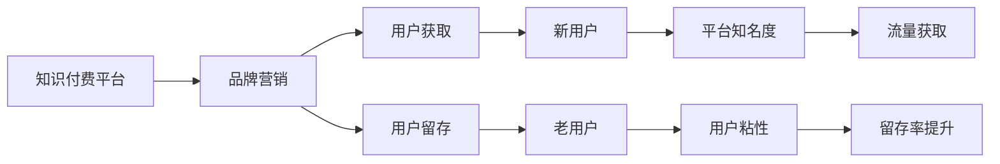

                 

## 1. 背景介绍

### 1.1 问题由来
近年来，随着信息技术的飞速发展，知识付费市场逐渐成为互联网经济的“新蓝海”。根据中国互联网网络信息中心（CNNIC）发布的第47次《中国互联网络发展状况统计报告》，知识付费用户规模已经突破4亿，渗透率达到8.6%。在“互联网+”的大背景下，无论是初创企业还是大型企业，都纷纷投入知识付费的建设中，希望借助知识付费的商业模式提升企业价值。然而，如何制定有效的品牌营销策略，吸引用户订阅，成为当前知识付费平台亟需解决的问题。

### 1.2 问题核心关键点
当前知识付费平台面临的核心问题是用户获取和留存。用户获取主要包括新用户增长和老用户留存，需要通过合适的营销策略吸引潜在用户，并提升用户粘性。老用户留存则涉及用户持续订阅和内容更新，要求平台提供更加丰富和实用的内容，同时改善用户体验。

针对这些关键问题，本文将从品牌营销的角度出发，系统探讨知识付费平台的品牌建设、用户获取和留存策略。

## 2. 核心概念与联系

### 2.1 核心概念概述

为了更好地理解知识付费平台的品牌营销策略，我们首先需要明确几个核心概念：

- **知识付费平台**：指通过付费形式提供优质内容服务，满足用户个性化学习需求的在线平台。如得到、喜马拉雅、知乎live等。
- **品牌营销**：指通过市场推广、品牌传播等手段，提升平台知名度和美誉度，吸引用户订阅和付费。
- **用户获取**：指平台通过各种渠道吸引新用户，扩大用户基础。
- **用户留存**：指通过优化用户体验和内容服务，提升老用户粘性，实现长期稳定发展。

这些概念之间存在密切的联系。品牌营销是吸引用户获取和留存的核心手段，而用户获取和留存则是品牌营销效果的直接体现。通过合理的品牌营销策略，平台可以构建强大的品牌壁垒，提升用户对平台的信任度和忠诚度，实现可持续发展。

### 2.2 核心概念原理和架构的 Mermaid 流程图



这个流程图展示了品牌营销、用户获取和留存之间的逻辑关系。品牌营销通过提升平台知名度和美誉度，吸引更多新用户。新用户通过各类推广渠道获取后，进入平台体验内容。同时，通过优化内容和服务，提升用户体验，增加用户粘性，实现老用户留存。

## 3. 核心算法原理 & 具体操作步骤

### 3.1 算法原理概述

知识付费平台的品牌营销策略，本质上是通过市场推广和品牌传播，提升平台在目标用户群体中的知名度和认可度。其核心思想是构建用户价值主张，通过差异化的品牌定位和有针对性的内容营销，吸引和留住用户。

具体来说，品牌营销策略包括以下几个关键步骤：

1. **市场分析**：对目标市场进行细分，明确目标用户群体特征和需求。
2. **品牌定位**：确定品牌核心价值和独特卖点，构建品牌形象。
3. **内容开发**：根据品牌定位，设计和开发符合用户需求的内容产品。
4. **推广策略**：选择合适的推广渠道和工具，进行有针对性的市场推广。
5. **用户获取**：通过推广策略吸引新用户，并引导用户订阅和付费。
6. **用户留存**：通过优化用户体验和内容服务，提升用户粘性，实现老用户留存。

### 3.2 算法步骤详解

#### 步骤1：市场分析

市场分析是品牌营销的第一步，主要包括以下几个方面：

1. **目标市场细分**：通过市场调研和用户分析，将市场分为不同的细分市场，如年龄段、职业、兴趣等。
2. **用户需求分析**：通过问卷调查、用户反馈等方式，了解不同用户群体的需求和痛点。
3. **竞争分析**：分析主要竞争对手的品牌定位和市场策略，明确自身的差异化优势。

#### 步骤2：品牌定位

品牌定位是品牌营销的核心，通过明确品牌价值和独特卖点，构建品牌形象。主要包括以下几个方面：

1. **品牌核心价值**：确定品牌所代表的核心理念和价值观，如专业、权威、创新等。
2. **差异化卖点**：寻找与竞争对手不同的独特卖点，如明星效应、权威认证等。
3. **品牌形象设计**：通过LOGO、口号、视觉元素等构建统一的品牌形象，提升品牌识别度。

#### 步骤3：内容开发

内容开发是品牌营销的重要组成部分，需要通过高质量的内容产品，吸引用户订阅和付费。主要包括以下几个方面：

1. **课程体系设计**：根据品牌定位和用户需求，设计课程体系，涵盖不同难度和类型的课程。
2. **内容生产团队**：组建专业的内容生产团队，包括知名讲师、行业专家等，提升内容质量。
3. **内容营销策略**：制定内容营销策略，通过博客、社交媒体、直播等方式推广优质内容。

#### 步骤4：推广策略

推广策略是品牌营销的关键，需要通过选择合适的推广渠道和工具，实现精准投放和用户获取。主要包括以下几个方面：

1. **推广渠道选择**：选择合适的推广渠道，如搜索引擎、社交媒体、内容平台等。
2. **广告投放策略**：制定精准的广告投放策略，根据用户行为和兴趣进行定向投放。
3. **用户获取漏斗**：构建用户获取漏斗，明确不同阶段的用户转化策略。

#### 步骤5：用户获取

用户获取是品牌营销的直接目标，通过有效的推广策略，吸引新用户订阅和付费。主要包括以下几个方面：

1. **免费试用**：提供免费试用课程，吸引用户初步体验。
2. **优惠促销**：通过折扣、优惠券等方式，降低用户购买门槛。
3. **社交传播**：鼓励用户通过社交媒体分享和推荐，扩大品牌影响。

#### 步骤6：用户留存

用户留存是品牌营销的长期目标，通过优化用户体验和内容服务，提升用户粘性，实现老用户留存。主要包括以下几个方面：

1. **优质内容推荐**：根据用户兴趣和历史行为，推荐个性化的优质课程。
2. **社群互动**：建立用户社群，提供交流和学习平台，增强用户粘性。
3. **定期更新内容**：持续更新优质内容，满足用户持续学习需求。

### 3.3 算法优缺点

知识付费平台品牌营销策略具有以下优点：

1. **精准定位**：通过市场分析和品牌定位，明确目标用户群体，实现精准投放。
2. **高效用户获取**：通过优化推广策略，降低获取成本，快速吸引新用户。
3. **提升用户粘性**：通过优化用户体验和内容服务，提升老用户留存率，实现长期稳定发展。

同时，也存在以下缺点：

1. **成本较高**：品牌营销需要投入大量资金和资源，尤其是初期推广阶段。
2. **推广效果不确定**：市场推广效果受到多种因素影响，难以准确预测。
3. **用户留存难度大**：新用户获取容易，但老用户留存难度较大，需要持续投入。

### 3.4 算法应用领域

知识付费平台品牌营销策略在各个领域都有广泛应用，如教育培训、职业发展、健康生活等。以下以教育培训领域为例，具体说明如何制定品牌营销策略：

- **目标市场细分**：细分K-12、高等教育、职业培训等不同教育阶段和学科领域。
- **品牌定位**：如针对K-12学生的“名师在线”，针对职场人士的“职业发展”，针对成年人的“文化素养提升”。
- **内容开发**：根据不同用户群体需求，设计相应的课程体系和内容产品，如K-12的语文、数学、英语课程，职场人士的PMP、CPA、股票投资课程，成年人的文化素养提升课程。
- **推广策略**：选择适合不同目标群体的推广渠道，如K-12学生主要通过家长群体推广，职场人士主要通过职场社群推广，成年人主要通过社交媒体推广。
- **用户获取**：通过提供免费试用和优惠促销，吸引新用户订阅和付费。
- **用户留存**：通过推荐优质内容和建立社群互动，提升用户粘性，实现长期订阅。

## 4. 数学模型和公式 & 详细讲解 & 举例说明

### 4.1 数学模型构建

知识付费平台品牌营销策略的数学模型可以通过以下公式进行构建：

$$
C_{\text{total}} = C_{\text{marketing}} + C_{\text{user\_getting}} + C_{\text{user\_retention}}
$$

其中，$C_{\text{total}}$ 为总成本，$C_{\text{marketing}}$ 为市场推广成本，$C_{\text{user\_getting}}$ 为获取新用户成本，$C_{\text{user\_retention}}$ 为老用户留存成本。

通过这个模型，平台可以系统计算各个环节的成本，优化整体营销策略。

### 4.2 公式推导过程

在市场推广阶段，假设每次推广的平均成本为 $c_{\text{marketing}}$，推广到新用户的比例为 $p$，则市场推广的总成本为：

$$
C_{\text{marketing}} = p \times c_{\text{marketing}} \times N
$$

其中，$N$ 为推广的总人数。

在用户获取阶段，假设每次获取新用户的成本为 $c_{\text{user\_getting}}$，每次转化率为 $r$，则获取新用户所需的总成本为：

$$
C_{\text{user\_getting}} = \frac{N}{r} \times c_{\text{user\_getting}}
$$

在用户留存阶段，假设每次留存老用户的成本为 $c_{\text{user\_retention}}$，每次留存的概率为 $s$，则留存老用户所需的总成本为：

$$
C_{\text{user\_retention}} = \frac{N}{s} \times c_{\text{user\_retention}}
$$

### 4.3 案例分析与讲解

以某知识付费平台为例，假设每次推广的平均成本为1元，推广到新用户的比例为30%，每次获取新用户的成本为3元，每次转化率为10%，每次留存老用户的成本为5元，每次留存的概率为20%。则总成本计算如下：

$$
C_{\text{total}} = C_{\text{marketing}} + C_{\text{user\_getting}} + C_{\text{user\_retention}}
$$
$$
C_{\text{total}} = 0.3 \times 1 \times N + \frac{N}{0.1} \times 3 + \frac{N}{0.2} \times 5
$$
$$
C_{\text{total}} = 1.3N + 30N + 25N = 56.3N
$$

## 5. 项目实践：代码实例和详细解释说明

### 5.1 开发环境搭建

在进行品牌营销策略开发前，我们需要准备好开发环境。以下是使用Python进行Scikit-learn开发的开发环境配置流程：

1. 安装Anaconda：从官网下载并安装Anaconda，用于创建独立的Python环境。

2. 创建并激活虚拟环境：
```bash
conda create -n sklearn-env python=3.8 
conda activate sklearn-env
```

3. 安装Scikit-learn：
```bash
pip install -U scikit-learn
```

4. 安装各类工具包：
```bash
pip install numpy pandas matplotlib seaborn plotly
```

5. 配置代码编辑器：推荐使用Visual Studio Code，通过安装Python插件和相关扩展，快速进行代码编写和调试。

完成上述步骤后，即可在`sklearn-env`环境中开始品牌营销策略的开发实践。

### 5.2 源代码详细实现

下面以品牌定位为例，给出使用Scikit-learn进行数据分析和建模的代码实现。

首先，定义数据集和相关参数：

```python
import pandas as pd
import numpy as np
from sklearn.model_selection import train_test_split
from sklearn.feature_extraction.text import TfidfVectorizer
from sklearn.linear_model import LogisticRegression
from sklearn.metrics import roc_auc_score

# 读取用户反馈数据
data = pd.read_csv('user_feedback.csv')

# 特征工程：提取用户反馈的文本内容和情感极性
X = data['feedback'].apply(lambda x: x.lower())
y = data['polarity']

# 划分训练集和测试集
X_train, X_test, y_train, y_test = train_test_split(X, y, test_size=0.2, random_state=42)

# 特征提取
vectorizer = TfidfVectorizer(stop_words='english', max_features=1000)
X_train = vectorizer.fit_transform(X_train)
X_test = vectorizer.transform(X_test)

# 模型训练
model = LogisticRegression(solver='lbfgs', C=1.0, multi_class='ovr')
model.fit(X_train, y_train)
```

然后，进行模型评估和优化：

```python
# 模型评估
y_pred = model.predict_proba(X_test)[:, 1]
roc_auc = roc_auc_score(y_test, y_pred)
print(f'ROC-AUC score: {roc_auc}')

# 模型优化
C_values = np.logspace(-4, 4, 10)
best_auc = 0.0
best_C = None
for C in C_values:
    model = LogisticRegression(solver='lbfgs', C=C, multi_class='ovr')
    model.fit(X_train, y_train)
    y_pred = model.predict_proba(X_test)[:, 1]
    auc = roc_auc_score(y_test, y_pred)
    if auc > best_auc:
        best_auc = auc
        best_C = C

print(f'Best C: {best_C}, ROC-AUC score: {best_auc}')
```

最后，将优化后的模型应用于实际业务：

```python
# 实际应用
from sklearn.metrics import roc_curve, auc
from matplotlib import pyplot as plt

# 生成ROC曲线
fpr, tpr, _ = roc_curve(y_test, y_pred)
roc_auc = auc(fpr, tpr)

# 绘制ROC曲线
plt.figure()
plt.plot(fpr, tpr, color='darkorange', lw=2, label='ROC curve (area = %0.2f)' % roc_auc)
plt.plot([0, 1], [0, 1], color='navy', lw=2, linestyle='--')
plt.xlim([0.0, 1.0])
plt.ylim([0.0, 1.05])
plt.xlabel('False Positive Rate')
plt.ylabel('True Positive Rate')
plt.title('Receiver Operating Characteristic')
plt.legend(loc='lower right')
plt.show()
```

### 5.3 代码解读与分析

让我们再详细解读一下关键代码的实现细节：

**用户反馈数据处理**：
- 读取用户反馈数据，并将其转化为小写，方便特征提取。
- 提取用户反馈的文本内容和情感极性，作为输入和输出。

**特征工程**：
- 使用TfidfVectorizer对文本数据进行特征提取，去除停用词，并限制特征数为1000。
- 使用LogisticRegression进行二分类逻辑回归建模。

**模型评估和优化**：
- 使用ROC-AUC指标评估模型性能，通过网格搜索找到最优的C值，提升模型精度。

**实际应用**：
- 生成ROC曲线，并使用AUC指标评估模型效果。
- 通过绘制ROC曲线，直观展示模型性能。

## 6. 实际应用场景

### 6.1 教育培训领域

在教育培训领域，知识付费平台可以通过品牌营销策略，吸引潜在学生订阅和付费。具体应用场景如下：

- **品牌定位**：如针对K-12学生的“名师在线”，针对职场人士的“职业发展”，针对成年人的“文化素养提升”。
- **内容开发**：根据不同用户群体需求，设计相应的课程体系和内容产品，如K-12的语文、数学、英语课程，职场人士的PMP、CPA、股票投资课程，成年人的文化素养提升课程。
- **推广策略**：通过线上线下广告、明星效应、免费试用等方式，吸引用户订阅和付费。

### 6.2 医疗健康领域

在医疗健康领域，知识付费平台可以通过品牌营销策略，吸引健康意识强的人群订阅和付费。具体应用场景如下：

- **品牌定位**：如针对健康爱好者的“健康知识”，针对慢性病患者的管理指导，针对老年人的“养生指南”。
- **内容开发**：根据不同用户群体需求，设计相应的健康课程和知识产品，如健康饮食、运动康复、心理辅导等。
- **推广策略**：通过健康博主、专家讲座、社区活动等方式，提升品牌知名度和美誉度。

### 6.3 个人成长领域

在个人成长领域，知识付费平台可以通过品牌营销策略，吸引自我提升和职业发展的用户订阅和付费。具体应用场景如下：

- **品牌定位**：如针对大学生和职场人士的“技能提升”，针对创业者的“创业指导”，针对家庭主妇的“生活管理”。
- **内容开发**：根据不同用户群体需求，设计相应的职业技能课程、管理知识、生活技能等。
- **推广策略**：通过职业导师、职场人脉、社会影响力等方式，吸引用户订阅和付费。

## 7. 工具和资源推荐

### 7.1 学习资源推荐

为了帮助开发者系统掌握品牌营销的理论与实践，这里推荐一些优质的学习资源：

1. 《营销心理学》系列课程：如《营销心理实战》、《品牌管理》等，由知名专家授课，系统讲解营销心理和品牌管理的方法。
2. 《营销管理》书籍：菲利普·科特勒的经典著作，详细介绍了营销理论和实践，是营销领域必读之作。
3. 《内容营销》书籍：乔纳·伯杰的《内容营销》，深入浅出地介绍了内容营销的策略和技巧。
4. 《消费者行为学》系列课程：如《消费者心理学》、《市场细分》等，由知名学者授课，讲解消费者行为学的基本原理和方法。
5. 《数字营销》系列课程：如《搜索引擎优化》、《社交媒体营销》等，由行业专家授课，讲解数字营销的基本技术和工具。

### 7.2 开发工具推荐

高效的开发离不开优秀的工具支持。以下是几款用于品牌营销开发的常用工具：

1. Python：开源的编程语言，功能强大，广泛应用于数据分析和建模。
2. Scikit-learn：Python的机器学习库，提供了丰富的算法和工具，方便进行数据建模和分析。
3. TensorFlow和PyTorch：深度学习框架，支持复杂的模型设计和训练，广泛应用于NLP和图像处理等领域。
4. Tableau和Power BI：数据可视化工具，通过图表和仪表盘展示数据，方便进行决策分析。
5. SEMrush和Ahrefs：SEO分析工具，提供关键词排名、竞争分析等数据，帮助优化搜索引擎优化策略。

### 7.3 相关论文推荐

品牌营销领域的研究涉及多个学科，以下是几篇具有代表性的论文，推荐阅读：

1. 《品牌定位研究综述》：文章总结了品牌定位的理论和方法，为品牌营销提供了系统的指导。
2. 《消费者行为理论新发展》：文章介绍了消费者行为学的新进展，为品牌营销提供了理论支持。
3. 《营销传播学研究综述》：文章总结了营销传播学的理论和方法，为品牌营销提供了实践指导。
4. 《内容营销策略分析》：文章分析了内容营销的策略和方法，为品牌营销提供了具体技巧。
5. 《品牌价值理论研究综述》：文章总结了品牌价值理论的研究现状和未来趋势，为品牌营销提供了方向指导。

## 8. 总结：未来发展趋势与挑战

### 8.1 总结

本文对知识付费平台品牌营销策略进行了全面系统的介绍。首先阐述了品牌营销的重要性，明确了品牌营销的核心思想和关键步骤。其次，从市场分析、品牌定位、内容开发、推广策略、用户获取和留存等方面，详细讲解了品牌营销的各个环节。最后，通过实际应用场景和工具资源推荐，帮助开发者掌握品牌营销的实践技巧。

通过本文的系统梳理，可以看到，品牌营销策略在知识付费平台中具有重要的作用，能够帮助平台吸引新用户，提升用户留存率，实现可持续发展。品牌营销不仅是获取用户的手段，更是平台核心竞争力的体现。未来，品牌营销将继续发挥重要作用，推动知识付费平台实现更广泛的市场覆盖和更高的用户价值。

### 8.2 未来发展趋势

展望未来，知识付费平台品牌营销策略将呈现以下几个发展趋势：

1. **数据驱动**：品牌营销将更加依赖大数据和人工智能技术，通过数据分析和模型优化，提升推广效果和用户转化率。
2. **内容为王**：品牌营销的核心在于内容，优质的内容产品能够吸引用户订阅和付费，未来的平台将更加注重内容开发和创新。
3. **个性化推荐**：通过个性化推荐系统，提升用户对平台的粘性，实现更精准的用户服务和体验。
4. **社交传播**：通过社交媒体和用户推荐，提升品牌传播和用户获取的效果。
5. **用户体验优化**：通过不断优化平台界面和用户体验，提升用户满意度，增强用户粘性。

### 8.3 面临的挑战

尽管知识付费平台品牌营销策略已经取得了一定成效，但在实际应用过程中，仍面临诸多挑战：

1. **用户获取成本高**：品牌营销需要投入大量资金和资源，尤其是在初期推广阶段，成本较高。
2. **推广效果不稳定**：市场推广效果受到多种因素影响，难以准确预测，存在较高的风险。
3. **内容更新难度大**：持续更新优质内容，满足用户需求，需要大量的内容生产资源。
4. **用户留存率低**：新用户获取容易，但老用户留存难度较大，需要持续投入。
5. **竞争激烈**：知识付费市场竞争激烈，平台需要不断创新，提升品牌竞争力。

### 8.4 研究展望

面对知识付费平台品牌营销面临的挑战，未来的研究需要在以下几个方面寻求新的突破：

1. **低成本推广**：通过优化推广策略和渠道选择，降低推广成本，实现更高效的用户获取。
2. **内容生态建设**：建立优质内容生态，吸引和培育更多内容创作者，提升内容质量和多样性。
3. **用户行为分析**：深入分析用户行为和需求，制定更精准的用户服务策略，提升用户留存率。
4. **多渠道融合**：融合线上线下多种推广渠道，实现全方位品牌传播。
5. **数据安全保护**：加强数据隐私和安全保护，提升用户对平台的信任度和满意度。

总之，知识付费平台品牌营销策略需要不断优化和创新，才能在激烈的市场竞争中脱颖而出。唯有从数据、内容、用户、渠道等多个维度协同发力，才能实现平台的长远发展。

## 9. 附录：常见问题与解答

**Q1：品牌营销策略是否适用于所有知识付费平台？**

A: 品牌营销策略适用于大多数知识付费平台，尤其是对用户获取和留存有较高要求的平台。然而，不同的平台有不同的用户特征和需求，品牌定位和推广策略需要根据具体情况进行调整。

**Q2：品牌营销策略是否需要大量资金投入？**

A: 品牌营销策略需要一定的资金投入，尤其是在初期推广阶段。但随着品牌知名度的提升，后续推广成本会逐渐降低。通过优化推广策略和渠道选择，可以实现较低的推广成本和较高的用户获取效果。

**Q3：如何衡量品牌营销的效果？**

A: 品牌营销的效果可以通过多种指标进行衡量，如用户获取量、订阅量、留存率、ROI等。具体来说，可以通过以下指标进行评估：

1. **用户获取量**：统计品牌推广活动期间新增用户数量。
2. **订阅量**：统计通过品牌推广活动订阅的用户数量。
3. **留存率**：统计通过品牌推广活动订阅的用户在一定时间内的留存率。
4. **ROI**：统计品牌推广活动的投入产出比，即ROI = (订阅量 \times 单次订阅费用) / (推广费用 + 运营费用)。

**Q4：如何优化品牌营销策略？**

A: 品牌营销策略的优化主要包括以下几个方面：

1. **数据驱动**：通过数据分析和模型优化，提升推广效果和用户转化率。
2. **内容优化**：提升内容质量和多样性，吸引更多用户订阅和付费。
3. **渠道优化**：选择适合不同目标群体的推广渠道，实现精准投放。
4. **用户反馈**：通过用户反馈和数据收集，不断优化推广策略和内容服务。

**Q5：品牌营销策略与用户心理有何关系？**

A: 品牌营销策略与用户心理密切相关，主要体现在以下几个方面：

1. **品牌认知**：通过品牌形象和识别元素，提升用户对平台的认知和记忆。
2. **用户信任**：通过权威认证、用户评价等方式，提升用户对平台的信任度。
3. **情感共鸣**：通过情感化营销，增强用户对平台的情感认同和忠诚度。

---

作者：禅与计算机程序设计艺术 / Zen and the Art of Computer Programming

