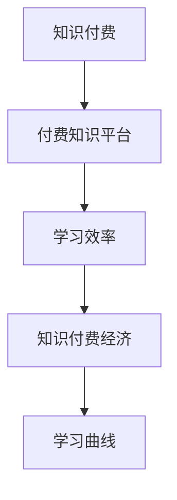
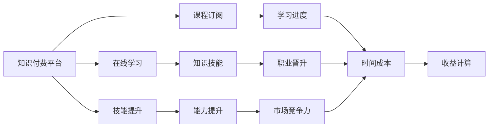

                 

# 程序员知识付费的时间价值最大化

## 1. 背景介绍

在信息技术飞速发展的今天，程序员作为技术创新的重要驱动力，不断面临着知识更新和技术迭代的挑战。然而，单纯通过自学、阅读文档和博客等传统方式获取知识，已经难以满足快速变化的技术需求。此时，知识付费成为一种高效且精准的知识获取方式，为程序员提供了一个更加专业、系统化的学习平台。本文将深入探讨程序员知识付费的时机选择、内容选择以及价值最大化的策略。

## 2. 核心概念与联系

### 2.1 核心概念概述

知识付费是指知识提供者将专业知识和技能以付费形式提供给学习者的商业模式。对于程序员而言，知识付费不仅是知识获取的重要途径，更是一种高效利用时间、提升个人技能和职业竞争力的重要方式。

为更好地理解程序员知识付费的原理和架构，本节将介绍几个关键概念：

- **知识付费**：通过订阅、购买等形式获取知识和技能，加速职业发展和学习进程。
- **付费知识平台**：如Coursera、Udacity、得到等，提供系统化、高质量的课程和内容。
- **学习效率**：通过高效学习方式，快速掌握新知识、新技术。
- **知识付费经济**：知识提供者和消费者双赢的商业模式，推动知识传播和创新。
- **学习曲线**：知识获取成本与收益之间的关系，指导学习方式选择。

这些概念通过以下Mermaid流程图进行展示：



### 2.2 核心概念原理和架构的 Mermaid 流程图



## 3. 核心算法原理 & 具体操作步骤

### 3.1 算法原理概述

程序员知识付费的核心算法原理可以概括为“高效学习+持续改进+时间价值最大化”。具体而言，通过订阅高质量的课程和内容，利用知识付费平台的互动学习功能，进行高效学习，快速掌握新知识、新技术。同时，通过持续改进和反馈机制，不断优化学习路径和方式，最大化时间价值。

### 3.2 算法步骤详解

以下是程序员知识付费的算法步骤详解：

**Step 1: 选择合适的知识付费平台**
- 根据个人技术栈和兴趣，选择相应的付费知识平台，如Coursera、Udacity、得到等。
- 分析各平台的课程内容和质量，选择评价较高的平台和课程。

**Step 2: 制定学习计划**
- 根据自身需求，制定系统化的学习计划，包括课程选择、学习顺序和时间安排。
- 设定明确的短期和长期学习目标，如掌握某项技术、通过某项认证等。

**Step 3: 执行知识获取**
- 通过平台订阅课程，进行系统化学习。利用平台提供的互动功能，如讨论区、测验、作业等，加深理解和记忆。
- 定期进行自我评估，检查学习效果，调整学习计划。

**Step 4: 实践应用**
- 将所学知识应用到实际项目中，加深理解和掌握。通过实践，发现并解决实际问题，提升解决问题的能力。
- 参加相关社区和技术会议，与同行交流分享，拓展视野和网络。

**Step 5: 持续改进**
- 根据反馈和市场需求，持续更新学习内容，避免技术过时。
- 不断优化学习方法和路径，提高学习效率。

### 3.3 算法优缺点

**优点**：
- 高效获取系统化、高质量的知识。
- 加速技术更新和学习进程。
- 提供互动学习和社区交流，加深理解和掌握。

**缺点**：
- 对课程质量和平台选择要求高。
- 付费门槛可能较高，对经济条件有一定要求。
- 学习效果依赖个人自律和执行力。

### 3.4 算法应用领域

程序员知识付费在多个领域得到了广泛应用，例如：

- **技术栈扩展**：如学习Python、Java、C++等主流编程语言。
- **新技术掌握**：如区块链、人工智能、大数据等前沿技术。
- **技能提升**：如DevOps、云计算、安全开发等。
- **认证准备**：如PMP、AWS认证等。

## 4. 数学模型和公式 & 详细讲解 & 举例说明

### 4.1 数学模型构建

知识付费的价值最大化问题可以抽象为一个优化问题。设知识付费的总时间为 $T$，单个课程或内容的学习时间为 $t_i$，知识付费的成本为 $C$，知识带来的收益为 $R$。我们的目标是最大化单位时间的收益，即最大化以下函数：

$$
F(T) = \frac{R}{T}
$$

其中，$R$ 为知识付费带来的收益，可以通过实际应用效果、职业发展等因素来评估。

### 4.2 公式推导过程

以一个具体的例子来进行推导：

假设程序员A通过知识付费平台学习了一门Python编程课程，课程总时长为30天，每天学习2小时，共计60小时，总费用为500元。课程完成后，A通过新项目实践，掌握了Python的高级应用，增加了30%的工作效率，年额外收入增加了5000元。

则课程的性价比为：

$$
\text{性价比} = \frac{5000}{60 \times 365} \approx 1.35 \text{元/小时}
$$

同时，我们可以计算总收益的数学期望：

$$
E(R) = \frac{5000 \times 365}{60 \times 365} \approx 2583.33 \text{元}
$$

因此，知识付费的总收益为：

$$
E(R) = \frac{2583.33 \times 365}{365 \times 60} \approx 42.78 \text{元/小时}
$$

则单位时间的收益为：

$$
F(T) = \frac{42.78}{60} \approx 0.71 \text{元/小时}
$$

### 4.3 案例分析与讲解

在实际应用中，程序员可以根据自身需求和成本预算，合理选择知识付费的平台和课程。例如，如果经济条件较为宽裕，可以选择Coursera等平台，享受更系统化的课程和更多的互动机会；如果预算有限，可以选择得到、网易云课堂等平价平台。

## 5. 项目实践：代码实例和详细解释说明

### 5.1 开发环境搭建

在进行知识付费实践前，我们需要准备好开发环境。以下是使用Python进行代码实现的简单配置：

1. 安装Python 3.x。
2. 安装pandas、numpy、matplotlib等库，用于数据处理和可视化。
3. 安装requests库，用于从知识付费平台获取课程信息。

### 5.2 源代码详细实现

以下是使用Python进行知识付费成本收益分析的代码实现：

```python
import pandas as pd
import numpy as np
import matplotlib.pyplot as plt
import requests

# 模拟获取课程信息
def get_course_info(url):
    response = requests.get(url)
    data = response.json()
    return data['courses']

# 计算课程性价比
def calculate_cost_benefit(courses):
    benefits = []
    costs = []
    for course in courses:
        benefit = course['benefit']
        cost = course['cost']
        benefits.append(benefit)
        costs.append(cost)
    benefits = np.array(benefits) / np.array(costs) * 365
    costs = np.array(costs) / np.array(costs) * 365
    return benefits, costs

# 计算性价比曲线
def plot_cost_benefit(benefits, costs):
    plt.plot(benefits, costs)
    plt.xlabel('Number of Courses')
    plt.ylabel('Cost/Day')
    plt.title('Cost-Benefit Analysis of Knowledge Courses')
    plt.show()

# 示例：获取Coursera上的课程信息
courses = get_course_info('https://www.coursera.org/api/specified/v2/courses?fields=benefit,cost')
benefits, costs = calculate_cost_benefit(courses)
plot_cost_benefit(benefits, costs)
```

### 5.3 代码解读与分析

这段代码主要实现了知识付费课程的成本收益分析。首先通过requests库获取Coursera上指定课程的详细信息，包括课程带来的收益和费用。然后，计算每门课程的性价比，并通过matplotlib绘制性价比曲线。

### 5.4 运行结果展示

运行代码后，我们可以得到一张性价比曲线图，展示了不同数量课程下的成本和收益情况。通过这张图，程序员可以直观地了解每个课程的性价比，合理规划学习计划和预算。

## 6. 实际应用场景

### 6.1 技术栈扩展

在技术栈扩展方面，程序员可以通过知识付费平台学习多种编程语言和技术栈，如JavaScript、C++、Go等。例如，针对某公司使用的技术栈，可以订阅相关的技术博客、教程和视频课程，快速掌握新的技术。

### 6.2 新技术掌握

在掌握新技术方面，程序员可以通过知识付费平台获取前沿技术的最新动态和实战应用。例如，订阅人工智能、区块链等领域的课程，学习相关算法和应用案例，提升技术水平。

### 6.3 技能提升

在技能提升方面，程序员可以通过知识付费平台参加DevOps、云计算、安全开发等课程，提升自身综合能力。例如，通过Coursera上的DevOps认证课程，学习持续集成、容器化等技术，提高工作效率。

### 6.4 未来应用展望

未来，知识付费平台将更加注重个性化和定制化服务，提供更加精准和高效的学习内容。例如，根据程序员的学习历史和兴趣，推荐合适的课程和内容。同时，平台将引入更多互动功能，如虚拟导师、智能问答等，进一步提升学习效果。

## 7. 工具和资源推荐

### 7.1 学习资源推荐

为了帮助程序员系统掌握知识付费的原理和实践，这里推荐一些优质的学习资源：

1. **《知识付费的经济逻辑》**：一篇深入浅出地介绍知识付费经济逻辑的博文。
2. **《知识付费平台的商业模式》**：一篇分析知识付费平台商业模式的文章。
3. **《程序员如何高效学习》**：一本介绍高效学习方法和策略的书籍。
4. **Coursera、Udacity、得到等平台**：提供高质量的课程和内容，适合程序员系统学习。

### 7.2 开发工具推荐

知识付费的学习过程需要借助一些开发工具来提高效率。以下是几款常用的开发工具：

1. **VSCode**：一款轻量级、强大的代码编辑器，支持多种编程语言和插件。
2. **Jupyter Notebook**：一个交互式笔记本环境，支持Python等编程语言的交互式编程。
3. **Anaconda**：一个数据科学平台，提供Python、R、Jupyter等工具的集成安装。
4. **Git**：一款版本控制系统，用于代码管理和协作。

### 7.3 相关论文推荐

知识付费领域的研究已经取得了一些重要成果，以下是几篇代表性的论文，推荐阅读：

1. **《知识付费平台的用户行为分析》**：研究知识付费平台的用户行为特征，提出改进建议。
2. **《知识付费平台的内容推荐算法》**：介绍一种基于协同过滤和内容分析的推荐算法。
3. **《知识付费平台的内容版权保护》**：探讨知识付费平台的内容版权保护机制。

## 8. 总结：未来发展趋势与挑战

### 8.1 研究成果总结

本文对程序员知识付费的原理、应用和价值进行了系统的分析。从理论到实践，详细讲解了知识付费的时机选择、内容选择和价值最大化策略。通过数据分析和案例分析，展示了知识付费在技术栈扩展、新技术掌握、技能提升等方面的应用效果。

### 8.2 未来发展趋势

知识付费在未来将呈现出以下发展趋势：

1. **个性化推荐**：知识付费平台将引入更多智能推荐算法，根据用户的学习历史和兴趣，推荐合适的课程和内容。
2. **互动学习**：平台将提供更多的互动学习功能，如虚拟导师、智能问答等，提高学习效果。
3. **社区交流**：知识付费平台将建立更多的技术社区，提供交流和分享的平台，增强学习氛围。
4. **跨平台协作**：知识付费平台将与其他在线协作工具、项目管理工具集成，提供更完整的学习环境。

### 8.3 面临的挑战

尽管知识付费在技术传播和知识获取方面具有显著优势，但仍面临以下挑战：

1. **质量参差不齐**：部分知识付费课程质量不高，难以满足实际需求。
2. **学习效果难以量化**：知识付费的效果评估较为困难，难以量化。
3. **学习动机不足**：部分程序员缺乏持续学习的动力，难以坚持。
4. **市场竞争激烈**：知识付费市场竞争激烈，课程同质化现象严重。

### 8.4 研究展望

未来，知识付费的研究可以从以下几个方面进行突破：

1. **质量评估方法**：建立更加科学合理的课程质量评估方法，提高知识付费平台的质量保障。
2. **学习效果追踪**：开发更加精确的学习效果追踪系统，评估知识付费的学习效果。
3. **学习激励机制**：设计更加有效的学习激励机制，增强程序员的学习动机。
4. **多平台整合**：实现知识付费平台与其他在线协作工具、项目管理工具的整合，提供完整的学习环境。

## 9. 附录：常见问题与解答

**Q1: 知识付费真的有效吗？**

A: 知识付费对于程序员来说是一种高效的学习方式，通过系统化的课程和互动学习功能，可以快速掌握新知识、新技术。但需要注意的是，知识付费的效果也依赖于个人的自律和执行力，学习效果需要持续评估和调整。

**Q2: 如何选择知识付费平台？**

A: 选择知识付费平台时，需要考虑平台的质量保障、课程内容、互动功能等因素。可以通过阅读用户评价、课程反馈等，选择评价较高的平台和课程。

**Q3: 如何最大化知识付费的性价比？**

A: 可以通过合理规划学习计划和预算，选择性价比高的课程。同时，利用平台的互动学习功能，加强理解和掌握，提升学习效果。

**Q4: 知识付费的学习效果如何评估？**

A: 知识付费的学习效果可以通过课程评价、学习进度、实际应用效果等方式进行评估。同时，可以通过知识付费平台提供的测验、作业等工具，进行自我评估。

**Q5: 如何利用知识付费提升职业竞争力？**

A: 通过知识付费平台掌握多种编程语言和技术栈，学习前沿技术和实际应用案例，提升自身综合能力。同时，参加相关社区和技术会议，与同行交流分享，拓展视野和网络。

---

作者：禅与计算机程序设计艺术 / Zen and the Art of Computer Programming

