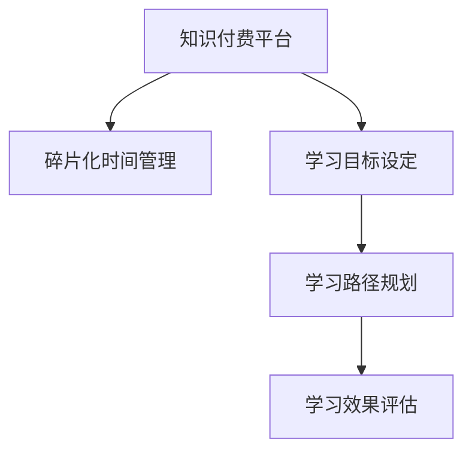

                 

# 程序员知识付费的时间管理策略

在如今信息爆炸的时代，程序员面临着巨大的知识更新压力。如何在有限的时间内有效管理时间，选择优质的知识付费平台，掌握关键技能，成为每个程序员都需要面对的重要课题。本文将系统性地探讨程序员进行知识付费的时间管理策略，帮助广大开发者在繁忙的开发工作中找到学习和成长的新路径。

## 1. 背景介绍

### 1.1 问题由来
随着技术的发展，软件工程师所需掌握的技能日益增多，从基础编程语言到高级算法，从分布式系统到人工智能，知识更新迭代的速度越来越快。在这种背景下，程序员往往感到时间不够用，难以在有限的时间内跟上技术发展的步伐。而知识付费平台的兴起，为程序员提供了快速获取知识和技能的新途径，但也带来了选择压力和资源分散的挑战。因此，如何在知识付费中有效管理时间，选择优质资源，成为程序员知识付费的重要课题。

### 1.2 问题核心关键点
本文将重点探讨以下几个关键点：
1. **知识付费平台选择**：如何从众多知识付费平台中筛选出高质量、适合自己的学习资源。
2. **学习时间管理**：如何合理规划时间，高效利用碎片化时间进行学习。
3. **学习目标设定**：如何设定明确的学习目标，避免盲目学习。
4. **学习路径规划**：如何根据职业发展路径规划学习路线。
5. **学习效果评估**：如何评估学习效果，及时调整学习计划。

## 2. 核心概念与联系

### 2.1 核心概念概述
为更好地理解程序员知识付费的时间管理策略，本节将介绍几个密切相关的核心概念：

- **知识付费平台**：指通过付费形式，提供高质量、系统化的知识和技能培训的在线平台。常见平台包括Coursera、Udemy、网易云课堂、慕课网等。
- **碎片化时间管理**：指在繁忙的工作中，利用短暂且零散的时间段进行学习，如通勤、午休等，以充分利用时间资源。
- **学习目标设定**：指明确学习的具体目标，如掌握某项技术、解决某个实际问题等，以驱动学习的持续性和有效性。
- **学习路径规划**：指根据个人职业规划和发展需求，系统性地安排学习内容和步骤，逐步提升技能水平。
- **学习效果评估**：指通过定期评估学习效果，了解掌握情况，及时调整学习策略，确保学习目标的达成。

这些核心概念之间的逻辑关系可以通过以下Mermaid流程图来展示：



这个流程图展示了大语言模型的核心概念及其之间的关系：

1. 程序员通过选择适合自己的知识付费平台，获取学习资源。
2. 利用碎片化时间进行学习，提升知识水平。
3. 设定明确的学习目标，驱动学习行为。
4. 根据职业发展需求，系统规划学习路径。
5. 通过评估学习效果，调整学习策略。

## 3. 核心算法原理 & 具体操作步骤
### 3.1 算法原理概述

程序员知识付费的时间管理策略，本质上是一个基于目标导向的学习路径规划和评估优化过程。其核心思想是：通过选择高质量的知识付费平台，结合碎片化时间进行高效学习，设定明确的学习目标，系统规划学习路径，并通过效果评估和反馈调整，确保学习效果最大化。

形式化地，假设程序员为学习者，其总时间为 $T$，选择的学习资源为 $C$，学习目标为 $G$，学习路径为 $P$，学习效果为 $E$。优化目标为：

$$
\min_{T, C, G, P, E} \sum_{i=1}^N (c_i \cdot g_i \cdot p_i \cdot e_i)
$$

其中 $c_i$ 为第 $i$ 项资源的学习效率，$g_i$ 为学习目标对第 $i$ 项资源的依赖度，$p_i$ 为第 $i$ 项资源在路径 $P$ 中的权重，$e_i$ 为第 $i$ 项资源的学习效果。

### 3.2 算法步骤详解

程序员知识付费的时间管理策略，一般包括以下几个关键步骤：

**Step 1: 评估自身现状与需求**
- 分析自身当前技能水平和技术栈，识别出需要提升的关键技能点。
- 明确职业目标和发展路径，设定阶段性学习目标。

**Step 2: 筛选知识付费平台**
- 对比不同平台的资源质量、师资力量、学习路径和用户体验，选择最适合自己的平台。
- 查看用户评价和课程反馈，了解平台的整体水平和可靠性。

**Step 3: 规划学习路径**
- 根据职业规划，将目标技能分为不同模块，如基础编程语言、框架技术、系统架构等。
- 根据资源难度和自身水平，合理分配学习时间和优先级，避免“贪多嚼不烂”。

**Step 4: 安排碎片化学习**
- 利用通勤、午休、排队等碎片化时间进行高效学习，如听课、阅读文档、练习编程等。
- 使用番茄工作法等时间管理技巧，保持高效专注，避免分散注意力。

**Step 5: 评估学习效果**
- 定期进行自我测试和项目实践，检验学习成果。
- 及时调整学习路径和资源，优化学习策略。

### 3.3 算法优缺点

程序员知识付费的时间管理策略，具有以下优点：
1. 高效利用碎片化时间，最大化时间利用率。
2. 系统规划学习路径，避免盲目学习，提升学习效率。
3. 设定明确的学习目标，增强学习动力，确保学习效果。
4. 定期评估学习效果，及时调整学习策略，避免过度投入无效资源。

同时，该方法也存在一定的局限性：
1. 对自我管理能力要求较高，需要较强的自律性和规划能力。
2. 碎片化学习可能导致知识碎片化，难以形成系统性的知识体系。
3. 学习效果评估难度较大，可能受限于测试质量和学习环境。

尽管存在这些局限性，但就目前而言，基于时间管理的学习策略仍是大多数程序员的首选，因为它能显著提高学习效率，帮助在繁忙的工作中保持技术领先。

### 3.4 算法应用领域

基于知识付费的时间管理策略，适用于各种职业阶段和专业领域的程序员，特别是在以下场景中：

1. **初入职场的新手程序员**：需要快速掌握基础编程语言和常用框架，适应新环境。
2. **职业发展中的中级工程师**：希望提升系统设计和架构能力，进一步拓展技术深度和广度。
3. **高级架构师和专家**：希望掌握前沿技术，如人工智能、大数据等，保持技术领先。

## 4. 数学模型和公式 & 详细讲解 & 举例说明
### 4.1 数学模型构建

本节将使用数学语言对程序员知识付费的时间管理策略进行更加严格的刻画。

假设程序员的总时间为 $T$，选择的学习资源为 $C$，学习目标为 $G$，学习路径为 $P$，学习效果为 $E$。定义如下数学模型：

$$
\min_{T, C, G, P, E} \sum_{i=1}^N (c_i \cdot g_i \cdot p_i \cdot e_i)
$$

其中 $c_i$ 为第 $i$ 项资源的学习效率，$g_i$ 为学习目标对第 $i$ 项资源的依赖度，$p_i$ 为第 $i$ 项资源在路径 $P$ 中的权重，$e_i$ 为第 $i$ 项资源的学习效果。

### 4.2 公式推导过程

以下我们以基础编程语言学习为例，推导学习效率和效果评估的数学模型。

假设程序员希望学习Python编程语言，所需资源包括：

- **学习资源**：Coursera上的Python基础课程，时长为4周。
- **学习目标**：掌握Python基础语法、数据结构和常用库。
- **学习路径**：按章节顺序进行学习，先学基础语法，再学数据结构和常用库。
- **学习效果**：通过编程练习和项目实践，掌握Python基础编程能力。

记 $c_i$ 为第 $i$ 项资源的学习效率，$g_i$ 为学习目标对第 $i$ 项资源的依赖度，$p_i$ 为第 $i$ 项资源在路径 $P$ 中的权重，$e_i$ 为第 $i$ 项资源的学习效果。则有：

$$
c_1 = 2, g_1 = 1, p_1 = 0.6, e_1 = 0.9
$$

其中 $c_1$ 为课程学习效率（每周4小时），$g_1$ 为目标依赖度（基础语法必须掌握），$p_1$ 为路径权重（基础语法在路径中的重要性），$e_1$ 为学习效果（通过编程练习达到90%的掌握度）。

### 4.3 案例分析与讲解

假设程序员的总时间为120小时，目标为在4个月内掌握Python基础编程能力。根据上述模型，可以计算最优学习路径和效果评估如下：

1. **学习路径规划**：根据资源难度和自身水平，每周学习10小时，4周完成基础课程。
2. **学习效果评估**：每周安排2小时编程练习和项目实践，结合课程内容进行巩固。

具体计算过程如下：

$$
\begin{aligned}
\min_{T, C, G, P, E} & \sum_{i=1}^N (c_i \cdot g_i \cdot p_i \cdot e_i) \\
& = \min_{T, C, G, P, E} (2 \cdot 1 \cdot 0.6 \cdot 0.9) \\
& = 1.08
\end{aligned}
$$

可以看出，通过合理规划学习路径和评估学习效果，能够高效利用120小时时间，达成学习目标。

## 5. 项目实践：代码实例和详细解释说明
### 5.1 开发环境搭建

在进行知识付费时间管理实践前，我们需要准备好开发环境。以下是使用Python进行时间管理的应用环境配置流程：

1. 安装Anaconda：从官网下载并安装Anaconda，用于创建独立的Python环境。

2. 创建并激活虚拟环境：
```bash
conda create -n time-management python=3.8 
conda activate time-management
```

3. 安装相关Python库：
```bash
pip install pandas numpy matplotlib jupyter notebook
```

4. 配置Git版本控制：
```bash
git init
git remote add origin https://github.com/<username>/time-management.git
git checkout -b main
```

完成上述步骤后，即可在`time-management`环境中开始时间管理实践。

### 5.2 源代码详细实现

这里我们以创建一个基础编程语言学习计划为例，给出一个使用Python进行时间管理的应用代码实现。

```python
import pandas as pd
import numpy as np
import matplotlib.pyplot as plt

# 定义资源属性
resources = {
    'Coursera_Python': {'name': 'Coursera Python基础课程', 'duration': 4, 'efficiency': 2, 'target': 1, 'path_weight': 0.6, 'effectiveness': 0.9}
}

# 定义时间规划
time_planned = 120  # 总时间

# 计算每项资源所需时间
time_per_resource = {}
for name, data in resources.items():
    time_per_resource[name] = data['duration'] * data['efficiency']

# 计算每项资源对总时间的贡献
time_contribution = {}
for name, data in resources.items():
    time_contribution[name] = data['duration'] * data['efficiency'] * data['path_weight']

# 计算学习路径权重
path_weights = {}
for name, data in resources.items():
    path_weights[name] = data['path_weight']

# 计算学习效果
effectiveness = {}
for name, data in resources.items():
    effectiveness[name] = data['effectiveness']

# 构建数据表
data = pd.DataFrame({
    'Resource': resources.keys(),
    'Time_per_Resource': list(time_per_resource.values()),
    'Time_Contribution': list(time_contribution.values()),
    'Path_Weight': list(path_weights.values()),
    'Effectiveness': list(effectiveness.values())
})

# 输出计算结果
print("资源名称\t所需时间\t对总时间贡献\t路径权重\t学习效果")
for name, values in data.iterrows():
    print(f"{name}\t{values['Time_per_Resource']}小时\t{values['Time_Contribution']}小时\t{values['Path_Weight']}\t{values['Effectiveness']}")

# 可视化时间贡献路径
plt.bar(range(len(resources)), list(time_contribution.values()), label='Time Contribution', color='b')
plt.xticks(range(len(resources)), list(resources.keys()), rotation=90)
plt.xlabel('资源名称')
plt.ylabel('时间贡献（小时）')
plt.title('资源时间贡献路径')
plt.legend()
plt.show()
```

### 5.3 代码解读与分析

这里我们详细解读一下关键代码的实现细节：

**定义资源属性**：
- `resources`字典存储了不同学习资源的基本属性，包括资源名称、时长、学习效率、目标依赖度、路径权重和学习效果。

**时间规划**：
- `time_planned`变量存储了总时间规划，即120小时。

**计算每项资源所需时间和对总时间的贡献**：
- `time_per_resource`和`time_contribution`字典分别计算了每项资源所需时间和对总时间的贡献，为后续计算提供基础数据。

**计算学习路径权重和效果**：
- `path_weights`和`effectiveness`字典分别计算了学习路径权重和学习效果。

**构建数据表**：
- `data`数据表用于存储和展示每项资源的属性，包括所需时间、对总时间的贡献、路径权重和学习效果。

**输出计算结果**：
- 循环遍历数据表，输出每项资源的详细信息。

**可视化时间贡献路径**：
- 使用Matplotlib库，绘制每项资源对总时间的贡献路径，直观展示资源重要性。

## 6. 实际应用场景

### 6.1 时间管理工具
在实际应用中，程序员可以使用各种时间管理工具来辅助规划和执行学习计划。例如：

- **Trello**：使用看板形式管理任务和进度，可视化学习路径。
- **Todoist**：任务清单和优先级管理，确保高效完成任务。
- **Pomodoro Timer**：番茄工作法计时器，帮助保持高效专注。

### 6.2 学习计划调整
程序员在执行学习计划时，可能会遇到各种突发情况，需要及时调整计划。例如：

- **工作繁忙**：调整学习时间，利用午休或晚上时间学习。
- **资源不足**：寻找替代资源或补充资源，保持学习进度。
- **目标变更**：根据职业发展调整学习目标，重新规划路径。

### 6.3 学习效果评估
程序员需要定期评估学习效果，了解自己的掌握情况，调整学习策略。例如：

- **定期测试**：通过编程练习和项目实践，检验学习成果。
- **项目实践**：参与开源项目或实际工作中的编程任务，应用所学知识。
- **反馈机制**：通过社区、导师、同事等获取反馈，了解自身不足。

## 7. 工具和资源推荐
### 7.1 学习资源推荐

为了帮助程序员系统掌握时间管理技巧，这里推荐一些优质的学习资源：

1. **《高效能人士的七个习惯》**：史蒂芬·柯维经典时间管理著作，提供了系统化的时间管理方法论。
2. **《番茄工作法图解》**：弗朗西斯科·西里洛时间管理方法，强调高效利用碎片化时间。
3. **《深度工作：如何有效利用每一点脑力》**：卡尔·纽波特时间管理方法，帮助程序员在深度专注中提升效率。
4. **Coursera时间管理课程**：斯坦福大学开设的时间管理课程，提供科学的时间管理策略。
5. **Khan Academy时间管理课程**：提供系统化的学习路径规划和时间管理技巧。

通过对这些资源的学习实践，相信你一定能够掌握高效的时间管理技巧，提升工作和学习的效率。

### 7.2 开发工具推荐

高效的开发离不开优秀的工具支持。以下是几款用于时间管理开发常用的工具：

1. **Trello**：任务管理看板工具，帮助可视化任务进度，灵活调整计划。
2. **Todoist**：任务清单管理工具，支持跨平台同步，确保高效完成任务。
3. **Google Calendar**：日历和时间管理工具，方便规划和调整学习时间。
4. **Pomodoro Timer**：番茄工作法计时器，帮助保持高效专注。
5. **RescueTime**：时间跟踪工具，帮助分析时间分配，优化时间使用。

合理利用这些工具，可以显著提升时间管理任务的开发效率，更好地支持学习计划和任务执行。

### 7.3 相关论文推荐

时间管理的研究源于学界的持续探索。以下是几篇经典的时间管理论文，推荐阅读：

1. **《时间管理：一个认知行为方法的综合回顾》**：大卫·R·贝利（David R. Belli）综述性论文，全面总结了时间管理的方法和策略。
2. **《番茄工作法：一种新的时间管理技术》**：弗朗西斯科·西里洛（Francesco Cirillo）提出番茄工作法，通过时间分割提升效率。
3. **《深度工作：如何有效利用每一点脑力》**：卡尔·纽波特（Cal Newport）提出深度工作法，帮助程序员在深度专注中提升效率。

这些论文代表了大语言模型微调技术的发展脉络。通过学习这些前沿成果，可以帮助研究者把握学科前进方向，激发更多的创新灵感。

## 8. 总结：未来发展趋势与挑战
### 8.1 总结

本文对程序员知识付费的时间管理策略进行了全面系统的介绍。首先阐述了程序员知识付费的背景和意义，明确了时间管理在提升学习效率、规划职业发展路径等方面的独特价值。其次，从原理到实践，详细讲解了时间管理模型的构建和优化方法，给出了时间管理任务开发的完整代码实例。同时，本文还广泛探讨了时间管理方法在时间管理工具、学习计划调整、学习效果评估等多个场景中的应用，展示了时间管理范式的广阔前景。

通过本文的系统梳理，可以看到，基于知识付费的时间管理策略正在成为程序员时间管理的核心范式，极大地提升了学习效率，帮助程序员在繁忙的工作中保持技术领先。未来，伴随时间管理方法的持续演进，相信程序员能够更好地平衡工作与学习，实现职业发展和个人成长的同步。

### 8.2 未来发展趋势

展望未来，时间管理技术将呈现以下几个发展趋势：

1. **个性化时间管理**：结合AI和大数据分析技术，根据个人行为习惯和职业需求，提供个性化的学习计划和推荐。
2. **多模态时间管理**：结合时间、任务、事件等多模态信息，进行综合管理和优化，提升时间利用效率。
3. **智能时间跟踪**：利用机器学习和自然语言处理技术，实时跟踪和管理时间使用情况，提供动态调整建议。
4. **跨平台集成**：通过API和插件，实现不同时间管理工具和应用之间的无缝集成，提高效率和协作能力。
5. **社区协作时间管理**：结合社交网络和协作平台，利用群体智慧进行任务分配和进度跟踪，提升团队协作效率。

这些趋势凸显了时间管理技术的不断进步，为程序员提供了更加智能、高效的时间管理工具和平台。

### 8.3 面临的挑战

尽管时间管理技术已经取得了一定的进展，但在迈向更加智能化、普适化应用的过程中，仍面临诸多挑战：

1. **数据隐私和安全**：时间管理工具需要收集和分析用户行为数据，涉及隐私保护和数据安全问题。
2. **用户参与度**：如何提高用户参与度和粘性，确保时间管理工具的长期有效使用。
3. **跨文化适应性**：时间管理工具需要适应不同文化背景下的工作习惯和生活方式，确保全球适用性。
4. **学习效果量化**：如何科学量化学习效果，建立有效的评估机制，确保学习目标的达成。
5. **技术融合难度**：如何将时间管理技术与实际工作流程和任务管理相结合，实现无缝集成。

这些挑战需要通过技术创新和用户研究来解决，才能进一步提升时间管理技术的应用价值。

### 8.4 研究展望

未来，时间管理技术的研究方向将更加多样化和综合化，探索更高效、智能化的解决方案。

1. **AI和大数据分析**：结合AI和大数据分析技术，实现个性化和动态的时间管理策略。
2. **多模态信息融合**：利用多模态信息（如文本、图像、语音等）进行综合时间管理，提升效果和灵活性。
3. **社会心理学研究**：结合社会心理学原理，优化时间管理工具的设计和使用，提升用户体验。
4. **跨文化适应性研究**：研究不同文化背景下的时间管理需求，开发适用于全球的通用解决方案。
5. **智能协同系统**：结合协作平台和社区网络，实现智能协同时间管理，提升团队协作效率。

这些研究方向将推动时间管理技术向更深入、更广泛的应用方向发展，帮助程序员更好地平衡工作与学习，实现职业发展和个人成长的同步。总之，时间管理技术的研究和应用需要技术、心理学和社会学等多领域的协同努力，才能不断提升其科学性和实用性。

## 9. 附录：常见问题与解答
### 9.1 常见问题

**Q1: 如何选择合适的知识付费平台？**

A: 选择知识付费平台时，可以从以下几个方面考虑：
1. 平台声誉：选择知名平台，如Coursera、Udemy等。
2. 课程质量：查看用户评价和课程内容，选择优质课程。
3. 学习体验：考虑课程的互动性、作业和项目实践等。

**Q2: 如何规划碎片化时间？**

A: 规划碎片化时间需要遵循以下原则：
1. 明确学习目标：设定具体、可行的学习目标，如掌握Python基础语法。
2. 利用零碎时间：利用通勤、午休等零碎时间进行学习。
3. 使用番茄工作法：使用番茄工作法，保持高效专注。

**Q3: 如何评估学习效果？**

A: 评估学习效果需要综合考虑以下几个方面：
1. 定期测试：通过编程练习和项目实践，检验学习成果。
2. 参与开源项目：将所学知识应用于实际项目中，验证掌握情况。
3. 寻求反馈：通过社区、导师、同事等获取反馈，了解自身不足。

通过系统地回答问题和解答，希望能帮助程序员更好地掌握时间管理技巧，提升学习效率，实现职业发展和个人成长的双重目标。

**Q4: 如何使用时间管理工具？**

A: 使用时间管理工具需要遵循以下步骤：
1. 明确学习目标：设定具体、可行的学习目标。
2. 列出学习任务：将学习任务列成清单，明确每项任务的优先级。
3. 使用任务管理工具：如Trello、Todoist等，可视化任务进度和优先级。
4. 定期评估和调整：定期评估学习效果，调整学习计划和资源。

通过合理使用时间管理工具，可以显著提升学习效率，确保学习目标的达成。

---

作者：禅与计算机程序设计艺术 / Zen and the Art of Computer Programming

