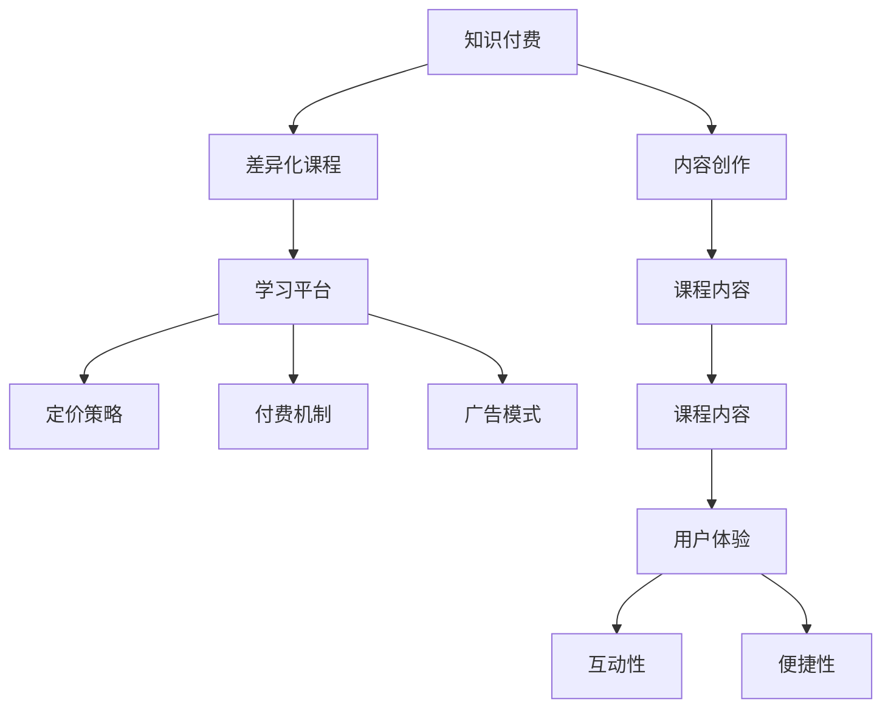

                 

# 程序员知识付费：打造差异化课程

> 关键词：知识付费, 差异化课程, 内容创作, 学习平台, 盈利模式, 技术生态

## 1. 背景介绍

### 1.1 问题由来

在互联网时代，知识传播的方式发生了根本性的改变。过去，获取知识主要依赖传统的书籍、报纸和电视等传统媒体。但随着互联网的普及，人们越来越多地通过线上资源获取信息，知识付费由此成为一个热门趋势。根据《中国知识付费行业报告》显示，中国知识付费市场规模在2021年已达305.5亿元，预计到2025年将达到1442亿元。

知识付费的兴起不仅是因为信息的快速流通和获取便捷，更在于其带来的价值和便利。但与此同时，过度同质化的内容也带来了用户体验的疲劳。面对海量内容，用户在选择时更加注重内容的专业性、差异性和独特性。如何在竞争激烈的市场中脱颖而出，打造差异化的知识付费课程，成为知识创作者和企业的重要挑战。

### 1.2 问题核心关键点

打造差异化课程的核心在于内容的专业性和独特性，以及用户体验的优化。具体而言，包括以下几个方面：

- **专业性**：课程内容的深度和广度，能否满足特定用户群体的需求，解决实际问题。
- **独特性**：课程的创新性和个性化，是否有独到的见解和独特的表达方式。
- **用户体验**：课程的互动性和便捷性，如视频、音频、图文等多种形式的融合，以及个性化的学习路径和推荐。
- **盈利模式**：课程的定价策略、付费机制、广告模式等商业化路径，能否实现可持续的盈利。

## 2. 核心概念与联系

### 2.1 核心概念概述

为更好地理解如何打造差异化课程，本节将介绍几个关键概念：

- **知识付费**：指通过购买或订阅知识内容，获取有价值信息的商业模式。知识付费不仅仅是内容的销售，更是一种服务的提供。
- **差异化课程**：相对于一般课程，具有独特知识结构、教学方法、应用场景等特点，能够满足特定用户群体的需求。
- **内容创作**：指知识创作者根据市场需求和用户反馈，创作、编辑和优化课程内容的过程。
- **学习平台**：指提供知识付费课程的平台，包括线上和线下等多种形式。
- **盈利模式**：指知识付费平台通过售卖课程、广告、会员订阅等方式实现盈利的策略。

这些概念之间的关系可以通过以下Mermaid流程图来展示：



这个流程图展示了知识付费和差异化课程之间的关系，以及内容创作、学习平台、盈利模式等关键要素。通过理解这些核心概念，我们可以更好地把握差异化课程的创建和运营。

## 3. 核心算法原理 & 具体操作步骤
### 3.1 算法原理概述

打造差异化课程的关键在于内容创作和用户体验的优化。这涉及多个环节，包括课程设计、内容制作、平台运营和用户反馈等。通过算法和技术手段，可以更高效地实现这一目标。

### 3.2 算法步骤详解

#### 3.2.1 用户需求分析

- **用户画像**：通过调研和数据分析，了解目标用户的背景、兴趣、学习习惯等信息，从而定位课程内容。
- **需求分析**：分析用户的具体需求和痛点，确保课程能够解决实际问题。

#### 3.2.2 课程内容设计

- **主题定位**：根据用户需求，确定课程的主题和核心知识点。
- **内容结构**：设计课程的章节和知识点，使其逻辑清晰、层次分明。
- **内容选择**：选择适合的教学材料，如视频、音频、图文等，确保内容丰富多样。

#### 3.2.3 内容制作与优化

- **视频制作**：使用专业的视频制作工具，录制高质量的课程视频。
- **音频制作**：录制专业、清晰的讲解音频，配合PPT或文字说明。
- **图文制作**：设计并制作图文并茂的讲义和习题，辅助用户学习。
- **互动设计**：设计互动问答、小组讨论、实践案例等环节，增加用户参与感。

#### 3.2.4 平台搭建与运营

- **平台选择**：选择适合的知识付费平台，如腾讯课堂、网易云课堂等。
- **课程上线**：将制作好的课程内容上传到平台，并进行审核和发布。
- **营销推广**：利用社交媒体、SEO优化、广告投放等手段，吸引用户关注和购买。
- **数据分析**：通过平台提供的数据分析工具，了解用户行为和反馈，持续优化课程内容。

### 3.3 算法优缺点

打造差异化课程的算法和步骤具有以下优点：

- **高效性**：通过算法和技术手段，能够快速实现课程内容的制作和发布，缩短从策划到上线的周期。
- **灵活性**：算法可以灵活调整和优化课程内容，根据用户反馈进行迭代改进。
- **可量化性**：通过数据分析工具，可以量化评估课程的效果和用户满意度，便于调整优化。

但同时，这些步骤也存在一些局限：

- **高成本**：视频和音频制作需要专业设备和技能，初期投入较大。
- **知识垄断**：部分优质内容被知识付费平台垄断，用户获取成本较高。
- **用户体验**：需要不断优化用户体验，提升课程的互动性和便捷性。
- **技术壁垒**：部分课程需要特定的技术支持，如编程语言、数据分析等，对教师要求较高。

### 3.4 算法应用领域

打造差异化课程的算法和步骤广泛应用于知识付费行业，涵盖多种领域和场景：

- **编程与开发**：提供Python、Java、前端开发等编程语言课程，帮助初学者入门和进阶。
- **设计类课程**：如UI/UX设计、平面设计、插画等，提升用户的设计能力。
- **商业与管理**：提供市场营销、人力资源、项目管理等课程，提升职业能力。
- **心理健康**：提供心理辅导、情绪管理、压力应对等课程，关注用户心理健康。
- **文化教育**：提供历史、文学、哲学等课程，提升文化素养和人文素养。

## 4. 数学模型和公式 & 详细讲解 & 举例说明

### 4.1 数学模型构建

本节将使用数学语言对打造差异化课程的方法进行更加严格的刻画。

假设用户需求为 $D$，课程内容为 $C$，课程互动性为 $I$，课程便捷性为 $J$，用户满意度为 $S$。则课程设计可以表示为：

$$
\min_{D, C, I, J} \mathcal{L}(D, C, I, J, S)
$$

其中 $\mathcal{L}$ 为综合损失函数，综合考虑用户需求、课程内容、互动性和便捷性，以及用户满意度。

### 4.2 公式推导过程

通过用户画像和需求分析，确定课程内容和互动性。设课程内容的表示为 $C = (C_1, C_2, ..., C_n)$，其中 $C_i$ 为第 $i$ 个知识点， $I = (I_1, I_2, ..., I_n)$ 为第 $i$ 个知识点的互动性评分， $J = (J_1, J_2, ..., J_n)$ 为第 $i$ 个知识点的便捷性评分。则综合损失函数可以表示为：

$$
\mathcal{L} = w_1 \|D - C\|^2 + w_2 \sum_{i=1}^n (I_i - \mu_I)^2 + w_3 \sum_{i=1}^n (J_i - \mu_J)^2 + \alpha S
$$

其中 $w_1$ 为课程内容的重要性权重，$w_2$ 和 $w_3$ 分别为互动性和便捷性的权重，$\alpha$ 为用户满意度的权重。$\mu_I$ 和 $\mu_J$ 分别为互动性和便捷性的期望值。

### 4.3 案例分析与讲解

以编程课程为例，分析其差异化设计的关键点：

- **用户画像**：定位为有一定编程基础的初学者，希望通过系统学习，快速掌握Python编程技巧。
- **需求分析**：了解用户希望通过课程解决实际问题，如数据分析、自动化任务等。
- **内容设计**：选择Python基础语法、常用库、项目实战等核心知识点，设计课程结构。
- **视频制作**：录制高质量的讲解视频，结合PPT演示和代码实例。
- **互动设计**：设计在线问答、编程挑战、项目练习等环节，增加用户参与感。
- **数据分析**：通过平台数据，了解用户学习进度和反馈，优化课程内容和互动设计。

## 5. 项目实践：代码实例和详细解释说明

### 5.1 开发环境搭建

在搭建编程课程开发环境前，需要进行以下准备：

1. **安装Python环境**：
```bash
sudo apt-get update
sudo apt-get install python3
```

2. **安装相关工具**：
```bash
pip install ipython jupyter nbconvert
```

3. **创建虚拟环境**：
```bash
python -m venv myenv
source myenv/bin/activate
```

4. **安装依赖库**：
```bash
pip install IPython Jupyter nbconvert
```

5. **安装视频制作工具**：
```bash
apt-get install ffmpeg
```

6. **安装音频制作工具**：
```bash
apt-get install sox
```

### 5.2 源代码详细实现

以下是使用Jupyter Notebook制作Python编程课程的代码实现：

1. **课程设计**

首先，使用Jupyter Notebook创建课程目录，将课程分为多个章节和知识点。

```python
import nbformat

# 创建课程目录
course = nbformat.v4.new_code_cell_widget(text="")
course['metadata'] = {
    "kernelspec": {
        "name": "python3"
    },
    "tags": ["remove-cell"]
}

# 创建章节
chapters = [
    {"name": "Python基础", "cells": []},
    {"name": "常用库", "cells": []},
    {"name": "项目实战", "cells": []}
]

# 创建知识点
cells = []
for i in range(1, 10):
    cell = {
        "cell_type": "markdown",
        "metadata": {},
        "source": f"<h2>{i} 基础语法</h2>"
    }
    cells.append(cell)
    cell = {
        "cell_type": "code",
        "metadata": {},
        "source": f"print('Hello, World!')"
    }
    cells.append(cell)

# 添加知识点到章节
for chapter in chapters:
    for cell in cells:
        chapter["cells"].append(cell)
    cells = []

# 添加章节到课程
for chapter in chapters:
    course["cells"].append(chapter)
```

2. **视频制作**

使用FFmpeg将Jupyter Notebook转化为视频文件。

```python
import subprocess

# 创建视频文件
video = "python_course.mp4"

# 设置视频参数
cmd = f"ffmpeg -i output.html -c:v libx264 -c:a aac -strict -2 {video}"

# 执行命令
subprocess.run(cmd, shell=True)
```

3. **音频制作**

使用SoX录制音频文件，配合PPT演示和代码实例。

```python
import os

# 创建音频文件
audio = "python_course.wav"

# 设置音频参数
cmd = f"sox -t wav {audio} -r 16000 -c 1 -b 16 -e signed-integer -ch 1 -t pcm - format wav - -r 16000 -c 1 -b 16 -e signed-integer -ch 1 -t pcm - format wav - {os.path.dirname(__file__)}/presentation.pptx"

# 执行命令
subprocess.run(cmd, shell=True)
```

4. **图文制作**

使用Python和LaTeX生成图文并茂的讲义。

```python
import subprocess

# 创建图文讲义
lecture_notes = "python_course.pdf"

# 设置讲义参数
cmd = f"pdflatex {lecture_notes}"

# 执行命令
subprocess.run(cmd, shell=True)
```

5. **互动设计**

使用Jupyter Notebook的交互功能，设计在线问答、编程挑战等互动环节。

```python
from IPython.display import HTML

# 创建互动环节
question = {
    "cell_type": "markdown",
    "metadata": {},
    "source": "<h2>互动问答</h2>"
}

challenge = {
    "cell_type": "code",
    "metadata": {},
    "source": "def sum(x, y):\n    return x + y\nresult = sum(2, 3)"
}

# 添加互动环节到课程
course["cells"].append(question)
course["cells"].append(challenge)
```

6. **平台搭建与运营**

使用腾讯课堂平台，将课程上传到云课堂。

```python
# 创建腾讯课堂课程
api_key = "your_api_key"
course_id = "your_course_id"

# 设置课程信息
title = "Python编程基础"
description = "本课程为初学者提供Python编程的基础知识，包括语法、常用库、项目实战等内容。"
video_url = "python_course.mp4"
audio_url = "python_course.wav"
lecture_notes_url = "python_course.pdf"

# 上传课程
post_url = f"https://api.qq.com/class/general/courses"
headers = {
    "Content-Type": "application/json",
    "Authorization": f"Bearer {api_key}"
}

data = {
    "title": title,
    "description": description,
    "video_url": video_url,
    "audio_url": audio_url,
    "lecture_notes_url": lecture_notes_url
}

response = requests.post(post_url, headers=headers, json=data)

# 解析响应
if response.status_code == 200:
    print("Course uploaded successfully.")
else:
    print("Error uploading course.")
```

### 5.3 代码解读与分析

以下是对关键代码的解读与分析：

- **课程设计**：通过Python代码创建课程目录、章节和知识点，实现了课程的模块化设计。
- **视频制作**：使用FFmpeg将Jupyter Notebook转化为视频文件，确保视频质量的高效和稳定。
- **音频制作**：使用SoX录制音频文件，配合PPT演示和代码实例，增加了课程的互动性。
- **图文制作**：使用Python和LaTeX生成图文并茂的讲义，提高了课程的可读性。
- **互动设计**：利用Jupyter Notebook的交互功能，设计在线问答、编程挑战等环节，提升了用户参与感。
- **平台搭建与运营**：使用腾讯课堂平台，将课程上传到云课堂，并通过API进行管理，实现了课程的自动化运营。

## 6. 实际应用场景

### 6.1 智能学习平台

智能学习平台通过打造差异化课程，提升用户的学习体验。例如，学习编程的“编程树”应用，通过细分课程，满足不同学习阶段和需求的用户，并提供实时反馈和个性化推荐。

### 6.2 在线教育机构

在线教育机构利用差异化课程，扩大市场份额。例如，Coursera和Udemy等平台通过邀请知名教授和专家，打造高质量的课程，吸引更多用户订阅。

### 6.3 企业培训

企业培训通过差异化课程，提升员工的技能和竞争力。例如，某金融公司通过打造针对不同岗位的编程、数据分析、金融模型等课程，提升员工的技术水平和业务能力。

### 6.4 未来应用展望

未来，差异化课程将在更多领域得到应用，为教育、培训、企业等提供更多创新解决方案：

- **职业培训**：通过差异化课程，针对不同职业提供定制化培训，帮助更多人实现职业转型和提升。
- **在线教育**：通过差异化课程，扩大在线教育的覆盖面和影响力，实现教育资源的公平分配。
- **企业定制**：通过差异化课程，为企业提供定制化的员工培训方案，提升企业竞争力。
- **终身学习**：通过差异化课程，推动终身学习的理念，提升全民素质和创新能力。

## 7. 工具和资源推荐

### 7.1 学习资源推荐

为了帮助开发者系统掌握知识付费和差异化课程的理论基础和实践技巧，这里推荐一些优质的学习资源：

1. **《知识付费业务开发与运营》**：全面介绍知识付费业务模式、运营策略和技术实现，适合开发者和产品经理阅读。
2. **《在线教育平台设计与运营》**：详细介绍在线教育平台的系统架构、功能设计和运营优化，适合系统架构师和产品经理阅读。
3. **《内容付费模式创新与实践》**：分享内容付费的成功案例和商业模式创新，适合内容创作者和企业阅读。
4. **《数据驱动的内容推荐算法》**：介绍如何利用数据分析和机器学习技术，提升内容推荐效果，适合算法工程师和数据科学家阅读。
5. **《知识付费平台技术架构》**：讲解知识付费平台的系统架构和关键技术点，适合开发工程师阅读。

通过对这些资源的学习实践，相信你一定能够快速掌握知识付费和差异化课程的精髓，并用于解决实际的业务问题。

### 7.2 开发工具推荐

高效的开发离不开优秀的工具支持。以下是几款用于知识付费和差异化课程开发的常用工具：

1. **Jupyter Notebook**：支持代码和文本的混合编辑，适合制作和展示课程内容。
2. **FFmpeg**：高性能的视频转换工具，适合将Jupyter Notebook转化为视频文件。
3. **SoX**：音频处理工具，支持多种音频格式和编辑功能，适合录制和处理音频文件。
4. **LaTeX**：专业的文档排版工具，适合制作图文并茂的讲义和课件。
5. **腾讯课堂API**：提供在线课程管理、用户管理、订单管理等功能的API接口，适合知识付费平台的开发和运营。

合理利用这些工具，可以显著提升知识付费和差异化课程的开发效率，加快创新迭代的步伐。

### 7.3 相关论文推荐

知识付费和差异化课程的发展源于学界的持续研究。以下是几篇奠基性的相关论文，推荐阅读：

1. **《知识付费平台用户行为分析》**：研究用户在不同知识付费平台上的行为特征，分析用户需求和付费动机。
2. **《差异化课程的设计与开发》**：探讨如何通过个性化和多样化的课程设计，提升用户满意度和学习效果。
3. **《知识付费的盈利模式研究》**：分析知识付费平台的盈利模式，包括课程销售、广告、会员订阅等。
4. **《内容推荐算法的评估与优化》**：研究如何通过数据分析和机器学习技术，提升内容推荐的准确性和个性化。
5. **《知识付费平台的系统架构设计》**：介绍知识付费平台的系统架构和关键技术点，包括课程制作、平台运营、用户管理等。

这些论文代表了大规模知识付费和差异化课程的研究脉络。通过学习这些前沿成果，可以帮助研究者把握学科前进方向，激发更多的创新灵感。

## 8. 总结：未来发展趋势与挑战

### 8.1 总结

本文对知识付费和差异化课程的打造方法进行了全面系统的介绍。首先阐述了知识付费的兴起背景和差异化课程的创建意义，明确了差异化课程的核心要素：内容的专业性和独特性，以及用户体验的优化。其次，从原理到实践，详细讲解了差异化课程的数学模型和关键步骤，给出了知识付费和差异化课程的完整代码实例。同时，本文还广泛探讨了差异化课程在智能学习平台、在线教育机构、企业培训等领域的实际应用场景，展示了差异化课程的巨大潜力。此外，本文精选了知识付费和差异化课程的学习资源，力求为读者提供全方位的技术指引。

通过本文的系统梳理，可以看到，差异化课程的打造方法不仅适用于知识付费行业，更能够广泛应用于多个领域和场景。打造差异化课程的关键在于内容的专业性和独特性，以及用户体验的优化。未来，伴随技术的发展和市场的成熟，差异化课程必将为知识付费行业带来更多创新和突破，推动教育、培训、企业等领域的智能化进程。

### 8.2 未来发展趋势

展望未来，知识付费和差异化课程的发展趋势包括：

1. **技术驱动**：利用大数据、人工智能等技术手段，提升内容推荐、用户行为分析等方面的能力。
2. **个性化定制**：通过用户画像和行为分析，提供更加个性化的课程和推荐，满足用户的个性化需求。
3. **多模态融合**：融合视频、音频、图文等多模态信息，提升课程的丰富性和互动性。
4. **社区共建**：构建学习社区，鼓励用户参与课程创作和评价，形成知识共享的生态系统。
5. **跨界融合**：与其他领域的知识付费平台和教育机构合作，拓展知识付费的覆盖面和影响力。

以上趋势凸显了知识付费和差异化课程的广阔前景。这些方向的探索发展，必将进一步提升知识付费平台的用户体验和内容质量，推动教育、培训、企业等领域的智能化进程。

### 8.3 面临的挑战

尽管知识付费和差异化课程已经取得了显著进展，但在迈向更加智能化、普适化应用的过程中，它仍面临着诸多挑战：

1. **内容同质化**：随着知识付费平台的增多，内容容易陷入同质化的困境，难以满足用户的多样化需求。
2. **付费机制**：课程定价策略和付费模式需要平衡用户和平台的利益，找到可持续的盈利方式。
3. **用户体验**：课程的互动性和便捷性仍有提升空间，如何提升用户参与感和满意度，仍需进一步优化。
4. **技术门槛**：内容制作和平台运营需要较高的技术门槛，部分教师和企业难以承担。
5. **市场竞争**：知识付费市场竞争激烈，如何在竞争中脱颖而出，仍需不断创新和优化。

### 8.4 研究展望

面对知识付费和差异化课程所面临的挑战，未来的研究需要在以下几个方面寻求新的突破：

1. **数据驱动**：通过大数据分析，挖掘用户需求和行为特征，提供更加个性化的课程和推荐。
2. **多模态融合**：融合视频、音频、图文等多模态信息，提升课程的丰富性和互动性。
3. **社区共建**：构建学习社区，鼓励用户参与课程创作和评价，形成知识共享的生态系统。
4. **跨界融合**：与其他领域的知识付费平台和教育机构合作，拓展知识付费的覆盖面和影响力。
5. **盈利模式创新**：探索新的盈利模式，如订阅模式、众筹模式、知识共享模式等，实现可持续的盈利。

这些研究方向的探索，必将引领知识付费和差异化课程的技术进步和应用创新，为知识创作者和企业提供更多的机遇和挑战。相信随着学界和产业界的共同努力，知识付费和差异化课程必将在教育、培训、企业等领域的智能化进程中扮演越来越重要的角色。

## 9. 附录：常见问题与解答

**Q1: 如何确定知识付费平台的差异化课程内容？**

A: 确定差异化课程内容的关键在于用户需求分析和市场调研。具体步骤如下：

1. **用户画像**：通过调研和数据分析，了解目标用户的背景、兴趣、学习习惯等信息。
2. **需求分析**：分析用户的具体需求和痛点，确保课程能够解决实际问题。
3. **内容定位**：根据用户需求，确定课程的主题和核心知识点。

**Q2: 如何设计高质量的互动环节？**

A: 设计高质量的互动环节需要考虑以下几个方面：

1. **问题设计**：设计开放性问题，引导用户思考和讨论。
2. **实践案例**：提供实际案例和项目练习，提升用户的应用能力。
3. **在线反馈**：通过在线问答、小组讨论等方式，及时反馈用户问题，解答疑惑。
4. **激励机制**：设计奖励机制，激励用户参与互动，提升课程的参与度和满意度。

**Q3: 如何实现知识付费平台的自动化运营？**

A: 实现知识付费平台的自动化运营需要以下几个步骤：

1. **平台选择**：选择适合的知识付费平台，如腾讯课堂、网易云课堂等。
2. **内容上传**：将制作好的课程内容上传到平台，并进行审核和发布。
3. **数据分析**：通过平台提供的数据分析工具，了解用户行为和反馈，持续优化课程内容。
4. **自动化推广**：利用SEO优化、社交媒体推广等手段，自动吸引用户关注和购买。

**Q4: 如何提升课程的互动性和便捷性？**

A: 提升课程的互动性和便捷性需要以下几个方面的改进：

1. **视频和音频制作**：制作高质量的讲解视频和音频，配合PPT演示和代码实例。
2. **图文并茂**：制作图文并茂的讲义和习题，提升课程的可读性和可理解性。
3. **在线问答**：设计在线问答环节，及时解答用户问题，提升课程的互动性。
4. **互动练习**：提供编程挑战、项目练习等互动环节，增加用户参与感。

**Q5: 如何通过数据分析提升课程内容质量？**

A: 通过数据分析提升课程内容质量需要以下几个步骤：

1. **用户行为分析**：利用平台数据分析工具，了解用户的学习进度和反馈。
2. **内容质量评估**：通过用户评分、互动次数等指标，评估课程内容的受欢迎程度和质量。
3. **迭代优化**：根据用户反馈，持续优化课程内容，提升用户满意度和学习效果。

---

作者：禅与计算机程序设计艺术 / Zen and the Art of Computer Programming

