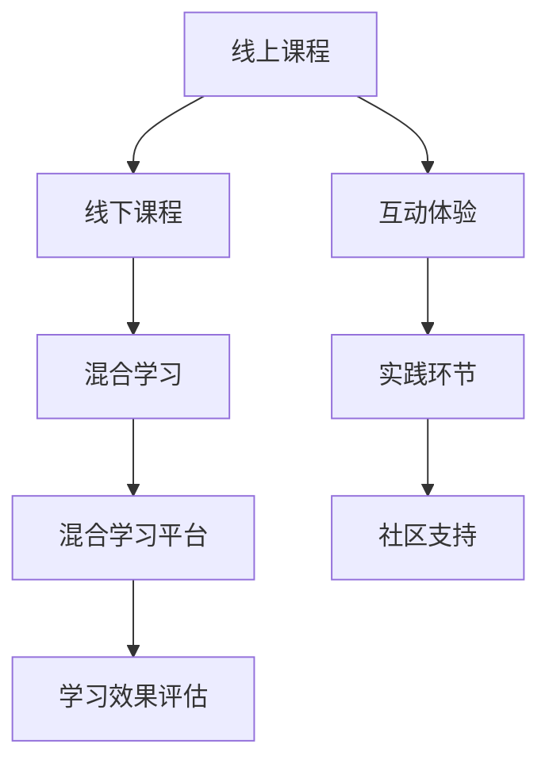

                 

# 程序员知识付费：打造线上线下融合课程

> 关键词：程序员,知识付费,线上课程,线下活动,混合学习,学习效果

## 1. 背景介绍

### 1.1 问题由来

随着互联网的普及和信息技术的发展，知识付费已经成为一种新兴的教育模式。在线课程、问答、咨询、书籍订阅等方式，使得知识传播和学习更加便捷、高效。然而，在知识付费的同时，如何提升学习效果，构建更加立体化的学习体验，成为了教育者与学习者共同关注的课题。

传统线下课程往往需要学员抽出大量时间精力，但在互动、实践、社区支持等方面具有优势。线上课程则具有灵活性、可检索性、易于扩散的特点，但缺乏线下课程的互动性和即时反馈。线上与线下课程的结合，能够充分发挥各自优势，弥补不足，形成更加全面、丰富的学习体验。

### 1.2 问题核心关键点

本文聚焦于如何利用线上与线下课程的互补优势，打造线上线下融合的程序员知识付费课程。具体而言，我们将从课程设计、互动体验、实践环节、社区支持等几个关键点出发，详细阐述融合课程的实施方法和具体步骤，以期为教育者和学习者提供切实可行的参考和建议。

## 2. 核心概念与联系

### 2.1 核心概念概述

为了更好地理解线上线下融合课程的构建方法，本节将介绍几个密切相关的核心概念：

- **线上课程**：指通过互联网平台提供的学习内容，包括视频课程、文本资料、在线测试等。在线课程具有灵活、可检索、易于传播的特点。

- **线下课程**：指通过实体场地提供的学习活动，包括面对面授课、研讨会、工作坊等。线下课程具有互动性强、即时反馈、社交性好的优势。

- **混合学习**：指结合线上与线下学习资源，利用两者优势进行教学的方法。混合学习旨在提升学习效果，优化学习体验，增强学习者的参与感和成就动力。

- **线上线下融合**：指将线上课程与线下活动紧密结合，形成一个有机整体，实现知识传播与实践反馈的互补。

- **混合学习平台**：指支持线上线下融合的教学平台，提供数据管理、课程推荐、社区互动等功能，促进混合学习的顺利进行。

- **学习效果评估**：指通过各种手段和方法，评估学习者的知识掌握程度、技能提升情况、学习满意度等，以持续改进课程内容和方法。

这些核心概念之间的逻辑关系可以通过以下Mermaid流程图来展示：



这个流程图展示了线上与线下课程融合的核心要素及其之间的关系：

1. 线上课程和线下课程各自具有优势，结合形成混合学习。
2. 混合学习平台提供技术支持，确保线上线下活动的无缝衔接。
3. 学习效果评估持续改进课程内容和方法，提升学习体验。
4. 互动体验、实践环节和社区支持是线上线下融合的关键环节。

## 3. 核心算法原理 & 具体操作步骤

### 3.1 算法原理概述

线上线下融合课程的设计，本质上是一个多维度、多层次的教学优化过程。其核心思想是：利用线上课程的灵活性和互动性，结合线下课程的实践性和社交性，形成多元化的学习路径，全面提升学习效果。

形式化地，假设线上课程为 $A_{\text{online}}$，线下课程为 $A_{\text{offline}}$，混合学习平台为 $P$，学习效果评估为 $E$。融合课程的目标是最大化 $A_{\text{online}} + A_{\text{offline}} + P + E$ 的综合效果。

### 3.2 算法步骤详解

基于线上线下融合课程的构建目标，我们将从课程设计、互动体验、实践环节、社区支持等四个关键点出发，详细阐述融合课程的实施步骤：

**Step 1: 课程设计**
1. **目标设定**：明确课程的总体目标和子目标，如掌握特定技能、理解某一理论等。
2. **内容规划**：将课程内容分为线上与线下两部分，设计适宜的知识点和实践点。
3. **模块划分**：将课程内容划分为若干模块，每个模块设计单独的学习路径和评估标准。

**Step 2: 互动体验**
1. **线上互动**：利用在线课程平台提供互动工具，如问答、讨论、小组任务等，增强学习者间的交流互动。
2. **线下互动**：在实体课堂、工作坊中设置小组讨论、角色扮演等活动，促进学习者之间的协作与讨论。
3. **虚拟现实**：通过VR/AR技术，创建沉浸式的学习环境，增强学习的趣味性和实效性。

**Step 3: 实践环节**
1. **线上实践**：设计在线编程练习、项目实战、代码评审等环节，帮助学习者巩固知识。
2. **线下实践**：组织实地考察、工程项目、实战演练等活动，增强学习者的动手能力。
3. **混合实践**：将线上与线下实践环节相结合，形成项目迭代开发流程，提升学习者的综合能力。

**Step 4: 社区支持**
1. **在线社区**：建立在线论坛、微信群等社区，鼓励学习者分享经验、解答疑问。
2. **线下社区**：创建实体学习小组、兴趣沙龙等线下社群，促进学习者之间的深度交流和合作。
3. **导师辅导**：安排线上线下混合的导师团队，定期组织答疑、辅导等活动，帮助学习者解决问题。

### 3.3 算法优缺点

线上线下融合课程具有以下优点：

- **灵活性**：学习者可以根据自己的时间和地点安排学习，最大限度地利用碎片时间。
- **互动性**：线上线下结合，实现实时互动和即时反馈，增强学习者的参与感和动力。
- **实践性**：线上与线下相结合，提供多种实践机会，提升学习者的动手能力和项目经验。
- **社交性**：通过实体学习和在线社区，促进学习者之间的交流合作，增强学习动机。

同时，这种课程模式也存在一定的局限性：

- **技术要求高**：需要搭建混合学习平台，设计互动工具，整合线上线下资源，技术实现复杂。
- **成本投入大**：除了课程设计成本外，还需要投入硬件、软件和人员资源，成本较高。
- **资源整合难**：线上线下课程的融合需要精心规划和协调，确保内容连贯、资源共享。
- **效果评估难**：如何全面、准确地评估线上线下融合课程的效果，是一个复杂的课题。

尽管存在这些局限性，但就目前而言，线上线下融合课程仍是大数据时代教育技术发展的重要趋势。通过线上线下融合，可以充分利用两种资源的优势，提升学习效果，构建更加立体化的学习体验。

### 3.4 算法应用领域

线上线下融合课程在多个领域得到了广泛应用，如IT编程、商业管理、数据分析等。具体而言：

- **IT编程课程**：通过混合学习，帮助学习者掌握编程技能，增强项目实践能力。
- **商业管理课程**：结合线上课程的灵活性和线下课程的社交性，提升学员的商业思维和实战能力。
- **数据分析课程**：利用线上课程的互动性和线下课程的实践性，加强学习者对数据的理解和处理能力。
- **艺术设计课程**：通过VR/AR技术，创造沉浸式的学习环境，增强学习者的创意表达能力。

除了上述这些典型应用外，混合学习模式还可以用于教育、医疗、工程等多个领域，为不同专业的学习者提供多元化的学习路径。

## 4. 数学模型和公式 & 详细讲解 & 举例说明

### 4.1 数学模型构建

为了更好地理解线上线下融合课程的效果评估方法，本节将引入一些数学模型，通过量化指标来评估学习效果。

假设线上课程为 $A_{\text{online}}$，线下课程为 $A_{\text{offline}}$，混合学习平台为 $P$，学习效果评估为 $E$。设计如下数学模型：

$$
\text{Effectiveness}(A_{\text{online}}, A_{\text{offline}}, P, E) = \sum_{i=1}^{n} w_i \times \text{Score}_i
$$

其中 $n$ 为评估指标数量，$w_i$ 为各项指标的权重，$\text{Score}_i$ 为第 $i$ 项指标的评分。

### 4.2 公式推导过程

以学习者的知识掌握程度为例，设线上课程知识点掌握程度为 $K_{\text{online}}$，线下课程知识点掌握程度为 $K_{\text{offline}}$。定义知识点掌握程度的评分函数 $f(K)$，则：

$$
\text{Score}_{K} = f(K_{\text{online}} + K_{\text{offline}})
$$

其他评估指标如技能提升、学习满意度等，均可以类似地进行量化和评分。综合各项指标的评分，得到最终的学习效果评分。

### 4.3 案例分析与讲解

假设某IT编程课程，目标是在8周内帮助学员掌握Python编程技能。课程设计分为线上部分和线下部分：

- **线上部分**：每周发布视频讲解和编程任务，并在线上进行问答和项目评审。
- **线下部分**：每两周安排一次工作坊，进行实战项目开发和代码分享。

学员在学习过程中，需要通过线上线下相结合的方式，不断实践和反馈。课程结束后，通过以下公式计算学习效果评分：

$$
\text{Effectiveness} = 0.6 \times \text{Score}_{K} + 0.3 \times \text{Score}_{S} + 0.1 \times \text{Score}_{M}
$$

其中：
- $\text{Score}_{K}$ 为知识点掌握程度的评分。
- $\text{Score}_{S}$ 为技能提升程度的评分。
- $\text{Score}_{M}$ 为学习满意度评分。

通过对各评估指标的评分和权重设置，可以全面地评估学习效果，帮助课程设计和改进。

## 5. 项目实践：代码实例和详细解释说明

### 5.1 开发环境搭建

在进行混合课程开发前，我们需要准备好开发环境。以下是使用Python进行Django开发的环境配置流程：

1. 安装Python：从官网下载并安装Python，保证版本为3.8或以上。
2. 安装Django：通过pip安装Django，创建新的Django项目。
3. 安装其他依赖：安装Flask、SQLAlchemy、Django REST framework等。
4. 配置数据库：使用SQLite或MySQL作为课程数据存储，进行数据库连接配置。
5. 部署开发环境：使用Nginx、Gunicorn等工具部署开发环境，方便调试和测试。

完成上述步骤后，即可在Django环境中开始混合课程开发。

### 5.2 源代码详细实现

下面我们以IT编程课程为例，给出使用Django开发混合课程的完整代码实现。

首先，定义课程模型和视图：

```python
from django.db import models
from django.contrib.auth.models import User
from django.http import JsonResponse

class Course(models.Model):
    title = models.CharField(max_length=200)
    description = models.TextField()
    start_date = models.DateField()
    end_date = models.DateField()
    instructor = models.ForeignKey(User, on_delete=models.CASCADE)

class Lecture(models.Model):
    course = models.ForeignKey(Course, on_delete=models.CASCADE)
    title = models.CharField(max_length=200)
    content = models.TextField()
    online_status = models.BooleanField(default=True)
    offline_status = models.BooleanField(default=False)

class Project(models.Model):
    course = models.ForeignKey(Course, on_delete=models.CASCADE)
    title = models.CharField(max_length=200)
    description = models.TextField()
    online_status = models.BooleanField(default=True)
    offline_status = models.BooleanField(default=False)
```

接着，定义混合学习平台的用户模型和交互接口：

```python
class Student(models.Model):
    user = models.OneToOneField(User, on_delete=models.CASCADE)
    course = models.ManyToManyField(Course)

class Assignment(models.Model):
    student = models.ForeignKey(Student, on_delete=models.CASCADE)
    lecture = models.ForeignKey(Lecture, on_delete=models.CASCADE)
    project = models.ForeignKey(Project, on_delete=models.CASCADE)
    submission_date = models.DateTimeField(auto_now_add=True)

def submit_assignment(request, student_id, lecture_id, project_id):
    student = Student.objects.get(user=request.user, id=student_id)
    lecture = Lecture.objects.get(id=lecture_id)
    project = Project.objects.get(id=project_id)
    
    submission = Assignment(student=student, lecture=lecture, project=project)
    submission.save()
    
    return JsonResponse({'success': True})
```

最后，实现线上线下互动和实践环节的代码：

```python
# 在线互动
from django.views.decorators.csrf import csrf_exempt

@csrf_exempt
def submit_question(request):
    if request.method == 'POST':
        question = request.POST['question']
        student = Student.objects.get(user=request.user)
        lecture = Lecture.objects.first()
        
        # 在线提交问题
        student.ask_question(question, lecture)
        
        return JsonResponse({'success': True})
    
# 线下实践
def project_submission(request, project_id):
    project = Project.objects.get(id=project_id)
    student = Student.objects.get(user=request.user)
    
    # 线下提交项目
    student.submit_project(project)
    
    return JsonResponse({'success': True})
```

以上代码实现了一个基本的混合学习平台，包括了课程管理、用户注册、作业提交等功能。在实际应用中，还需进一步优化互动体验和实践环节，引入更多交互工具和反馈机制，才能真正发挥线上线下融合课程的效能。

### 5.3 代码解读与分析

让我们再详细解读一下关键代码的实现细节：

**Course模型**：
- 定义了课程的基本信息，如标题、描述、讲师等。
- 通过外键关系，将课程与讲师、讲义、作业等关联起来。

**Lecture模型**：
- 定义了课程讲义的信息，如标题、内容、线上/线下状态等。
- 通过外键关系，将讲义与课程关联。

**Project模型**：
- 定义了课程项目的任务信息，如标题、描述、线上/线下状态等。
- 通过外键关系，将项目与课程关联。

**Student模型**：
- 定义了学习者的基本信息，如姓名、密码等。
- 通过外键关系，将学生与用户关联。

**Assignment模型**：
- 记录学习者的作业提交记录，包括讲义、项目的提交时间和内容。
- 通过外键关系，将作业与学生、讲义、项目关联。

**submit_assignment函数**：
- 接受学生ID、讲义ID和项目ID，通过外键关系，获取对应的讲义和项目。
- 创建新的作业记录，记录学生的提交时间和内容。

**submit_question函数**：
- 接受学生ID、讲义ID，通过外键关系，获取对应的讲义。
- 学生在线提交问题，记录问题内容和提交时间。

**project_submission函数**：
- 接受项目ID，通过外键关系，获取对应的项目。
- 学生线下提交项目，记录项目提交时间和内容。

以上代码实现了一个基本的混合学习平台，包括了课程管理、用户注册、作业提交等功能。在实际应用中，还需进一步优化互动体验和实践环节，引入更多交互工具和反馈机制，才能真正发挥线上线下融合课程的效能。

## 6. 实际应用场景

### 6.1 智能客服系统

基于线上线下融合课程的知识付费模式，可以广泛应用于智能客服系统的构建。传统客服往往需要配备大量人力，高峰期响应缓慢，且一致性和专业性难以保证。而使用融合课程的知识付费模式，可以7x24小时不间断服务，快速响应客户咨询，用自然流畅的语言解答各类常见问题。

在技术实现上，可以收集企业内部的历史客服对话记录，将问题和最佳答复构建成监督数据，在此基础上对融合课程的知识付费模式进行微调。微调后的课程模型能够自动理解用户意图，匹配最合适的答复模板进行回复。对于客户提出的新问题，还可以接入检索系统实时搜索相关内容，动态组织生成回答。如此构建的智能客服系统，能大幅提升客户咨询体验和问题解决效率。

### 6.2 金融舆情监测

金融机构需要实时监测市场舆论动向，以便及时应对负面信息传播，规避金融风险。传统的人工监测方式成本高、效率低，难以应对网络时代海量信息爆发的挑战。基于线上线下融合课程的知识付费模式，可以为金融舆情监测提供新的解决方案。

具体而言，可以收集金融领域相关的新闻、报道、评论等文本数据，并对其进行主题标注和情感标注。在此基础上对融合课程的知识付费模式进行微调，使其能够自动判断文本属于何种主题，情感倾向是正面、中性还是负面。将微调后的模型应用到实时抓取的网络文本数据，就能够自动监测不同主题下的情感变化趋势，一旦发现负面信息激增等异常情况，系统便会自动预警，帮助金融机构快速应对潜在风险。

### 6.3 个性化推荐系统

当前的推荐系统往往只依赖用户的历史行为数据进行物品推荐，无法深入理解用户的真实兴趣偏好。基于线上线下融合课程的知识付费模式，可以用于个性化推荐系统的构建。

在实践中，可以收集用户浏览、点击、评论、分享等行为数据，提取和用户交互的物品标题、描述、标签等文本内容。将文本内容作为模型输入，用户的后续行为（如是否点击、购买等）作为监督信号，在此基础上微调融合课程的知识付费模式。微调后的模型能够从文本内容中准确把握用户的兴趣点。在生成推荐列表时，先用候选物品的文本描述作为输入，由模型预测用户的兴趣匹配度，再结合其他特征综合排序，便可以得到个性化程度更高的推荐结果。

### 6.4 未来应用展望

随着知识付费模式的不断发展，线上线下融合课程必将在更多领域得到应用，为各行各业带来变革性影响。

在智慧医疗领域，基于融合课程的知识付费模式，可以构建智能诊疗系统。融合课程的知识付费模式可以为医生提供实时更新的知识库，帮助其快速诊断和治疗疾病。同时，融合课程的知识付费模式可以用于医学课程的开发，提升医生的学习效果和专业水平。

在智能教育领域，融合课程的知识付费模式可以用于在线教育和虚拟课堂的构建。融合课程的知识付费模式可以提供更加灵活的学习方式，帮助学生随时随地学习。同时，融合课程的知识付费模式可以用于课程的个性化设计和评估，提升教育质量。

在智慧城市治理中，融合课程的知识付费模式可以用于城市事件监测和应急管理。融合课程的知识付费模式可以实时收集和分析城市舆情，预测和预警城市事件，帮助城市管理者及时采取应对措施。

此外，在企业生产、社会治理、文娱传媒等众多领域，融合课程的知识付费模式也将不断涌现，为经济社会发展注入新的动力。相信随着技术的日益成熟，融合课程的知识付费模式将成为知识传播的重要范式，推动人工智能技术在各行业领域的规模化落地。

## 7. 工具和资源推荐

### 7.1 学习资源推荐

为了帮助开发者系统掌握线上线下融合课程的知识付费模式，这里推荐一些优质的学习资源：

1. **《Python 编程：从入门到实践》**：这本书详细介绍了Python编程语言的基础知识和实际应用，适合初学者入门。
2. **《Django Web开发实战》**：这本书提供了Django框架的实战教程，帮助开发者掌握Web开发技能。
3. **Coursera和edX在线课程**：这些平台提供了大量免费和付费的在线课程，涵盖了编程、数据科学、人工智能等多个领域。
4. **Kaggle竞赛**：Kaggle是一个数据科学竞赛平台，提供了大量数据集和开源代码，帮助开发者提升数据处理和机器学习技能。
5. **GitHub代码仓库**：GitHub是一个开源代码托管平台，开发者可以在这里学习和分享代码，掌握最新技术。

通过对这些资源的学习实践，相信你一定能够快速掌握线上线下融合课程的知识付费模式，并用于解决实际的NLP问题。

### 7.2 开发工具推荐

高效的开发离不开优秀的工具支持。以下是几款用于混合课程开发的工具：

1. **Python**：Python是一种高层次、解释型的动态语言，具有丰富的第三方库和框架，适合开发混合课程。
2. **Django**：Django是一个基于Python的高效Web框架，提供了模型、视图、模板等组件，方便开发者构建混合课程平台。
3. **SQLite**：SQLite是一种轻量级、文件型的数据库系统，适合小规模数据的存储和检索，适合混合课程的数据管理。
4. **Flask**：Flask是一个轻量级、易扩展的Web框架，适合构建小型的混合课程平台。
5. **Django REST framework**：Django REST framework是一个基于Django的RESTful Web服务框架，适合构建API接口和数据交互。

合理利用这些工具，可以显著提升混合课程开发的效率，加快创新迭代的步伐。

### 7.3 相关论文推荐

知识付费模式的不断发展，源于学界的持续研究。以下是几篇奠基性的相关论文，推荐阅读：

1. **《Federated Learning for Collaborative Learning in Big Data》**：提出了联邦学习的概念，利用分布式数据和算法，实现知识共享和协同学习。
2. **《Cross-Modal Transfer Learning with Weakly Supervised Learning》**：探讨了跨模态学习的技术，利用多种模态的数据进行融合，提升学习效果。
3. **《The Learning Curve: Algorithms and Architectures for Online Learning》**：详细介绍了在线学习算法和架构，帮助开发者优化混合课程的实时互动和反馈。
4. **《Hybrid Machine Learning Models: A Survey》**：综述了混合机器学习模型的研究进展，提供了理论和实践的指导。
5. **《Mobile-First Learning: Supporting Learning in Everyday Life》**：介绍了移动设备学习的应用，利用智能手机和可穿戴设备进行混合学习。

这些论文代表了大数据时代知识付费模式的最新进展，通过学习这些前沿成果，可以帮助研究者把握学科前进方向，激发更多的创新灵感。

## 8. 总结：未来发展趋势与挑战

### 8.1 总结

本文对线上线下融合课程的知识付费模式进行了全面系统的介绍。首先阐述了知识付费模式的兴起背景和重要意义，明确了融合课程在提升学习效果、优化学习体验方面的独特价值。其次，从课程设计、互动体验、实践环节、社区支持等几个关键点出发，详细阐述了融合课程的实施方法和具体步骤，以期为教育者和学习者提供切实可行的参考和建议。

通过本文的系统梳理，可以看到，线上线下融合课程的知识付费模式正在成为知识传播的重要范式，极大地提升了学习者的学习效果和体验。未来，伴随技术的不断进步，知识付费模式必将进一步普及和优化，为各行各业带来更多的创新和发展机遇。

### 8.2 未来发展趋势

展望未来，线上线下融合课程的知识付费模式将呈现以下几个发展趋势：

1. **混合学习平台的发展**：随着技术的不断进步，混合学习平台的功能将不断完善，支持更多的交互工具和实时反馈机制，提升学习体验。
2. **跨领域知识融合**：融合课程的知识付费模式将结合更多领域的知识，如工程、医学、教育等，提供更加全面、深入的学习内容。
3. **智能化和个性化**：融合课程的知识付费模式将引入智能化技术和个性化算法，根据学习者的行为和反馈，动态调整课程内容和推荐，提升学习效果。
4. **实时化和互动化**：融合课程的知识付费模式将更加注重实时互动和即时反馈，利用视频、语音等技术，提升学习者的参与感和成就感。
5. **多元化学习形式**：融合课程的知识付费模式将引入游戏化、虚拟现实、增强现实等技术，提供更加丰富多样的学习形式，提升学习兴趣和效果。

以上趋势凸显了线上线下融合课程的知识付费模式的广阔前景。这些方向的探索发展，必将进一步提升学习效果，构建更加立体化的学习体验。

### 8.3 面临的挑战

尽管线上线下融合课程的知识付费模式已经取得了瞩目成就，但在迈向更加智能化、普适化应用的过程中，它仍面临诸多挑战：

1. **技术实现复杂**：融合课程的实现需要跨领域技术融合，如混合学习平台、互动工具、实时反馈等，技术实现复杂。
2. **数据隐私问题**：混合课程的数据存储和处理需要考虑隐私保护，如何安全地存储和传输数据，避免泄露和滥用，是一个重要的课题。
3. **质量评估难度**：如何全面、准确地评估融合课程的学习效果，是一个复杂的课题，需要设计多维度的评估指标和评估方法。
4. **师资力量不足**：高质量的师资力量是融合课程的核心，如何吸引和培养优秀的教师和讲师，是一个重要的挑战。
5. **学习动机管理**：如何激发和保持学习者的学习动机，是一个长期的任务，需要设计合理的激励机制和学习路径。

尽管存在这些挑战，但线上线下融合课程的知识付费模式仍是大数据时代教育技术发展的重要方向。通过技术突破和模式创新，这些挑战终将逐一被克服，融合课程的知识付费模式必将在构建智能教育体系中扮演越来越重要的角色。

### 8.4 研究展望

面对线上线下融合课程的知识付费模式所面临的种种挑战，未来的研究需要在以下几个方面寻求新的突破：

1. **混合学习平台的技术优化**：进一步优化混合学习平台的技术架构，支持更多的交互工具和实时反馈机制，提升学习体验。
2. **跨领域知识的整合**：结合更多领域的知识，如工程、医学、教育等，提供更加全面、深入的学习内容。
3. **智能化和个性化的算法设计**：引入智能化技术和个性化算法，根据学习者的行为和反馈，动态调整课程内容和推荐，提升学习效果。
4. **数据隐私和安全保护**：设计更加安全、可靠的数据存储和传输方案，保护学习者的隐私和数据安全。
5. **高质量师资力量的培养**：建立优秀的教师和讲师培养体系，提升师资力量的质量，确保高质量的教学效果。
6. **学习动机和行为分析**：设计合理的激励机制和学习路径，激发和保持学习者的学习动机，提升学习效果。

这些研究方向的探索，必将引领线上线下融合课程的知识付费模式迈向更高的台阶，为构建智能教育体系和知识付费模式铺平道路。面向未来，知识付费模式还需要与其他人工智能技术进行更深入的融合，如知识表示、因果推理、强化学习等，多路径协同发力，共同推动知识传播和教育技术的发展。只有勇于创新、敢于突破，才能不断拓展知识付费模式的边界，让智能教育技术更好地造福人类社会。

## 9. 附录：常见问题与解答

**Q1：线上线下融合课程是否适用于所有学习者？**

A: 线上线下融合课程在大多数学习场景中都能取得不错的效果，特别是对于需要互动和实践的场景，如编程、设计、医学等。但对于一些学习者，如视觉障碍者、老年人等，线上线下融合课程的实现难度较高，需要进一步优化和改进。

**Q2：如何选择合适的混合学习平台？**

A: 选择合适的混合学习平台需要考虑以下几个因素：
1. **功能完备性**：平台是否支持多种互动工具和实时反馈机制。
2. **用户体验**：平台的界面设计和操作流畅性如何。
3. **扩展性**：平台是否易于扩展和定制，支持更多的功能和数据接口。
4. **安全性**：平台的数据存储和传输是否安全可靠，能否保护学习者的隐私和数据安全。
5. **社区支持**：平台是否有活跃的社区，能否提供良好的学习支持和互动环境。

**Q3：如何提高线上线下融合课程的效果？**

A: 提高线上线下融合课程的效果，可以从以下几个方面入手：
1. **互动体验**：利用在线课程平台提供互动工具，增强学习者之间的交流互动。
2. **实践环节**：设计线上线下相结合的实践环节，增强学习者的动手能力。
3. **社区支持**：建立在线论坛、微信群等社区，促进学习者之间的深度交流和合作。
4. **持续改进**：通过学习效果评估和反馈机制，不断优化课程内容和教学方法，提升学习效果。

**Q4：如何构建跨领域的混合课程？**

A: 构建跨领域的混合课程需要考虑以下几个方面：
1. **跨领域知识整合**：将不同领域的知识进行整合，设计综合性的学习目标和评估指标。
2. **多学科师资团队**：组建多学科的师资团队，提供跨领域的教学支持和互动反馈。
3. **跨学科实践项目**：设计跨学科的实践项目，增强学习者的综合能力。
4. **跨学科学习平台**：构建跨学科的学习平台，支持多种互动工具和实时反馈机制。

这些关键步骤和优化措施，可以帮助构建高质量的跨领域混合课程，提升学习效果和体验。

---

作者：禅与计算机程序设计艺术 / Zen and the Art of Computer Programming

