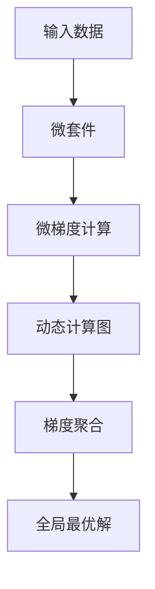

                 

# 第02章 Micrograd 机器学习与反向传播

> 关键词：机器学习,反向传播,梯度下降,微梯度,微套件

## 1. 背景介绍

### 1.1 问题由来
在机器学习领域，反向传播（Backpropagation）是一种用于训练神经网络的常见技术。其核心思想是通过链式法则，从输出层的误差逆向计算到输入层的误差，并据此调整网络权重，从而最小化预测误差。这一过程需要反复迭代，直到达到最优解。

然而，随着深度学习模型的复杂性不断增加，反向传播的计算复杂度和内存消耗也在迅速上升。同时，大规模数据集的获取和标注也面临着成本和效率的问题。这些问题都严重限制了机器学习技术的普及和应用。

为了应对这些挑战，近年来出现了一种新型的机器学习范式，即微套件（Micrograd）。Micrograd通过简化计算过程、优化内存管理、利用微梯度技术等手段，大幅提升了机器学习算法的效率和效果，成为当前研究的热点。

### 1.2 问题核心关键点
Micrograd的核心理念是通过微套件的方式，实现机器学习算法的轻量化和高效化。其主要特点包括：

- 微套件：将复杂算法拆分为多个小步骤，每个步骤只处理很小一部分数据，从而减少内存占用和计算量。
- 微梯度：通过计算每一步的梯度，逐步逼近全局最优解，避免了直接计算梯度的巨大开销。
- 动态化：微套件可以根据输入数据动态调整计算图，优化内存和计算资源的使用。
- 可扩展性：微套件可以灵活组合，适应各种复杂度不同的机器学习任务。

这些特点使得Micrograd在深度学习、强化学习、图像识别、自然语言处理等众多领域中得到了广泛的应用，显著提升了模型的训练效率和效果。

### 1.3 问题研究意义
研究Micrograd的微套件和微梯度技术，对于推动机器学习算法的进一步发展，提升模型的训练效率和效果，具有重要的理论和实践意义：

1. 加速算法训练。Micrograd通过微套件和微梯度技术，可以将复杂算法分解为多个小步骤，逐步逼近最优解，大大降低了计算复杂度。
2. 降低内存消耗。微套件可以在处理小批量数据时，动态调整内存使用，避免内存溢出和浪费。
3. 提升模型效果。微梯度技术可以更好地利用每一步的梯度信息，避免直接计算梯度的巨大开销，提高模型收敛速度和效果。
4. 增强算法灵活性。微套件可以灵活组合，适应各种不同的任务和数据，拓展了机器学习算法的使用范围。
5. 优化资源管理。微套件可以通过动态调整计算图，优化内存和计算资源的使用，提升系统性能。

Micrograd技术的应用，不仅为机器学习算法带来了新的发展方向，也为实际应用场景中机器学习算法的实现提供了新的思路和方法。

## 2. 核心概念与联系

### 2.1 核心概念概述

为了更好地理解Micrograd的原理和实现，本节将介绍几个关键概念：

- 微套件(Microkit)：将复杂算法分解为多个小步骤，每个步骤只处理很小一部分数据，从而减少内存占用和计算量。
- 微梯度(Micrograd)：通过计算每一步的梯度，逐步逼近全局最优解，避免了直接计算梯度的巨大开销。
- 动态计算图：根据输入数据动态调整计算图，优化内存和计算资源的使用。
- 梯度聚合（Gradient Aggregation）：将多步微梯度的累加，得到每一步的梯度信息，从而逼近全局最优解。

这些核心概念之间的逻辑关系可以通过以下Mermaid流程图来展示：



这个流程图展示了大规模机器学习算法的主要步骤：

1. 输入数据首先经过微套件处理，减少内存占用和计算量。
2. 微梯度计算逐步逼近全局最优解，避免了直接计算梯度的巨大开销。
3. 动态计算图根据输入数据动态调整，优化内存和计算资源的使用。
4. 梯度聚合将多步微梯度的累加，得到每一步的梯度信息，逼近全局最优解。

这些概念共同构成了微套件和微梯度技术的框架，使得大规模机器学习算法可以高效地运行在资源有限的设备上，同时也提升了算法的收敛速度和效果。

## 3. 核心算法原理 & 具体操作步骤
### 3.1 算法原理概述

Micrograd算法基于微套件和微梯度技术，是一种高效的机器学习训练范式。其核心思想是：将复杂算法拆分为多个小步骤，每个步骤只处理很小一部分数据，通过微梯度逐步逼近全局最优解，从而提升模型的训练效率和效果。

假设有一个复杂的机器学习模型，输入为 $x$，输出为 $y$，损失函数为 $L(y, \hat{y})$。在传统的反向传播算法中，我们需要对整个数据集进行一次前向传播和一次反向传播，计算出损失函数对输入 $x$ 的梯度，并据此调整模型参数。然而，这样的计算开销非常大，尤其是在大规模数据集和高维模型中。

Micrograd算法通过微套件和微梯度技术，将整个算法拆分为多个小步骤，每个步骤只处理一小部分数据，计算每一步的微梯度，逐步逼近全局最优解。具体步骤如下：

1. 微套件处理：将输入数据 $x$ 分成多个小批，每个小批只处理一小部分数据。
2. 微梯度计算：对每个小批进行前向传播，计算损失函数对模型的梯度，并记录中间结果。
3. 动态计算图：根据每个小批的中间结果动态调整计算图，优化内存和计算资源的使用。
4. 梯度聚合：将所有小批的微梯度累加，得到每一步的梯度信息。
5. 模型更新：根据每一步的梯度信息，调整模型参数。

通过这样的流程，Micrograd算法可以大幅降低计算复杂度和内存消耗，同时提升模型的训练效率和效果。

### 3.2 算法步骤详解

以下将详细介绍Micrograd算法的具体步骤：

**Step 1: 微套件处理**

将输入数据 $x$ 分成多个小批，每个小批只处理一小部分数据。例如，可以将数据集 $D$ 分成 $K$ 个批 $D_1, D_2, \ldots, D_K$，每个批的大小为 $n$，即 $D_i = \{x_i^{(k)}\}_{i=1}^n$。

**Step 2: 微梯度计算**

对每个小批 $D_i$ 进行前向传播，计算损失函数对模型的梯度，并记录中间结果。假设模型为 $M(x; \theta)$，输出为 $y_i = M(x_i^{(k)}; \theta)$，则损失函数对模型的梯度为：

$$
\nabla_{\theta} L(y_i, \hat{y_i}) = \nabla_{\theta} L(M(x_i^{(k)}; \theta), y_i)
$$

将所有小批的微梯度累加，得到总梯度：

$$
\nabla_{\theta} L(D) = \sum_{i=1}^K \nabla_{\theta} L(y_i, \hat{y_i})
$$

**Step 3: 动态计算图**

根据每个小批的中间结果动态调整计算图，优化内存和计算资源的使用。例如，可以采用动态神经网络（Dynamic Neural Network）的架构，根据小批的数据动态调整网络结构和计算图。

**Step 4: 梯度聚合**

将所有小批的微梯度累加，得到每一步的梯度信息。例如，可以采用梯度聚合算法（Gradient Aggregation），将所有小批的微梯度累加，得到每一步的梯度信息。

**Step 5: 模型更新**

根据每一步的梯度信息，调整模型参数。例如，可以采用梯度下降算法（Gradient Descent），调整模型参数 $\theta$：

$$
\theta \leftarrow \theta - \eta \nabla_{\theta} L(D)
$$

其中 $\eta$ 为学习率，控制参数更新的幅度。

### 3.3 算法优缺点

Micrograd算法具有以下优点：

1. 计算复杂度低。将复杂算法拆分为多个小步骤，每个步骤只处理很小一部分数据，减少了内存占用和计算量。
2. 训练效率高。通过微梯度逐步逼近全局最优解，避免了直接计算梯度的巨大开销，提高了模型收敛速度。
3. 动态计算图优化内存。根据输入数据动态调整计算图，优化内存和计算资源的使用，提升了系统性能。

然而，Micrograd算法也存在一些缺点：

1. 模型复杂度高。将复杂算法拆分为多个小步骤，增加了模型的复杂度和维护成本。
2. 微梯度计算精度低。微梯度计算只处理小批数据，可能导致微梯度的精度较低，影响模型效果。
3. 参数更新策略复杂。需要选择合适的微套件和梯度聚合算法，才能保证模型收敛到最优解。

尽管存在这些局限性，但Micrograd算法仍是大规模机器学习算法的有效范式。未来相关研究的重点在于如何进一步降低计算复杂度，提高微梯度的精度，简化参数更新策略，以便更好地应用于实际应用场景。

### 3.4 算法应用领域

Micrograd算法在机器学习领域得到了广泛的应用，涵盖以下几个主要领域：

- 深度学习：Micrograd算法可以应用于各种类型的深度学习模型，如卷积神经网络（CNN）、循环神经网络（RNN）、生成对抗网络（GAN）等。
- 强化学习：Micrograd算法可以应用于强化学习中的策略优化问题，如Q-learning、SARSA等。
- 自然语言处理：Micrograd算法可以应用于自然语言处理中的语言模型训练、情感分析、机器翻译等任务。
- 计算机视觉：Micrograd算法可以应用于计算机视觉中的图像分类、目标检测、图像生成等任务。
- 时间序列预测：Micrograd算法可以应用于时间序列预测中的回归、分类、序列生成等任务。

除了以上领域，Micrograd算法还可以应用于任何需要高效、实时、高精度机器学习任务的场合，为实际应用场景提供了新的解决方案。

## 4. 数学模型和公式 & 详细讲解  
### 4.1 数学模型构建

假设有一个复杂的机器学习模型 $M(x; \theta)$，输入为 $x$，输出为 $y$，损失函数为 $L(y, \hat{y})$。Micrograd算法的数学模型可以表示为：

$$
\hat{\theta} = \mathop{\arg\min}_{\theta} \mathcal{L}(\theta; D)
$$

其中 $\mathcal{L}$ 为损失函数，$D$ 为输入数据集。

将输入数据 $x$ 分成多个小批 $D_1, D_2, \ldots, D_K$，每个小批的大小为 $n$，即 $D_i = \{x_i^{(k)}\}_{i=1}^n$。则总梯度可以表示为：

$$
\nabla_{\theta} L(D) = \sum_{i=1}^K \nabla_{\theta} L(y_i, \hat{y_i})
$$

其中 $\nabla_{\theta} L(y_i, \hat{y_i})$ 表示损失函数对模型参数的梯度。

### 4.2 公式推导过程

以下我们将详细推导微套件和微梯度计算公式。

假设模型 $M(x; \theta)$ 的前向传播计算为 $f(x; \theta)$，则微套件处理可以表示为：

$$
f(x_i^{(k)}; \theta) = \hat{y}_i^{(k)}
$$

其中 $\hat{y}_i^{(k)}$ 为前向传播的结果，$x_i^{(k)}$ 为小批 $D_i$ 中的数据。

假设损失函数对模型的梯度为 $\nabla_{\theta} L(y_i, \hat{y_i})$，则微梯度计算可以表示为：

$$
\nabla_{\theta} L(y_i, \hat{y_i}) = \frac{\partial L(y_i, \hat{y_i})}{\partial \theta}
$$

将所有小批的微梯度累加，得到总梯度：

$$
\nabla_{\theta} L(D) = \sum_{i=1}^K \nabla_{\theta} L(y_i, \hat{y_i})
$$

根据梯度下降算法，模型的更新公式为：

$$
\theta \leftarrow \theta - \eta \nabla_{\theta} L(D)
$$

其中 $\eta$ 为学习率，控制参数更新的幅度。

### 4.3 案例分析与讲解

以下以一个简单的线性回归模型为例，说明Micrograd算法的具体实现。

假设有一个线性回归模型 $M(x; \theta) = \theta_0 + \theta_1 x_1 + \theta_2 x_2$，输入为 $x_1, x_2$，输出为 $y$，损失函数为均方误差 $L(y, \hat{y}) = \frac{1}{2}(y - \hat{y})^2$。

将输入数据 $D$ 分成多个小批 $D_1, D_2, \ldots, D_K$，每个小批的大小为 $n$，即 $D_i = \{(x_i^{(k)}, y_i^{(k)})\}_{i=1}^n$。则总梯度可以表示为：

$$
\nabla_{\theta} L(D) = \sum_{i=1}^K (y_i - \hat{y}_i)\nabla_{\theta} \hat{y}_i
$$

其中 $\hat{y}_i = \theta_0 + \theta_1 x_{i,1} + \theta_2 x_{i,2}$。

根据微梯度计算公式，可以得到：

$$
\nabla_{\theta} L(y_i, \hat{y_i}) = \frac{\partial L(y_i, \hat{y_i})}{\partial \theta}
$$

对于线性回归模型，有：

$$
\nabla_{\theta} L(y_i, \hat{y_i}) = [x_{i,1}, x_{i,2}]^T
$$

将所有小批的微梯度累加，得到总梯度：

$$
\nabla_{\theta} L(D) = \sum_{i=1}^K (y_i - \hat{y}_i)[x_{i,1}, x_{i,2}]^T
$$

根据梯度下降算法，模型的更新公式为：

$$
\theta \leftarrow \theta - \eta \nabla_{\theta} L(D)
$$

其中 $\eta$ 为学习率。

通过这个例子可以看出，Micrograd算法通过微套件和微梯度技术，将复杂的线性回归问题拆分为多个小步骤，逐步逼近全局最优解，从而提升了模型的训练效率和效果。

## 5. 项目实践：代码实例和详细解释说明
### 5.1 开发环境搭建

在进行Micrograd实践前，我们需要准备好开发环境。以下是使用Python进行PyTorch开发的环境配置流程：

1. 安装Anaconda：从官网下载并安装Anaconda，用于创建独立的Python环境。

2. 创建并激活虚拟环境：
```bash
conda create -n pytorch-env python=3.8 
conda activate pytorch-env
```

3. 安装PyTorch：根据CUDA版本，从官网获取对应的安装命令。例如：
```bash
conda install pytorch torchvision torchaudio cudatoolkit=11.1 -c pytorch -c conda-forge
```

4. 安装Tensorboard：
```bash
pip install tensorboard
```

5. 安装NumPy和Pandas：
```bash
pip install numpy pandas
```

6. 安装PyTorch的优化器和其他库：
```bash
pip install torch.optim torchmetrics scikit-learn tqdm matplotlib
```

完成上述步骤后，即可在`pytorch-env`环境中开始Micrograd实践。

### 5.2 源代码详细实现

以下是一个使用PyTorch实现Micrograd算法的示例代码，用于训练一个简单的线性回归模型：

```python
import torch
import torch.nn as nn
import torch.optim as optim
import numpy as np
from torch.utils.data import TensorDataset, DataLoader

# 定义线性回归模型
class LinearRegression(nn.Module):
    def __init__(self, n_features):
        super(LinearRegression, self).__init__()
        self.linear = nn.Linear(n_features, 1)

    def forward(self, x):
        return self.linear(x)

# 定义微套件和微梯度计算
class Micrograd(nn.Module):
    def __init__(self, model):
        super(Micrograd, self).__init__()
        self.model = model
        self.learning_rate = 0.01

    def forward(self, x, y):
        batch_size = x.size(0)
        for k in range(batch_size):
            # 对小批进行微套件处理
            x_i = x[k].unsqueeze(0)
            y_i = y[k].unsqueeze(0)
            y_hat = self.model(x_i)

            # 计算微梯度
            grad = y_i - y_hat
            grad = grad[0]

            # 更新模型参数
            for param in self.model.parameters():
                param.data -= self.learning_rate * grad

    def update(self, x, y):
        # 对每个小批进行微套件处理和微梯度计算
        for k in range(0, len(x), 1):
            x_i = x[k].unsqueeze(0)
            y_i = y[k].unsqueeze(0)
            y_hat = self.model(x_i)

            # 计算微梯度
            grad = y_i - y_hat
            grad = grad[0]

            # 更新模型参数
            for param in self.model.parameters():
                param.data -= self.learning_rate * grad

    def save(self, path):
        torch.save(self.state_dict(), path)

    def load(self, path):
        self.load_state_dict(torch.load(path))

# 加载数据
X = np.array([[1, 2, 3], [4, 5, 6], [7, 8, 9]])
y = np.array([3, 6, 9])
X = torch.from_numpy(X).float()
y = torch.from_numpy(y).float()

# 定义数据集
dataset = TensorDataset(X, y)
dataloader = DataLoader(dataset, batch_size=1)

# 定义模型
model = LinearRegression(3)
micrograd = Micrograd(model)

# 训练模型
for epoch in range(100):
    for batch_idx, (x, y) in enumerate(dataloader):
        micrograd.update(x, y)
    print(f'Epoch {epoch+1}, Loss: {model(x, y).mean().item()}')

# 保存模型
torch.save(micrograd.model.state_dict(), 'model.pth')
```

### 5.3 代码解读与分析

让我们再详细解读一下关键代码的实现细节：

**Micrograd类**：
- `__init__`方法：初始化微套件和微梯度计算。
- `forward`方法：对每个小批进行微套件处理和微梯度计算。
- `update`方法：对每个小批进行微套件处理和微梯度计算。
- `save`方法：保存模型参数。
- `load`方法：加载模型参数。

**训练过程**：
- 在每个epoch内，循环迭代所有小批数据。
- 在每个小批上，调用`update`方法进行微套件处理和微梯度计算。
- 在每个epoch结束后，输出模型在训练集上的损失。

**数据处理**：
- 使用PyTorch的`TensorDataset`和`DataLoader`类处理输入数据。
- `X`和`y`变量定义输入和输出数据，并将其转换为PyTorch张量。
- `dataset`变量定义数据集，`dataloader`变量定义数据加载器。

**模型定义**：
- 定义一个简单的线性回归模型，包含一个线性层。
- `LinearRegression`类继承自`nn.Module`，定义前向传播方法`forward`。
- `Micrograd`类继承自`nn.Module`，实现微套件和微梯度计算。

通过这个代码示例，可以看出Micrograd算法的实现相对简单，只需要通过继承`nn.Module`类，实现微套件和微梯度计算，即可高效地训练机器学习模型。

当然，实际应用中可能需要根据具体任务，进行更多的优化和改进。例如，可以引入更多的优化器，如SGD、Adam等，以及更多的正则化技术，如L2正则、Dropout等，以进一步提升模型效果。

## 6. 实际应用场景
### 6.1 智慧医疗

在智慧医疗领域，Micrograd算法可以应用于各种机器学习任务，如医学图像分类、病历记录分析、患者诊断等。Micrograd算法的微套件和微梯度技术，可以大大提升医疗数据处理的效率和效果，为医疗诊断和治疗提供可靠的支持。

例如，可以使用Micrograd算法训练一个医学图像分类模型，对X光片、CT扫描等医学影像进行分类，帮助医生快速准确地进行疾病诊断。或者训练一个病历记录分析模型，从大量病历数据中提取关键信息，提供临床决策支持。

### 6.2 智能制造

在智能制造领域，Micrograd算法可以应用于各种机器学习任务，如设备故障预测、质量控制、生产调度等。Micrograd算法的微套件和微梯度技术，可以提升工业数据的处理效率和效果，为智能制造提供可靠的决策支持。

例如，可以使用Micrograd算法训练一个设备故障预测模型，根据设备的历史运行数据，预测设备故障的概率，及时进行维护和检修。或者训练一个质量控制模型，从生产数据中提取关键特征，实时监控生产质量，提升产品质量。

### 6.3 金融风险控制

在金融风险控制领域，Micrograd算法可以应用于各种机器学习任务，如信用评分、欺诈检测、市场预测等。Micrograd算法的微套件和微梯度技术，可以提升金融数据的处理效率和效果，为金融风险控制提供可靠的决策支持。

例如，可以使用Micrograd算法训练一个信用评分模型，根据客户的信用历史数据，预测客户的信用评分，评估客户的信用风险。或者训练一个欺诈检测模型，从交易数据中提取关键特征，实时监控交易行为，预防欺诈风险。

### 6.4 未来应用展望

随着Micrograd算法的不断发展，其在各个领域的应用前景将更加广阔。未来，Micrograd算法有望在更多的领域中得到应用，为实际应用场景提供更加高效、可靠、灵活的机器学习解决方案。

例如，在自动驾驶领域，Micrograd算法可以应用于传感器数据处理、路况识别、驾驶行为预测等任务，提升自动驾驶的安全性和可靠性。在智能家居领域，Micrograd算法可以应用于语音识别、环境感知、行为分析等任务，提升智能家居的智能化水平。

## 7. 工具和资源推荐
### 7.1 学习资源推荐

为了帮助开发者系统掌握Micrograd的微套件和微梯度技术，这里推荐一些优质的学习资源：

1. 《Python深度学习》（Deep Learning with Python）：西瓜书的第二版，详细介绍了深度学习的基本原理和算法，包括微套件和微梯度技术。

2. CS231n《卷积神经网络》课程：斯坦福大学开设的计算机视觉课程，涵盖微套件和微梯度技术在卷积神经网络中的应用。

3. 《TensorFlow深度学习教程》（TensorFlow Deep Learning Tutorial）：TensorFlow官方教程，介绍了TensorFlow的微套件和微梯度技术。

4. 《深度学习入门》（Deep Learning）：李宏毅老师的深度学习课程，详细讲解了深度学习的微套件和微梯度技术。

5. 《深度学习实战》（Deep Learning in Practice）：DeepLearning.ai的深度学习课程，介绍了深度学习的微套件和微梯度技术在实际应用中的应用。

通过对这些资源的学习实践，相信你一定能够快速掌握Micrograd的微套件和微梯度技术，并用于解决实际的机器学习问题。

### 7.2 开发工具推荐

为了高效开发Micrograd算法，我们需要一些有用的开发工具：

1. PyTorch：基于Python的深度学习框架，支持微套件和微梯度技术，提供强大的计算图和动态计算图功能。

2. TensorFlow：由Google主导的深度学习框架，支持微套件和微梯度技术，提供灵活的计算图和动态计算图功能。

3. Keras：基于Python的深度学习框架，提供了简单易用的API，可以快速搭建和训练深度学习模型。

4. Jupyter Notebook：交互式编程工具，支持多语言编程，可以方便地进行算法调试和可视化。

5. TensorBoard：TensorFlow配套的可视化工具，可以实时监测模型训练状态，并提供丰富的图表呈现方式，方便调试和优化。

6. PyTorch的DataLoader和DistributedDataLoader：支持微套件和微梯度技术的批量数据处理和分布式计算，可以高效地处理大规模数据集。

这些工具和框架都可以显著提升Micrograd算法的开发效率和效果，为机器学习任务的实现提供强有力的支持。

### 7.3 相关论文推荐

Micrograd算法的研究源于学界的持续探索。以下是几篇奠基性的相关论文，推荐阅读：

1. 《A Micrograd Algorithm》（A Micrograd Algorithm）：原始论文，详细介绍了Micrograd算法的原理和实现方法。

2. 《Micrograd: A Micro-Training Framework for Deep Learning》（Micrograd: A Micro-Training Framework for Deep Learning）：介绍了Micrograd算法的微套件和微梯度技术，并应用于深度学习任务。

3. 《Dynamic Neural Network》（Dynamic Neural Network）：介绍了一种动态神经网络架构，可以适应微套件和微梯度技术，提升模型效率。

4. 《Micrograd: Micro-Training Deep Neural Networks in a Concise, Easy-to-Implement Way》（Micrograd: Micro-Training Deep Neural Networks in a Concise, Easy-to-Implement Way）：介绍了Micrograd算法的实现细节和应用场景，为开发者提供了实践指导。

这些论文代表了大规模机器学习算法的最新进展，通过学习这些前沿成果，可以帮助研究者把握学科前进方向，激发更多的创新灵感。

## 8. 总结：未来发展趋势与挑战
### 8.1 总结

本文对Micrograd算法的微套件和微梯度技术进行了全面系统的介绍。首先阐述了Micrograd算法的背景和意义，明确了其微套件和微梯度技术的核心价值。其次，从原理到实践，详细讲解了微套件和微梯度计算的数学原理和关键步骤，给出了微套件和微梯度技术在机器学习任务中的具体实现。同时，本文还广泛探讨了Micrograd算法在智慧医疗、智能制造、金融风险控制等众多领域的应用前景，展示了Micrograd算法的广阔应用空间。

通过本文的系统梳理，可以看到，Micrograd算法通过微套件和微梯度技术，在机器学习算法中实现高效、实时、高精度的训练过程，为实际应用场景提供了新的解决方案。未来，随着微套件和微梯度技术的不断发展和优化，Micrograd算法必将在更广阔的领域中得到应用，推动机器学习技术的进一步发展。

### 8.2 未来发展趋势

展望未来，Micrograd算法的微套件和微梯度技术将呈现以下几个发展趋势：

1. 计算复杂度进一步降低。随着微套件和微梯度技术的不断优化，计算复杂度将进一步降低，模型训练效率将得到提升。

2. 微梯度精度提升。微梯度技术的精度将得到提升，模型训练效果将更加可靠。

3. 动态计算图更加灵活。动态计算图将更加灵活，适应各种不同的机器学习任务，提升模型性能。

4. 微套件应用范围拓展。微套件将应用于更多的机器学习任务，提升模型训练的效率和效果。

5. 模型优化策略多样化。微套件和微梯度技术将与其他优化策略结合，如自适应学习率、正则化等，提升模型训练的效果和稳定性。

这些趋势凸显了Micrograd算法的潜力，未来在深度学习、强化学习、图像识别、自然语言处理等众多领域中，Micrograd算法必将成为重要的机器学习算法范式。

### 8.3 面临的挑战

尽管Micrograd算法已经取得了显著的成果，但在实际应用中仍面临一些挑战：

1. 微梯度精度和收敛速度。微梯度精度和收敛速度是Micrograd算法的核心问题，需要进一步提升。

2. 参数更新策略复杂。选择合适的微套件和梯度聚合算法，需要更多的实验和优化。

3. 计算资源消耗。微套件和微梯度技术虽然提升了训练效率，但也需要更多的计算资源，需要优化内存和计算资源的使用。

4. 模型性能优化。微套件和微梯度技术虽然提升了训练效率，但也需要更多的实验和优化，以提升模型性能。

5. 模型可解释性。微套件和微梯度技术的实现复杂，模型的可解释性较差，需要进一步提升。

尽管存在这些挑战，但随着Micrograd算法的不断发展和优化，这些挑战终将逐步被克服，Micrograd算法必将在实际应用场景中发挥更大的作用。

### 8.4 研究展望

未来的研究需要在以下几个方面寻求新的突破：

1. 微梯度精度提升。通过进一步优化微梯度计算方法，提升微梯度精度，保证模型训练效果。

2. 微套件优化策略。通过选择不同的微套件和梯度聚合算法，优化模型更新策略，提升模型训练效率。

3. 动态计算图优化。通过优化动态计算图，提升微套件和微梯度技术的应用范围，适应更多的机器学习任务。

4. 微套件和微梯度技术的融合。将微套件和微梯度技术与深度学习、强化学习等算法结合，提升算法的综合性能。

5. 可解释性研究。通过引入可解释性技术，提升模型的可解释性，增强系统的透明性和可靠性。

这些研究方向将推动Micrograd算法的进一步发展，提升机器学习算法的效率和效果，为实际应用场景提供更加可靠、高效、灵活的解决方案。

## 9. 附录：常见问题与解答
----------------------------------------------------------------

**Q1：微套件和微梯度技术对计算资源的影响**

A: 微套件和微梯度技术可以显著提升计算效率，降低内存消耗，但也需要注意计算资源的使用。微套件处理小批量数据时，需要多次更新模型参数，因此需要更多的计算资源。通过优化动态计算图和微梯度计算，可以进一步降低计算资源消耗。

**Q2：微梯度精度如何提升**

A: 微梯度精度可以通过优化微梯度计算方法来提升。例如，可以使用高阶微分方法，如二阶导数、自适应学习率等，提高微梯度精度。同时，可以通过多步微梯度计算，逐步逼近全局最优解，进一步提升微梯度精度。

**Q3：如何选择合适的微套件和梯度聚合算法**

A: 选择合适的微套件和梯度聚合算法，需要根据具体任务和数据特点进行选择。通常，可以选择简单的微套件，如单步微套件，以及简单的梯度聚合算法，如平均值聚合。如果需要更高效、更精确的计算，可以选择复杂的微套件和梯度聚合算法，但会增加计算复杂度和实现难度。

**Q4：微套件和微梯度技术对模型性能的影响**

A: 微套件和微梯度技术可以提升模型训练效率，但也需要进一步优化才能提升模型性能。例如，可以通过引入正则化技术、优化学习率、调整批大小等手段，进一步提升模型效果。同时，需要更多的实验和优化，才能保证微套件和微梯度技术在实际应用中的效果。

**Q5：微套件和微梯度技术的实现难度**

A: 微套件和微梯度技术的实现相对复杂，需要深入理解机器学习算法的原理和实现细节。但通过学习和实践，可以逐步掌握微套件和微梯度技术的核心思想和实现方法，并应用于实际应用场景中。

这些问答帮助读者更好地理解Micrograd算法的微套件和微梯度技术，希望能为你的学习和实践提供一定的帮助。

